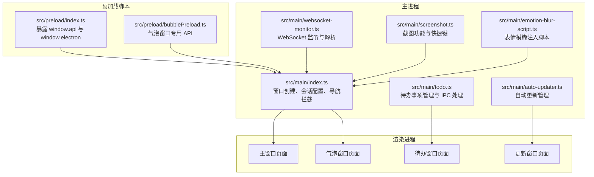
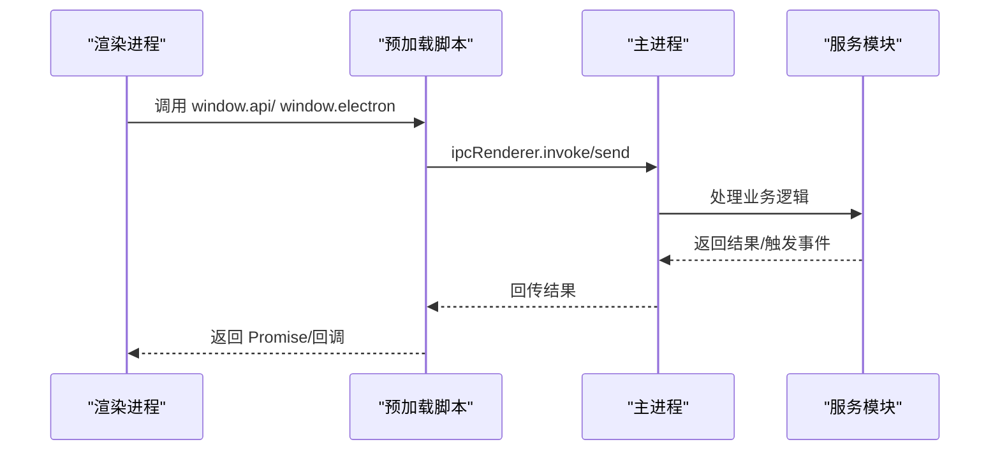
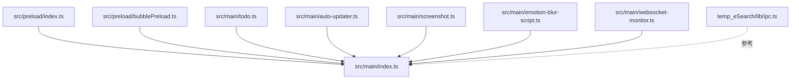
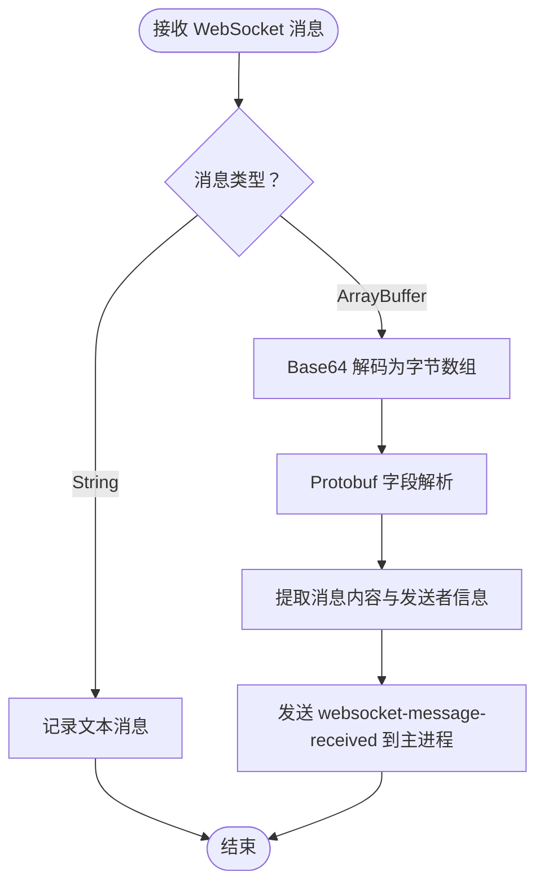

# API参考

<cite>
**本文档引用的文件**
- [src/preload/index.ts](file://src/preload/index.ts)
- [src/preload/bubblePreload.ts](file://src/preload/bubblePreload.ts)
- [src/main/index.ts](file://src/main/index.ts)
- [src/main/websocket-monitor.ts](file://src/main/websocket-monitor.ts)
- [src/main/todo.ts](file://src/main/todo.ts)
- [src/main/auto-updater.ts](file://src/main/auto-updater.ts)
- [src/main/screenshot.ts](file://src/main/screenshot.ts)
- [src/main/emotion-blur-script.ts](file://src/main/emotion-blur-script.ts)
- [src/preload/index.d.ts](file://src/preload/index.d.ts)
- [temp_eSearch/lib/ipc.ts](file://temp_eSearch/lib/ipc.ts)
</cite>

## 目录
1. [简介](#简介)
2. [项目结构](#项目结构)
3. [核心组件](#核心组件)
4. [架构总览](#架构总览)
5. [详细组件分析](#详细组件分析)
6. [依赖关系分析](#依赖关系分析)
7. [性能考量](#性能考量)
8. [故障排查指南](#故障排查指南)
9. [结论](#结论)
10. [附录](#附录)

## 简介
本文件为 WoaApp 的完整 API 参考文档，覆盖主进程与渲染进程之间的 IPC 通信接口、预加载脚本暴露的 API、以及主进程提供的服务接口。同时包含 WebSocket 实时通信接口的连接处理、消息格式与事件类型说明，并提供错误处理策略与异常情况的处理方案，确保 API 文档的准确性与实用性。

## 项目结构
该项目采用 Electron 架构，主要分为：
- 预加载脚本：在渲染进程中注入安全桥接 API
- 主进程：负责窗口管理、系统集成、IPC 事件处理、自动更新、截图、表情模糊等功能
- 渲染进程：业务页面与 UI，通过预加载脚本调用主进程能力

图表来源
- [src/preload/index.ts](file://src/preload/index.ts#L1-L63)
- [src/preload/bubblePreload.ts](file://src/preload/bubblePreload.ts#L1-L70)
- [src/main/index.ts](file://src/main/index.ts#L1-L236)
- [src/main/websocket-monitor.ts](file://src/main/websocket-monitor.ts#L1-L242)
- [src/main/todo.ts](file://src/main/todo.ts#L1-L266)
- [src/main/auto-updater.ts](file://src/main/auto-updater.ts#L1-L565)
- [src/main/screenshot.ts](file://src/main/screenshot.ts#L1-L158)
- [src/main/emotion-blur-script.ts](file://src/main/emotion-blur-script.ts#L1-L282)

章节来源
- [src/preload/index.ts](file://src/preload/index.ts#L1-L63)
- [src/main/index.ts](file://src/main/index.ts#L1-L236)

## 核心组件
本节概述各组件职责与对外暴露的 API。

- 预加载脚本暴露的 API（window.api 与 window.electron）
  - 通过 contextBridge 暴露安全 API，供渲染进程调用主进程能力
  - 包含截图、待办事项、表情模糊状态、自动更新等接口
- 主进程服务接口
  - 窗口控制、会话配置、导航拦截、WebSocket 监听、待办事项管理、自动更新、截图、表情模糊注入
- 气泡窗口专用 API（window.bubbleAPI）
  - 用于与主进程交互，如消息更新、通知模式更新、鼠标事件、清理消息等

章节来源
- [src/preload/index.ts](file://src/preload/index.ts#L4-L62)
- [src/preload/bubblePreload.ts](file://src/preload/bubblePreload.ts#L1-L70)
- [src/main/index.ts](file://src/main/index.ts#L1-L236)

## 架构总览
Electron 应用的 IPC 通信与安全桥接如下所示：

图表来源
- [src/preload/index.ts](file://src/preload/index.ts#L4-L62)
- [src/main/index.ts](file://src/main/index.ts#L1-L236)

## 详细组件分析

### 预加载脚本 API（window.api 与 window.electron）
- window.electron.ipcRenderer
  - send(channel, ...args)
  - invoke(channel, ...args) -> Promise
  - on(channel, listener)
  - off(channel, listener)
  - once(channel, listener)
  - removeAllListeners(channel)
- window.api（常用）
  - openBubbleDevtools(): void
  - takeScreenshot(): void
  - openTodoWindow(): void
  - getTodos(): Promise<TodoItem[]>
  - addTodo(todo: Omit<TodoItem, 'id' | 'timestamp' | 'processed'>): Promise<TodoItem>
  - updateTodo(todo: TodoItem): Promise<TodoItem>
  - deleteTodo(todoId: string): Promise<boolean>
  - getUnprocessedTodoCount(): Promise<number>
  - addTodoFromChat(text: string): void
  - getEmotionBlurState(): Promise<boolean>
  - setEmotionBlurState(state: boolean): Promise<void>
  - showUpdateDialog(): void
  - startUpdate(): Promise<void>
  - restartAndInstall(): Promise<void>

参数与返回值约定
- 所有 invoke 调用均返回 Promise，表示异步处理
- 所有 send 调用为单向通知，无返回值
- 参数类型遵循 TypeScript 接口定义，如 TodoItem

使用示例路径
- 调用主进程获取待办列表：[src/preload/index.ts](file://src/preload/index.ts#L27-L33)
- 调用主进程更新表情模糊状态：[src/preload/index.ts](file://src/preload/index.ts#L36-L42)

章节来源
- [src/preload/index.ts](file://src/preload/index.ts#L4-L62)
- [src/preload/index.d.ts](file://src/preload/index.d.ts#L1-L23)

### 气泡窗口专用 API（window.bubbleAPI）
- onUpdateMessage(callback(messages)): void
- onUpdateNotificationMode(callback(mode)): void
- bubbleReady(): void
- bubbleMouseEnter(): void
- bubbleMouseLeave(): void
- notificationClicked(): void
- clearSingleMessage(message): void
- clearAllMessages(): void
- openBubbleDevtools(): void
- removeAllListeners(): void

使用示例路径
- 监听消息更新事件：[src/preload/bubblePreload.ts](file://src/preload/bubblePreload.ts#L7-L11)
- 发送气泡窗口就绪事件：[src/preload/bubblePreload.ts](file://src/preload/bubblePreload.ts#L21-L23)

章节来源
- [src/preload/bubblePreload.ts](file://src/preload/bubblePreload.ts#L1-L70)

### 主进程服务接口

#### 窗口与会话管理
- 主窗口创建与会话配置
  - createWindow(): Promise<void>
  - 会话权限请求、证书验证、网络拦截、导航控制等
- 气泡窗口创建
  - createBubbleWindow(): void
  - 支持开发/生产环境不同资源加载方式
- 关闭事件与最小化处理
  - 主窗口与气泡窗口的关闭事件统一隐藏逻辑

使用示例路径
- 主窗口创建与会话配置：[src/main/index.ts](file://src/main/index.ts#L276-L615)
- 气泡窗口创建与资源加载：[src/main/index.ts](file://src/main/index.ts#L617-L764)

章节来源
- [src/main/index.ts](file://src/main/index.ts#L276-L764)

#### 待办事项管理（IPC）
- IPC 事件与处理
  - open-todo-window
  - get-todos
  - add-todo
  - update-todo
  - delete-todo
  - get-unprocessed-todo-count
  - add-todo-from-chat
- 渲染进程交互
  - 注入脚本在主窗口注入待办图标与右键菜单项
  - 监听未处理数量更新事件

使用示例路径
- 注册 IPC 处理器：[src/main/todo.ts](file://src/main/todo.ts#L77-L136)
- 注入脚本与右键菜单：[src/main/todo.ts](file://src/main/todo.ts#L160-L264)

章节来源
- [src/main/todo.ts](file://src/main/todo.ts#L1-L266)

#### 自动更新管理（IPC）
- IPC 处理器
  - check-for-updates
  - get-current-version
  - get-latest-version-info
  - start-update
  - show-update-dialog
  - restart-and-install
- 更新流程
  - 定时检查版本
  - 下载最新版本描述文件
  - 下载更新包并安装
  - 注入更新图标到网页

使用示例路径
- IPC 处理器注册：[src/main/auto-updater.ts](file://src/main/auto-updater.ts#L82-L131)
- 版本比较与更新类型处理：[src/main/auto-updater.ts](file://src/main/auto-updater.ts#L254-L295)
- 注入更新图标：[src/main/auto-updater.ts](file://src/main/auto-updater.ts#L355-L431)

章节来源
- [src/main/auto-updater.ts](file://src/main/auto-updater.ts#L1-L565)

#### 截图功能（IPC）
- 快捷键 Alt+Shift+A 触发截图
- 截图完成自动复制到剪贴板
- 截图保存对话框与文件写入
- 注入截图按钮到页面

使用示例路径
- 初始化截图与快捷键注册：[src/main/screenshot.ts](file://src/main/screenshot.ts#L16-L78)
- 注入截图按钮脚本：[src/main/screenshot.ts](file://src/main/screenshot.ts#L102-L140)

章节来源
- [src/main/screenshot.ts](file://src/main/screenshot.ts#L1-L158)

#### 表情模糊功能（注入脚本）
- 注入 CSS 样式与按钮
- 切换模糊状态并持久化
- 观察消息容器变化并应用模糊

使用示例路径
- 注入脚本与按钮创建：[src/main/emotion-blur-script.ts](file://src/main/emotion-blur-script.ts#L56-L119)
- 切换模糊状态与持久化：[src/main/emotion-blur-script.ts](file://src/main/emotion-blur-script.ts#L121-L164)

章节来源
- [src/main/emotion-blur-script.ts](file://src/main/emotion-blur-script.ts#L1-L282)

### WebSocket 实时通信接口

#### 连接处理
- 主进程通过注入脚本拦截 WebSocket 连接
- 监听 onmessage 事件，解析二进制消息
- 提取消息内容与发送者信息，发送至主进程

使用示例路径
- WebSocket 监听与拦截：[src/main/websocket-monitor.ts](file://src/main/websocket-monitor.ts#L162-L210)
- 消息解析与提取：[src/main/websocket-monitor.ts](file://src/main/websocket-monitor.ts#L103-L160)

章节来源
- [src/main/websocket-monitor.ts](file://src/main/websocket-monitor.ts#L1-L242)

#### 消息格式与事件类型
- 输入
  - 二进制消息（ArrayBuffer）：Base64 编码后解码为字节数组
  - Protobuf 字段解析：支持 varint 与 length-delimited 类型
- 输出
  - 主进程事件：websocket-message-received
  - 渲染进程事件：update-message（气泡窗口）

使用示例路径
- Base64 解码与字节解析：[src/main/websocket-monitor.ts](file://src/main/websocket-monitor.ts#L104-L123)
- 发送消息到主进程：[src/main/websocket-monitor.ts](file://src/main/websocket-monitor.ts#L189-L193)

章节来源
- [src/main/websocket-monitor.ts](file://src/main/websocket-monitor.ts#L103-L210)

#### 主进程消息处理
- 接收 websocket-message-received 事件
- 去重与消息列表维护
- 推送 update-message 到气泡窗口

使用示例路径
- 接收并处理消息：[src/main/index.ts](file://src/main/index.ts#L1832-L1841)
- 推送消息到气泡窗口：[src/main/index.ts](file://src/main/index.ts#L1820-L1822)

章节来源
- [src/main/index.ts](file://src/main/index.ts#L1831-L1841)

## 依赖关系分析

图表来源
- [src/preload/index.ts](file://src/preload/index.ts#L1-L63)
- [src/preload/bubblePreload.ts](file://src/preload/bubblePreload.ts#L1-L70)
- [src/main/index.ts](file://src/main/index.ts#L1-L236)
- [src/main/todo.ts](file://src/main/todo.ts#L1-L266)
- [src/main/auto-updater.ts](file://src/main/auto-updater.ts#L1-L565)
- [src/main/screenshot.ts](file://src/main/screenshot.ts#L1-L158)
- [src/main/emotion-blur-script.ts](file://src/main/emotion-blur-script.ts#L1-L282)
- [src/main/websocket-monitor.ts](file://src/main/websocket-monitor.ts#L1-L242)
- [temp_eSearch/lib/ipc.ts](file://temp_eSearch/lib/ipc.ts#L1-L273)

章节来源
- [src/main/index.ts](file://src/main/index.ts#L1-L236)

## 性能考量
- 网络拦截与请求放行
  - 主进程对 webRequest 进行宽松拦截，减少跨域与重定向限制，提升页面加载稳定性
- 背景节流禁用
  - 禁用 backgroundThrottling，确保窗口与脚本在后台仍保持活跃
- 会话持久化
  - 使用持久化会话分区与 cookies 持久化策略，减少重复登录成本
- 截图与更新窗口
  - 截图功能使用全局快捷键与异步回调，避免阻塞 UI
  - 更新窗口采用一次性注入与事件驱动，降低资源消耗

章节来源
- [src/main/index.ts](file://src/main/index.ts#L286-L301)
- [src/main/index.ts](file://src/main/index.ts#L304-L364)
- [src/main/screenshot.ts](file://src/main/screenshot.ts#L16-L78)
- [src/main/auto-updater.ts](file://src/main/auto-updater.ts#L311-L353)

## 故障排查指南
- IPC 事件未触发
  - 检查预加载脚本是否正确暴露 API：[src/preload/index.ts](file://src/preload/index.ts#L48-L62)
  - 确认主进程是否注册对应 ipcMain.handle/on：[src/main/todo.ts](file://src/main/todo.ts#L77-L136)
- WebSocket 消息未解析
  - 确认注入脚本已执行：[src/main/websocket-monitor.ts](file://src/main/websocket-monitor.ts#L229-L236)
  - 检查 Protobuf 解析逻辑与字段提取：[src/main/websocket-monitor.ts](file://src/main/websocket-monitor.ts#L103-L160)
- 截图功能无效
  - 检查全局快捷键注册与取消注册逻辑：[src/main/screenshot.ts](file://src/main/screenshot.ts#L19-L42)
  - 确认截图按钮注入是否成功：[src/main/screenshot.ts](file://src/main/screenshot.ts#L102-L140)
- 自动更新下载失败
  - 检查 API 地址与协议选择：[src/main/auto-updater.ts](file://src/main/auto-updater.ts#L224-L252)
  - 开发模式下的进度模拟与错误上报：[src/main/auto-updater.ts](file://src/main/auto-updater.ts#L475-L515)
- 错误处理策略
  - 主进程异常捕获与日志输出：[src/main/index.ts](file://src/main/index.ts#L183-L273)
  - 自动更新错误事件监听：[src/main/auto-updater.ts](file://src/main/auto-updater.ts#L167-L170)

章节来源
- [src/main/index.ts](file://src/main/index.ts#L183-L273)
- [src/main/websocket-monitor.ts](file://src/main/websocket-monitor.ts#L103-L160)
- [src/main/screenshot.ts](file://src/main/screenshot.ts#L19-L42)
- [src/main/auto-updater.ts](file://src/main/auto-updater.ts#L224-L252)

## 结论
本 API 参考文档系统梳理了 WoaApp 的 IPC 通信、预加载脚本暴露的 API、主进程服务接口以及 WebSocket 实时通信接口。通过明确的参数说明、返回值类型、使用示例与故障排查指南，帮助开发者快速集成与扩展功能。建议在后续迭代中进一步完善类型定义与错误码规范，增强 API 的可维护性与一致性。

## 附录

### IPC 事件清单（主进程 ↔ 渲染进程）
- 窗口控制
  - open-todo-window
  - hide-bubble-window
  - take-screenshot
- 数据操作
  - get-todos
  - add-todo
  - update-todo
  - delete-todo
  - get-unprocessed-todo-count
  - add-todo-from-chat
- 消息处理
  - update-unread-count
  - update-message
- 系统事件
  - ping/pong
  - open-feedback

章节来源
- [src/main/index.ts](file://src/main/index.ts#L120-L139)
- [src/main/todo.ts](file://src/main/todo.ts#L77-L136)
- [src/main/index.ts](file://src/main/index.ts#L1831-L1841)

### WebSocket 消息解析流程

图表来源
- [src/main/websocket-monitor.ts](file://src/main/websocket-monitor.ts#L103-L210)
- [src/main/index.ts](file://src/main/index.ts#L1831-L1841)