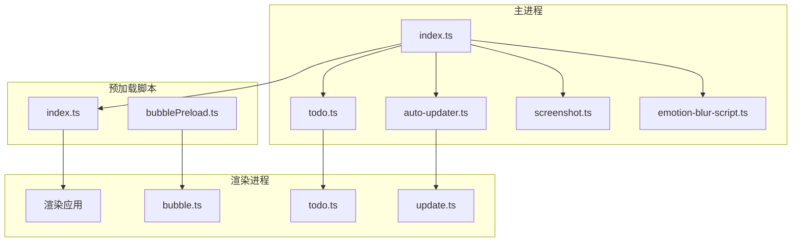
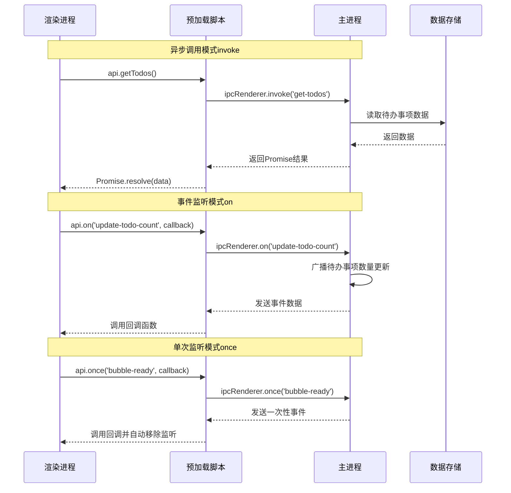
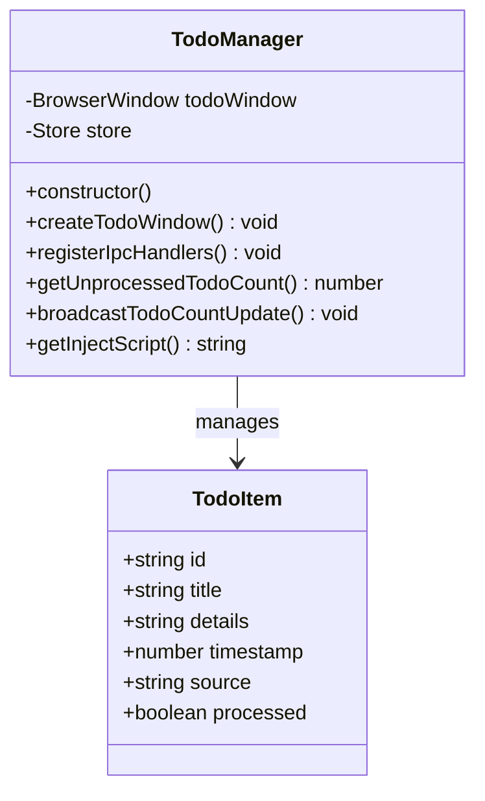
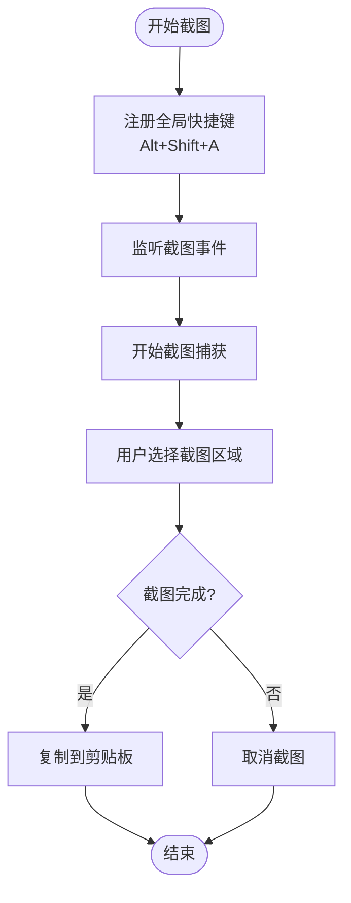
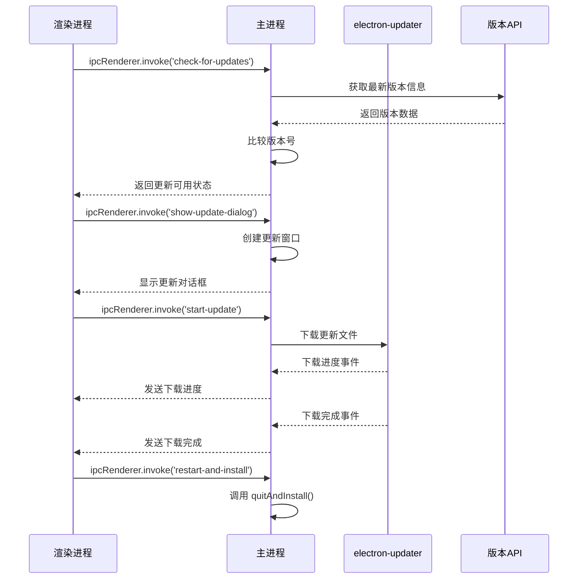
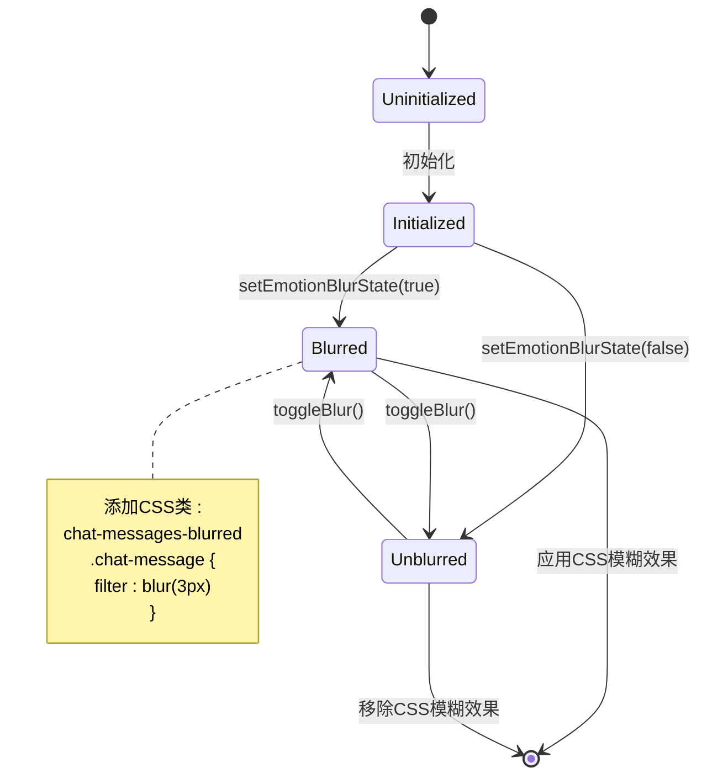
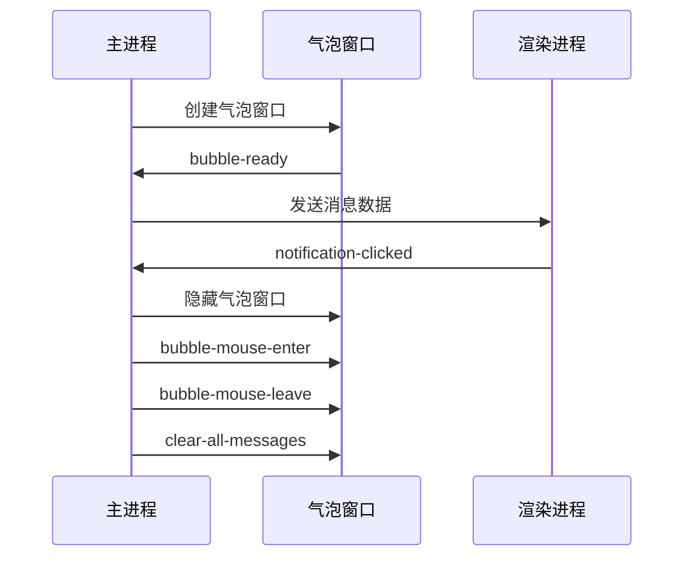
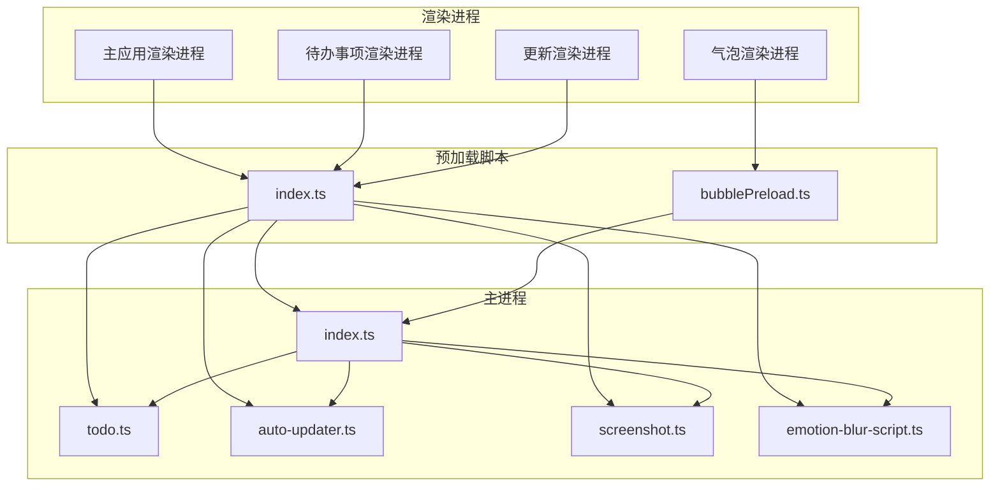

# IPC通信接口

<cite>
**本文档引用的文件**
- [src/preload/index.ts](file://src/preload/index.ts)
- [src/main/index.ts](file://src/main/index.ts)
- [src/main/todo.ts](file://src/main/todo.ts)
- [src/main/auto-updater.ts](file://src/main/auto-updater.ts)
- [src/main/screenshot.ts](file://src/main/screenshot.ts)
- [src/main/emotion-blur-script.ts](file://src/main/emotion-blur-script.ts)
- [src/preload/bubblePreload.ts](file://src/preload/bubblePreload.ts)
- [src/renderer/src/update.ts](file://src/renderer/src/update.ts)
- [src/renderer/src/components/Update.vue](file://src/renderer/src/components/Update.vue)
- [src/renderer/update.html](file://src/renderer/update.html)
- [temp_eSearch/lib/ipc.ts](file://temp_eSearch/lib/ipc.ts)
</cite>

## 更新摘要
**变更内容**
- 新增自动更新模块的IPC接口规范
- 更新预加载脚本API，新增showUpdateDialog、startUpdate、restartAndInstall方法
- 增强IPC通信接口文档，涵盖完整的更新流程

## 目录
1. [简介](#简介)
2. [项目结构](#项目结构)
3. [核心组件](#核心组件)
4. [架构概览](#架构概览)
5. [详细组件分析](#详细组件分析)
6. [依赖关系分析](#依赖关系分析)
7. [性能考虑](#性能考虑)
8. [故障排除指南](#故障排除指南)
9. [结论](#结论)

## 简介

本文档详细记录了WoaApp项目中的IPC（进程间通信）通信接口规范。该应用采用Electron框架构建，实现了主进程与渲染进程之间的双向通信，涵盖了待办事项管理、截图功能、自动更新、表情模糊状态管理等多个模块的IPC接口。

IPC通信主要通过以下几种方式实现：
- **异步调用模式**：使用`ipcRenderer.invoke()`和`ipcMain.handle()`进行请求-响应通信
- **事件监听机制**：使用`ipcRenderer.on()`和`ipcMain.on()`进行事件驱动通信
- **单次监听**：使用`ipcRenderer.once()`进行一次性事件监听
- **移除监听**：使用`ipcRenderer.off()`移除事件监听器

## 项目结构

该项目采用典型的Electron应用结构，包含主进程、预加载脚本和渲染进程三个主要部分：



**图表来源**
- [src/main/index.ts](file://src/main/index.ts#L1-L2406)
- [src/preload/index.ts](file://src/preload/index.ts#L1-L63)

## 核心组件

### 预加载脚本中的IPC接口

预加载脚本通过`contextBridge` API向渲染进程暴露了安全的IPC接口：

#### Electron API桥接
- `electron.ipcRenderer`: 包装了标准的IPC方法
  - `send()`: 发送消息（无返回值）
  - `invoke()`: 发起异步调用（有返回值）
  - `on()`: 注册事件监听器
  - `off()`: 移除事件监听器
  - `once()`: 注册一次性事件监听器
  - `removeAllListeners()`: 移除所有监听器

#### 自定义API接口
- `openBubbleDevtools()`: 打开气泡窗口开发者工具
- `takeScreenshot()`: 触发截图功能
- `openTodoWindow()`: 打开待办事项窗口
- `getTodos()`: 获取所有待办事项
- `addTodo()`: 添加新的待办事项
- `updateTodo()`: 更新现有待办事项
- `deleteTodo()`: 删除待办事项
- `getUnprocessedTodoCount()`: 获取未处理待办事项数量
- `addTodoFromChat()`: 从聊天内容创建待办事项
- `getEmotionBlurState()`: 获取表情模糊状态
- `setEmotionBlurState()`: 设置表情模糊状态
- `showUpdateDialog()`: 显示更新对话框
- `startUpdate()`: 开始更新流程
- `restartAndInstall()`: 重启并安装更新

**章节来源**
- [src/preload/index.ts](file://src/preload/index.ts#L1-L63)

### 主进程中的IPC处理器

主进程通过`ipcMain`注册各种IPC处理器来响应渲染进程的请求：

#### 待办事项管理处理器
- `open-todo-window`: 创建或显示待办事项窗口
- `get-todos`: 返回所有待办事项数据
- `add-todo`: 添加新的待办事项并返回新项
- `update-todo`: 更新现有待办事项并返回更新结果
- `delete-todo`: 删除指定ID的待办事项
- `get-unprocessed-todo-count`: 返回未处理待办事项的数量
- `add-todo-from-chat`: 从聊天内容创建待办事项

#### 自动更新处理器
- `check-for-updates`: 检查可用更新
- `get-current-version`: 返回当前应用版本
- `get-latest-version-info`: 返回最新版本信息
- `start-update`: 开始下载并安装更新
- `show-update-dialog`: 显示更新对话框
- `restart-and-install`: 重启并安装更新

#### 截图功能处理器
- `start-screenshot`: 开始截图操作

#### 表情模糊状态处理器
- `get-emotion-blur-state`: 获取表情模糊状态
- `set-emotion-blur-state`: 设置表情模糊状态

**章节来源**
- [src/main/todo.ts](file://src/main/todo.ts#L77-L136)
- [src/main/auto-updater.ts](file://src/main/auto-updater.ts#L82-L131)
- [src/main/screenshot.ts](file://src/main/screenshot.ts#L155-L158)
- [src/main/index.ts](file://src/main/index.ts#L1388-L1393)

## 架构概览

系统采用分层架构设计，实现了清晰的职责分离：



**图表来源**
- [src/preload/index.ts](file://src/preload/index.ts#L25-L43)
- [src/main/todo.ts](file://src/main/todo.ts#L149-L154)

## 详细组件分析

### 待办事项管理模块

#### IPC接口规范

| 接口名称 | 调用方式 | 参数类型 | 返回值类型 | 使用场景 |
|---------|---------|----------|-----------|----------|
| `open-todo-window` | send | 无 | void | 打开待办事项窗口 |
| `get-todos` | invoke | 无 | TodoItem[] | 获取所有待办事项 |
| `add-todo` | invoke | Omit<TodoItem, 'id' \| 'timestamp' \| 'processed'> | TodoItem | 添加新待办事项 |
| `update-todo` | invoke | TodoItem | TodoItem | 更新现有待办事项 |
| `delete-todo` | invoke | string | boolean | 删除指定ID的待办事项 |
| `get-unprocessed-todo-count` | invoke | 无 | number | 获取未处理待办事项数量 |
| `add-todo-from-chat` | send | string | void | 从聊天内容创建待办事项 |

#### 数据模型



**图表来源**
- [src/main/todo.ts](file://src/main/todo.ts#L6-L14)
- [src/main/todo.ts](file://src/main/todo.ts#L20-L33)

#### 实际调用示例

```typescript
// 获取所有待办事项
const todos = await window.api.getTodos()

// 添加新待办事项
const newTodo = await window.api.addTodo({
  title: "任务标题",
  details: "任务详情",
  source: "用户输入"
})

// 监听待办事项数量变化
window.electron.ipcRenderer.on('update-todo-count', (event, count) => {
  console.log(`未处理任务数量: ${count}`)
})
```

**章节来源**
- [src/main/todo.ts](file://src/main/todo.ts#L77-L136)
- [src/preload/index.ts](file://src/preload/index.ts#L25-L33)

### 截图功能模块

#### IPC接口规范

| 接口名称 | 调用方式 | 参数类型 | 返回值类型 | 使用场景 |
|---------|---------|----------|-----------|----------|
| `start-screenshot` | send | 无 | void | 开始截图操作 |
| `take-screenshot` | send | 无 | void | 触发截图功能 |

#### 截图流程



**图表来源**
- [src/main/screenshot.ts](file://src/main/screenshot.ts#L16-L96)

#### 实际调用示例

```typescript
// 触发截图功能
window.api.takeScreenshot()

// 监听截图完成事件
window.electron.ipcRenderer.on('screenshot-complete', (event, imageData) => {
  // 处理截图数据
  console.log('截图完成:', imageData)
})
```

**章节来源**
- [src/main/screenshot.ts](file://src/main/screenshot.ts#L155-L158)
- [src/preload/index.ts](file://src/preload/index.ts#L22-L23)

### 自动更新模块

#### IPC接口规范

**更新** 新增自动更新模块的完整IPC接口规范

| 接口名称 | 调用方式 | 参数类型 | 返回值类型 | 使用场景 |
|---------|---------|----------|-----------|----------|
| `check-for-updates` | invoke | 无 | boolean | 检查可用更新 |
| `get-current-version` | invoke | 无 | string | 获取当前版本号 |
| `get-latest-version-info` | invoke | 无 | VersionInfo | 获取最新版本信息 |
| `start-update` | invoke | 无 | void | 开始下载更新 |
| `show-update-dialog` | invoke | VersionInfo? | void | 显示更新对话框 |
| `restart-and-install` | invoke | 无 | void | 重启并安装更新 |

#### 更新流程



**图表来源**
- [src/main/auto-updater.ts](file://src/main/auto-updater.ts#L82-L131)
- [src/main/auto-updater.ts](file://src/main/auto-updater.ts#L154-L186)

#### 实际调用示例

```typescript
// 检查更新
const hasUpdate = await window.api.checkForUpdates()
if (hasUpdate) {
  await window.api.showUpdateDialog()
}

// 开始更新
await window.api.startUpdate()

// 重启安装
await window.api.restartAndInstall()
```

**章节来源**
- [src/main/auto-updater.ts](file://src/main/auto-updater.ts#L82-L131)
- [src/preload/index.ts](file://src/preload/index.ts#L39-L42)

### 表情模糊状态管理模块

#### IPC接口规范

| 接口名称 | 调用方式 | 参数类型 | 返回值类型 | 使用场景 |
|---------|---------|----------|-----------|----------|
| `get-emotion-blur-state` | invoke | 无 | boolean | 获取表情模糊状态 |
| `set-emotion-blur-state` | invoke | boolean | void | 设置表情模糊状态 |

#### 状态管理流程



**图表来源**
- [src/main/emotion-blur-script.ts](file://src/main/emotion-blur-script.ts#L121-L164)

#### 实际调用示例

```typescript
// 获取当前模糊状态
const isBlurred = await window.api.getEmotionBlurState()

// 设置模糊状态
await window.api.setEmotionBlurState(true)

// 监听状态变化
window.electron.ipcRenderer.on('emotion-blur-state-changed', (event, state) => {
  console.log('模糊状态:', state ? '开启' : '关闭')
})
```

**章节来源**
- [src/main/emotion-blur-script.ts](file://src/main/emotion-blur-script.ts#L14-L30)
- [src/preload/index.ts](file://src/preload/index.ts#L35-L37)

### 气泡窗口通信模块

#### IPC接口规范

| 接口名称 | 调用方式 | 参数类型 | 返回值类型 | 使用场景 |
|---------|---------|----------|-----------|----------|
| `update-message` | send | any[] | void | 更新气泡消息 |
| `update-notification-mode` | send | string | void | 更新通知模式 |
| `bubble-ready` | send | 无 | void | 气泡窗口就绪 |
| `bubble-mouse-enter` | send | 无 | void | 鼠标进入气泡 |
| `bubble-mouse-leave` | send | 无 | void | 鼠标离开气泡 |
| `notification-clicked` | send | 无 | void | 通知被点击 |
| `clear-single-message` | send | any | void | 清除单条消息 |
| `clear-all-messages` | send | 无 | void | 清除所有消息 |
| `open-bubble-devtools` | send | 无 | void | 打开开发者工具 |

#### 气泡窗口生命周期



**图表来源**
- [src/preload/bubblePreload.ts](file://src/preload/bubblePreload.ts#L20-L59)

**章节来源**
- [src/preload/bubblePreload.ts](file://src/preload/bubblePreload.ts#L1-L70)

## 依赖关系分析

### IPC通信依赖图



**图表来源**
- [src/preload/index.ts](file://src/preload/index.ts#L48-L62)
- [src/main/index.ts](file://src/main/index.ts#L102-L110)

### 模块耦合度分析

系统采用了松耦合的设计模式：

1. **预加载脚本解耦**: 通过`contextBridge` API提供统一的IPC接口
2. **模块独立性**: 各功能模块通过独立的IPC处理器实现
3. **事件广播**: 使用`BrowserWindow.getAllWindows()`实现跨窗口通信
4. **状态持久化**: 通过`electron-store`实现数据持久化

**章节来源**
- [src/main/todo.ts](file://src/main/todo.ts#L149-L154)
- [src/main/index.ts](file://src/main/index.ts#L102-L110)

## 性能考虑

### IPC调用性能优化

1. **批量数据传输**: 对于大量数据传输，建议使用批量处理减少IPC调用次数
2. **事件去抖动**: 对于频繁触发的事件，使用防抖机制避免过度更新
3. **内存管理**: 及时移除不再使用的事件监听器，防止内存泄漏
4. **异步处理**: 优先使用异步调用模式避免阻塞主线程

### 最佳实践

- **错误处理**: 为所有IPC调用添加适当的错误处理机制
- **超时控制**: 为长时间运行的操作设置超时机制
- **数据验证**: 在主进程中对所有传入数据进行验证
- **资源清理**: 确保在应用退出时清理所有IPC监听器和定时器

## 故障排除指南

### 常见问题及解决方案

#### IPC调用失败
**症状**: `ipcRenderer.invoke()`返回undefined或抛出异常
**原因**: 主进程未注册相应的`ipcMain.handle()`处理器
**解决方案**: 检查主进程中的IPC处理器注册，确保处理器名称与调用名称一致

#### 事件监听失效
**症状**: `ipcRenderer.on()`注册的监听器无法接收事件
**原因**: 监听器在事件发送后被移除或作用域问题
**解决方案**: 使用`ipcRenderer.once()`进行一次性监听，或确保监听器在整个应用生命周期内有效

#### 数据传输异常
**症状**: 传入或传出的数据格式不正确
**原因**: 缺少数据序列化/反序列化处理
**解决方案**: 确保传输的数据是可序列化的，避免传递复杂对象

#### 内存泄漏
**症状**: 应用运行时间越长内存占用越大
**原因**: 未及时移除IPC监听器
**解决方案**: 在组件销毁时调用`ipcRenderer.removeAllListeners()`清理监听器

**章节来源**
- [src/preload/index.ts](file://src/preload/index.ts#L48-L62)
- [src/main/todo.ts](file://src/main/todo.ts#L149-L154)

## 结论

WoaApp项目的IPC通信接口设计体现了现代Electron应用的最佳实践：

1. **安全性**: 通过预加载脚本和`contextBridge` API实现了安全的IPC接口暴露
2. **模块化**: 各功能模块拥有独立的IPC处理器，便于维护和扩展
3. **异步性**: 采用异步调用模式确保UI响应性
4. **事件驱动**: 通过事件监听机制实现松耦合的组件通信
5. **状态管理**: 通过electron-store实现数据持久化和状态同步

该IPC接口规范为开发者提供了清晰的通信协议，支持待办事项管理、截图功能、自动更新、表情模糊状态管理等核心功能，为构建复杂的桌面应用程序奠定了坚实的基础。

**更新** 新增的自动更新模块提供了完整的版本管理和更新机制，包括版本检查、更新下载、进度监控和自动安装等功能，增强了应用的可维护性和用户体验。