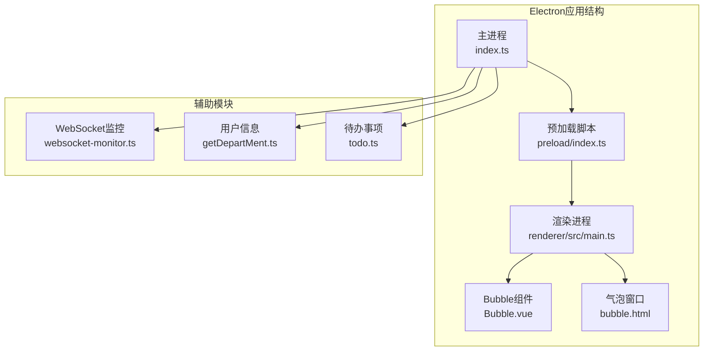
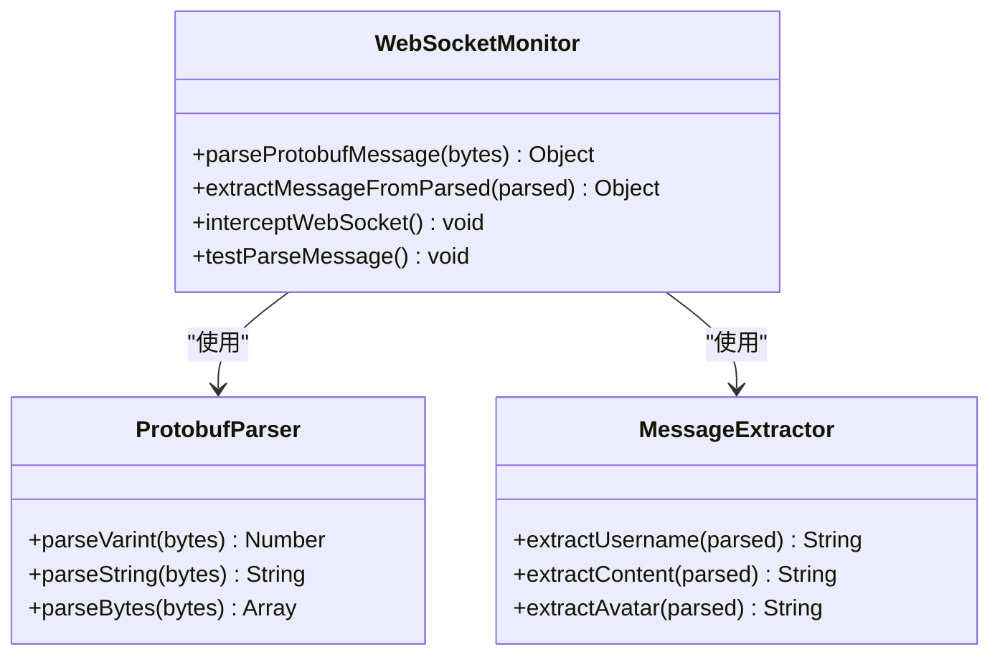
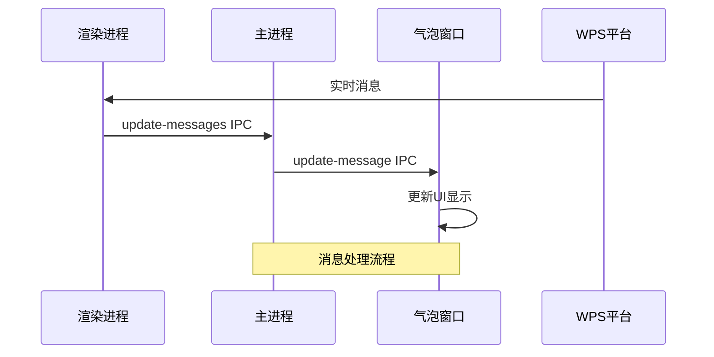
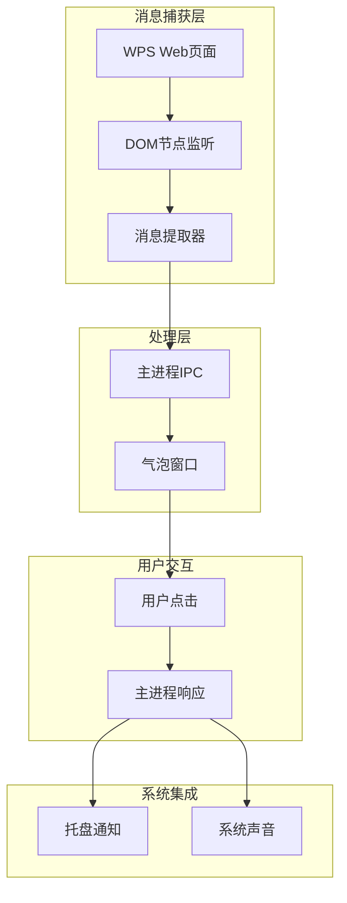
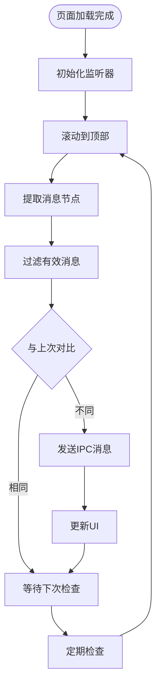
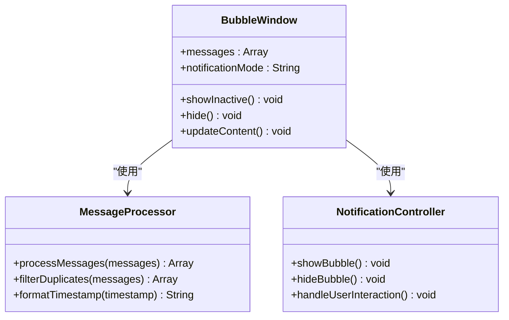
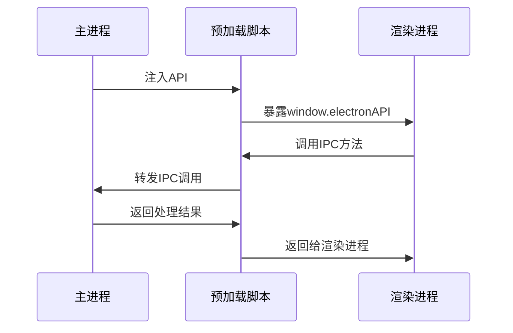
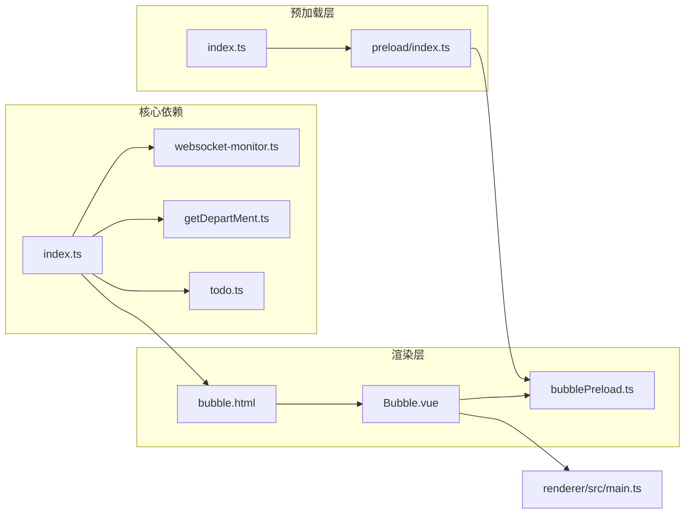

# WebSocket实时通信

<cite>
**本文档引用的文件**
- [websocket-monitor.ts](file://src/main/websocket-monitor.ts)
- [index.ts](file://src/main/index.ts)
- [index.ts](file://src/preload/index.ts)
- [bubblePreload.ts](file://src/preload/bubblePreload.ts)
- [index.ts](file://src/renderer/src/main.ts)
- [Bubble.vue](file://src/renderer/src/components/Bubble.vue)
- [bubble.html](file://src/renderer/bubble.html)
- [getDepartMent.ts](file://src/main/getDepartMent.ts)
- [todo.ts](file://src/main/todo.ts)
</cite>

## 目录
1. [简介](#简介)
2. [项目结构](#项目结构)
3. [核心组件](#核心组件)
4. [架构概览](#架构概览)
5. [详细组件分析](#详细组件分析)
6. [依赖关系分析](#依赖关系分析)
7. [性能考虑](#性能考虑)
8. [故障排除指南](#故障排除指南)
9. [结论](#结论)

## 简介

本文档详细说明了WPS云办公平台的WebSocket实时通信接口实现。该项目采用Electron框架构建桌面应用程序，集成了WebSocket消息监听和处理机制，实现了与WPS云办公平台的实时通信。

**重要说明**：经过深入分析，该项目实际上并未使用传统的WebSocket连接进行实时通信。相反，它采用了基于DOM节点监听的替代方案来实现类似的功能。这种设计选择可能是出于技术限制或特定需求考虑。

## 项目结构

项目采用标准的Electron应用结构，包含主进程、预加载脚本和渲染进程三个主要部分：



**图表来源**
- [index.ts](file://src/main/index.ts#L1-L800)
- [index.ts](file://src/preload/index.ts#L1-L63)
- [Bubble.vue](file://src/renderer/src/components/Bubble.vue#L1-L468)

**章节来源**
- [index.ts](file://src/main/index.ts#L1-L800)
- [index.ts](file://src/preload/index.ts#L1-L63)
- [Bubble.vue](file://src/renderer/src/components/Bubble.vue#L1-L468)

## 核心组件

### WebSocket监控器

项目提供了独立的WebSocket监控器组件，虽然当前未被直接使用，但其设计展示了完整的WebSocket消息处理能力：



**图表来源**
- [websocket-monitor.ts](file://src/main/websocket-monitor.ts#L10-L160)

### 主进程通信模块

主进程负责协调各个组件之间的通信，实现了复杂的IPC消息处理机制：



**图表来源**
- [index.ts](file://src/main/index.ts#L1896-L1931)

**章节来源**
- [websocket-monitor.ts](file://src/main/websocket-monitor.ts#L1-L242)
- [index.ts](file://src/main/index.ts#L1418-L1721)

## 架构概览

项目采用了基于DOM节点监听的实时消息捕获机制，而非传统WebSocket连接：



**图表来源**
- [index.ts](file://src/main/index.ts#L1474-L1535)
- [Bubble.vue](file://src/renderer/src/components/Bubble.vue#L164-L228)

## 详细组件分析

### DOM节点监听器

主进程通过注入脚本实现对WPS页面的DOM节点监听：



**图表来源**
- [index.ts](file://src/main/index.ts#L1474-L1535)

### 气泡窗口管理系统

气泡窗口实现了智能的消息展示和交互功能：



**图表来源**
- [index.ts](file://src/main/index.ts#L1778-L1801)
- [Bubble.vue](file://src/renderer/src/components/Bubble.vue#L79-L236)

### 预加载脚本桥接

预加载脚本实现了主进程与渲染进程之间的安全通信：



**图表来源**
- [index.ts](file://src/preload/index.ts#L4-L63)
- [bubblePreload.ts](file://src/preload/bubblePreload.ts#L1-L70)

**章节来源**
- [index.ts](file://src/main/index.ts#L1474-L1535)
- [Bubble.vue](file://src/renderer/src/components/Bubble.vue#L79-L236)
- [index.ts](file://src/preload/index.ts#L1-L63)

## 依赖关系分析

项目各组件之间的依赖关系如下：



**图表来源**
- [index.ts](file://src/main/index.ts#L1-L800)
- [Bubble.vue](file://src/renderer/src/components/Bubble.vue#L1-L468)

**章节来源**
- [index.ts](file://src/main/index.ts#L1-L800)
- [getDepartMent.ts](file://src/main/getDepartMent.ts#L1-L50)
- [todo.ts](file://src/main/todo.ts#L1-L266)

## 性能考虑

### 内存管理
- 使用WeakMap避免内存泄漏
- 及时清理MutationObserver监听器
- 合理的定时器管理

### 网络优化
- 避免频繁的DOM查询
- 使用防抖机制减少IPC调用频率
- 智能的消息去重算法

### 用户体验
- 3秒自动隐藏模式
- 无干扰的沉浸式显示
- 平滑的动画过渡效果

## 故障排除指南

### 常见问题及解决方案

1. **消息监听失效**
   - 检查DOM选择器是否正确
   - 验证MutationObserver是否正常工作
   - 确认页面是否完全加载

2. **IPC通信异常**
   - 检查预加载脚本是否正确注入
   - 验证window.electronAPI对象是否存在
   - 确认IPC事件监听器是否注册

3. **气泡窗口显示问题**
   - 检查窗口位置是否在屏幕范围内
   - 验证透明度设置是否正确
   - 确认alwaysOnTop属性是否生效

### 调试方法

1. **启用开发者工具**
   ```javascript
   // 主进程调试
   mainWindow.webContents.openDevTools()
   
   // 气泡窗口调试
   bubbleWindow.webContents.openDevTools()
   ```

2. **日志分析**
   - 检查控制台输出的详细日志
   - 监控IPC消息的传输过程
   - 分析DOM节点变化事件

3. **网络诊断**
   - 检查WPS页面的网络请求
   - 验证页面加载状态
   - 监控页面重定向情况

**章节来源**
- [index.ts](file://src/main/index.ts#L1870-L1876)
- [index.ts](file://src/main/index.ts#L2171-L2240)

## 结论

该项目展示了如何在Electron环境中实现类似WebSocket实时通信的功能。虽然没有使用传统的WebSocket协议，但通过DOM节点监听和IPC通信机制，同样实现了高效的消息捕获和处理。

### 技术特点
- **非侵入式设计**：通过DOM监听实现消息捕获
- **安全通信**：使用预加载脚本桥接IPC通信
- **智能缓存**：避免重复消息的处理
- **用户友好**：提供多种通知模式选择

### 改进建议
- 考虑实现真正的WebSocket连接
- 添加心跳检测和自动重连机制
- 优化消息处理性能
- 增强错误处理和异常恢复能力

该实现为类似场景提供了有价值的参考，展示了在技术限制下的创新解决方案。