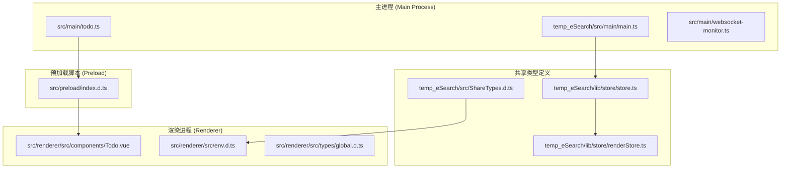
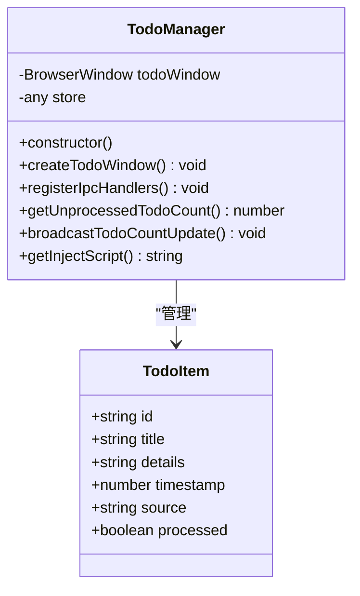
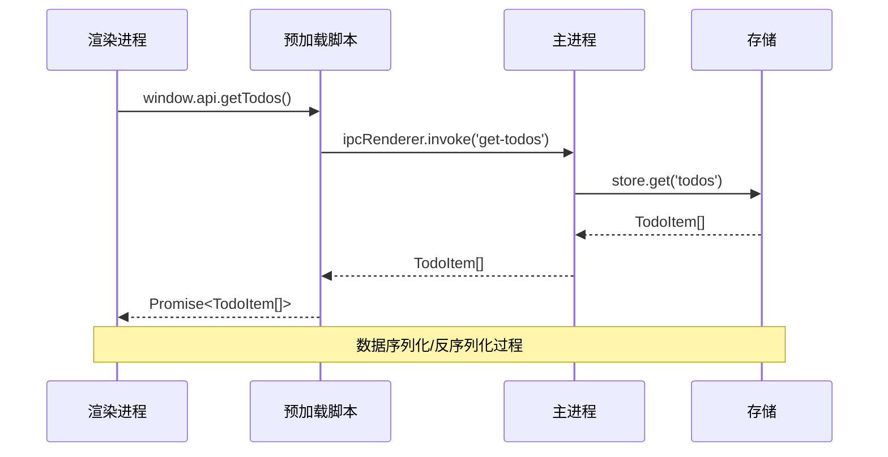
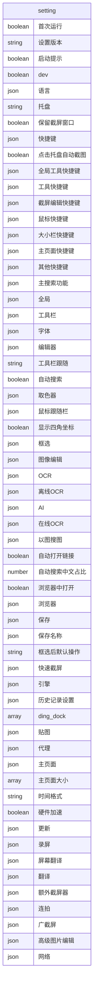
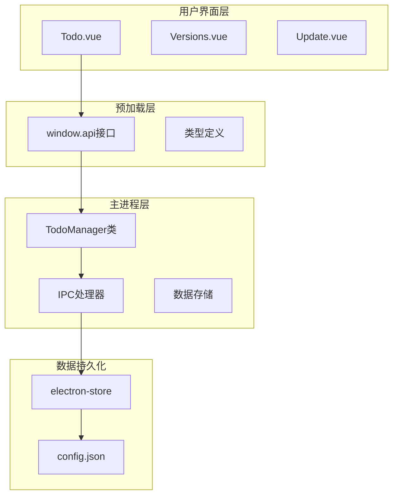
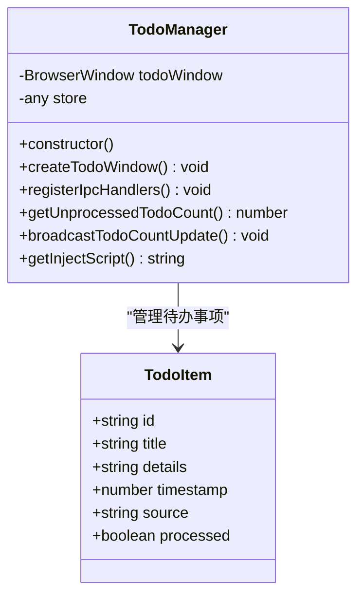
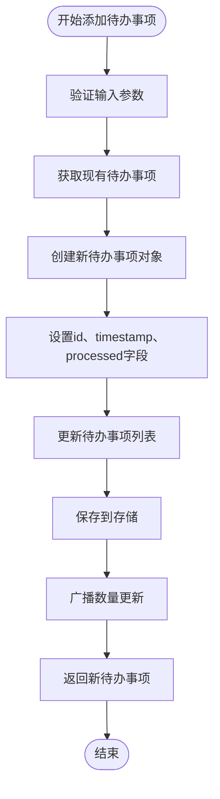
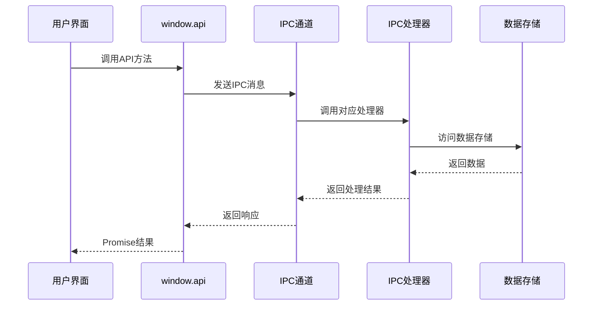
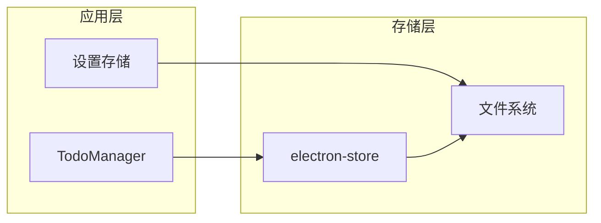

# 数据模型接口

<cite>
**本文档引用的文件**
- [src/main/todo.ts](file://src/main/todo.ts)
- [src/preload/index.d.ts](file://src/preload/index.d.ts)
- [src/renderer/src/components/Todo.vue](file://src/renderer/src/components/Todo.vue)
- [src/renderer/src/env.d.ts](file://src/renderer/src/env.d.ts)
- [temp_eSearch/src/ShareTypes.d.ts](file://temp_eSearch/src/ShareTypes.d.ts)
- [temp_eSearch/lib/store/store.ts](file://temp_eSearch/lib/store/store.ts)
- [temp_eSearch/lib/store/renderStore.ts](file://temp_eSearch/lib/store/renderStore.ts)
- [temp_eSearch/src/main/main.ts](file://temp_eSearch/src/main/main.ts)
- [README.md](file://README.md)
- [ARCHITECTURE.md](file://ARCHITECTURE.md)
</cite>

## 目录
1. [简介](#简介)
2. [项目结构](#项目结构)
3. [核心数据模型](#核心数据模型)
4. [架构概览](#架构概览)
5. [详细组件分析](#详细组件分析)
6. [依赖关系分析](#依赖关系分析)
7. [性能考虑](#性能考虑)
8. [故障排除指南](#故障排除指南)
9. [结论](#结论)

## 简介

本文档详细记录了WoaApp项目中的数据模型接口，重点关注在API之间传递的核心数据结构。项目采用Electron框架构建，包含主进程、预加载脚本和渲染进程三个主要部分。数据模型主要涉及待办事项管理、设置配置以及消息处理等核心功能。

项目通过IPC（Inter-Process Communication）机制实现进程间通信，确保数据在不同进程间的正确传递和同步。数据模型的设计遵循类型安全原则，使用TypeScript接口定义确保编译时类型检查。

## 项目结构

项目采用典型的Electron应用结构，分为以下主要模块：



**图表来源**
- [src/main/todo.ts](file://src/main/todo.ts#L1-L266)
- [src/preload/index.d.ts](file://src/preload/index.d.ts#L1-L23)
- [src/renderer/src/components/Todo.vue](file://src/renderer/src/components/Todo.vue#L1-L281)

**章节来源**
- [src/main/todo.ts](file://src/main/todo.ts#L1-L266)
- [src/preload/index.d.ts](file://src/preload/index.d.ts#L1-L23)
- [src/renderer/src/components/Todo.vue](file://src/renderer/src/components/Todo.vue#L1-L281)

## 核心数据模型

### TodoItem 数据模型

TodoItem是待办事项管理的核心数据结构，定义了完整的待办事项信息。



**图表来源**
- [src/main/todo.ts](file://src/main/todo.ts#L7-L14)
- [src/main/todo.ts](file://src/main/todo.ts#L20-L33)

#### 字段详细说明

| 字段名 | 类型 | 必填 | 默认值 | 业务含义 | 取值范围/约束 |
|--------|------|------|--------|----------|---------------|
| id | string | 是 | - | 待办事项唯一标识符 | 格式: "todo-{timestamp}" |
| title | string | 是 | - | 待办事项标题 | 非空字符串，长度限制由前端验证 |
| details | string | 是 | - | 待办事项详细描述 | 可为空字符串，支持多行文本 |
| timestamp | number | 是 | - | 创建时间戳 | Unix毫秒时间戳，自动生成 |
| source | string | 是 | "手动新增" | 数据来源标识 | "手动新增" \| "聊天记录" \| 自定义来源 |
| processed | boolean | 是 | false | 处理状态标记 | true/false |

#### 数据验证规则

1. **必填字段验证**: 所有字段均为必填，特别是id、title、details、timestamp、source、processed
2. **类型验证**: 
   - id必须为字符串且符合"todo-{timestamp}"格式
   - timestamp必须为数字类型
   - processed必须为布尔类型
3. **业务逻辑验证**:
   - id自动生成，不允许外部传入
   - timestamp自动生成，表示创建时间
   - source字段限制特定值集合

**章节来源**
- [src/main/todo.ts](file://src/main/todo.ts#L7-L14)
- [src/main/todo.ts](file://src/main/todo.ts#L87-L99)

### IPC API 接口定义

项目通过预加载脚本暴露统一的API接口给渲染进程使用。



**图表来源**
- [src/preload/index.d.ts](file://src/preload/index.d.ts#L7-L20)
- [src/main/todo.ts](file://src/main/todo.ts#L82-L84)

#### API 方法定义

| 方法名 | 参数类型 | 返回类型 | 业务用途 |
|--------|----------|----------|----------|
| getTodos | - | Promise<TodoItem[]> | 获取所有待办事项 |
| addTodo | Omit<TodoItem, 'id' \| 'timestamp' \| 'processed'> | Promise<TodoItem> | 新增待办事项 |
| updateTodo | TodoItem | Promise<TodoItem> | 更新待办事项 |
| deleteTodo | string | Promise<boolean> | 删除待办事项 |
| getUnprocessedTodoCount | - | Promise<number> | 获取未处理事项数量 |

**章节来源**
- [src/preload/index.d.ts](file://src/preload/index.d.ts#L7-L20)
- [src/main/todo.ts](file://src/main/todo.ts#L82-L122)

### 设置配置数据模型

项目使用复杂的设置配置系统，支持多种功能的配置管理。



**图表来源**
- [temp_eSearch/src/ShareTypes.d.ts](file://temp_eSearch/src/ShareTypes.d.ts#L1-L417)

**章节来源**
- [temp_eSearch/src/ShareTypes.d.ts](file://temp_eSearch/src/ShareTypes.d.ts#L1-L417)

## 架构概览

项目采用分层架构设计，通过IPC机制实现进程间通信：



**图表来源**
- [src/renderer/src/components/Todo.vue](file://src/renderer/src/components/Todo.vue#L56-L150)
- [src/preload/index.d.ts](file://src/preload/index.d.ts#L7-L20)
- [src/main/todo.ts](file://src/main/todo.ts#L20-L33)

**章节来源**
- [README.md](file://README.md#L272-L315)
- [ARCHITECTURE.md](file://ARCHITECTURE.md#L272-L315)

## 详细组件分析

### TodoManager 类分析

TodoManager是待办事项管理的核心类，负责处理所有待办事项相关的业务逻辑。



**图表来源**
- [src/main/todo.ts](file://src/main/todo.ts#L20-L33)
- [src/main/todo.ts](file://src/main/todo.ts#L7-L14)

#### 核心方法流程

**添加待办事项流程**:



**图表来源**
- [src/main/todo.ts](file://src/main/todo.ts#L87-L99)

**章节来源**
- [src/main/todo.ts](file://src/main/todo.ts#L20-L154)

### IPC 通信机制

项目使用Electron的IPC机制实现进程间通信，确保数据在不同进程间的正确传递。



**图表来源**
- [src/preload/index.d.ts](file://src/preload/index.d.ts#L7-L20)
- [src/main/todo.ts](file://src/main/todo.ts#L77-L136)

**章节来源**
- [src/preload/index.d.ts](file://src/preload/index.d.ts#L1-L23)
- [src/main/todo.ts](file://src/main/todo.ts#L77-L136)

### 数据存储策略

项目采用两种主要的数据存储方式：

1. **electron-store**: 用于待办事项等临时数据存储
2. **JSON文件**: 用于复杂设置配置的持久化存储



**图表来源**
- [src/main/todo.ts](file://src/main/todo.ts#L26-L31)
- [temp_eSearch/lib/store/store.ts](file://temp_eSearch/lib/store/store.ts#L14-L45)

**章节来源**
- [src/main/todo.ts](file://src/main/todo.ts#L26-L31)
- [temp_eSearch/lib/store/store.ts](file://temp_eSearch/lib/store/store.ts#L14-L72)

## 依赖关系分析

项目各组件间的依赖关系如下：

```mermaid
graph TB
subgraph "核心依赖"
TS[TypeScript]
Electron[Electron]
Vue[Vue.js]
end
subgraph "项目组件"
TodoTS[src/main/todo.ts]
PreloadTS[src/preload/index.d.ts]
TodoVue[src/renderer/src/components/Todo.vue]
ShareTypes[temp_eSearch/src/ShareTypes.d.ts]
end
subgraph "第三方库"
Store[electron-store]
Utils[@electron-toolkit/utils]
end
TodoTS --> Store
TodoTS --> Utils
TodoVue --> TS
TodoTS --> Electron
PreloadTS --> Electron
ShareTypes --> TS
```

**图表来源**
- [src/main/todo.ts](file://src/main/todo.ts#L1-L4)
- [src/preload/index.d.ts](file://src/preload/index.d.ts#L1-L2)
- [temp_eSearch/src/ShareTypes.d.ts](file://temp_eSearch/src/ShareTypes.d.ts#L1-L559)

**章节来源**
- [src/main/todo.ts](file://src/main/todo.ts#L1-L4)
- [src/preload/index.d.ts](file://src/preload/index.d.ts#L1-L2)
- [temp_eSearch/src/ShareTypes.d.ts](file://temp_eSearch/src/ShareTypes.d.ts#L1-L559)

## 性能考虑

### 数据访问优化

1. **内存缓存**: TodoManager维护内存中的待办事项列表，减少磁盘I/O操作
2. **批量操作**: 支持批量更新和删除操作，提高性能
3. **懒加载**: 待办事项窗口按需创建，避免不必要的资源消耗

### 序列化性能

1. **JSON序列化**: 使用原生JSON序列化，性能优异
2. **类型安全**: 通过TypeScript确保序列化数据的类型正确性
3. **最小化传输**: 仅传输必要的字段，减少IPC通信开销

## 故障排除指南

### 常见问题及解决方案

**问题1: IPC通信失败**
- 检查预加载脚本是否正确初始化
- 验证IPC事件名称是否匹配
- 确认主进程是否正确注册了处理器

**问题2: 数据不一致**
- 检查存储层的事务处理
- 验证并发访问的同步机制
- 确认数据验证规则是否正确执行

**问题3: 内存泄漏**
- 检查事件监听器的清理
- 验证窗口对象的正确销毁
- 确认存储引用的及时释放

**章节来源**
- [src/main/todo.ts](file://src/main/todo.ts#L38-L72)
- [src/preload/index.d.ts](file://src/preload/index.d.ts#L4-L22)

## 结论

WoaApp项目的数据模型接口设计体现了现代Electron应用的最佳实践。通过清晰的类型定义、严格的验证规则和高效的IPC通信机制，实现了可靠的数据管理功能。

核心优势包括：
1. **类型安全**: 完整的TypeScript类型定义确保编译时错误检测
2. **架构清晰**: 分层设计便于维护和扩展
3. **性能优化**: 合理的存储策略和通信机制
4. **可扩展性**: 模块化的组件设计支持功能扩展

未来改进建议：
1. 实现更完善的数据验证机制
2. 添加数据迁移和版本兼容性支持
3. 增强错误处理和日志记录功能
4. 优化大数据量场景下的性能表现