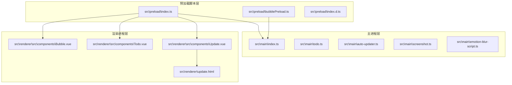
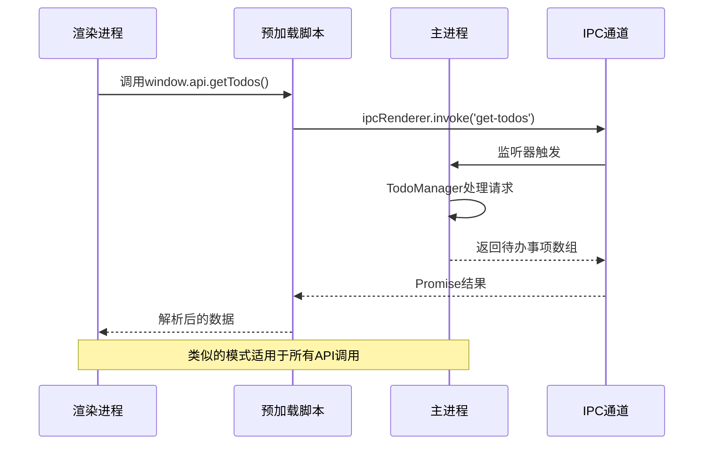
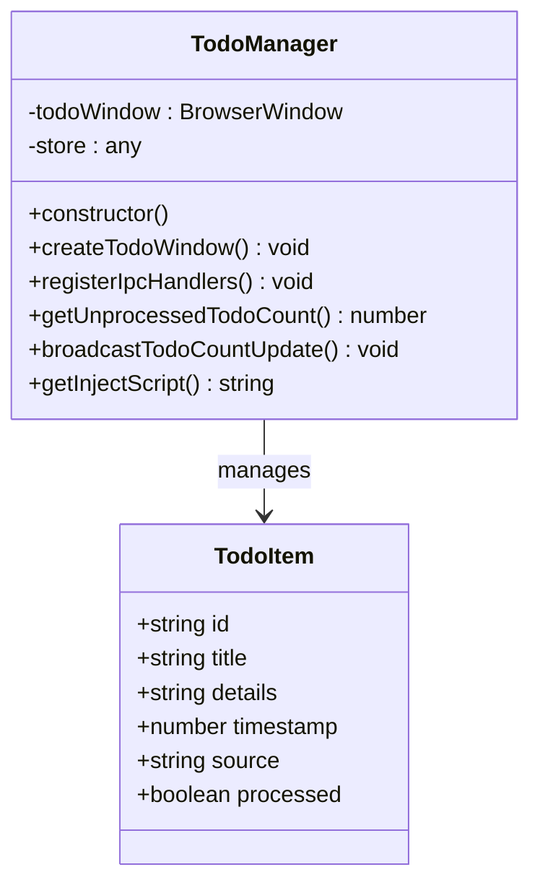
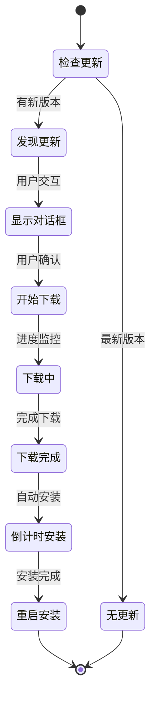
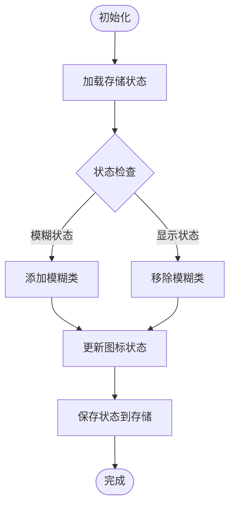
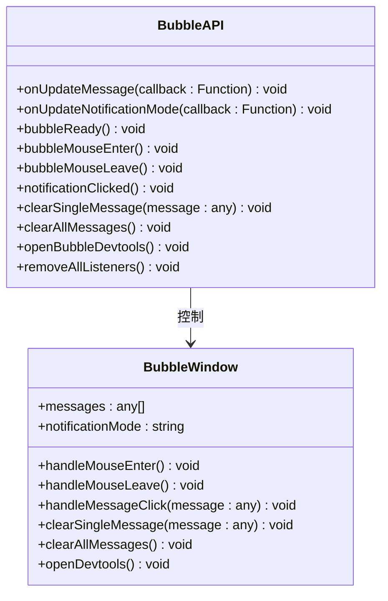
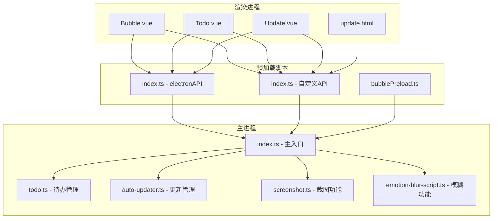

# 预加载脚本API

<cite>
**本文档引用的文件**
- [src\preload\index.ts](file://src\preload\index.ts)
- [src\preload\index.d.ts](file://src\preload\index.d.ts)
- [src\preload\bubblePreload.ts](file://src\preload\bubblePreload.ts)
- [src\main\index.ts](file://src\main\index.ts)
- [src\main\todo.ts](file://src\main\todo.ts)
- [src\main\auto-updater.ts](file://src\main\auto-updater.ts)
- [src\main\screenshot.ts](file://src\main\screenshot.ts)
- [src\main\emotion-blur-script.ts](file://src\main\emotion-blur-script.ts)
- [src\renderer\src\components\Bubble.vue](file://src\renderer\src\components\Bubble.vue)
- [src\renderer\src\components\Todo.vue](file://src\renderer\src\components\Todo.vue)
- [src\renderer\src\components\Update.vue](file://src\renderer\src\components\Update.vue)
- [src\renderer\update.html](file://src\renderer\update.html)
</cite>

## 更新摘要
**所做更改**
- 完善了自动更新相关的API文档，补充了`restartAndInstall`方法的完整实现
- 修正了TypeScript类型定义，确保所有API方法都有正确的类型声明
- 增强了自动更新流程的详细说明，包括IPC通信和状态管理
- 完善了更新窗口的生命周期管理和事件处理机制

## 目录
1. [简介](#简介)
2. [项目结构](#项目结构)
3. [核心组件](#核心组件)
4. [架构概览](#架构概览)
5. [详细组件分析](#详细组件分析)
6. [依赖关系分析](#依赖关系分析)
7. [性能考虑](#性能考虑)
8. [故障排除指南](#故障排除指南)
9. [结论](#结论)

## 简介

本文档详细记录了WoaApp应用中预加载脚本API的完整接口规范。该应用采用Electron框架构建，通过预加载脚本在渲染进程中安全地暴露有限的系统功能接口。

预加载脚本主要通过`contextBridge` API向渲染进程暴露两个核心对象：
- `window.electron`: 包含标准的Electron IPC接口
- `window.api`: 包含应用特定的业务API

这些API涵盖了开发者工具控制、截图操作、待办事项管理、表情模糊状态管理和自动更新等功能。

**更新** 完善了自动更新相关的API方法，确保TypeScript类型检查的完整性。

## 项目结构

应用采用典型的Electron项目结构，预加载脚本位于`src/preload/`目录下：

**图表来源**
- [src\preload\index.ts](file://src\preload\index.ts#L1-L63)
- [src\main\index.ts](file://src\main\index.ts#L1-L2406)

**章节来源**
- [src\preload\index.ts](file://src\preload\index.ts#L1-L63)
- [src\main\index.ts](file://src\main\index.ts#L1-L2406)

## 核心组件

### ElectronAPI 对象

ElectronAPI是对标准Electron IPC接口的封装，提供了类型安全的API：

| 方法 | 参数 | 返回值 | 描述 |
|------|------|--------|------|
| ipcRenderer.send | channel: string, ...args: any[] | void | 发送异步消息到主进程 |
| ipcRenderer.invoke | channel: string, ...args: any[] | Promise<any> | 发送同步消息到主进程并等待响应 |
| ipcRenderer.on | channel: string, listener: Function | void | 监听主进程消息 |
| ipcRenderer.off | channel: string, listener: Function | void | 移除消息监听器 |
| ipcRenderer.once | channel: string, listener: Function | void | 监听一次性消息 |
| ipcRenderer.removeAllListeners | channel?: string | void | 移除指定通道的所有监听器 |

### 自定义API对象

自定义API提供了应用特定的功能接口：

| 方法 | 参数 | 返回值 | 描述 |
|------|------|--------|------|
| openBubbleDevtools | - | void | 打开气泡窗口开发者工具 |
| takeScreenshot | - | void | 触发截图操作 |
| openTodoWindow | - | void | 打开待办事项窗口 |
| getTodos | - | Promise<TodoItem[]> | 获取所有待办事项 |
| addTodo | todo: Omit<TodoItem, 'id' \| 'timestamp' \| 'processed'> | Promise<TodoItem> | 添加新的待办事项 |
| updateTodo | todo: TodoItem | Promise<TodoItem> | 更新现有待办事项 |
| deleteTodo | todoId: string | Promise<boolean> | 删除指定ID的待办事项 |
| getUnprocessedTodoCount | - | Promise<number> | 获取未处理待办事项数量 |
| addTodoFromChat | text: string | void | 从聊天内容创建待办事项 |
| getEmotionBlurState | - | Promise<boolean> | 获取表情模糊状态 |
| setEmotionBlurState | state: boolean | Promise<void> | 设置表情模糊状态 |
| showUpdateDialog | - | void | 显示更新对话框 |
| startUpdate | - | Promise<void> | 开始更新流程 |
| restartAndInstall | - | Promise<void> | 重启并安装更新 |

**更新** 新增了`restartAndInstall`方法的完整实现，用于重启应用程序并安装新版本。

**章节来源**
- [src\preload\index.ts](file://src\preload\index.ts#L17-L43)
- [src\preload\index.d.ts](file://src\preload\index.d.ts#L6-L22)

## 架构概览

应用采用分层架构设计，通过预加载脚本实现安全的API暴露：

**图表来源**
- [src\preload\index.ts](file://src\preload\index.ts#L27-L32)
- [src\main\todo.ts](file://src\main\todo.ts#L82-L84)

### 上下文隔离安全机制

应用实现了多层安全防护：

1. **上下文隔离**: 通过`contextIsolation: true`确保预加载脚本与渲染进程的完全隔离
2. **白名单暴露**: 仅通过`contextBridge.exposeInMainWorld`暴露必需的API
3. **类型约束**: 使用TypeScript定义严格的接口类型
4. **参数验证**: 主进程对所有IPC通信进行参数验证

**章节来源**
- [src\main\index.ts](file://src\main\index.ts#L286-L301)
- [src\preload\index.ts](file://src\preload\index.ts#L48-L62)

## 详细组件分析

### 待办事项管理API

待办事项功能通过TodoManager类实现完整的CRUD操作：

**图表来源**
- [src\main\todo.ts](file://src\main\todo.ts#L20-L155)

#### API详细说明

**获取所有待办事项**
- 方法: `getTodos()`
- 返回: `Promise<TodoItem[]>`
- 用途: 加载待办事项列表

**添加待办事项**
- 方法: `addTodo(todo: Omit<TodoItem, 'id' | 'timestamp' | 'processed'>)`
- 参数: 
  - title: string (必填)
  - details: string (可选)
  - source: string (可选)
- 返回: `Promise<TodoItem>`
- 用途: 创建新的待办事项

**更新待办事项**
- 方法: `updateTodo(todo: TodoItem)`
- 参数: 完整的TodoItem对象
- 返回: `Promise<TodoItem>`
- 用途: 修改现有待办事项

**删除待办事项**
- 方法: `deleteTodo(todoId: string)`
- 参数: 待删除项的ID
- 返回: `Promise<boolean>`
- 用途: 删除指定的待办事项

**章节来源**
- [src\main\todo.ts](file://src\main\todo.ts#L77-L136)
- [src\preload\index.ts](file://src\preload\index.ts#L27-L32)

### 自动更新API

自动更新功能通过AutoUpdaterManager类提供完整的更新管理：

**图表来源**
- [src\main\auto-updater.ts](file://src\main\auto-updater.ts#L189-L221)

#### 更新类型

| 类型 | 描述 | 行为 |
|------|------|------|
| force | 强制更新 | 必须更新才能继续使用 |
| active | 主动提醒 | 显示更新提示并提供安装选项 |
| passive | 被动提醒 | 仅在托盘菜单中提示更新 |

#### 自动更新API方法

**显示更新对话框**
- 方法: `showUpdateDialog()`
- 返回: `void`
- 用途: 显示更新对话框供用户确认

**开始更新**
- 方法: `startUpdate()`
- 返回: `Promise<void>`
- 用途: 开始下载并安装更新

**重启并安装**
- 方法: `restartAndInstall()`
- 返回: `Promise<void>`
- 用途: 重启应用程序并安装新版本

**章节来源**
- [src\main\auto-updater.ts](file://src\main\auto-updater.ts#L10-L32)
- [src\main\auto-updater.ts](file://src\main\auto-updater.ts#L272-L295)
- [src\preload\index.ts](file://src\preload\index.ts#L39-L43)

### 表情模糊状态管理

表情模糊功能通过注入脚本实现动态状态管理：

**图表来源**
- [src\main\emotion-blur-script.ts](file://src\main\emotion-blur-script.ts#L15-L46)

#### 状态管理API

**获取模糊状态**
- 方法: `getEmotionBlurState()`
- 返回: `Promise<boolean>`
- 用途: 检查当前是否处于模糊状态

**设置模糊状态**
- 方法: `setEmotionBlurState(state: boolean)`
- 参数: boolean类型的模糊状态
- 返回: `Promise<void>`
- 用途: 切换模糊效果的开启/关闭

**章节来源**
- [src\main\emotion-blur-script.ts](file://src\main\emotion-blur-script.ts#L6-L46)
- [src\preload\index.ts](file://src\preload\index.ts#L36-L37)

### 截图功能API

截图功能通过electron-screenshots库实现屏幕捕获：

| 方法 | 参数 | 返回值 | 描述 |
|------|------|--------|------|
| takeScreenshot | - | void | 触发截图操作 |
| startScreenshot | - | void | 开始截图捕获 |
| initScreenshot | mainWindow: BrowserWindow | void | 初始化截图功能 |

**章节来源**
- [src\main\screenshot.ts](file://src\main\screenshot.ts#L16-L96)
- [src\preload\index.ts](file://src\preload\index.ts#L22-L23)

### 气泡窗口API

气泡窗口通过独立的预加载脚本实现：

**图表来源**
- [src\preload\bubblePreload.ts](file://src\preload\bubblePreload.ts#L4-L60)
- [src\renderer\src\components\Bubble.vue](file://src\renderer\src\components\Bubble.vue#L87-L235)

**章节来源**
- [src\preload\bubblePreload.ts](file://src\preload\bubblePreload.ts#L1-L70)
- [src\renderer\src\components\Bubble.vue](file://src\renderer\src\components\Bubble.vue#L87-L235)

## 依赖关系分析

应用的API依赖关系呈现清晰的分层结构：

**图表来源**
- [src\renderer\src\components\Bubble.vue](file://src\renderer\src\components\Bubble.vue#L87-L235)
- [src\renderer\src\components\Todo.vue](file://src\renderer\src\components\Todo.vue#L87-L150)
- [src\renderer\src\components\Update.vue](file://src\renderer\src\components\Update.vue#L288-L337)

**章节来源**
- [src\main\index.ts](file://src\main\index.ts#L1-L2406)

## 性能考虑

### API调用优化

1. **批量操作**: 对于频繁的待办事项操作，建议使用批量处理减少IPC通信次数
2. **缓存策略**: 对于频繁访问的数据（如待办事项列表），在渲染进程中实现本地缓存
3. **异步处理**: 所有IPC调用都是异步的，避免阻塞主线程

### 内存管理

1. **监听器清理**: 使用完毕后及时移除IPC监听器，防止内存泄漏
2. **资源释放**: 关闭窗口时确保相关资源得到正确释放

## 故障排除指南

### 常见问题及解决方案

**问题1: API不可用**
- 症状: `window.api` 或 `window.electron` 为undefined
- 原因: 上下文隔离未正确配置或预加载脚本加载失败
- 解决方案: 检查预加载脚本路径和上下文隔离配置

**问题2: IPC通信失败**
- 症状: API调用无响应或报错
- 原因: 主进程未注册相应的IPC监听器
- 解决方案: 确认主进程中的IPC处理器已正确注册

**问题3: 类型定义错误**
- 症状: TypeScript编译错误
- 原因: 类型定义不匹配或缺少必要的类型声明
- 解决方案: 检查`index.d.ts`文件中的类型定义

**问题4: 自动更新API缺失**
- 症状: `restartAndInstall`方法在TypeScript中无法识别
- 原因: 类型定义文件缺少对应的方法声明
- 解决方案: 在`index.d.ts`中添加`restartAndInstall`方法的类型定义

**章节来源**
- [src\preload\index.d.ts](file://src\preload\index.d.ts#L4-L22)
- [src\main\index.ts](file://src\main\index.ts#L92-L120)

## 结论

WoaApp的预加载脚本API设计体现了现代Electron应用的最佳实践：

1. **安全性优先**: 通过上下文隔离和白名单机制确保安全
2. **类型安全**: 完整的TypeScript类型定义提供编译时检查
3. **功能完整**: 覆盖了开发者工具、截图、待办管理、表情模糊和自动更新等核心功能
4. **易于扩展**: 清晰的架构设计便于添加新的API功能

**更新** 本次更新完善了自动更新相关的API文档，确保了TypeScript类型检查的完整性，并增强了自动更新流程的技术细节说明。该API设计为渲染进程提供了安全、可靠且功能丰富的系统接口，同时保持了良好的性能和可维护性。