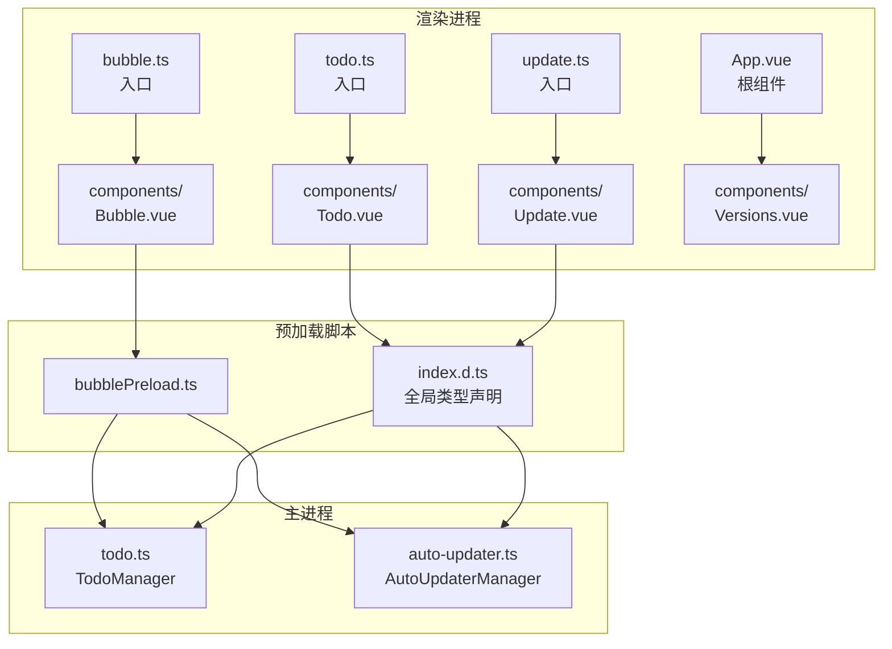
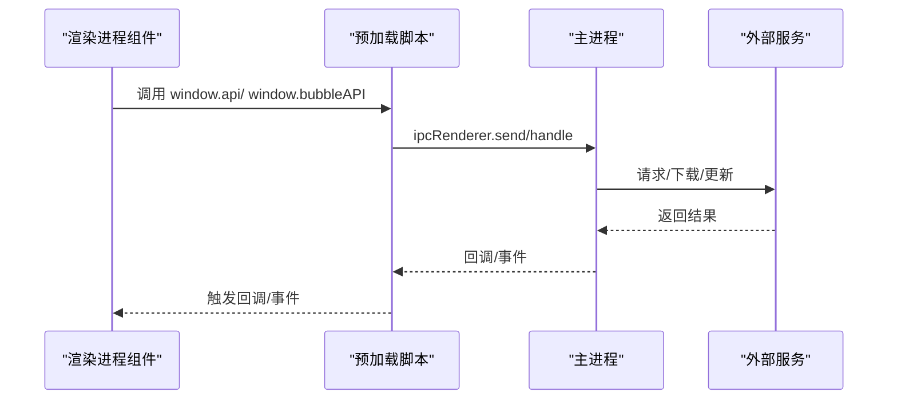
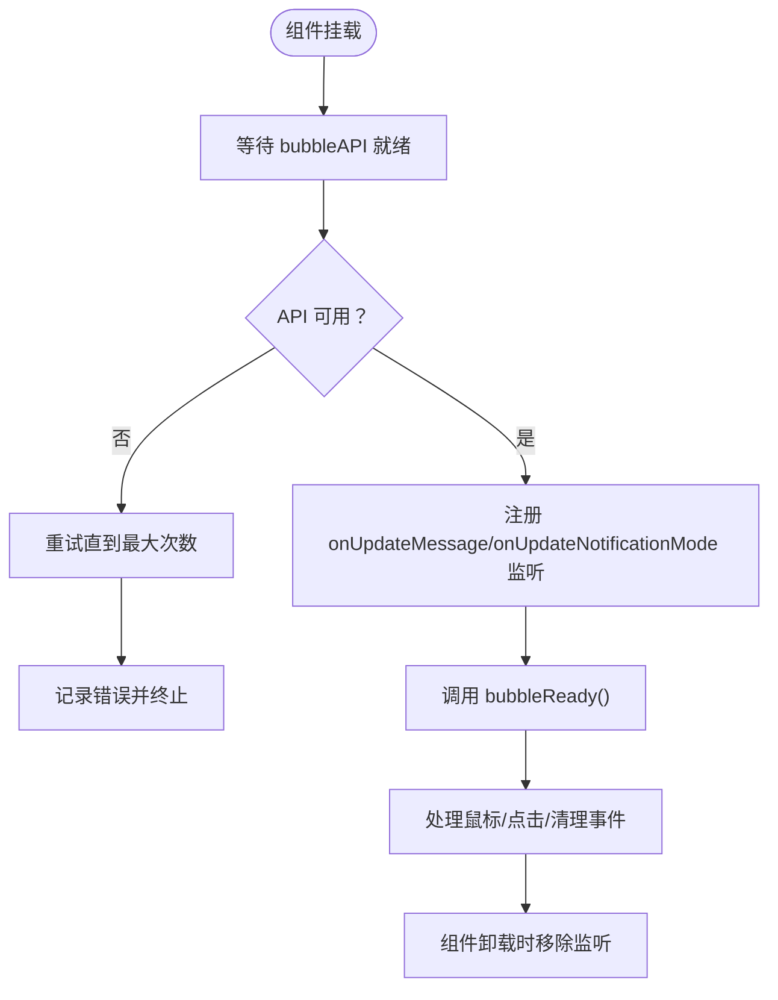
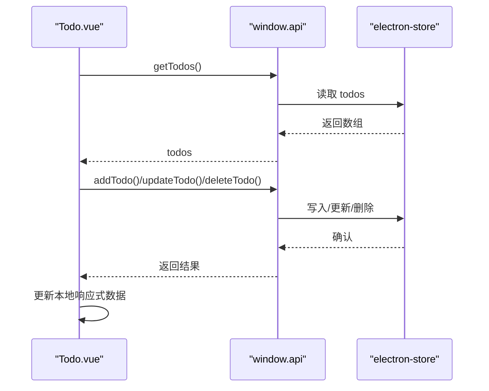
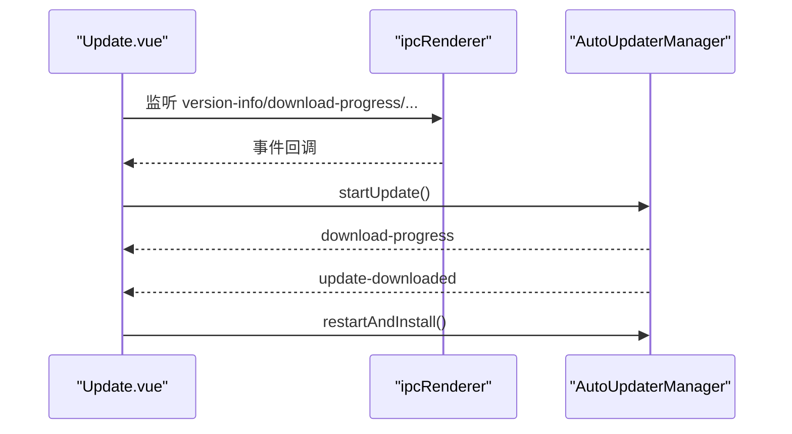
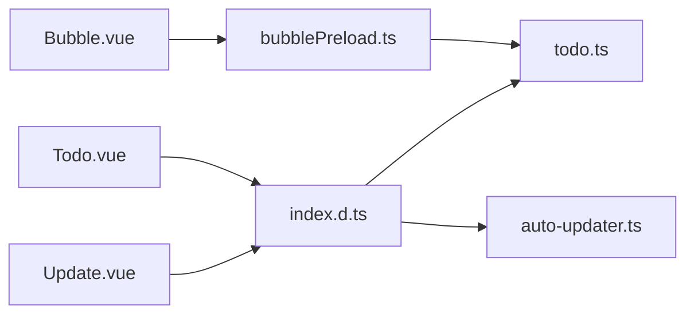

# Vue.js组件系统

<cite>
**本文档引用的文件**
- [Bubble.vue](file://src/renderer/src/components/Bubble.vue)
- [Todo.vue](file://src/renderer/src/components/Todo.vue)
- [Update.vue](file://src/renderer/src/components/Update.vue)
- [Versions.vue](file://src/renderer/src/components/Versions.vue)
- [bubblePreload.ts](file://src/preload/bubblePreload.ts)
- [todo.ts](file://src/main/todo.ts)
- [auto-updater.ts](file://src/main/auto-updater.ts)
- [bubble.ts](file://src/renderer/src/bubble.ts)
- [todo.ts](file://src/renderer/src/todo.ts)
- [update.ts](file://src/renderer/src/update.ts)
- [global.d.ts](file://src/renderer/src/types/global.d.ts)
- [index.d.ts](file://src/preload/index.d.ts)
- [App.vue](file://src/renderer/src/App.vue)
</cite>

## 目录
1. [简介](#简介)
2. [项目结构](#项目结构)
3. [核心组件](#核心组件)
4. [架构总览](#架构总览)
5. [详细组件分析](#详细组件分析)
6. [依赖关系分析](#依赖关系分析)
7. [性能考虑](#性能考虑)
8. [故障排除指南](#故障排除指南)
9. [结论](#结论)
10. [附录](#附录)

## 简介
本文件系统性梳理 WoaApp 中基于 Vue.js 的组件体系，重点解析以下组件的设计理念与实现细节：
- Bubble.vue 气泡组件：负责接收主进程推送的消息并展示，支持鼠标交互、消息清理、开发者工具等功能
- Todo.vue 待办组件：提供待办事项的增删改查、分页筛选、模态框交互等完整功能
- Update.vue 更新组件：负责版本检测、下载进度展示、自动更新流程控制
- Versions.vue 版本信息组件：展示 Electron/Chromium/Node 版本信息

同时，文档将深入说明组件的 props、events、slots 设计模式，组件间通信机制（IPC），响应式数据绑定、计算属性、侦听器的使用场景，并给出组件开发最佳实践与性能优化策略。

## 项目结构
WoaApp 采用 Electron + Vue 的混合架构，渲染进程按功能拆分为独立的页面入口与组件库：
- 渲染进程入口：每个功能页面对应一个独立的入口文件（如 bubble.ts、todo.ts、update.ts）
- 组件库：统一放置于 src/renderer/src/components 下，采用单文件组件（SFC）形式
- 预加载脚本：通过 preload 暴露受控的 API 到渲染进程
- 主进程：负责业务逻辑、窗口管理、自动更新、IPC 事件注册等

图表来源
- [bubble.ts](file://src/renderer/src/bubble.ts#L1-L8)
- [todo.ts](file://src/renderer/src/todo.ts#L1-L9)
- [update.ts](file://src/renderer/src/update.ts#L1-L8)
- [Bubble.vue](file://src/renderer/src/components/Bubble.vue#L1-L468)
- [Todo.vue](file://src/renderer/src/components/Todo.vue#L1-L281)
- [Update.vue](file://src/renderer/src/components/Update.vue#L1-L616)
- [Versions.vue](file://src/renderer/src/components/Versions.vue#L1-L14)
- [bubblePreload.ts](file://src/preload/bubblePreload.ts#L1-L70)
- [todo.ts](file://src/main/todo.ts#L1-L266)
- [auto-updater.ts](file://src/main/auto-updater.ts#L1-L565)

章节来源
- [bubble.ts](file://src/renderer/src/bubble.ts#L1-L8)
- [todo.ts](file://src/renderer/src/todo.ts#L1-L9)
- [update.ts](file://src/renderer/src/update.ts#L1-L8)
- [App.vue](file://src/renderer/src/App.vue#L1-L27)

## 核心组件
本节概述三个核心组件的功能定位与职责边界：
- Bubble.vue：消息气泡容器，负责消息列表渲染、交互事件转发、开发者工具集成
- Todo.vue：待办事项管理，负责 CRUD、筛选、模态框、IPC 事件监听
- Update.vue：自动更新流程，负责版本信息展示、下载进度、倒计时与安装
- Versions.vue：版本信息展示，用于调试与诊断

章节来源
- [Bubble.vue](file://src/renderer/src/components/Bubble.vue#L1-L468)
- [Todo.vue](file://src/renderer/src/components/Todo.vue#L1-L281)
- [Update.vue](file://src/renderer/src/components/Update.vue#L1-L616)
- [Versions.vue](file://src/renderer/src/components/Versions.vue#L1-L14)

## 架构总览
组件间通信采用 Electron IPC 机制，预加载脚本作为桥接层，向渲染进程暴露受控 API。主进程负责业务逻辑与外部服务交互，渲染进程通过 window.api 或 window.bubbleAPI 与之通信。

图表来源
- [bubblePreload.ts](file://src/preload/bubblePreload.ts#L1-L70)
- [index.d.ts](file://src/preload/index.d.ts#L1-L23)
- [todo.ts](file://src/main/todo.ts#L1-L266)
- [auto-updater.ts](file://src/main/auto-updater.ts#L1-L565)

## 详细组件分析

### Bubble.vue 气泡组件
- 设计理念
  - 作为独立的气泡窗口，负责接收主进程推送的消息并实时渲染
  - 支持鼠标进入/离开、消息点击、单条/全部清理、开发者工具等交互
  - 通过 window.bubbleAPI 与主进程通信，避免直接访问主进程 API
- 关键特性
  - 响应式数据：消息列表、通知模式、开发模式标识
  - 生命周期：onMounted 动态等待 bubbleAPI 就绪，onUnmounted 移除监听
  - 事件处理：鼠标事件、消息点击、清理操作、开发者工具
  - 辅助函数：头像占位符、时间格式化、头像加载错误处理
- 组件通信
  - 预加载脚本暴露 onUpdateMessage/onUpdateNotificationMode 监听器
  - 组件通过 bubbleReady 通知主进程“已就绪”，并通过多种事件反馈用户行为
- 最佳实践
  - 使用 window.bubbleAPI 替代直接访问主进程 API
  - 在 onUnmounted 中移除所有 IPC 监听，防止内存泄漏
  - 对图片加载错误进行降级处理，提升用户体验

图表来源
- [Bubble.vue](file://src/renderer/src/components/Bubble.vue#L164-L235)
- [bubblePreload.ts](file://src/preload/bubblePreload.ts#L7-L59)

章节来源
- [Bubble.vue](file://src/renderer/src/components/Bubble.vue#L1-L468)
- [bubblePreload.ts](file://src/preload/bubblePreload.ts#L1-L70)
- [global.d.ts](file://src/renderer/src/types/global.d.ts#L1-L20)

### Todo.vue 待办组件
- 设计理念
  - 提供完整的待办事项生命周期管理：新增、编辑、标记完成、删除
  - 支持标签切换（未处理/已处理）、模态框输入、从聊天内容快速创建
  - 数据持久化由主进程的 electron-store 管理，渲染进程通过 IPC 访问
- 关键特性
  - 响应式数据：todos、activeTab、editingTodo、showAddModal、newTodoFromChat
  - 计算属性：filteredTodos 基于 activeTab 过滤
  - 生命周期：onMounted 初始化数据与 IPC 监听
  - 事件处理：新增、编辑、保存、取消、标记完成、删除
- 组件通信
  - 通过 window.api 的 getTodos/addTodo/updateTodo/deleteTodo 等方法与主进程交互
  - 监听来自聊天的 IPC 事件，自动弹出新增模态框
- 最佳实践
  - 使用 computed 管理视图过滤逻辑，减少重复计算
  - 编辑态使用深拷贝副本，避免直接修改响应式数据
  - 删除操作前进行确认，提升安全性

图表来源
- [Todo.vue](file://src/renderer/src/components/Todo.vue#L87-L150)
- [todo.ts](file://src/main/todo.ts#L82-L117)

章节来源
- [Todo.vue](file://src/renderer/src/components/Todo.vue#L1-L281)
- [todo.ts](file://src/main/todo.ts#L1-L266)
- [index.d.ts](file://src/preload/index.d.ts#L1-L23)

### Update.vue 更新组件
- 设计理念
  - 展示当前版本与最新版本信息，根据更新类型（强制/重要/可选）呈现不同 UI
  - 控制下载流程：开始下载、进度展示、倒计时、自动安装
  - 在强制更新场景下阻止用户误关窗口
- 关键特性
  - 响应式数据：versionInfo、downloadProgress、isUpdating、isDownloadComplete、showProgress、countdown、isCountingDown
  - 计算函数：getBadgeText/getProgressText/getUpdateButtonText
  - 生命周期：onMounted 注册 IPC 监听，onUnmounted 移除监听
  - 事件处理：handleUpdate/handleCancel/startCountdown/handleAutoInstall
  - 开发模式：模拟下载进度与版本信息
- 组件通信
  - 通过 window.electron.ipcRenderer 监听版本信息、下载进度、错误、完成等事件
  - 通过 window.api 调用 startUpdate/restartAndInstall 等方法
- 最佳实践
  - 在 beforeunload 事件中对强制更新场景进行拦截
  - 下载进度优先使用主进程提供的精确值，回退到模拟进度
  - 倒计时结束后自动触发安装流程

图表来源
- [Update.vue](file://src/renderer/src/components/Update.vue#L287-L337)
- [auto-updater.ts](file://src/main/auto-updater.ts#L171-L185)
- [auto-updater.ts](file://src/main/auto-updater.ts#L435-L473)

章节来源
- [Update.vue](file://src/renderer/src/components/Update.vue#L1-L616)
- [auto-updater.ts](file://src/main/auto-updater.ts#L1-L565)
- [index.d.ts](file://src/preload/index.d.ts#L1-L23)

### Versions.vue 版本信息组件
- 设计理念
  - 简洁展示 Electron/Chromium/Node 版本，便于调试与诊断
  - 使用 reactive 包装 window.electron.process.versions，确保响应式更新
- 实现要点
  - 通过模板渲染版本列表，样式简单清晰
  - 适合在应用根组件中展示，帮助开发者快速定位运行环境

章节来源
- [Versions.vue](file://src/renderer/src/components/Versions.vue#L1-L14)
- [App.vue](file://src/renderer/src/App.vue#L1-L27)

## 依赖关系分析
- 组件与预加载脚本
  - Bubble.vue 依赖 window.bubbleAPI（预加载脚本暴露）
  - Todo.vue 与 Update.vue 依赖 window.api（预加载脚本暴露）
- 组件与主进程
  - Todo.vue 通过 IPC 调用 TodoManager 的 getTodos/addTodo/updateTodo/deleteTodo 等
  - Update.vue 通过 IPC 调用 AutoUpdaterManager 的 checkForUpdates/startUpdate/restartAndInstall 等
- 类型声明
  - 全局类型声明确保 window 上的 API 类型安全

图表来源
- [Bubble.vue](file://src/renderer/src/components/Bubble.vue#L1-L468)
- [bubblePreload.ts](file://src/preload/bubblePreload.ts#L1-L70)
- [Todo.vue](file://src/renderer/src/components/Todo.vue#L1-L281)
- [Update.vue](file://src/renderer/src/components/Update.vue#L1-L616)
- [index.d.ts](file://src/preload/index.d.ts#L1-L23)
- [todo.ts](file://src/main/todo.ts#L1-L266)
- [auto-updater.ts](file://src/main/auto-updater.ts#L1-L565)

章节来源
- [global.d.ts](file://src/renderer/src/types/global.d.ts#L1-L20)
- [index.d.ts](file://src/preload/index.d.ts#L1-L23)

## 性能考虑
- 响应式数据与计算属性
  - Todo.vue 使用 computed 过滤列表，避免每次渲染都重新计算
  - Update.vue 使用计算函数动态生成徽章文本、进度文本、按钮文案，减少模板复杂度
- 事件与监听
  - Bubble.vue 在 onUnmounted 中移除所有 IPC 监听，防止内存泄漏
  - Update.vue 在卸载时移除 beforeunload 与 IPC 监听
- 图片与渲染
  - Bubble.vue 对头像加载错误进行降级处理，避免阻塞渲染
  - Update.vue 使用渐变与动画增强视觉体验，但保持轻量
- 模拟与回退
  - Update.vue 在开发模式下模拟下载进度，避免真实网络依赖影响开发效率

## 故障排除指南
- Bubble.vue 无法接收消息
  - 检查预加载脚本是否正确暴露 bubbleAPI
  - 确认 onMounted 中的等待逻辑是否成功触发 bubbleReady
  - 查看控制台日志，确认 onUpdateMessage/onUpdateNotificationMode 是否注册成功
- Todo.vue 无法 CRUD
  - 确认 window.api 的 getTodos/addTodo/updateTodo/deleteTodo 是否可用
  - 检查主进程 TodoManager 的 Store 是否初始化成功
  - 确认 IPC 事件名称与参数类型一致
- Update.vue 下载失败或进度异常
  - 开发模式下检查模拟下载逻辑是否正常
  - 生产模式下确认 autoUpdater 的 feed URL 与 latest.yml 下载路径
  - 检查 beforeunload 事件是否正确拦截强制更新场景
- Versions.vue 无法显示版本
  - 确认 window.electron.process.versions 是否可用
  - 检查 Versions.vue 的 reactive 初始化是否成功

章节来源
- [Bubble.vue](file://src/renderer/src/components/Bubble.vue#L164-L235)
- [Todo.vue](file://src/renderer/src/components/Todo.vue#L87-L150)
- [Update.vue](file://src/renderer/src/components/Update.vue#L287-L337)
- [auto-updater.ts](file://src/main/auto-updater.ts#L475-L515)

## 结论
WoaApp 的 Vue.js 组件系统围绕 Electron IPC 机制构建，通过预加载脚本提供受控 API，主进程承担业务逻辑与外部交互。Bubble.vue、Todo.vue、Update.vue 各司其职，配合 Versions.vue 提供诊断能力。组件广泛运用响应式数据、计算属性与生命周期钩子，结合合理的错误处理与性能优化策略，形成了稳定、可维护且易扩展的前端组件体系。

## 附录
- 组件命名规范
  - 组件文件名采用帕斯卡命名法（如 Bubble.vue、Todo.vue、Update.vue）
  - 单文件组件内部导出默认为组件本身，入口文件负责挂载
- 代码组织结构
  - 渲染进程入口文件按页面拆分（bubble.ts、todo.ts、update.ts）
  - 组件集中存放于 components 目录，按功能划分
  - 预加载脚本统一暴露 window.api/window.bubbleAPI
- 最佳实践清单
  - 使用 computed 管理视图过滤与派生状态
  - 在 onUnmounted 中移除所有 IPC 监听与事件监听
  - 对图片与网络请求进行错误降级与回退策略
  - 在强制更新场景下拦截 beforeunload 事件
  - 使用类型声明确保 window 上 API 的类型安全