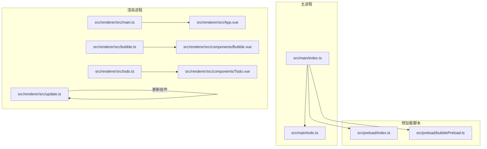
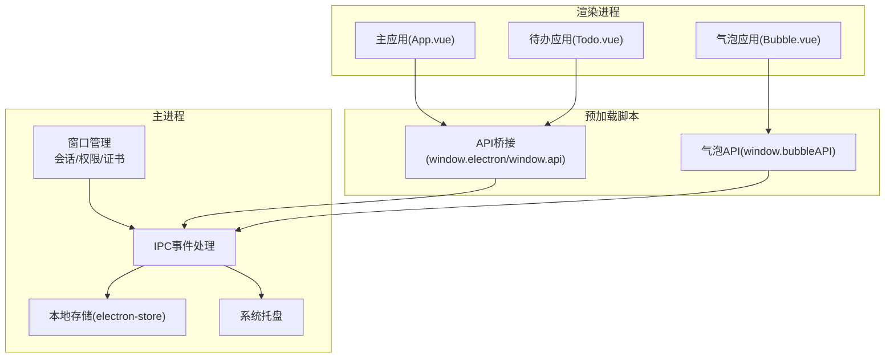
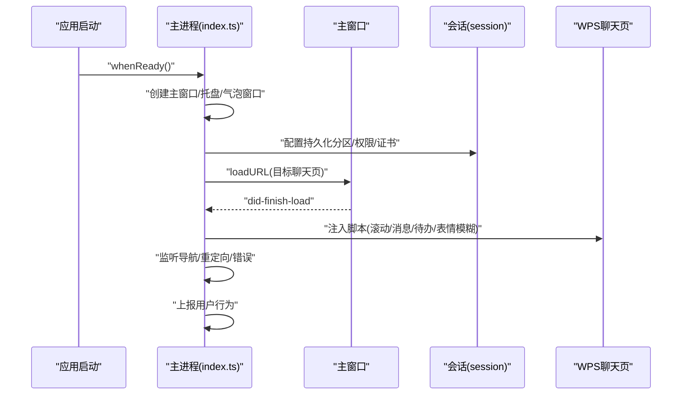
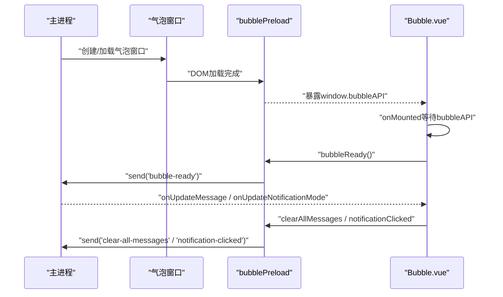
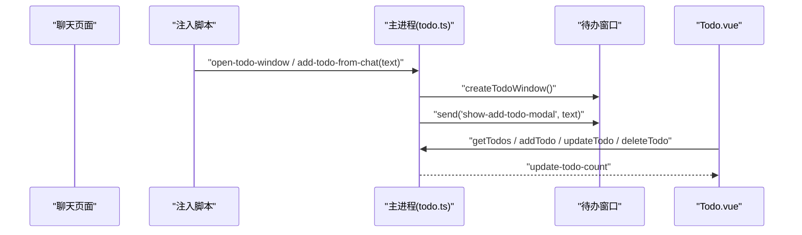
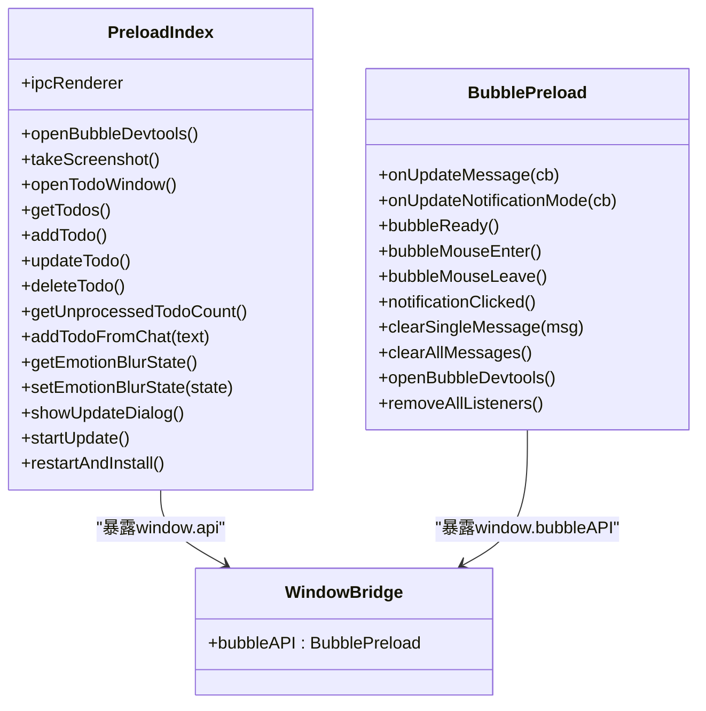
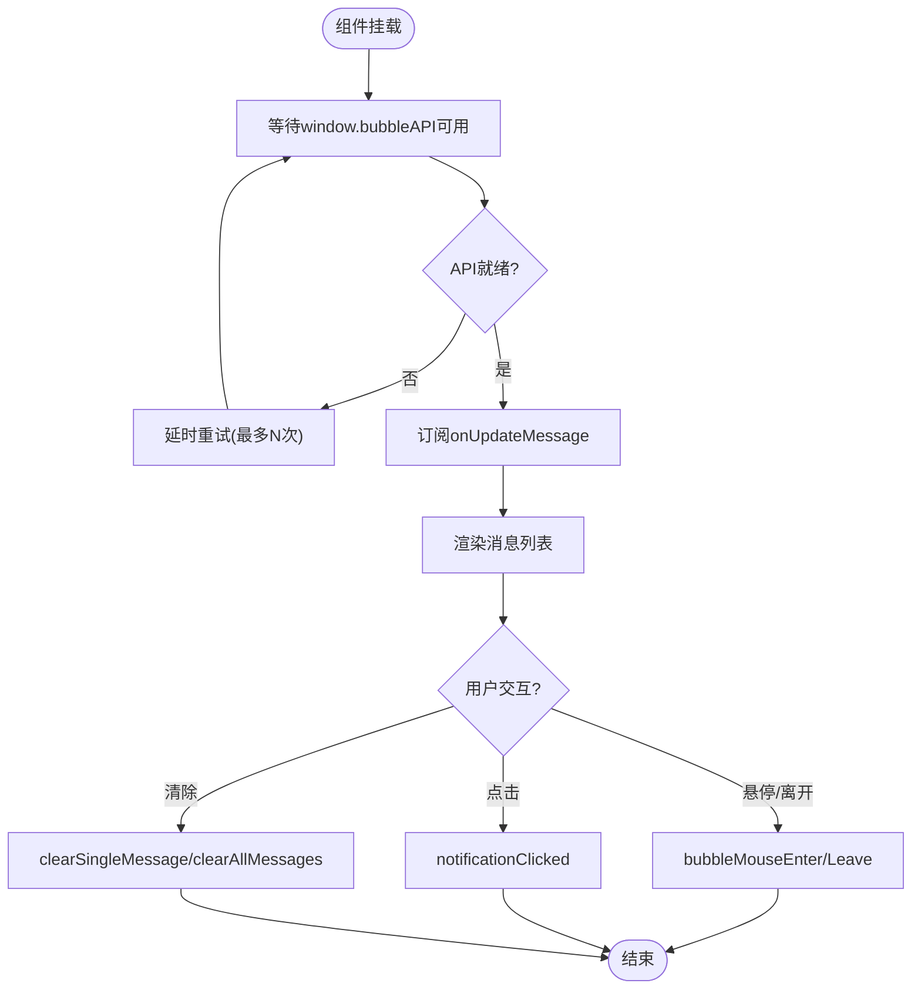
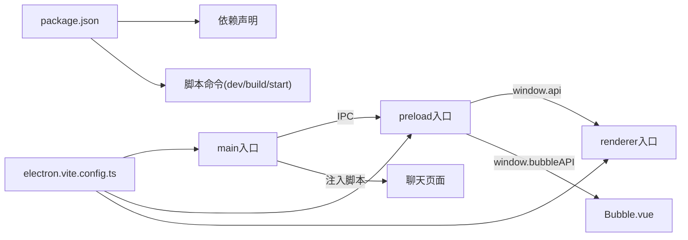

# 前端应用架构

<cite>
**本文引用的文件**
- [src/main/index.ts](file://src/main/index.ts)
- [src/main/todo.ts](file://src/main/todo.ts)
- [src/preload/index.ts](file://src/preload/index.ts)
- [src/preload/bubblePreload.ts](file://src/preload/bubblePreload.ts)
- [src/renderer/src/main.ts](file://src/renderer/src/main.ts)
- [src/renderer/src/App.vue](file://src/renderer/src/App.vue)
- [src/renderer/src/bubble.ts](file://src/renderer/src/bubble.ts)
- [src/renderer/src/todo.ts](file://src/renderer/src/todo.ts)
- [src/renderer/src/update.ts](file://src/renderer/src/update.ts)
- [src/renderer/src/components/Bubble.vue](file://src/renderer/src/components/Bubble.vue)
- [src/renderer/src/components/Todo.vue](file://src/renderer/src/components/Todo.vue)
- [src/renderer/src/env.d.ts](file://src/renderer/src/env.d.ts)
- [ARCHITECTURE.md](file://ARCHITECTURE.md)
- [package.json](file://package.json)
- [electron.vite.config.ts](file://electron.vite.config.ts)
</cite>

## 目录
1. [引言](#引言)
2. [项目结构](#项目结构)
3. [核心组件](#核心组件)
4. [架构总览](#架构总览)
5. [详细组件分析](#详细组件分析)
6. [依赖关系分析](#依赖关系分析)
7. [性能考虑](#性能考虑)
8. [故障排查指南](#故障排查指南)
9. [结论](#结论)
10. [附录](#附录)

## 引言
本文件面向Vue.js 3在Electron中的应用实践，系统梳理多窗口架构（主窗口、气泡窗口、待办窗口）的设计与实现，解释组件系统、状态管理、路由配置、组件间通信与数据流，并给出最佳实践、性能优化与用户体验设计建议。文档同时结合仓库现有代码进行逐层解析，帮助读者快速理解并扩展该架构。

## 项目结构
项目采用典型的Electron多进程架构：主进程负责窗口管理、系统集成与IPC；渲染进程承载Vue应用；预加载脚本作为安全桥接，向渲染进程暴露受限API。

- 主进程入口与窗口管理：src/main/index.ts
- 待办功能模块：src/main/todo.ts
- 预加载脚本（主/气泡）：src/preload/index.ts、src/preload/bubblePreload.ts
- 渲染进程入口与应用：src/renderer/src/main.ts、src/renderer/src/App.vue
- 气泡窗口应用：src/renderer/src/bubble.ts → src/renderer/src/components/Bubble.vue
- 待办窗口应用：src/renderer/src/todo.ts → src/renderer/src/components/Todo.vue
- 更新窗口应用：src/renderer/src/update.ts → src/renderer/src/components/Update.vue
- 构建与脚手架：electron.vite.config.ts、package.json
- 架构说明：ARCHITECTURE.md

图表来源
- [src/main/index.ts](file://src/main/index.ts#L92-L236)
- [src/main/todo.ts](file://src/main/todo.ts#L20-L136)
- [src/preload/index.ts](file://src/preload/index.ts#L1-L63)
- [src/preload/bubblePreload.ts](file://src/preload/bubblePreload.ts#L1-L70)
- [src/renderer/src/main.ts](file://src/renderer/src/main.ts#L1-L7)
- [src/renderer/src/bubble.ts](file://src/renderer/src/bubble.ts#L1-L8)
- [src/renderer/src/todo.ts](file://src/renderer/src/todo.ts#L1-L9)
- [src/renderer/src/update.ts](file://src/renderer/src/update.ts#L1-L8)
- [src/renderer/src/App.vue](file://src/renderer/src/App.vue#L1-L27)
- [src/renderer/src/components/Bubble.vue](file://src/renderer/src/components/Bubble.vue#L1-L77)
- [src/renderer/src/components/Todo.vue](file://src/renderer/src/components/Todo.vue#L1-L54)

章节来源
- [ARCHITECTURE.md](file://ARCHITECTURE.md#L16-L137)
- [electron.vite.config.ts](file://electron.vite.config.ts#L1-L60)
- [package.json](file://package.json#L1-L55)

## 核心组件
- 主窗口（聊天页）：加载目标URL，注入脚本，监听导航与重定向，维持登录态与会话。
- 气泡窗口（消息提醒）：悬浮置顶窗口，接收主进程消息，支持悬停控制、点击交互、清除消息。
- 待办窗口（任务管理）：独立窗口，提供CRUD界面，与主窗口通过上下文菜单联动。
- 预加载脚本：在渲染进程暴露受限API，建立IPC通道，保障安全与可控的系统能力调用。
- Vue应用：主应用、气泡应用、待办应用分别挂载到不同HTML容器，组件化管理UI与交互。

章节来源
- [src/main/index.ts](file://src/main/index.ts#L276-L615)
- [src/main/todo.ts](file://src/main/todo.ts#L38-L136)
- [src/preload/index.ts](file://src/preload/index.ts#L16-L43)
- [src/preload/bubblePreload.ts](file://src/preload/bubblePreload.ts#L4-L61)
- [src/renderer/src/bubble.ts](file://src/renderer/src/bubble.ts#L1-L8)
- [src/renderer/src/todo.ts](file://src/renderer/src/todo.ts#L1-L9)

## 架构总览
Electron多进程模型在本项目中清晰体现：主进程集中控制窗口、会话、系统托盘与IPC；渲染进程承载Vue应用，通过预加载脚本安全访问主进程能力；多窗口协同工作，形成“主窗口+气泡窗口+待办窗口”的桌面协作体验。

图表来源
- [src/main/index.ts](file://src/main/index.ts#L92-L236)
- [src/preload/index.ts](file://src/preload/index.ts#L16-L63)
- [src/preload/bubblePreload.ts](file://src/preload/bubblePreload.ts#L4-L61)
- [src/renderer/src/App.vue](file://src/renderer/src/App.vue#L1-L27)
- [src/renderer/src/components/Bubble.vue](file://src/renderer/src/components/Bubble.vue#L79-L236)
- [src/renderer/src/components/Todo.vue](file://src/renderer/src/components/Todo.vue#L56-L151)

## 详细组件分析

### 主窗口与会话管理
- 单实例锁、窗口创建与最小化隐藏策略、关闭事件拦截。
- 会话持久化分区、用户代理设置、权限与证书策略放宽、网络请求放行。
- 导航监听、重定向处理、登录状态检查与自动跳转、错误兜底与备用URL。
- 注入脚本（滚动、消息监听、待办脚本、表情模糊），上报用户行为。

图表来源
- [src/main/index.ts](file://src/main/index.ts#L92-L236)
- [src/main/index.ts](file://src/main/index.ts#L402-L615)

章节来源
- [src/main/index.ts](file://src/main/index.ts#L276-L615)

### 气泡窗口与消息提醒
- 窗口特性：透明、无边框、置顶、可拖动、右下角定位、showInactive避免抢焦点。
- 预加载脚本暴露window.bubbleAPI，提供消息更新、通知模式、鼠标事件、清除消息、开发者工具等回调。
- Vue组件通过window.bubbleAPI订阅消息与模式变更，组件挂载后轮询等待API可用，再注册监听并上报“已就绪”。

图表来源
- [src/main/index.ts](file://src/main/index.ts#L617-L764)
- [src/preload/bubblePreload.ts](file://src/preload/bubblePreload.ts#L4-L61)
- [src/renderer/src/components/Bubble.vue](file://src/renderer/src/components/Bubble.vue#L79-L236)

章节来源
- [src/main/index.ts](file://src/main/index.ts#L617-L764)
- [src/preload/bubblePreload.ts](file://src/preload/bubblePreload.ts#L4-L61)
- [src/renderer/src/components/Bubble.vue](file://src/renderer/src/components/Bubble.vue#L79-L236)

### 待办窗口与上下文菜单联动
- 待办管理器：独立窗口、electron-store持久化、IPC事件注册（打开窗口、增删改查、未处理计数广播）。
- 注入脚本：在聊天侧边栏插入“待办”图标，右键菜单中添加“添加到待办”，点击后将消息文本传递给待办窗口。
- 渲染进程Todo组件：标签页切换、编辑/保存/删除、新增模态、监听来自聊天的模态触发。

图表来源
- [src/main/todo.ts](file://src/main/todo.ts#L38-L136)
- [src/main/todo.ts](file://src/main/todo.ts#L160-L264)
- [src/renderer/src/components/Todo.vue](file://src/renderer/src/components/Todo.vue#L56-L151)

章节来源
- [src/main/todo.ts](file://src/main/todo.ts#L20-L266)
- [src/renderer/src/components/Todo.vue](file://src/renderer/src/components/Todo.vue#L56-L151)

### 预加载脚本与API桥接
- 主预加载脚本：封装ipcRenderer，暴露window.electron与window.api，包含截图、待办、表情模糊、自动更新等方法。
- 气泡预加载脚本：直接在window上暴露bubbleAPI，作为气泡组件与主进程的通信通道。
- 类型声明：env.d.ts对window.bubbleAPI进行类型约束，保证开发期类型安全。

图表来源
- [src/preload/index.ts](file://src/preload/index.ts#L16-L43)
- [src/preload/bubblePreload.ts](file://src/preload/bubblePreload.ts#L4-L61)
- [src/renderer/src/env.d.ts](file://src/renderer/src/env.d.ts#L4-L19)

章节来源
- [src/preload/index.ts](file://src/preload/index.ts#L1-L63)
- [src/preload/bubblePreload.ts](file://src/preload/bubblePreload.ts#L1-L70)
- [src/renderer/src/env.d.ts](file://src/renderer/src/env.d.ts#L1-L26)

### Vue组件系统与数据流
- 主应用入口：src/renderer/src/main.ts创建App并挂载；App.vue演示IPC调用。
- 气泡组件：响应式消息列表、通知模式、悬停/点击交互、头像占位与错误处理、时间格式化。
- 待办组件：标签页过滤、编辑/保存/删除、新增模态、确认对话框、监听来自聊天的模态触发。

图表来源
- [src/renderer/src/components/Bubble.vue](file://src/renderer/src/components/Bubble.vue#L79-L236)

章节来源
- [src/renderer/src/main.ts](file://src/renderer/src/main.ts#L1-L7)
- [src/renderer/src/App.vue](file://src/renderer/src/App.vue#L1-L27)
- [src/renderer/src/components/Bubble.vue](file://src/renderer/src/components/Bubble.vue#L79-L236)
- [src/renderer/src/components/Todo.vue](file://src/renderer/src/components/Todo.vue#L56-L151)

## 依赖关系分析
- 构建配置：electron.vite配置多入口（main、preload、renderer），renderer定义别名@renderer，支持多HTML入口（index、bubble、todo、update）。
- 依赖管理：package.json声明Electron、Vue、TypeScript、eslint、prettier等依赖，脚本涵盖开发、构建、打包与预览。
- 模块耦合：主进程与渲染进程通过IPC解耦；预加载脚本承担桥接职责；组件通过window.api/window.bubbleAPI访问系统能力。

图表来源
- [electron.vite.config.ts](file://electron.vite.config.ts#L5-L59)
- [package.json](file://package.json#L9-L24)

章节来源
- [electron.vite.config.ts](file://electron.vite.config.ts#L1-L60)
- [package.json](file://package.json#L1-L55)

## 性能考虑
- 渲染性能：背景节流禁用、气泡窗口showInactive避免抢焦点、组件按需渲染、滚动条优化。
- 内存管理：及时移除事件监听器与定时器、控制消息缓存规模、合理管理窗口生命周期。
- 网络与会话：会话持久化减少重复登录、权限与证书策略放宽以兼容目标站点，生产环境建议收紧。
- 构建优化：rollup输出格式统一、外部化依赖、开发服务器端口固定。

章节来源
- [ARCHITECTURE.md](file://ARCHITECTURE.md#L434-L449)
- [src/main/index.ts](file://src/main/index.ts#L286-L301)
- [src/main/index.ts](file://src/main/index.ts#L330-L364)

## 故障排查指南
- 气泡窗口无法接收消息：检查window.bubbleAPI是否在组件挂载后可用，确认预加载脚本已注入，主进程已发送update-message事件。
- 待办窗口无法打开或新增无效：确认主进程已注册open-todo-window与add-todo相关IPC事件，electron-store数据结构正确。
- 主窗口加载失败：检查did-fail-load错误码与URL，确认会话权限与证书策略，必要时回退备用URL或本地页面。
- 预加载API不可用：确认contextIsolation已禁用且预加载脚本正确暴露window.electron/window.api/window.bubbleAPI。

章节来源
- [src/preload/bubblePreload.ts](file://src/preload/bubblePreload.ts#L4-L61)
- [src/preload/index.ts](file://src/preload/index.ts#L16-L43)
- [src/main/index.ts](file://src/main/index.ts#L434-L450)
- [src/main/todo.ts](file://src/main/todo.ts#L77-L136)

## 结论
该架构以Electron为核心，结合Vue.js实现多窗口协作桌面应用。主进程负责系统集成与IPC，渲染进程承载组件化UI，预加载脚本提供安全桥接。通过注入脚本与IPC事件，实现了消息监听、待办联动与通知控制。建议在生产环境加强安全配置、完善错误处理与测试覆盖，并持续优化性能与用户体验。

## 附录
- 组件开发最佳实践
  - 使用Composition API与TypeScript接口约束，确保类型安全。
  - 在组件中延迟等待window.api/window.bubbleAPI可用，避免空引用。
  - 合理使用响应式数据与计算属性，减少不必要的重渲染。
  - 通过预加载脚本暴露受控API，避免在渲染进程直接调用敏感系统API。
- 代码规范
  - ESLint + Prettier统一风格，Vue/TS类型检查双轨并行。
  - 构建脚本统一入口与输出格式，避免CommonJS/ESM混用问题。
- 用户体验设计
  - 气泡窗口避免抢焦点，提供悬停显示与自动隐藏策略。
  - 待办窗口提供明确的编辑/删除反馈与确认对话框。
  - 错误兜底页面与备用URL提升稳定性与可恢复性。