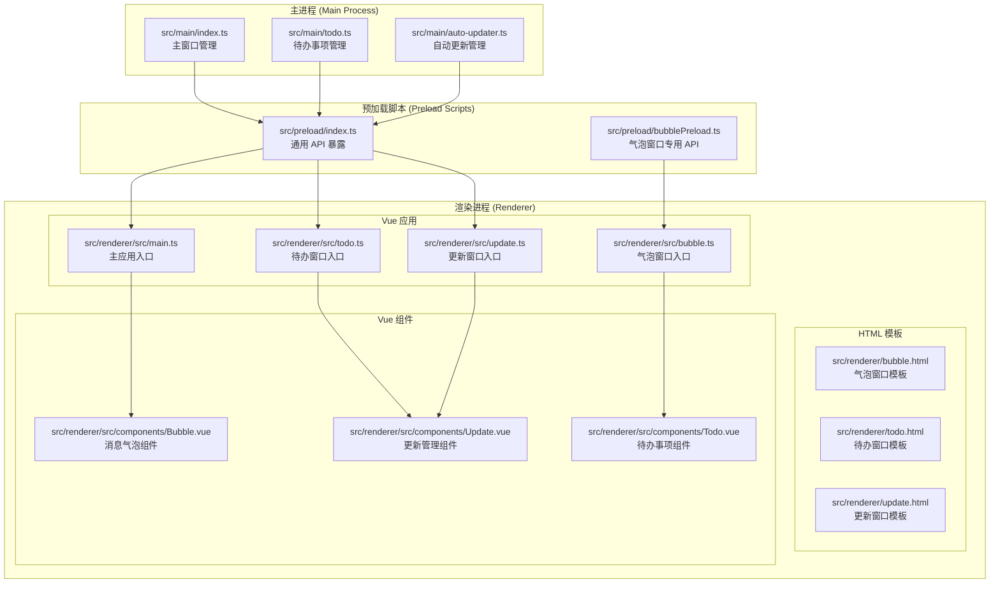
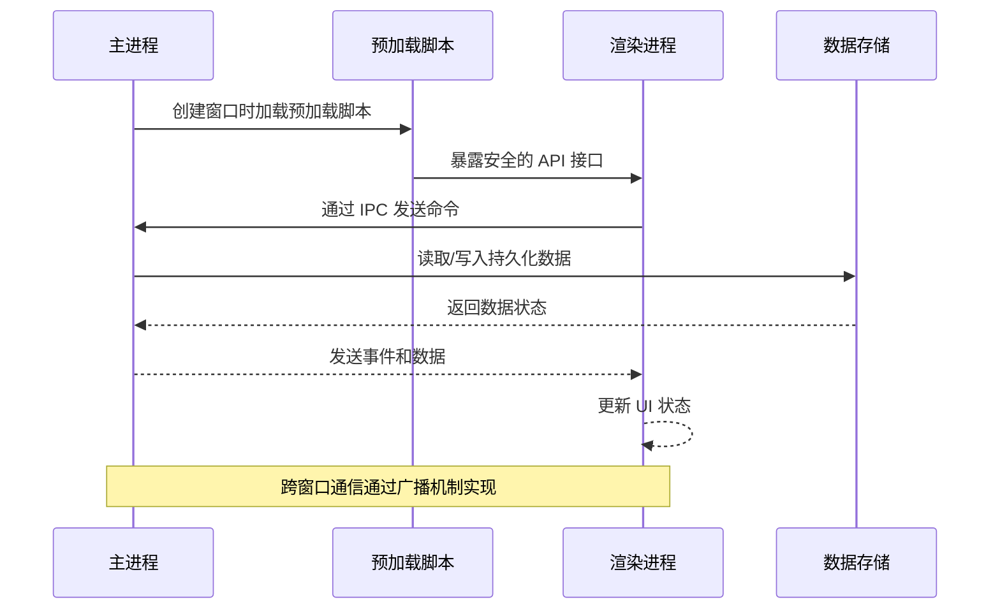
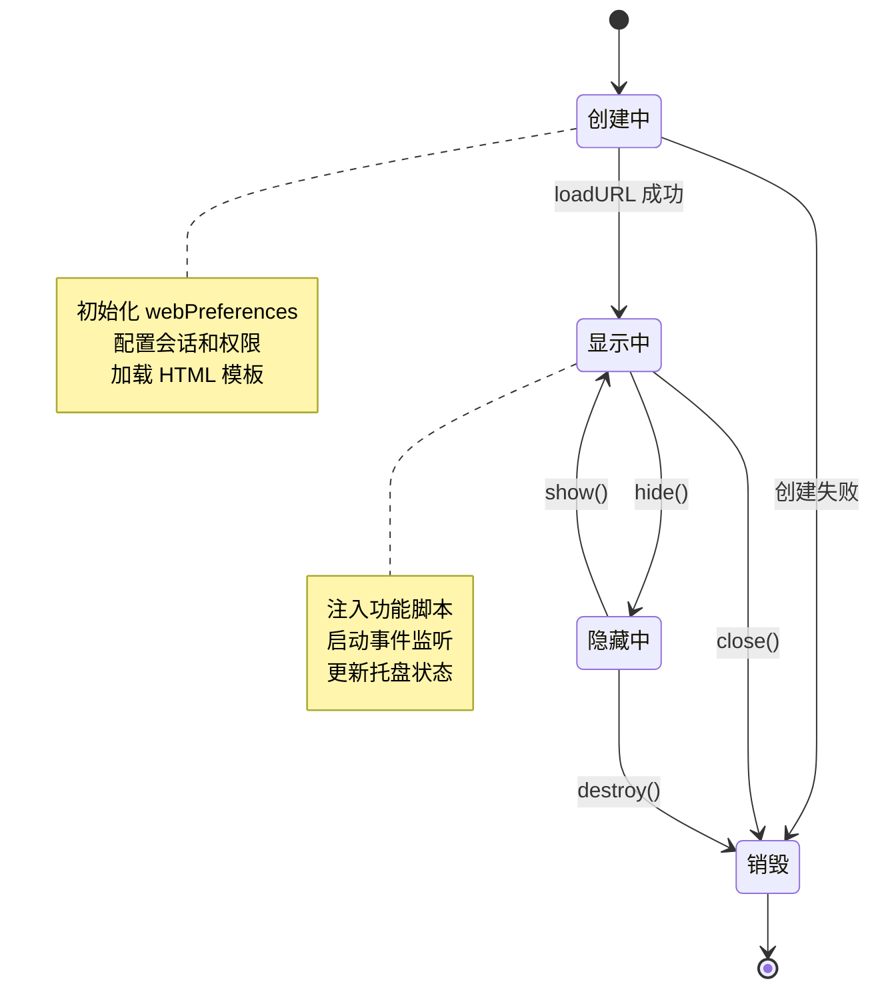
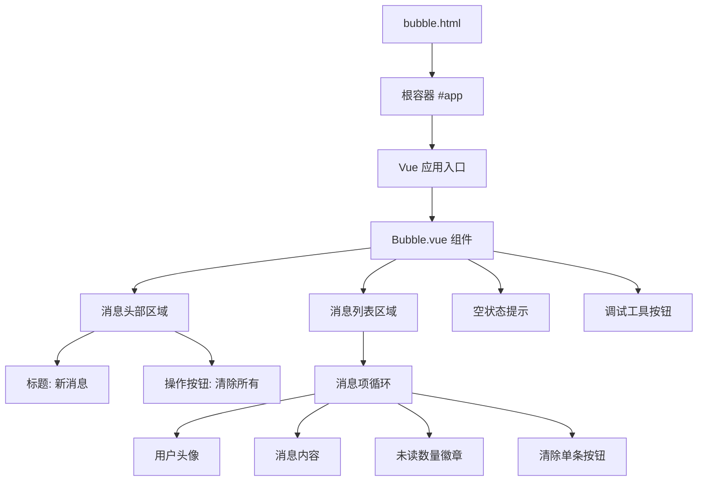
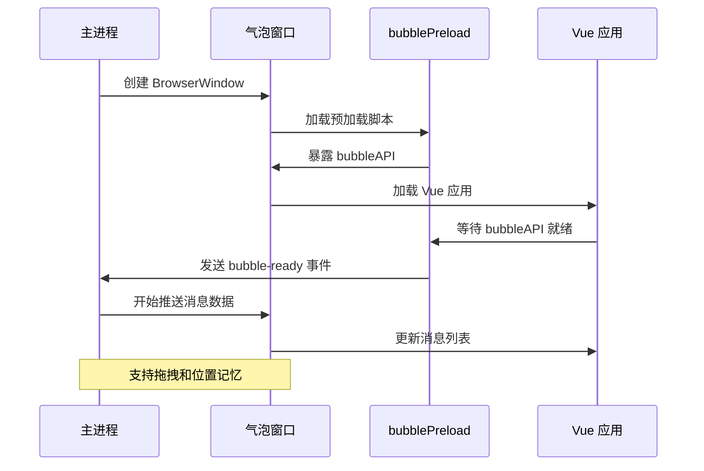
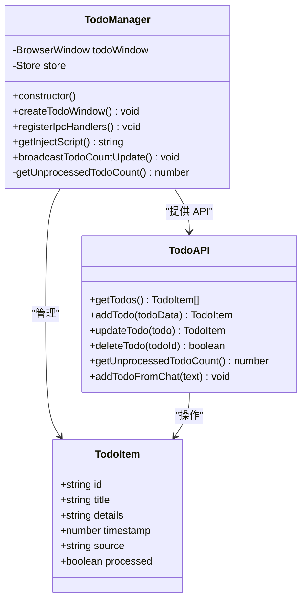
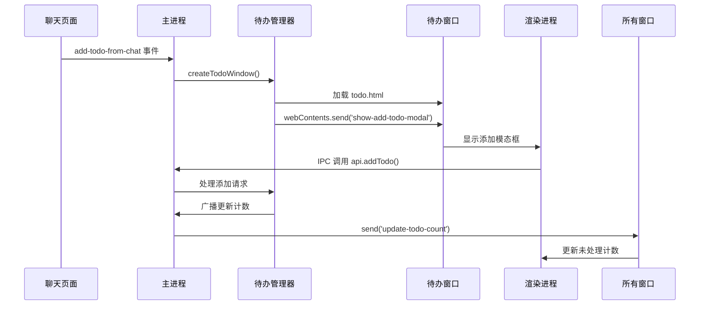
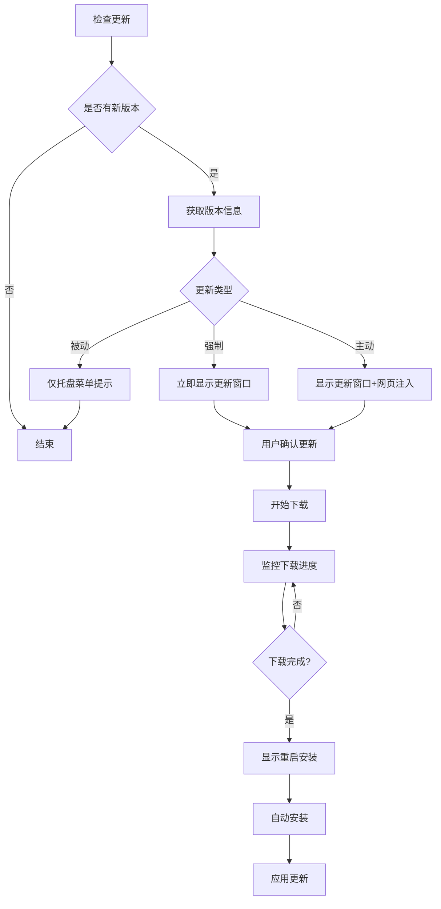
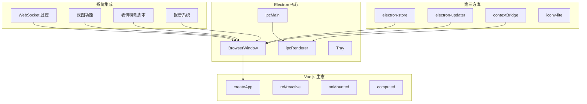

# 多窗口管理系统

<cite>
**本文档引用的文件**
- [src/main/index.ts](file://src/main/index.ts)
- [src/main/todo.ts](file://src/main/todo.ts)
- [src/main/auto-updater.ts](file://src/main/auto-updater.ts)
- [src/preload/index.ts](file://src/preload/index.ts)
- [src/preload/bubblePreload.ts](file://src/preload/bubblePreload.ts)
- [src/preload/index.d.ts](file://src/preload/index.d.ts)
- [src/renderer/src/main.ts](file://src/renderer/src/main.ts)
- [src/renderer/src/bubble.ts](file://src/renderer/src/bubble.ts)
- [src/renderer/src/todo.ts](file://src/renderer/src/todo.ts)
- [src/renderer/src/update.ts](file://src/renderer/src/update.ts)
- [src/renderer/bubble.html](file://src/renderer/bubble.html)
- [src/renderer/todo.html](file://src/renderer/todo.html)
- [src/renderer/update.html](file://src/renderer/update.html)
- [src/renderer/src/components/Bubble.vue](file://src/renderer/src/components/Bubble.vue)
- [src/renderer/src/components/Todo.vue](file://src/renderer/src/components/Todo.vue)
- [src/renderer/src/components/Update.vue](file://src/renderer/src/components/Update.vue)
</cite>

## 目录
1. [简介](#简介)
2. [项目结构](#项目结构)
3. [核心组件](#核心组件)
4. [架构概览](#架构概览)
5. [详细组件分析](#详细组件分析)
6. [依赖关系分析](#依赖关系分析)
7. [性能考虑](#性能考虑)
8. [故障排除指南](#故障排除指南)
9. [结论](#结论)

## 简介

WoaApp 是一个基于 Electron 的多窗口管理系统，提供了主窗口、气泡窗口、待办窗口和更新窗口等多种窗口类型的协同工作能力。该系统采用 Vue.js 作为前端框架，通过 IPC 机制实现窗口间的通信和数据共享。

系统的核心设计理念是：
- **模块化设计**：每个窗口类型都有独立的职责和生命周期管理
- **数据共享**：通过集中式存储和 IPC 实现跨窗口数据同步
- **用户体验优化**：提供智能的窗口定位、尺寸调整和状态记忆功能
- **扩展性**：支持动态窗口创建和销毁，以及窗口间事件驱动的通信

## 项目结构

项目的整体架构采用典型的 Electron + Vue.js 结构，分为三个主要层次：



**图表来源**
- [src/main/index.ts](file://src/main/index.ts#L1-L2406)
- [src/preload/index.ts](file://src/preload/index.ts#L1-L63)
- [src/preload/bubblePreload.ts](file://src/preload/bubblePreload.ts#L1-L70)

**章节来源**
- [src/main/index.ts](file://src/main/index.ts#L1-L2406)
- [src/preload/index.ts](file://src/preload/index.ts#L1-L63)

## 核心组件

### 主窗口 (Main Window)
主窗口是系统的核心控制中心，负责：
- 管理应用程序的主要界面
- 处理用户认证和会话管理
- 注入功能脚本到目标网站
- 协调其他窗口的生命周期

### 气泡窗口 (Bubble Window)
气泡窗口是一个透明的悬浮窗口，提供实时消息提醒功能：
- 位于屏幕右下角的固定位置
- 支持拖拽移动和自动吸附
- 实时显示未读消息和通知
- 提供消息清理和交互功能

### 待办窗口 (Todo Window)
待办窗口专门用于任务管理和组织：
- 独立的任务列表管理界面
- 支持任务的增删改查操作
- 与主窗口集成，支持从聊天内容创建任务
- 提供任务状态跟踪和分类

### 更新窗口 (Update Window)
更新窗口负责应用程序的版本管理和更新流程：
- 显示新版本信息和更新内容
- 提供下载进度监控
- 支持强制更新、主动提醒和被动提醒三种模式
- 处理自动安装和重启流程

**章节来源**
- [src/main/index.ts](file://src/main/index.ts#L276-L764)
- [src/main/todo.ts](file://src/main/todo.ts#L20-L136)
- [src/main/auto-updater.ts](file://src/main/auto-updater.ts#L40-L565)

## 架构概览

系统采用分层架构设计，通过 IPC 机制实现各层之间的通信：



**图表来源**
- [src/main/index.ts](file://src/main/index.ts#L115-L235)
- [src/preload/index.ts](file://src/preload/index.ts#L1-L63)

### 窗口生命周期管理



**图表来源**
- [src/main/index.ts](file://src/main/index.ts#L276-L615)
- [src/main/todo.ts](file://src/main/todo.ts#L38-L72)

## 详细组件分析

### 气泡窗口系统

#### HTML 模板结构
气泡窗口采用极简的 HTML 结构，专注于消息展示：



**图表来源**
- [src/renderer/bubble.html](file://src/renderer/bubble.html#L1-L33)
- [src/renderer/src/bubble.ts](file://src/renderer/src/bubble.ts#L1-L8)
- [src/renderer/src/components/Bubble.vue](file://src/renderer/src/components/Bubble.vue#L1-L77)

#### JavaScript 初始化逻辑
气泡窗口的初始化过程包含多个关键步骤：



**图表来源**
- [src/main/index.ts](file://src/main/index.ts#L618-L764)
- [src/preload/bubblePreload.ts](file://src/preload/bubblePreload.ts#L1-L70)
- [src/renderer/src/bubble.ts](file://src/renderer/src/bubble.ts#L1-L8)

#### 气泡窗口通信机制
气泡窗口通过专用的预加载脚本实现与主进程的安全通信：

| 事件名称 | 触发方 | 功能描述 |
|---------|--------|----------|
| update-message | 主进程 | 推送新的消息数据 |
| update-notification-mode | 主进程 | 更新通知模式设置 |
| bubble-ready | 气泡窗口 | 通知主进程已准备就绪 |
| bubble-mouse-enter | 气泡窗口 | 鼠标进入气泡区域 |
| bubble-mouse-leave | 气泡窗口 | 鼠标离开气泡区域 |
| notification-clicked | 气泡窗口 | 用户点击消息 |
| clear-single-message | 气泡窗口 | 清除单条消息 |
| clear-all-messages | 气泡窗口 | 清除所有消息 |

**章节来源**
- [src/preload/bubblePreload.ts](file://src/preload/bubblePreload.ts#L1-L70)
- [src/renderer/src/components/Bubble.vue](file://src/renderer/src/components/Bubble.vue#L79-L236)

### 待办窗口系统

#### 数据模型设计
待办窗口采用结构化的数据模型来管理任务信息：



**图表来源**
- [src/main/todo.ts](file://src/main/todo.ts#L6-L33)
- [src/main/todo.ts](file://src/main/todo.ts#L20-L136)

#### IPC 通信实现
待办窗口通过 IPC 机制实现与主进程的数据交换：



**图表来源**
- [src/main/todo.ts](file://src/main/todo.ts#L124-L135)
- [src/main/todo.ts](file://src/main/todo.ts#L149-L154)

**章节来源**
- [src/main/todo.ts](file://src/main/todo.ts#L1-L266)
- [src/renderer/src/components/Todo.vue](file://src/renderer/src/components/Todo.vue#L56-L150)

### 更新窗口系统

#### 更新流程管理
更新窗口实现了完整的版本管理流程：



**图表来源**
- [src/main/auto-updater.ts](file://src/main/auto-updater.ts#L189-L221)
- [src/main/auto-updater.ts](file://src/main/auto-updater.ts#L273-L295)

#### 自动更新机制
更新窗口通过 Electron Updater 实现自动更新功能：

| 功能特性 | 实现方式 | 配置参数 |
|---------|----------|----------|
| 版本检查 | 定时轮询 API | 5秒间隔 |
| 下载进度 | 监听 download-progress 事件 | 实时进度反馈 |
| 强制更新 | 禁用关闭窗口 | beforeunload 事件拦截 |
| 主动提醒 | 注入网页更新图标 | CSS 动画效果 |
| 被动提醒 | 托盘菜单状态指示 | 图标颜色变化 |

**章节来源**
- [src/main/auto-updater.ts](file://src/main/auto-updater.ts#L1-L565)
- [src/renderer/src/components/Update.vue](file://src/renderer/src/components/Update.vue#L72-L338)

### 窗口间数据共享机制

#### 共享存储策略
系统采用集中式存储和广播机制实现窗口间数据同步：

```mermaid
graph LR
subgraph "数据存储层"
Store[electron-store<br/>持久化存储]
end
subgraph "窗口层"
MainWnd[主窗口]
BubbleWnd[气泡窗口]
TodoWnd[待办窗口]
UpdateWnd[更新窗口]
end
subgraph "通信层"
IPC[IPC 通信]
Broadcast[窗口广播]
end
MainWnd --> IPC
BubbleWnd --> IPC
TodoWnd --> IPC
UpdateWnd --> IPC
IPC --> Store
Store --> Broadcast
Broadcast --> MainWnd
Broadcast --> BubbleWnd
Broadcast --> TodoWnd
Broadcast --> UpdateWnd
note right of Store
TodoManager: 任务数据
AutoUpdater: 版本信息
用户偏好设置
end note
```

**图表来源**
- [src/main/todo.ts](file://src/main/todo.ts#L26-L32)
- [src/main/todo.ts](file://src/main/todo.ts#L149-L154)

#### 状态同步实现
窗口间的状态同步通过以下机制实现：

1. **待办事项计数同步**：TodoManager 监听数据变更并向所有窗口广播更新
2. **通知模式同步**：气泡窗口的显示模式通过 IPC 在主进程和渲染进程间同步
3. **用户行为追踪**：主窗口聚焦时上报用户行为数据
4. **托盘状态同步**：未读消息数量影响托盘图标的闪烁状态

**章节来源**
- [src/main/index.ts](file://src/main/index.ts#L130-L139)
- [src/main/todo.ts](file://src/main/todo.ts#L149-L154)

## 依赖关系分析

### 核心依赖关系



**图表来源**
- [src/main/index.ts](file://src/main/index.ts#L1-L27)
- [src/main/todo.ts](file://src/main/todo.ts#L1-L4)
- [src/main/auto-updater.ts](file://src/main/auto-updater.ts#L1-L8)

### 模块耦合度分析

系统的模块设计遵循高内聚、低耦合的原则：

| 模块 | 耦合度 | 依赖关系 | 设计特点 |
|------|--------|----------|----------|
| 主窗口管理 | 低 | 依赖所有子模块 | 中央协调者 |
| 气泡窗口 | 低 | 依赖预加载脚本 | 独立功能模块 |
| 待办管理 | 中 | 依赖存储和 IPC | 业务逻辑中心 |
| 更新管理 | 中 | 依赖外部 API 和存储 | 外部集成模块 |
| 预加载脚本 | 低 | 依赖上下文桥接 | 安全接口层 |

**章节来源**
- [src/main/index.ts](file://src/main/index.ts#L1-L2406)
- [src/preload/index.ts](file://src/preload/index.ts#L1-L63)

## 性能考虑

### 内存管理优化
系统在内存管理方面采用了多项优化策略：

1. **窗口懒加载**：只有在需要时才创建和显示窗口
2. **资源释放**：窗口关闭时及时清理事件监听器和定时器
3. **存储优化**：使用 electron-store 进行高效的数据持久化
4. **渲染进程复用**：避免不必要的渲染进程重启

### 网络性能优化
针对网络请求进行了专门的优化：

1. **会话持久化**：保持登录状态，减少重复认证
2. **请求缓存**：合理利用浏览器缓存机制
3. **连接池管理**：优化 WebSocket 连接的建立和维护
4. **超时控制**：设置合理的请求超时和重试机制

### 用户体验优化
系统在用户体验方面实现了多项优化：

1. **窗口定位记忆**：气泡窗口的位置信息持久化存储
2. **平滑动画效果**：使用 CSS3 动画提升视觉体验
3. **响应式布局**：适配不同分辨率和缩放比例
4. **无障碍支持**：提供键盘导航和屏幕阅读器支持

## 故障排除指南

### 常见问题诊断

#### 窗口无法创建
**症状**：应用程序启动后某些窗口无法显示
**可能原因**：
1. 预加载脚本加载失败
2. HTML 模板路径配置错误
3. 权限设置不当
4. 系统资源不足

**解决方案**：
1. 检查预加载脚本的语法和依赖
2. 验证 HTML 文件的完整性和可访问性
3. 确认 webPreferences 配置正确
4. 监控系统资源使用情况

#### IPC 通信异常
**症状**：窗口间通信失效，数据不同步
**可能原因**：
1. IPC 事件名不匹配
2. 预加载脚本暴露的 API 不完整
3. 上下文隔离配置错误
4. 渲染进程异常退出

**解决方案**：
1. 统一 IPC 事件命名规范
2. 检查预加载脚本的 API 暴露逻辑
3. 验证 contextIsolation 配置
4. 实现 IPC 事件的错误处理和重连机制

#### 数据同步问题
**症状**：待办事项计数显示不正确
**可能原因**：
1. 存储数据损坏
2. 广播机制失效
3. 窗口状态不同步
4. 数据竞争条件

**解决方案**：
1. 实施数据完整性检查和修复
2. 优化广播机制的可靠性和顺序
3. 增强窗口状态的同步机制
4. 使用锁机制避免数据竞争

**章节来源**
- [src/main/index.ts](file://src/main/index.ts#L740-L747)
- [src/main/todo.ts](file://src/main/todo.ts#L149-L154)

### 调试工具和方法

#### 开发者工具集成
系统提供了完善的调试支持：

1. **主进程调试**：通过 Electron DevTools 监控窗口状态
2. **渲染进程调试**：Vue DevTools 支持组件状态检查
3. **IPC 调试**：日志记录和事件追踪
4. **性能分析**：内存和 CPU 使用情况监控

#### 日志记录策略
系统采用分级日志记录机制：

| 日志级别 | 用途 | 示例 |
|----------|------|------|
| Debug | 开发调试信息 | 组件挂载状态 |
| Info | 一般运行信息 | 窗口创建/销毁 |
| Warn | 警告信息 | 可恢复的异常 |
| Error | 错误信息 | 不可恢复的故障 |

## 结论

WoaApp 的多窗口管理系统展现了现代桌面应用程序的最佳实践。通过精心设计的架构和实现，系统实现了：

1. **模块化设计**：每个窗口类型都有清晰的职责边界和独立的生命周期管理
2. **数据一致性**：通过集中式存储和广播机制确保跨窗口数据同步
3. **用户体验**：提供智能的窗口定位、动画效果和状态记忆功能
4. **扩展性**：支持动态窗口创建和灵活的通信机制

系统的成功关键在于：
- 合理的架构分层和模块划分
- 安全可靠的 IPC 通信机制
- 完善的错误处理和故障恢复
- 注重用户体验的细节优化

未来可以进一步优化的方向包括：
- 实现更精细的内存管理和资源回收
- 增强网络请求的重试和断线重连机制
- 提供更丰富的主题和个性化选项
- 扩展更多实用的窗口功能和集成能力