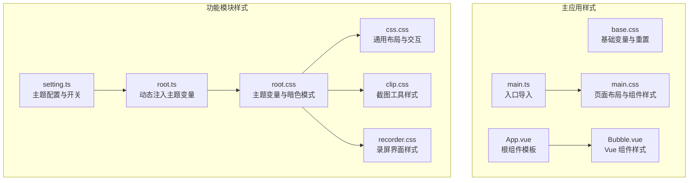
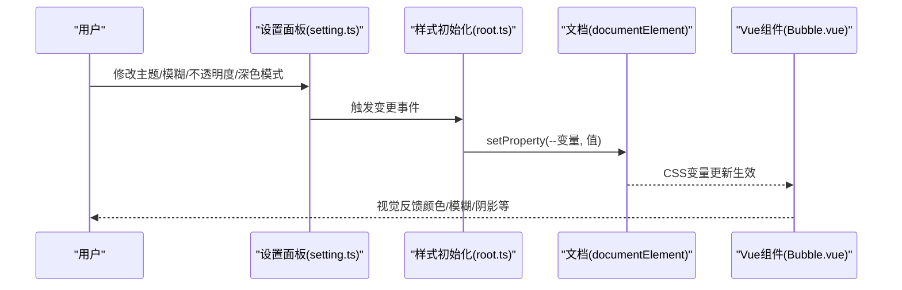
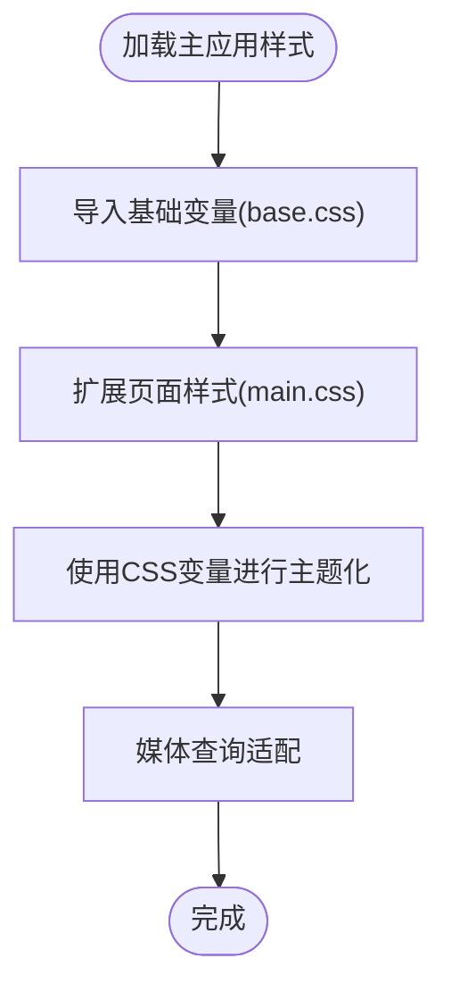
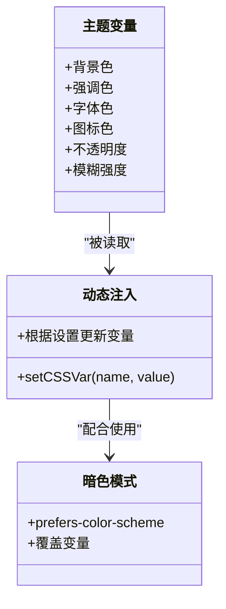
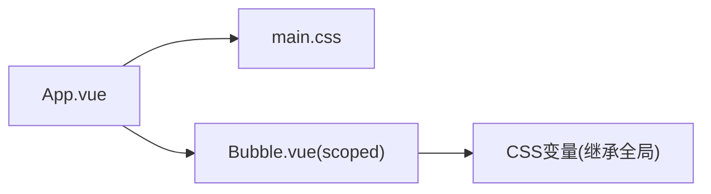
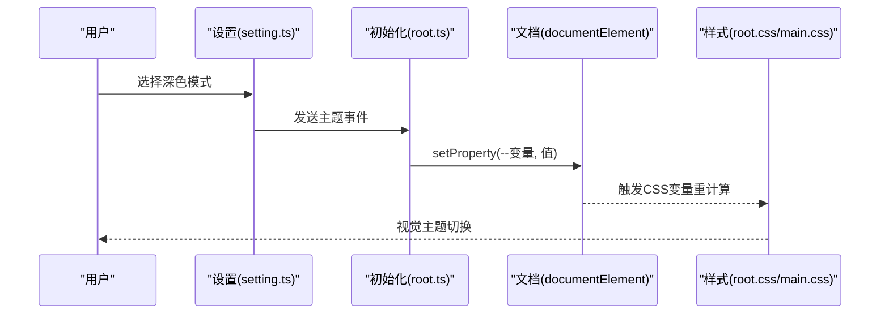
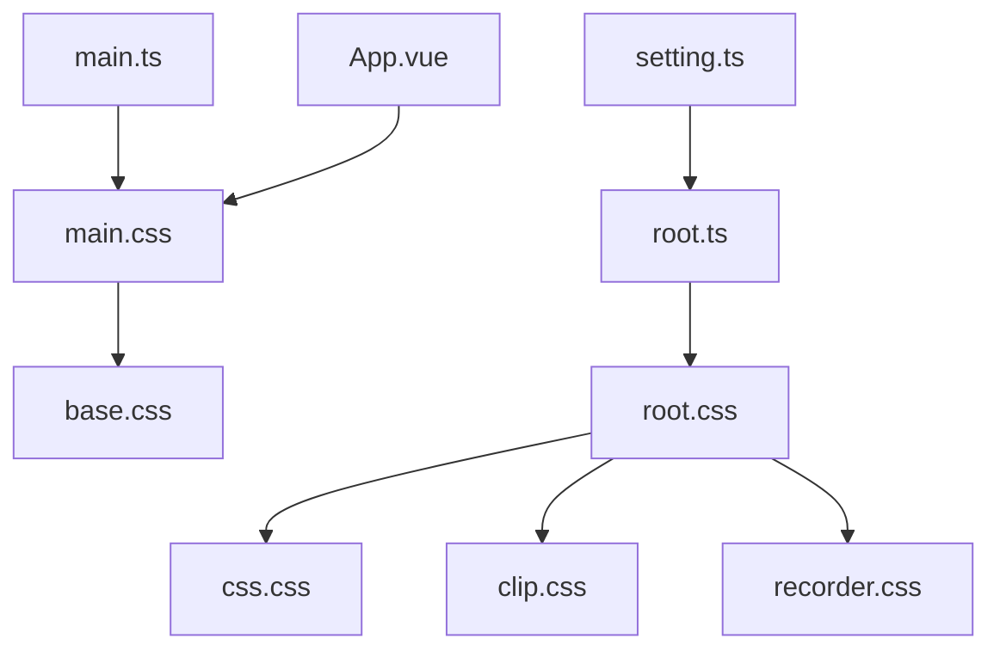

# 样式与主题系统

<cite>
**本文档引用的文件**
- [base.css](file://src/renderer/src/assets/base.css)
- [main.css](file://src/renderer/src/assets/main.css)
- [App.vue](file://src/renderer/src/App.vue)
- [main.ts](file://src/renderer/src/main.ts)
- [root.css](file://temp_eSearch/src/renderer/css/root.css)
- [css.css](file://temp_eSearch/src/renderer/css/css.css)
- [clip.css](file://temp_eSearch/src/renderer/css/clip.css)
- [recorder.css](file://temp_eSearch/src/renderer/css/recorder.css)
- [root.ts](file://temp_eSearch/src/renderer/root/root.ts)
- [setting.ts](file://temp_eSearch/src/renderer/setting/setting.ts)
- [Bubble.vue](file://src/renderer/src/components/Bubble.vue)
- [global.d.ts](file://src/renderer/src/types/global.d.ts)
</cite>

## 目录
1. [简介](#简介)
2. [项目结构](#项目结构)
3. [核心组件](#核心组件)
4. [架构总览](#架构总览)
5. [详细组件分析](#详细组件分析)
6. [依赖关系分析](#依赖关系分析)
7. [性能考虑](#性能考虑)
8. [故障排查指南](#故障排查指南)
9. [结论](#结论)
10. [附录](#附录)

## 简介
本文件系统性梳理 WoaApp 的样式与主题体系，覆盖基础样式、组件样式、主题变量、模块化策略、样式隔离、响应式设计、颜色/字体/间距系统、主题切换机制（含动态样式注入与 CSS 变量）、以及与 Vue 组件的集成实践与性能优化策略。目标是帮助开发者快速理解并扩展样式系统。

## 项目结构
WoaApp 的样式体系由两部分组成：
- 主应用样式：位于渲染器资源目录，负责通用基础与页面级样式。
- 功能模块样式：位于 temp_eSearch 子项目，提供多窗口/功能域的独立样式与主题变量。

**图表来源**
- [base.css](file://src/renderer/src/assets/base.css#L1-L68)
- [main.css](file://src/renderer/src/assets/main.css#L1-L172)
- [main.ts](file://src/renderer/src/main.ts#L1-L7)
- [App.vue](file://src/renderer/src/App.vue#L1-L27)
- [Bubble.vue](file://src/renderer/src/components/Bubble.vue#L238-L467)
- [root.css](file://temp_eSearch/src/renderer/css/root.css#L1-L290)
- [css.css](file://temp_eSearch/src/renderer/css/css.css#L1-L402)
- [clip.css](file://temp_eSearch/src/renderer/css/clip.css#L1-L525)
- [recorder.css](file://temp_eSearch/src/renderer/css/recorder.css#L1-L116)
- [root.ts](file://temp_eSearch/src/renderer/root/root.ts#L1-L211)
- [setting.ts](file://temp_eSearch/src/renderer/setting/setting.ts#L1470-L1546)

**章节来源**
- [main.ts](file://src/renderer/src/main.ts#L1-L7)
- [base.css](file://src/renderer/src/assets/base.css#L1-L68)
- [main.css](file://src/renderer/src/assets/main.css#L1-L172)
- [root.css](file://temp_eSearch/src/renderer/css/root.css#L1-L290)
- [root.ts](file://temp_eSearch/src/renderer/root/root.ts#L1-L211)

## 核心组件
- 基础样式层：通过 CSS 变量集中定义颜色、字体、间距、阴影、过渡等，确保全局一致性与可替换性。
- 主题变量层：在功能模块中以 CSS 变量为核心，结合 JavaScript 动态注入，实现主题切换与运行时调整。
- 组件样式层：主应用采用外部样式文件；功能模块采用 Vue 单文件组件的 scoped 样式，保证样式隔离。
- 响应式层：在基础与功能样式中均使用媒体查询，适配不同屏幕尺寸与系统偏好。

**章节来源**
- [base.css](file://src/renderer/src/assets/base.css#L1-L68)
- [main.css](file://src/renderer/src/assets/main.css#L154-L171)
- [root.css](file://temp_eSearch/src/renderer/css/root.css#L1-L290)
- [Bubble.vue](file://src/renderer/src/components/Bubble.vue#L238-L467)

## 架构总览
整体架构围绕“CSS 变量 + 动态注入 + 组件隔离”的思路展开：
- 基础变量：主应用 base.css 定义基础变量，供全局使用。
- 主题变量：功能模块 root.css 定义主题相关变量与暗色模式分支。
- 运行时注入：root.ts 读取设置存储，动态设置 documentElement 的 CSS 变量。
- 配置开关：setting.ts 提供主题、模糊、不透明度、深色模式等配置项。
- 组件隔离：Vue 组件使用 scoped 样式，避免污染全局；同时可读取 CSS 变量保持风格一致。

**图表来源**
- [setting.ts](file://temp_eSearch/src/renderer/setting/setting.ts#L1513-L1526)
- [root.ts](file://temp_eSearch/src/renderer/root/root.ts#L9-L40)
- [Bubble.vue](file://src/renderer/src/components/Bubble.vue#L238-L467)

## 详细组件分析

### 基础样式与模块化策略
- base.css
  - 定义基础颜色变量与文本变量，作为全局默认值。
  - 定义 body 重置与字体链，确保跨平台一致性。
- main.css
  - 引入 base.css，扩展页面布局、按钮、版本信息等样式。
  - 使用 CSS 变量统一颜色与间距，便于主题替换。
  - 包含响应式断点，适配小屏设备。

**图表来源**
- [base.css](file://src/renderer/src/assets/base.css#L1-L68)
- [main.css](file://src/renderer/src/assets/main.css#L1-L172)

**章节来源**
- [base.css](file://src/renderer/src/assets/base.css#L1-L68)
- [main.css](file://src/renderer/src/assets/main.css#L1-L172)

### 主题变量与暗色模式
- root.css
  - 定义主题相关变量（背景、强调色、字体色、图标色等）及暗色模式分支。
  - 使用 color-mix 计算派生色阶，形成层次化的色彩系统。
  - 通过 prefers-color-scheme 自动适配系统深色模式。
- root.ts
  - 从设置存储读取主题配置，动态设置 CSS 变量。
  - 支持运行时调整模糊强度、不透明度、字体族等。
  - 将图标勾选状态转换为 SVG data:image 并注入变量，保证图标颜色与主题一致。

**图表来源**
- [root.css](file://temp_eSearch/src/renderer/css/root.css#L1-L290)
- [root.ts](file://temp_eSearch/src/renderer/root/root.ts#L1-L211)

**章节来源**
- [root.css](file://temp_eSearch/src/renderer/css/root.css#L1-L290)
- [root.ts](file://temp_eSearch/src/renderer/root/root.ts#L1-L211)

### Vue 组件样式与样式隔离
- Bubble.vue
  - 使用 scoped 样式，确保组件样式不泄漏到全局。
  - 在局部样式中直接使用浏览器原生滚动条伪元素，实现自定义滚动条。
  - 通过 CSS 变量与全局主题保持一致的视觉风格。
- App.vue
  - 作为根组件，引入主应用样式，承载页面级布局与交互。

**图表来源**
- [App.vue](file://src/renderer/src/App.vue#L1-L27)
- [main.css](file://src/renderer/src/assets/main.css#L1-L172)
- [Bubble.vue](file://src/renderer/src/components/Bubble.vue#L238-L467)

**章节来源**
- [App.vue](file://src/renderer/src/App.vue#L1-L27)
- [Bubble.vue](file://src/renderer/src/components/Bubble.vue#L238-L467)

### 响应式设计实现
- 主应用：在 main.css 中使用媒体查询，针对不同宽度隐藏或调整元素，提升移动端体验。
- 功能模块：root.css 与 css.css 同样使用媒体查询与系统偏好检测，保证在不同设备与系统下的一致表现。

**章节来源**
- [main.css](file://src/renderer/src/assets/main.css#L154-L171)
- [root.css](file://temp_eSearch/src/renderer/css/root.css#L268-L289)
- [css.css](file://temp_eSearch/src/renderer/css/css.css#L301-L305)

### 颜色系统、字体系统、间距系统
- 颜色系统
  - 基于 CSS 变量的主色、强调色、背景色、字体色与图标色分层。
  - 使用 color-mix 计算派生色阶，形成稳定的明暗梯度。
- 字体系统
  - 通过 CSS 变量统一设置主要字体与等宽字体，root.ts 动态注入字体族。
- 间距系统
  - 使用统一的内边距与半径变量，配合媒体查询在小屏上缩小间距。

**章节来源**
- [root.css](file://temp_eSearch/src/renderer/css/root.css#L1-L74)
- [root.ts](file://temp_eSearch/src/renderer/root/root.ts#L42-L44)

### 主题切换机制与动态样式注入
- 设置项
  - setting.ts 提供“深色模式”选择（跟随系统/浅色/深色），并发送主题变更事件。
- 注入流程
  - root.ts 读取设置存储，调用 setProperty 更新 documentElement 上的 CSS 变量。
  - 暗色模式分支在 root.css 中通过媒体查询覆盖关键变量。
- 效果
  - 所有使用 CSS 变量的组件与页面自动响应主题变化，无需重新编译。

**图表来源**
- [setting.ts](file://temp_eSearch/src/renderer/setting/setting.ts#L1513-L1526)
- [root.ts](file://temp_eSearch/src/renderer/root/root.ts#L9-L40)
- [root.css](file://temp_eSearch/src/renderer/css/root.css#L268-L289)

**章节来源**
- [setting.ts](file://temp_eSearch/src/renderer/setting/setting.ts#L1470-L1546)
- [root.ts](file://temp_eSearch/src/renderer/root/root.ts#L1-L211)
- [root.css](file://temp_eSearch/src/renderer/css/root.css#L1-L290)

### 与 Vue 组件样式的集成方式与最佳实践
- 组件样式
  - 使用 scoped 样式避免全局污染；必要时通过 CSS 变量与全局主题保持一致。
- 全局样式
  - 主应用通过 main.ts 导入全局样式，确保根组件与页面级元素具备统一基线。
- 类名与结构
  - 采用语义化类名，配合 CSS 变量与媒体查询，减少重复样式。

**章节来源**
- [main.ts](file://src/renderer/src/main.ts#L1-L7)
- [Bubble.vue](file://src/renderer/src/components/Bubble.vue#L238-L467)

## 依赖关系分析
- 主应用依赖
  - main.ts 依赖 main.css；main.css 依赖 base.css。
  - App.vue 作为根组件承载页面结构。
- 功能模块依赖
  - root.css 为各功能样式提供主题变量基础。
  - root.ts 依赖设置存储，动态注入变量。
  - setting.ts 提供主题配置与开关，驱动 root.ts 的执行。

**图表来源**
- [main.ts](file://src/renderer/src/main.ts#L1-L7)
- [main.css](file://src/renderer/src/assets/main.css#L1-L1)
- [base.css](file://src/renderer/src/assets/base.css#L1-L1)
- [App.vue](file://src/renderer/src/App.vue#L1-L27)
- [root.css](file://temp_eSearch/src/renderer/css/root.css#L1-L290)
- [css.css](file://temp_eSearch/src/renderer/css/css.css#L1-L402)
- [clip.css](file://temp_eSearch/src/renderer/css/clip.css#L1-L525)
- [recorder.css](file://temp_eSearch/src/renderer/css/recorder.css#L1-L116)
- [root.ts](file://temp_eSearch/src/renderer/root/root.ts#L1-L211)
- [setting.ts](file://temp_eSearch/src/renderer/setting/setting.ts#L1470-L1546)

**章节来源**
- [main.ts](file://src/renderer/src/main.ts#L1-L7)
- [main.css](file://src/renderer/src/assets/main.css#L1-L172)
- [base.css](file://src/renderer/src/assets/base.css#L1-L68)
- [root.css](file://temp_eSearch/src/renderer/css/root.css#L1-L290)
- [root.ts](file://temp_eSearch/src/renderer/root/root.ts#L1-L211)
- [setting.ts](file://temp_eSearch/src/renderer/setting/setting.ts#L1470-L1546)

## 性能考虑
- CSS 变量与计算属性
  - 使用 CSS 变量与 color-mix 减少重复样式定义，降低维护成本与体积。
- 按需加载
  - 功能模块样式按需引入，避免一次性加载过多无关样式。
- 运行时注入
  - 通过 setProperty 动态更新变量，避免全量重绘，提升主题切换流畅度。
- 滚动条与滤镜
  - 对滚动条与模糊效果使用 CSS 变量控制，便于在设置中即时关闭以提升性能。
- 媒体查询
  - 合理使用媒体查询与系统偏好检测，减少不必要的样式分支。

[本节为通用性能建议，不直接分析具体文件]

## 故障排查指南
- 主题不生效
  - 检查设置面板是否正确触发主题事件；确认 root.ts 是否成功设置 CSS 变量。
  - 确认 root.css 的暗色模式分支是否覆盖了关键变量。
- 滚动条样式异常
  - 检查功能模块样式中滚动条伪元素的自定义规则是否冲突。
- Vue 组件样式冲突
  - 确认组件使用的是 scoped 样式；若需与全局变量联动，可通过 CSS 变量访问。
- 字体显示问题
  - 检查 root.ts 是否正确注入字体变量；确认字体链中的字体是否存在。

**章节来源**
- [setting.ts](file://temp_eSearch/src/renderer/setting/setting.ts#L1513-L1526)
- [root.ts](file://temp_eSearch/src/renderer/root/root.ts#L1-L211)
- [root.css](file://temp_eSearch/src/renderer/css/root.css#L1-L290)
- [Bubble.vue](file://src/renderer/src/components/Bubble.vue#L238-L467)

## 结论
WoaApp 的样式与主题系统以 CSS 变量为核心，结合运行时动态注入与组件级样式隔离，实现了高可维护性与强扩展性的前端样式架构。通过统一的颜色、字体、间距系统与响应式策略，系统在多窗口与多功能场景下仍能保持一致的视觉体验。建议在后续迭代中继续强化变量命名规范与文档化，以进一步降低耦合与提升协作效率。

## 附录
- 术语
  - CSS 变量：以 -- 前缀定义的可复用样式值。
  - 暗色模式：基于系统偏好或用户选择的主题模式。
  - scoped 样式：Vue 单文件组件的样式作用域限定。
- 相关文件路径
  - [base.css](file://src/renderer/src/assets/base.css)
  - [main.css](file://src/renderer/src/assets/main.css)
  - [main.ts](file://src/renderer/src/main.ts)
  - [App.vue](file://src/renderer/src/App.vue)
  - [Bubble.vue](file://src/renderer/src/components/Bubble.vue)
  - [root.css](file://temp_eSearch/src/renderer/css/root.css)
  - [css.css](file://temp_eSearch/src/renderer/css/css.css)
  - [clip.css](file://temp_eSearch/src/renderer/css/clip.css)
  - [recorder.css](file://temp_eSearch/src/renderer/css/recorder.css)
  - [root.ts](file://temp_eSearch/src/renderer/root/root.ts)
  - [setting.ts](file://temp_eSearch/src/renderer/setting/setting.ts)
  - [global.d.ts](file://src/renderer/src/types/global.d.ts)