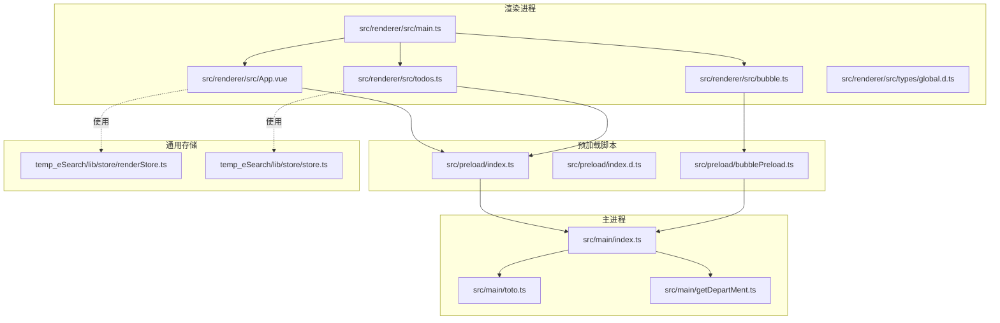
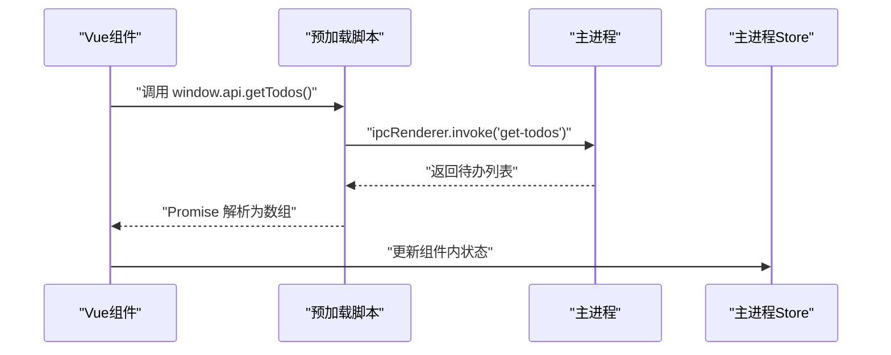
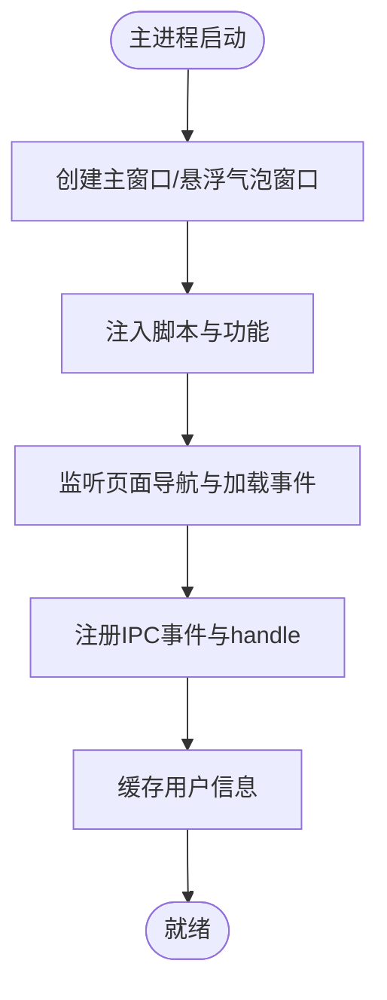
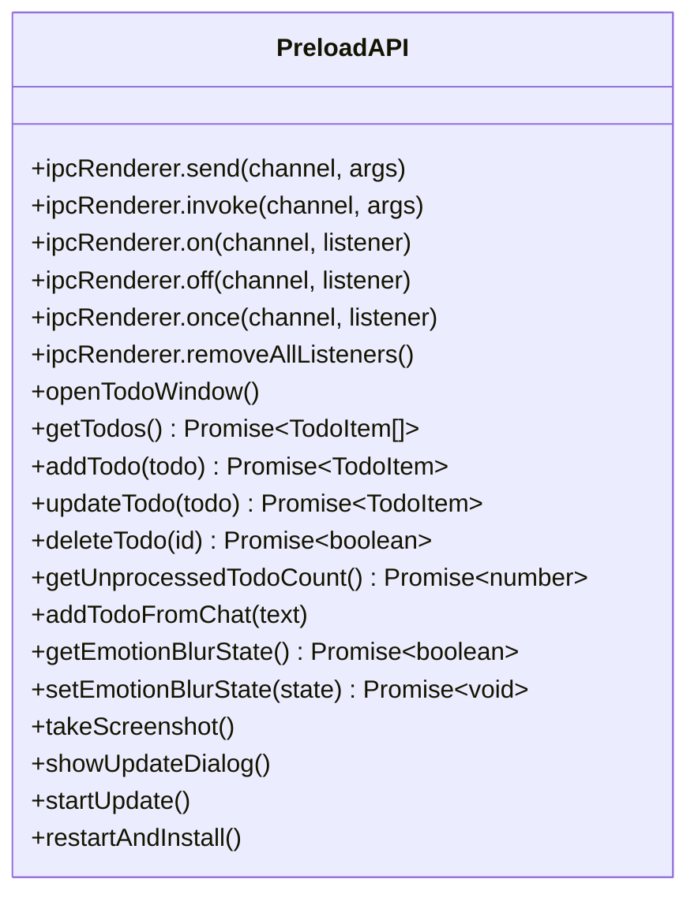
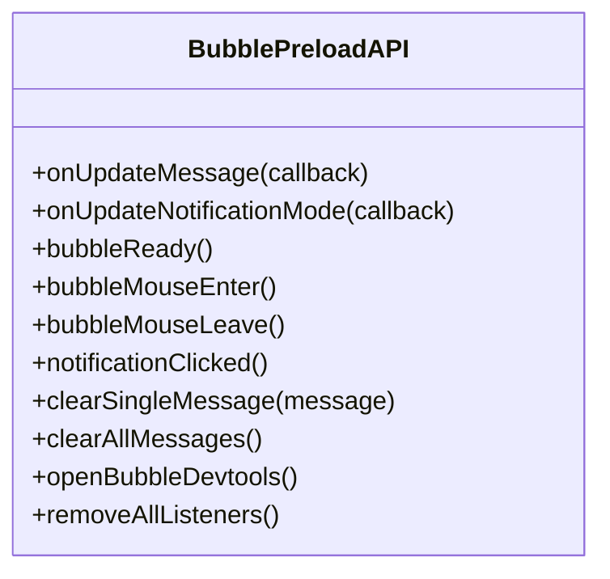
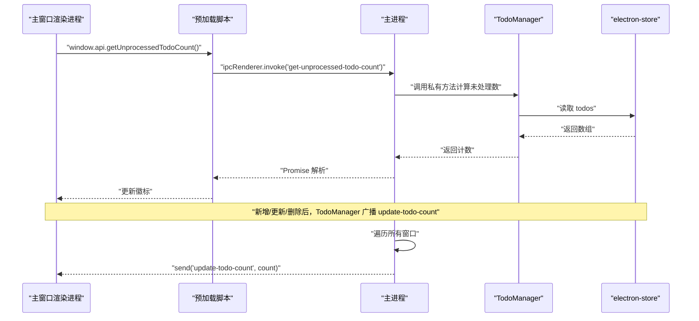
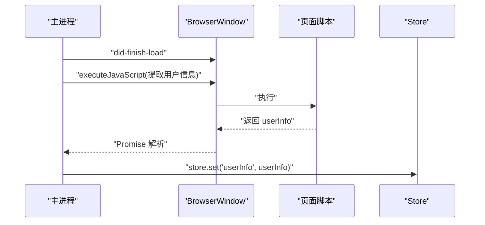
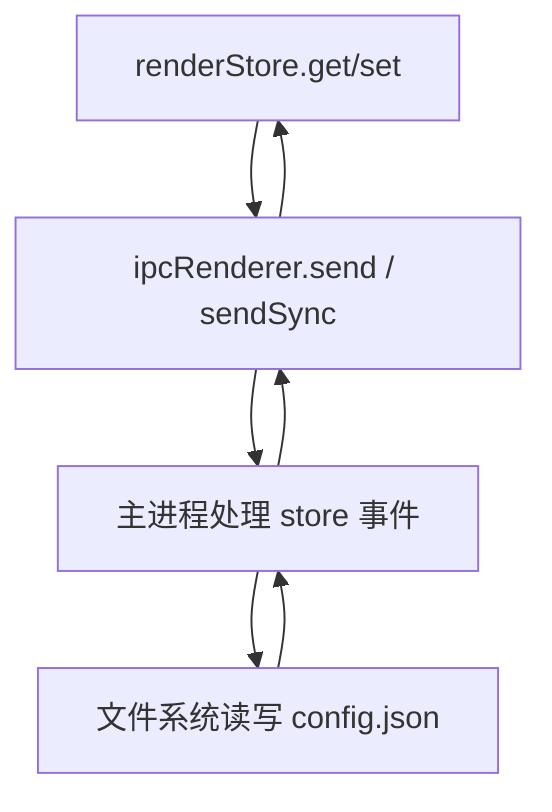
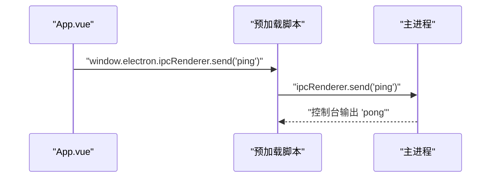
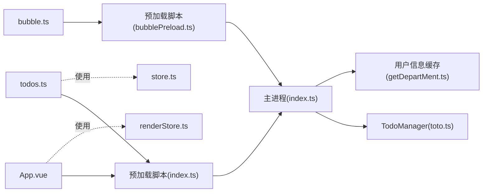

# 状态管理与数据流

<cite>
**本文引用的文件**
- [src/main/index.ts](file://src/main/index.ts)
- [src/main/toto.ts](file://src/main/toto.ts)
- [src/main/getDepartMent.ts](file://src/main/getDepartMent.ts)
- [src/preload/index.ts](file://src/preload/index.ts)
- [src/preload/index.d.ts](file://src/preload/index.d.ts)
- [src/preload/bubblePreload.ts](file://src/preload/bubblePreload.ts)
- [src/renderer/src/main.ts](file://src/renderer/src/main.ts)
- [src/renderer/src/App.vue](file://src/renderer/src/App.vue)
- [src/renderer/src/bubble.ts](file://src/renderer/src/bubble.ts)
- [src/renderer/src/todos.ts](file://src/renderer/src/todos.ts)
- [src/renderer/src/types/global.d.ts](file://src/renderer/src/types/global.d.ts)
- [temp_eSearch/lib/store/store.ts](file://temp_eSearch/lib/store/store.ts)
- [temp_eSearch/lib/store/renderStore.ts](file://temp_eSearch/lib/store/renderStore.ts)
- [ARCHITECTURE.md](file://ARCHITECTURE.md)
- [README.md](file://README.md)
</cite>

## 目录
1. [引言](#引言)
2. [项目结构](#项目结构)
3. [核心组件](#核心组件)
4. [架构总览](#架构总览)
5. [详细组件分析](#详细组件分析)
6. [依赖关系分析](#依赖关系分析)
7. [性能考量](#性能考量)
8. [故障排查指南](#故障排查指南)
9. [结论](#结论)
10. [附录](#附录)

## 引言
本文件聚焦于 WoaApp 的状态管理与数据流，系统性阐述 Vue 应用在渲染进程内的状态组织方式、与主进程的 IPC 通信模型、预加载脚本在安全桥接中的职责与边界、以及数据持久化与缓存策略。文档同时给出数据流向图与状态变更流程图，并总结错误处理与 TypeScript 类型在状态管理中的最佳实践。

## 项目结构
WoaApp 采用 Electron + Vue 的经典架构，分为三大部分：
- 主进程：负责窗口生命周期、系统级能力、与外部服务交互、IPC 事件注册与处理。
- 预加载脚本：在受限上下文中向渲染进程暴露受控 API，作为安全桥接。
- 渲染进程（Vue 应用）：承载 UI 与业务逻辑，通过 IPC 与主进程交互，使用预加载脚本提供的 API。

图表来源
- [src/main/index.ts](file://src/main/index.ts#L1-L2406)
- [src/main/toto.ts](file://src/main/toto.ts#L1-L266)
- [src/main/getDepartMent.ts](file://src/main/getDepartMent.ts#L1-L50)
- [src/preload/index.ts](file://src/preload/index.ts#L1-L63)
- [src/preload/index.d.ts](file://src/preload/index.d.ts#L1-L23)
- [src/preload/bubblePreload.ts](file://src/preload/bubblePreload.ts#L1-L70)
- [src/renderer/src/main.ts](file://src/renderer/src/main.ts#L1-L7)
- [src/renderer/src/App.vue](file://src/renderer/src/App.vue#L1-L27)
- [src/renderer/src/bubble.ts](file://src/renderer/src/bubble.ts#L1-L8)
- [src/renderer/src/todos.ts](file://src/renderer/src/todos.ts#L1-L9)
- [src/renderer/src/types/global.d.ts](file://src/renderer/src/types/global.d.ts#L1-L20)
- [temp_eSearch/lib/store/renderStore.ts](file://temp_eSearch/lib/store/renderStore.ts#L1-L49)
- [temp_eSearch/lib/store/store.ts](file://temp_eSearch/lib/store/store.ts#L1-L73)

章节来源
- [src/main/index.ts](file://src/main/index.ts#L1-L2406)
- [src/preload/index.ts](file://src/preload/index.ts#L1-L63)
- [src/renderer/src/main.ts](file://src/renderer/src/main.ts#L1-L7)

## 核心组件
- 主进程入口与窗口控制：负责创建主窗口、悬浮气泡窗口、托盘、自动更新、截图、待办事项注入与 IPC 事件注册。
- 预加载脚本（通用）：通过 contextBridge 暴露受控 API 至渲染进程，封装 IPC 发送/调用、监听与一次性监听。
- 预加载脚本（气泡专用）：在禁用上下文隔离场景下直接挂载 API 到 window，提供气泡窗口消息与交互回调。
- 渲染进程（Vue 应用）：包含主应用、气泡页、待办页，通过 window.electron.ipcRenderer 或 window.api 进行 IPC。
- 待办事项模块：封装 TodoManager，提供 IPC 事件注册、数据持久化、跨窗口广播。
- 用户信息缓存：从页面提取用户信息并缓存至主进程 Store。
- 通用存储：提供基于文件系统的键路径存取与类型安全的渲染端存取封装。

章节来源
- [src/main/index.ts](file://src/main/index.ts#L1-L2406)
- [src/preload/index.ts](file://src/preload/index.ts#L1-L63)
- [src/preload/bubblePreload.ts](file://src/preload/bubblePreload.ts#L1-L70)
- [src/main/toto.ts](file://src/main/toto.ts#L1-L266)
- [src/main/getDepartMent.ts](file://src/main/getDepartMent.ts#L1-L50)
- [temp_eSearch/lib/store/store.ts](file://temp_eSearch/lib/store/store.ts#L1-L73)
- [temp_eSearch/lib/store/renderStore.ts](file://temp_eSearch/lib/store/renderStore.ts#L1-L49)

## 架构总览
Electron 的安全模型要求通过预加载脚本作为“安全桥”，将主进程能力以最小权限暴露给渲染进程。WoaApp 的状态管理遵循以下原则：
- 组件内状态：由 Vue 组件自身维护，用于 UI 层的即时态与局部状态。
- 全局状态：通过预加载脚本暴露的 API 与主进程 IPC 交互，实现跨组件共享。
- 跨组件数据共享：通过 IPC 事件与广播（如待办未处理计数）实现。
- 数据持久化：主进程 Store 与通用存储库协同，保障用户数据与设置的持久化。
- 类型安全：通过 TypeScript 类型声明与泛型路径解析，确保键路径与值类型的正确性。

图表来源
- [src/preload/index.ts](file://src/preload/index.ts#L1-L63)
- [src/main/toto.ts](file://src/main/toto.ts#L82-L84)

章节来源
- [ARCHITECTURE.md](file://ARCHITECTURE.md#L272-L315)
- [README.md](file://README.md#L272-L315)

## 详细组件分析

### 组件一：主进程与 IPC 事件总线
- 窗口生命周期与注入：主进程创建主窗口与悬浮气泡窗口，注入脚本、待办功能与表情模糊功能；监听 did-finish-load、will-navigate、did-fail-load 等事件。
- IPC 事件注册：注册窗口控制、截图、待办、消息计数、自动更新等事件；通过 ipcMain.handle 提供可调用接口。
- 用户信息缓存：通过页面脚本提取用户信息并缓存至 Store。

图表来源
- [src/main/index.ts](file://src/main/index.ts#L92-L187)
- [src/main/getDepartMent.ts](file://src/main/getDepartMent.ts#L6-L49)

章节来源
- [src/main/index.ts](file://src/main/index.ts#L1-L2406)
- [src/main/getDepartMent.ts](file://src/main/getDepartMent.ts#L1-L50)

### 组件二：预加载脚本（通用）
- 作用：在启用上下文隔离时，通过 contextBridge.exposeInMainWorld 暴露受控 API；在禁用隔离时直接挂载到 window。
- 暴露能力：IPC 发送/调用、监听、一次性监听、移除监听；待办事项 CRUD、表情模糊状态、截图、自动更新等。
- 类型声明：通过 index.d.ts 为 window.electron 与 window.api 提供类型约束。

图表来源
- [src/preload/index.ts](file://src/preload/index.ts#L1-L63)
- [src/preload/index.d.ts](file://src/preload/index.d.ts#L1-L23)

章节来源
- [src/preload/index.ts](file://src/preload/index.ts#L1-L63)
- [src/preload/index.d.ts](file://src/preload/index.d.ts#L1-L23)

### 组件三：预加载脚本（气泡专用）
- 作用：在禁用上下文隔离场景下，直接在 window 上暴露 bubbleAPI，用于气泡窗口的消息更新、通知模式、鼠标交互与清理。
- 事件回调：onUpdateMessage、onUpdateNotificationMode、bubbleReady、bubbleMouseEnter/Leave、notificationClicked、clearSingleMessage、clearAllMessages、openBubbleDevtools、removeAllListeners。

图表来源
- [src/preload/bubblePreload.ts](file://src/preload/bubblePreload.ts#L1-L70)
- [src/renderer/src/types/global.d.ts](file://src/renderer/src/types/global.d.ts#L1-L20)

章节来源
- [src/preload/bubblePreload.ts](file://src/preload/bubblePreload.ts#L1-L70)
- [src/renderer/src/types/global.d.ts](file://src/renderer/src/types/global.d.ts#L1-L20)

### 组件四：待办事项模块（TodoManager）
- 数据结构：TodoItem 包含 id、title、details、timestamp、source、processed。
- 功能：创建/显示待办窗口、注册 IPC 事件（打开窗口、查询、新增、更新、删除、未处理计数、从聊天添加）、广播未处理计数、注入脚本到主窗口。
- 注入脚本：在主窗口侧边栏插入“待办”图标，右键菜单增加“添加到待办”，监听主进程广播并更新徽标。

图表来源
- [src/main/toto.ts](file://src/main/toto.ts#L149-L154)
- [src/main/toto.ts](file://src/main/toto.ts#L120-L122)
- [src/main/toto.ts](file://src/main/toto.ts#L160-L264)

章节来源
- [src/main/toto.ts](file://src/main/toto.ts#L1-L266)

### 组件五：用户信息缓存
- 流程：主进程在页面加载完成后，执行页面脚本提取用户名与头像，缓存至 Store。
- 用途：用于托盘图标更新、界面展示等。

图表来源
- [src/main/getDepartMent.ts](file://src/main/getDepartMent.ts#L6-L49)
- [src/main/index.ts](file://src/main/index.ts#L143-L178)

章节来源
- [src/main/getDepartMent.ts](file://src/main/getDepartMent.ts#L1-L50)

### 组件六：通用存储（渲染端）
- 渲染端存取：通过 ipcRenderer.sendSync/send 发送“store”通道请求，实现键路径读取与写入、全量读取与写入。
- 类型安全：利用条件类型与路径联合类型，确保键路径与值类型一致。

图表来源
- [temp_eSearch/lib/store/renderStore.ts](file://temp_eSearch/lib/store/renderStore.ts#L28-L44)
- [temp_eSearch/lib/store/store.ts](file://temp_eSearch/lib/store/store.ts#L14-L73)

章节来源
- [temp_eSearch/lib/store/renderStore.ts](file://temp_eSearch/lib/store/renderStore.ts#L1-L49)
- [temp_eSearch/lib/store/store.ts](file://temp_eSearch/lib/store/store.ts#L1-L73)

### 组件七：Vue 应用与 IPC 交互
- 主应用入口：创建 Vue 应用并挂载。
- IPC 示例：App.vue 中通过 window.electron.ipcRenderer.send 触发 ping 事件。
- 气泡页与待办页：分别创建独立应用实例，通过预加载脚本进行 IPC 通信。

图表来源
- [src/renderer/src/App.vue](file://src/renderer/src/App.vue#L1-L27)
- [src/preload/index.ts](file://src/preload/index.ts#L1-L63)
- [src/main/index.ts](file://src/main/index.ts#L120-L121)

章节来源
- [src/renderer/src/main.ts](file://src/renderer/src/main.ts#L1-L7)
- [src/renderer/src/App.vue](file://src/renderer/src/App.vue#L1-L27)
- [src/renderer/src/bubble.ts](file://src/renderer/src/bubble.ts#L1-L8)
- [src/renderer/src/todos.ts](file://src/renderer/src/todos.ts#L1-L9)

## 依赖关系分析
- 组件耦合与内聚：TodoManager 与主进程强耦合，负责 IPC 事件注册与数据广播；预加载脚本承担安全桥职责，降低渲染进程对主进程的直接依赖风险。
- 外部依赖：electron-store 用于数据持久化；iconv、electron 等用于系统集成。
- IPC 事件清单：窗口控制、数据操作、消息处理、系统事件等。

图表来源
- [src/renderer/src/App.vue](file://src/renderer/src/App.vue#L1-L27)
- [src/renderer/src/bubble.ts](file://src/renderer/src/bubble.ts#L1-L8)
- [src/renderer/src/todos.ts](file://src/renderer/src/todos.ts#L1-L9)
- [src/preload/index.ts](file://src/preload/index.ts#L1-L63)
- [src/preload/bubblePreload.ts](file://src/preload/bubblePreload.ts#L1-L70)
- [src/main/index.ts](file://src/main/index.ts#L1-L2406)
- [src/main/toto.ts](file://src/main/toto.ts#L1-L266)
- [src/main/getDepartMent.ts](file://src/main/getDepartMent.ts#L1-L50)
- [temp_eSearch/lib/store/renderStore.ts](file://temp_eSearch/lib/store/renderStore.ts#L1-L49)
- [temp_eSearch/lib/store/store.ts](file://temp_eSearch/lib/store/store.ts#L1-L73)

章节来源
- [ARCHITECTURE.md](file://ARCHITECTURE.md#L272-L315)
- [README.md](file://README.md#L272-L315)

## 性能考量
- 禁用上下文隔离与 Node 集成：提升开发便利性的同时带来安全风险，建议在生产环境谨慎评估。
- 后台节流关闭：保证窗口与脚本在后台仍可正常工作，但可能影响系统资源占用。
- 网络请求放开与证书验证：便于调试与内网访问，需在生产环境收紧策略。
- 事件广播与批量更新：待办未处理计数通过广播更新，避免重复查询；建议在高频更新场景中合并事件或引入去抖。

## 故障排查指南
- 页面加载失败：主进程捕获 did-fail-load 并根据 URL 判断是否为登录重定向失败，必要时切换备用 URL 或显示本地提示页。
- 渲染进程异常：气泡窗口监听 render-process-gone，自动 reload 并恢复位置。
- IPC 事件未响应：检查预加载脚本是否正确暴露 API，确认通道名与参数类型匹配；在主进程核对 ipcMain.on/handle 是否注册。
- 类型错误：确保 index.d.ts 与全局类型声明与实际 API 一致，避免 window.api 类型不匹配导致的编译错误。

章节来源
- [src/main/index.ts](file://src/main/index.ts#L434-L450)
- [src/main/index.ts](file://src/main/index.ts#L740-L747)
- [src/preload/index.d.ts](file://src/preload/index.d.ts#L1-L23)
- [src/renderer/src/types/global.d.ts](file://src/renderer/src/types/global.d.ts#L1-L20)

## 结论
WoaApp 的状态管理以“组件内状态 + 预加载脚本 + 主进程 IPC + 持久化存储”为核心路径，通过 TodoManager 实现跨组件数据共享与广播，借助预加载脚本在安全边界内暴露最小可用 API。结合 TypeScript 类型声明与键路径存取，提升了开发效率与运行时稳定性。建议在生产环境中收紧上下文隔离与网络策略，优化事件广播与缓存策略，进一步提升性能与安全性。

## 附录
- IPC 事件清单（摘自架构文档）：窗口控制、数据操作、消息处理、系统事件等。
- 渲染端存储通道：store.get/set/getAll/setAll，配合主进程文件系统实现键路径持久化。

章节来源
- [ARCHITECTURE.md](file://ARCHITECTURE.md#L272-L315)
- [README.md](file://README.md#L272-L315)
- [temp_eSearch/lib/store/renderStore.ts](file://temp_eSearch/lib/store/renderStore.ts#L28-L44)
- [temp_eSearch/lib/store/store.ts](file://temp_eSearch/lib/store/store.ts#L14-L73)