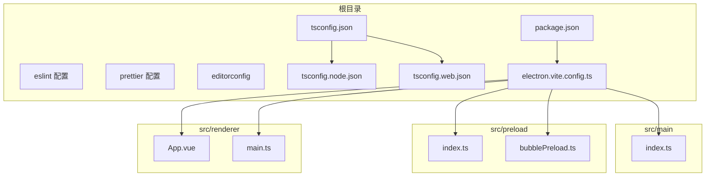
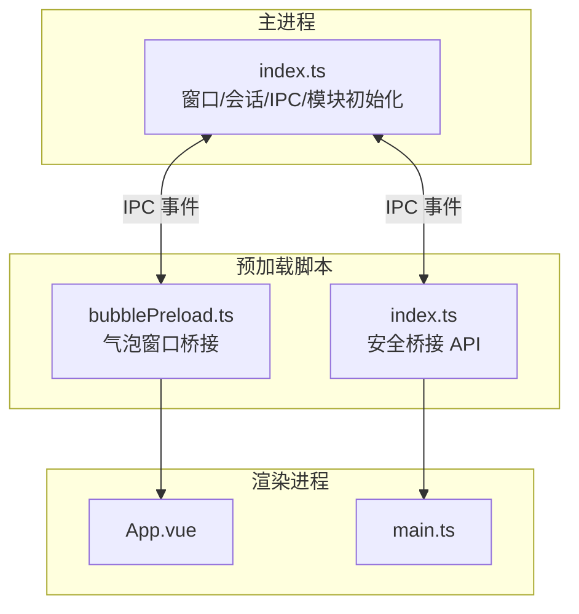
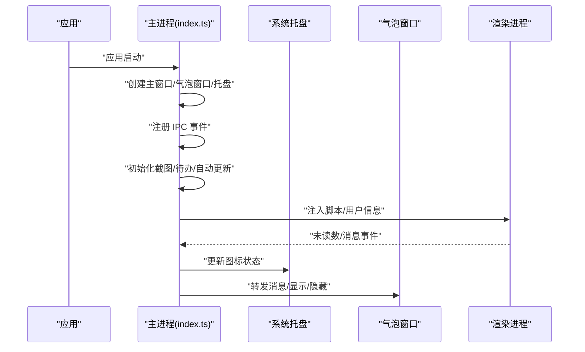
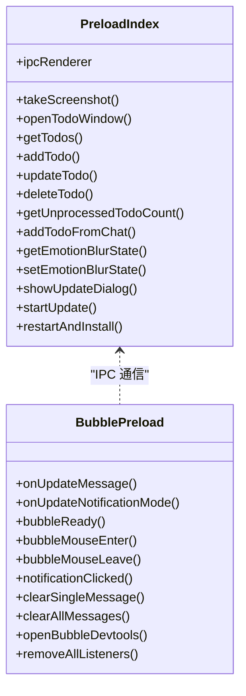
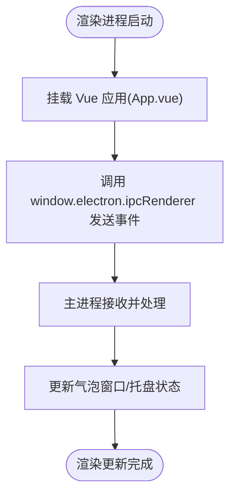
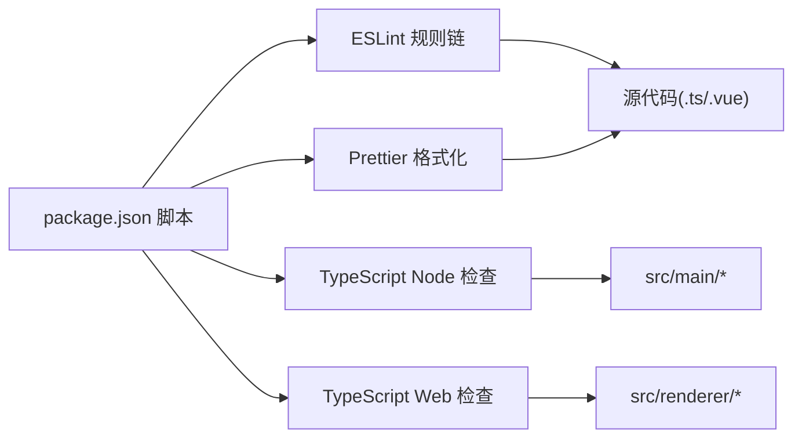

# 开发指南

<cite>
**本文引用的文件**
- [package.json](file://package.json)
- [.eslintrc.cjs](file://.eslintrc.cjs)
- [.prettierrc.yaml](file://.prettierrc.yaml)
- [.editorconfig](file://.editorconfig)
- [tsconfig.json](file://tsconfig.json)
- [tsconfig.node.json](file://tsconfig.node.json)
- [tsconfig.web.json](file://tsconfig.web.json)
- [electron.vite.config.ts](file://electron.vite.config.ts)
- [ARCHITECTURE.md](file://ARCHITECTURE.md)
- [src/main/index.ts](file://src/main/index.ts)
- [src/preload/index.ts](file://src/preload/index.ts)
- [src/preload/bubblePreload.ts](file://src/preload/bubblePreload.ts)
- [src/renderer/src/main.ts](file://src/renderer/src/main.ts)
- [src/renderer/src/App.vue](file://src/renderer/src/App.vue)
- [temp_eSearch/electron.vite.config.ts](file://temp_eSearch/electron.vite.config.ts)
- [temp_eSearch/CONTRIBUTING.md](file://temp_eSearch/CONTRIBUTING.md)
</cite>

## 目录
1. [简介](#简介)
2. [项目结构](#项目结构)
3. [核心组件](#核心组件)
4. [架构总览](#架构总览)
5. [详细组件分析](#详细组件分析)
6. [依赖关系分析](#依赖关系分析)
7. [性能考虑](#性能考虑)
8. [故障排查指南](#故障排查指南)
9. [结论](#结论)
10. [附录](#附录)

## 简介
本开发指南面向参与 Electron + Vue + TypeScript 桌面应用（WoaApp）的开发者，提供从代码规范、质量工具、调试技巧到架构理解、性能优化与安全实践的完整指引。文档同时给出贡献流程与协作规范，帮助团队高效协同并维持高质量交付。

## 项目结构
项目采用多进程架构（主进程、渲染进程、预加载脚本），并结合 Electron-vite 进行开发与构建。前端采用 Vue 3 + TypeScript，TypeScript 配置分为 Node 环境与 Web 环境两套，分别对应主进程与渲染进程的类型检查。

- 根目录关键文件
  - 包管理与脚本：package.json
  - 代码质量配置：.eslintrc.cjs、.prettierrc.yaml、.editorconfig
  - TypeScript 配置：tsconfig.json、tsconfig.node.json、tsconfig.web.json
  - 构建与开发：electron.vite.config.ts
- 源码目录
  - 主进程：src/main/*
  - 预加载脚本：src/preload/*
  - 渲染进程（示例应用）：src/renderer/src/*
  - 子项目（eSearch）：temp_eSearch 下的独立构建配置与功能模块

图表来源
- [electron.vite.config.ts](file://electron.vite.config.ts#L1-L60)
- [tsconfig.json](file://tsconfig.json#L1-L5)
- [tsconfig.node.json](file://tsconfig.node.json#L1-L9)
- [tsconfig.web.json](file://tsconfig.web.json#L1-L19)
- [package.json](file://package.json#L1-L55)

章节来源
- [electron.vite.config.ts](file://electron.vite.config.ts#L1-L60)
- [tsconfig.json](file://tsconfig.json#L1-L5)
- [tsconfig.node.json](file://tsconfig.node.json#L1-L9)
- [tsconfig.web.json](file://tsconfig.web.json#L1-L19)
- [package.json](file://package.json#L1-L55)

## 核心组件
- 主进程入口与窗口管理：负责应用生命周期、窗口创建与销毁、会话与网络策略、IPC 事件注册、截图与待办等模块初始化。
- 预加载脚本：在受限上下文中向渲染进程暴露安全 API，实现 IPC 能力桥接。
- 渲染进程（示例）：Vue 应用入口与组件，演示 IPC 使用与版本信息组件。
- 构建与开发：Electron-vite 配置定义主/预加载/渲染三类产物输入与输出，以及开发服务器端口与别名路径。

章节来源
- [src/main/index.ts](file://src/main/index.ts#L1-L2406)
- [src/preload/index.ts](file://src/preload/index.ts#L1-L63)
- [src/preload/bubblePreload.ts](file://src/preload/bubblePreload.ts#L1-L70)
- [src/renderer/src/main.ts](file://src/renderer/src/main.ts#L1-L7)
- [src/renderer/src/App.vue](file://src/renderer/src/App.vue#L1-L27)
- [electron.vite.config.ts](file://electron.vite.config.ts#L1-L60)

## 架构总览
系统采用经典的 Electron 多进程模型：主进程集中控制窗口、系统托盘、会话与外部服务；渲染进程承载 UI 与业务逻辑；预加载脚本作为安全桥接，仅暴露必要 API。

图表来源
- [src/main/index.ts](file://src/main/index.ts#L1-L2406)
- [src/preload/index.ts](file://src/preload/index.ts#L1-L63)
- [src/preload/bubblePreload.ts](file://src/preload/bubblePreload.ts#L1-L70)
- [src/renderer/src/App.vue](file://src/renderer/src/App.vue#L1-L27)
- [src/renderer/src/main.ts](file://src/renderer/src/main.ts#L1-L7)

## 详细组件分析

### 主进程组件分析
- 职责边界
  - 单实例锁、窗口生命周期、托盘与图标状态、消息监听与转发、截图与待办模块初始化、自动更新管理、用户行为上报。
- 关键流程
  - 应用启动 → 创建主窗口/气泡窗口/托盘 → 注册 IPC 事件 → 初始化截图/待办/自动更新 → 注入脚本与用户信息缓存 → 监听未读数并更新托盘。
- 安全与网络
  - 会话持久化分区、权限请求全部放行、证书验证放行、网络请求拦截与放行策略，便于开发但需在生产环境收紧。

图表来源
- [src/main/index.ts](file://src/main/index.ts#L92-L236)
- [src/main/index.ts](file://src/main/index.ts#L124-L139)
- [src/main/index.ts](file://src/main/index.ts#L618-L764)

章节来源
- [src/main/index.ts](file://src/main/index.ts#L1-L2406)

### 预加载脚本组件分析
- 安全桥接
  - 通过 contextBridge 暴露有限 API 至渲染进程，避免直接暴露 Node/Electron 全部能力。
- 气泡窗口桥接
  - 直接在 window 上暴露 API（因主进程禁用了 contextIsolation），用于消息监听、通知模式同步、开发者工具等。

图表来源
- [src/preload/index.ts](file://src/preload/index.ts#L1-L63)
- [src/preload/bubblePreload.ts](file://src/preload/bubblePreload.ts#L1-L70)

章节来源
- [src/preload/index.ts](file://src/preload/index.ts#L1-L63)
- [src/preload/bubblePreload.ts](file://src/preload/bubblePreload.ts#L1-L70)

### 渲染进程组件分析
- 示例应用
  - Vue 应用入口与组件，演示 IPC 调用与版本信息组件。
- 开发体验
  - 提供 F12 调试入口，便于定位问题。

图表来源
- [src/renderer/src/App.vue](file://src/renderer/src/App.vue#L1-L27)
- [src/renderer/src/main.ts](file://src/renderer/src/main.ts#L1-L7)

章节来源
- [src/renderer/src/App.vue](file://src/renderer/src/App.vue#L1-L27)
- [src/renderer/src/main.ts](file://src/renderer/src/main.ts#L1-L7)

### 构建与开发配置分析
- Electron-vite 配置
  - 主进程强制 CommonJS 输出，预加载同样为 CommonJS，渲染进程多页面入口（主窗口、气泡、待办、更新页）。
  - 开发服务器端口固定，路径别名 @renderer 指向 src/renderer/src。
- TypeScript 配置
  - 根 tsconfig 引用 node/web 两套配置，分别限定编译范围与路径映射。
- 子项目 eSearch
  - 独立的 electron.vite.config.ts，多页面入口与图片优化插件配置。

章节来源
- [electron.vite.config.ts](file://electron.vite.config.ts#L1-L60)
- [tsconfig.json](file://tsconfig.json#L1-L5)
- [tsconfig.node.json](file://tsconfig.node.json#L1-L9)
- [tsconfig.web.json](file://tsconfig.web.json#L1-L19)
- [temp_eSearch/electron.vite.config.ts](file://temp_eSearch/electron.vite.config.ts#L1-L71)

## 依赖关系分析
- 脚本与任务
  - lint/format/typecheck/dev/build/start/clean 等脚本由 package.json 统一管理，配合 ESLint、Prettier、TypeScript 检查。
- 开发工具链
  - ESLint 扩展链包含 Electron Toolkit、Vue 3 TypeScript 与 Prettier 规则，统一风格与质量基线。
  - Prettier 以 YAML 配置格式化，强调单引号、无分号、宽度与尾逗号策略。
- 类型检查
  - 分别对 Node 与 Web 环境进行类型检查，确保主进程与渲染进程代码质量。

图表来源
- [package.json](file://package.json#L9-L18)
- [.eslintrc.cjs](file://.eslintrc.cjs#L4-L12)
- [.prettierrc.yaml](file://.prettierrc.yaml#L1-L5)
- [tsconfig.node.json](file://tsconfig.node.json#L1-L9)
- [tsconfig.web.json](file://tsconfig.web.json#L1-L19)

章节来源
- [package.json](file://package.json#L1-L55)
- [.eslintrc.cjs](file://.eslintrc.cjs#L1-L18)
- [.prettierrc.yaml](file://.prettierrc.yaml#L1-L5)
- [tsconfig.node.json](file://tsconfig.node.json#L1-L9)
- [tsconfig.web.json](file://tsconfig.web.json#L1-L19)

## 性能考虑
- 内存与事件
  - 及时清理定时器与事件监听器，避免泄漏。
- 渲染性能
  - 气泡窗口使用 showInactive 避免抢占焦点；禁用后台节流以保证通知及时性。
- 构建优化
  - 子项目 eSearch 使用图片优化插件与 esbuild 最小化，提升构建效率与产物体积控制。

章节来源
- [ARCHITECTURE.md](file://ARCHITECTURE.md#L434-L449)
- [temp_eSearch/electron.vite.config.ts](file://temp_eSearch/electron.vite.config.ts#L61-L70)

## 故障排查指南
- 开发调试
  - 渲染进程可按需开启开发者工具；主进程与气泡窗口可通过 IPC 事件触发开发者工具。
  - 气泡窗口渲染进程异常时自动 reload 并恢复位置。
- 网络与会话
  - 主进程对权限、证书、网络请求均采取宽松策略以便开发，如遇生产问题应收紧策略。
- 页面加载与重定向
  - 主窗口加载失败时提供备用策略与提示页面，避免阻塞开发。

章节来源
- [src/main/index.ts](file://src/main/index.ts#L170-L172)
- [src/main/index.ts](file://src/main/index.ts#L740-L747)
- [src/main/index.ts](file://src/main/index.ts#L594-L614)

## 结论
本项目以 Electron-vite 为骨架，结合 Vue 与 TypeScript，形成清晰的多进程架构与模块化组织。通过统一的代码质量工具链与严格的类型检查，保障开发效率与稳定性。建议在生产环境中逐步收紧安全策略，并完善测试与监控体系，持续提升可靠性与可维护性。

## 附录

### 代码规范与质量工具
- ESLint
  - 规则链：推荐规则、Vue 3 推荐、Electron Toolkit、TypeScript、Prettier 集成。
  - 命令：npm run lint。
- Prettier
  - 配置：单引号、无分号、打印宽度、尾逗号策略。
  - 命令：npm run format。
- EditorConfig
  - 统一缩进、换行、字符集与尾随空白处理。
- TypeScript
  - 分别对 Node 与 Web 环境进行类型检查，确保主/渲染进程代码质量。
  - 命令：npm run typecheck。

章节来源
- [.eslintrc.cjs](file://.eslintrc.cjs#L4-L12)
- [.prettierrc.yaml](file://.prettierrc.yaml#L1-L5)
- [.editorconfig](file://.editorconfig#L1-L9)
- [package.json](file://package.json#L11-L13)
- [tsconfig.node.json](file://tsconfig.node.json#L1-L9)
- [tsconfig.web.json](file://tsconfig.web.json#L1-L19)

### 开发环境调试技巧
- 开启渲染进程调试：在需要时打开开发者工具。
- 气泡窗口调试：通过 IPC 事件触发开发者工具。
- 日志与事件：利用主进程与渲染进程的日志输出定位问题。

章节来源
- [src/main/index.ts](file://src/main/index.ts#L170-L172)
- [src/preload/bubblePreload.ts](file://src/preload/bubblePreload.ts#L50-L53)

### 代码组织与命名约定
- 目录组织
  - 主进程：src/main/*
  - 预加载脚本：src/preload/*
  - 渲染进程：src/renderer/src/*
- 命名约定
  - 组件与模块以功能语义命名，如 todo、screenshot、websocket-monitor。
  - 预加载脚本区分主窗口与气泡窗口桥接。
- 路径别名
  - @renderer 指向 src/renderer/src，便于导入。

章节来源
- [electron.vite.config.ts](file://electron.vite.config.ts#L32-L34)
- [ARCHITECTURE.md](file://ARCHITECTURE.md#L454-L462)

### 贡献指南与协作流程
- Fork 与 PR：从官方仓库 fork，提交 Pull Request。
- 代码风格：优先保证可读性与注释，避免过度抽象。
- 提交信息：建议采用“范围 修复/添加某功能”的格式。
- 文档参考：开发文档位于 docs/develop/readme.md。

章节来源
- [temp_eSearch/CONTRIBUTING.md](file://temp_eSearch/CONTRIBUTING.md#L1-L30)

### 安全编码实践
- 安全配置现状
  - 主进程 webPreferences 中禁用上下文隔离、Node 集成、Web 安全与沙盒，便于功能开发但带来安全风险。
- 生产建议
  - 启用 contextIsolation 并通过预加载脚本安全暴露 API。
  - 严格证书验证与权限请求处理。
  - 限制网络请求与权限范围。

章节来源
- [ARCHITECTURE.md](file://ARCHITECTURE.md#L402-L432)
- [src/main/index.ts](file://src/main/index.ts#L286-L301)
- [src/main/index.ts](file://src/main/index.ts#L635-L645)

### 测试策略与质量保证
- 类型检查：双环境类型检查确保主/渲染进程一致性。
- 构建校验：通过 Electron-vite 与 TypeScript 构建产物验证。
- 质量工具：ESLint 与 Prettier 保障风格与潜在问题发现。
- 建议补充：单元测试、集成测试与端到端测试，以提高覆盖率与回归防护。

章节来源
- [package.json](file://package.json#L11-L13)
- [electron.vite.config.ts](file://electron.vite.config.ts#L1-L60)