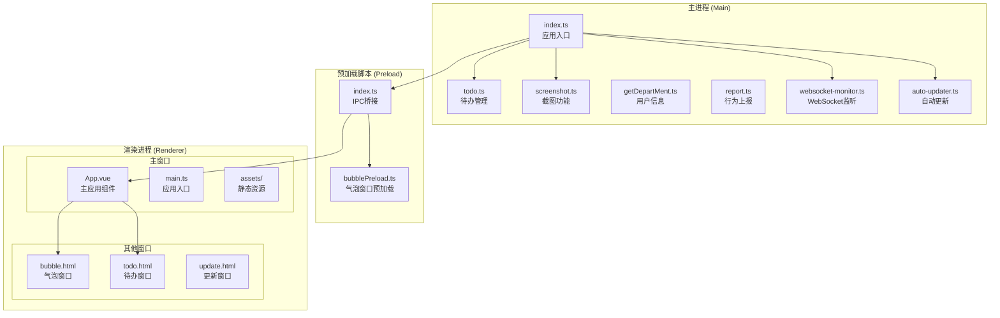
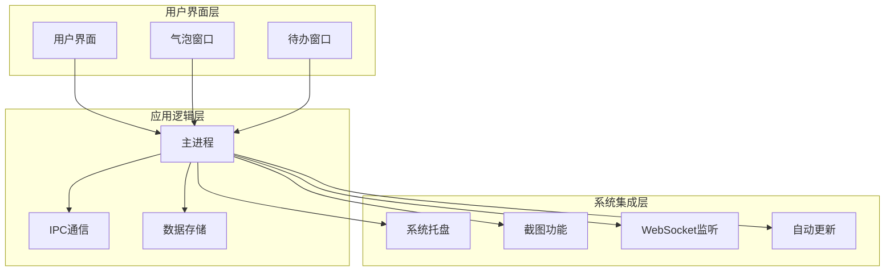
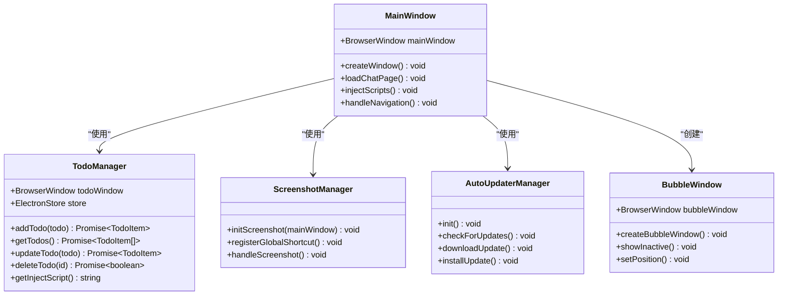
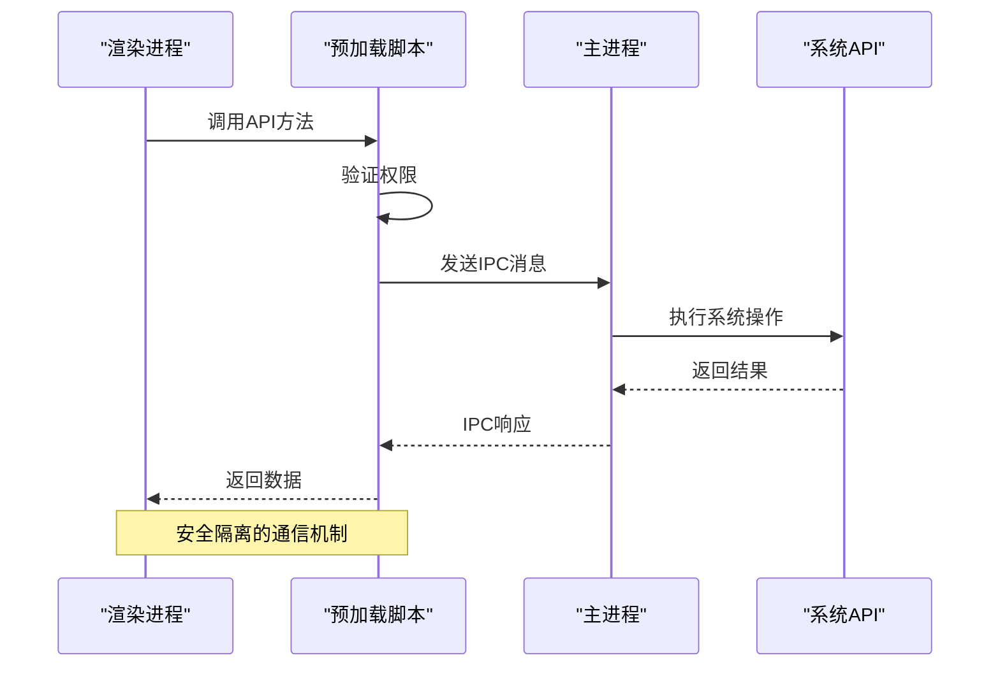
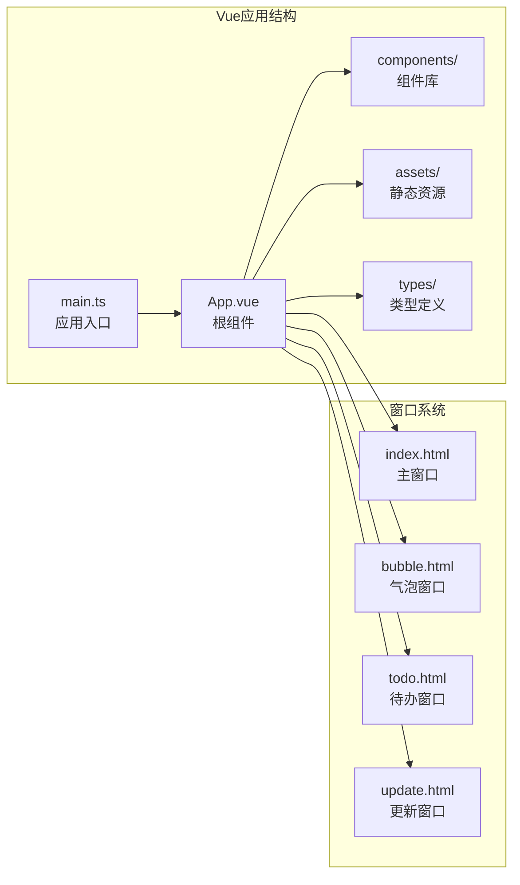
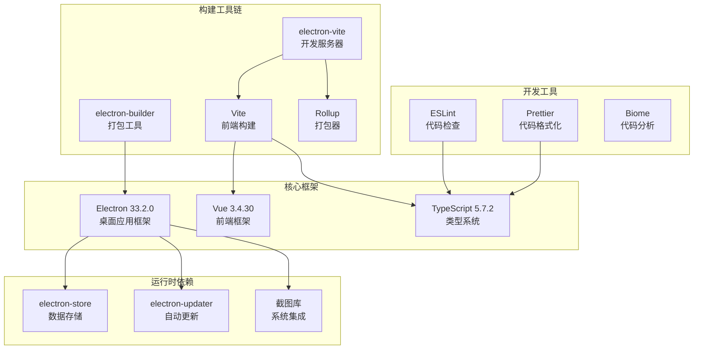

# 快速开始

<cite>
**本文引用的文件**
- [package.json](file://package.json)
- [README.md](file://README.md)
- [electron.vite.config.ts](file://electron.vite.config.ts)
- [electron-builder.yml](file://electron-builder.yml)
- [tsconfig.json](file://tsconfig.json)
- [tsconfig.node.json](file://tsconfig.node.json)
- [tsconfig.web.json](file://tsconfig.web.json)
- [src/main/index.ts](file://src/main/index.ts)
- [src/preload/index.ts](file://src/preload/index.ts)
- [src/renderer/src/main.ts](file://src/renderer/src/main.ts)
- [src/renderer/src/App.vue](file://src/renderer/src/App.vue)
- [ARCHITECTURE.md](file://ARCHITECTURE.md)
- [EMOTION_BLUR_FEATURE.md](file://EMOTION_BLUR_FEATURE.md)
- [SCREENSHOT_GUIDE.md](file://SCREENSHOT_GUIDE.md)
- [dev-app-update.yml](file://dev-app-update.yml)
</cite>

## 目录
1. [简介](#简介)
2. [项目结构](#项目结构)
3. [核心组件](#核心组件)
4. [架构概览](#架构概览)
5. [详细组件分析](#详细组件分析)
6. [依赖关系分析](#依赖关系分析)
7. [性能注意事项](#性能注意事项)
8. [故障排除指南](#故障排除指南)
9. [结论](#结论)
10. [附录](#附录)

## 简介
WoaApp 是一个基于 Electron + Vue + TypeScript 的桌面聊天客户端应用，主要用于连接金山云办公(WPS)的即时通讯服务。该应用具有消息气泡提醒、截图、待办事项管理等功能。本文档旨在帮助新开发者在最短时间内运行项目并进行开发。

## 项目结构
该项目采用典型的 Electron 多进程架构，包含主进程、渲染进程和预加载脚本三个主要部分：

**图表来源**
- [src/main/index.ts](file://src/main/index.ts#L1-L800)
- [src/preload/index.ts](file://src/preload/index.ts#L1-L63)
- [src/renderer/src/App.vue](file://src/renderer/src/App.vue#L1-L27)

**章节来源**
- [ARCHITECTURE.md](file://ARCHITECTURE.md#L1-L492)
- [README.md](file://README.md#L1-L535)

## 核心组件
项目的核心组件包括：

### 主进程组件
- **应用入口**: 负责应用初始化、窗口管理和系统集成
- **待办管理**: 提供待办事项的增删改查功能
- **截图功能**: 支持快捷键和按钮截图
- **WebSocket监听**: 实时监听消息并转发到气泡窗口
- **自动更新**: 管理应用的自动更新机制

### 预加载脚本
- **IPC桥接**: 安全地暴露主进程API到渲染进程
- **类型定义**: 提供完整的TypeScript类型支持

### 渲染进程
- **主应用**: 基于Vue.js的用户界面
- **多窗口支持**: 主窗口、气泡窗口、待办窗口
- **组件系统**: 模块化的Vue组件架构

**章节来源**
- [src/main/index.ts](file://src/main/index.ts#L1-L800)
- [src/preload/index.ts](file://src/preload/index.ts#L1-L63)
- [src/renderer/src/App.vue](file://src/renderer/src/App.vue#L1-L27)

## 架构概览
WoaApp 采用了经典的 Electron 多进程架构，通过主进程统一管理系统资源和窗口，渲染进程专注于用户界面展示，预加载脚本确保安全的跨进程通信。

**图表来源**
- [ARCHITECTURE.md](file://ARCHITECTURE.md#L18-L42)
- [src/main/index.ts](file://src/main/index.ts#L1-L800)

## 详细组件分析

### 主进程架构分析
主进程是应用的核心控制逻辑，负责协调各个模块的工作。

**图表来源**
- [src/main/index.ts](file://src/main/index.ts#L276-L615)
- [src/main/todo.ts](file://src/main/todo.ts#L199-L215)
- [src/main/screenshot.ts](file://src/main/screenshot.ts#L221-L230)

### 预加载脚本通信机制
预加载脚本作为安全的IPC通信桥梁，为渲染进程提供受限的系统API访问能力。

**图表来源**
- [src/preload/index.ts](file://src/preload/index.ts#L16-L43)
- [src/main/index.ts](file://src/main/index.ts#L120-L139)

### Vue.js 渲染进程架构
渲染进程基于Vue.js构建，提供现代化的用户界面体验。

**图表来源**
- [src/renderer/src/App.vue](file://src/renderer/src/App.vue#L1-L27)
- [src/renderer/src/main.ts](file://src/renderer/src/main.ts#L1-L7)
- [electron.vite.config.ts](file://electron.vite.config.ts#L50-L57)

**章节来源**
- [src/main/index.ts](file://src/main/index.ts#L1-L800)
- [src/preload/index.ts](file://src/preload/index.ts#L1-L63)
- [src/renderer/src/App.vue](file://src/renderer/src/App.vue#L1-L27)

## 依赖关系分析
项目使用了多种依赖管理工具和技术栈：

**图表来源**
- [package.json](file://package.json#L25-L53)
- [electron.vite.config.ts](file://electron.vite.config.ts#L1-L60)
- [electron-builder.yml](file://electron-builder.yml#L1-L53)

**章节来源**
- [package.json](file://package.json#L1-L55)
- [tsconfig.json](file://tsconfig.json#L1-L5)

## 性能注意事项
项目在性能方面采用了多项优化策略：

### 内存管理
- 及时清理定时器和事件监听器
- 控制消息缓存数量
- 合理管理窗口生命周期

### 渲染性能
- Vue.js 组件按需加载
- 气泡窗口使用 `showInactive()` 避免抢焦点
- 背景节流禁用 `backgroundThrottling: false`

### 网络性能
- 会话持久化避免重复登录
- WebSocket 连接监听优化
- 图片和资源缓存策略

## 故障排除指南

### 环境配置问题
**问题**: Node.js 版本不兼容
**解决方案**: 确保使用支持的 Node.js 版本，参考 package.json 中的依赖版本要求

**问题**: 包管理器选择问题
**解决方案**: 项目推荐使用 pnpm，确保安装依赖时使用正确的包管理器

### 依赖安装问题
**问题**: 依赖安装失败
**解决方案**: 
1. 清理缓存并重新安装
2. 检查网络连接和代理设置
3. 使用国内镜像源加速下载

### 开发环境启动问题
**问题**: 开发服务器无法启动
**解决方案**:
1. 检查端口占用情况 (默认端口 5174)
2. 确认 TypeScript 配置正确
3. 验证 Vite 配置文件完整性

### 截图功能问题
**问题**: 截图快捷键不生效
**解决方案**:
1. 确保应用有焦点状态
2. 检查快捷键是否被其他应用占用
3. 验证截图权限设置

**章节来源**
- [SCREENSHOT_GUIDE.md](file://SCREENSHOT_GUIDE.md#L95-L125)
- [EMOTION_BLUR_FEATURE.md](file://EMOTION_BLUR_FEATURE.md#L74-L116)

## 结论
WoaApp 提供了一个完整且功能丰富的桌面应用开发框架。通过采用 Electron + Vue + TypeScript 的技术栈，结合模块化的架构设计，开发者可以快速上手并进行二次开发。项目的主要优势包括：

1. **模块化设计**: 功能模块独立，便于维护和扩展
2. **多窗口支持**: 主窗口、气泡窗口、待办窗口各司其职
3. **数据持久化**: 完善的本地存储和会话管理
4. **系统集成**: 托盘、快捷键、通知等系统级功能
5. **实时通信**: WebSocket 监听和消息转发机制

## 附录

### 快速开始步骤
1. **环境准备**: 确保安装支持的 Node.js 版本
2. **克隆项目**: git clone 项目仓库
3. **安装依赖**: 使用 pnpm install 安装依赖
4. **启动开发**: npm run dev 启动开发服务器
5. **访问应用**: 在浏览器中访问 http://localhost:5174

### 常用开发命令
- `npm run dev`: 启动开发服务器
- `npm run build`: 构建生产版本
- `npm run start`: 预览构建结果
- `npm run lint`: 代码检查和修复
- `npm run typecheck`: TypeScript 类型检查

### 构建和发布
- `npm run build:win`: 构建 Windows 版本
- `npm run build:mac`: 构建 macOS 版本
- `npm run build:linux`: 构建 Linux 版本

**章节来源**
- [README.md](file://README.md#L493-L518)
- [package.json](file://package.json#L9-L24)