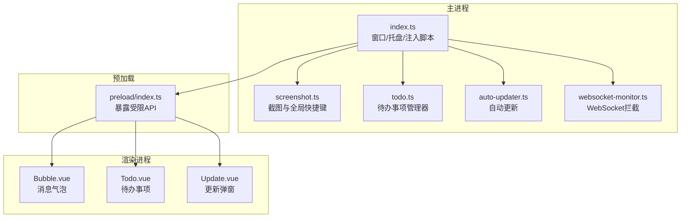
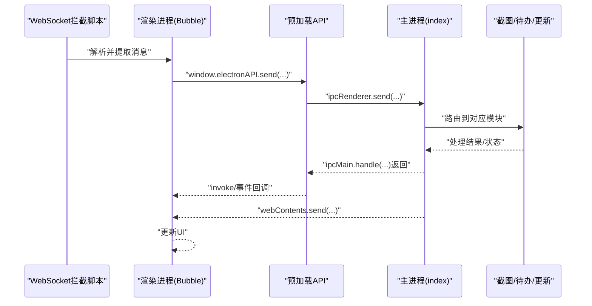
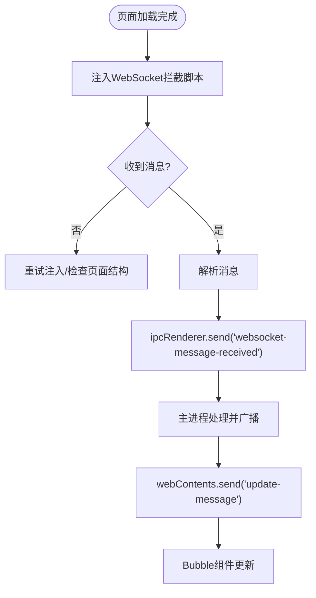
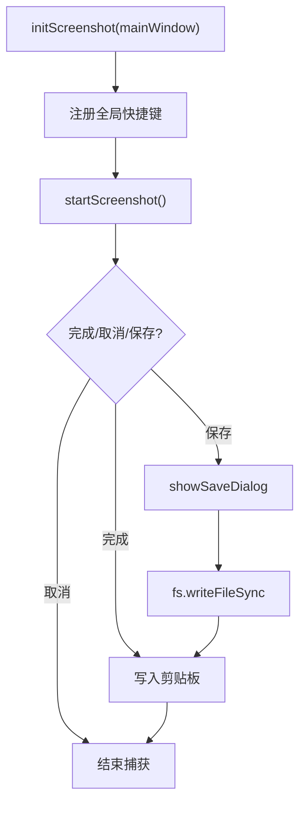
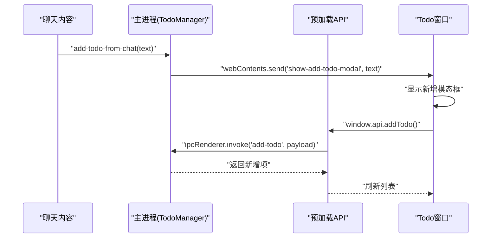
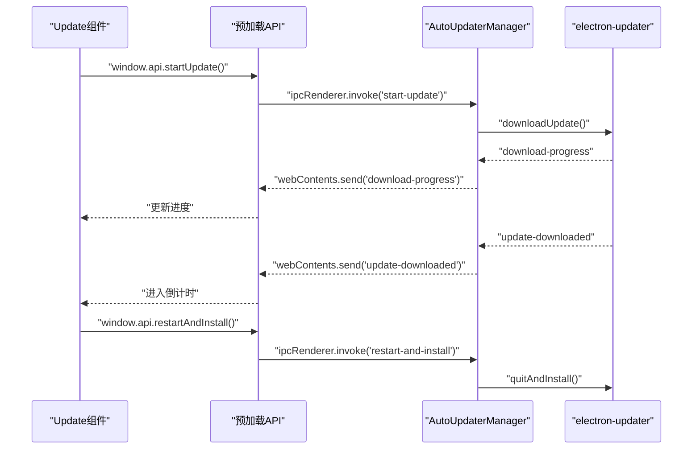
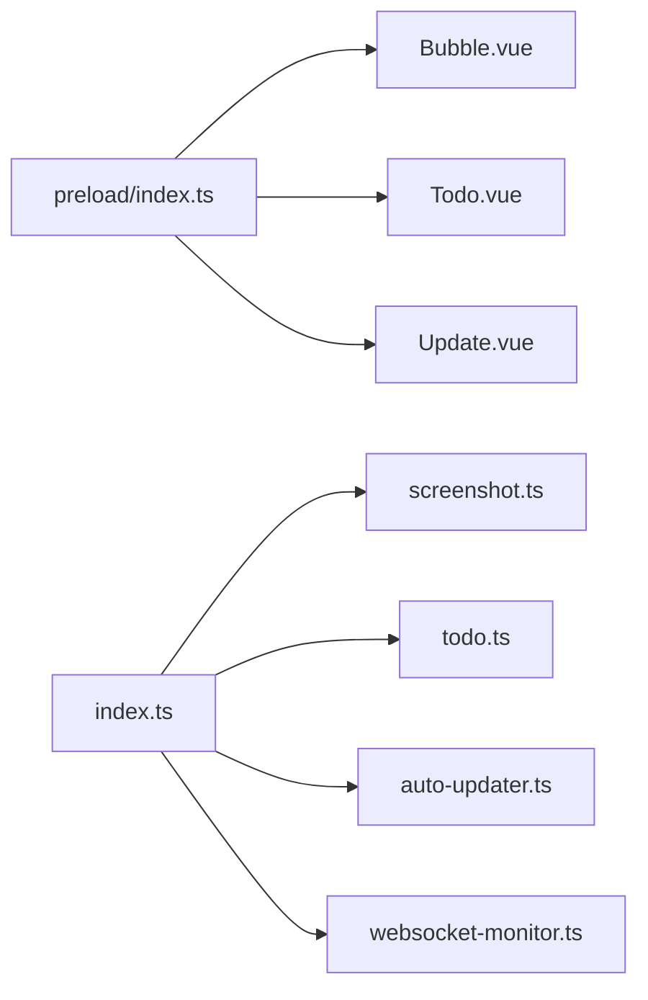

# 功能异常问题

<cite>
**本文引用的文件**
- [src/main/index.ts](file://src/main/index.ts)
- [src/main/screenshot.ts](file://src/main/screenshot.ts)
- [src/main/todo.ts](file://src/main/todo.ts)
- [src/main/auto-updater.ts](file://src/main/auto-updater.ts)
- [src/preload/index.ts](file://src/preload/index.ts)
- [src/renderer/src/components/Bubble.vue](file://src/renderer/src/components/Bubble.vue)
- [src/renderer/src/components/Todo.vue](file://src/renderer/src/components/Todo.vue)
- [src/renderer/src/components/Update.vue](file://src/renderer/src/components/Update.vue)
- [src/main/websocket-monitor.ts](file://src/main/websocket-monitor.ts)
- [temp_eSearch/lib/ipc.ts](file://temp_eSearch/lib/ipc.ts)
</cite>

## 目录
1. [简介](#简介)
2. [项目结构](#项目结构)
3. [核心组件](#核心组件)
4. [架构总览](#架构总览)
5. [详细组件分析](#详细组件分析)
6. [依赖关系分析](#依赖关系分析)
7. [性能考量](#性能考量)
8. [故障排查指南](#故障排查指南)
9. [结论](#结论)
10. [附录](#附录)

## 简介
本指南聚焦于消息通知、截图、待办事项、自动更新等核心功能模块的异常排查与调试。文档覆盖IPC通信异常、文件操作失败、UI组件渲染错误等常见问题的诊断流程，并提供功能边界条件测试、异常输入处理、状态同步问题的解决方案，以及功能回归测试方法与自动化测试脚本示例路径。

## 项目结构
该应用采用Electron + Vue的前后端分离架构：
- 主进程负责窗口生命周期、系统托盘、自动更新、截图、待办事项、WebSocket监控与网络策略。
- 预加载脚本暴露受限API至渲染进程，统一管理IPC调用。
- 渲染进程由Vue驱动，包含气泡通知、待办事项、更新弹窗等组件。
- 临时搜索模块提供独立的IPC抽象与跨窗口通信能力。

**图表来源**
- [src/main/index.ts](file://src/main/index.ts#L1-L2406)
- [src/main/screenshot.ts](file://src/main/screenshot.ts#L1-L158)
- [src/main/todo.ts](file://src/main/todo.ts#L1-L266)
- [src/main/auto-updater.ts](file://src/main/auto-updater.ts#L1-L565)
- [src/preload/index.ts](file://src/preload/index.ts#L1-L63)
- [src/renderer/src/components/Bubble.vue](file://src/renderer/src/components/Bubble.vue#L1-L468)
- [src/renderer/src/components/Todo.vue](file://src/renderer/src/components/Todo.vue#L1-L281)
- [src/renderer/src/components/Update.vue](file://src/renderer/src/components/Update.vue#L1-L616)
- [src/main/websocket-monitor.ts](file://src/main/websocket-monitor.ts#L1-L242)

**章节来源**
- [src/main/index.ts](file://src/main/index.ts#L1-L2406)
- [src/preload/index.ts](file://src/preload/index.ts#L1-L63)

## 核心组件
- 消息通知与气泡窗口：主进程注入脚本与WebSocket拦截，渲染进程通过Bubble组件接收消息并展示。
- 截图功能：注册全局快捷键，调用截图库完成捕获、保存与剪贴板写入。
- 待办事项：TodoManager管理数据与窗口，提供IPC接口供渲染进程增删改查与统计未处理数量。
- 自动更新：基于electron-updater，支持检查、下载、进度回调、安装重启。
- IPC桥接：预加载脚本暴露受控API；临时搜索模块提供通用IPC封装与反射转发。

**章节来源**
- [src/main/websocket-monitor.ts](file://src/main/websocket-monitor.ts#L1-L242)
- [src/main/screenshot.ts](file://src/main/screenshot.ts#L1-L158)
- [src/main/todo.ts](file://src/main/todo.ts#L1-L266)
- [src/main/auto-updater.ts](file://src/main/auto-updater.ts#L1-L565)
- [src/preload/index.ts](file://src/preload/index.ts#L1-L63)
- [temp_eSearch/lib/ipc.ts](file://temp_eSearch/lib/ipc.ts#L1-L273)

## 架构总览
主进程负责业务编排与系统集成，预加载脚本作为安全边界，渲染进程通过受控API与主进程交互。WebSocket拦截在渲染侧注入，消息经由主进程转发至气泡窗口。

**图表来源**
- [src/main/websocket-monitor.ts](file://src/main/websocket-monitor.ts#L163-L210)
- [src/preload/index.ts](file://src/preload/index.ts#L17-L43)
- [src/main/index.ts](file://src/main/index.ts#L120-L140)

## 详细组件分析

### 消息通知与气泡窗口
- 关键点
  - 主进程在页面加载完成后注入脚本，监听WebSocket消息并通过IPC发送到渲染进程。
  - 气泡窗口通过预加载API接收消息并渲染，支持清除单条/全部消息、点击通知等交互。
  - 未读计数通过主进程广播，渲染侧更新徽标。
- 常见异常
  - WebSocket拦截失败：检查注入时机与页面结构变更。
  - IPC未收到消息：确认预加载API暴露与渲染侧监听。
  - 气泡窗口不显示：检查alwaysOnTop、位置与加载URL。
- 调试建议
  - 在渲染侧开启开发者工具，观察IPC事件与消息队列。
  - 在主进程监听did-finish-load与网络事件，定位注入时机。

**图表来源**
- [src/main/websocket-monitor.ts](file://src/main/websocket-monitor.ts#L163-L236)
- [src/main/index.ts](file://src/main/index.ts#L140-L187)
- [src/renderer/src/components/Bubble.vue](file://src/renderer/src/components/Bubble.vue#L164-L228)

**章节来源**
- [src/main/websocket-monitor.ts](file://src/main/websocket-monitor.ts#L1-L242)
- [src/renderer/src/components/Bubble.vue](file://src/renderer/src/components/Bubble.vue#L1-L468)
- [src/main/index.ts](file://src/main/index.ts#L120-L187)

### 截图功能
- 关键点
  - 注册全局快捷键，触发截图库开始捕获；完成/取消/保存事件分别处理。
  - 保存时弹出保存对话框，写入文件并复制到剪贴板。
- 常见异常
  - 快捷键冲突：检查全局快捷键注册与注销。
  - 保存失败：检查文件路径权限与磁盘空间。
  - 剪贴板写入失败：检查nativeImage与剪贴板服务。
- 调试建议
  - 观察控制台日志与事件回调，确认状态机流转。
  - 在清理阶段注销快捷键，避免重复注册。

**图表来源**
- [src/main/screenshot.ts](file://src/main/screenshot.ts#L16-L96)

**章节来源**
- [src/main/screenshot.ts](file://src/main/screenshot.ts#L1-L158)

### 待办事项
- 关键点
  - TodoManager管理窗口、数据存储与IPC事件；提供增删改查与未处理计数。
  - 渲染侧Todo组件通过window.api调用IPC，支持标签页切换、编辑/删除、从聊天创建。
- 常见异常
  - 窗口无法创建：检查preload配置与加载URL。
  - IPC调用超时：确认handle/on配对与事件监听时机。
  - 数据不同步：检查广播计数与store默认值。
- 调试建议
  - 在渲染侧打印window.api可用方法，确认暴露完整。
  - 在主进程监听did-finish-load后发送show-add-todo-modal事件。

**图表来源**
- [src/main/todo.ts](file://src/main/todo.ts#L124-L135)
- [src/preload/index.ts](file://src/preload/index.ts#L25-L33)
- [src/renderer/src/components/Todo.vue](file://src/renderer/src/components/Todo.vue#L140-L150)

**章节来源**
- [src/main/todo.ts](file://src/main/todo.ts#L1-L266)
- [src/renderer/src/components/Todo.vue](file://src/renderer/src/components/Todo.vue#L1-L281)
- [src/preload/index.ts](file://src/preload/index.ts#L1-L63)

### 自动更新
- 关键点
  - 基于electron-updater，支持检查、下载进度、下载完成、安装重启。
  - 主进程维护定时检查与窗口生命周期，渲染侧Update组件展示进度与倒计时。
- 常见异常
  - 检查失败：检查API地址与网络策略。
  - 下载中断：检查文件大小与latest.yml下载。
  - 安装失败：确认quitAndInstall调用与权限。
- 调试建议
  - 开发模式下模拟下载进度，验证UI与倒计时逻辑。
  - 在主进程监听download-progress与update-downloaded事件。

**图表来源**
- [src/main/auto-updater.ts](file://src/main/auto-updater.ts#L95-L131)
- [src/renderer/src/components/Update.vue](file://src/renderer/src/components/Update.vue#L140-L173)

**章节来源**
- [src/main/auto-updater.ts](file://src/main/auto-updater.ts#L1-L565)
- [src/renderer/src/components/Update.vue](file://src/renderer/src/components/Update.vue#L1-L616)

### IPC通信与跨窗口消息
- 关键点
  - 预加载API统一暴露send/invoke/on等方法，渲染侧通过window.electron与window.api访问。
  - 临时搜索模块提供通用IPC封装，支持主进程反射转发到多个WebContents。
- 常见异常
  - 事件未找到：检查事件名拼写与注册顺序。
  - 跨窗口消息丢失：确认反射转发逻辑与目标WebContents有效性。
- 调试建议
  - 在主进程与渲染进程均打印事件名与参数，定位丢失点。
  - 使用同步调用sendSync快速验证通道连通性。

**章节来源**
- [src/preload/index.ts](file://src/preload/index.ts#L1-L63)
- [temp_eSearch/lib/ipc.ts](file://temp_eSearch/lib/ipc.ts#L1-L273)

## 依赖关系分析
- 主进程模块间耦合度低，通过IPC解耦。
- 预加载脚本承担“门面”职责，集中暴露API，降低渲染侧直接依赖主进程细节。
- WebSocket拦截与注入脚本需与页面DOM结构强关联，需关注页面升级导致的选择器失效。

**图表来源**
- [src/preload/index.ts](file://src/preload/index.ts#L1-L63)
- [src/main/index.ts](file://src/main/index.ts#L1-L2406)
- [src/main/screenshot.ts](file://src/main/screenshot.ts#L1-L158)
- [src/main/todo.ts](file://src/main/todo.ts#L1-L266)
- [src/main/auto-updater.ts](file://src/main/auto-updater.ts#L1-L565)
- [src/main/websocket-monitor.ts](file://src/main/websocket-monitor.ts#L1-L242)

**章节来源**
- [src/main/index.ts](file://src/main/index.ts#L1-L2406)
- [src/preload/index.ts](file://src/preload/index.ts#L1-L63)

## 性能考量
- 网络与注入
  - 主进程放宽webRequest限制，便于调试但可能影响生产稳定性，建议按需收紧。
  - WebSocket拦截在渲染侧执行，注意解析复杂度与内存占用。
- UI渲染
  - 气泡窗口频繁更新消息列表时，建议虚拟滚动与节流。
  - 更新弹窗进度条与倒计时需避免高频重绘。
- 文件与剪贴板
  - 截图保存涉及IO与图像编码，建议异步处理并限制并发。

[本节为通用指导，无需具体文件引用]

## 故障排查指南

### 一、消息通知与WebSocket拦截
- 症状
  - 气泡窗口无消息、WebSocket消息未被解析。
- 排查步骤
  - 确认主进程did-finish-load后注入脚本成功执行。
  - 检查渲染侧Bubble组件是否成功监听到消息事件。
  - 在WebSocket拦截脚本中打印解析结果，定位字段提取逻辑。
- 日志分析
  - 主进程：监听did-finish-load与网络事件，确认注入时机。
  - 渲染侧：开启开发者工具，观察ipcRenderer事件与消息队列。
- 边界条件
  - 页面结构变更导致选择器失效，需动态观察DOM或延迟注入。
  - Protobuf解析失败时回退为文本匹配，确保字段范围合理。

**章节来源**
- [src/main/websocket-monitor.ts](file://src/main/websocket-monitor.ts#L104-L160)
- [src/main/index.ts](file://src/main/index.ts#L140-L187)
- [src/renderer/src/components/Bubble.vue](file://src/renderer/src/components/Bubble.vue#L164-L228)

### 二、截图功能
- 症状
  - 快捷键无效、保存失败、剪贴板无图。
- 排查步骤
  - 检查全局快捷键注册与注销逻辑，避免重复注册。
  - 保存对话框取消后及时释放状态，防止阻塞后续操作。
  - 写入文件前校验路径与权限，写入后立即复制到剪贴板。
- 日志分析
  - 控制台输出事件回调与缓冲区信息，定位失败节点。
- 边界条件
  - 多次连续触发时，引入状态锁避免竞态。
  - Escape取消与OK保存分支需一致清理资源。

**章节来源**
- [src/main/screenshot.ts](file://src/main/screenshot.ts#L16-L96)

### 三、待办事项
- 症状
  - 新增/编辑/删除无效、未处理计数不更新。
- 排查步骤
  - 确认预加载API已暴露add/update/delete/get相关方法。
  - 检查TodoManager的IPC注册顺序与事件监听时机。
  - 广播计数需在每次修改后触发，确保所有窗口同步。
- 日志分析
  - 主进程打印store变更与广播事件，渲染侧打印window.api方法可用性。
- 边界条件
  - 从聊天创建时需等待Todo窗口加载完成再发送事件。
  - 编辑态与非编辑态切换需正确回滚与提交。

**章节来源**
- [src/main/todo.ts](file://src/main/todo.ts#L77-L136)
- [src/renderer/src/components/Todo.vue](file://src/renderer/src/components/Todo.vue#L87-L150)
- [src/preload/index.ts](file://src/preload/index.ts#L25-L33)

### 四、自动更新
- 症状
  - 检查失败、下载卡住、安装失败。
- 排查步骤
  - 检查API地址与协议一致性，确保latest.yml可下载。
  - 开发模式下模拟下载进度，验证UI与倒计时。
  - 下载完成后进入倒计时，倒计时结束后调用重启安装。
- 日志分析
  - 主进程监听download-progress与update-downloaded事件，渲染侧接收并展示。
- 边界条件
  - 强制更新时阻止关闭窗口，直到安装完成。
  - 文件大小与进度百分比需一致，避免UI误导。

**章节来源**
- [src/main/auto-updater.ts](file://src/main/auto-updater.ts#L188-L221)
- [src/renderer/src/components/Update.vue](file://src/renderer/src/components/Update.vue#L268-L275)

### 五、IPC通信异常
- 症状
  - 事件未找到、调用超时、跨窗口消息丢失。
- 排查步骤
  - 在主进程与渲染进程均打印事件名与参数，定位丢失点。
  - 使用sendSync快速验证通道连通性。
  - 临时搜索模块需确保反射转发到有效WebContents。
- 日志分析
  - 主进程与渲染进程分别记录事件注册与回调执行情况。
- 边界条件
  - 事件名大小写与拼写严格一致。
  - handle与invoke需与send配对，避免遗漏。

**章节来源**
- [src/preload/index.ts](file://src/preload/index.ts#L1-L63)
- [temp_eSearch/lib/ipc.ts](file://temp_eSearch/lib/ipc.ts#L251-L263)

### 六、文件操作失败
- 症状
  - 截图保存失败、更新文件写入失败。
- 排查步骤
  - 检查路径是否存在、权限是否足够、磁盘空间是否充足。
  - 写入后立即读取校验，失败时删除残留文件。
- 日志分析
  - 记录fs.writeFileSync的错误信息与文件大小。
- 边界条件
  - 保存对话框取消后及时释放状态，避免阻塞后续操作。

**章节来源**
- [src/main/screenshot.ts](file://src/main/screenshot.ts#L54-L74)

### 七、UI组件渲染错误
- 症状
  - 气泡窗口不显示、待办列表空白、更新弹窗无进度。
- 排查步骤
  - 检查窗口alwaysOnTop、位置与加载URL。
  - 确认did-finish-load后才发送消息或事件。
  - 渲染侧组件挂载后等待API可用，必要时重试。
- 日志分析
  - 渲染侧打印window对象属性与API可用性。
- 边界条件
  - 气泡窗口移动后需持久化位置，避免下次加载偏移。

**章节来源**
- [src/renderer/src/components/Bubble.vue](file://src/renderer/src/components/Bubble.vue#L164-L228)
- [src/renderer/src/components/Update.vue](file://src/renderer/src/components/Update.vue#L287-L321)

### 八、异常输入与状态同步
- 异常输入
  - 待办标题为空、聊天文本为空、WebSocket消息格式异常。
- 状态同步
  - 未处理计数与UI徽标不同步、多窗口状态不一致。
- 解决方案
  - 对输入进行校验与默认值填充；对异常消息进行降级处理。
  - 广播计数到所有窗口，确保状态一致性。

**章节来源**
- [src/main/todo.ts](file://src/main/todo.ts#L87-L99)
- [src/main/websocket-monitor.ts](file://src/main/websocket-monitor.ts#L125-L160)

### 九、功能回归测试与自动化脚本
- 回归测试方法
  - 截图：触发快捷键、保存对话框、剪贴板校验。
  - 待办：新增/编辑/删除/标记完成、未处理计数广播。
  - 更新：检查更新、下载进度、倒计时、重启安装。
  - IPC：事件注册、回调执行、跨窗口转发。
- 自动化脚本示例路径
  - 截图测试：参考[截图初始化与事件处理](file://src/main/screenshot.ts#L16-L96)
  - 待办测试：参考[IPC注册与窗口创建](file://src/main/todo.ts#L77-L136)
  - 更新测试：参考[下载进度与倒计时](file://src/renderer/src/components/Update.vue#L175-L242)
  - IPC测试：参考[通用IPC封装](file://temp_eSearch/lib/ipc.ts#L166-L273)

**章节来源**
- [src/main/screenshot.ts](file://src/main/screenshot.ts#L1-L158)
- [src/main/todo.ts](file://src/main/todo.ts#L1-L266)
- [src/renderer/src/components/Update.vue](file://src/renderer/src/components/Update.vue#L1-L616)
- [temp_eSearch/lib/ipc.ts](file://temp_eSearch/lib/ipc.ts#L1-L273)

## 结论
通过明确各模块职责、强化IPC与状态管理、完善日志与边界条件处理，可显著提升系统的稳定性与可维护性。建议在开发与测试阶段持续关注注入时机、事件配对与UI渲染性能，结合自动化脚本形成闭环回归保障。

[本节为总结，无需具体文件引用]

## 附录
- 常用调试开关
  - 开发模式下开启渲染进程开发者工具，观察IPC与事件流。
  - 主进程打印关键事件与网络状态，辅助定位注入与加载问题。
- 常见错误码与含义
  - did-fail-load：页面加载失败，检查URL与网络策略。
  - render-process-gone：渲染进程崩溃，检查脚本注入与资源加载。
  - download-error：更新下载失败，检查latest.yml与网络。

[本节为通用指导，无需具体文件引用]