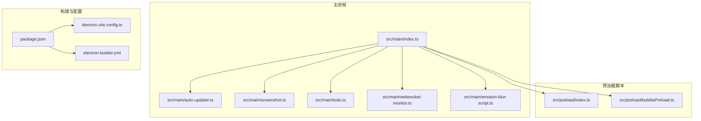
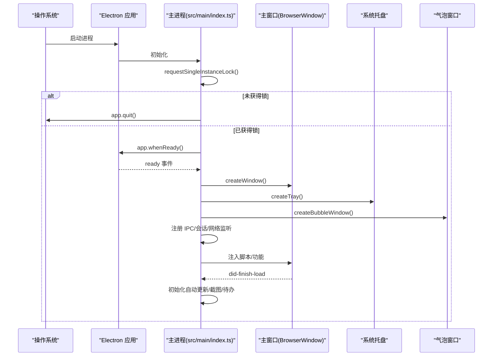
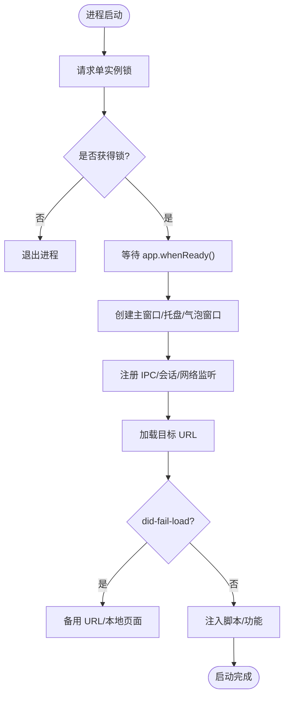
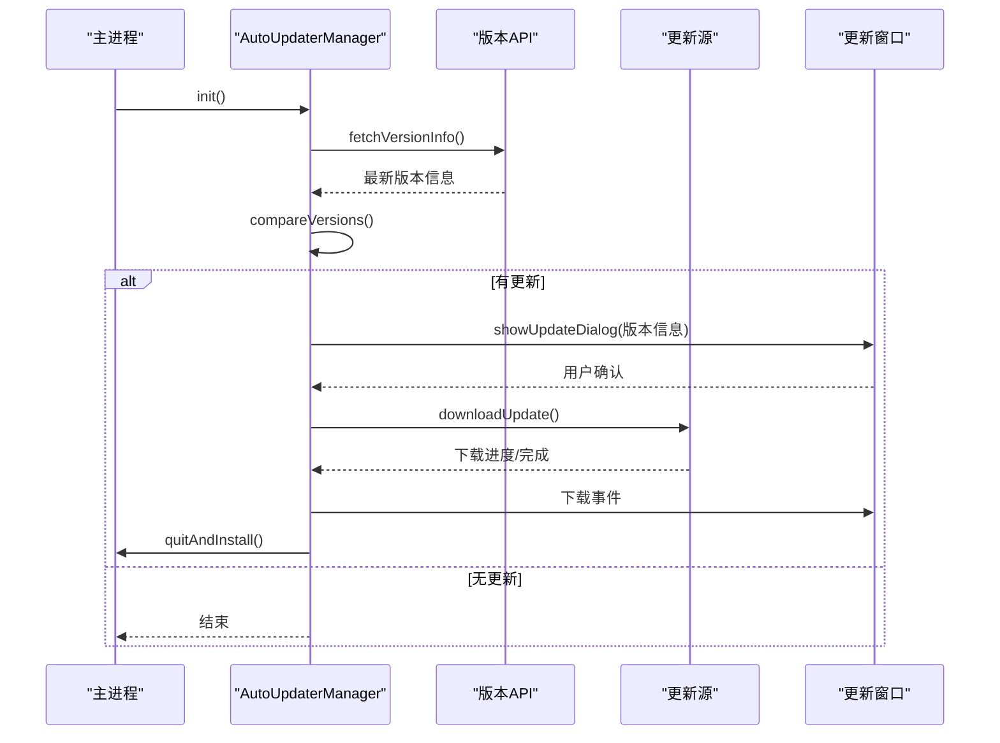
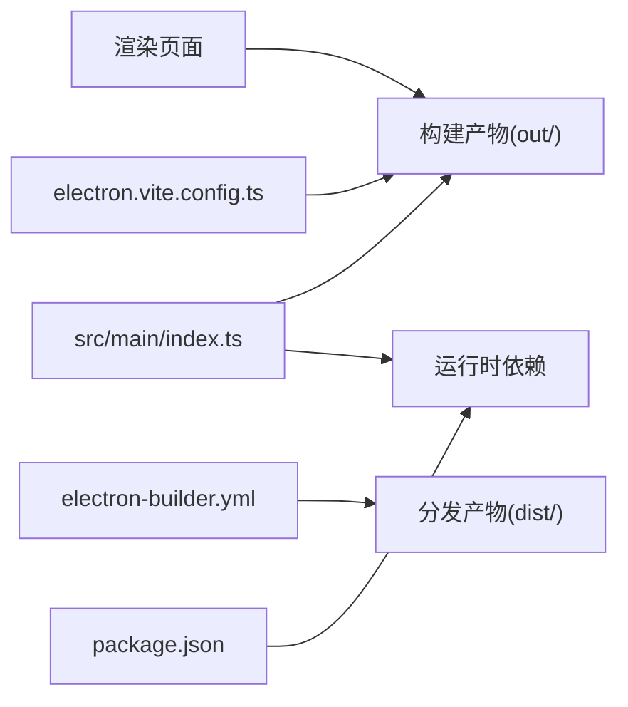
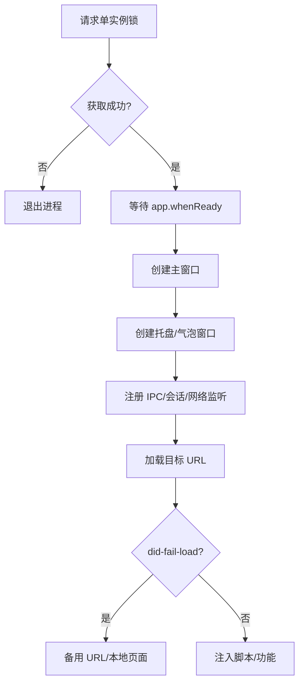

# 启动失败问题

<cite>
**本文引用的文件**
- [src/main/index.ts](file://src/main/index.ts)
- [src/main/auto-updater.ts](file://src/main/auto-updater.ts)
- [src/main/screenshot.ts](file://src/main/screenshot.ts)
- [src/main/todo.ts](file://src/main/todo.ts)
- [src/main/websocket-monitor.ts](file://src/main/websocket-monitor.ts)
- [src/main/emotion-blur-script.ts](file://src/main/emotion-blur-script.ts)
- [src/preload/index.ts](file://src/preload/index.ts)
- [src/preload/bubblePreload.ts](file://src/preload/bubblePreload.ts)
- [package.json](file://package.json)
- [electron.vite.config.ts](file://electron.vite.config.ts)
- [electron-builder.yml](file://electron-builder.yml)
- [ARCHITECTURE.md](file://ARCHITECTURE.md)
</cite>

## 目录
1. [简介](#简介)
2. [项目结构](#项目结构)
3. [核心组件](#核心组件)
4. [架构总览](#架构总览)
5. [详细组件分析](#详细组件分析)
6. [依赖关系分析](#依赖关系分析)
7. [性能考量](#性能考量)
8. [故障排查指南](#故障排查指南)
9. [结论](#结论)
10. [附录](#附录)

## 简介
本指南聚焦于 Electron 应用“WoaApp”的启动失败诊断，覆盖主进程初始化、窗口创建、资源加载、网络与证书、单实例锁、会话配置、自动更新、以及常见错误码与修复建议。文档结合源码中的启动流程、窗口管理、会话与网络配置、自动更新机制等关键实现，提供系统性的日志分析方法与排障步骤。

## 项目结构
应用采用典型的 Electron 多进程架构：主进程负责窗口、托盘、会话与自动更新；渲染进程承载 Vue 应用；预加载脚本提供安全的 IPC 桥接。构建与打包由 electron-vite 与 electron-builder 驱动。

图表来源
- [src/main/index.ts](file://src/main/index.ts#L1-L2406)
- [src/main/auto-updater.ts](file://src/main/auto-updater.ts#L1-L565)
- [src/main/screenshot.ts](file://src/main/screenshot.ts#L1-L158)
- [src/main/todo.ts](file://src/main/todo.ts#L1-L266)
- [src/main/websocket-monitor.ts](file://src/main/websocket-monitor.ts#L1-L242)
- [src/main/emotion-blur-script.ts](file://src/main/emotion-blur-script.ts#L1-L282)
- [src/preload/index.ts](file://src/preload/index.ts#L1-L63)
- [src/preload/bubblePreload.ts](file://src/preload/bubblePreload.ts#L1-L70)
- [package.json](file://package.json#L1-L55)
- [electron.vite.config.ts](file://electron.vite.config.ts#L1-L60)
- [electron-builder.yml](file://electron-builder.yml#L1-L53)

章节来源
- [ARCHITECTURE.md](file://ARCHITECTURE.md#L1-L492)
- [package.json](file://package.json#L1-L55)
- [electron.vite.config.ts](file://electron.vite.config.ts#L1-L60)
- [electron-builder.yml](file://electron-builder.yml#L1-L53)

## 核心组件
- 单实例锁与窗口生命周期：主进程通过单实例锁避免重复启动，并在 ready 后创建主窗口、托盘与气泡窗口。
- 会话与网络：持久化会话、证书验证回调、webRequest 拦截、权限请求放行、UA 设置与重定向处理。
- 自动更新：基于 electron-updater 的版本检查、下载与安装流程，含开发/生产环境差异。
- 截图与待办：全局快捷键、截图事件与对话框、待办窗口与 IPC 通信。
- 预加载桥接：通过 contextBridge 暴露受限 API，或在禁用隔离时直接挂载到 window。

章节来源
- [src/main/index.ts](file://src/main/index.ts#L74-L236)
- [src/main/index.ts](file://src/main/index.ts#L276-L615)
- [src/main/index.ts](file://src/main/index.ts#L617-L764)
- [src/main/auto-updater.ts](file://src/main/auto-updater.ts#L40-L186)
- [src/main/screenshot.ts](file://src/main/screenshot.ts#L16-L96)
- [src/main/todo.ts](file://src/main/todo.ts#L20-L136)
- [src/preload/index.ts](file://src/preload/index.ts#L1-L63)
- [src/preload/bubblePreload.ts](file://src/preload/bubblePreload.ts#L1-L70)

## 架构总览
下图展示启动关键路径：单实例锁 → app ready → 创建窗口/托盘/气泡 → 注册 IPC/会话/网络 → 注入脚本与功能。

图表来源
- [src/main/index.ts](file://src/main/index.ts#L74-L118)
- [src/main/index.ts](file://src/main/index.ts#L276-L495)
- [src/main/index.ts](file://src/main/index.ts#L617-L764)

## 详细组件分析

### 主进程启动与窗口创建
- 单实例锁：若未能获取锁，直接退出，避免重复实例。
- app.ready 后顺序创建主窗口、托盘、气泡窗口；随后注册 IPC、截图、待办、自动更新等。
- 主窗口加载目标 URL，监听 did-fail-load/did-finish-load，必要时回退到备用页面或本地页面。
- 气泡窗口根据开发/生产环境加载不同 HTML 资源，设置置顶与透明等特性。

图表来源
- [src/main/index.ts](file://src/main/index.ts#L74-L118)
- [src/main/index.ts](file://src/main/index.ts#L276-L495)
- [src/main/index.ts](file://src/main/index.ts#L598-L614)

章节来源
- [src/main/index.ts](file://src/main/index.ts#L74-L118)
- [src/main/index.ts](file://src/main/index.ts#L276-L495)
- [src/main/index.ts](file://src/main/index.ts#L598-L614)

### 会话与网络配置
- 持久化会话分区：使用指定分区名，保持登录状态。
- 证书验证回调：开发阶段接受所有证书，生产应改为严格校验。
- webRequest 拦截：允许所有请求/重定向/头部修改，便于调试但降低安全性。
- 权限请求：全部放行，简化集成但带来安全风险。
- UA 设置与导航/窗口打开策略：统一设置 UA，允许所有导航与新窗口在当前窗口打开。

章节来源
- [src/main/index.ts](file://src/main/index.ts#L304-L364)
- [src/main/index.ts](file://src/main/index.ts#L335-L338)
- [src/main/index.ts](file://src/main/index.ts#L406-L417)

### 自动更新机制
- 版本检查：调用远程 API 获取最新版本信息，比较版本号决定是否更新。
- 下载与安装：开发模式模拟下载进度，生产模式真实下载并安装。
- 更新窗口：根据打包状态加载本地或开发服务器页面，传递版本信息与进度事件。
- 错误处理：捕获下载/解析错误并通过 IPC 通知渲染进程。

图表来源
- [src/main/auto-updater.ts](file://src/main/auto-updater.ts#L40-L186)
- [src/main/auto-updater.ts](file://src/main/auto-updater.ts#L188-L221)
- [src/main/auto-updater.ts](file://src/main/auto-updater.ts#L297-L353)
- [src/main/auto-updater.ts](file://src/main/auto-updater.ts#L435-L473)

章节来源
- [src/main/auto-updater.ts](file://src/main/auto-updater.ts#L40-L186)
- [src/main/auto-updater.ts](file://src/main/auto-updater.ts#L188-L221)
- [src/main/auto-updater.ts](file://src/main/auto-updater.ts#L297-L353)
- [src/main/auto-updater.ts](file://src/main/auto-updater.ts#L435-L473)

### 截图与待办功能
- 截图：注册全局快捷键，监听完成/取消/保存事件，写入剪贴板并可保存到磁盘。
- 待办：创建独立窗口，注册 IPC 事件处理 CRUD，注入侧边栏图标与右键菜单项。

章节来源
- [src/main/screenshot.ts](file://src/main/screenshot.ts#L16-L96)
- [src/main/todo.ts](file://src/main/todo.ts#L20-L136)

### 预加载脚本与安全边界
- 主预加载：通过 contextBridge 暴露受限 API；禁用隔离时直接挂载 window.api。
- 气泡预加载：直接在 window 上暴露 bubbleAPI，监听消息与通知模式变更。

章节来源
- [src/preload/index.ts](file://src/preload/index.ts#L1-L63)
- [src/preload/bubblePreload.ts](file://src/preload/bubblePreload.ts#L1-L70)

## 依赖关系分析
- 构建配置：electron-vite 指定主/预加载/渲染输入与输出格式，开发服务器端口。
- 打包配置：electron-builder 定义产物目录、安装器选项、发布地址与镜像源。
- 运行时依赖：electron、electron-updater、electron-store、iconv-lite 等。

图表来源
- [electron.vite.config.ts](file://electron.vite.config.ts#L1-L60)
- [electron-builder.yml](file://electron-builder.yml#L1-L53)
- [package.json](file://package.json#L25-L33)

章节来源
- [electron.vite.config.ts](file://electron.vite.config.ts#L1-L60)
- [electron-builder.yml](file://electron-builder.yml#L1-L53)
- [package.json](file://package.json#L25-L33)

## 性能考量
- 背景节流禁用：确保窗口与功能在后台仍保持响应，但可能增加 CPU/电量消耗。
- 渲染性能：气泡窗口使用 showInactive 避免抢占焦点；组件按需加载。
- 内存管理：及时清理定时器、事件监听器与窗口引用；控制消息缓存规模。

章节来源
- [src/main/index.ts](file://src/main/index.ts#L296-L299)
- [ARCHITECTURE.md](file://ARCHITECTURE.md#L434-L449)

## 故障排查指南

### 一、主进程初始化失败
- 症状：应用启动后立即退出或无窗口。
- 排查要点：
  - 单实例锁冲突：若已有实例，当前实例会直接退出。检查是否存在残留进程或锁文件。
  - app.whenReady 未触发：确认依赖的系统资源可用（如 GPU/显卡驱动）。
  - 日志定位：在单实例锁判断处与 app.whenReady 回调处添加日志，确认执行路径。

章节来源
- [src/main/index.ts](file://src/main/index.ts#L74-L81)
- [src/main/index.ts](file://src/main/index.ts#L92-L98)

### 二、窗口创建错误
- 症状：主窗口/气泡窗口无法显示或白屏。
- 排查要点：
  - 资源路径与图标：确认图标路径存在；开发/生产环境资源路径差异。
  - 开发服务器：气泡窗口在开发模式下加载 Vite 服务 URL，若服务未启动会导致加载失败。
  - 置顶与透明：alwaysOnTop、transparent 等设置在某些系统上可能受限。
  - 日志定位：在窗口 loadURL/loadFile 成功/失败回调处记录 URL 与错误信息。

章节来源
- [src/main/index.ts](file://src/main/index.ts#L617-L764)
- [src/main/index.ts](file://src/main/index.ts#L664-L706)

### 三、资源加载异常
- 症状：页面空白、资源 404、脚本注入失败。
- 排查要点：
  - 目标 URL：主窗口直接加载聊天页面，若网络不可用或重定向失败，会尝试备用 URL 或本地页面。
  - did-fail-load：区分主页面加载失败与内部登录重定向失败，避免误判。
  - 本地回退：当外部加载失败时，回退到本地 HTML，便于快速定位问题。

章节来源
- [src/main/index.ts](file://src/main/index.ts#L402-L450)
- [src/main/index.ts](file://src/main/index.ts#L598-L614)

### 四、网络与证书问题
- 症状：HTTPS 请求失败、证书错误、重定向被拦截。
- 排查要点：
  - 证书验证：开发阶段接受所有证书，生产应改为严格校验。
  - webRequest 拦截：允许所有请求/重定向，便于调试但可能掩盖真实网络问题。
  - 权限请求：全部放行，简化集成但需注意安全影响。
  - UA 与重定向：统一 UA，允许重定向，避免因 UA/策略导致的 403/重定向死循环。

章节来源
- [src/main/index.ts](file://src/main/index.ts#L335-L338)
- [src/main/index.ts](file://src/main/index.ts#L340-L364)
- [src/main/index.ts](file://src/main/index.ts#L329-L333)

### 五、单实例锁冲突
- 症状：再次启动应用无反应或直接退出。
- 排查要点：
  - 锁获取失败即退出，确认是否已有实例在运行。
  - 第二实例事件：已有实例会尝试恢复并聚焦主窗口，检查该逻辑是否生效。

章节来源
- [src/main/index.ts](file://src/main/index.ts#L74-L90)

### 六、会话配置错误
- 症状：登录状态丢失、Cookie 未持久、WS 连接异常。
- 排查要点：
  - 会话分区：使用持久化分区，确保 cookies/localStorage 持久化。
  - 登录状态检查：在加载前检查相关域的 cookies，避免重复登录。
  - 权限与证书：统一设置权限与证书策略，避免因权限/证书导致的会话异常。

章节来源
- [src/main/index.ts](file://src/main/index.ts#L96-L98)
- [src/main/index.ts](file://src/main/index.ts#L239-L273)
- [src/main/index.ts](file://src/main/index.ts#L312-L327)

### 七、自动更新失败
- 症状：更新弹窗不出现、下载卡住、安装失败。
- 排查要点：
  - API 可达性：检查版本 API 地址可达性与返回格式。
  - 下载源：生产环境使用本地更新服务器，确认服务器可用与文件存在。
  - 错误事件：监听下载进度/错误事件，记录详细错误信息。
  - 开发模式：模拟下载便于调试，生产模式需真实下载。

章节来源
- [src/main/auto-updater.ts](file://src/main/auto-updater.ts#L134-L186)
- [src/main/auto-updater.ts](file://src/main/auto-updater.ts#L188-L221)
- [src/main/auto-updater.ts](file://src/main/auto-updater.ts#L435-L473)

### 八、常见错误码与修复
- did-fail-load：区分主页面与内部重定向失败，避免误判；必要时回退到本地页面。
- render-process-gone：渲染进程崩溃，尝试重启窗口并恢复位置。
- certificate-error：开发阶段接受证书，生产应严格校验。
- unresponsive：页面未响应，检查长时间任务与阻塞操作。
- 无网络：检测在线状态，提示用户网络问题。

章节来源
- [src/main/index.ts](file://src/main/index.ts#L434-L450)
- [src/main/index.ts](file://src/main/index.ts#L739-L747)

### 九、系统级问题排查
- 内存不足：监控内存使用，减少不必要的窗口与监听器；合理释放资源。
- 端口占用：开发服务器端口冲突时更换端口；打包后避免硬编码端口。
- 权限不足：托盘/快捷键/截图需相应权限，检查系统权限与 UAC 设置。

章节来源
- [electron.vite.config.ts](file://electron.vite.config.ts#L37-L43)
- [electron-builder.yml](file://electron-builder.yml#L18-L27)

## 结论
WoaApp 的启动失败通常源于单实例锁冲突、窗口资源加载失败、网络/证书策略不当、会话配置错误以及自动更新链路异常。通过结合源码中的启动流程、窗口创建、会话与网络配置、自动更新机制，配合系统化的日志分析与回退策略，可快速定位并解决问题。建议在生产环境收紧安全策略（如启用 contextIsolation、严格证书校验），并完善错误处理与监控。

## 附录

### A. 启动日志分析清单
- 单实例锁：是否成功获取锁；第二实例事件是否触发。
- app.ready：何时触发；是否在超时后仍未触发。
- 窗口创建：主窗口/气泡窗口创建与加载 URL；loadURL/loadFile 是否抛错。
- 会话与网络：证书回调、webRequest 拦截、权限请求、UA 设置是否生效。
- 自动更新：版本 API 返回、下载进度/错误事件、安装流程。

章节来源
- [src/main/index.ts](file://src/main/index.ts#L74-L118)
- [src/main/index.ts](file://src/main/index.ts#L276-L495)
- [src/main/auto-updater.ts](file://src/main/auto-updater.ts#L154-L186)

### B. 关键流程图（代码级）

图表来源
- [src/main/index.ts](file://src/main/index.ts#L74-L118)
- [src/main/index.ts](file://src/main/index.ts#L276-L495)