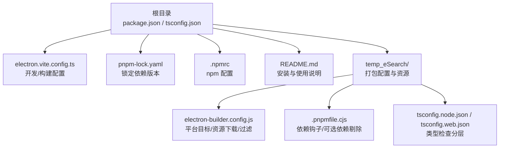
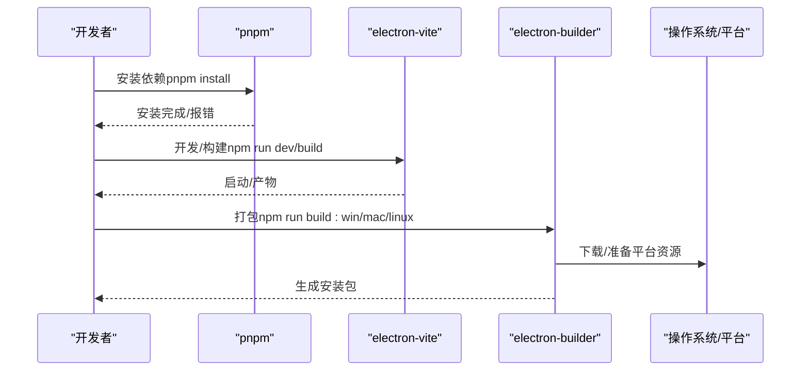
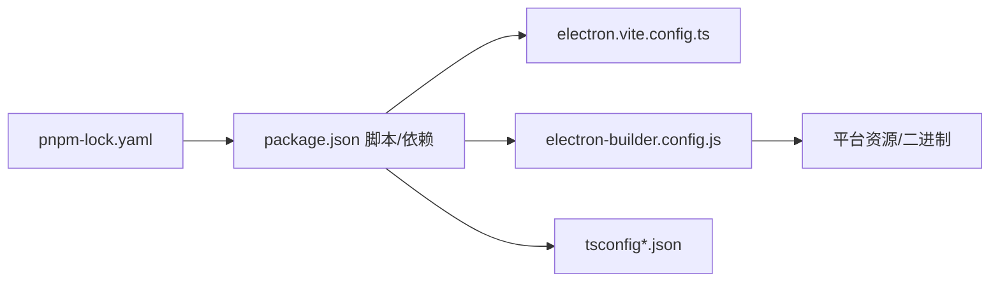

# 安装问题

<cite>
**本文引用的文件**
- [package.json](file://package.json)
- [pnpm-lock.yaml](file://pnpm-lock.yaml)
- [electron.vite.config.ts](file://electron.vite.config.ts)
- [electron-builder.config.js](file://temp_eSearch/electron-builder.config.js)
- [.pnpmfile.cjs](file://temp_eSearch/.pnpmfile.cjs)
- [tsconfig.json](file://tsconfig.json)
- [tsconfig.node.json](file://tsconfig.node.json)
- [tsconfig.web.json](file://tsconfig.web.json)
- [README.md](file://README.md)
- [.npmrc](file://.npmrc)
</cite>

## 目录
1. [简介](#简介)
2. [项目结构](#项目结构)
3. [核心组件](#核心组件)
4. [架构总览](#架构总览)
5. [详细组件分析](#详细组件分析)
6. [依赖关系分析](#依赖关系分析)
7. [性能考量](#性能考量)
8. [故障排查指南](#故障排查指南)
9. [结论](#结论)
10. [附录](#附录)

## 简介
本指南面向首次安装或在不同操作系统（Windows、macOS、Linux）上遇到安装问题的开发者，围绕以下主题提供系统化排查与修复建议：
- Node.js 版本兼容性与工具链选择
- 包管理器（pnpm）与依赖安装失败
- 构建配置错误与平台特定问题
- 依赖冲突、权限问题、网络代理
- 卸载清理与重新安装流程

本项目采用 Electron + Vue + TypeScript 技术栈，使用 pnpm 作为包管理器，构建工具为 electron-vite，打包工具为 electron-builder。

## 项目结构
项目采用多进程架构（主进程、渲染进程、预加载），并以 TypeScript 与 Vue 驱动前端。关键配置集中在根目录与 temp_eSearch 目录中，分别用于开发构建、打包与平台特定资源准备。

图表来源
- [package.json](file://package.json#L1-L55)
- [electron.vite.config.ts](file://electron.vite.config.ts#L1-L60)
- [pnpm-lock.yaml](file://pnpm-lock.yaml#L1-L120)
- [electron-builder.config.js](file://temp_eSearch/electron-builder.config.js#L1-L350)
- [.pnpmfile.cjs](file://temp_eSearch/.pnpmfile.cjs#L1-L10)
- [tsconfig.json](file://tsconfig.json#L1-L5)
- [tsconfig.node.json](file://tsconfig.node.json#L1-L9)
- [tsconfig.web.json](file://tsconfig.web.json#L1-L19)

章节来源
- [README.md](file://README.md#L493-L518)
- [package.json](file://package.json#L1-L55)

## 核心组件
- 包管理与脚本
  - 使用 pnpm 管理依赖，根目录提供安装、开发、构建、打包脚本。
- 构建与预览
  - electron-vite 提供 dev/preview/build 能力，配置强制主进程与预加载为 CommonJS。
- 打包与平台目标
  - electron-builder 配置 appId、输出目录、图标、目标平台与安装包格式，包含 beforePack 资源下载与过滤规则。
- 类型检查
  - tsconfig 分为 node/web 两套，分别约束主进程/预加载与渲染进程类型检查范围。

章节来源
- [package.json](file://package.json#L9-L24)
- [electron.vite.config.ts](file://electron.vite.config.ts#L5-L59)
- [electron-builder.config.js](file://temp_eSearch/electron-builder.config.js#L133-L268)
- [tsconfig.json](file://tsconfig.json#L1-L5)
- [tsconfig.node.json](file://tsconfig.node.json#L1-L9)
- [tsconfig.web.json](file://tsconfig.web.json#L1-L19)

## 架构总览
安装与构建的关键流程如下：

图表来源
- [package.json](file://package.json#L9-L24)
- [electron.vite.config.ts](file://electron.vite.config.ts#L5-L59)
- [electron-builder.config.js](file://temp_eSearch/electron-builder.config.js#L133-L268)

## 详细组件分析

### 依赖与版本锁定
- 锁定文件包含大量依赖版本，确保安装一致性与可复现性。
- 关键依赖包括 Electron、electron-vite、electron-builder、Vue 生态等。

章节来源
- [pnpm-lock.yaml](file://pnpm-lock.yaml#L1-L120)

### 构建配置（electron-vite）
- 强制主进程与预加载输出为 CommonJS，避免 ES 模块在 Node 环境中的兼容性问题。
- 渲染进程使用 Vue 插件与别名路径，开发服务器端口固定。

章节来源
- [electron.vite.config.ts](file://electron.vite.config.ts#L5-L59)

### 打包配置（electron-builder）
- 平台目标：Windows（nsis/zip）、macOS（dmg/zip）、Linux（tar.gz/deb/rpm/AppImage）。
- 资源准备：beforePack 中根据平台与架构下载 ONNX、FFmpeg 等二进制资源。
- 体积优化：asar 关闭、文件与模块过滤、仅保留必要语言包。
- Electron 下载镜像：配置国内镜像以提升下载稳定性。

章节来源
- [electron-builder.config.js](file://temp_eSearch/electron-builder.config.js#L133-L349)

### 类型检查配置
- 根 tsconfig 引用 node/web 两套配置，分别限定编译范围与路径映射。
- node 配置包含 electron-vite/node 类型，web 配置包含渲染与预加载类型声明。

章节来源
- [tsconfig.json](file://tsconfig.json#L1-L5)
- [tsconfig.node.json](file://tsconfig.node.json#L1-L9)
- [tsconfig.web.json](file://tsconfig.web.json#L1-L19)

### 依赖钩子与可选依赖剔除
- .pnpmfile.cjs 在读取包时删除可选依赖 canvas，避免在某些平台安装失败。
- 适用于 Electron 与系统不匹配导致的可选绑定问题。

章节来源
- [.pnpmfile.cjs](file://temp_eSearch/.pnpmfile.cjs#L1-L10)

## 依赖关系分析
安装阶段的关键耦合点：
- pnpm 与锁文件：保证依赖版本一致。
- electron-vite 与 Electron 版本：主/预加载 CommonJS 输出与 Electron 主进程兼容。
- electron-builder 与平台资源：beforePack 依赖网络下载与平台架构判断。
- TypeScript 配置：node/web 分层避免类型检查范围过大。

图表来源
- [pnpm-lock.yaml](file://pnpm-lock.yaml#L1-L120)
- [package.json](file://package.json#L1-L55)
- [electron.vite.config.ts](file://electron.vite.config.ts#L1-L60)
- [electron-builder.config.js](file://temp_eSearch/electron-builder.config.js#L1-L350)
- [tsconfig.json](file://tsconfig.json#L1-L5)

章节来源
- [pnpm-lock.yaml](file://pnpm-lock.yaml#L1-L120)
- [package.json](file://package.json#L1-L55)

## 性能考量
- 依赖安装性能：使用 pnpm 与锁文件可显著减少重复下载与安装时间。
- 构建性能：electron-vite 默认开发服务器端口固定，避免端口冲突带来的重试成本。
- 打包体积：asar 关闭、文件/模块过滤、语言包裁剪降低最终包体。
- 网络下载：electron-builder 配置镜像与 beforePack 资源缓存，减少重复下载。

章节来源
- [electron-builder.config.js](file://temp_eSearch/electron-builder.config.js#L140-L143)
- [electron-builder.config.js](file://temp_eSearch/electron-builder.config.js#L161-L184)
- [electron-builder.config.js](file://temp_eSearch/electron-builder.config.js#L236-L267)

## 故障排查指南

### 一、Node.js 与工具链版本兼容性
- 现状
  - Electron 版本与 Node.js 最低版本要求需满足 electron-builder 与 esbuild 等工具链的引擎要求。
  - 项目使用 pnpm，建议使用与 pnpm 兼容的 Node.js 版本。
- 建议
  - 使用 Node.js LTS 版本（如 18.x 或 20.x），确保与 Electron 33.x 兼容。
  - 若使用 nvm/n（或其他版本管理器）切换 Node 版本后，清理缓存并重新安装依赖。
- 排查要点
  - 查看 electron-builder 与 esbuild 的最低 Node 版本要求。
  - 确认 pnpm 版本与 Node 版本匹配，避免因版本不兼容导致的安装失败。

章节来源
- [pnpm-lock.yaml](file://pnpm-lock.yaml#L1-L120)
- [package.json](file://package.json#L43-L47)

### 二、依赖安装失败（pnpm）
- 常见原因
  - 网络不稳定或受限，导致下载依赖失败。
  - 可选依赖在当前平台无法编译（如 canvas）。
  - 权限不足导致写入 node_modules 或全局缓存。
- 解决方案
  - 使用国内镜像源或代理，确保网络可达。
  - 使用 .pnpmfile.cjs 删除可选依赖，避免平台不兼容。
  - 以管理员权限运行终端，或调整缓存目录权限。
  - 清理缓存与重装：删除 node_modules、pnpm-store、锁文件后重新安装。
- 诊断步骤
  - 观察安装日志中的具体错误码与依赖名称。
  - 检查 .npmrc 是否配置了镜像源或代理。
  - 对于可选依赖，确认平台是否支持对应二进制绑定。

章节来源
- [.pnpmfile.cjs](file://temp_eSearch/.pnpmfile.cjs#L1-L10)
- [.npmrc](file://.npmrc)
- [pnpm-lock.yaml](file://pnpm-lock.yaml#L1-L120)

### 三、构建配置错误
- 主/预加载 CommonJS 输出
  - 若自定义 Rollup 配置未保持 CommonJS，可能导致主进程运行时报错。
  - 确保 electron-vite 配置未被覆盖，或显式设置输出格式为 cjs。
- 渲染进程别名与插件
  - 别名路径需与实际目录一致，插件（如 Vue）需正确安装。
- 开发服务器端口
  - 若端口被占用，需修改端口或释放占用进程。

章节来源
- [electron.vite.config.ts](file://electron.vite.config.ts#L5-L59)
- [tsconfig.web.json](file://tsconfig.web.json#L12-L16)

### 四、平台特定问题
- Windows
  - NSIS 安装包：允许更改安装目录，注意磁盘空间与权限。
  - FFmpeg 资源：beforePack 会自动下载，若失败需检查网络与代理。
- macOS
  - DMG/ZIP 包：注意签名与 Gatekeeper 设置，必要时关闭严格校验进行测试。
  - ARM64 与 x64：根据架构选择对应资源。
- Linux
  - 多种目标格式（deb/rpm/AppImage/tar.gz），需确保系统具备相应打包依赖。
  - 依赖声明（如 ffmpeg）需在目标系统可用。

章节来源
- [electron-builder.config.js](file://temp_eSearch/electron-builder.config.js#L164-L230)
- [electron-builder.config.js](file://temp_eSearch/electron-builder.config.js#L231-L235)

### 五、依赖冲突与可选依赖
- 冲突定位
  - 使用 pnpm 的依赖树视图或锁定文件比对，识别版本差异。
- 解决策略
  - 通过 .pnpmfile.cjs 删除可选依赖（如 canvas），避免平台不支持。
  - 在 electron-builder 中过滤不需要的模块与文件，缩小冲突面。
- 验证
  - 重新安装后运行最小化示例，确认主/渲染进程可启动。

章节来源
- [.pnpmfile.cjs](file://temp_eSearch/.pnpmfile.cjs#L1-L10)
- [electron-builder.config.js](file://temp_eSearch/electron-builder.config.js#L309-L347)

### 六、权限问题
- 常见表现
  - 安装失败、无法写入 node_modules、打包阶段权限不足。
- 处理方式
  - 以管理员身份运行终端或 IDE 的集成终端。
  - 更换工作目录到非系统受保护路径（如用户目录）。
  - 清理 pnpm 缓存目录权限（例如 ~/.pnpm-store）。

章节来源
- [pnpm-lock.yaml](file://pnpm-lock.yaml#L1-L120)

### 七、网络代理与镜像
- 配置建议
  - 在 .npmrc 中配置 registry 与缓存目录，必要时配置代理。
  - electron-builder 已内置镜像配置，但仍需确保网络可达。
- 故障排查
  - 测试访问依赖源与镜像地址，逐步排除 DNS/代理问题。
  - beforePack 中的资源下载若失败，优先检查网络与证书校验。

章节来源
- [.npmrc](file://.npmrc)
- [electron-builder.config.js](file://temp_eSearch/electron-builder.config.js#L140-L143)
- [electron-builder.config.js](file://temp_eSearch/electron-builder.config.js#L26-L43)

### 八、卸载清理与重新安装
- 清理步骤
  - 删除 node_modules 与 pnpm-store 缓存。
  - 删除构建产物与打包输出目录。
  - 清理 .vite 缓存与临时文件。
- 重新安装
  - 使用 pnpm install 安装依赖。
  - 如需跳过可选依赖，确保 .pnpmfile.cjs 生效。
  - 首次安装后执行一次开发或构建命令，触发 electron-builder 安装依赖。
- 验证
  - 运行 npm run dev，确认开发环境可用。
  - 运行 npm run build，确认构建产物生成。
  - 针对目标平台运行对应打包脚本，确认安装包可生成。

章节来源
- [package.json](file://package.json#L17-L24)
- [electron-builder.config.js](file://temp_eSearch/electron-builder.config.js#L133-L163)

## 结论
- 本项目安装与构建的关键在于：稳定的 Node.js 版本、可靠的 pnpm 依赖管理、正确的 electron-vite 配置以及针对平台的 electron-builder 设置。
- 遇到安装问题时，优先检查网络与代理、可选依赖剔除、权限与缓存目录，再结合平台特定资源准备与打包过滤策略逐一排查。
- 通过规范化的卸载清理与重新安装流程，可有效规避历史状态干扰，提升问题定位效率。

## 附录

### A. 不同操作系统安装步骤与注意事项
- Windows
  - 安装 Node.js（LTS）、Git、Visual Studio Build Tools（如需原生模块）。
  - 使用 pnpm 安装依赖，若安装失败，尝试更换镜像或代理。
  - 执行 npm run dev 进行开发，npm run build:win 生成安装包。
- macOS
  - 安装 Xcode Command Line Tools，确保 clang/Make 可用。
  - 若 Apple Silicon（ARM64），注意资源与依赖的架构匹配。
  - 执行 npm run dev，npm run build:mac 生成 dmg/zip。
- Linux
  - 安装打包依赖（如 fakeroot、dpkg、rpm 等），确保可生成对应格式包。
  - 若系统缺少 ffmpeg，提前安装以避免 beforePack 步骤失败。
  - 执行 npm run dev，npm run build:linux 生成 tar.gz/deb/rpm/AppImage。

章节来源
- [README.md](file://README.md#L493-L518)
- [electron-builder.config.js](file://temp_eSearch/electron-builder.config.js#L164-L230)

### B. 常用命令速查
- 安装依赖：pnpm install
- 开发调试：npm run dev
- 预览构建：npm run start
- 构建产物：npm run build
- 打包 Windows：npm run build:win
- 打包 macOS：npm run build:mac
- 打包 Linux：npm run build:linux
- 清理构建目录：npm run clean

章节来源
- [package.json](file://package.json#L9-L24)