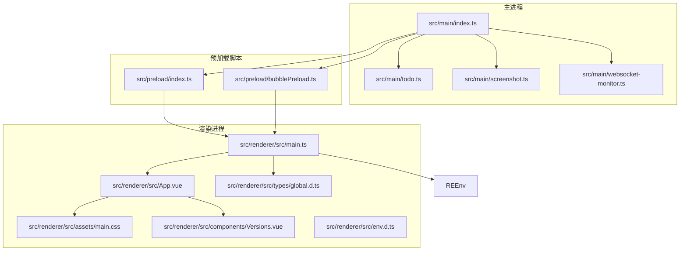
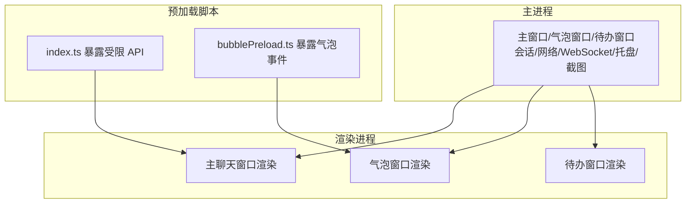
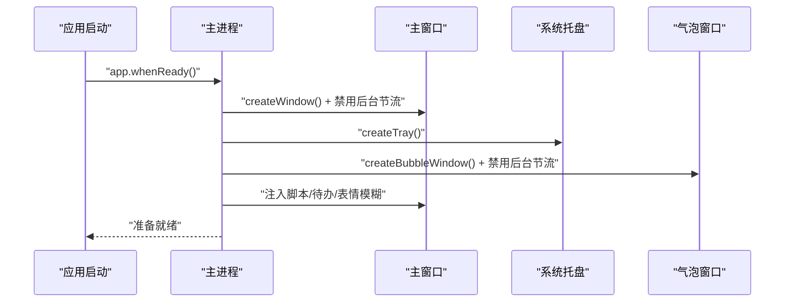
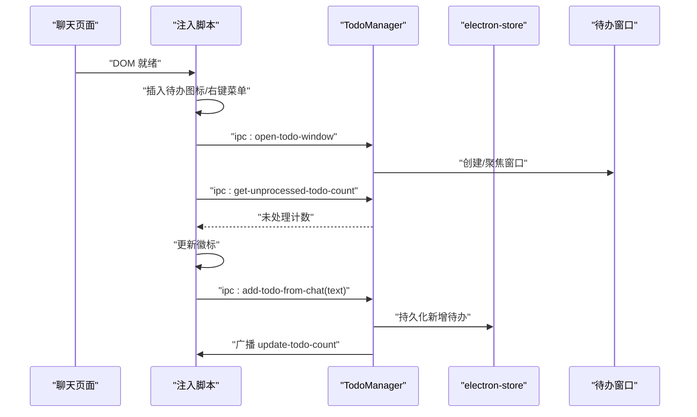
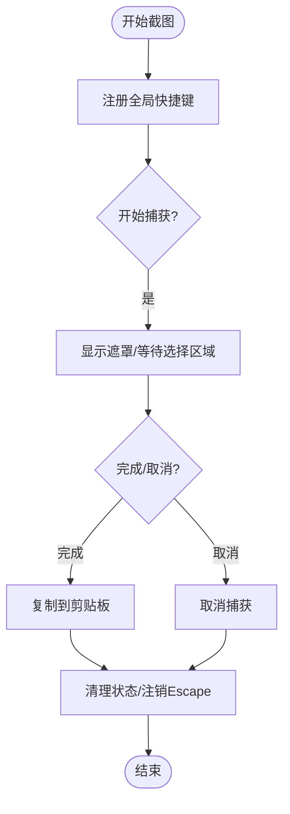
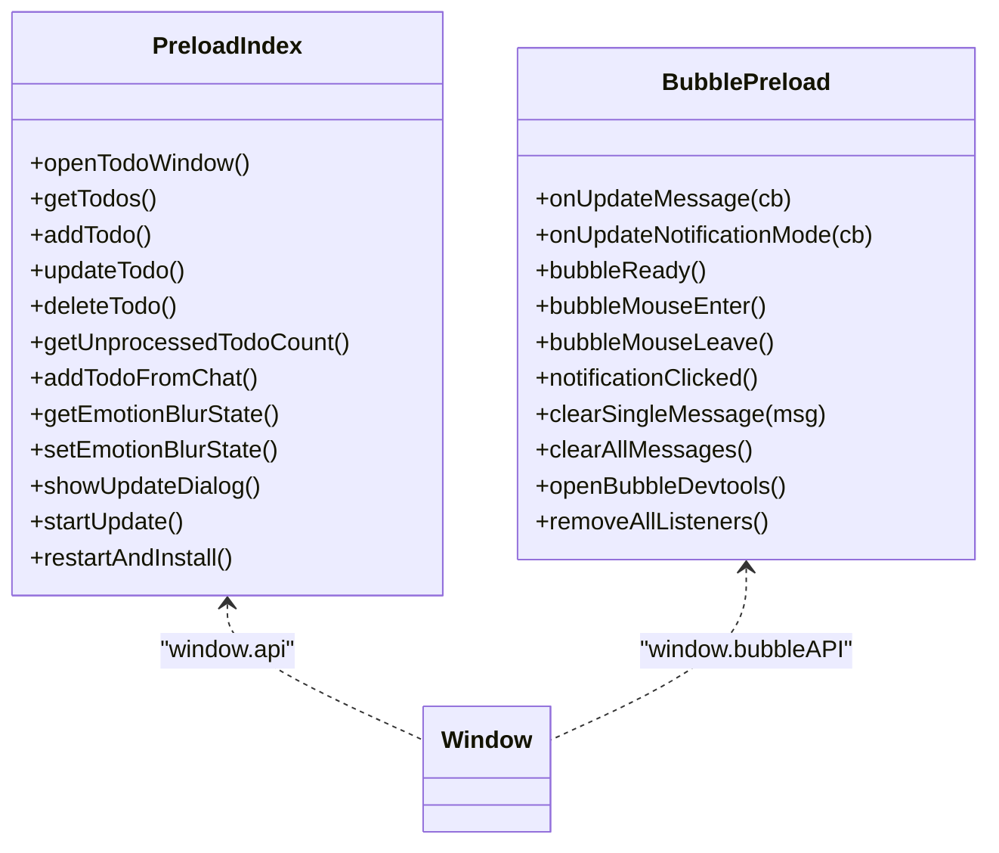
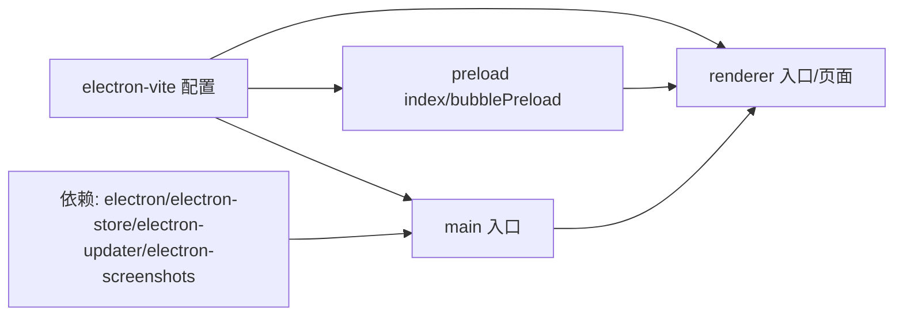

# 性能问题

<cite>
**本文引用的文件**   
- [package.json](file://package.json)
- [ARCHITECTURE.md](file://ARCHITECTURE.md)
- [electron.vite.config.ts](file://electron.vite.config.ts)
- [src/main/index.ts](file://src/main/index.ts)
- [src/main/todo.ts](file://src/main/todo.ts)
- [src/main/screenshot.ts](file://src/main/screenshot.ts)
- [src/main/websocket-monitor.ts](file://src/main/websocket-monitor.ts)
- [src/preload/index.ts](file://src/preload/index.ts)
- [src/preload/bubblePreload.ts](file://src/preload/bubblePreload.ts)
- [src/renderer/src/main.ts](file://src/renderer/src/main.ts)
- [src/renderer/src/App.vue](file://src/renderer/src/App.vue)
- [src/renderer/src/assets/main.css](file://src/renderer/src/assets/main.css)
- [src/renderer/src/components/Versions.vue](file://src/renderer/src/components/Versions.vue)
- [src/renderer/src/types/global.d.ts](file://src/renderer/src/types/global.d.ts)
- [src/renderer/src/env.d.ts](file://src/renderer/src/env.d.ts)
- [src/renderer/bubble.html](file://src/renderer/bubble.html)
- [src/renderer/todo.html](file://src/renderer/todo.html)
- [src/renderer/index.html](file://src/renderer/index.html)
- [src/renderer/update.html](file://src/renderer/update.html)
</cite>

## 目录
1. [简介](#简介)
2. [项目结构](#项目结构)
3. [核心组件](#核心组件)
4. [架构总览](#架构总览)
5. [详细组件分析](#详细组件分析)
6. [依赖关系分析](#依赖关系分析)
7. [性能考量](#性能考量)
8. [故障排查指南](#故障排查指南)
9. [结论](#结论)
10. [附录](#附录)

## 简介
本指南聚焦于 Electron 应用在实际运行中的性能问题诊断与优化，围绕启动缓慢、内存泄漏、CPU 占用过高、渲染卡顿等常见瓶颈展开。结合项目现有代码结构与多进程架构（主进程、渲染进程、预加载脚本），给出可落地的优化策略、监控手段与最佳实践，并提供多进程资源分配建议、基准测试与持续监控方案。

## 项目结构
该项目采用 Electron 多进程架构，主进程负责窗口、会话、系统托盘、截图、待办管理、自动更新等；渲染进程承载 Vue 应用与多个子窗口（主聊天、气泡提醒、待办）；预加载脚本作为安全桥接，向渲染进程暴露有限 API。

**图表来源**
- [src/main/index.ts](file://src/main/index.ts#L1-L2406)
- [src/main/todo.ts](file://src/main/todo.ts#L1-L266)
- [src/main/screenshot.ts](file://src/main/screenshot.ts#L1-L158)
- [src/main/websocket-monitor.ts](file://src/main/websocket-monitor.ts#L1-L242)
- [src/preload/index.ts](file://src/preload/index.ts#L1-L63)
- [src/preload/bubblePreload.ts](file://src/preload/bubblePreload.ts#L1-L70)
- [src/renderer/src/main.ts](file://src/renderer/src/main.ts#L1-L7)
- [src/renderer/src/App.vue](file://src/renderer/src/App.vue#L1-L27)
- [src/renderer/src/assets/main.css](file://src/renderer/src/assets/main.css#L1-L172)

**章节来源**
- [ARCHITECTURE.md](file://ARCHITECTURE.md#L1-L492)
- [package.json](file://package.json#L1-L55)
- [electron.vite.config.ts](file://electron.vite.config.ts#L1-L60)

## 核心组件
- 主进程入口与窗口管理：负责创建主窗口、气泡窗口、待办窗口，注册全局快捷键、系统托盘、会话与网络策略、WebSocket 监听注入等。
- 待办管理：提供待办窗口、数据持久化、IPC 事件处理与脚本注入。
- 截图功能：全局快捷键触发，事件回调处理复制与保存。
- 预加载脚本：在禁用上下文隔离场景下，向渲染进程暴露受限 API。
- 渲染进程：Vue 应用入口与组件、样式、类型声明。

**章节来源**
- [src/main/index.ts](file://src/main/index.ts#L1-L2406)
- [src/main/todo.ts](file://src/main/todo.ts#L1-L266)
- [src/main/screenshot.ts](file://src/main/screenshot.ts#L1-L158)
- [src/preload/index.ts](file://src/preload/index.ts#L1-L63)
- [src/preload/bubblePreload.ts](file://src/preload/bubblePreload.ts#L1-L70)
- [src/renderer/src/main.ts](file://src/renderer/src/main.ts#L1-L7)
- [src/renderer/src/App.vue](file://src/renderer/src/App.vue#L1-L27)

## 架构总览
多进程架构下，主进程承担系统级能力与资源协调，渲染进程专注 UI 与业务逻辑，预加载脚本在安全边界内提供必要 API。项目文档明确指出“禁用上下文隔离、Node 集成、Web 安全、沙盒”等配置，这在性能与安全之间做了权衡，需配合严格的资源管理与监控。

**图表来源**
- [ARCHITECTURE.md](file://ARCHITECTURE.md#L40-L421)
- [src/main/index.ts](file://src/main/index.ts#L276-L764)
- [src/preload/index.ts](file://src/preload/index.ts#L1-L63)
- [src/preload/bubblePreload.ts](file://src/preload/bubblePreload.ts#L1-L70)

## 详细组件分析

### 主进程与窗口生命周期
- 主窗口与气泡窗口均设置禁用后台节流，避免渲染进程在后台被降频，保障通知与动画体验。
- 主窗口 Web 偏好包含禁用安全策略、Node 集成、实验特性等，提升兼容性但带来安全与资源风险。
- 截图功能注册全局快捷键并在退出时清理，避免残留监听导致 CPU 占用。

**图表来源**
- [src/main/index.ts](file://src/main/index.ts#L92-L130)
- [src/main/index.ts](file://src/main/index.ts#L276-L302)
- [src/main/index.ts](file://src/main/index.ts#L618-L647)

**章节来源**
- [src/main/index.ts](file://src/main/index.ts#L276-L302)
- [src/main/index.ts](file://src/main/index.ts#L618-L647)
- [src/main/screenshot.ts](file://src/main/screenshot.ts#L147-L153)

### 待办管理与 IPC
- TodoManager 负责窗口创建、数据持久化、IPC 事件注册与广播未处理计数。
- 注入脚本在聊天页面侧边栏插入“待办”入口，右键菜单项“添加到待办”，通过 IPC 与主进程交互。
- 为避免重复注入，脚本内含幂等判断。

**图表来源**
- [src/main/todo.ts](file://src/main/todo.ts#L38-L72)
- [src/main/todo.ts](file://src/main/todo.ts#L77-L136)
- [src/main/todo.ts](file://src/main/todo.ts#L160-L264)

**章节来源**
- [src/main/todo.ts](file://src/main/todo.ts#L1-L266)

### 截图功能与事件清理
- 全局快捷键触发截图，事件回调中及时释放状态与注销 Escape 监听，避免重复处理与资源泄漏。
- 保存流程中使用互斥标志避免并发写入。

**图表来源**
- [src/main/screenshot.ts](file://src/main/screenshot.ts#L16-L78)
- [src/main/screenshot.ts](file://src/main/screenshot.ts#L147-L153)

**章节来源**
- [src/main/screenshot.ts](file://src/main/screenshot.ts#L1-L158)

### 预加载脚本与 API 暴露
- 主预加载脚本在禁用上下文隔离时直接挂载到 window，提供受限 IPC 能力。
- 气泡预加载脚本暴露消息更新、鼠标事件、清除消息、开发者工具等事件通道。

**图表来源**
- [src/preload/index.ts](file://src/preload/index.ts#L17-L43)
- [src/preload/bubblePreload.ts](file://src/preload/bubblePreload.ts#L4-L60)

**章节来源**
- [src/preload/index.ts](file://src/preload/index.ts#L1-L63)
- [src/preload/bubblePreload.ts](file://src/preload/bubblePreload.ts#L1-L70)

### 渲染进程与样式
- Vue 应用入口创建根实例并挂载。
- 样式包含背景、过渡、响应式适配等，注意大图与滤镜对 GPU/CPU 的影响。

**章节来源**
- [src/renderer/src/main.ts](file://src/renderer/src/main.ts#L1-L7)
- [src/renderer/src/assets/main.css](file://src/renderer/src/assets/main.css#L1-L172)

## 依赖关系分析
- 构建工具：electron-vite 配置主/预加载/渲染三段构建，预加载拆分为两份输入，渲染端启用 Vue 插件与热更端口。
- 运行时依赖：electron、electron-store、electron-updater、electron-screenshots 等。
- 多进程通信：IPC 事件贯穿主/渲染，预加载脚本作为桥接。

**图表来源**
- [electron.vite.config.ts](file://electron.vite.config.ts#L5-L58)
- [package.json](file://package.json#L25-L53)

**章节来源**
- [electron.vite.config.ts](file://electron.vite.config.ts#L1-L60)
- [package.json](file://package.json#L1-L55)

## 性能考量

### 启动缓慢
- 现状：主窗口加载目标页面，存在导航与重定向处理、注入脚本延迟执行、会话持久化与权限放宽策略。
- 优化建议：
  - 启动阶段仅加载必要资源，将非关键注入延迟至首次交互。
  - 缓存登录状态与会话，减少重复校验与网络请求。
  - 关闭不必要的 webRequest 拦截与权限放宽，降低启动期网络与安全检查成本。
  - 预加载脚本拆分与按需加载，避免一次性加载过多模块。

**章节来源**
- [src/main/index.ts](file://src/main/index.ts#L402-L530)
- [src/main/index.ts](file://src/main/index.ts#L304-L364)

### 内存泄漏
- 现状：全局快捷键、截图事件监听、WebSocket 监听注入、窗口事件等。
- 优化建议：
  - 严格成对注册/注销事件（如截图 ESC、全局快捷键）。
  - 窗口 close/hide 时移除监听器与定时器，避免闭包持有。
  - 控制消息缓存大小与生命周期，定期清理。
  - 预加载脚本移除监听器接口应被调用，防止渲染进程残留回调。

**章节来源**
- [src/main/screenshot.ts](file://src/main/screenshot.ts#L147-L153)
- [src/preload/bubblePreload.ts](file://src/preload/bubblePreload.ts#L55-L59)
- [ARCHITECTURE.md](file://ARCHITECTURE.md#L438-L449)

### CPU 占用过高
- 现状：禁用后台节流、禁用安全策略、Node 集成、实验特性开启。
- 优化建议：
  - 仅在必要窗口禁用后台节流（如气泡窗口），主窗口谨慎保留。
  - 降低实验特性与高开销 API 的使用频率。
  - 优化 WebSocket 解析与消息转发路径，避免主线程阻塞。
  - 渲染侧减少高频重排与大图滤镜，使用 will-change 与 transform 优化。

**章节来源**
- [src/main/index.ts](file://src/main/index.ts#L286-L301)
- [src/main/index.ts](file://src/main/index.ts#L635-L646)
- [src/main/websocket-monitor.ts](file://src/main/websocket-monitor.ts#L1-L242)

### 渲染卡顿
- 现状：窗口尺寸较大、背景图与滤镜、Vue 组件按需加载。
- 优化建议：
  - 使用 will-change 与 transform 优化动画，避免强制同步布局。
  - 减少大图与滤镜叠加，必要时使用硬件加速。
  - 控制窗口层级与置顶策略，避免频繁重绘。
  - 合理拆分渲染任务，避免长任务阻塞 UI。

**章节来源**
- [src/renderer/src/assets/main.css](file://src/renderer/src/assets/main.css#L42-L48)
- [src/renderer/src/assets/main.css](file://src/renderer/src/assets/main.css#L128-L139)

### 多进程架构下的优化策略
- 主进程：
  - 仅在需要时创建额外窗口，合理复用会话与权限。
  - 将耗时任务（如截图保存）放入后台流程，避免阻塞主 IPC。
- 渲染进程：
  - 组件懒加载与路由级分割，减少首屏负担。
  - 预加载脚本暴露最小 API 面，避免在渲染进程执行重型逻辑。
- 资源分配：
  - 气泡窗口禁用后台节流以保证体验，主窗口谨慎保留。
  - 控制预加载脚本体积，避免影响首屏。

**章节来源**
- [ARCHITECTURE.md](file://ARCHITECTURE.md#L444-L449)
- [src/main/index.ts](file://src/main/index.ts#L286-L301)
- [src/main/index.ts](file://src/main/index.ts#L635-L646)

### 性能监控与工具
- Electron 内置工具：
  - DevTools：主/气泡/待办窗口均可打开开发者工具，定位 JS/CSS/网络问题。
  - 性能面板：记录脚本执行、布局与绘制、内存分配。
- 第三方工具：
  - 使用性能分析器（如 Chrome/Edge 性能面板）录制启动、交互、渲染过程。
  - 结合系统监控（任务管理器/性能监视器）观察 CPU/内存/GPU 占用。
- 日志与埋点：
  - 在关键路径（窗口创建、脚本注入、IPC 事件、WebSocket 消息）打点，统计耗时与失败率。

**章节来源**
- [src/main/index.ts](file://src/main/index.ts#L170-L172)
- [src/preload/bubblePreload.ts](file://src/preload/bubblePreload.ts#L50-L53)

### 基准测试与持续监控
- 基准测试：
  - 启动时间：冷启动/热启动多次测量取中位数。
  - 交互延迟：点击/滚动/消息到达至 UI 更新的时延。
  - 资源占用：CPU/内存/GPU 在典型场景下的峰值与平均值。
- 持续监控：
  - CI 集成性能回归检测，设定阈值告警。
  - 上线后收集匿名性能数据，建立趋势基线。

[本节为通用指导，无需特定文件引用]

## 故障排查指南
- 启动失败/白屏
  - 检查主窗口加载 URL 与导航拦截逻辑，确认目标页面可达与重定向处理。
  - 若登录重定向失败，尝试备用 URL 或本地提示页。
- 消息不显示/延迟
  - 检查 WebSocket 监听注入与消息解析逻辑，确认 Protobuf 解析与消息提取。
  - 确认主/渲染 IPC 通道畅通，气泡窗口 ready 事件与消息推送链路。
- 截图异常
  - 确认全局快捷键注册与 ESC 取消逻辑，保存流程互斥标志。
  - 检查剪贴板写入与文件保存权限。
- 内存/CPU 异常
  - 回收事件监听与定时器，检查预加载脚本 removeAllListeners 是否调用。
  - 关闭不必要的 webRequest 拦截与权限放宽，减少启动期开销。

**章节来源**
- [src/main/index.ts](file://src/main/index.ts#L402-L614)
- [src/main/websocket-monitor.ts](file://src/main/websocket-monitor.ts#L162-L236)
- [src/main/screenshot.ts](file://src/main/screenshot.ts#L16-L78)
- [src/preload/bubblePreload.ts](file://src/preload/bubblePreload.ts#L55-L59)

## 结论
本项目在多进程架构下具备清晰的职责划分，但在性能方面存在若干可优化点：禁用安全与节流策略提升了兼容性但也增加了资源与安全风险；启动路径与 IPC 交互较为集中，易成为性能瓶颈。建议从事件清理、资源按需加载、后台节流策略、渲染优化与监控体系五个维度入手，逐步降低启动与运行时的资源消耗，提升稳定性与用户体验。

## 附录
- 安全配置建议：在生产环境重新评估上下文隔离、Node 集成、Web 安全与沙盒策略，必要时通过预加载脚本安全暴露 API。
- 配置与构建：electron-vite 与 electron-builder 的配置应与性能目标匹配，避免过度打包与冗余依赖。

**章节来源**
- [ARCHITECTURE.md](file://ARCHITECTURE.md#L402-L432)
- [electron.vite.config.ts](file://electron.vite.config.ts#L1-L60)
- [package.json](file://package.json#L1-L55)