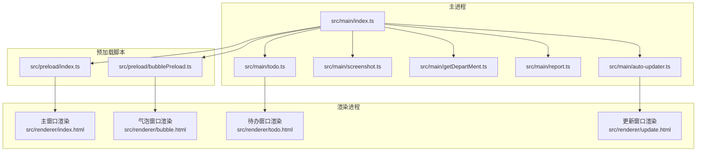
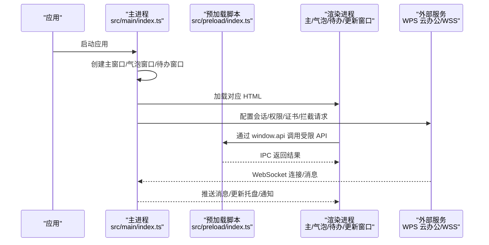
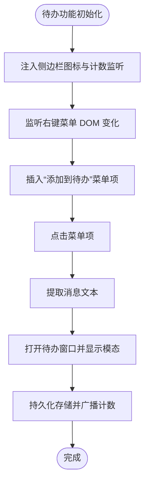
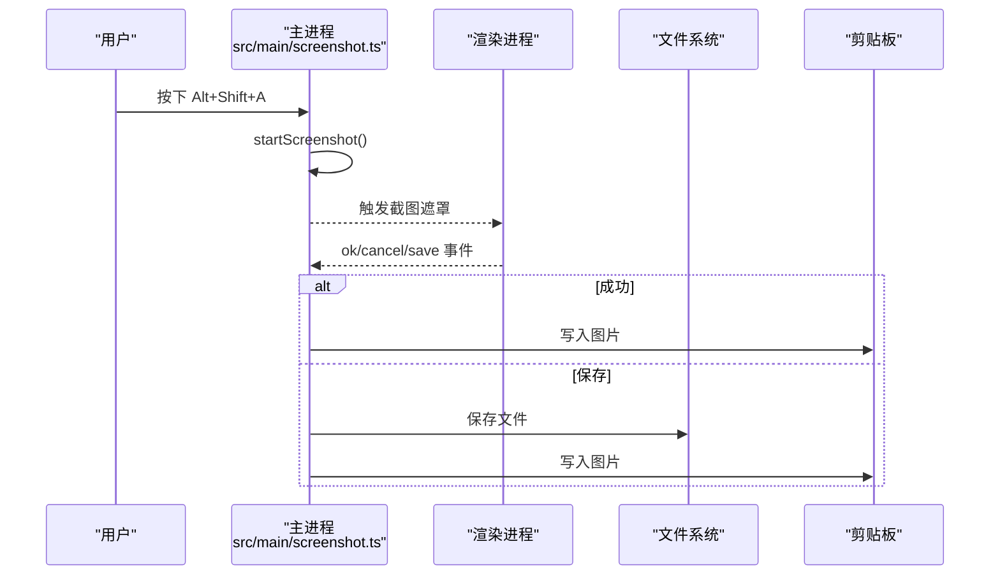
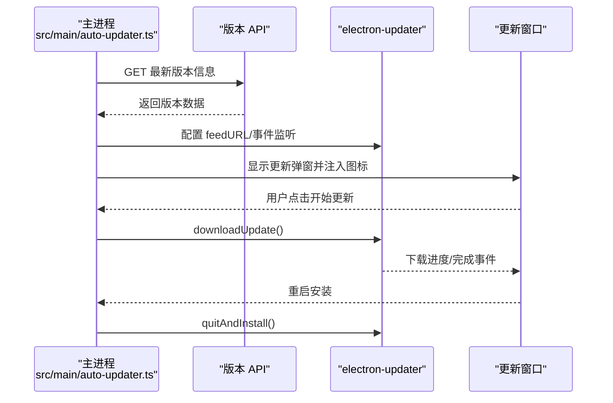
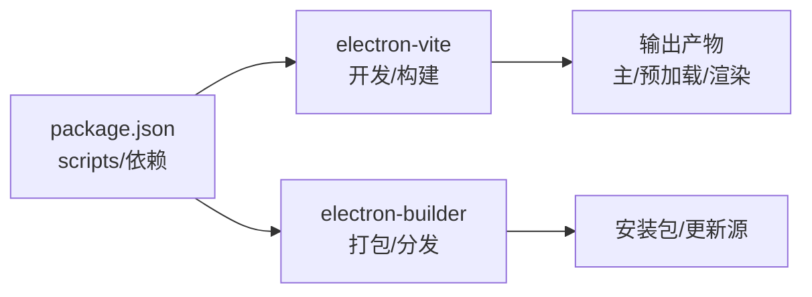

# 故障排除

<cite>
**本文引用的文件**
- [package.json](file://package.json)
- [ARCHITECTURE.md](file://ARCHITECTURE.md)
- [README.md](file://README.md)
- [electron.vite.config.ts](file://electron.vite.config.ts)
- [src/main/index.ts](file://src/main/index.ts)
- [src/main/todo.ts](file://src/main/todo.ts)
- [src/main/screenshot.ts](file://src/main/screenshot.ts)
- [src/main/getDepartMent.ts](file://src/main/getDepartMent.ts)
- [src/main/report.ts](file://src/main/report.ts)
- [src/main/auto-updater.ts](file://src/main/auto-updater.ts)
- [src/preload/index.ts](file://src/preload/index.ts)
- [src/preload/bubblePreload.ts](file://src/preload/bubblePreload.ts)
</cite>

## 目录
1. [简介](#简介)
2. [项目结构](#项目结构)
3. [核心组件](#核心组件)
4. [架构总览](#架构总览)
5. [详细组件分析](#详细组件分析)
6. [依赖分析](#依赖分析)
7. [性能考虑](#性能考虑)
8. [故障排除指南](#故障排除指南)
9. [结论](#结论)
10. [附录](#附录)

## 简介
本指南面向开发者与使用者，系统性梳理 WoaApp 在开发与使用过程中可能遇到的常见问题与解决方案，涵盖安装与构建、启动失败、功能异常、网络连接、权限与安全、兼容性、性能问题、日志分析与调试工具使用等。文档基于仓库现有实现与配置，提供可操作的排障步骤与优化建议。

## 项目结构
WoaApp 采用 Electron + Vue + TypeScript 的多进程架构：主进程负责窗口、会话、系统托盘、截图、待办、自动更新等；渲染进程承载主窗口、气泡窗口、待办窗口等 UI；预加载脚本作为安全桥接，向渲染进程暴露有限 API。

图表来源
- [src/main/index.ts](file://src/main/index.ts#L1-L2406)
- [src/main/todo.ts](file://src/main/todo.ts#L1-L266)
- [src/main/screenshot.ts](file://src/main/screenshot.ts#L1-L158)
- [src/main/getDepartMent.ts](file://src/main/getDepartMent.ts#L1-L50)
- [src/main/report.ts](file://src/main/report.ts#L1-L4)
- [src/main/auto-updater.ts](file://src/main/auto-updater.ts#L1-L565)
- [src/preload/index.ts](file://src/preload/index.ts#L1-L63)
- [src/preload/bubblePreload.ts](file://src/preload/bubblePreload.ts#L1-L70)

章节来源
- [ARCHITECTURE.md](file://ARCHITECTURE.md#L1-L492)
- [README.md](file://README.md#L1-L535)
- [electron.vite.config.ts](file://electron.vite.config.ts#L1-L60)

## 核心组件
- 主进程入口与窗口管理：负责创建主窗口、气泡窗口、待办窗口，会话持久化与权限放行，注入脚本与行为上报。
- 待办管理：提供 IPC 事件注册、数据持久化、与聊天页面的上下文菜单集成。
- 截图功能：全局快捷键触发、剪贴板写入、保存对话框与事件回调。
- 用户信息缓存：从聊天页面提取用户信息并缓存。
- 自动更新：版本检查、下载进度、注入更新图标、重启安装。
- 预加载脚本：在禁用上下文隔离场景下，向渲染进程暴露受限 API。

章节来源
- [src/main/index.ts](file://src/main/index.ts#L1-L2406)
- [src/main/todo.ts](file://src/main/todo.ts#L1-L266)
- [src/main/screenshot.ts](file://src/main/screenshot.ts#L1-L158)
- [src/main/getDepartMent.ts](file://src/main/getDepartMent.ts#L1-L50)
- [src/main/auto-updater.ts](file://src/main/auto-updater.ts#L1-L565)
- [src/preload/index.ts](file://src/preload/index.ts#L1-L63)
- [src/preload/bubblePreload.ts](file://src/preload/bubblePreload.ts#L1-L70)

## 架构总览

图表来源
- [src/main/index.ts](file://src/main/index.ts#L1-L2406)
- [src/preload/index.ts](file://src/preload/index.ts#L1-L63)
- [ARCHITECTURE.md](file://ARCHITECTURE.md#L317-L343)

## 详细组件分析

### 主进程与窗口管理
- 关键职责：单实例锁、窗口生命周期、会话持久化、权限与证书策略、导航与重定向放行、注入脚本、行为上报。
- 常见问题：窗口无法显示、登录失败、页面加载失败、托盘闪烁异常。
- 排障要点：
  - 检查会话持久化分区与 Cookie 是否正确保存。
  - 确认导航与重定向监听未误拦截主页面。
  - 观察 did-fail-load 与 will-navigate 日志。
  - 校验用户代理与 webRequest 放行策略。

章节来源
- [src/main/index.ts](file://src/main/index.ts#L92-L236)
- [src/main/index.ts](file://src/main/index.ts#L275-L615)
- [src/main/index.ts](file://src/main/index.ts#L617-L764)

### 待办事项管理
- 关键职责：IPC 事件注册、数据持久化、与聊天页面上下文菜单集成、未处理计数广播。
- 常见问题：待办图标不出现、右键菜单未显示“添加到待办”、数据不同步。
- 排障要点：
  - 确认注入脚本在 did-finish-load 后执行。
  - 检查 MutationObserver 是否监听到 .context-menu-wrapper。
  - 校验 IPC 事件名与参数传递一致。
  - 确认 electron-store 名称与默认值配置。

图表来源
- [src/main/todo.ts](file://src/main/todo.ts#L156-L264)

章节来源
- [src/main/todo.ts](file://src/main/todo.ts#L1-L266)

### 截图功能
- 关键职责：全局快捷键、截图遮罩、剪贴板写入、保存对话框、事件回调。
- 常见问题：快捷键无效、截图未复制到剪贴板、保存失败。
- 排障要点：
  - 确认 globalShortcut 注册与释放逻辑。
  - 检查 screenshotsInstance 生命周期与 endCapture 调用。
  - 校验权限与剪贴板写入时机。

图表来源
- [src/main/screenshot.ts](file://src/main/screenshot.ts#L16-L96)

章节来源
- [src/main/screenshot.ts](file://src/main/screenshot.ts#L1-L158)

### 用户信息缓存
- 关键职责：从聊天页面提取用户名与头像并缓存。
- 常见问题：缓存为空、DOM 选择器失效。
- 排障要点：
  - 确认页面已加载并存在 .user-name/.user-avatar。
  - 捕获并记录执行 JS 的异常。

章节来源
- [src/main/getDepartMent.ts](file://src/main/getDepartMent.ts#L1-L50)

### 自动更新
- 关键职责：版本检查、下载进度、注入更新图标、重启安装。
- 常见问题：检查失败、下载中断、更新图标不显示。
- 排障要点：
  - 校验 API 地址与协议（http/https）。
  - 检查下载 latest.yml 与 downloadUpdate 流程。
  - 开发模式下确认模拟进度是否触发更新窗口事件。

图表来源
- [src/main/auto-updater.ts](file://src/main/auto-updater.ts#L188-L252)
- [src/main/auto-updater.ts](file://src/main/auto-updater.ts#L435-L473)
- [src/main/auto-updater.ts](file://src/main/auto-updater.ts#L297-L353)

章节来源
- [src/main/auto-updater.ts](file://src/main/auto-updater.ts#L1-L565)

### 预加载脚本
- 关键职责：在禁用上下文隔离场景下，向渲染进程暴露受限 API；气泡窗口通过 window 对象通信。
- 常见问题：渲染进程无法调用 API、事件未触发。
- 排障要点：
  - 确认 preload 脚本路径与格式（CJS）。
  - 校验 webPreferences 中 preload 配置与 contextIsolation 设置。
  - 检查 window 对象暴露顺序与事件监听器注册。

章节来源
- [src/preload/index.ts](file://src/preload/index.ts#L1-L63)
- [src/preload/bubblePreload.ts](file://src/preload/bubblePreload.ts#L1-L70)
- [electron.vite.config.ts](file://electron.vite.config.ts#L16-L28)

## 依赖分析
- 构建与打包：Electron-vite 与 electron-builder 配合，分别负责开发服务器、打包与分发。
- 运行时依赖：electron-store、electron-updater、electron-screenshots、iconv-lite 等。
- 开发依赖：ESLint、Prettier、TypeScript、Vue 生态相关工具。

图表来源
- [package.json](file://package.json#L9-L24)
- [electron.vite.config.ts](file://electron.vite.config.ts#L1-L60)

章节来源
- [package.json](file://package.json#L1-L55)
- [electron.vite.config.ts](file://electron.vite.config.ts#L1-L60)

## 性能考虑
- 内存管理：及时清理定时器与事件监听器，控制消息缓存数量，合理管理窗口生命周期。
- 渲染性能：Vue 组件按需加载，气泡窗口使用 showInactive 避免抢焦点，背景节流禁用以保持响应。
- 网络与会话：webRequest/onBeforeRequest/onBeforeSendHeaders 放行策略应谨慎，避免过度拦截影响体验。

章节来源
- [ARCHITECTURE.md](file://ARCHITECTURE.md#L434-L449)
- [src/main/index.ts](file://src/main/index.ts#L304-L378)

## 故障排除指南

### 一、安装与构建问题
- 症状
  - 安装依赖失败、版本冲突、构建报错。
- 诊断
  - 检查 Node.js 与包管理器版本，核对 package.json 与 lock 文件。
  - 关注 electron-builder install-app-deps 脚本执行情况。
- 处理
  - 清理缓存后重装依赖，必要时更换 registry。
  - 确保 electron 与 electron-builder 版本兼容。
  - 如使用私有镜像，确认私有库可达与凭据正确。

章节来源
- [package.json](file://package.json#L9-L24)

### 二、启动失败
- 症状
  - 应用启动后黑屏、窗口不显示、登录页循环跳转。
- 诊断
  - 查看主窗口 did-finish-load/did-fail-load/will-navigate 日志。
  - 检查会话持久化与 Cookie 是否存在，权限与证书策略是否放行。
- 处理
  - 确认目标 URL 可达，必要时降级到备用 URL 或本地页面。
  - 修正 webRequest/onBeforeRequest/onBeforeSendHeaders 放行策略。
  - 若登录失败，引导用户在浏览器中完成登录后再重试。

章节来源
- [src/main/index.ts](file://src/main/index.ts#L402-L615)

### 三、功能异常
- 截图功能
  - 症状：快捷键无效、截图未复制、保存失败。
  - 处理：确认 globalShortcut 注册与释放、screenshotsInstance 生命周期、剪贴板写入时机。
- 待办功能
  - 症状：侧边栏图标不出现、右键菜单无“添加到待办”。
  - 处理：确认注入脚本执行时机、MutationObserver 监听、事件派发。
- 自动更新
  - 症状：检查失败、下载中断、更新图标不显示。
  - 处理：校验 API 协议与地址、下载 latest.yml 与 downloadUpdate 流程、开发模式模拟进度。

章节来源
- [src/main/screenshot.ts](file://src/main/screenshot.ts#L16-L96)
- [src/main/todo.ts](file://src/main/todo.ts#L156-L264)
- [src/main/auto-updater.ts](file://src/main/auto-updater.ts#L188-L252)

### 四、网络连接问题
- 症状
  - 页面无法加载、WebSocket 无法连接、证书错误。
- 诊断
  - 检查 setCertificateVerifyProc 与 webRequest 放行策略。
  - 观察 did-fail-load 与重定向日志。
- 处理
  - 生产环境启用证书校验，开发环境再酌情放宽。
  - 放宽 webRequest 限制时注意白名单与超时控制。

章节来源
- [src/main/index.ts](file://src/main/index.ts#L335-L378)

### 五、权限与安全问题
- 症状
  - 渲染进程访问受限、上下文隔离导致 API 不可用。
- 诊断
  - 检查 webPreferences 中 contextIsolation/nodeIntegration/webSecurity/sandbox 设置。
  - 确认预加载脚本暴露 API 的方式与时机。
- 处理
  - 生产环境建议启用 contextIsolation 并通过 preload 安全暴露 API。
  - 严格控制权限请求与证书策略。

章节来源
- [ARCHITECTURE.md](file://ARCHITECTURE.md#L402-L432)
- [src/preload/index.ts](file://src/preload/index.ts#L45-L62)

### 六、兼容性问题
- 症状
  - 不同操作系统窗口行为差异、快捷键冲突。
- 诊断
  - 检查全局快捷键注册与注销逻辑，确认平台差异。
  - 校验窗口置顶、透明、无边框等特性在各平台的支持度。
- 处理
  - 为不同平台提供差异化配置与回退策略。

章节来源
- [src/main/screenshot.ts](file://src/main/screenshot.ts#L16-L96)
- [src/main/index.ts](file://src/main/index.ts#L617-L764)

### 七、性能问题排查与优化
- 症状
  - 启动慢、内存占用高、渲染卡顿。
- 诊断
  - 关注窗口创建、脚本注入、消息缓存与事件监听器数量。
- 处理
  - 启用按需加载与懒执行，禁用后台节流以提升响应。
  - 定期清理定时器与事件监听器，控制缓存规模。

章节来源
- [ARCHITECTURE.md](file://ARCHITECTURE.md#L434-L449)
- [src/main/index.ts](file://src/main/index.ts#L434-L450)

### 八、日志分析与调试工具
- 日志位置
  - 主进程控制台日志（console.log/error），渲染进程控制台（F12）。
- 调试要点
  - 主窗口与气泡窗口均可打开开发者工具（开发模式）。
  - 预加载脚本通过 window 对象暴露 API，便于断点调试。
- 建议
  - 在开发模式下保留必要的日志输出，生产模式减少敏感信息泄露风险。

章节来源
- [src/main/index.ts](file://src/main/index.ts#L170-L172)
- [src/preload/index.ts](file://src/preload/index.ts#L45-L62)
- [src/preload/bubblePreload.ts](file://src/preload/bubblePreload.ts#L67-L70)

### 九、开发环境故障排除步骤
- 步骤
  - 清理构建缓存并重新安装依赖。
  - 使用 dev 模式启动，观察 Vite 开发服务器与窗口加载日志。
  - 校验预加载脚本路径与格式，确保 CJS 输出。
  - 验证 IPC 事件名与参数一致性。
- 工具
  - Electron DevTools、Vue DevTools、系统网络抓包工具。

章节来源
- [package.json](file://package.json#L9-L24)
- [electron.vite.config.ts](file://electron.vite.config.ts#L37-L57)

## 结论
本指南围绕 WoaApp 的多进程架构与关键模块，提供了从安装构建到启动、功能、网络、权限、兼容性与性能的系统化排障路径。建议在开发阶段保留充分日志与调试工具支持，在生产阶段强化安全与证书校验，并持续优化网络与渲染性能。

## 附录
- 常用命令
  - 安装：npm install
  - 开发：npm run dev
  - 构建：npm run build
  - 打包：npm run build:win / build:mac / build:linux
- 关键配置
  - electron.vite.config.ts：主/预加载/渲染入口与端口
  - package.json：脚本与依赖

章节来源
- [package.json](file://package.json#L9-L24)
- [electron.vite.config.ts](file://electron.vite.config.ts#L1-L60)