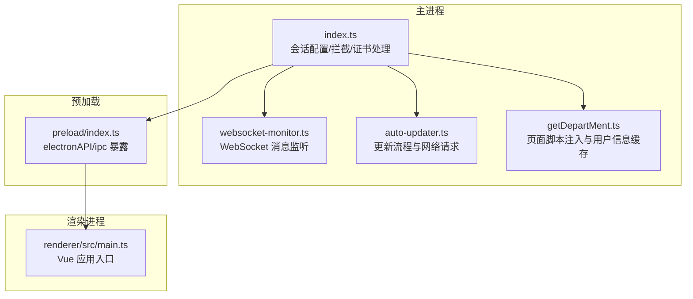
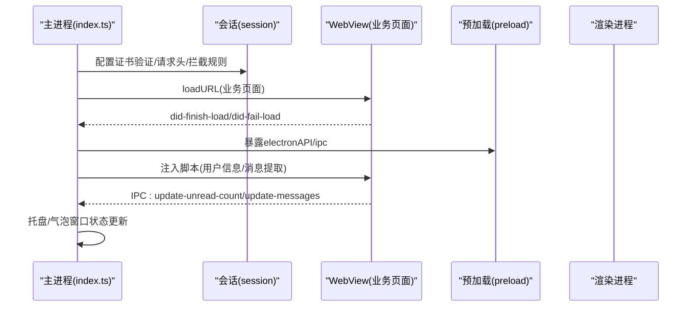
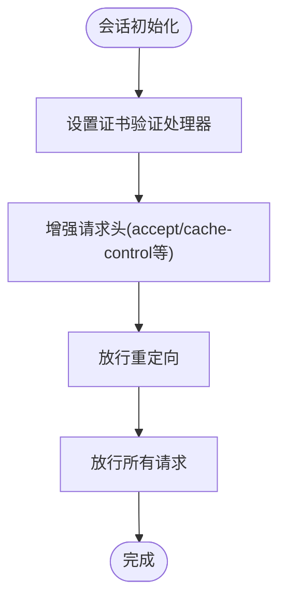
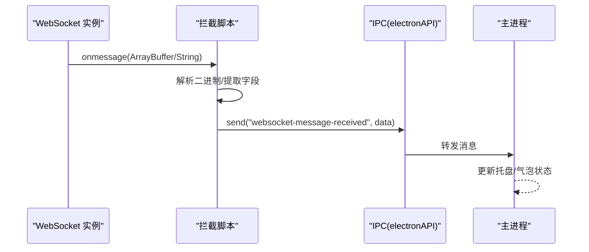
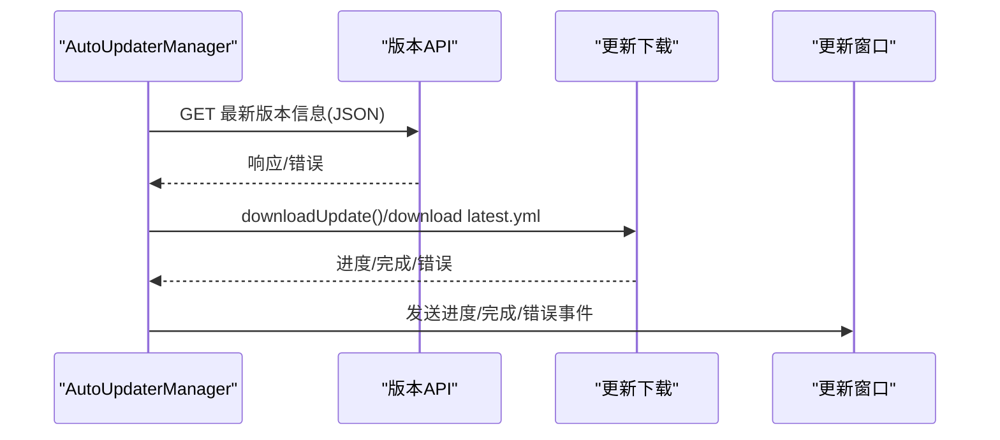
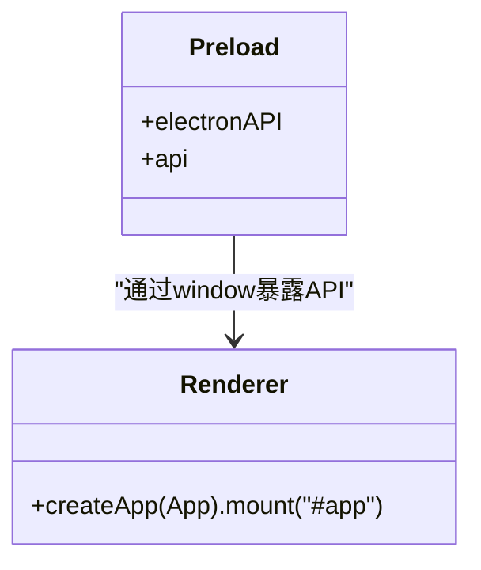
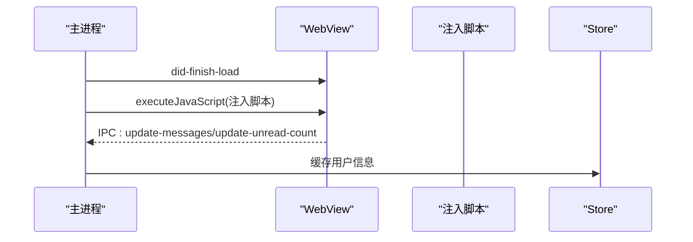
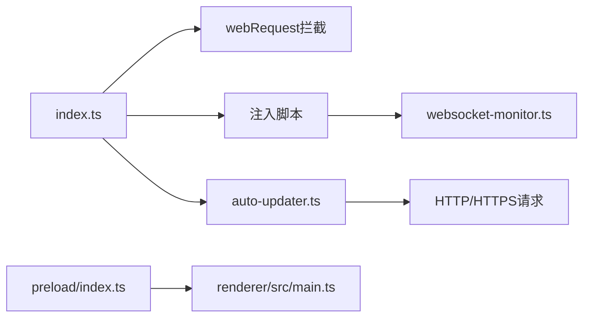

# 网络连接问题

<cite>
**本文引用的文件**
- [src/main/websocket-monitor.ts](file://src/main/websocket-monitor.ts)
- [src/main/index.ts](file://src/main/index.ts)
- [src/preload/index.ts](file://src/preload/index.ts)
- [src/main/getDepartMent.ts](file://src/main/getDepartMent.ts)
- [src/main/auto-updater.ts](file://src/main/auto-updater.ts)
- [src/renderer/src/main.ts](file://src/renderer/src/main.ts)
- [temp_eSearch/src/renderer/browser_bg/browser_bg.ts](file://temp_eSearch/src/renderer/browser_bg/browser_bg.ts)
</cite>

## 目录
1. [简介](#简介)
2. [项目结构](#项目结构)
3. [核心组件](#核心组件)
4. [架构总览](#架构总览)
5. [详细组件分析](#详细组件分析)
6. [依赖关系分析](#依赖关系分析)
7. [性能考量](#性能考量)
8. [故障排查指南](#故障排查指南)
9. [结论](#结论)
10. [附录](#附录)

## 简介
本指南聚焦于该 Electron 应用在复杂网络环境下的连接问题排查与治理，覆盖 WebSocket 连接失败、HTTP 请求超时、代理配置错误、跨域与证书验证、防火墙阻断、以及不同网络环境（内网、VPN、企业代理）下的配置调整建议。文档同时提供网络监控与诊断工具的使用方法，包括 Chrome DevTools 网络面板的分析技巧，并给出网络连接状态的实时监控与故障恢复机制。

## 项目结构
该项目采用 Electron 主进程 + 渲染进程 + 预加载桥接的分层架构，结合 WebView 内嵌业务页面，通过主进程的 session.webRequest 拦截与证书处理，以及预加载桥接暴露安全可控的 IPC 接口，形成端到端的网络可观测与可治理能力。

图表来源
- [src/main/index.ts](file://src/main/index.ts#L276-L420)
- [src/main/websocket-monitor.ts](file://src/main/websocket-monitor.ts#L4-L241)
- [src/main/auto-updater.ts](file://src/main/auto-updater.ts#L40-L186)
- [src/main/getDepartMent.ts](file://src/main/getDepartMent.ts#L6-L49)
- [src/preload/index.ts](file://src/preload/index.ts#L4-L62)
- [src/renderer/src/main.ts](file://src/renderer/src/main.ts#L1-L7)

章节来源
- [src/main/index.ts](file://src/main/index.ts#L276-L420)
- [src/preload/index.ts](file://src/preload/index.ts#L4-L62)
- [src/renderer/src/main.ts](file://src/renderer/src/main.ts#L1-L7)

## 核心组件
- 主进程网络会话与拦截
  - 会话级证书验证处理、请求头增强、请求放行与重定向放行，便于在复杂网络环境下稳定建立连接。
- WebSocket 监听与解析
  - 在渲染侧注入 WebSocket 拦截脚本，解析二进制消息并提取关键字段，通过 IPC 回传主进程，支撑消息监控与告警。
- 自动更新网络流程
  - 使用原生 http/https 模块拉取版本信息与描述文件，统一处理下载进度与错误事件，便于定位网络异常。
- 预加载桥接
  - 通过 contextBridge 暴露有限的 IPC 能力，保证渲染侧与主进程通信的安全边界。
- 页面脚本注入
  - 在业务页面加载完成后注入脚本，执行 DOM 观察与消息提取，降低跨域与 CSP 限制带来的影响。

章节来源
- [src/main/index.ts](file://src/main/index.ts#L335-L364)
- [src/main/websocket-monitor.ts](file://src/main/websocket-monitor.ts#L4-L241)
- [src/main/auto-updater.ts](file://src/main/auto-updater.ts#L224-L252)
- [src/preload/index.ts](file://src/preload/index.ts#L4-L62)
- [src/main/getDepartMent.ts](file://src/main/getDepartMent.ts#L6-L49)

## 架构总览
下图展示主进程如何通过会话拦截、证书处理与 WebView 加载策略，配合预加载桥接与注入脚本，实现对网络连接的全面监控与治理。

图表来源
- [src/main/index.ts](file://src/main/index.ts#L402-L530)
- [src/main/index.ts](file://src/main/index.ts#L1419-L1721)
- [src/preload/index.ts](file://src/preload/index.ts#L4-L62)

章节来源
- [src/main/index.ts](file://src/main/index.ts#L402-L530)
- [src/main/index.ts](file://src/main/index.ts#L1419-L1721)
- [src/preload/index.ts](file://src/preload/index.ts#L4-L62)

## 详细组件分析

### 组件A：主进程网络会话与拦截
- 证书验证处理：统一接受所有证书，降低自签名或企业 CA 导致的握手失败风险。
- 请求拦截：在 beforeRequest/onBeforeSendHeaders/onBeforeRedirect 等阶段放行请求，避免中间件误拦截。
- 权限与安全策略：禁用 webSecurity、允许不安全内容，便于调试；生产环境建议按需收紧。
- 用户代理与持久化：设置 UA 与持久化会话，提升兼容性与登录稳定性。

图表来源
- [src/main/index.ts](file://src/main/index.ts#L335-L364)

章节来源
- [src/main/index.ts](file://src/main/index.ts#L335-L364)

### 组件B：WebSocket 监听与解析
- 注入拦截：在渲染侧替换 WebSocket 构造函数，捕获 onmessage 事件。
- Protobuf 解析：对二进制消息进行基础解析，提取字符串字段，辅助定位消息体与发送者信息。
- IPC 回传：将解析后的消息通过 window.electronAPI.send 发送到主进程，供托盘/气泡窗口消费。

图表来源
- [src/main/websocket-monitor.ts](file://src/main/websocket-monitor.ts#L162-L210)
- [src/main/websocket-monitor.ts](file://src/main/websocket-monitor.ts#L104-L160)

章节来源
- [src/main/websocket-monitor.ts](file://src/main/websocket-monitor.ts#L4-L241)

### 组件C：自动更新网络流程
- 版本信息拉取：根据协议选择 http/https 模块，统一处理响应与错误。
- 下载进度与错误：通过 autoUpdater 事件推送进度与错误，便于前端弹窗与日志记录。
- 描述文件下载：单独下载 latest.yml，确保更新元数据完整。

图表来源
- [src/main/auto-updater.ts](file://src/main/auto-updater.ts#L188-L252)
- [src/main/auto-updater.ts](file://src/main/auto-updater.ts#L435-L473)
- [src/main/auto-updater.ts](file://src/main/auto-updater.ts#L517-L543)

章节来源
- [src/main/auto-updater.ts](file://src/main/auto-updater.ts#L188-L252)
- [src/main/auto-updater.ts](file://src/main/auto-updater.ts#L435-L473)
- [src/main/auto-updater.ts](file://src/main/auto-updater.ts#L517-L543)

### 组件D：预加载桥接与渲染进程
- 预加载桥接：通过 contextBridge 暴露有限的 IPC 能力，避免直接暴露全局对象。
- 渲染入口：Vue 应用挂载，承载 UI 与交互。

图表来源
- [src/preload/index.ts](file://src/preload/index.ts#L4-L62)
- [src/renderer/src/main.ts](file://src/renderer/src/main.ts#L1-L7)

章节来源
- [src/preload/index.ts](file://src/preload/index.ts#L4-L62)
- [src/renderer/src/main.ts](file://src/renderer/src/main.ts#L1-L7)

### 组件E：页面脚本注入与用户信息缓存
- 注入时机：在业务页面 did-finish-load 后注入脚本，执行 DOM 观察与消息提取。
- 用户信息缓存：从页面提取用户信息并缓存，减少重复请求。

图表来源
- [src/main/index.ts](file://src/main/index.ts#L1419-L1721)
- [src/main/getDepartMent.ts](file://src/main/getDepartMent.ts#L6-L49)

章节来源
- [src/main/index.ts](file://src/main/index.ts#L1419-L1721)
- [src/main/getDepartMent.ts](file://src/main/getDepartMent.ts#L6-L49)

## 依赖关系分析
- 主进程依赖 Electron Session 与 webRequest 拦截能力，统一处理证书、请求头与重定向。
- 渲染侧依赖预加载桥接，通过有限的 IPC 接口与主进程通信。
- 注入脚本依赖业务页面 DOM 结构，通过 MutationObserver 与滚动策略提取消息。
- 自动更新模块依赖原生 http/https 与 electron-updater，形成闭环的网络监控与恢复。

图表来源
- [src/main/index.ts](file://src/main/index.ts#L335-L364)
- [src/main/index.ts](file://src/main/index.ts#L1419-L1721)
- [src/main/auto-updater.ts](file://src/main/auto-updater.ts#L40-L186)
- [src/preload/index.ts](file://src/preload/index.ts#L4-L62)
- [src/renderer/src/main.ts](file://src/renderer/src/main.ts#L1-L7)
- [src/main/websocket-monitor.ts](file://src/main/websocket-monitor.ts#L4-L241)

章节来源
- [src/main/index.ts](file://src/main/index.ts#L335-L364)
- [src/main/index.ts](file://src/main/index.ts#L1419-L1721)
- [src/main/auto-updater.ts](file://src/main/auto-updater.ts#L40-L186)
- [src/preload/index.ts](file://src/preload/index.ts#L4-L62)
- [src/renderer/src/main.ts](file://src/renderer/src/main.ts#L1-L7)
- [src/main/websocket-monitor.ts](file://src/main/websocket-monitor.ts#L4-L241)

## 性能考量
- 会话级拦截与证书处理在主进程集中完成，避免在渲染侧重复处理，降低 CPU 与内存开销。
- 注入脚本采用 MutationObserver 与定时轮询相结合的方式，平衡实时性与性能。
- 自动更新下载采用分步进度推送，避免一次性大块数据传输导致的 UI 卡顿。

## 故障排查指南

### WebSocket 连接失败
- 现象
  - onmessage 无法触发或解析失败。
- 排查步骤
  - 检查主进程是否正确注入拦截脚本，确认 window.WebSocket 被替换。
  - 在渲染侧打开开发者工具，观察控制台日志，确认拦截与解析流程。
  - 若为二进制消息，确认 Protobuf 字段映射与长度编码是否匹配。
- 恢复建议
  - 在主进程开启更详细的日志，定位拦截点与解析异常。
  - 如确为协议变更，更新解析器字段映射。

章节来源
- [src/main/websocket-monitor.ts](file://src/main/websocket-monitor.ts#L162-L210)
- [src/main/websocket-monitor.ts](file://src/main/websocket-monitor.ts#L104-L160)

### HTTP 请求超时
- 现象
  - 自动更新或业务页面加载超时。
- 排查步骤
  - 检查主进程的证书验证与请求拦截是否过度放行。
  - 使用 Chrome DevTools 网络面板，确认请求头、缓存策略与重定向链路。
  - 对比本地与生产环境的 UA 与 Cookie 策略差异。
- 恢复建议
  - 在主进程适当放宽请求头与缓存策略，避免被代理或 WAF 拦截。
  - 针对特定域名配置白名单，减少不必要的拦截。

章节来源
- [src/main/index.ts](file://src/main/index.ts#L335-L364)
- [src/main/auto-updater.ts](file://src/main/auto-updater.ts#L224-L252)

### 代理配置错误
- 现象
  - 企业网络下无法访问业务页面或更新服务。
- 排查步骤
  - 确认系统代理设置与 Electron 的网络栈是否一致。
  - 在主进程检查 session.webRequest 拦截是否生效。
- 恢复建议
  - 在主进程显式配置代理（如需要），或通过系统代理统一出口。
  - 对关键域名设置直连，避免代理链路异常。

章节来源
- [src/main/index.ts](file://src/main/index.ts#L335-L364)

### 跨域与证书验证
- 现象
  - 页面出现跨域错误或证书校验失败。
- 排查步骤
  - 检查主进程 setCertificateVerifyProc 是否接受所有证书。
  - 在 Chrome DevTools 网络面板查看证书链与错误详情。
- 恢复建议
  - 生产环境建议仅接受可信 CA，调试环境可临时放宽。
  - 对于自签名证书，提前导入或在系统信任库中配置。

章节来源
- [src/main/index.ts](file://src/main/index.ts#L335-L338)

### 防火墙阻断
- 现象
  - 业务页面或更新服务被阻断。
- 排查步骤
  - 使用网络抓包工具（如 Wireshark/Fiddler）确认阻断点。
  - 检查主进程拦截规则是否误伤合法流量。
- 恢复建议
  - 针对关键域名与端口开放白名单。
  - 在主进程保留必要放行规则，避免误拦截。

章节来源
- [src/main/index.ts](file://src/main/index.ts#L353-L364)

### 不同网络环境下的配置调整
- 内网
  - 放宽证书与拦截策略，确保业务页面与更新服务可达。
- VPN
  - 校验代理链路与证书链一致性，必要时在主进程配置代理。
- 企业代理
  - 配置企业代理认证与凭据，确保请求头与重定向正常。

章节来源
- [src/main/index.ts](file://src/main/index.ts#L335-L364)

### 网络监控与诊断工具使用
- Chrome DevTools 网络面板
  - 观察请求链路、重定向、缓存与证书状态。
  - 对比“Preserve log”与“Disable cache”对问题复现的影响。
- 主进程日志
  - 在主进程开启详细日志，定位拦截与证书处理异常。
- 注入脚本日志
  - 在渲染侧打开开发者工具，查看拦截与解析日志。

章节来源
- [src/main/index.ts](file://src/main/index.ts#L434-L450)
- [src/main/websocket-monitor.ts](file://src/main/websocket-monitor.ts#L162-L210)

### 网络连接状态的实时监控与故障恢复
- 实时监控
  - 通过主进程的 did-fail-load 与 webRequest 事件，记录失败原因与 URL。
  - 通过 IPC 将未读消息与消息列表推送到渲染侧，驱动 UI 展示。
- 故障恢复
  - 登录重定向失败时，提供备用页面与手动重载入口。
  - 渲染进程异常时，主进程 reload 气泡窗口并恢复位置。

章节来源
- [src/main/index.ts](file://src/main/index.ts#L434-L450)
- [src/main/index.ts](file://src/main/index.ts#L739-L755)
- [src/main/index.ts](file://src/main/index.ts#L1896-L1931)

## 结论
本项目通过主进程会话拦截与证书处理、渲染侧注入脚本与预加载桥接，构建了覆盖 WebSocket、HTTP、证书与代理的全链路网络可观测体系。结合 Chrome DevTools 与主进程日志，可在复杂网络环境下快速定位问题并实施恢复措施。建议在生产环境逐步收紧安全策略，同时保留必要的可观测与恢复路径。

## 附录
- 页面无网络连接提示页
  - 当 navigator.onLine 为 false 时，展示“无网络连接”提示页，便于用户理解当前状态。

章节来源
- [temp_eSearch/src/renderer/browser_bg/browser_bg.ts](file://temp_eSearch/src/renderer/browser_bg/browser_bg.ts#L23-L48)