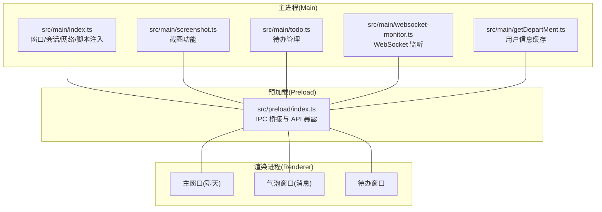
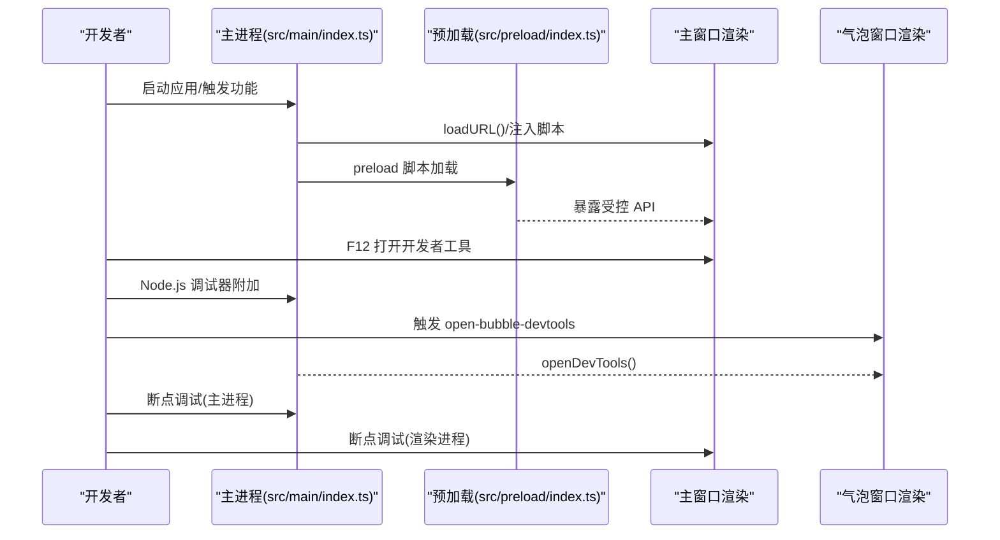
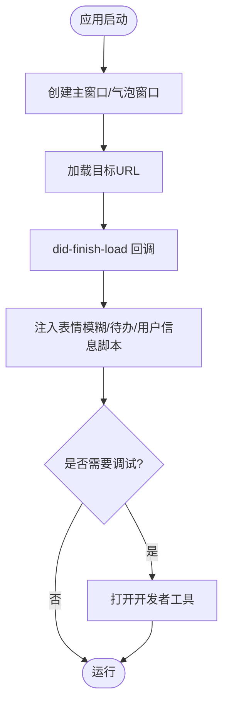
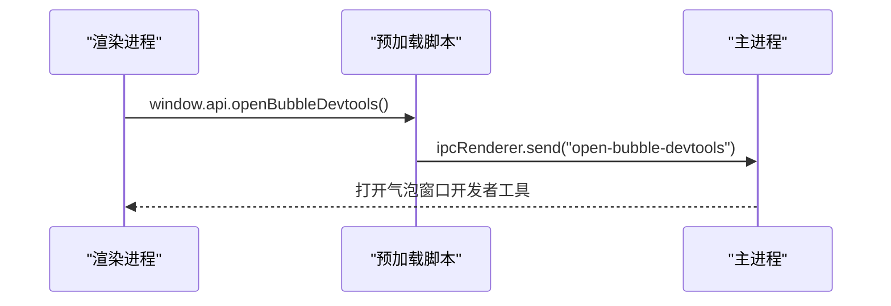
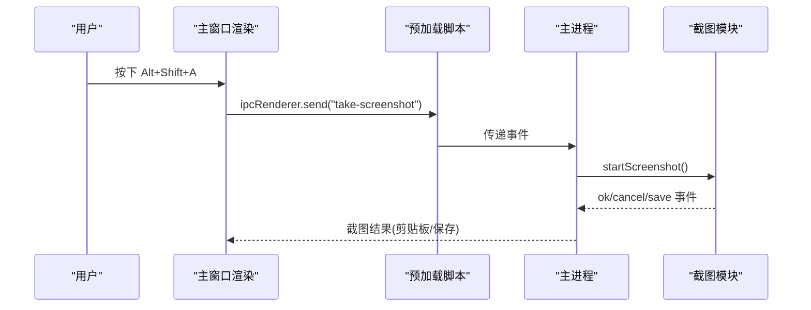
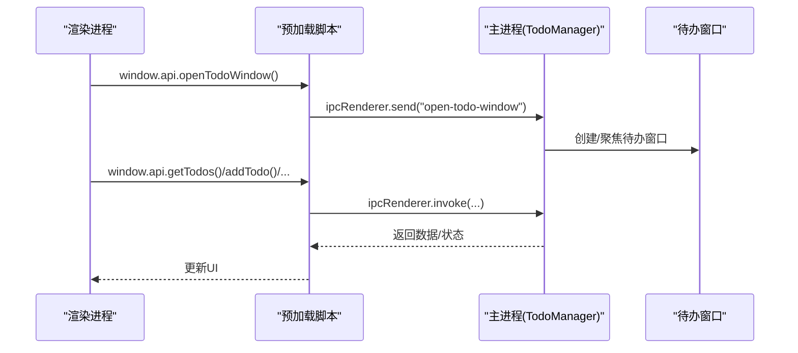
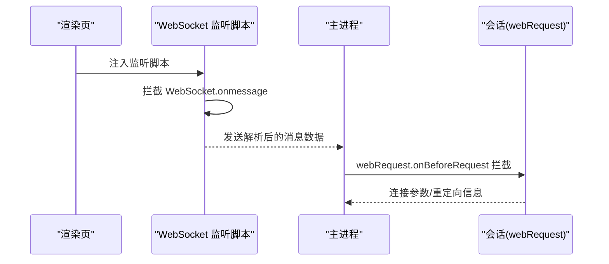
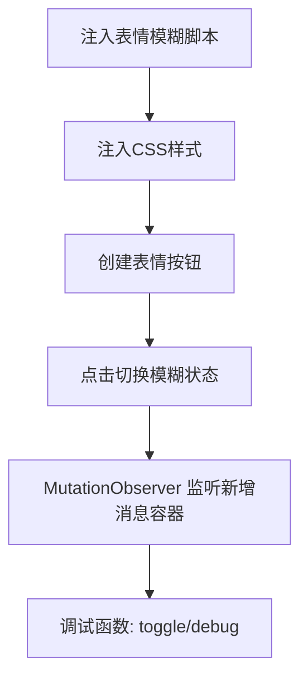
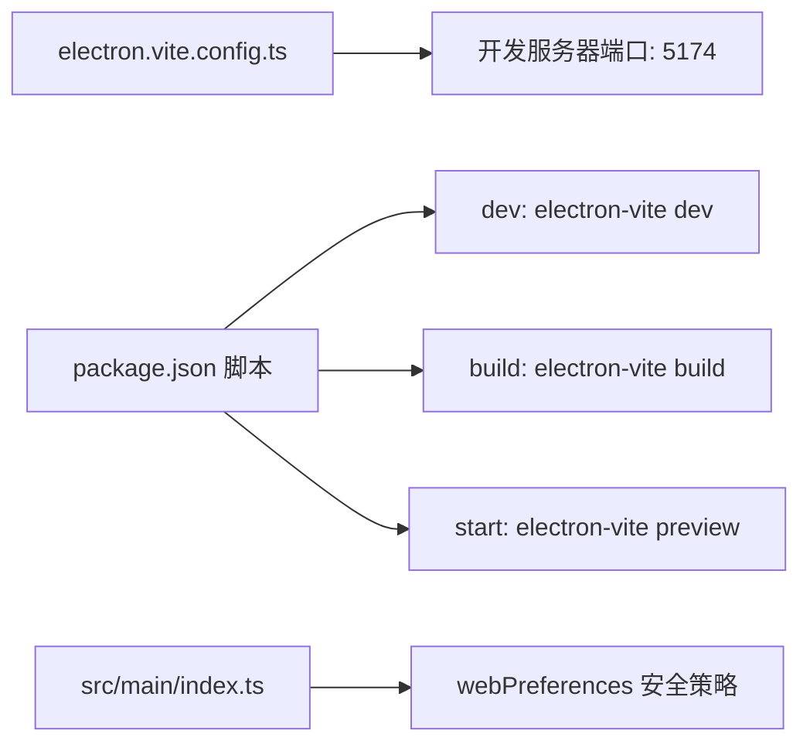

# 调试工具使用

<cite>
**本文引用的文件**   
- [package.json](file://package.json)
- [electron.vite.config.ts](file://electron.vite.config.ts)
- [ARCHITECTURE.md](file://ARCHITECTURE.md)
- [README.md](file://README.md)
- [src/main/index.ts](file://src/main/index.ts)
- [src/preload/index.ts](file://src/preload/index.ts)
- [src/main/screenshot.ts](file://src/main/screenshot.ts)
- [src/main/todot.ts](file://src/main/todo.ts)
- [src/main/websocket-monitor.ts](file://src/main/websocket-monitor.ts)
- [src/main/emotion-blur-script.ts](file://src/main/emotion-blur-script.ts)
- [src/main/getDepartMent.ts](file://src/main/getDepartMent.ts)
- [EMOTION_BLUR_FEATURE.md](file://EMOTION_BLUR_FEATURE.md)
- [SCREENSHOT_GUIDE.md](file://SCREENSHOT_GUIDE.md)
</cite>

## 目录
1. [简介](#简介)
2. [项目结构](#项目结构)
3. [核心组件](#核心组件)
4. [架构总览](#架构总览)
5. [详细组件分析](#详细组件分析)
6. [依赖关系分析](#依赖关系分析)
7. [性能考量](#性能考量)
8. [故障排查指南](#故障排查指南)
9. [结论](#结论)
10. [附录](#附录)

## 简介
本指南面向 Electron 开发者，围绕 WoaApp 的实际代码与配置，系统讲解如何高效使用调试工具（Electron 开发者工具、Chrome DevTools、Node.js 调试器）、日志记录最佳实践与日志级别配置、远程调试与断点调试、性能分析、开发与生产环境差异策略，以及调试信息的安全处理方法。文档同时提供常见调试场景的操作步骤与工具组合建议，帮助快速定位与解决问题。

## 项目结构
WoaApp 采用 Electron 多进程架构：主进程负责窗口管理、系统托盘、会话与网络策略、截图与待办等系统级能力；渲染进程承载 Vue 应用与多窗口界面；预加载脚本作为安全桥接，暴露受限 API 给渲染进程。

图表来源
- [ARCHITECTURE.md](file://ARCHITECTURE.md#L16-L42)
- [src/main/index.ts](file://src/main/index.ts#L1-L120)
- [src/preload/index.ts](file://src/preload/index.ts#L1-L63)

章节来源
- [ARCHITECTURE.md](file://ARCHITECTURE.md#L16-L42)
- [README.md](file://README.md#L16-L42)

## 核心组件
- 主进程入口与窗口管理：负责创建主窗口、气泡窗口、托盘、会话配置、网络拦截与证书处理、脚本注入与行为上报。
- 预加载脚本：通过 contextBridge 暴露受控 API，封装 ipcRenderer 并提供截图、待办、表情模糊等能力。
- 截图模块：注册全局快捷键、注入页面按钮、处理截图完成/取消/保存事件。
- 待办模块：管理待办窗口、数据持久化、IPC 事件处理与脚本注入。
- WebSocket 监听：在渲染页注入脚本，拦截 WebSocket 消息并解析 Protobuf，转发到主进程。
- 表情模糊脚本：在第三方聊天页面注入按钮与样式，动态切换模糊状态并监听新增消息容器。
- 用户信息缓存：从页面提取用户信息并缓存到本地存储。

章节来源
- [src/main/index.ts](file://src/main/index.ts#L276-L429)
- [src/preload/index.ts](file://src/preload/index.ts#L16-L43)
- [src/main/screenshot.ts](file://src/main/screenshot.ts#L16-L78)
- [src/main/todo.ts](file://src/main/todo.ts#L20-L136)
- [src/main/websocket-monitor.ts](file://src/main/websocket-monitor.ts#L4-L242)
- [src/main/emotion-blur-script.ts](file://src/main/emotion-blur-script.ts#L6-L282)
- [src/main/getDepartMent.ts](file://src/main/getDepartMent.ts#L6-L49)

## 架构总览
下图展示主进程与渲染进程、预加载之间的交互路径，以及关键调试点（开发者工具、日志、断点）。

图表来源
- [src/main/index.ts](file://src/main/index.ts#L169-L173)
- [src/preload/index.ts](file://src/preload/index.ts#L18-L21)
- [src/main/index.ts](file://src/main/index.ts#L724-L726)

章节来源
- [src/main/index.ts](file://src/main/index.ts#L169-L173)
- [src/preload/index.ts](file://src/preload/index.ts#L18-L21)
- [src/main/index.ts](file://src/main/index.ts#L724-L726)

## 详细组件分析

### 主进程与窗口管理调试
- 开发者工具：主窗口与气泡窗口均支持打开开发者工具，便于调试页面脚本与网络请求。
- 网络与会话：主进程配置了持久化会话、权限请求处理、证书验证与 webRequest 拦截，适合调试网络问题与重定向。
- 导航与脚本注入：在页面加载完成后注入表情模糊脚本、待办脚本与用户信息提取逻辑，便于定位注入时机与异常。

图表来源
- [src/main/index.ts](file://src/main/index.ts#L141-L187)
- [src/main/index.ts](file://src/main/index.ts#L156-L167)
- [src/main/index.ts](file://src/main/index.ts#L453-L529)

章节来源
- [src/main/index.ts](file://src/main/index.ts#L141-L187)
- [src/main/index.ts](file://src/main/index.ts#L156-L167)
- [src/main/index.ts](file://src/main/index.ts#L453-L529)

### 预加载脚本与 IPC 调试
- 预加载脚本通过 contextBridge 暴露 API，渲染进程只能通过 ipcRenderer 与主进程通信，便于定位 IPC 事件与数据流。
- 提供打开气泡窗口开发者工具的 IPC 通道，便于单独调试气泡窗口。

图表来源
- [src/preload/index.ts](file://src/preload/index.ts#L18-L21)
- [src/main/index.ts](file://src/main/index.ts#L724-L726)

章节来源
- [src/preload/index.ts](file://src/preload/index.ts#L18-L21)
- [src/main/index.ts](file://src/main/index.ts#L724-L726)

### 截图功能调试
- 全局快捷键 Alt+Shift+A 触发截图，支持取消、保存与剪贴板复制。
- 预加载脚本暴露 takeScreenshot API，主进程注入页面截图按钮，便于验证 UI 与事件链路。
- 截图事件监听与错误处理日志可用于定位失败原因。

图表来源
- [src/main/screenshot.ts](file://src/main/screenshot.ts#L16-L78)
- [src/main/screenshot.ts](file://src/main/screenshot.ts#L156-L158)
- [src/preload/index.ts](file://src/preload/index.ts#L22-L23)

章节来源
- [src/main/screenshot.ts](file://src/main/screenshot.ts#L16-L78)
- [src/main/screenshot.ts](file://src/main/screenshot.ts#L156-L158)
- [src/preload/index.ts](file://src/preload/index.ts#L22-L23)
- [SCREENSHOT_GUIDE.md](file://SCREENSHOT_GUIDE.md#L1-L125)

### 待办功能调试
- 主进程 TodoManager 管理待办窗口、数据持久化与 IPC 事件，便于调试窗口生命周期、数据 CRUD 与脚本注入。
- 渲染页通过 window.api 与主进程交互，断点可设置在 IPC 处理与脚本注入回调处。

图表来源
- [src/main/todo.ts](file://src/main/todo.ts#L38-L72)
- [src/main/todo.ts](file://src/main/todo.ts#L77-L136)
- [src/preload/index.ts](file://src/preload/index.ts#L26-L33)

章节来源
- [src/main/todo.ts](file://src/main/todo.ts#L38-L72)
- [src/main/todo.ts](file://src/main/todo.ts#L77-L136)
- [src/preload/index.ts](file://src/preload/index.ts#L26-L33)

### WebSocket 监听调试
- 在渲染页注入 WebSocket 监听脚本，拦截消息并解析 Protobuf，便于调试实时通信与消息结构。
- 主进程通过 webRequest 拦截与会话配置，结合渲染页日志定位连接参数与消息转发。

图表来源
- [src/main/websocket-monitor.ts](file://src/main/websocket-monitor.ts#L163-L210)
- [src/main/index.ts](file://src/main/index.ts#L366-L394)

章节来源
- [src/main/websocket-monitor.ts](file://src/main/websocket-monitor.ts#L163-L210)
- [src/main/index.ts](file://src/main/index.ts#L366-L394)

### 表情模糊功能调试
- 通过 executeJavaScript 注入表情模糊脚本，提供按钮、样式与 MutationObserver 动态监听。
- 调试支持：控制台日志、全局函数 window.emotionBlurToggle 与 window.emotionBlurDebug。

图表来源
- [src/main/emotion-blur-script.ts](file://src/main/emotion-blur-script.ts#L242-L277)
- [EMOTION_BLUR_FEATURE.md](file://EMOTION_BLUR_FEATURE.md#L69-L90)

章节来源
- [src/main/emotion-blur-script.ts](file://src/main/emotion-blur-script.ts#L242-L277)
- [EMOTION_BLUR_FEATURE.md](file://EMOTION_BLUR_FEATURE.md#L69-L90)

## 依赖关系分析
- 构建与开发服务器：electron-vite 提供 Vite 开发服务器与打包配置，渲染进程端口为 5174。
- 脚本命令：dev/build/start 等脚本用于开发与构建，便于在不同阶段启用调试。
- 安全配置：webPreferences 中禁用了 contextIsolation、webSecurity、sandbox，提升了功能便利性但降低了安全性，生产环境应重新评估。

图表来源
- [electron.vite.config.ts](file://electron.vite.config.ts#L37-L47)
- [package.json](file://package.json#L9-L24)
- [src/main/index.ts](file://src/main/index.ts#L286-L301)

章节来源
- [electron.vite.config.ts](file://electron.vite.config.ts#L37-L47)
- [package.json](file://package.json#L9-L24)
- [src/main/index.ts](file://src/main/index.ts#L286-L301)

## 性能考量
- 背景节流禁用：为保证消息与通知及时响应，背景节流被禁用，注意避免不必要的 CPU 占用。
- Vue 组件按需加载与气泡窗口 showInactive 避免抢焦点，减少 UI 抖动。
- MutationObserver 与事件监听器需及时清理，避免内存泄漏。

章节来源
- [ARCHITECTURE.md](file://ARCHITECTURE.md#L444-L448)
- [src/main/index.ts](file://src/main/index.ts#L618-L764)

## 故障排查指南
- 开发者工具无法打开
  - 检查主进程与气泡窗口的 openDevTools 调用路径。
  - 确认预加载脚本中的 openBubbleDevtools IPC 是否正确转发。
- 网络请求被拦截或证书问题
  - 检查主进程的 webRequest 拦截与证书验证回调，确认拦截策略是否过于严格。
- 截图功能异常
  - 核对全局快捷键注册与页面按钮注入逻辑，查看截图事件回调与错误日志。
- 待办数据不一致
  - 检查 IPC 事件处理与 electron-store 的读写，确认窗口生命周期与广播更新。
- WebSocket 消息未解析
  - 在渲染页控制台查看注入脚本日志，确认 Protobuf 解析与消息转发链路。
- 表情模糊无效
  - 检查侧边栏容器是否存在、按钮是否插入成功、MutationObserver 是否监听到新增容器。

章节来源
- [src/main/index.ts](file://src/main/index.ts#L169-L173)
- [src/main/index.ts](file://src/main/index.ts#L724-L726)
- [src/main/screenshot.ts](file://src/main/screenshot.ts#L16-L78)
- [src/main/todo.ts](file://src/main/todo.ts#L77-L136)
- [src/main/websocket-monitor.ts](file://src/main/websocket-monitor.ts#L163-L210)
- [src/main/emotion-blur-script.ts](file://src/main/emotion-blur-script.ts#L212-L239)

## 结论
WoaApp 的调试体系围绕 Electron 多进程架构展开：主进程负责系统级能力与网络策略，预加载脚本提供安全的 IPC 桥接，渲染进程承载业务 UI。通过开发者工具、Node.js 调试器、断点与日志相结合，可高效定位网络、IPC、脚本注入与性能问题。生产环境应重新评估安全配置，确保 contextIsolation、webSecurity 与沙盒策略的启用。

## 附录

### 调试工具与环境配置
- Electron 开发者工具
  - 主窗口：在开发模式下可打开开发者工具，便于调试页面脚本与网络。
  - 气泡窗口：通过预加载脚本触发 open-bubble-devtools，单独调试悬浮窗口。
- Chrome DevTools
  - 渲染进程断点：在页面脚本中设置断点，配合控制台日志定位问题。
  - 网络面板：查看请求、重定向与证书验证情况。
- Node.js 调试器
  - 附加到主进程，设置断点于窗口创建、IPC 事件处理与脚本注入回调。
- 日志记录与级别
  - 使用 console.log/console.error/console.warn 输出调试信息，区分不同严重级别。
  - 在生产环境谨慎输出敏感信息，必要时脱敏或移除。
- 远程调试与断点
  - 使用 --remote-debugging-port 参数开启远程调试，结合断点定位复杂问题。
- 性能分析
  - 使用 Chrome Performance 面板采集渲染性能数据，结合内存快照定位泄漏。
- 开发与生产策略
  - 开发：启用 contextIsolation、webSecurity、沙盒；使用 electron-vite 热重载。
  - 生产：收紧 webPreferences，启用证书验证，最小化暴露 API。
- 安全处理
  - 避免在渲染进程直接启用 Node.js 集成，优先通过预加载脚本暴露必要 API。
  - 对外部服务请求进行白名单与校验，避免任意重定向与证书绕过。

章节来源
- [src/main/index.ts](file://src/main/index.ts#L169-L173)
- [src/main/index.ts](file://src/main/index.ts#L724-L726)
- [src/main/index.ts](file://src/main/index.ts#L286-L301)
- [ARCHITECTURE.md](file://ARCHITECTURE.md#L402-L432)