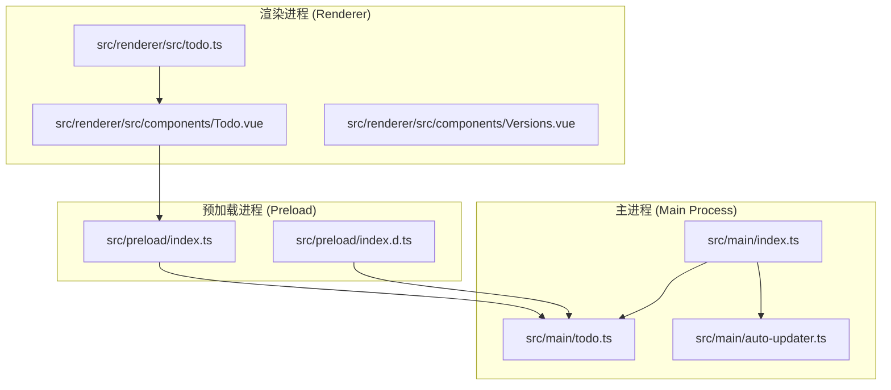
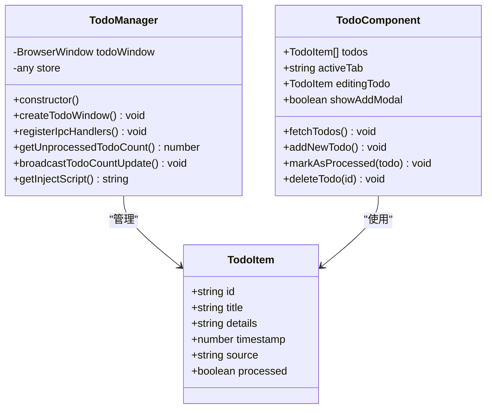
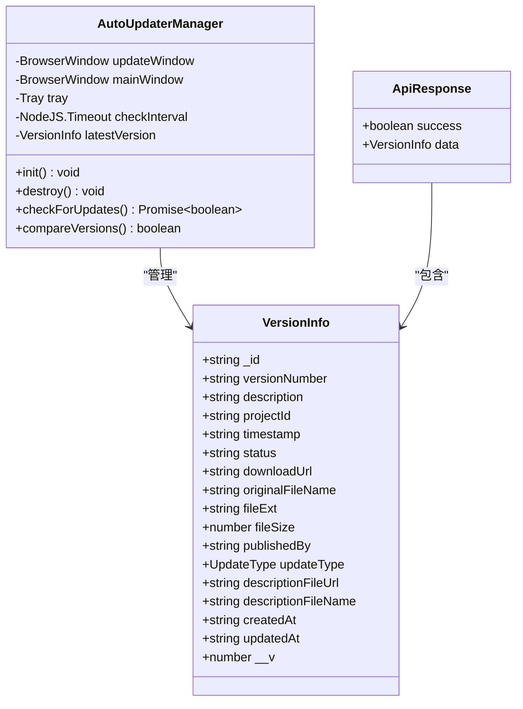
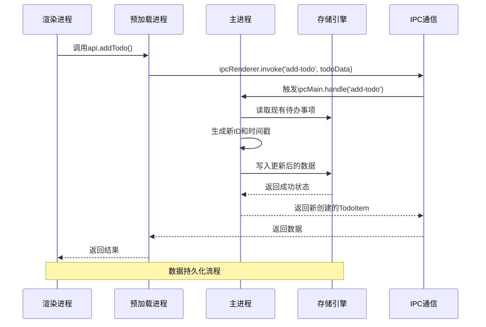
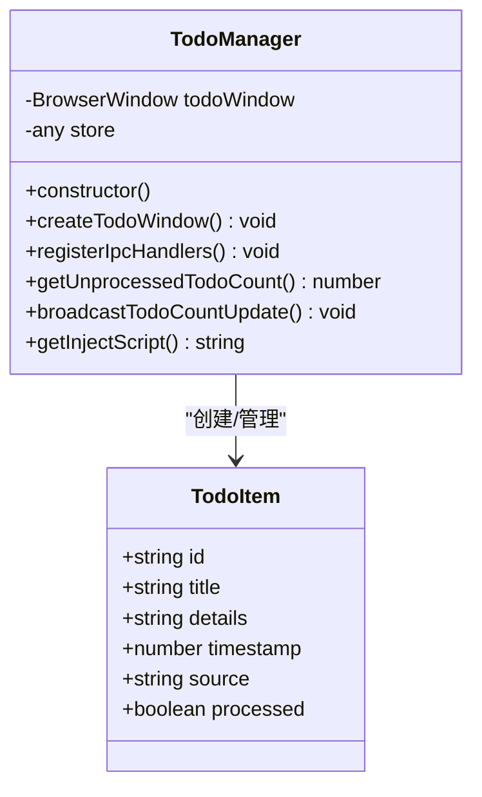
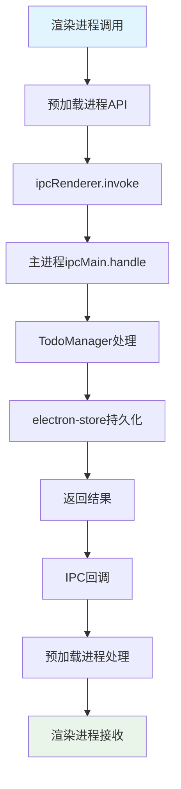
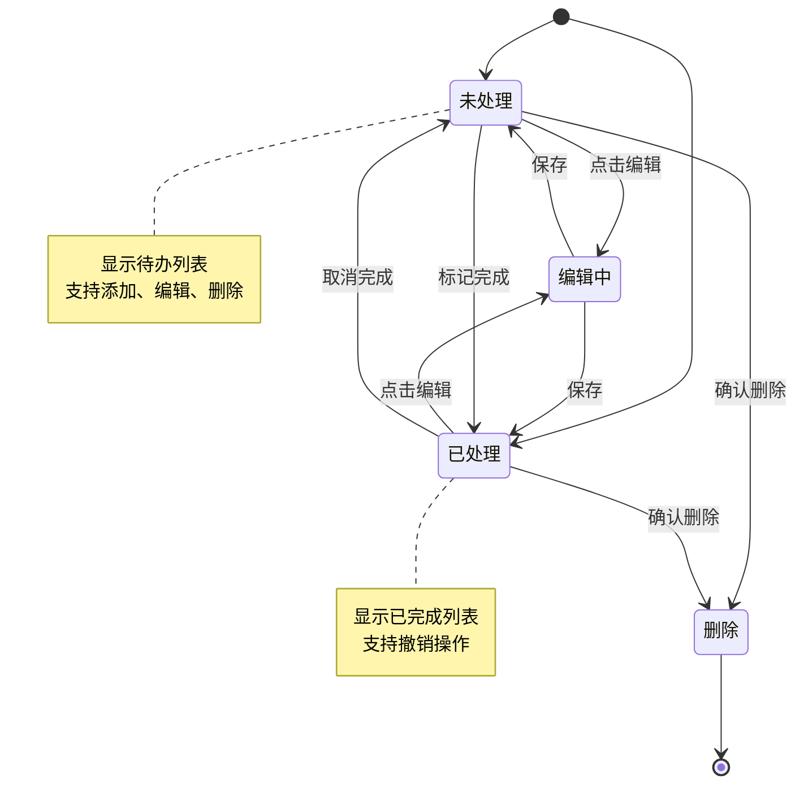
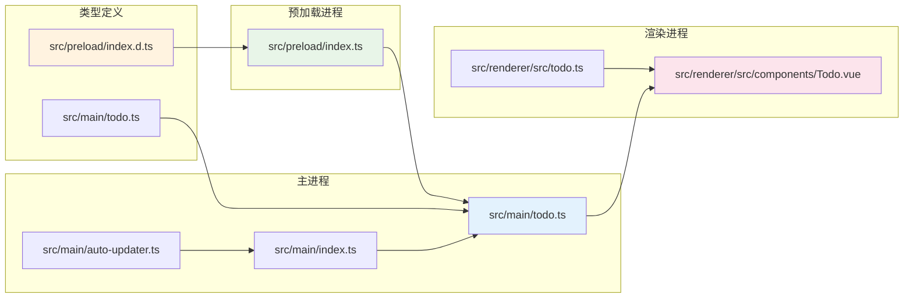

# 数据模型设计

<cite>
**本文档引用的文件**
- [src/main/todo.ts](file://src/main/todo.ts)
- [src/renderer/src/components/Todo.vue](file://src/renderer/src/components/Todo.vue)
- [src/preload/index.ts](file://src/preload/index.ts)
- [src/preload/index.d.ts](file://src/preload/index.d.ts)
- [src/renderer/src/todo.ts](file://src/renderer/src/todo.ts)
- [src/main/auto-updater.ts](file://src/main/auto-updater.ts)
- [src/main/index.ts](file://src/main/index.ts)
</cite>

## 目录
1. [简介](#简介)
2. [项目结构](#项目结构)
3. [核心数据模型](#核心数据模型)
4. [架构概览](#架构概览)
5. [详细组件分析](#详细组件分析)
6. [依赖关系分析](#依赖关系分析)
7. [性能考虑](#性能考虑)
8. [故障排除指南](#故障排除指南)
9. [结论](#结论)

## 简介

本文档深入分析了WoaApp项目中的数据模型设计，重点关注TodoItem接口和VersionInfo接口的设计理念、业务规则和约束条件。该系统采用Electron框架构建，实现了桌面应用程序中的待办事项管理和版本更新功能。

## 项目结构

该项目采用典型的Electron应用架构，分为三个主要部分：

**图表来源**
- [src/main/index.ts](file://src/main/index.ts#L24-L40)
- [src/main/todo.ts](file://src/main/todo.ts#L1-L50)
- [src/preload/index.ts](file://src/preload/index.ts#L1-L30)

**章节来源**
- [src/main/index.ts](file://src/main/index.ts#L24-L40)
- [src/main/todo.ts](file://src/main/todo.ts#L1-L50)
- [src/preload/index.ts](file://src/preload/index.ts#L1-L30)

## 核心数据模型

### TodoItem 接口设计

TodoItem是系统中最核心的数据模型，用于表示待办事项的所有相关信息。

**图表来源**
- [src/main/todo.ts](file://src/main/todo.ts#L7-L14)
- [src/renderer/src/components/Todo.vue](file://src/renderer/src/components/Todo.vue#L59-L66)

#### 字段详细说明

| 字段名 | 类型 | 必填 | 默认值 | 业务含义 | 约束条件 |
|--------|------|------|--------|----------|----------|
| id | string | 是 | 自动生成 | 待办事项唯一标识符 | 唯一性保证，格式: "todo-{timestamp}" |
| title | string | 是 | 空字符串 | 待办事项标题 | 非空验证，长度限制 |
| details | string | 否 | 空字符串 | 详细描述信息 | 最大长度限制 |
| timestamp | number | 是 | 当前时间戳 | 创建/修改时间戳 | Unix时间戳格式 |
| source | string | 否 | "手动新增" | 数据来源标识 | 枚举值: "手动新增", "聊天记录" |
| processed | boolean | 否 | false | 处理状态标志 | 布尔值，true表示已完成 |

#### 业务规则和约束条件

1. **唯一性保证**: id字段通过"todo-{Date.now()}"格式确保全局唯一性
2. **时间戳处理**: timestamp字段自动设置为添加时的毫秒级Unix时间戳
3. **状态管理**: processed字段控制待办事项的完成状态
4. **数据验证**: 
   - title字段必须非空
   - timestamp必须为有效的时间戳
   - source字段支持预定义枚举值

**章节来源**
- [src/main/todo.ts](file://src/main/todo.ts#L7-L14)
- [src/renderer/src/components/Todo.vue](file://src/renderer/src/components/Todo.vue#L73-L77)

### VersionInfo 接口设计

VersionInfo接口用于管理应用程序的版本信息和更新相关数据。

**图表来源**
- [src/main/auto-updater.ts](file://src/main/auto-updater.ts#L14-L32)

#### 字段详细说明

| 字段名 | 类型 | 必填 | 默认值 | 业务含义 | 约束条件 |
|--------|------|------|--------|----------|----------|
| _id | string | 是 | 自动生成 | 版本信息唯一标识符 | MongoDB ObjectId格式 |
| versionNumber | string | 是 | 空字符串 | 版本号 | 语义化版本格式 |
| description | string | 否 | 空字符串 | 版本更新说明 | Markdown格式支持 |
| projectId | string | 是 | 空字符串 | 关联项目标识 | 外键约束 |
| timestamp | string | 是 | 当前时间 | ISO 8601格式时间戳 | UTC时间 |
| status | string | 是 | "published" | 版本状态 | 枚举值: "published", "draft" |
| downloadUrl | string | 是 | 空字符串 | 下载链接 | HTTP/HTTPS URL格式 |
| originalFileName | string | 是 | 空字符串 | 原始文件名 | 文件名格式验证 |
| fileExt | string | 是 | ".exe" | 文件扩展名 | 支持".exe", ".msi" |
| fileSize | number | 是 | 0 | 文件大小(字节) | 正整数 |
| publishedBy | string | 是 | "Admin" | 发布者 | 用户名格式 |
| updateType | UpdateType | 是 | "active" | 更新类型 | 枚举: "force", "active", "passive" |
| descriptionFileUrl | string | 否 | 空字符串 | 描述文件URL | 有效URL格式 |
| descriptionFileName | string | 否 | 空字符串 | 描述文件名 | 文件名格式验证 |
| createdAt | string | 是 | 当前时间 | 创建时间 | ISO 8601格式 |
| updatedAt | string | 是 | 当前时间 | 更新时间 | ISO 8601格式 |
| __v | number | 是 | 0 | 版本控制字段 | 自增版本号 |

**章节来源**
- [src/main/auto-updater.ts](file://src/main/auto-updater.ts#L14-L32)

## 架构概览

系统采用分层架构设计，实现了清晰的职责分离和类型安全的数据流。

**图表来源**
- [src/preload/index.ts](file://src/preload/index.ts#L28-L33)
- [src/main/todo.ts](file://src/main/todo.ts#L87-L99)

**章节来源**
- [src/main/todo.ts](file://src/main/todo.ts#L77-L136)
- [src/preload/index.ts](file://src/preload/index.ts#L25-L43)

## 详细组件分析

### TodoManager 类分析

TodoManager是待办事项管理的核心类，负责协调整个待办事项功能。

**图表来源**
- [src/main/todo.ts](file://src/main/todo.ts#L20-L33)

#### 核心方法分析

1. **构造函数**: 初始化electron-store并注册IPC处理器
2. **createTodoWindow**: 创建独立的待办事项窗口
3. **registerIpcHandlers**: 注册所有IPC事件处理器
4. **getUnprocessedTodoCount**: 计算未处理待办事项数量
5. **broadcastTodoCountUpdate**: 向所有窗口广播数量更新

**章节来源**
- [src/main/todo.ts](file://src/main/todo.ts#L20-L154)

### IPC通信流程

系统通过IPC实现主进程和渲染进程之间的安全通信。

**图表来源**
- [src/preload/index.ts](file://src/preload/index.ts#L27-L33)
- [src/main/todo.ts](file://src/main/todo.ts#L82-L108)

**章节来源**
- [src/preload/index.ts](file://src/preload/index.ts#L17-L43)
- [src/main/todo.ts](file://src/main/todo.ts#L77-L136)

### Vue组件集成

Todo.vue组件提供了完整的用户界面和交互逻辑。

**图表来源**
- [src/renderer/src/components/Todo.vue](file://src/renderer/src/components/Todo.vue#L68-L85)

**章节来源**
- [src/renderer/src/components/Todo.vue](file://src/renderer/src/components/Todo.vue#L56-L150)

## 依赖关系分析

系统各组件之间的依赖关系清晰明确，遵循单一职责原则。

**图表来源**
- [src/preload/index.d.ts](file://src/preload/index.d.ts#L2-L2)
- [src/main/todo.ts](file://src/main/todo.ts#L1-L4)
- [src/preload/index.ts](file://src/preload/index.ts#L1-L3)

**章节来源**
- [src/preload/index.d.ts](file://src/preload/index.d.ts#L1-L22)
- [src/main/index.ts](file://src/main/index.ts#L24-L40)

## 性能考虑

### 数据存储优化

1. **内存管理**: 使用electron-store进行高效的数据持久化
2. **批量操作**: 支持批量添加和更新操作
3. **缓存策略**: 渲染进程维护本地状态缓存

### IPC通信优化

1. **异步处理**: 所有IPC调用都采用异步模式
2. **错误处理**: 完善的异常捕获和错误传播机制
3. **资源清理**: 及时释放窗口和定时器资源

## 故障排除指南

### 常见问题及解决方案

1. **数据不一致**: 检查IPC通信是否正常，确认数据序列化格式
2. **窗口显示问题**: 验证createTodoWindow方法的执行状态
3. **类型错误**: 确认TypeScript类型定义的正确性

**章节来源**
- [src/main/todo.ts](file://src/main/todo.ts#L38-L72)
- [src/preload/index.ts](file://src/preload/index.ts#L48-L62)

## 结论

该数据模型设计体现了良好的软件工程实践：

1. **类型安全**: 完整的TypeScript类型定义确保编译时类型检查
2. **职责分离**: 清晰的组件边界和单一职责原则
3. **扩展性**: 模块化的架构便于功能扩展和维护
4. **可靠性**: 完善的错误处理和数据验证机制

TodoItem和VersionInfo两个核心数据模型为系统的功能实现提供了坚实的基础，同时保持了良好的向后兼容性和扩展性。