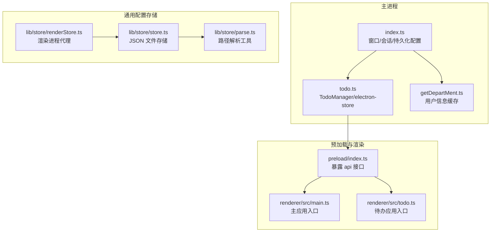
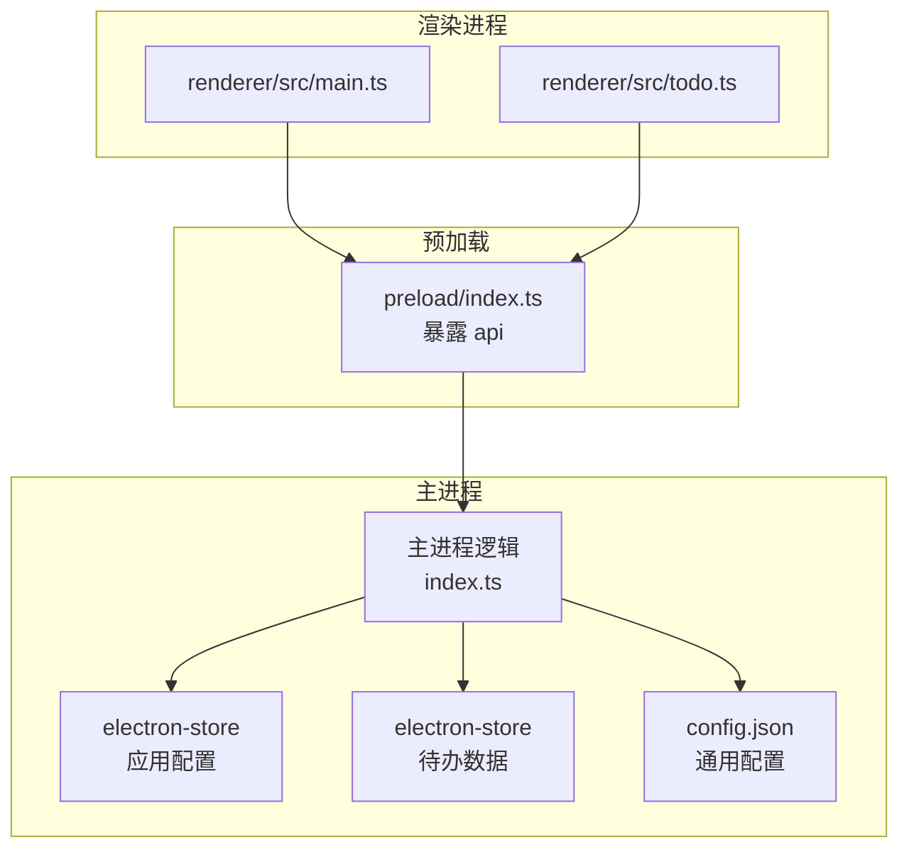
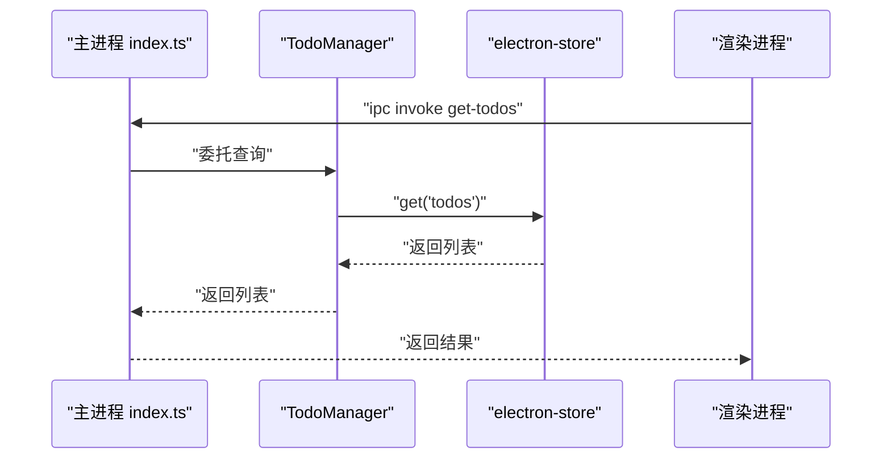
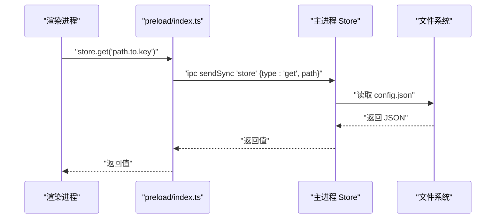
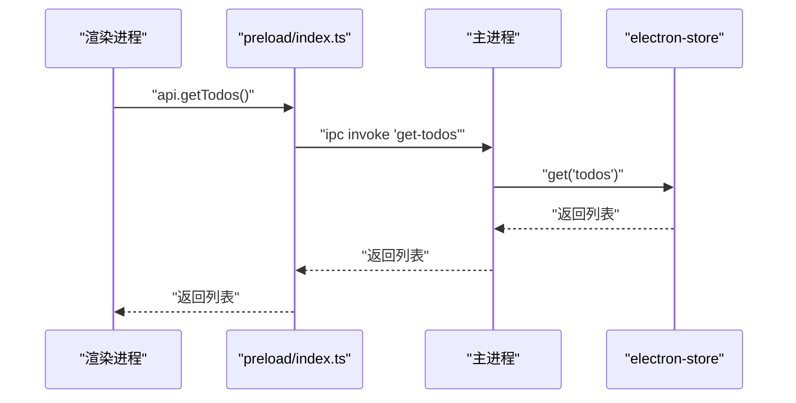
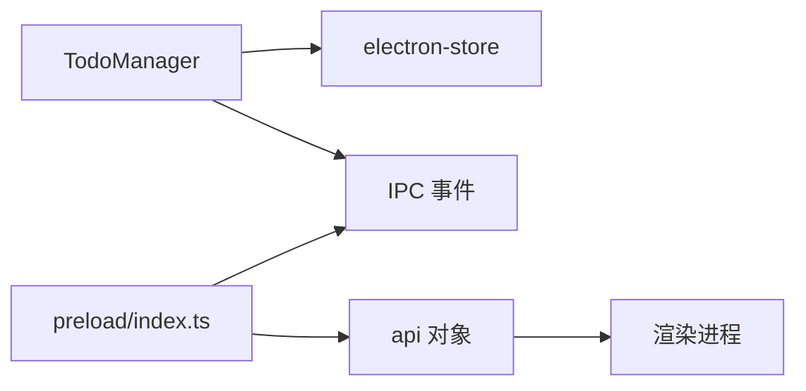

# 数据管理

<cite>
**本文引用的文件**
- [src/main/index.ts](file://src/main/index.ts)
- [src/main/todo.ts](file://src/main/todo.ts)
- [src/preload/index.ts](file://src/preload/index.ts)
- [src/renderer/src/todo.ts](file://src/renderer/src/todo.ts)
- [src/renderer/src/main.ts](file://src/renderer/src/main.ts)
- [src/main/getDepartMent.ts](file://src/main/getDepartMent.ts)
- [temp_eSearch/lib/store/store.ts](file://temp_eSearch/lib/store/store.ts)
- [temp_eSearch/lib/store/renderStore.ts](file://temp_eSearch/lib/store/renderStore.ts)
- [temp_eSearch/lib/store/parse.ts](file://temp_eSearch/lib/store/parse.ts)
- [ARCHITECTURE.md](file://ARCHITECTURE.md)
- [README.md](file://README.md)
</cite>

## 目录
1. [简介](#简介)
2. [项目结构](#项目结构)
3. [核心组件](#核心组件)
4. [架构总览](#架构总览)
5. [详细组件分析](#详细组件分析)
6. [依赖关系分析](#依赖关系分析)
7. [性能考量](#性能考量)
8. [故障排查指南](#故障排查指南)
9. [结论](#结论)
10. [附录](#附录)

## 简介
本文件系统性梳理本项目的“数据管理”能力，重点覆盖以下方面：
- electron-store 的使用与本地存储策略：包括数据持久化、配置管理、用户偏好设置等
- 数据模型设计：TodoItem、Message、VersionInfo 等核心数据结构
- 数据访问模式、缓存策略与性能优化方案
- 数据迁移、备份恢复与数据安全的考虑
- 跨进程数据共享与同步机制

## 项目结构
围绕数据管理的关键目录与文件如下：
- 主进程数据与窗口管理：src/main/index.ts、src/main/todo.ts、src/main/getDepartMent.ts
- 预加载与渲染进程接口：src/preload/index.ts、src/renderer/src/main.ts、src/renderer/src/todo.ts
- 通用配置存储：temp_eSearch/lib/store/store.ts、temp_eSearch/lib/store/renderStore.ts、temp_eSearch/lib/store/parse.ts

图表来源
- [src/main/index.ts](file://src/main/index.ts#L1-L120)
- [src/main/todo.ts](file://src/main/todo.ts#L1-L120)
- [src/preload/index.ts](file://src/preload/index.ts#L1-L63)
- [src/renderer/src/main.ts](file://src/renderer/src/main.ts#L1-L7)
- [src/renderer/src/todo.ts](file://src/renderer/src/todo.ts#L1-L9)
- [temp_eSearch/lib/store/store.ts](file://temp_eSearch/lib/store/store.ts#L1-L73)
- [temp_eSearch/lib/store/renderStore.ts](file://temp_eSearch/lib/store/renderStore.ts#L1-L49)
- [temp_eSearch/lib/store/parse.ts](file://temp_eSearch/lib/store/parse.ts#L1-L41)

章节来源
- [src/main/index.ts](file://src/main/index.ts#L1-L120)
- [src/main/todo.ts](file://src/main/todo.ts#L1-L120)
- [src/preload/index.ts](file://src/preload/index.ts#L1-L63)
- [src/renderer/src/main.ts](file://src/renderer/src/main.ts#L1-L7)
- [src/renderer/src/todo.ts](file://src/renderer/src/todo.ts#L1-L9)
- [temp_eSearch/lib/store/store.ts](file://temp_eSearch/lib/store/store.ts#L1-L73)
- [temp_eSearch/lib/store/renderStore.ts](file://temp_eSearch/lib/store/renderStore.ts#L1-L49)
- [temp_eSearch/lib/store/parse.ts](file://temp_eSearch/lib/store/parse.ts#L1-L41)

## 核心组件
- 主进程配置与持久化
  - 应用级配置：通过 electron-store 默认实例管理，如 notificationMode 等全局配置项
  - 用户信息缓存：从页面提取并写入 store，便于后续复用
- 待办事项数据
  - 使用独立的 electron-store 文件（name: 'todo-data'）持久化 TodoItem 列表
  - 提供 IPC 接口：查询、新增、更新、删除、未处理计数统计
- 通用配置存储（config.json）
  - 渲染进程通过 IPC 代理访问主进程的 JSON 文件存储
  - 支持点路径读写，类型安全的路径解析
- 预加载与渲染进程
  - 预加载脚本暴露 api 对象，封装 IPC 调用
  - 渲染进程入口分别承载主应用与待办应用

章节来源
- [src/main/index.ts](file://src/main/index.ts#L37-L44)
- [src/main/getDepartMent.ts](file://src/main/getDepartMent.ts#L1-L50)
- [src/main/todo.ts](file://src/main/todo.ts#L6-L33)
- [src/preload/index.ts](file://src/preload/index.ts#L17-L43)
- [src/renderer/src/main.ts](file://src/renderer/src/main.ts#L1-L7)
- [src/renderer/src/todo.ts](file://src/renderer/src/todo.ts#L1-L9)
- [temp_eSearch/lib/store/store.ts](file://temp_eSearch/lib/store/store.ts#L14-L70)
- [temp_eSearch/lib/store/renderStore.ts](file://temp_eSearch/lib/store/renderStore.ts#L28-L44)

## 架构总览
整体采用“主进程集中式数据管理 + 预加载桥接 + 渲染进程调用”的模式，IPC 作为跨进程数据通道。

图表来源
- [src/main/index.ts](file://src/main/index.ts#L1-L120)
- [src/main/todo.ts](file://src/main/todo.ts#L1-L120)
- [src/preload/index.ts](file://src/preload/index.ts#L1-L63)
- [src/renderer/src/main.ts](file://src/renderer/src/main.ts#L1-L7)
- [src/renderer/src/todo.ts](file://src/renderer/src/todo.ts#L1-L9)
- [temp_eSearch/lib/store/store.ts](file://temp_eSearch/lib/store/store.ts#L1-L73)

章节来源
- [ARCHITECTURE.md](file://ARCHITECTURE.md#L16-L42)
- [README.md](file://README.md#L16-L42)

## 详细组件分析

### electron-store 应用配置与持久化
- 应用级配置
  - 主进程使用 electron-store 默认实例，首次运行写入默认值（如 notificationMode），实现轻量配置持久化
- 用户信息缓存
  - 通过页面脚本提取用户信息，写入 store，避免重复抓取
- 待办数据
  - 单独命名的 store 文件（name: 'todo-data'），默认 todos 为空数组，支持 CRUD 与未处理计数广播

图表来源
- [src/main/index.ts](file://src/main/index.ts#L102-L110)
- [src/main/todo.ts](file://src/main/todo.ts#L82-L84)

章节来源
- [src/main/index.ts](file://src/main/index.ts#L37-L44)
- [src/main/getDepartMent.ts](file://src/main/getDepartMent.ts#L6-L49)
- [src/main/todo.ts](file://src/main/todo.ts#L20-L136)

### 通用配置存储（config.json）与渲染进程代理
- 主进程 Store 类
  - 基于 JSON 文件的键值存储，支持点路径 set/get，初始化与容错处理
- 渲染进程代理
  - 通过 ipcRenderer 发送/同步消息，类型安全的路径解析，统一 get/set/getAll/setAll
- 路径解析工具
  - xset/xget 支持嵌套对象/数组的动态写入与读取

图表来源
- [temp_eSearch/lib/store/renderStore.ts](file://temp_eSearch/lib/store/renderStore.ts#L28-L44)
- [temp_eSearch/lib/store/store.ts](file://temp_eSearch/lib/store/store.ts#L31-L45)
- [temp_eSearch/lib/store/parse.ts](file://temp_eSearch/lib/store/parse.ts#L6-L41)

章节来源
- [temp_eSearch/lib/store/store.ts](file://temp_eSearch/lib/store/store.ts#L14-L70)
- [temp_eSearch/lib/store/renderStore.ts](file://temp_eSearch/lib/store/renderStore.ts#L1-L49)
- [temp_eSearch/lib/store/parse.ts](file://temp_eSearch/lib/store/parse.ts#L1-L41)

### 数据模型设计
- TodoItem
  - 字段：id、title、details、timestamp、source、processed
  - 用途：待办事项列表的最小数据单元
- Message（概念性说明）
  - 用于消息推送/气泡展示的通用数据结构（字段根据实际业务定义）
- VersionInfo（概念性说明）
  - 用于版本信息展示（如 Electron/Chromium/Node 版本）

章节来源
- [src/main/todo.ts](file://src/main/todo.ts#L6-L14)
- [src/renderer/src/components/Versions.vue](file://src/renderer/src/components/Versions.vue#L1-L13)

### 数据访问模式与缓存策略
- 访问模式
  - 主进程集中式访问：electron-store 与 JSON 文件
  - 渲染进程通过预加载暴露的 api 进行 IPC 调用
- 缓存策略
  - 用户信息缓存：页面提取后写入 store，减少重复抓取
  - 待办数据缓存：store 内存态 + 文件持久化
  - 通用配置缓存：config.json 读取后内存持有，写入时落盘

章节来源
- [src/main/getDepartMent.ts](file://src/main/getDepartMent.ts#L6-L49)
- [src/main/todo.ts](file://src/main/todo.ts#L20-L33)
- [temp_eSearch/lib/store/store.ts](file://temp_eSearch/lib/store/store.ts#L31-L45)

### 性能优化方案
- IPC 调用分离
  - 查询类使用 invoke/sendSync，写入类使用 send，避免阻塞 UI
- 数据聚合与广播
  - 未处理待办计数计算与广播，减少渲染进程重复计算
- 文件 I/O 优化
  - JSON 文件按需读取与写入，避免频繁序列化

章节来源
- [src/preload/index.ts](file://src/preload/index.ts#L27-L33)
- [src/main/todo.ts](file://src/main/todo.ts#L141-L154)
- [temp_eSearch/lib/store/store.ts](file://temp_eSearch/lib/store/store.ts#L42-L45)

### 数据迁移、备份恢复与安全
- 数据迁移
  - 建议在新增字段时提供默认值与兼容逻辑；对 config.json 的结构变更应提供迁移脚本
- 备份恢复
  - electron-store 文件与 config.json 均可作为备份对象；建议在应用设置中提供导出/导入功能
- 数据安全
  - 当前未见加密处理；敏感信息建议加密存储或使用系统凭据管理

章节来源
- [src/main/index.ts](file://src/main/index.ts#L37-L44)
- [temp_eSearch/lib/store/store.ts](file://temp_eSearch/lib/store/store.ts#L26-L29)

### 跨进程数据共享与同步机制
- IPC 事件
  - 窗口控制：open-todo-window、hide-bubble-window、take-screenshot
  - 数据操作：get-todos、add-todo、update-todo、delete-todo
  - 消息处理：update-unread-count、update-message、add-todo-from-chat
- 同步与广播
  - 未处理待办计数通过广播发送至所有窗口，保证 UI 一致
- 预加载桥接
  - 预加载脚本将 IPC 能力以 api 形式暴露给渲染进程，统一调用入口

图表来源
- [src/preload/index.ts](file://src/preload/index.ts#L27-L33)
- [src/main/todo.ts](file://src/main/todo.ts#L82-L84)

章节来源
- [ARCHITECTURE.md](file://ARCHITECTURE.md#L272-L315)
- [README.md](file://README.md#L272-L315)
- [src/main/todo.ts](file://src/main/todo.ts#L77-L136)
- [src/preload/index.ts](file://src/preload/index.ts#L17-L43)

## 依赖关系分析
- 组件耦合
  - TodoManager 依赖 electron-store 与 IPC；与主进程窗口生命周期解耦
  - 预加载脚本为渲染进程提供统一 API；与主进程通过 IPC 解耦
- 外部依赖
  - electron-store：本地持久化
  - Electron IPC：跨进程通信
  - Node fs/path：文件系统访问

图表来源
- [src/main/todo.ts](file://src/main/todo.ts#L1-L120)
- [src/preload/index.ts](file://src/preload/index.ts#L1-L63)

章节来源
- [src/main/todo.ts](file://src/main/todo.ts#L1-L120)
- [src/preload/index.ts](file://src/preload/index.ts#L1-L63)

## 性能考量
- IPC 调用频率控制：批量读取/写入，避免高频小粒度 IPC
- 数据结构扁平化：减少深层嵌套带来的序列化成本
- 缓存命中优先：优先使用内存态数据，必要时再回源文件

## 故障排查指南
- electron-store 写入失败
  - 检查文件权限与 userData 目录可用性
  - 关注初始化与容错逻辑
- IPC 调用超时
  - 区分同步/异步调用场景，避免在渲染进程阻塞调用
- 待办计数不同步
  - 确认广播逻辑与窗口数量一致性

章节来源
- [temp_eSearch/lib/store/store.ts](file://temp_eSearch/lib/store/store.ts#L31-L45)
- [src/main/todo.ts](file://src/main/todo.ts#L141-L154)

## 结论
本项目采用“主进程集中式存储 + 预加载桥接 + 渲染进程调用”的数据管理架构，结合 electron-store 与 JSON 文件实现多场景数据持久化，并通过 IPC 实现跨进程共享与同步。建议在后续迭代中完善数据迁移、备份恢复与安全策略，持续优化 IPC 与文件 I/O 性能。

## 附录
- 关键 IPC 事件清单
  - 窗口控制：open-todo-window、hide-bubble-window、take-screenshot
  - 数据操作：get-todos、add-todo、update-todo、delete-todo
  - 消息处理：update-unread-count、update-message、add-todo-from-chat

章节来源
- [ARCHITECTURE.md](file://ARCHITECTURE.md#L272-L315)
- [README.md](file://README.md#L272-L315)