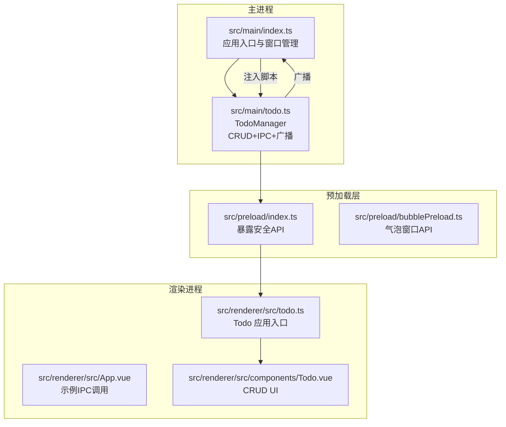
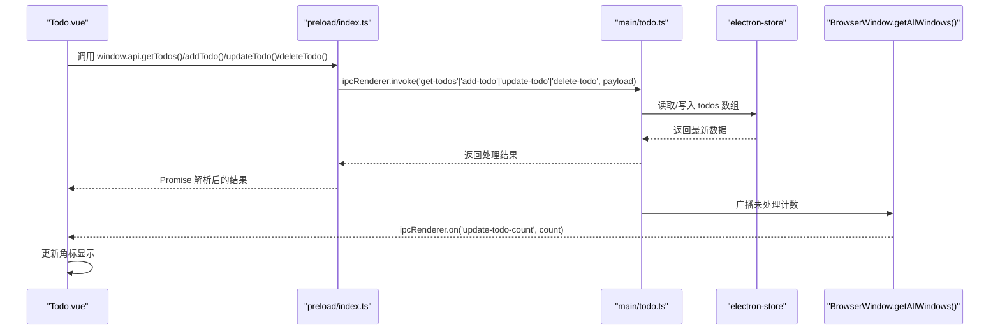
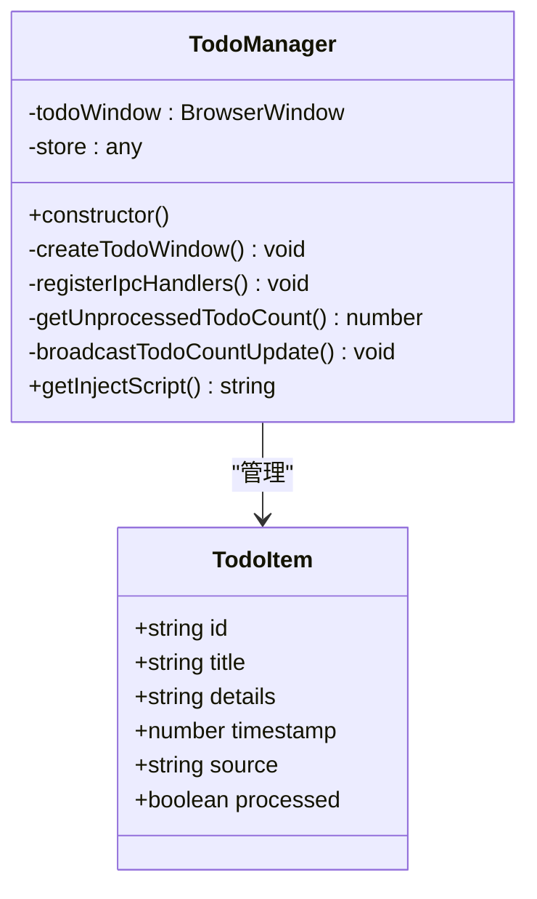
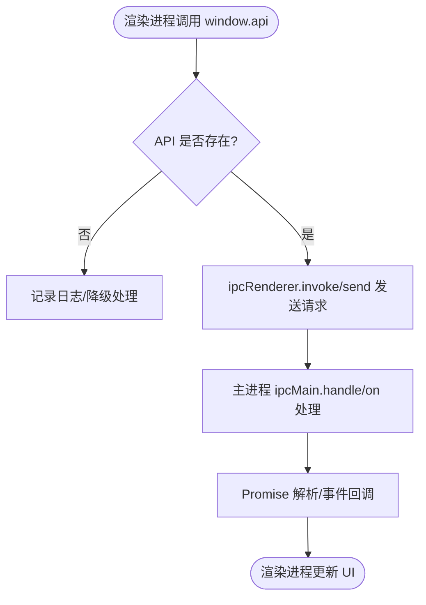
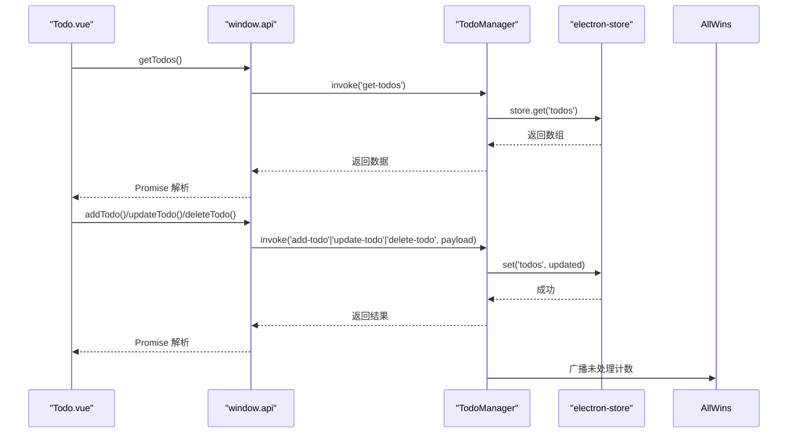
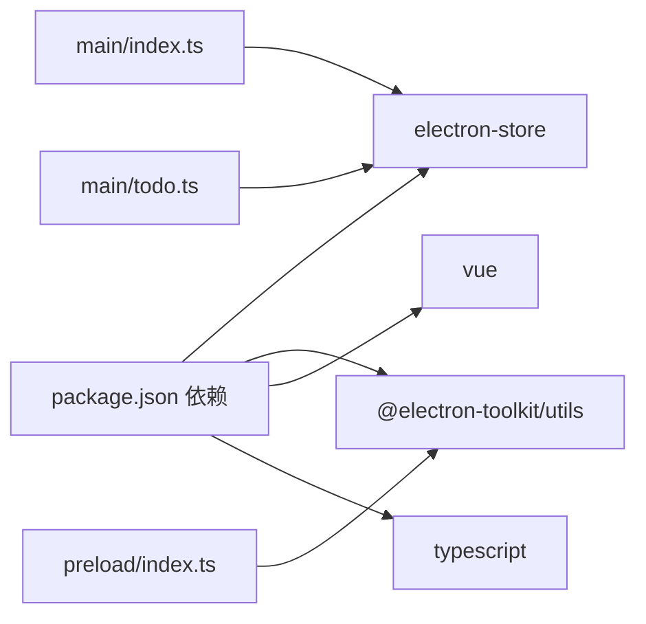

# 数据访问模式

<cite>
**本文引用的文件**
- [src/main/todo.ts](file://src/main/todo.ts)
- [src/main/index.ts](file://src/main/index.ts)
- [src/preload/index.ts](file://src/preload/index.ts)
- [src/preload/bubblePreload.ts](file://src/preload/bubblePreload.ts)
- [src/renderer/src/components/Todo.vue](file://src/renderer/src/components/Todo.vue)
- [src/renderer/src/todo.ts](file://src/renderer/src/todo.ts)
- [src/renderer/src/App.vue](file://src/renderer/src/App.vue)
- [package.json](file://package.json)
</cite>

## 目录
1. [简介](#简介)
2. [项目结构](#项目结构)
3. [核心组件](#核心组件)
4. [架构总览](#架构总览)
5. [详细组件分析](#详细组件分析)
6. [依赖关系分析](#依赖关系分析)
7. [性能考量](#性能考量)
8. [故障排查指南](#故障排查指南)
9. [结论](#结论)
10. [附录](#附录)

## 简介
本文件系统化阐述本项目的“数据访问模式”，重点围绕 TodoManager 的 CRUD 实现、IPC 通信模式（ipcMain.handle 与 ipcRenderer.invoke）、主进程到渲染进程的数据同步与状态广播、安全与错误处理策略、缓存与批量操作建议、以及跨进程数据共享与性能优化方案。文档同时给出面向非专业读者的可视化图示与流程说明，帮助快速理解与落地实践。

## 项目结构
本项目采用 Electron + Vue 架构，数据访问主要集中在主进程 TodoManager，通过预加载脚本暴露安全可控的 API 至渲染进程，并由渲染进程的 Todo 组件进行展示与交互。

图表来源
- [src/main/index.ts](file://src/main/index.ts#L102-L103)
- [src/main/todo.ts](file://src/main/todo.ts#L20-L33)
- [src/preload/index.ts](file://src/preload/index.ts#L17-L43)
- [src/preload/bubblePreload.ts](file://src/preload/bubblePreload.ts#L1-L70)
- [src/renderer/src/todo.ts](file://src/renderer/src/todo.ts#L1-L9)
- [src/renderer/src/components/Todo.vue](file://src/renderer/src/components/Todo.vue#L87-L141)

章节来源
- [src/main/index.ts](file://src/main/index.ts#L102-L103)
- [src/main/todo.ts](file://src/main/todo.ts#L20-L33)
- [src/preload/index.ts](file://src/preload/index.ts#L17-L43)
- [src/preload/bubblePreload.ts](file://src/preload/bubblePreload.ts#L1-L70)
- [src/renderer/src/todo.ts](file://src/renderer/src/todo.ts#L1-L9)
- [src/renderer/src/components/Todo.vue](file://src/renderer/src/components/Todo.vue#L87-L141)

## 核心组件
- TodoManager：封装待办事项的 CRUD、窗口管理、IPC 注册、状态广播与脚本注入。
- 预加载 API：通过 contextBridge 将安全的 ipcRenderer 包装为 window.api，统一暴露 CRUD 与其它能力。
- 渲染进程 Todo 组件：负责 UI 展示、用户交互、调用 window.api 发起 CRUD 请求、接收主进程广播更新角标。

章节来源
- [src/main/todo.ts](file://src/main/todo.ts#L20-L33)
- [src/preload/index.ts](file://src/preload/index.ts#L17-L43)
- [src/renderer/src/components/Todo.vue](file://src/renderer/src/components/Todo.vue#L87-L141)

## 架构总览
主进程 TodoManager 作为数据中枢，使用 electron-store 进行本地持久化；渲染进程通过 window.api 调用 ipcRenderer.invoke 触发主进程处理；主进程在变更后广播未处理待办数量，渲染进程监听并更新 UI 角标。

图表来源
- [src/renderer/src/components/Todo.vue](file://src/renderer/src/components/Todo.vue#L87-L141)
- [src/preload/index.ts](file://src/preload/index.ts#L27-L33)
- [src/main/todo.ts](file://src/main/todo.ts#L82-L122)
- [src/main/todo.ts](file://src/main/todo.ts#L149-L154)

## 详细组件分析

### TodoManager（CRUD 与 IPC）
- 数据模型：TodoItem 接口定义字段，主进程在添加时自动生成 id、timestamp、processed。
- CRUD 实现：
  - 获取：ipcMain.handle('get-todos') 读取 store 默认键 todos。
  - 新增：ipcMain.handle('add-todo') 生成新项并插入数组头部，写回 store，随后广播未处理计数。
  - 更新：ipcMain.handle('update-todo') 基于 id 替换匹配项，写回 store，广播计数。
  - 删除：ipcMain.handle('delete-todo') 过滤掉对应 id，写回 store，广播计数。
  - 未处理计数：基于 processed 字段统计，供角标与全局广播使用。
- 窗口管理：创建独立 Todo 窗口，按开发/生产环境加载不同资源。
- 广播机制：遍历所有窗口，向其 webContents 发送 'update-todo-count' 事件，渲染进程监听更新角标。

图表来源
- [src/main/todo.ts](file://src/main/todo.ts#L6-L14)
- [src/main/todo.ts](file://src/main/todo.ts#L20-L33)

章节来源
- [src/main/todo.ts](file://src/main/todo.ts#L82-L122)
- [src/main/todo.ts](file://src/main/todo.ts#L141-L154)

### 预加载 API（安全桥接）
- 通过 contextBridge 暴露 window.electron.ipcRenderer 与 window.api。
- window.api 提供 openTodoWindow、getTodos、addTodo、updateTodo、deleteTodo、getUnprocessedTodoCount、addTodoFromChat 等方法，均通过 ipcRenderer.invoke 或 send 调用主进程。
- 该设计避免渲染进程直接使用 Node.js API，降低安全风险。

图表来源
- [src/preload/index.ts](file://src/preload/index.ts#L17-L43)

章节来源
- [src/preload/index.ts](file://src/preload/index.ts#L17-L43)

### 渲染进程 Todo 组件（UI 与交互）
- 生命周期：onMounted 时拉取待办列表，监听 'show-add-todo-modal' 事件以支持从聊天内容创建待办。
- CRUD 流程：调用 window.api 的对应方法，等待 Promise 解析后刷新列表。
- 角标更新：监听 'update-todo-count' 事件，动态更新未处理计数徽标。

图表来源
- [src/renderer/src/components/Todo.vue](file://src/renderer/src/components/Todo.vue#L87-L141)
- [src/preload/index.ts](file://src/preload/index.ts#L27-L33)
- [src/main/todo.ts](file://src/main/todo.ts#L82-L122)
- [src/main/todo.ts](file://src/main/todo.ts#L149-L154)

章节来源
- [src/renderer/src/components/Todo.vue](file://src/renderer/src/components/Todo.vue#L87-L141)

### IPC 通信模式详解（ipcMain.handle vs ipcRenderer.invoke）
- 主进程注册：
  - ipcMain.handle('get-todos' | 'add-todo' | 'update-todo' | 'delete-todo')：用于带返回值的请求-响应。
  - ipcMain.on('open-todo-window' | 'add-todo-from-chat')：用于事件驱动（如触发窗口或消息提示）。
- 渲染进程调用：
  - ipcRenderer.invoke('get-todos' | 'add-todo' | 'update-todo' | 'delete-todo')：返回 Promise。
  - ipcRenderer.send('open-todo-window' | 'add-todo-from-chat')：单向事件。
- 预加载层封装：
  - 将 ipcRenderer.invoke/send 包装为 window.api 方法，统一命名与参数类型，便于 UI 组件直接调用。

章节来源
- [src/main/todo.ts](file://src/main/todo.ts#L77-L136)
- [src/preload/index.ts](file://src/preload/index.ts#L27-L33)

### 数据同步与状态广播
- 主进程在每次 CRUD 后调用广播方法，向所有窗口发送 'update-todo-count' 事件。
- 渲染进程 Todo 组件监听该事件，更新角标数字，实现跨窗口状态一致性。
- 注入脚本：主进程在主窗口加载完成后注入脚本，向主应用 UI 注入“待办”入口与右键菜单项，支持从聊天内容创建待办。

章节来源
- [src/main/todo.ts](file://src/main/todo.ts#L149-L154)
- [src/main/todo.ts](file://src/main/todo.ts#L156-L264)
- [src/main/index.ts](file://src/main/index.ts#L157-L162)

### 安全考虑与错误处理策略
- 安全：
  - 预加载层通过 contextBridge 暴露有限 API，避免渲染进程直接访问 Node.js。
  - 主进程严格控制 IPC 事件名与参数类型，避免任意命令执行。
- 错误处理：
  - 主进程 CRUD 操作基于数组映射/过滤，未显式 try-catch；建议在 store 读写前后增加 try-catch 与校验，保证健壮性。
  - 渲染进程在调用 window.api 时应捕获 Promise 异常并提示用户。
  - 注入脚本与窗口加载存在条件判断（如 isLoading），避免在未就绪时发送事件。

章节来源
- [src/preload/index.ts](file://src/preload/index.ts#L48-L62)
- [src/main/todo.ts](file://src/main/todo.ts#L125-L135)

### 缓存策略、批量操作与事务处理（最佳实践）
- 缓存策略：
  - 渲染进程 Todo 列表在内存中维护，每次 CRUD 后重新拉取，可结合本地状态合并减少重复请求。
  - 若数据量增大，可在渲染进程引入轻量缓存（如 LRU）与分页加载。
- 批量操作：
  - 当前实现逐条 CRUD；建议在主进程提供批量接口（如批量新增/更新/删除），并在 UI 提供批量选择与提交。
- 事务处理：
  - electron-store 为文件级持久化，不具备数据库事务语义；建议在主进程层面对批量操作进行“原子性”封装（如先生成全部变更，再一次性写入），并在失败时回滚或撤销。

章节来源
- [src/main/todo.ts](file://src/main/todo.ts#L87-L117)

### 跨进程数据共享与性能优化
- 数据共享：
  - 通过 IPC 传递数据，避免直接共享内存；主进程集中管理数据源，渲染进程只消费。
- 性能优化：
  - 减少不必要的广播：仅在数据变更时广播，避免高频抖动。
  - 增加防抖/节流：对频繁触发的 UI 操作（如输入框）进行节流。
  - 延迟加载：Todo 窗口按需创建，避免启动即加载。
  - 预加载脚本注入时机：在主窗口 did-finish-load 后注入，确保 DOM 就绪。

章节来源
- [src/main/todo.ts](file://src/main/todo.ts#L58-L72)
- [src/main/index.ts](file://src/main/index.ts#L143-L187)

## 依赖关系分析
- 依赖 electron-store 进行本地持久化。
- 依赖 @electron-toolkit/utils 提供开发/生产环境判断。
- 预加载脚本依赖 Electron 的 contextBridge 与 ipcRenderer。

图表来源
- [package.json](file://package.json#L25-L33)
- [src/main/index.ts](file://src/main/index.ts#L14-L26)
- [src/main/todo.ts](file://src/main/todo.ts#L1-L4)

章节来源
- [package.json](file://package.json#L25-L33)

## 性能考量
- IPC 调用成本：频繁 CRUD 会产生较多 IPC 往返，建议合并请求或使用批量接口。
- 广播频率：未处理计数广播应在数据稳定后再触发，避免 UI 抖动。
- 存储写入：store.set 为同步写盘，建议在批量操作时减少写入次数。
- 渲染更新：Todo 列表在每次 CRUD 后重新拉取，可考虑局部更新与虚拟列表优化。

## 故障排查指南
- 无法打开 Todo 窗口：
  - 检查主进程是否正确注册 'open-todo-window' 事件与 createTodoWindow 流程。
  - 确认预加载层 window.api.openTodoWindow 是否可用。
- CRUD 无响应：
  - 检查 ipcRenderer.invoke 的事件名与参数是否与主进程一致。
  - 在主进程 TodoManager 的 handle 回调中增加日志，确认是否进入处理分支。
- 角标不更新：
  - 确认主进程广播逻辑是否执行，渲染进程是否监听 'update-todo-count'。
- 注入脚本失败：
  - 检查主窗口 did-finish-load 事件是否触发，注入脚本是否在合适时机执行。

章节来源
- [src/main/todo.ts](file://src/main/todo.ts#L77-L136)
- [src/preload/index.ts](file://src/preload/index.ts#L26-L33)
- [src/main/index.ts](file://src/main/index.ts#L143-L187)

## 结论
本项目通过 TodoManager 将数据访问、IPC 通信与状态广播有机结合，形成清晰的主-预加载-渲染三层架构。建议在现有基础上增强错误处理、引入批量与事务能力、优化广播与渲染更新策略，以进一步提升稳定性与性能。

## 附录
- 示例 IPC 调用（渲染进程）：参见 App.vue 中的 ping 示例，演示 ipcRenderer.send 的使用方式。

章节来源
- [src/renderer/src/App.vue](file://src/renderer/src/App.vue#L4)