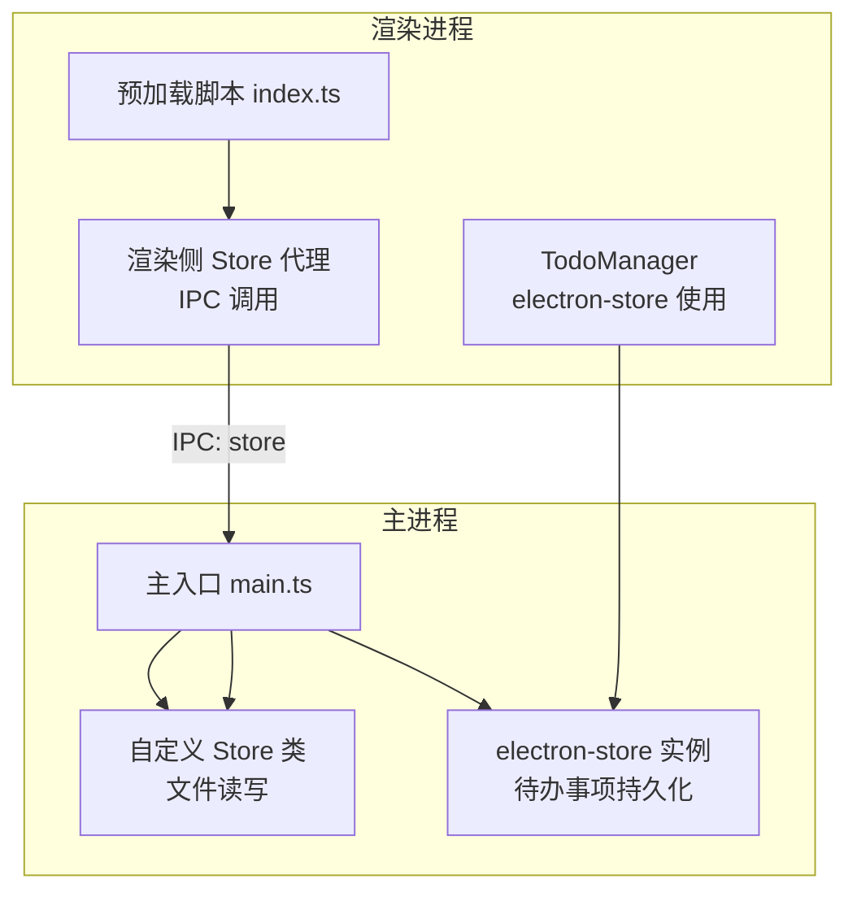
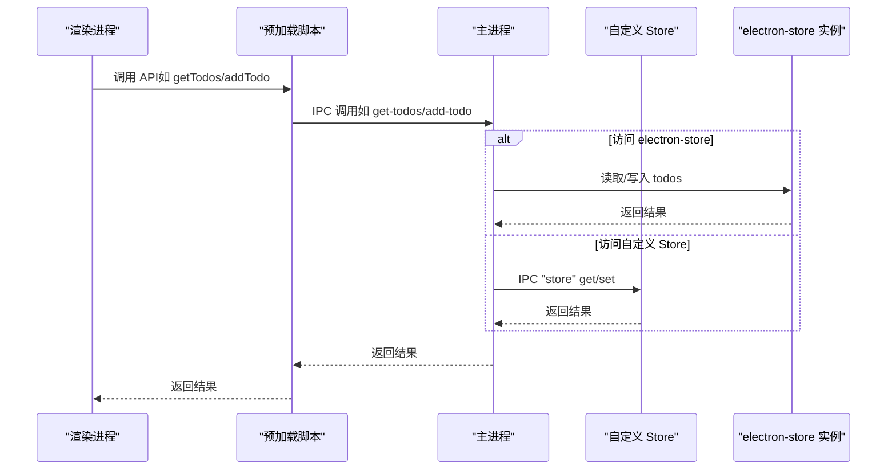
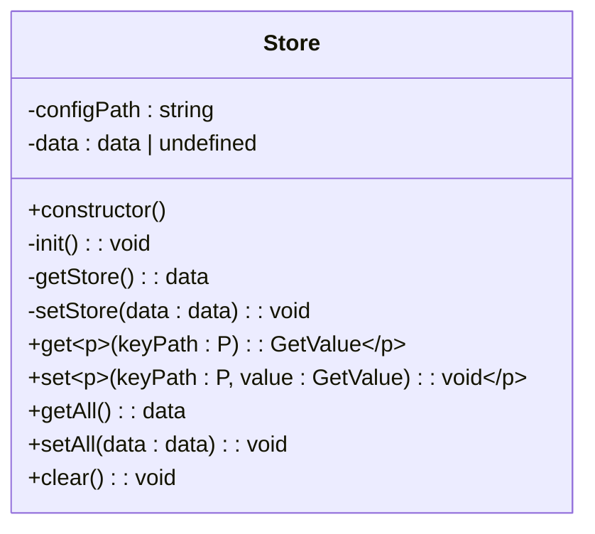
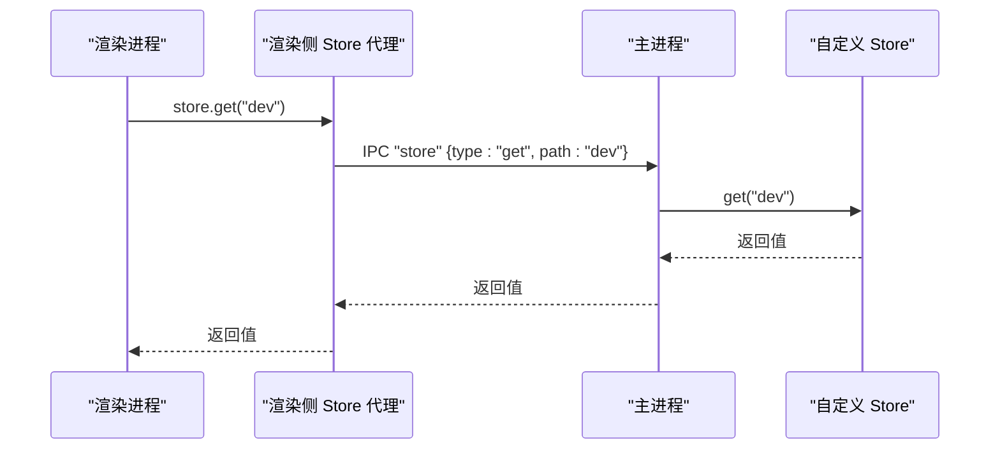
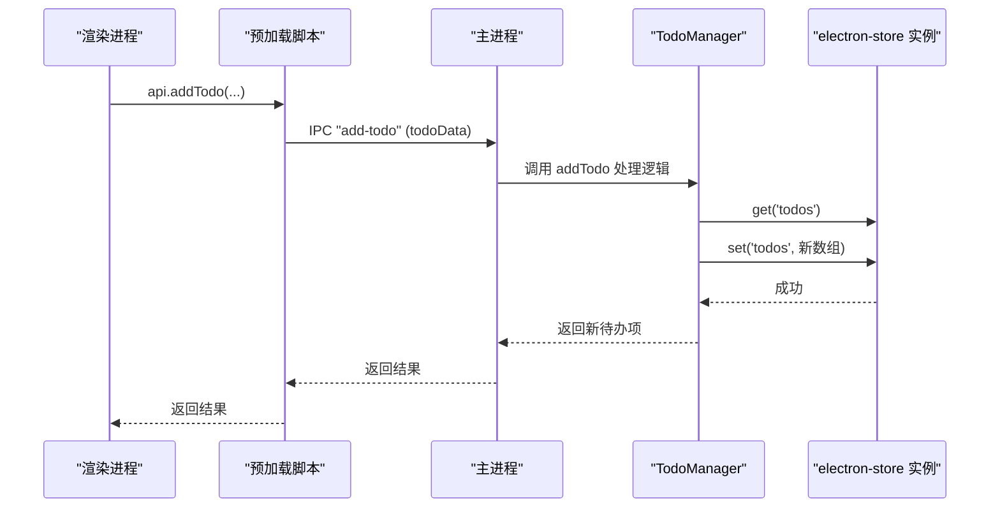
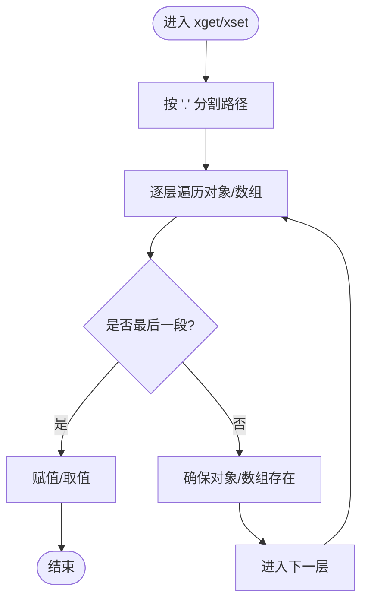

# 本地存储策略

<cite>
**本文引用的文件**
- [store.ts](file://temp_eSearch/lib/store/store.ts)
- [renderStore.ts](file://temp_eSearch/lib/store/renderStore.ts)
- [parse.ts](file://temp_eSearch/lib/store/parse.ts)
- [ShareTypes.d.ts](file://temp_eSearch/src/ShareTypes.d.ts)
- [main.ts](file://temp_eSearch/src/main/main.ts)
- [todo.ts](file://src/main/todo.ts)
- [index.ts](file://src/preload/index.ts)
- [init.ts](file://temp_eSearch/test/ui/init.ts)
</cite>

## 目录
1. [简介](#简介)
2. [项目结构](#项目结构)
3. [核心组件](#核心组件)
4. [架构总览](#架构总览)
5. [详细组件分析](#详细组件分析)
6. [依赖关系分析](#依赖关系分析)
7. [性能考量](#性能考量)
8. [故障排查指南](#故障排查指南)
9. [结论](#结论)
10. [附录](#附录)

## 简介
本文件系统性阐述本项目的本地存储策略，重点覆盖以下方面：
- electron-store 的配置与使用（TodoManager 中的 store 初始化）
- 存储命名空间、默认值设置、数据持久化机制
- 存储数据的读取、写入与更新流程及数据类型处理
- 存储最佳实践（备份、迁移、错误处理）
- 存储性能优化与内存管理建议

## 项目结构
本项目采用“主进程存储 + 渲染进程桥接”的双层存储架构：
- 主进程侧：自定义 Store 类负责实际文件读写与路径管理
- 渲染进程侧：通过 IPC 与主进程交互，实现类型安全的键路径访问
- 业务侧：TodoManager 使用 electron-store 对待办事项进行持久化

图表来源
- [main.ts](file://temp_eSearch/src/main/main.ts#L84-L98)
- [store.ts](file://temp_eSearch/lib/store/store.ts#L14-L70)
- [renderStore.ts](file://temp_eSearch/lib/store/renderStore.ts#L28-L44)
- [todo.ts](file://src/main/todo.ts#L20-L33)
- [index.ts](file://src/preload/index.ts#L17-L43)

章节来源
- [main.ts](file://temp_eSearch/src/main/main.ts#L84-L98)
- [store.ts](file://temp_eSearch/lib/store/store.ts#L14-L70)
- [renderStore.ts](file://temp_eSearch/lib/store/renderStore.ts#L28-L44)
- [todo.ts](file://src/main/todo.ts#L20-L33)
- [index.ts](file://src/preload/index.ts#L17-L43)

## 核心组件
- 自定义 Store 类：封装文件系统读写、初始化、路径管理与类型安全的键路径存取
- 渲染侧 Store 代理：基于 IPC 的同步/异步存取接口，提供类型推导
- electron-store 实例：用于 TodoManager 的待办事项持久化
- 预加载脚本：为渲染进程暴露受控 API，并承载 IPC 通道

章节来源
- [store.ts](file://temp_eSearch/lib/store/store.ts#L14-L70)
- [renderStore.ts](file://temp_eSearch/lib/store/renderStore.ts#L28-L44)
- [todo.ts](file://src/main/todo.ts#L20-L33)
- [index.ts](file://src/preload/index.ts#L17-L43)

## 架构总览
渲染进程通过预加载脚本暴露的 API 发起 IPC 请求，主进程根据请求类型分发到自定义 Store 或 electron-store 实例，最终完成数据的读取、写入与更新。

图表来源
- [index.ts](file://src/preload/index.ts#L25-L33)
- [main.ts](file://temp_eSearch/src/main/main.ts#L86-L98)
- [store.ts](file://temp_eSearch/lib/store/store.ts#L47-L58)
- [todo.ts](file://src/main/todo.ts#L82-L98)

## 详细组件分析

### 自定义 Store 类（主进程侧）
- 存储命名空间与路径
  - 文件路径：位于 Electron userData 目录下的 config.json
  - 初始化：若文件不存在则创建空对象并写入
- 默认值与类型安全
  - 通过类型映射与条件类型实现键路径类型推导
  - 读取时返回类型安全的值；写入时支持嵌套路径自动创建对象/数组
- 数据持久化机制
  - 读取：先从内存缓存取，否则从磁盘 JSON 解析
  - 写入：修改内存对象后统一序列化写回磁盘
  - 错误处理：读取失败时回退到初始化状态

图表来源
- [store.ts](file://temp_eSearch/lib/store/store.ts#L14-L70)

章节来源
- [store.ts](file://temp_eSearch/lib/store/store.ts#L14-L70)
- [parse.ts](file://temp_eSearch/lib/store/parse.ts#L6-L40)
- [ShareTypes.d.ts](file://temp_eSearch/src/ShareTypes.d.ts#L1-L418)

### 渲染侧 Store 代理（渲染进程侧）
- 键路径类型安全
  - 通过 SettingPath 与 GetValue 条件类型，确保路径与值类型匹配
- IPC 通信
  - 同步：get/getAll
  - 异步：set/setAll
- 使用场景
  - 读取全局设置项（如 dev、硬件加速、快捷键等）
  - 与主进程交互，避免直接访问文件系统

图表来源
- [renderStore.ts](file://temp_eSearch/lib/store/renderStore.ts#L28-L44)
- [main.ts](file://temp_eSearch/src/main/main.ts#L86-L98)
- [store.ts](file://temp_eSearch/lib/store/store.ts#L31-L45)

章节来源
- [renderStore.ts](file://temp_eSearch/lib/store/renderStore.ts#L1-L49)
- [main.ts](file://temp_eSearch/src/main/main.ts#L86-L98)

### TodoManager 中的 electron-store 初始化与使用
- 初始化配置
  - name 参数：指定存储文件名（本项目为 todo-data），用于区分不同业务域的数据文件
  - defaults 参数：设置初始默认值（本项目为 todos: []）
- 数据读取与写入
  - 读取：store.get('todos') 获取数组
  - 写入：store.set('todos', updatedTodos) 更新数组
- IPC 集成
  - 主进程注册 handle/handle/on 监听器，将渲染进程请求转发至 electron-store 实例
  - 渲染进程通过预加载脚本调用 API，间接触发主进程处理

图表来源
- [todo.ts](file://src/main/todo.ts#L24-L33)
- [todo.ts](file://src/main/todo.ts#L87-L98)
- [index.ts](file://src/preload/index.ts#L25-L33)

章节来源
- [todo.ts](file://src/main/todo.ts#L20-L136)
- [index.ts](file://src/preload/index.ts#L25-L33)

### 数据类型处理与键路径算法
- 键路径解析
  - xget：按点分隔路径逐层访问，支持嵌套对象/数组
  - xset：按点分隔路径逐层创建缺失的对象或数组，最终赋值
- 类型安全
  - SettingPath 由 setting 接口递归生成
  - GetValue 通过条件类型解析具体值类型，保证 get/set 的类型一致性

图表来源
- [parse.ts](file://temp_eSearch/lib/store/parse.ts#L6-L40)
- [ShareTypes.d.ts](file://temp_eSearch/src/ShareTypes.d.ts#L1-L418)

章节来源
- [parse.ts](file://temp_eSearch/lib/store/parse.ts#L6-L40)
- [ShareTypes.d.ts](file://temp_eSearch/src/ShareTypes.d.ts#L1-L418)

## 依赖关系分析
- 组件耦合
  - 渲染侧 Store 代理依赖 IPC 通道与主进程交互
  - 主进程 Store 与 electron-store 实例解耦，分别服务于不同业务域
- 外部依赖
  - Electron 应用路径（userData）决定存储文件位置
  - Node.js 文件系统用于读写 JSON 文件

图表来源
- [renderStore.ts](file://temp_eSearch/lib/store/renderStore.ts#L28-L44)
- [main.ts](file://temp_eSearch/src/main/main.ts#L86-L98)
- [store.ts](file://temp_eSearch/lib/store/store.ts#L14-L70)
- [todo.ts](file://src/main/todo.ts#L20-L33)

章节来源
- [renderStore.ts](file://temp_eSearch/lib/store/renderStore.ts#L28-L44)
- [main.ts](file://temp_eSearch/src/main/main.ts#L86-L98)
- [store.ts](file://temp_eSearch/lib/store/store.ts#L14-L70)
- [todo.ts](file://src/main/todo.ts#L20-L33)

## 性能考量
- I/O 模式
  - 主进程 Store 采用一次性读取/写入 JSON 文件，适合小中型配置数据
  - 对于频繁更新的场景，建议合并写入或引入节流/防抖
- 内存管理
  - Store 类内部维护内存缓存，减少重复磁盘读取
  - 若数据量较大，可考虑分块读取或懒加载策略
- IPC 通信
  - 渲染侧 Store 代理对同步调用（get/getAll）应谨慎使用，避免阻塞 UI
  - 大数据批量写入建议使用异步 setAll 并在完成后刷新 UI
- electron-store
  - 默认文件名可按业务域拆分（如 todo-data），避免单文件过大
  - 对热数据可结合内存缓存策略，减少磁盘访问

[本节为通用性能建议，不直接分析特定文件]

## 故障排查指南
- 配置文件损坏或权限问题
  - 现象：读取失败抛错，回退到初始化状态
  - 处理：检查 userData 目录权限；必要时删除/重命名 config.json 后重启
- 存储路径变更
  - 现象：应用路径被自定义，导致配置文件位置变化
  - 处理：确认主进程是否设置了自定义 userData 路径
- 数据类型不匹配
  - 现象：类型推导报错或运行时报错
  - 处理：确保键路径与 setting 接口一致；避免跨域混用不同类型
- 备份与恢复
  - 建议：在测试环境中提供备份/恢复脚本，便于快速回滚
  - 示例脚本展示了备份与恢复 config.json 的流程

章节来源
- [store.ts](file://temp_eSearch/lib/store/store.ts#L31-L45)
- [main.ts](file://temp_eSearch/src/main/main.ts#L63-L82)
- [init.ts](file://temp_eSearch/test/ui/init.ts#L19-L28)

## 结论
本项目的本地存储策略通过“自定义 Store + electron-store + IPC 代理”形成清晰的职责边界：
- 自定义 Store 负责通用配置的类型安全与持久化
- electron-store 负责业务数据（如待办事项）的简单持久化
- 渲染侧通过预加载脚本与主进程安全通信

建议在后续迭代中：
- 对高频写入场景引入批量写入与去抖策略
- 对大型配置文件考虑拆分或压缩存储
- 增强错误日志与自动修复机制
- 为关键数据提供定期备份与版本迁移能力

[本节为总结性内容，不直接分析特定文件]

## 附录

### 存储命名空间与默认值
- 自定义 Store
  - 文件：config.json（位于 Electron userData 目录）
  - 初始化：空对象
- electron-store（TodoManager）
  - 文件：todo-data（位于 Electron userData 目录）
  - 默认值：todos: []

章节来源
- [store.ts](file://temp_eSearch/lib/store/store.ts#L18-L29)
- [todo.ts](file://src/main/todo.ts#L26-L31)

### 数据读取、写入与更新流程
- 读取
  - 渲染侧：通过渲染侧 Store 代理或预加载脚本调用主进程
  - 主进程：根据请求类型调用自定义 Store 或 electron-store
  - 返回：类型安全的结果
- 写入
  - 渲染侧：调用预加载脚本 API
  - 主进程：执行业务逻辑（如组装新待办项），写入 electron-store
  - 持久化：写入磁盘

章节来源
- [renderStore.ts](file://temp_eSearch/lib/store/renderStore.ts#L28-L44)
- [index.ts](file://src/preload/index.ts#L25-L33)
- [todo.ts](file://src/main/todo.ts#L82-L117)

### 最佳实践清单
- 备份
  - 在升级前备份 config.json 与业务数据文件
- 迁移
  - 版本升级时提供迁移脚本，兼容旧字段与默认值
- 错误处理
  - 对磁盘读写异常进行捕获与降级
- 性能
  - 合并写入、避免频繁同步调用、合理使用内存缓存

[本节为通用实践建议，不直接分析特定文件]