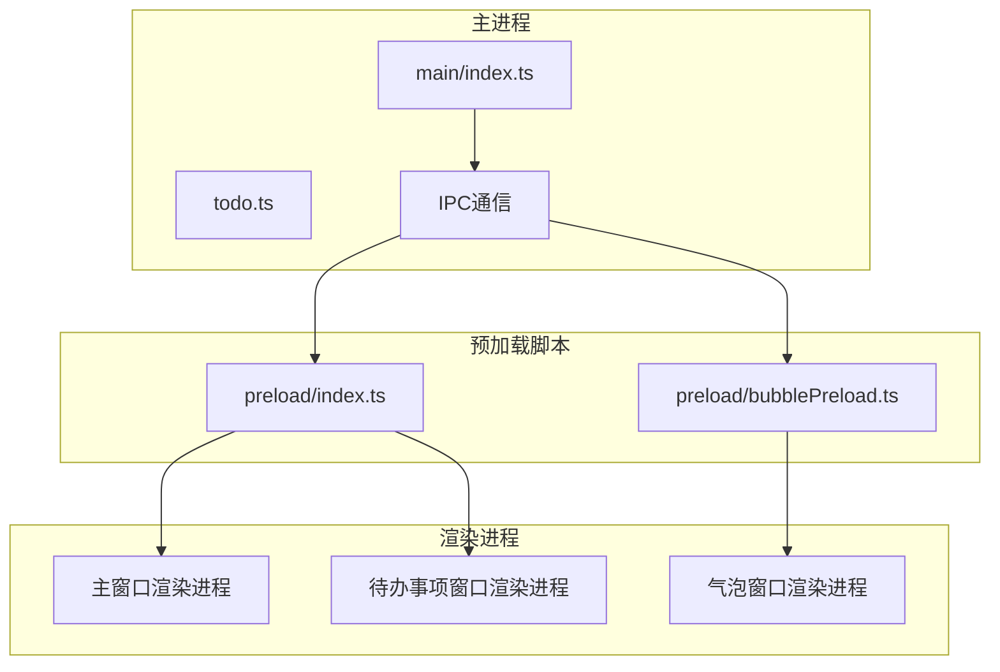
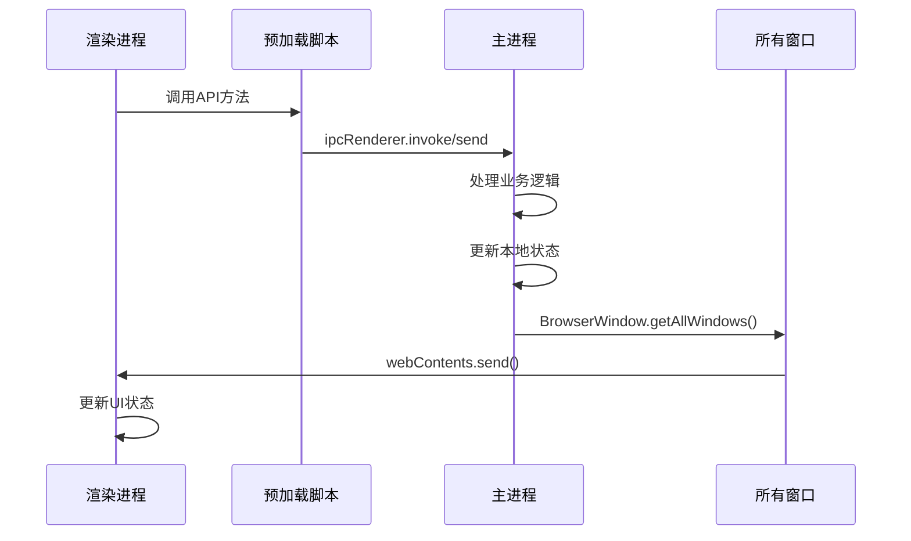
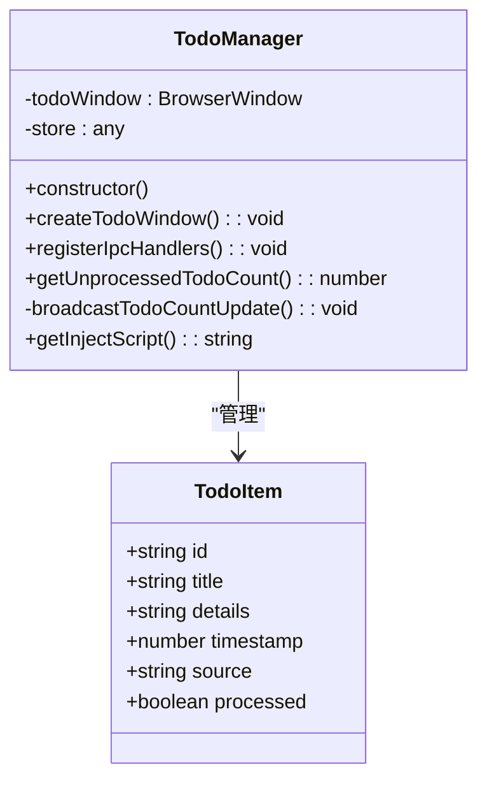
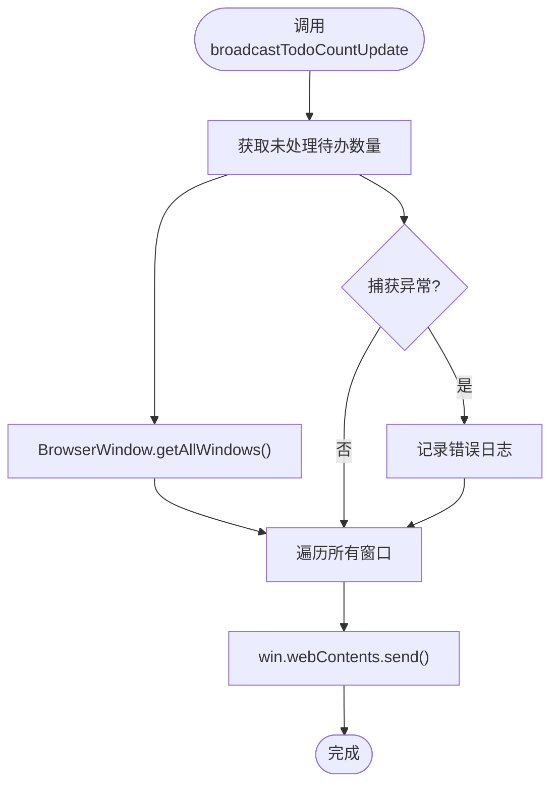
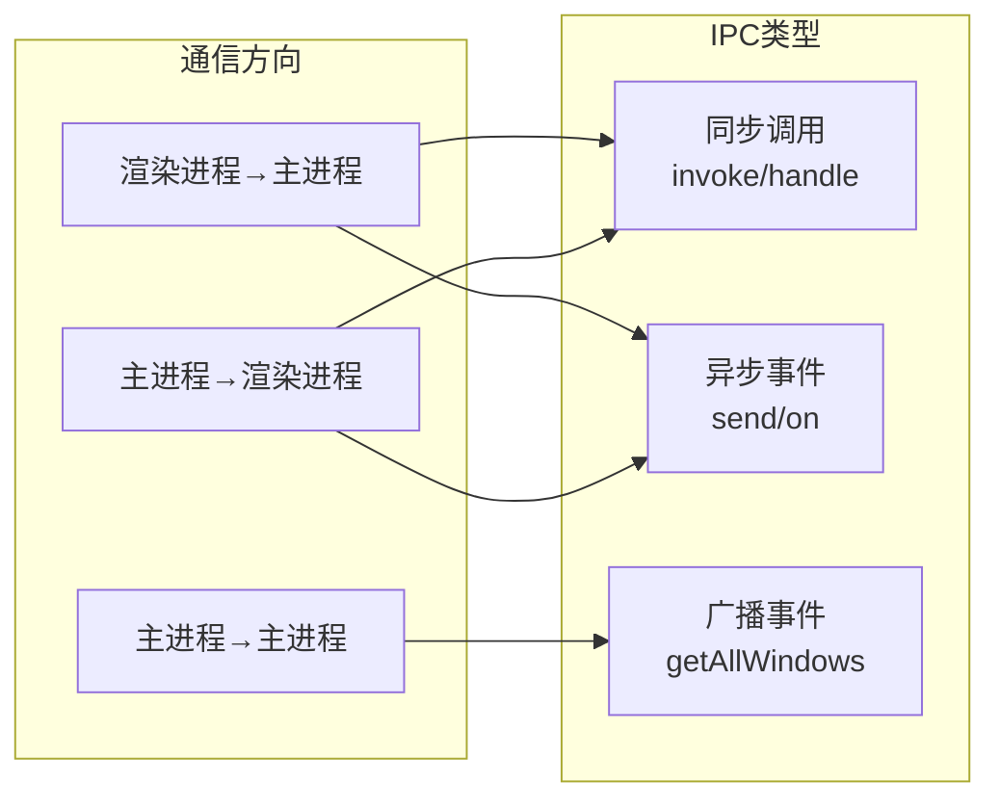
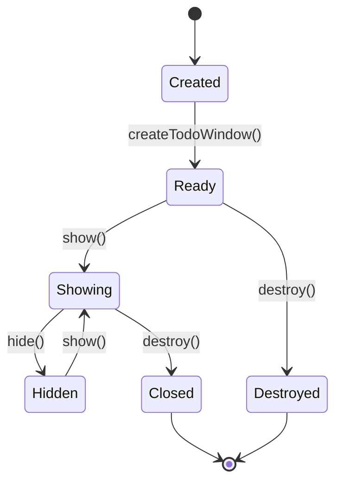
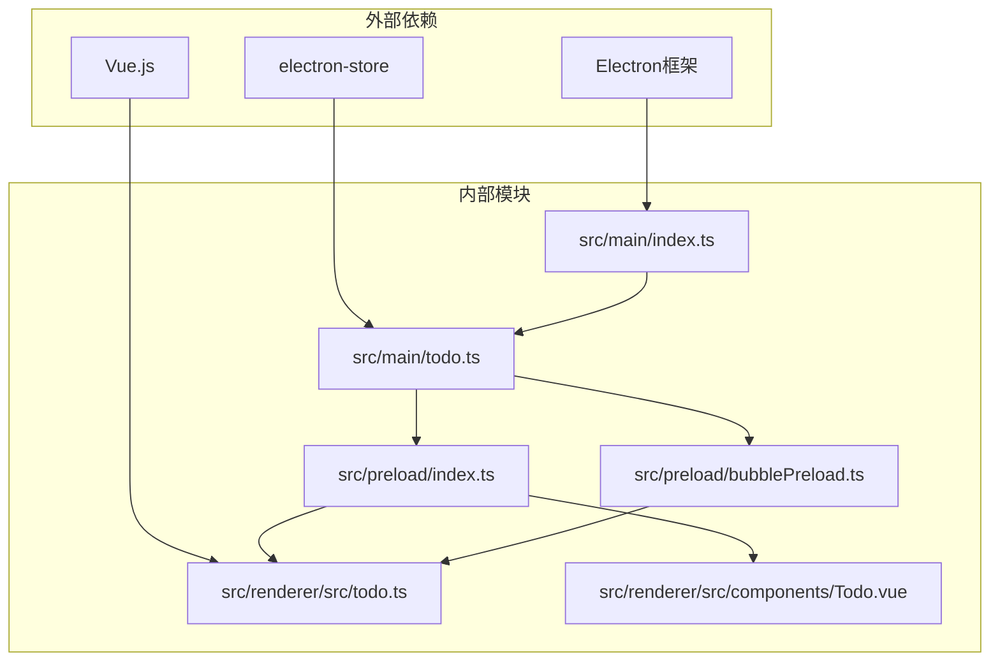
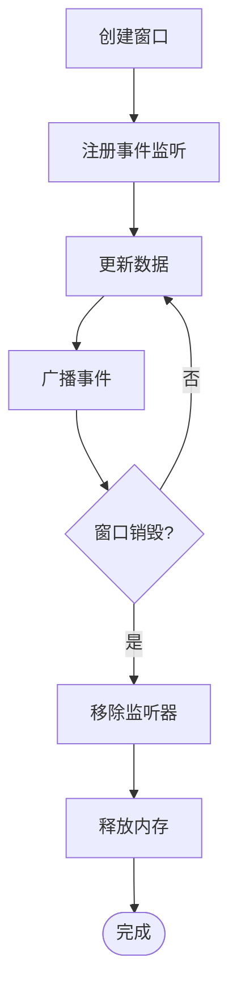

# 跨进程数据同步

<cite>
**本文档引用的文件**
- [src/main/index.ts](file://src/main/index.ts)
- [src/main/todo.ts](file://src/main/todo.ts)
- [src/preload/index.ts](file://src/preload/index.ts)
- [src/preload/bubblePreload.ts](file://src/preload/bubblePreload.ts)
- [src/renderer/src/todo.ts](file://src/renderer/src/todo.ts)
- [src/renderer/src/components/Todo.vue](file://src/renderer/src/components/Todo.vue)
</cite>

## 目录
1. [简介](#简介)
2. [项目结构](#项目结构)
3. [核心组件](#核心组件)
4. [架构概览](#架构概览)
5. [详细组件分析](#详细组件分析)
6. [依赖关系分析](#依赖关系分析)
7. [性能考虑](#性能考虑)
8. [故障排除指南](#故障排除指南)
9. [结论](#结论)

## 简介

本项目实现了完整的跨进程数据同步机制，涵盖主进程与渲染进程之间的双向通信、多窗口状态同步、实时数据更新以及竞态条件处理。系统采用Electron框架构建，包含主窗口、气泡窗口和待办事项窗口三个主要窗口组件，通过BrowserWindow.getAllWindows()实现全局事件广播，确保所有窗口间的数据一致性。

## 项目结构

项目采用典型的Electron应用架构，分为主进程、预加载脚本和渲染进程三个层次：

**图表来源**
- [src/main/index.ts](file://src/main/index.ts#L1-L80)
- [src/preload/index.ts](file://src/preload/index.ts#L1-L63)
- [src/preload/bubblePreload.ts](file://src/preload/bubblePreload.ts#L1-L70)

**章节来源**
- [src/main/index.ts](file://src/main/index.ts#L1-L120)
- [src/preload/index.ts](file://src/preload/index.ts#L1-L63)

## 核心组件

### TodoManager类
TodoManager是待办事项管理的核心组件，负责：
- 窗口生命周期管理
- 数据持久化存储
- IPC事件处理
- 全局事件广播

### BrowserWindow管理
系统维护多个BrowserWindow实例：
- mainWindow：主聊天窗口
- bubbleWindow：通知气泡窗口  
- todoWindow：待办事项窗口

### 预加载脚本
预加载脚本提供安全的API暴露机制：
- preload/index.ts：通用API接口
- preload/bubblePreload.ts：气泡窗口专用API

**章节来源**
- [src/main/todo.ts](file://src/main/todo.ts#L20-L136)
- [src/main/index.ts](file://src/main/index.ts#L28-L38)

## 架构概览

系统采用分层架构设计，实现主进程与渲染进程的解耦：

**图表来源**
- [src/main/todo.ts](file://src/main/todo.ts#L96-L154)
- [src/preload/index.ts](file://src/preload/index.ts#L17-L43)

## 详细组件分析

### TodoManager组件分析

TodoManager实现了完整的待办事项管理系统：

**图表来源**
- [src/main/todo.ts](file://src/main/todo.ts#L20-L136)

#### broadcastTodoCountUpdate方法实现原理

该方法是系统数据同步的核心机制：

**图表来源**
- [src/main/todo.ts](file://src/main/todo.ts#L148-L154)

实现特点：
- 使用BrowserWindow.getAllWindows()获取所有活动窗口
- 通过webContents.send()向每个窗口广播事件
- 实现零依赖的全局状态同步

**章节来源**
- [src/main/todo.ts](file://src/main/todo.ts#L148-L154)

### IPC通信机制

系统采用多种IPC通信模式：

**图表来源**
- [src/preload/index.ts](file://src/preload/index.ts#L6-L13)
- [src/main/todo.ts](file://src/main/todo.ts#L77-L136)

**章节来源**
- [src/preload/index.ts](file://src/preload/index.ts#L1-L63)
- [src/main/todo.ts](file://src/main/todo.ts#L77-L136)

### 窗口生命周期管理

系统实现了完善的窗口生命周期管理：

**图表来源**
- [src/main/todo.ts](file://src/main/todo.ts#L38-L72)

**章节来源**
- [src/main/todo.ts](file://src/main/todo.ts#L38-L72)

### 数据一致性保证

系统通过以下机制确保数据一致性：

1. **原子性操作**：所有数据变更都在主进程进行
2. **事件驱动更新**：使用广播机制确保所有窗口同步
3. **状态缓存**：electron-store提供持久化存储
4. **竞态条件处理**：通过事件顺序保证最终一致性

**章节来源**
- [src/main/todo.ts](file://src/main/todo.ts#L26-L32)

## 依赖关系分析

系统依赖关系呈现清晰的分层结构：

**图表来源**
- [src/main/index.ts](file://src/main/index.ts#L1-L26)
- [src/main/todo.ts](file://src/main/todo.ts#L1-L5)

**章节来源**
- [src/main/index.ts](file://src/main/index.ts#L1-L26)
- [src/main/todo.ts](file://src/main/todo.ts#L1-L5)

## 性能考虑

### 事件广播优化

系统采用智能事件广播策略：
- 仅在数据变更时触发广播
- 使用去重机制避免重复更新
- 异步处理减少主线程阻塞

### 内存管理

**图表来源**
- [src/main/index.ts](file://src/main/index.ts#L2108-L2147)

### 实时更新优化

系统通过以下方式优化实时更新性能：
- MutationObserver监听DOM变化
- 定期轮询机制
- 消息去重算法
- 智能窗口显示控制

**章节来源**
- [src/main/index.ts](file://src/main/index.ts#L1600-L1647)
- [src/main/index.ts](file://src/main/index.ts#L1897-L1931)

## 故障排除指南

### 常见问题及解决方案

1. **窗口无法接收广播事件**
   - 检查BrowserWindow.getAllWindows()返回的窗口列表
   - 确认webContents.send()调用成功
   - 验证渲染进程事件监听器注册

2. **数据不同步问题**
   - 检查electron-store存储状态
   - 验证事件广播时机
   - 确认UI更新逻辑正确

3. **内存泄漏防护**
   - 确保窗口销毁时移除所有事件监听器
   - 检查定时器清理
   - 验证预加载脚本API清理

**章节来源**
- [src/main/index.ts](file://src/main/index.ts#L2108-L2147)

### 调试技巧

1. **IPC通信调试**
   - 使用开发者工具监控IPC事件
   - 检查事件发送和接收日志
   - 验证参数序列化和反序列化

2. **窗口状态调试**
   - 监控窗口生命周期事件
   - 检查窗口句柄有效性
   - 验证窗口显示状态

## 结论

本项目实现了高效的跨进程数据同步机制，通过以下关键特性确保系统的稳定性和性能：

1. **完整的事件驱动架构**：基于BrowserWindow.getAllWindows()的全局事件广播
2. **强一致性的数据管理**：主进程单一数据源，渲染进程只读访问
3. **优雅的窗口生命周期管理**：完善的窗口创建、显示、隐藏和销毁流程
4. **高性能的实时更新**：智能的DOM监听和消息去重机制
5. **健壮的错误处理**：全面的异常捕获和资源清理机制

该架构为类似的企业级桌面应用提供了优秀的参考范例，特别是在多窗口状态同步和实时数据更新方面具有重要的借鉴价值。