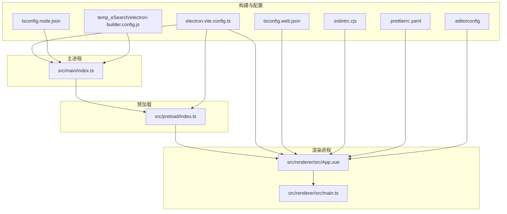
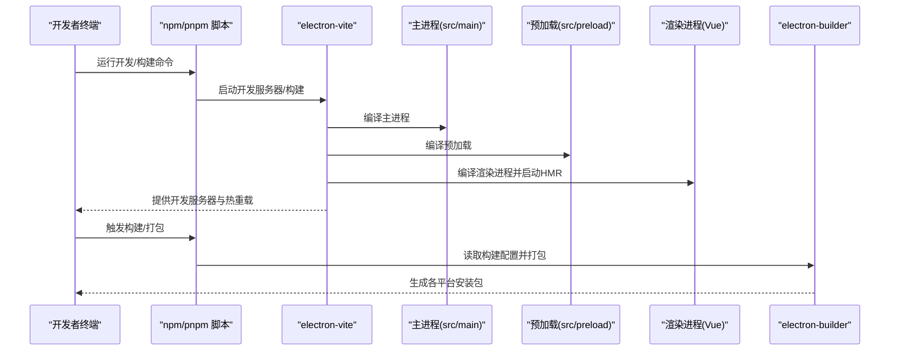
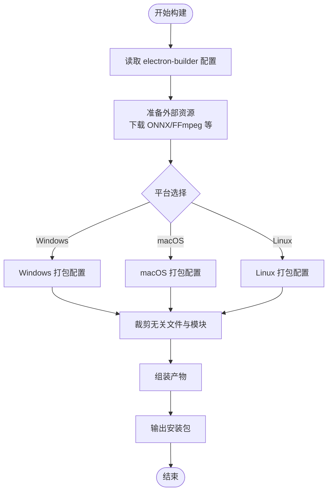
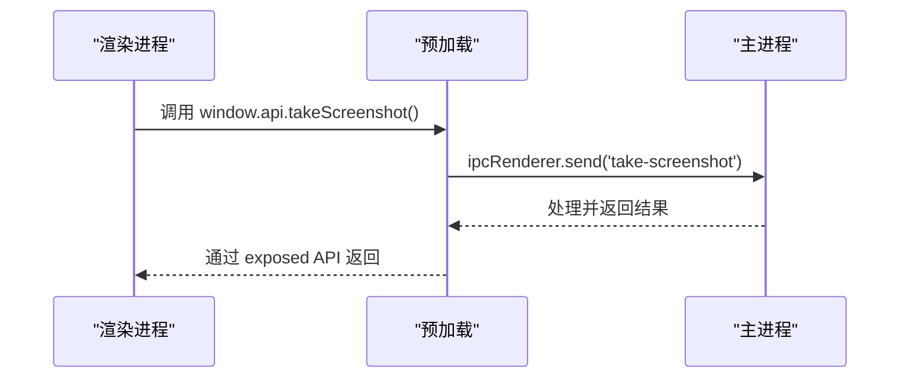
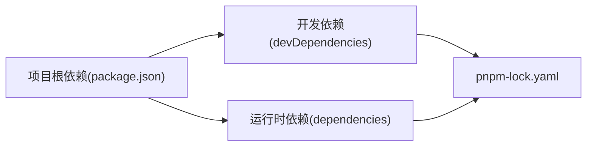

# 开发工作流

<cite>
**本文引用的文件**
- [package.json](file://package.json)
- [pnpm-lock.yaml](file://pnpm-lock.yaml)
- [electron.vite.config.ts](file://electron.vite.config.ts)
- [.eslintrc.cjs](file://.eslintrc.cjs)
- [.prettierrc.yaml](file://.prettierrc.yaml)
- [.editorconfig](file://.editorconfig)
- [temp_eSearch/electron-builder.config.js](file://temp_eSearch/electron-builder.config.js)
- [temp_eSearch/biome.json](file://temp_eSearch/biome.json)
- [tsconfig.json](file://tsconfig.json)
- [tsconfig.node.json](file://tsconfig.node.json)
- [tsconfig.web.json](file://tsconfig.web.json)
- [src/main/index.ts](file://src/main/index.ts)
- [src/preload/index.ts](file://src/preload/index.ts)
- [src/renderer/src/main.ts](file://src/renderer/src/main.ts)
- [src/renderer/src/App.vue](file://src/renderer/src/App.vue)
</cite>

## 目录
1. [简介](#简介)
2. [项目结构](#项目结构)
3. [核心组件](#核心组件)
4. [架构总览](#架构总览)
5. [详细组件分析](#详细组件分析)
6. [依赖分析](#依赖分析)
7. [性能考虑](#性能考虑)
8. [故障排查指南](#故障排查指南)
9. [结论](#结论)
10. [附录](#附录)

## 简介
本文件面向参与本项目的开发者，系统化梳理开发工作流与工程配置，覆盖以下主题：
- 开发脚本与命令：启动、热重载、调试、构建与打包
- 依赖管理策略：pnpm 使用、版本锁定、依赖更新与清理
- 开发环境设置：Node.js 版本、IDE/编辑器配置、调试工具
- 测试与质量保障：类型检查、代码风格与格式化、静态检查
- 团队协作：Git 工作流与代码审查建议

## 项目结构
本项目采用 Electron + Vue + TypeScript 的多进程架构，主要目录与职责如下：
- src/main：Electron 主进程源码，负责应用生命周期、窗口管理、系统集成、IPC 通信等
- src/preload：预加载脚本，向渲染进程暴露受限的 Electron API
- src/renderer：Vue 渲染进程前端，包含多个页面入口与组件
- temp_eSearch：扩展模块与构建相关资源（如 OCR/视频处理等），包含独立的构建配置与翻译资源
- 根目录配置：脚本、类型配置、代码规范与格式化配置

图表来源
- [electron.vite.config.ts](file://electron.vite.config.ts#L1-L60)
- [tsconfig.node.json](file://tsconfig.node.json#L1-L9)
- [tsconfig.web.json](file://tsconfig.web.json#L1-L19)
- [src/main/index.ts](file://src/main/index.ts#L1-L120)
- [src/preload/index.ts](file://src/preload/index.ts#L1-L63)
- [src/renderer/src/App.vue](file://src/renderer/src/App.vue#L1-L27)
- [temp_eSearch/electron-builder.config.js](file://temp_eSearch/electron-builder.config.js#L1-L120)

章节来源
- [electron.vite.config.ts](file://electron.vite.config.ts#L1-L60)
- [tsconfig.json](file://tsconfig.json#L1-L5)
- [tsconfig.node.json](file://tsconfig.node.json#L1-L9)
- [tsconfig.web.json](file://tsconfig.web.json#L1-L19)

## 核心组件
- 构建与开发工具链
  - electron-vite：统一管理主进程、预加载与渲染进程的构建与开发服务器
  - Vite 插件生态：Vue 支持、热重载、别名与端口配置
- 类型与规范
  - TypeScript：分层 tsconfig，分别约束主进程与渲染进程
  - ESLint + Prettier：统一风格与质量基线
  - Biome（可选）：导入整理、格式化与基础规则
- 打包与发布
  - electron-builder：跨平台打包、产物命名、平台特定配置与资源准备

章节来源
- [package.json](file://package.json#L9-L24)
- [electron.vite.config.ts](file://electron.vite.config.ts#L1-L60)
- [.eslintrc.cjs](file://.eslintrc.cjs#L1-L18)
- [.prettierrc.yaml](file://.prettierrc.yaml#L1-L5)
- [temp_eSearch/biome.json](file://temp_eSearch/biome.json#L1-L24)
- [temp_eSearch/electron-builder.config.js](file://temp_eSearch/electron-builder.config.js#L133-L268)

## 架构总览
下图展示从开发到构建的关键流程与组件交互。

图表来源
- [package.json](file://package.json#L9-L24)
- [electron.vite.config.ts](file://electron.vite.config.ts#L1-L60)
- [temp_eSearch/electron-builder.config.js](file://temp_eSearch/electron-builder.config.js#L133-L268)

## 详细组件分析

### 开发脚本与命令
- 启动与热重载
  - dev：启动 electron-vite 开发服务器，监听文件变化并热重载
  - start：预览构建产物（生产模式）
- 类型检查
  - typecheck：分别对主进程与渲染进程进行类型检查
- 质量与格式化
  - lint：ESLint 检查并自动修复
  - format：Prettier 统一格式化
- 构建与打包
  - build：构建主进程、预加载与渲染进程
  - build:win/mac/linux：按平台打包
  - build:unpack：先清理、再构建并生成未打包产物
- 其他
  - postinstall：安装 Electron 依赖（用于原生模块）

章节来源
- [package.json](file://package.json#L9-L24)

### 依赖管理策略（pnpm）
- 锁定文件
  - 使用 pnpm-lock.yaml 精确锁定依赖版本，确保团队一致性
- 版本策略
  - 通过 package.json 的语义化版本范围声明依赖；pnpm 依据锁文件解析
- 依赖更新
  - 建议使用 pnpm 的升级机制更新依赖，并提交新的 pnpm-lock.yaml
- 清理与重建
  - 如遇构建异常，可删除 node_modules/.pnpm 并重新安装

章节来源
- [pnpm-lock.yaml](file://pnpm-lock.yaml#L1-L20)
- [package.json](file://package.json#L25-L53)

### 开发环境设置
- Node.js 版本
  - 项目使用较新的 Node.js 版本（由依赖版本推断），建议使用与 CI/本地一致的版本
- IDE/编辑器配置
  - EditorConfig：统一缩进、换行与编码
  - Prettier：统一格式化风格
  - ESLint：统一代码风格与潜在问题检查
  - Biome（可选）：导入整理与基础规则
- 调试工具
  - 主进程：electron-vite 开发服务器支持调试
  - 渲染进程：F12 打开开发者工具
  - 预加载：通过 window.electron 与 window.api 暴露受限 API

章节来源
- [.editorconfig](file://.editorconfig#L1-L9)
- [.prettierrc.yaml](file://.prettierrc.yaml#L1-L5)
- [.eslintrc.cjs](file://.eslintrc.cjs#L1-L18)
- [temp_eSearch/biome.json](file://temp_eSearch/biome.json#L1-L24)
- [src/renderer/src/App.vue](file://src/renderer/src/App.vue#L16-L16)

### 类型系统与配置
- 分层 tsconfig
  - tsconfig.node.json：约束主进程与预加载的编译选项
  - tsconfig.web.json：约束渲染进程与类型路径别名
  - tsconfig.json：聚合两个配置
- 关键编译选项
  - composite：启用增量编译
  - baseUrl/paths：为渲染进程提供路径别名支持

章节来源
- [tsconfig.json](file://tsconfig.json#L1-L5)
- [tsconfig.node.json](file://tsconfig.node.json#L1-L9)
- [tsconfig.web.json](file://tsconfig.web.json#L1-L19)
- [electron.vite.config.ts](file://electron.vite.config.ts#L30-L57)

### 构建与打包配置
- electron-vite
  - 主进程与预加载强制 CommonJS 输出，避免模块格式冲突
  - 渲染进程多入口（index/bubble/todo/update），支持 HMR
  - 别名与端口配置便于开发体验
- electron-builder
  - 平台化配置：Linux、macOS、Windows
  - 资源准备：下载 OCR/视频推理模型、FFmpeg 等二进制依赖
  - 产物命名与文件过滤：按平台裁剪多余资源
  - 依赖精简：移除非目标平台的原生模块与冗余文件

图表来源
- [temp_eSearch/electron-builder.config.js](file://temp_eSearch/electron-builder.config.js#L23-L128)
- [temp_eSearch/electron-builder.config.js](file://temp_eSearch/electron-builder.config.js#L133-L268)

章节来源
- [electron.vite.config.ts](file://electron.vite.config.ts#L1-L60)
- [temp_eSearch/electron-builder.config.js](file://temp_eSearch/electron-builder.config.js#L1-L350)

### IPC 与预加载桥接
- 预加载脚本通过 contextBridge 将受限 API 暴露给渲染进程
- 渲染进程通过 window.electron/ipcRenderer 与主进程通信
- 示例：发送 IPC、调用主进程方法、触发截图与待办事项等

图表来源
- [src/preload/index.ts](file://src/preload/index.ts#L16-L43)
- [src/main/index.ts](file://src/main/index.ts#L120-L120)

章节来源
- [src/preload/index.ts](file://src/preload/index.ts#L1-L63)
- [src/renderer/src/main.ts](file://src/renderer/src/main.ts#L1-L7)
- [src/renderer/src/App.vue](file://src/renderer/src/App.vue#L4-L4)

## 依赖分析
- 直接依赖
  - Electron 与 electron-vite：主进程与开发/构建核心
  - Vue 与 Vite：渲染进程与热重载
  - electron-store、electron-updater：应用数据与更新
- 开发依赖
  - ESLint、Prettier、TypeScript、Vue 工具链：质量与类型保障
- 锁定与解析
  - pnpm-lock.yaml 精确记录依赖树，避免版本漂移

图表来源
- [package.json](file://package.json#L25-L53)
- [pnpm-lock.yaml](file://pnpm-lock.yaml#L1-L20)

章节来源
- [package.json](file://package.json#L25-L53)
- [pnpm-lock.yaml](file://pnpm-lock.yaml#L1-L20)

## 性能考虑
- 构建优化
  - electron-vite 多入口与 HMR 提升开发效率
  - electron-builder 按平台裁剪资源，减少包体
- 运行时优化
  - 主/预加载强制 CommonJS，避免模块转换开销
  - 渲染进程使用别名与最小化入口，降低首屏加载时间
- 资源准备
  - 构建前下载 OCR/FFmpeg 等二进制，避免运行时延迟

[本节为通用指导，无需列出章节来源]

## 故障排查指南
- 开发服务器无法启动
  - 检查端口占用（默认 5174），必要时调整 electron.vite.config.ts 中的 server.port
  - 清理缓存并重启：删除 node_modules/.vite 并重新安装依赖
- 打包失败或产物缺失
  - 确认 electron-builder 配置中的平台与架构参数
  - 检查 beforePack 是否成功下载外部资源
- 类型检查报错
  - 分别运行 typecheck:node 与 typecheck:web，逐项修复
- 代码风格问题
  - 运行 lint 与 format，确保提交前通过 ESLint 与 Prettier

章节来源
- [electron.vite.config.ts](file://electron.vite.config.ts#L37-L43)
- [temp_eSearch/electron-builder.config.js](file://temp_eSearch/electron-builder.config.js#L23-L128)
- [package.json](file://package.json#L12-L13)
- [.eslintrc.cjs](file://.eslintrc.cjs#L1-L18)
- [.prettierrc.yaml](file://.prettierrc.yaml#L1-L5)

## 结论
本项目以 electron-vite 为核心，结合 TypeScript、ESLint、Prettier 与 electron-builder，形成一套高效、可维护的 Electron 开发工作流。通过分层配置与严格的依赖锁定，确保开发与构建的一致性；通过多入口与热重载提升迭代效率；通过平台化打包与资源裁剪优化最终产物。建议团队遵循本文档的脚本、依赖与质量规范，配合 Git 工作流与代码审查流程，持续提升交付质量。

[本节为总结，无需列出章节来源]

## 附录

### 开发命令速查
- 启动开发：dev
- 预览构建：start
- 类型检查：typecheck
- 代码检查与修复：lint
- 格式化：format
- 构建：build
- 打包：build:win / build:mac / build:linux
- 解包预览：build:unpack
- 安装后处理：postinstall

章节来源
- [package.json](file://package.json#L9-L24)

### Git 工作流与代码审查建议
- 分支策略
  - 主分支：稳定版本，仅合并经审查的特性分支
  - 特性分支：按功能拆分，短期存在，及时同步主分支
- 提交规范
  - 使用清晰的提交信息，描述变更目的与影响范围
- 代码审查
  - 至少一名维护者审查，关注代码质量、安全性与兼容性
  - 引入自动化检查（lint、format、typecheck）作为强制前置条件
- 发布流程
  - 通过 CI 触发打包与测试，确保产物一致性

[本节为通用建议，无需列出章节来源]