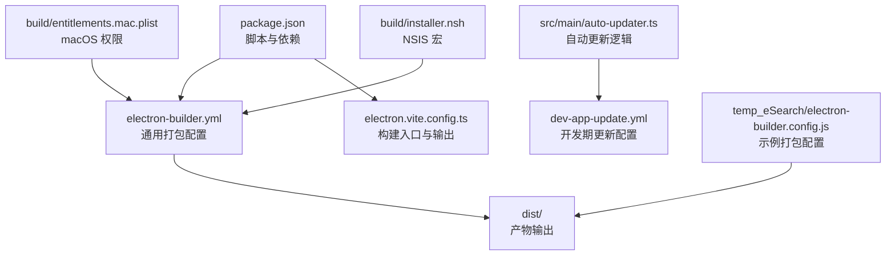
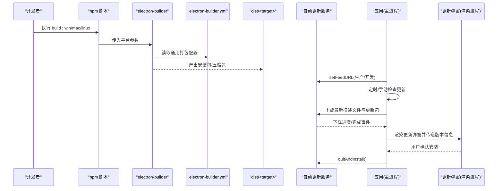
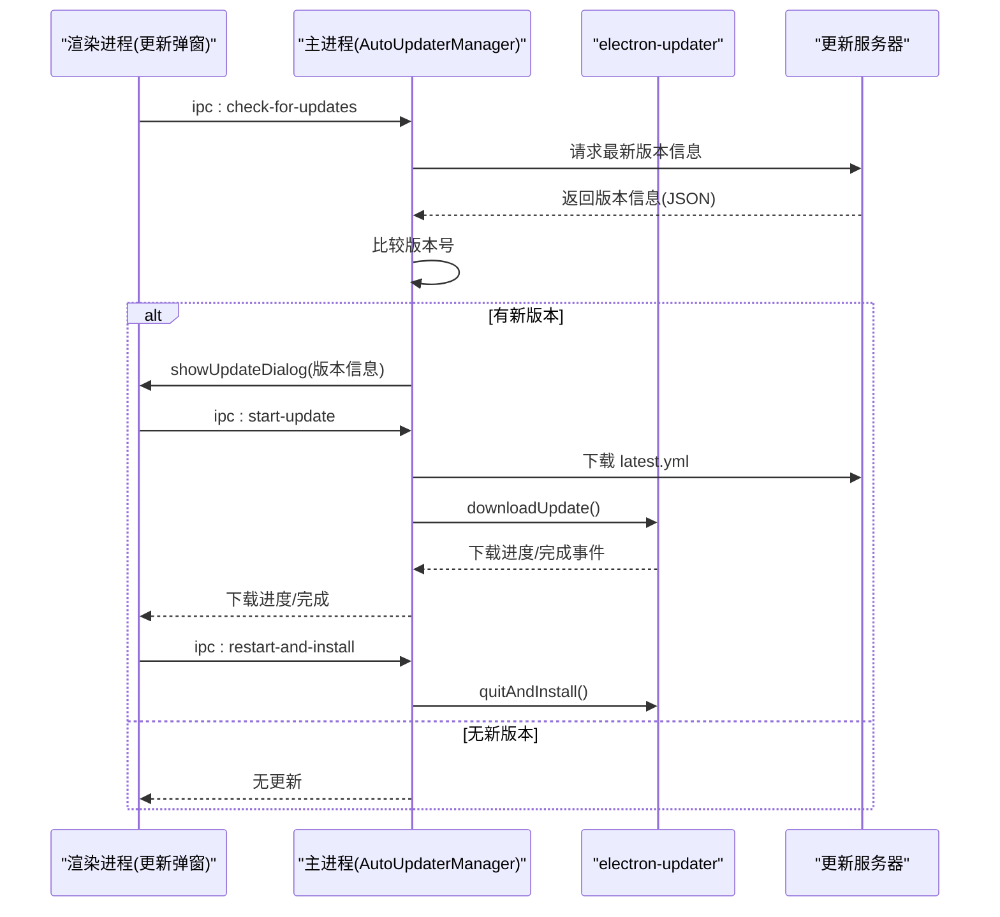
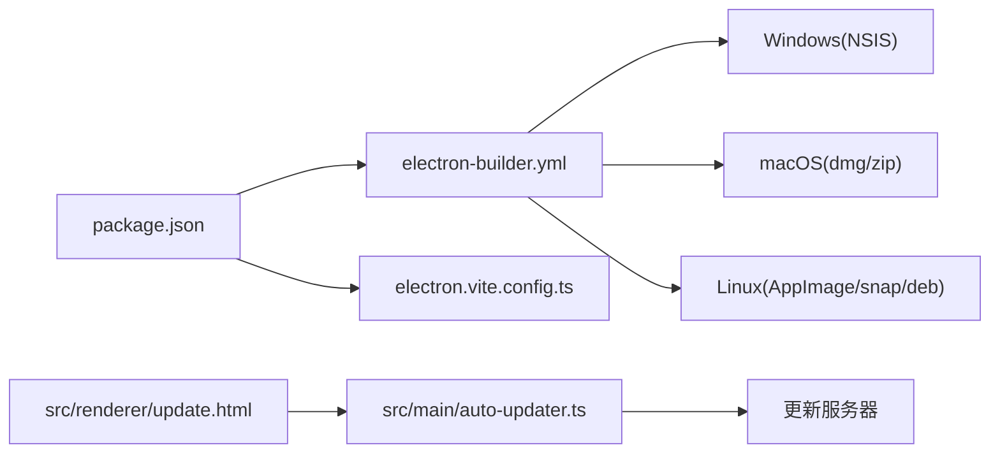

# 打包与分发

<cite>
**本文引用的文件**
- [electron-builder.yml](file://electron-builder.yml)
- [dev-app-update.yml](file://dev-app-update.yml)
- [package.json](file://package.json)
- [electron.vite.config.ts](file://electron.vite.config.ts)
- [src/main/auto-updater.ts](file://src/main/auto-updater.ts)
- [build/entitlements.mac.plist](file://build/entitlements.mac.plist)
- [build/installer.nsh](file://build/installer.nsh)
- [src/renderer/update.html](file://src/renderer/update.html)
- [src/renderer/src/update.ts](file://src/renderer/src/update.ts)
- [temp_eSearch/electron-builder.config.js](file://temp_eSearch/electron-builder.config.js)
</cite>

## 目录
1. [简介](#简介)
2. [项目结构](#项目结构)
3. [核心组件](#核心组件)
4. [架构总览](#架构总览)
5. [详细组件分析](#详细组件分析)
6. [依赖关系分析](#依赖关系分析)
7. [性能考量](#性能考量)
8. [故障排查指南](#故障排查指南)
9. [结论](#结论)
10. [附录](#附录)

## 简介
本文件面向需要为 Electron 应用建立稳定、可复现且跨平台的打包与分发流程的工程团队。内容覆盖：
- electron-builder 的配置要点与目标平台设置
- 图标资源与安装包命名规则
- 自动更新系统的配置与实现要点
- 跨平台打包策略（Windows、macOS、Linux）
- 代码签名与公证（macOS）的安全配置
- 发布流程最佳实践与常见问题处理

## 项目结构
本仓库同时包含主应用与一个示例/演示子项目（temp_eSearch），两者均使用 electron-builder 进行打包。主应用的打包配置集中在根目录的 YAML 配置文件与 package.json 的脚本中；自动更新逻辑位于主进程源码中；跨平台签名与安装器定制通过 macOS 权限清单与 NSIS 宏实现。

图表来源
- [package.json](file://package.json#L9-L24)
- [electron-builder.yml](file://electron-builder.yml#L1-L53)
- [electron.vite.config.ts](file://electron.vite.config.ts#L1-L60)
- [src/main/auto-updater.ts](file://src/main/auto-updater.ts#L1-L565)
- [build/entitlements.mac.plist](file://build/entitlements.mac.plist#L1-L13)
- [build/installer.nsh](file://build/installer.nsh#L1-L5)
- [temp_eSearch/electron-builder.config.js](file://temp_eSearch/electron-builder.config.js#L133-L268)

章节来源
- [package.json](file://package.json#L1-L55)
- [electron-builder.yml](file://electron-builder.yml#L1-L53)
- [electron.vite.config.ts](file://electron.vite.config.ts#L1-L60)

## 核心组件
- 打包配置与脚本
  - 通过 package.json 中的 scripts 定义跨平台构建命令，结合 electron-builder 的 CLI 参数实现按平台打包。
  - electron-builder.yml 提供通用打包参数，如输出目录、忽略规则、目标平台、安装器命名等。
- 自动更新系统
  - 主进程通过 electron-updater 订阅更新事件，按需下载与安装；更新元数据由外部 API 返回，包含版本号、下载链接、描述文件等。
  - 开发期与生产期分别指向不同的更新服务器地址，便于本地联调。
- 跨平台安装器与签名
  - Windows 使用 NSIS 安装器，支持自定义安装路径、桌面快捷方式、安装目录变更等。
  - macOS 使用权限清单 entitlements 并可启用公证开关；Linux 支持 AppImage、snap、deb 等目标。
- 构建入口与多页面
  - electron-vite 配置定义主进程、预加载与渲染进程入口，渲染侧包含多个 HTML 页面（含更新弹窗页）。

章节来源
- [package.json](file://package.json#L9-L24)
- [electron-builder.yml](file://electron-builder.yml#L1-L53)
- [src/main/auto-updater.ts](file://src/main/auto-updater.ts#L40-L186)
- [electron.vite.config.ts](file://electron.vite.config.ts#L5-L59)
- [src/renderer/update.html](file://src/renderer/update.html#L1-L12)
- [src/renderer/src/update.ts](file://src/renderer/src/update.ts#L1-L8)

## 架构总览
下图展示从“触发打包”到“生成安装包”的整体流程，以及自动更新在运行时的交互。

图表来源
- [package.json](file://package.json#L19-L23)
- [electron-builder.yml](file://electron-builder.yml#L48-L52)
- [src/main/auto-updater.ts](file://src/main/auto-updater.ts#L134-L186)
- [src/renderer/update.html](file://src/renderer/update.html#L1-L12)

## 详细组件分析

### electron-builder 配置详解
- 应用标识与输出
  - appId、productName 控制应用唯一标识与显示名称。
  - directories.output 指定打包产物输出目录；buildResources 指向构建期资源目录。
- 文件打包与排除
  - files 列表用于白名单/黑名单控制，避免将开发文件、配置文件、锁文件等打入安装包。
  - asarUnpack 可指定某些资源目录在解包模式下保持可写以便运行时修改。
- 平台目标与命名
  - win：设置可执行文件名、NSIS 安装包命名模板、桌面快捷方式名称、卸载项显示名等。
  - mac：配置权限继承文件、扩展 Info 字段（如相机/麦克风/文档/下载目录使用说明）、是否启用公证。
  - linux：目标包含 AppImage、snap、deb；设置维护者与分类。
  - artifactName 统一使用变量模板，便于跨平台一致命名。
- 更新与镜像
  - publish.provider 与 url 指定通用更新服务器地址；electronDownload.mirror 指定 Electron 下载镜像以提升国内构建稳定性。

章节来源
- [electron-builder.yml](file://electron-builder.yml#L1-L53)

### 自动更新系统配置与实现
- 更新服务器与版本管理
  - 通过 setFeedURL 指定通用更新源；开发/生产环境分别指向不同地址，便于联调与灰度。
  - 版本信息由外部 API 返回，包含版本号、下载地址、描述文件地址、文件大小、更新类型等。
- 下载与安装流程
  - 主进程定期或手动检查更新；当发现新版本时，根据更新类型决定是否弹窗、注入网页徽标、更新托盘菜单。
  - 开发环境模拟下载进度；生产环境下载最新描述文件与更新包，完成后触发安装。
- IPC 与 UI 协作
  - 通过 ipcMain.handle 暴露检查更新、获取当前版本、启动更新、重启安装等接口。
  - 更新弹窗页面在主进程创建 BrowserWindow 并加载 update.html，渲染层负责交互与展示。

图表来源
- [src/main/auto-updater.ts](file://src/main/auto-updater.ts#L82-L131)
- [src/main/auto-updater.ts](file://src/main/auto-updater.ts#L188-L252)
- [src/main/auto-updater.ts](file://src/main/auto-updater.ts#L435-L473)
- [src/renderer/update.html](file://src/renderer/update.html#L1-L12)

章节来源
- [src/main/auto-updater.ts](file://src/main/auto-updater.ts#L40-L565)
- [dev-app-update.yml](file://dev-app-update.yml#L1-L4)

### 跨平台打包指南

#### Windows
- 安装器与快捷方式
  - 使用 NSIS，支持桌面快捷方式、安装目录变更、单击安装与自定义脚本集成。
  - 可通过 include 引入自定义宏，实现安装前的路径预设等逻辑。
- 可执行文件命名与产物命名
  - executableName 控制可执行文件名；artifactName 控制安装包命名模板。
- 依赖与体积优化
  - 可配合文件排除规则减少安装包体积，或在 CI 中缓存依赖以加速构建。

章节来源
- [electron-builder.yml](file://electron-builder.yml#L15-L27)
- [build/installer.nsh](file://build/installer.nsh#L1-L5)

#### macOS
- 权限与公证
  - 通过 entitlementsInherit 指向权限清单文件，启用 JIT/动态加载等能力。
  - extendInfo 注入 Info.plist 扩展字段，满足隐私与访问权限声明。
  - notarize 开关控制是否启用公证（建议在发布前开启）。
- 产物与签名
  - 支持 dmg 与 zip 目标；可结合签名证书完成签名与公证流程。
- 依赖与体积优化
  - 可通过文件排除规则减少无关平台二进制文件。

章节来源
- [electron-builder.yml](file://electron-builder.yml#L28-L35)
- [build/entitlements.mac.plist](file://build/entitlements.mac.plist#L1-L13)

#### Linux
- 多目标支持
  - 支持 AppImage、snap、deb；可按架构与发行版定制依赖。
- 维护者与分类
  - maintainer 与 category 用于规范软件中心与包管理器展示。
- 依赖与体积优化
  - 可通过 depends 指定系统依赖，结合文件排除规则减小体积。

章节来源
- [electron-builder.yml](file://electron-builder.yml#L38-L46)

### 代码签名与公证（macOS）
- 权限清单
  - entitlements.mac.plist 启用必要的运行时能力，确保应用在沙箱与安全策略下正常工作。
- 公证流程
  - 建议在 CI 中配置 Apple ID 凭据与公证开关，确保 dmg/zip 产物通过 Gatekeeper 校验。
- 证书与团队信息
  - 在 CI 或本地配置正确的开发者证书与团队信息，避免签名失败。

章节来源
- [build/entitlements.mac.plist](file://build/entitlements.mac.plist#L1-L13)
- [electron-builder.yml](file://electron-builder.yml#L28-L35)

### 安装包定制与图标资源
- 图标资源
  - Windows 使用 icon.ico；macOS 使用 icon.icns；Linux 使用目录式图标资源。
- 安装包命名
  - 通过 artifactName 统一命名模板，便于自动化识别与归档。
- 自定义安装脚本
  - NSIS 宏可在安装前预设安装路径等行为，提升用户体验。

章节来源
- [electron-builder.yml](file://electron-builder.yml#L15-L17)
- [electron-builder.yml](file://electron-builder.yml#L38-L46)
- [build/installer.nsh](file://build/installer.nsh#L1-L5)

### 示例项目打包配置参考
- temp_eSearch/electron-builder.config.js 展示了更复杂的打包策略，包括：
  - beforePack 阶段下载 OCR/分割/FFmpeg 等运行时依赖，确保安装包具备完整功能。
  - afterPack 阶段按平台裁剪语言包，减少体积。
  - 针对不同平台与架构的文件排除规则，避免引入无关二进制。
  - artifactName 包含平台与架构信息，便于区分多目标产物。

章节来源
- [temp_eSearch/electron-builder.config.js](file://temp_eSearch/electron-builder.config.js#L23-L128)
- [temp_eSearch/electron-builder.config.js](file://temp_eSearch/electron-builder.config.js#L236-L267)
- [temp_eSearch/electron-builder.config.js](file://temp_eSearch/electron-builder.config.js#L133-L268)

## 依赖关系分析
- 打包阶段
  - package.json 的 scripts 与 electron-builder 配置共同驱动打包；electron-vite 负责前端构建与多页面入口。
- 运行时更新
  - 主进程依赖 electron-updater；更新服务器返回的元数据驱动下载与安装。
- 平台差异
  - Windows 依赖 NSIS；macOS 依赖权限清单与公证；Linux 依赖各发行版包格式。

图表来源
- [package.json](file://package.json#L9-L24)
- [electron-builder.yml](file://electron-builder.yml#L1-L53)
- [electron.vite.config.ts](file://electron.vite.config.ts#L5-L59)
- [src/main/auto-updater.ts](file://src/main/auto-updater.ts#L134-L186)
- [src/renderer/update.html](file://src/renderer/update.html#L1-L12)

章节来源
- [package.json](file://package.json#L1-L55)
- [electron-builder.yml](file://electron-builder.yml#L1-L53)
- [electron.vite.config.ts](file://electron.vite.config.ts#L1-L60)
- [src/main/auto-updater.ts](file://src/main/auto-updater.ts#L1-L565)

## 性能考量
- 构建性能
  - 使用 npmRebuild=false 降低 Node 原生模块重建开销；electronDownload.mirror 提升 Electron 下载速度。
  - 在 CI 中缓存 node_modules 与 Electron 缓存，缩短构建时间。
- 产物体积
  - 通过 files 排除规则与 afterPack 裁剪语言包，显著减少安装包体积。
  - 对于大型依赖（如 FFmpeg、ONNX 模型），考虑在运行时按需下载或分发独立组件。
- 更新体验
  - 在开发环境模拟下载进度，提升调试效率；生产环境启用真实下载与断点续传（若服务器支持）。

章节来源
- [electron-builder.yml](file://electron-builder.yml#L47-L52)
- [temp_eSearch/electron-builder.config.js](file://temp_eSearch/electron-builder.config.js#L236-L267)

## 故障排查指南
- 打包失败
  - 检查 electron-builder.yml 的输出目录与忽略规则是否正确；确认图标资源路径存在。
  - 若 Windows 打包失败，检查 NSIS 依赖与安装器宏是否正确。
- 自动更新异常
  - 确认 setFeedURL 指向的更新服务器可达；检查返回的版本信息结构与字段是否匹配。
  - 若下载进度异常，检查网络与代理设置；开发环境可观察模拟进度日志。
- macOS 签名与公证
  - 确认 entitlements 文件路径正确；在 CI 中配置 Apple ID 与证书；notarize 开关按需开启。
- Linux 包体问题
  - 检查 depends 与目标发行版兼容性；确认文件排除规则未误删必要文件。

章节来源
- [electron-builder.yml](file://electron-builder.yml#L1-L53)
- [src/main/auto-updater.ts](file://src/main/auto-updater.ts#L134-L186)
- [build/entitlements.mac.plist](file://build/entitlements.mac.plist#L1-L13)

## 结论
通过统一的 electron-builder 配置、清晰的跨平台打包策略与完善的自动更新机制，可以实现稳定、可复现且用户体验良好的应用分发。建议在 CI 中固化签名与公证流程，结合体积优化与镜像加速，持续提升构建与发布的可靠性。

## 附录
- 常用命令
  - 开发预览：npm run start
  - 构建：npm run build
  - 打包（Windows/macOS/Linux）：npm run build:win / build:mac / build:linux
  - 开发期更新配置：dev-app-update.yml
- 最佳实践
  - 将更新服务器与签名证书纳入 CI 密钥管理；对安装包进行完整性校验与数字签名。
  - 在发布前进行多平台回归测试，确保安装器与自动更新流程一致。