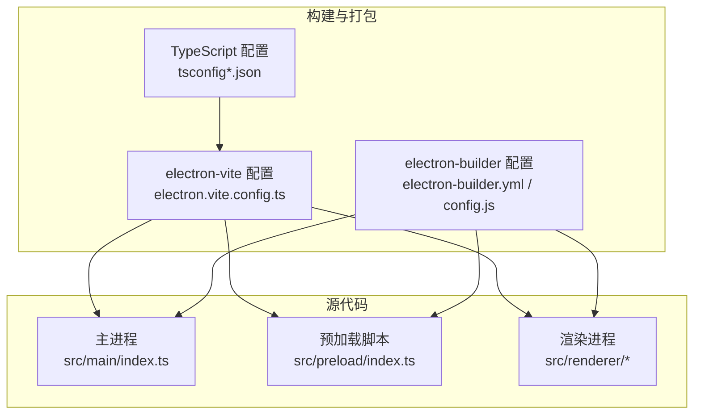
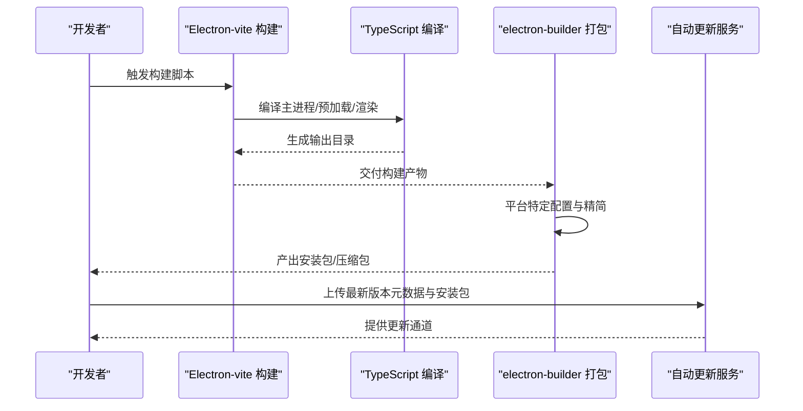
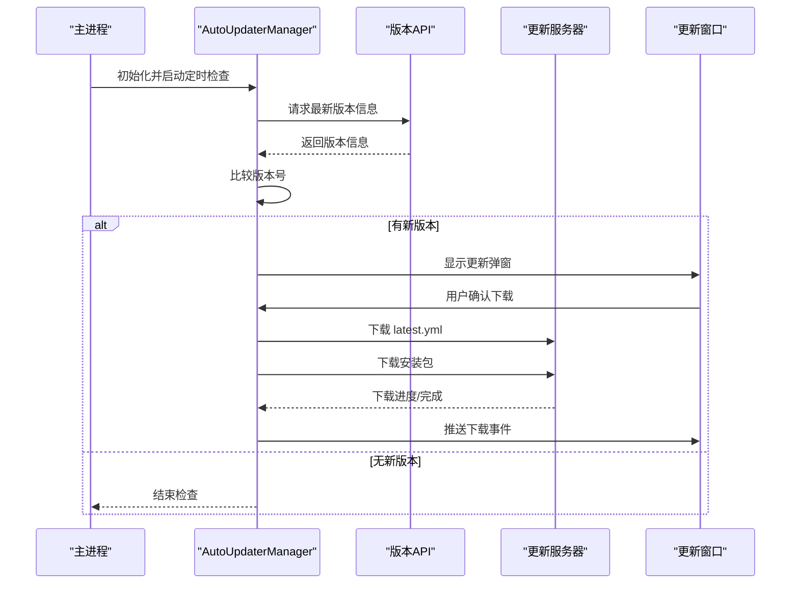
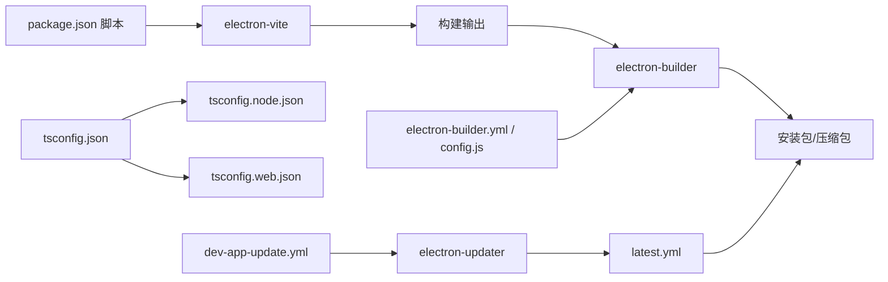

# 构建与部署

<cite>
**本文引用的文件**   
- [package.json](file://package.json)
- [electron.vite.config.ts](file://electron.vite.config.ts)
- [tsconfig.json](file://tsconfig.json)
- [tsconfig.node.json](file://tsconfig.node.json)
- [tsconfig.web.json](file://tsconfig.web.json)
- [electron-builder.config.js](file://temp_eSearch/electron-builder.config.js)
- [electron-builder.yml](file://electron-builder.yml)
- [dev-app-update.yml](file://dev-app-update.yml)
- [src/main/auto-updater.ts](file://src/main/auto-updater.ts)
- [src/main/index.ts](file://src/main/index.ts)
- [src/preload/index.ts](file://src/preload/index.ts)
- [ARCHITECTURE.md](file://ARCHITECTURE.md)
- [dist/latest.yml](file://dist/latest.yml)
</cite>

## 目录
1. [简介](#简介)
2. [项目结构](#项目结构)
3. [核心组件](#核心组件)
4. [架构总览](#架构总览)
5. [详细组件分析](#详细组件分析)
6. [依赖关系分析](#依赖关系分析)
7. [性能考量](#性能考量)
8. [故障排查指南](#故障排查指南)
9. [结论](#结论)
10. [附录](#附录)

## 简介
本文件面向构建与部署流程，系统性阐述以下内容：
- Electron-vite 构建配置与 TypeScript 编译设置
- electron-builder 打包配置（含平台特定设置、签名与自动更新）
- 完整发布流程（开发测试、构建打包、版本管理）
- CI/CD 集成与自动化部署建议
- 不同平台部署差异与注意事项

## 项目结构
本项目采用 Electron-vite + Vue + TypeScript 的多进程架构，源码分为主进程、预加载脚本与渲染进程三大部分；打包阶段由 electron-builder 完成。

图表来源
- [electron.vite.config.ts](file://electron.vite.config.ts#L1-L60)
- [tsconfig.json](file://tsconfig.json#L1-L5)
- [tsconfig.node.json](file://tsconfig.node.json#L1-L9)
- [tsconfig.web.json](file://tsconfig.web.json#L1-L19)
- [electron-builder.yml](file://electron-builder.yml#L1-L53)
- [src/main/index.ts](file://src/main/index.ts#L1-L120)
- [src/preload/index.ts](file://src/preload/index.ts#L1-L63)

章节来源
- [ARCHITECTURE.md](file://ARCHITECTURE.md#L1-L120)
- [electron.vite.config.ts](file://electron.vite.config.ts#L1-L60)
- [tsconfig.json](file://tsconfig.json#L1-L5)
- [tsconfig.node.json](file://tsconfig.node.json#L1-L9)
- [tsconfig.web.json](file://tsconfig.web.json#L1-L19)
- [electron-builder.yml](file://electron-builder.yml#L1-L53)

## 核心组件
- 构建工具链
  - Electron-vite：多入口（主进程、预加载、渲染）构建与开发服务器
  - TypeScript：分层 tsconfig（node/web）分别约束主进程与渲染进程
- 打包工具
  - electron-builder：跨平台打包、安装器生成、产物精简与平台特定配置
- 自动更新
  - electron-updater：通用提供者（generic）配合服务端元数据文件（latest.yml）

章节来源
- [package.json](file://package.json#L9-L24)
- [electron.vite.config.ts](file://electron.vite.config.ts#L1-L60)
- [tsconfig.json](file://tsconfig.json#L1-L5)
- [tsconfig.node.json](file://tsconfig.node.json#L1-L9)
- [tsconfig.web.json](file://tsconfig.web.json#L1-L19)
- [electron-builder.yml](file://electron-builder.yml#L1-L53)
- [src/main/auto-updater.ts](file://src/main/auto-updater.ts#L1-L60)

## 架构总览
下图展示从开发到发布的端到端流程，涵盖构建、打包、签名与自动更新的关键节点。

图表来源
- [package.json](file://package.json#L9-L24)
- [electron.vite.config.ts](file://electron.vite.config.ts#L1-L60)
- [electron-builder.yml](file://electron-builder.yml#L1-L53)
- [src/main/auto-updater.ts](file://src/main/auto-updater.ts#L134-L186)

## 详细组件分析

### Electron-vite 构建配置
- 多入口与格式
  - 主进程与预加载强制 CommonJS 输出，保证 Node 环境兼容
  - 渲染进程使用 Vue 插件与别名映射，开发服务器端口可配置
- 输入清单
  - 主进程：入口脚本
  - 预加载：多入口（主预加载与气泡预加载）
  - 渲染进程：多页面入口（主界面、气泡、待办、更新页）
- 开发与预览
  - dev/watch 模式与 preview 模式，便于联调

章节来源
- [electron.vite.config.ts](file://electron.vite.config.ts#L5-L59)

### TypeScript 编译设置
- 根 tsconfig 引用分层配置
  - node 层：包含主进程与预加载，启用复合编译与 electron-vite/node 类型
  - web 层：包含渲染与预加载类型声明，配置路径别名
- 作用域隔离：主进程与渲染进程分别编译，避免相互污染

章节来源
- [tsconfig.json](file://tsconfig.json#L1-L5)
- [tsconfig.node.json](file://tsconfig.node.json#L1-L9)
- [tsconfig.web.json](file://tsconfig.web.json#L1-L19)

### electron-builder 打包配置
- 基础信息与目录
  - appId、产品名、输出目录、图标路径
- 下载镜像与重建策略
  - Electron 下载镜像、禁用 npm 重建
- 文件关联与打包策略
  - MIME 关联、禁用 asar、产物命名模板
- 平台特定配置
  - Linux：tar.gz、deb、rpm、AppImage，依赖 ffmpeg，裁剪无关二进制
  - macOS：dmg/zip，裁剪无关二进制与图标
  - Windows：NSIS 安装器与 zip，裁剪无关二进制与图标
- 安装器细节
  - NSIS：可选安装目录、单击安装、差分包关闭
- 生命周期钩子
  - beforePack：按平台下载/准备运行时依赖（如 ONNX、FFmpeg、copy.exe）
  - afterPack：按平台清理多余语言包
- 产物精简
  - 通过 files 列表排除大量开发与调试文件、第三方源码与构建产物

章节来源
- [electron-builder.config.js](file://temp_eSearch/electron-builder.config.js#L133-L349)
- [electron-builder.yml](file://electron-builder.yml#L1-L53)

### 自动更新配置与实现
- 配置文件
  - dev-app-update.yml：指定通用提供者与更新服务器地址、缓存目录
- 主进程集成
  - 初始化 AutoUpdaterManager，注册 IPC 处理器与事件监听
  - 设置 feed URL（开发/生产），控制下载与安装策略
- 更新流程
  - 定时轮询版本 API，比较版本号，触发更新弹窗或托盘提示
  - 下载 latest.yml，再下载安装包，支持进度事件与错误处理
  - 开发模式下模拟下载进度，便于联调

图表来源
- [src/main/auto-updater.ts](file://src/main/auto-updater.ts#L59-L186)
- [dev-app-update.yml](file://dev-app-update.yml#L1-L4)

章节来源
- [src/main/auto-updater.ts](file://src/main/auto-updater.ts#L1-L565)
- [dev-app-update.yml](file://dev-app-update.yml#L1-L4)
- [dist/latest.yml](file://dist/latest.yml#L1-L9)

### 预加载与主进程桥接
- 预加载脚本通过 contextBridge 暴露受限 API 至渲染进程，兼顾安全与易用
- 主进程通过 ipcMain 暴露能力，更新管理器通过 IPC 与渲染层交互

章节来源
- [src/preload/index.ts](file://src/preload/index.ts#L1-L63)
- [src/main/index.ts](file://src/main/index.ts#L105-L110)

## 依赖关系分析
- 构建链路
  - package.json scripts -> electron-vite -> 输出目录 -> electron-builder
- 类型链路
  - tsconfig.json 引用 node/web 配置 -> 分别编译主进程/渲染进程
- 打包链路
  - electron-builder.yml/config.js -> 平台裁剪 -> 产物生成
- 更新链路
  - dev-app-update.yml -> electron-updater -> 最新版本元数据 -> 安装包

图表来源
- [package.json](file://package.json#L9-L24)
- [electron.vite.config.ts](file://electron.vite.config.ts#L1-L60)
- [tsconfig.json](file://tsconfig.json#L1-L5)
- [tsconfig.node.json](file://tsconfig.node.json#L1-L9)
- [tsconfig.web.json](file://tsconfig.web.json#L1-L19)
- [electron-builder.yml](file://electron-builder.yml#L1-L53)
- [electron-builder.config.js](file://temp_eSearch/electron-builder.config.js#L133-L349)
- [dev-app-update.yml](file://dev-app-update.yml#L1-L4)
- [dist/latest.yml](file://dist/latest.yml#L1-L9)

章节来源
- [package.json](file://package.json#L9-L24)
- [electron-builder.yml](file://electron-builder.yml#L1-L53)
- [electron-builder.config.js](file://temp_eSearch/electron-builder.config.js#L133-L349)

## 性能考量
- 构建性能
  - electron-vite 的多入口与开发服务器可显著缩短热更新时间
  - 禁用 asar 便于调试，但会增大体积；生产可考虑开启 asar 以提升加载性能
- 打包体积
  - 通过 beforePack/afterPack 与 files 排除策略，大幅减少产物体积
  - Linux/macOS/Windows 分平台裁剪，避免携带无关架构与语言包
- 运行时性能
  - 渲染进程背景节流关闭、上下文隔离与 Node 集成按需启用，需权衡安全与性能

章节来源
- [electron-builder.config.js](file://temp_eSearch/electron-builder.config.js#L164-L349)
- [electron-builder.yml](file://electron-builder.yml#L47-L53)
- [src/main/index.ts](file://src/main/index.ts#L286-L301)

## 故障排查指南
- 构建失败
  - 检查 electron-vite 多入口与 Rollup 输出格式是否匹配平台
  - 确认 tsconfig 分层配置正确，避免类型冲突
- 打包异常
  - 核对 electron-builder 的平台目标与架构参数
  - 确认 beforePack 是否成功下载运行时依赖（ONNX/FFmpeg/copy.exe）
- 自动更新问题
  - 确认 dev-app-update.yml 的 provider/url 与实际服务一致
  - 检查 latest.yml 的版本号、文件列表与校验信息
  - 开发模式下模拟下载进度，定位网络或权限问题

章节来源
- [electron.vite.config.ts](file://electron.vite.config.ts#L1-L60)
- [tsconfig.json](file://tsconfig.json#L1-L5)
- [electron-builder.config.js](file://temp_eSearch/electron-builder.config.js#L23-L128)
- [dev-app-update.yml](file://dev-app-update.yml#L1-L4)
- [dist/latest.yml](file://dist/latest.yml#L1-L9)

## 结论
本项目以 Electron-vite 与 electron-builder 为核心，结合 TypeScript 分层编译与自动更新机制，形成一套可移植、可维护的构建与发布体系。通过平台特定裁剪与生命周期钩子，有效平衡了体积、安全与体验。建议在生产环境进一步收紧安全策略、完善测试与监控，并在 CI/CD 中固化上述流程。

## 附录

### 发布流程指南（开发测试 → 打包构建 → 版本管理）
- 开发测试
  - 使用 dev 脚本启动开发服务器，预览渲染页面与主进程逻辑
  - 使用 typecheck 脚本进行类型检查
- 构建打包
  - 执行 build 脚本生成构建产物
  - 使用 build:win/build:mac/build:linux 生成对应平台安装包
  - 如需本地预览安装效果，可使用 build:unpack 生成可运行目录
- 版本管理
  - 升级 package.json 中的版本号
  - 生成最新版本元数据（latest.yml）并上传至更新服务器
  - 校验安装包完整性与签名（见签名认证章节）

章节来源
- [package.json](file://package.json#L9-L24)
- [dist/latest.yml](file://dist/latest.yml#L1-L9)

### CI/CD 集成与自动化部署建议
- 环境准备
  - 为各平台准备独立构建矩阵（Windows/macOS/Linux）
  - 预先缓存依赖（pnpm）、Electron 下载镜像与运行时依赖
- 关键步骤
  - 安装依赖与安装 App 依赖
  - 类型检查与构建
  - 打包与产物归档
  - 自动更新元数据生成与上传
- 安全与合规
  - 在 CI 中启用签名与公证（见签名认证章节）
  - 对产物进行哈希校验与漏洞扫描

[本节为通用实践建议，不直接分析具体文件，故无“章节来源”]

### 平台差异与注意事项
- Windows
  - 使用 NSIS 安装器，支持 per-machine 安装与自定义脚本
  - 注意清理无关架构与语言包，避免安装包过大
- macOS
  - 支持 dmg/zip，注意 entitlements 与 notarize 配置
  - 遵循 Apple 审核要求，避免敏感权限滥用
- Linux
  - 多目标（AppImage、deb、rpm、tar.gz），按发行版选择合适目标
  - 依赖 ffmpeg，确保运行时可用

章节来源
- [electron-builder.config.js](file://temp_eSearch/electron-builder.config.js#L164-L230)
- [electron-builder.yml](file://electron-builder.yml#L15-L47)

### 签名认证与公证
- Windows
  - 在 CI 中配置代码签名证书与密码，使用 electron-builder 的签名选项
- macOS
  - 配置 entitlements 与 notarize，确保通过 Gatekeeper 校验
- Linux
  - 通常无需签名；如需商店分发，遵循相应渠道要求

[本节为通用实践建议，不直接分析具体文件，故无“章节来源”]