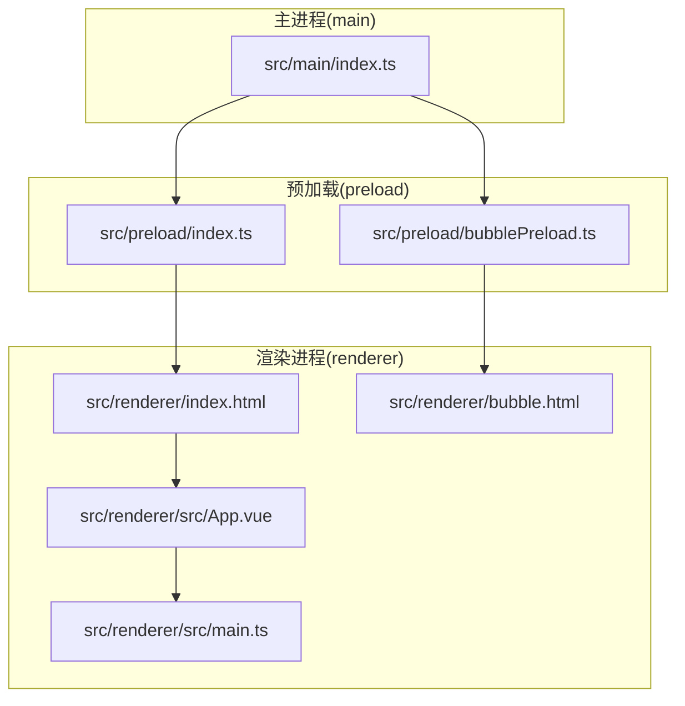
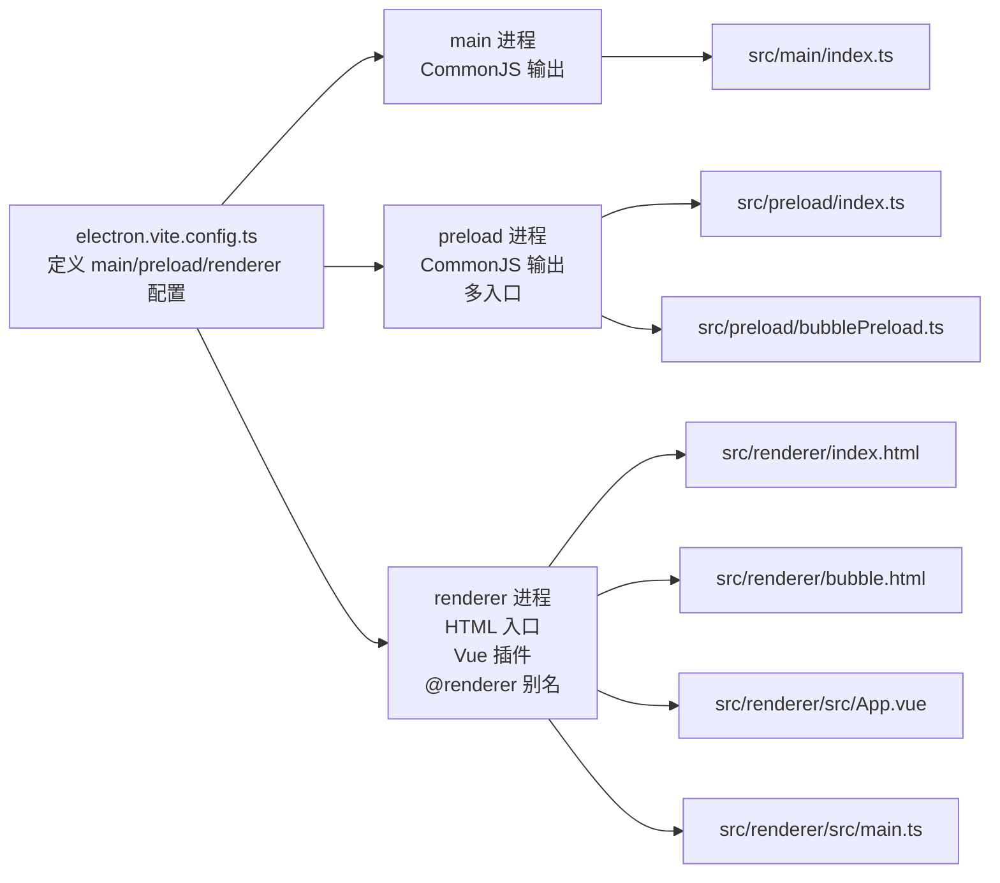
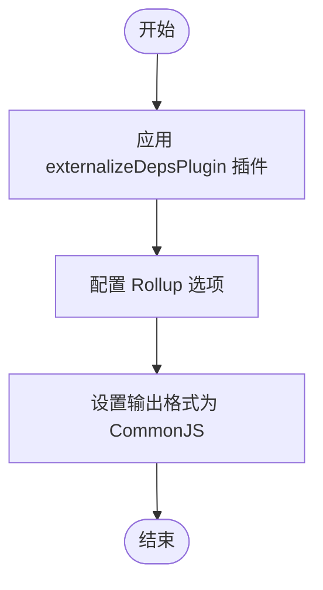
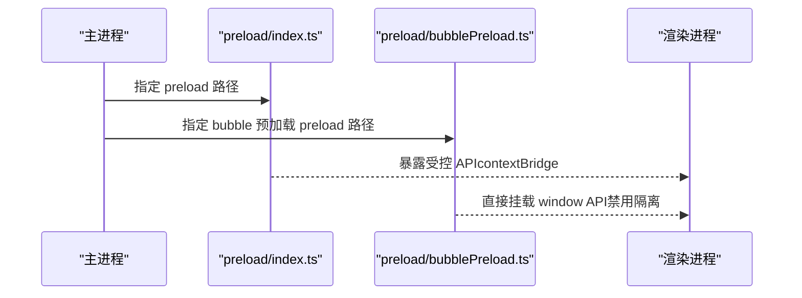
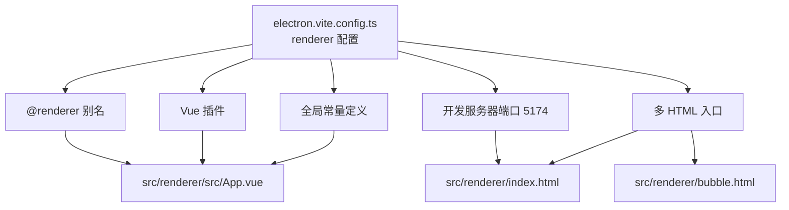
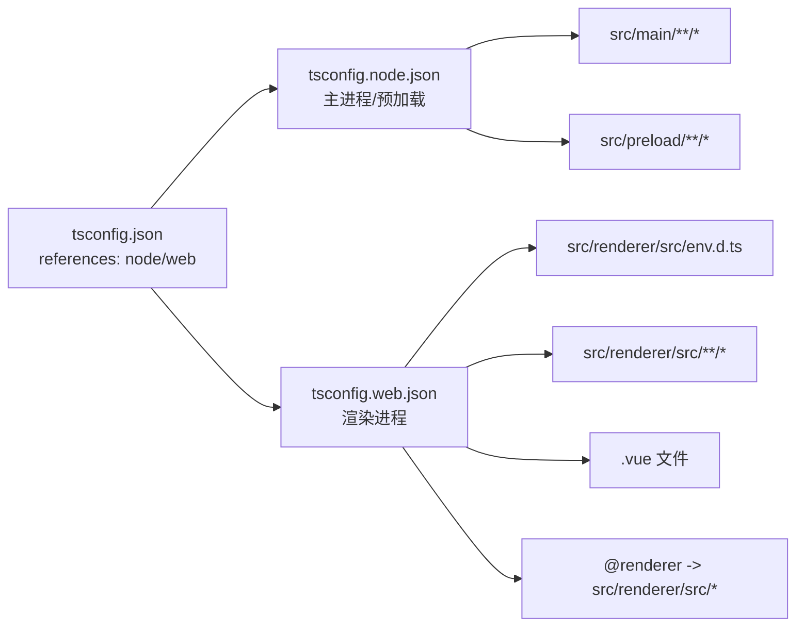
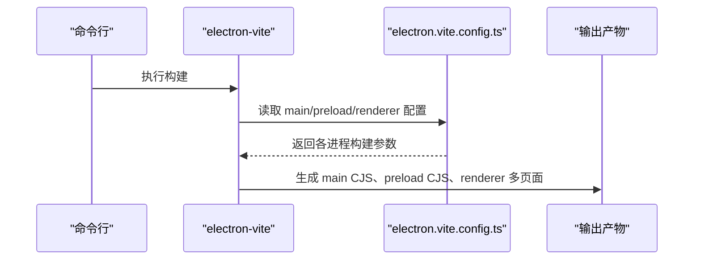
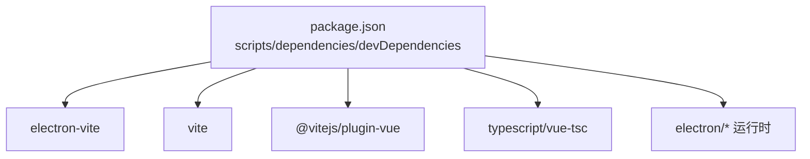

# 构建配置

<cite>
**本文引用的文件**
- [electron.vite.config.ts](file://electron.vite.config.ts)
- [tsconfig.json](file://tsconfig.json)
- [tsconfig.node.json](file://tsconfig.node.json)
- [tsconfig.web.json](file://tsconfig.web.json)
- [package.json](file://package.json)
- [src/main/index.ts](file://src/main/index.ts)
- [src/preload/index.ts](file://src/preload/index.ts)
- [src/preload/bubblePreload.ts](file://src/preload/bubblePreload.ts)
- [src/renderer/src/main.ts](file://src/renderer/src/main.ts)
- [src/renderer/src/App.vue](file://src/renderer/src/App.vue)
- [src/renderer/index.html](file://src/renderer/index.html)
- [src/renderer/bubble.html](file://src/renderer/bubble.html)
</cite>

## 目录
1. [简介](#简介)
2. [项目结构](#项目结构)
3. [核心组件](#核心组件)
4. [架构总览](#架构总览)
5. [详细组件分析](#详细组件分析)
6. [依赖分析](#依赖分析)
7. [性能考虑](#性能考虑)
8. [故障排查指南](#故障排查指南)
9. [结论](#结论)
10. [附录](#附录)

## 简介
本文件系统性梳理本项目的构建配置，围绕 electron-vite 的多进程配置（main、preload、renderer）展开，详解 TypeScript 编译分层（tsconfig.json、tsconfig.node.json、tsconfig.web.json），并结合 Rollup 构建选项、别名与插件体系，给出开发与生产环境差异、优化建议与性能调优方案。

## 项目结构
本项目采用多进程架构：
- main 进程：应用主逻辑、窗口管理、IPC、自动更新等
- preload 进程：为 renderer 暴露受限 API，实现 contextBridge 或直接挂载 window API
- renderer 进程：基于 Vue 的前端界面，支持多页面（index、bubble、todo、update）

图表来源
- [src/main/index.ts](file://src/main/index.ts#L286-L301)
- [src/preload/index.ts](file://src/preload/index.ts#L1-L63)
- [src/preload/bubblePreload.ts](file://src/preload/bubblePreload.ts#L1-L70)
- [src/renderer/index.html](file://src/renderer/index.html#L1-L18)
- [src/renderer/bubble.html](file://src/renderer/bubble.html#L1-L33)
- [src/renderer/src/App.vue](file://src/renderer/src/App.vue#L1-L27)
- [src/renderer/src/main.ts](file://src/renderer/src/main.ts#L1-L7)

章节来源
- [electron.vite.config.ts](file://electron.vite.config.ts#L5-L59)
- [src/main/index.ts](file://src/main/index.ts#L286-L301)
- [src/preload/index.ts](file://src/preload/index.ts#L1-L63)
- [src/preload/bubblePreload.ts](file://src/preload/bubblePreload.ts#L1-L70)
- [src/renderer/index.html](file://src/renderer/index.html#L1-L18)
- [src/renderer/bubble.html](file://src/renderer/bubble.html#L1-L33)
- [src/renderer/src/App.vue](file://src/renderer/src/App.vue#L1-L27)
- [src/renderer/src/main.ts](file://src/renderer/src/main.ts#L1-L7)

## 核心组件
- electron-vite 配置：分别对 main、preload、renderer 进程进行独立构建与插件配置，并指定输入输出入口与格式。
- TypeScript 分层配置：通过根 tsconfig.json 统一引用 node 与 web 两套编译配置，分别约束 main/preload 与 renderer 的类型检查范围与路径别名。
- 插件与别名：renderer 进程启用 Vue 插件；通过路径别名 @renderer 指向 src/renderer/src，提升导入可读性。
- 开发服务器：renderer 进程配置了独立端口，便于热更新与调试。

章节来源
- [electron.vite.config.ts](file://electron.vite.config.ts#L5-L59)
- [tsconfig.json](file://tsconfig.json#L1-L5)
- [tsconfig.node.json](file://tsconfig.node.json#L1-L9)
- [tsconfig.web.json](file://tsconfig.web.json#L1-L19)
- [package.json](file://package.json#L9-L24)

## 架构总览
electron-vite 将三类进程的构建解耦，形成清晰的职责边界：
- main：强制 CommonJS 输出，避免 ESM 与 Electron 主进程生态兼容问题
- preload：强制 CommonJS 输出，支持多入口（index 与 bubblePreload）
- renderer：基于 HTML 入口，启用 Vue 插件与路径别名，配置开发服务器端口

图表来源
- [electron.vite.config.ts](file://electron.vite.config.ts#L5-L59)
- [src/main/index.ts](file://src/main/index.ts#L1-L13)
- [src/preload/index.ts](file://src/preload/index.ts#L1-L63)
- [src/preload/bubblePreload.ts](file://src/preload/bubblePreload.ts#L1-L70)
- [src/renderer/index.html](file://src/renderer/index.html#L1-L18)
- [src/renderer/bubble.html](file://src/renderer/bubble.html#L1-L33)
- [src/renderer/src/App.vue](file://src/renderer/src/App.vue#L1-L27)
- [src/renderer/src/main.ts](file://src/renderer/src/main.ts#L1-L7)

## 详细组件分析

### main 进程构建配置
- 插件：使用 externalizeDepsPlugin，将依赖外置，减少打包体积并提升构建速度
- 输出格式：rollupOptions.output.format 设为 CommonJS，保证与 Node 生态一致
- 适用场景：主进程无需 ESModule 导出，CJS 更稳定

图表来源
- [electron.vite.config.ts](file://electron.vite.config.ts#L6-L15)

章节来源
- [electron.vite.config.ts](file://electron.vite.config.ts#L6-L15)

### preload 进程构建配置
- 插件：同样使用 externalizeDepsPlugin
- 多入口：index 与 bubblePreload，分别对应不同窗口的预加载脚本
- 输出格式：CommonJS
- 作用：为 renderer 提供受限 API 或直接挂载 window API（取决于是否启用 contextIsolation）

图表来源
- [electron.vite.config.ts](file://electron.vite.config.ts#L16-L29)
- [src/preload/index.ts](file://src/preload/index.ts#L1-L63)
- [src/preload/bubblePreload.ts](file://src/preload/bubblePreload.ts#L1-L70)
- [src/main/index.ts](file://src/main/index.ts#L286-L301)

章节来源
- [electron.vite.config.ts](file://electron.vite.config.ts#L16-L29)
- [src/preload/index.ts](file://src/preload/index.ts#L1-L63)
- [src/preload/bubblePreload.ts](file://src/preload/bubblePreload.ts#L1-L70)
- [src/main/index.ts](file://src/main/index.ts#L286-L301)

### renderer 进程构建配置
- 别名：@renderer 指向 src/renderer/src，简化导入路径
- 插件：启用 @vitejs/plugin-vue，支持 .vue 单文件组件
- 开发服务器：port=5174，便于与主进程调试协同
- define：设置 __VUE_OPTIONS_API__ 与 __VUE_PROD_DEVTOOLS__，控制 Vue 行为
- 输入：多 HTML 入口（index、bubble、todo、update），对应多页面应用

图表来源
- [electron.vite.config.ts](file://electron.vite.config.ts#L30-L59)
- [src/renderer/src/App.vue](file://src/renderer/src/App.vue#L1-L27)
- [src/renderer/index.html](file://src/renderer/index.html#L1-L18)
- [src/renderer/bubble.html](file://src/renderer/bubble.html#L1-L33)

章节来源
- [electron.vite.config.ts](file://electron.vite.config.ts#L30-L59)
- [src/renderer/src/App.vue](file://src/renderer/src/App.vue#L1-L27)
- [src/renderer/index.html](file://src/renderer/index.html#L1-L18)
- [src/renderer/bubble.html](file://src/renderer/bubble.html#L1-L33)

### TypeScript 编译配置
- 根 tsconfig.json：通过 references 引用 node 与 web 两套配置，实现分层编译
- tsconfig.node.json：面向 Node/主进程与预加载，包含 electron.vite.config.* 与 src/main、src/preload 下的源码，启用 electron-vite/node 类型
- tsconfig.web.json：面向渲染进程，包含 env.d.ts、src/renderer/src 及 .vue 文件，配置 baseUrl 与 @renderer 路径映射，启用 composite

图表来源
- [tsconfig.json](file://tsconfig.json#L1-L5)
- [tsconfig.node.json](file://tsconfig.node.json#L1-L9)
- [tsconfig.web.json](file://tsconfig.web.json#L1-L19)

章节来源
- [tsconfig.json](file://tsconfig.json#L1-L5)
- [tsconfig.node.json](file://tsconfig.node.json#L1-L9)
- [tsconfig.web.json](file://tsconfig.web.json#L1-L19)

### 构建流程与入口关系
- main：由 electron-vite 打包生成 CJS，入口为 src/main/index.ts
- preload：多入口打包，分别对应不同窗口的预加载脚本
- renderer：多 HTML 入口，分别对应多页面应用

图表来源
- [electron.vite.config.ts](file://electron.vite.config.ts#L5-L59)
- [package.json](file://package.json#L18-L18)

章节来源
- [electron.vite.config.ts](file://electron.vite.config.ts#L5-L59)
- [package.json](file://package.json#L18-L18)

## 依赖分析
- 构建工具链：electron-vite、vite、@vitejs/plugin-vue、typescript、vue-tsc
- 运行时依赖：electron、electron-store、electron-updater、@electron-toolkit/utils 等
- 脚本命令：dev、preview、build、typecheck、lint、format 等

图表来源
- [package.json](file://package.json#L1-L55)

章节来源
- [package.json](file://package.json#L1-L55)

## 性能考虑
- 外置依赖：main 与 preload 均使用 externalizeDepsPlugin，减少打包体积，提升冷启动与二次构建速度
- CommonJS 输出：统一 main 与 preload 的模块格式，避免 ESM 与 Node 生态的潜在兼容问题
- 多入口拆分：preload 拆分为 index 与 bubblePreload，按需加载，降低首屏负担
- 别名与路径映射：@renderer 简化导入路径，减少解析成本
- 开发服务器端口：renderer 独立端口 5174，避免端口冲突，提升开发体验
- 类型检查分离：node 与 web 分层检查，缩短 CI 时间

章节来源
- [electron.vite.config.ts](file://electron.vite.config.ts#L6-L29)
- [tsconfig.web.json](file://tsconfig.web.json#L12-L16)
- [package.json](file://package.json#L12-L14)

## 故障排查指南
- 预加载 API 未生效
  - 若主进程 webPreferences.contextIsolation 为 false，则 preload 应直接挂载 window API（如 bubblePreload 的实现）。若启用 contextIsolation，应使用 contextBridge 暴露 API（如 preload/index 的实现）。
  - 确认主进程 preload 路径指向正确，且与打包入口一致。
- 渲染进程无法识别 @renderer 别名
  - 检查 tsconfig.web.json 的 paths 配置与 baseUrl，确保与 electron-vite 的 alias 保持一致
- 开发服务器端口冲突
  - 修改 electron.vite.config.ts 中 renderer.server.port，避免与其它服务冲突
- 类型检查失败
  - 分别执行 typecheck:node 与 typecheck:web，定位具体问题所在
- 构建后资源路径错误
  - 确认 HTML 入口与资源引用路径，避免相对路径在打包后失效

章节来源
- [src/preload/index.ts](file://src/preload/index.ts#L48-L62)
- [src/preload/bubblePreload.ts](file://src/preload/bubblePreload.ts#L3-L61)
- [src/main/index.ts](file://src/main/index.ts#L286-L301)
- [electron.vite.config.ts](file://electron.vite.config.ts#L30-L43)
- [tsconfig.web.json](file://tsconfig.web.json#L9-L16)
- [package.json](file://package.json#L12-L14)

## 结论
本项目通过 electron-vite 对 main、preload、renderer 三类进程进行精细化配置，配合分层 TypeScript 配置与外置依赖策略，实现了稳定的开发与生产构建流程。借助多入口、别名与插件体系，兼顾了可维护性与性能表现。建议在后续迭代中持续关注依赖版本升级与构建缓存策略，以进一步优化构建效率与产物体积。

## 附录
- 开发与生产差异要点
  - 开发：renderer 使用独立端口，启用热更新；主进程与预加载使用外置依赖，提升二次构建速度
  - 生产：统一 CommonJS 输出，多入口产物按需加载；预加载按窗口拆分，减少冗余加载
- 关键配置参考路径
  - electron-vite 配置：electron.vite.config.ts
  - TypeScript 根配置：tsconfig.json
  - Node/主进程与预加载配置：tsconfig.node.json
  - 渲染进程配置：tsconfig.web.json
  - 构建脚本与依赖：package.json