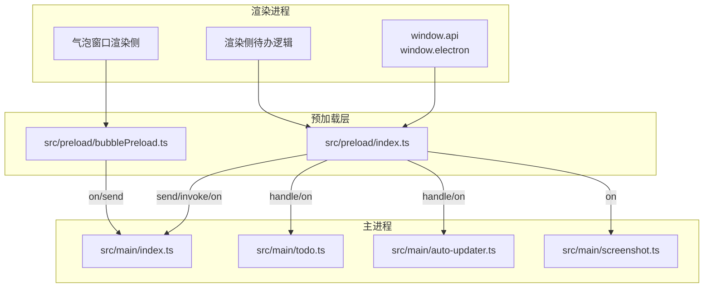
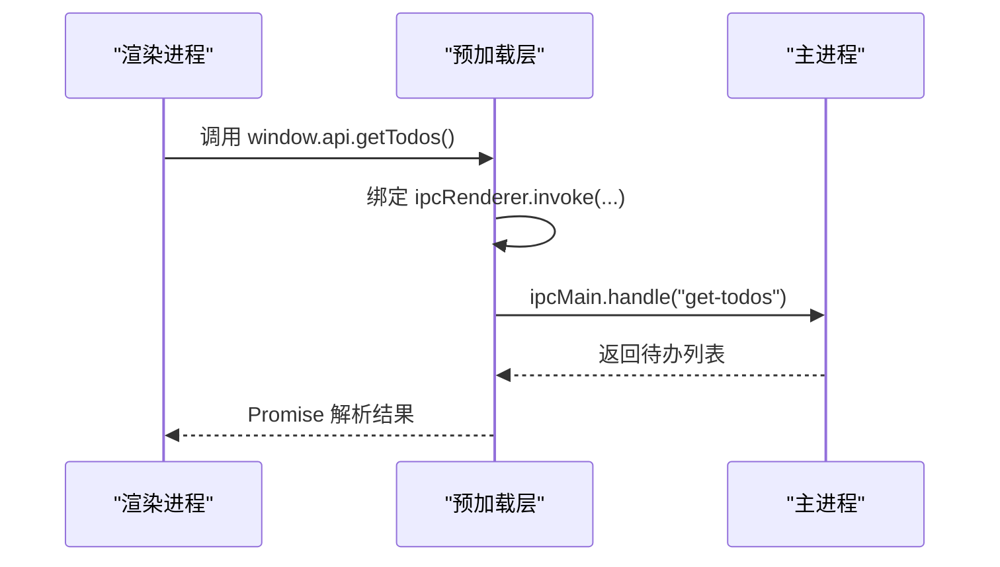
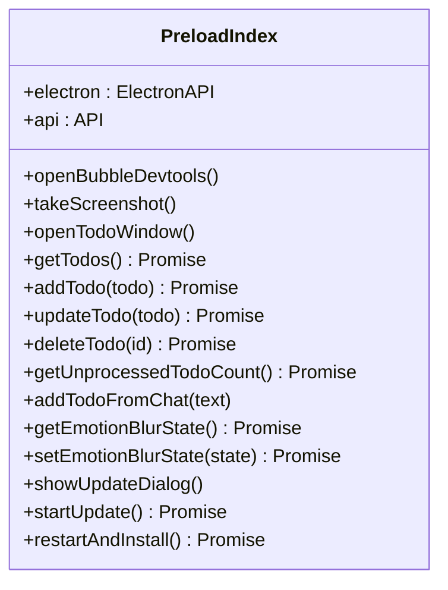
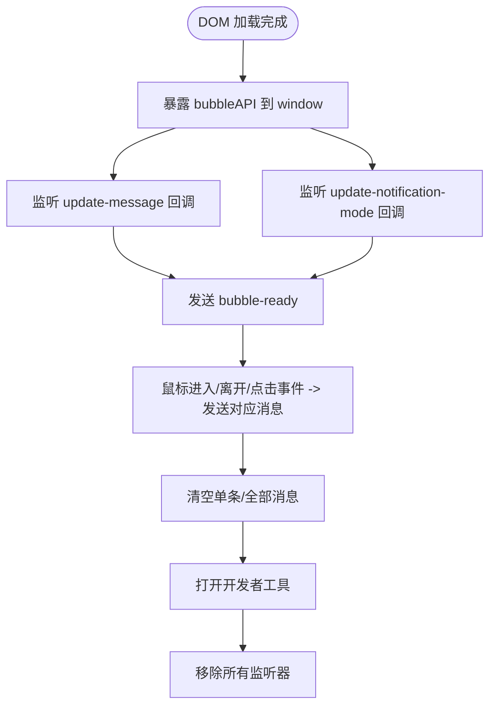
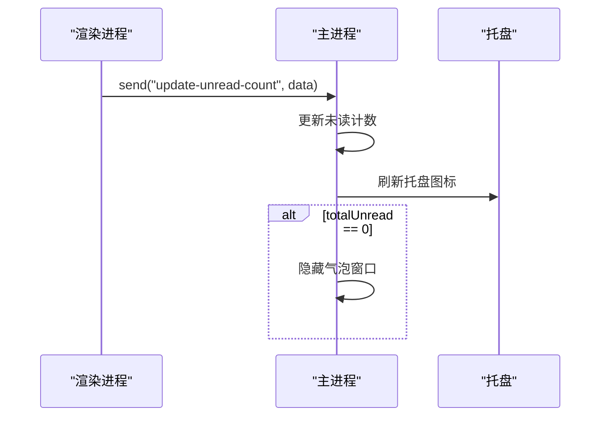
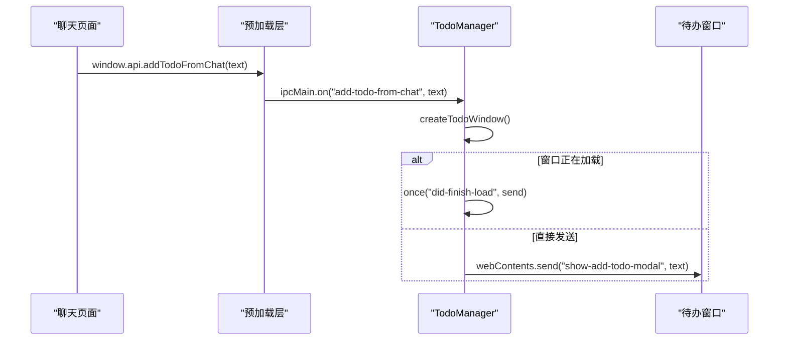
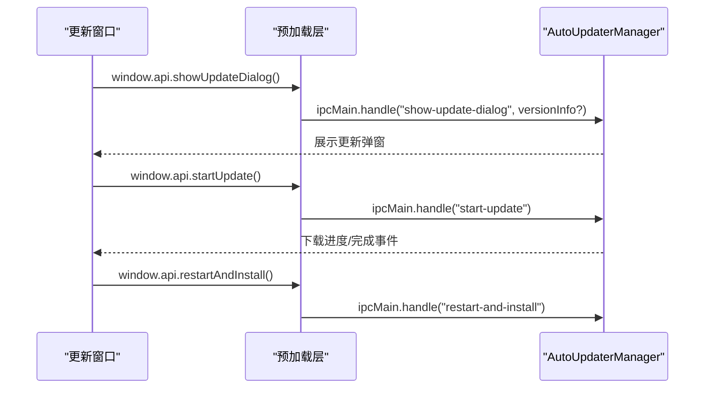
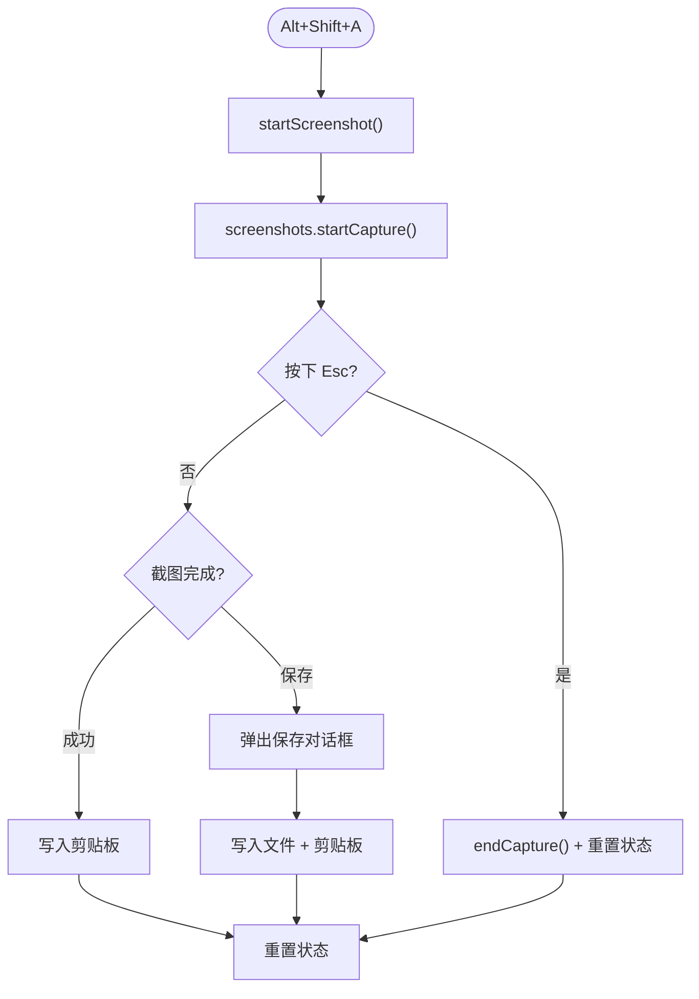
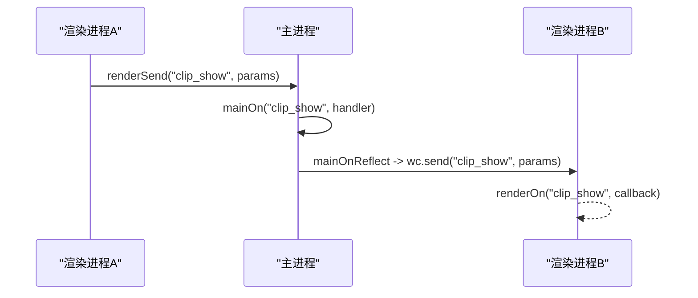
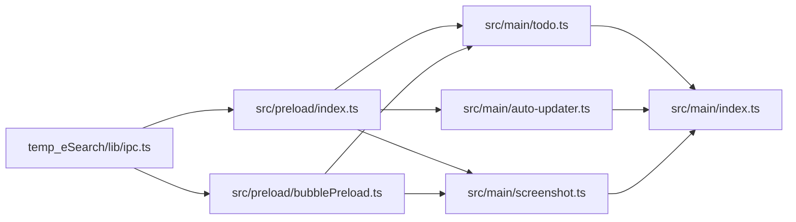

# IPC通信系统

<cite>
**本文引用的文件**
- [src/preload/index.ts](file://src/preload/index.ts)
- [src/preload/bubblePreload.ts](file://src/preload/bubblePreload.ts)
- [src/preload/index.d.ts](file://src/preload/index.d.ts)
- [src/renderer/src/types/global.d.ts](file://src/renderer/src/types/global.d.ts)
- [src/main/index.ts](file://src/main/index.ts)
- [src/main/todo.ts](file://src/main/todo.ts)
- [src/main/auto-updater.ts](file://src/main/auto-updater.ts)
- [src/main/screenshot.ts](file://src/main/screenshot.ts)
- [temp_eSearch/lib/ipc.ts](file://temp_eSearch/lib/ipc.ts)
</cite>

## 目录
1. [简介](#简介)
2. [项目结构](#项目结构)
3. [核心组件](#核心组件)
4. [架构总览](#架构总览)
5. [详细组件分析](#详细组件分析)
6. [依赖关系分析](#依赖关系分析)
7. [性能考虑](#性能考虑)
8. [故障排查指南](#故障排查指南)
9. [结论](#结论)
10. [附录](#附录)

## 简介
本文件系统性梳理 WoaApp 的 IPC 通信体系，覆盖主进程与渲染进程之间的消息传递机制（send、invoke、handle），预加载脚本的安全封装与 API 暴露策略，以及典型事件类型与数据结构（窗口控制、数据操作、系统事件）。文档提供事件处理流程图与序列图，并给出异步通信实现、错误处理策略、性能优化与消息队列管理建议，以及调试技巧与常见问题解决方案。

## 项目结构
WoaApp 的 IPC 通信由“预加载桥接层 + 主进程处理器 + 渲染进程调用方”三部分组成：
- 预加载层负责安全地向渲染进程暴露有限 API，并绑定 ipcRenderer 的常用方法。
- 主进程通过 ipcMain 注册 handle/on，承接来自渲染进程的同步/异步请求与事件订阅。
- 渲染进程通过 window.electron 或 window.api 调用预加载层封装的方法，实现跨进程通信。

图表来源
- [src/preload/index.ts](file://src/preload/index.ts#L1-L63)
- [src/preload/bubblePreload.ts](file://src/preload/bubblePreload.ts#L1-L70)
- [src/main/index.ts](file://src/main/index.ts#L1-L2406)
- [src/main/todo.ts](file://src/main/todo.ts#L1-L266)
- [src/main/auto-updater.ts](file://src/main/auto-updater.ts#L1-L565)
- [src/main/screenshot.ts](file://src/main/screenshot.ts#L1-L158)

章节来源
- [src/preload/index.ts](file://src/preload/index.ts#L1-L63)
- [src/preload/bubblePreload.ts](file://src/preload/bubblePreload.ts#L1-L70)
- [src/main/index.ts](file://src/main/index.ts#L1-L2406)

## 核心组件
- 预加载桥接层（src/preload/index.ts）
  - 通过 contextBridge.exposeInMainWorld 暴露 window.electron 与 window.api，统一绑定 ipcRenderer 的 send、invoke、on、off、once、removeAllListeners。
  - 暴露业务 API：截图、待办事项、表情模糊状态、自动更新等。
- 气泡窗口预加载（src/preload/bubblePreload.ts）
  - 在禁用上下文隔离场景下，直接在 window 上挂载 bubbleAPI，提供消息更新、通知模式更新、交互事件等回调注册。
- 主进程入口（src/main/index.ts）
  - 注册通用 IPC 事件：如更新未读数、隐藏气泡窗口、页面注入脚本等。
  - 作为多窗口宿主，承载截图、自动更新、待办等子功能的主进程逻辑。
- 待办事项模块（src/main/todo.ts）
  - 通过 ipcMain.handle/on 实现 CRUD、计数广播、聊天内容触发新增等。
- 自动更新模块（src/main/auto-updater.ts）
  - 通过 ipcMain.handle/on 实现版本检查、对话框展示、下载进度、安装重启等。
- 截图模块（src/main/screenshot.ts）
  - 通过 ipcMain.on 监听渲染进程截图请求，结合全局快捷键与页面注入按钮驱动截图流程。
- 通用 IPC 封装（temp_eSearch/lib/ipc.ts）
  - 提供统一通道名与类型化消息映射，封装 render-on/main-on、send/sync、反射转发等能力，便于跨窗口通信。

章节来源
- [src/preload/index.ts](file://src/preload/index.ts#L1-L63)
- [src/preload/bubblePreload.ts](file://src/preload/bubblePreload.ts#L1-L70)
- [src/main/index.ts](file://src/main/index.ts#L120-L229)
- [src/main/todo.ts](file://src/main/todo.ts#L77-L136)
- [src/main/auto-updater.ts](file://src/main/auto-updater.ts#L82-L131)
- [src/main/screenshot.ts](file://src/main/screenshot.ts#L155-L158)
- [temp_eSearch/lib/ipc.ts](file://temp_eSearch/lib/ipc.ts#L1-L273)

## 架构总览
WoaApp 的 IPC 采用“预加载桥接 + 主进程处理器”的分层设计：
- 预加载层负责安全边界与 API 统一；渲染进程仅能通过 window.electron/window.api 访问受限能力。
- 主进程集中注册 handle/on，按事件类型路由到具体业务模块（待办、更新、截图）。
- 通用 IPC 封装提供跨窗口通信与类型安全的消息编排。

图表来源
- [src/preload/index.ts](file://src/preload/index.ts#L27-L28)
- [src/main/todo.ts](file://src/main/todo.ts#L82-L84)

## 详细组件分析

### 预加载桥接层（src/preload/index.ts）
- 安全暴露
  - 使用 contextBridge.exposeInMainWorld 暴露 window.electron 与 window.api。
  - 在禁用上下文隔离时，直接将对象挂到 window，同时保留 d.ts 类型声明。
- API 分类
  - 窗口控制：openBubbleDevtools、takeScreenshot、openTodoWindow。
  - 数据操作：getTodos、addTodo、updateTodo、deleteTodo、getUnprocessedTodoCount、addTodoFromChat。
  - 系统事件：表情模糊状态查询与设置、自动更新相关对话框与下载控制。
- 绑定策略
  - 统一绑定 ipcRenderer 的 send/invoke/on/off/once/removeAllListeners，避免直接透传底层对象。

图表来源
- [src/preload/index.ts](file://src/preload/index.ts#L5-L43)
- [src/preload/index.d.ts](file://src/preload/index.d.ts#L7-L21)

章节来源
- [src/preload/index.ts](file://src/preload/index.ts#L1-L63)
- [src/preload/index.d.ts](file://src/preload/index.d.ts#L1-L23)

### 气泡窗口预加载（src/preload/bubblePreload.ts）
- 场景说明
  - 在禁用上下文隔离的气泡窗口中，直接在 window 上暴露 bubbleAPI。
- 主要事件
  - 监听 update-message、update-notification-mode。
  - 通知主进程：bubble-ready、bubble-mouse-enter/leave、notification-clicked。
  - 清理：clear-single-message、clear-all-messages。
  - 开发工具：openBubbleDevtools。
  - 资源清理：removeAllListeners。

图表来源
- [src/preload/bubblePreload.ts](file://src/preload/bubblePreload.ts#L4-L61)

章节来源
- [src/preload/bubblePreload.ts](file://src/preload/bubblePreload.ts#L1-L70)
- [src/renderer/src/types/global.d.ts](file://src/renderer/src/types/global.d.ts#L1-L20)

### 主进程入口与通用事件（src/main/index.ts）
- 通用事件
  - update-unread-count：根据未读数更新托盘图标与气泡窗口显示。
  - hide-bubble-window：隐藏气泡窗口。
  - 页面注入：在目标页面加载完成后注入脚本与待办、表情模糊等功能。
- 窗口生命周期
  - 主窗口与气泡窗口的关闭事件处理，支持最小化隐藏与恢复显示。
- 会话与导航
  - 配置持久化会话、权限许可、证书校验、网络拦截与重定向策略，确保页面加载稳定。

图表来源
- [src/main/index.ts](file://src/main/index.ts#L130-L139)

章节来源
- [src/main/index.ts](file://src/main/index.ts#L120-L229)

### 待办事项模块（src/main/todo.ts）
- 数据模型
  - TodoItem：包含 id、title、details、timestamp、source、processed。
- IPC 处理
  - open-todo-window：创建/聚焦待办窗口。
  - get-todos/add-todo/update-todo/delete-todo：基于 electron-store 的 CRUD。
  - get-unprocessed-todo-count：统计未处理数量。
  - add-todo-from-chat：从聊天内容触发新增，延迟等待窗口加载完成再发送事件。
- 广播机制
  - 更新计数后广播到所有窗口，实现跨窗口状态同步。

图表来源
- [src/main/todo.ts](file://src/main/todo.ts#L124-L135)

章节来源
- [src/main/todo.ts](file://src/main/todo.ts#L1-L266)

### 自动更新模块（src/main/auto-updater.ts）
- IPC 处理
  - check-for-updates/get-current-version/get-latest-version-info/start-update/show-update-dialog/restart-and-install。
- 事件驱动
  - download-progress/update-downloaded 等事件通过 webContents 发送到更新窗口。
- 注入与菜单
  - 在网页中注入更新图标，托盘菜单根据更新类型动态刷新。

图表来源
- [src/main/auto-updater.ts](file://src/main/auto-updater.ts#L99-L131)

章节来源
- [src/main/auto-updater.ts](file://src/main/auto-updater.ts#L1-L565)

### 截图模块（src/main/screenshot.ts）
- 快捷键与状态
  - Alt+Shift+A 触发截图，Esc 取消；使用全局快捷键与状态机控制。
- 页面注入
  - 在目标页面注入截图按钮，点击后通过 ipcRenderer.send('start-screenshot') 触发。
- 事件处理
  - 监听截图完成/保存/取消事件，写入剪贴板与磁盘。

图表来源
- [src/main/screenshot.ts](file://src/main/screenshot.ts#L16-L96)

章节来源
- [src/main/screenshot.ts](file://src/main/screenshot.ts#L1-L158)

### 通用 IPC 封装（temp_eSearch/lib/ipc.ts）
- 类型化消息映射
  - 通过 Message 类型约束事件名与参数/返回值，确保编译期安全。
- 事件注册
  - renderOn/mainOn：注册渲染/主进程回调。
  - renderSend/renderSendSync/mainSend：发送事件与同步调用。
  - mainOnReflect：主进程对渲染进程的“反射转发”，用于跨窗口广播。
- 事件路由
  - 统一通道名，主/渲染两端分别维护回调表，按 key 分发。

图表来源
- [temp_eSearch/lib/ipc.ts](file://temp_eSearch/lib/ipc.ts#L176-L238)

章节来源
- [temp_eSearch/lib/ipc.ts](file://temp_eSearch/lib/ipc.ts#L1-L273)

## 依赖关系分析
- 预加载层依赖
  - src/preload/index.ts 依赖 Electron 的 ipcRenderer 与 contextBridge，暴露 window.electron 与 window.api。
  - src/preload/bubblePreload.ts 依赖 ipcRenderer，在禁用上下文隔离时直接挂载到 window。
- 主进程依赖
  - src/main/index.ts 作为入口，依赖 BrowserWindow、ipcMain、Tray 等，承载通用事件与页面注入。
  - src/main/todo.ts、src/main/auto-updater.ts、src/main/screenshot.ts 通过 ipcMain.handle/on 与预加载层交互。
- 通用封装
  - temp_eSearch/lib/ipc.ts 为跨窗口通信提供抽象，减少事件名硬编码与类型不一致风险。

图表来源
- [src/preload/index.ts](file://src/preload/index.ts#L1-L63)
- [src/preload/bubblePreload.ts](file://src/preload/bubblePreload.ts#L1-L70)
- [src/main/todo.ts](file://src/main/todo.ts#L1-L266)
- [src/main/auto-updater.ts](file://src/main/auto-updater.ts#L1-L565)
- [src/main/screenshot.ts](file://src/main/screenshot.ts#L1-L158)
- [src/main/index.ts](file://src/main/index.ts#L1-L2406)
- [temp_eSearch/lib/ipc.ts](file://temp_eSearch/lib/ipc.ts#L1-L273)

章节来源
- [src/preload/index.ts](file://src/preload/index.ts#L1-L63)
- [src/preload/bubblePreload.ts](file://src/preload/bubblePreload.ts#L1-L70)
- [src/main/todo.ts](file://src/main/todo.ts#L1-L266)
- [src/main/auto-updater.ts](file://src/main/auto-updater.ts#L1-L565)
- [src/main/screenshot.ts](file://src/main/screenshot.ts#L1-L158)
- [src/main/index.ts](file://src/main/index.ts#L1-L2406)
- [temp_eSearch/lib/ipc.ts](file://temp_eSearch/lib/ipc.ts#L1-L273)

## 性能考虑
- 异步优先
  - 优先使用 invoke/handle 进行异步调用，避免阻塞 UI 线程；仅在必要时使用 send。
- 事件去抖与批处理
  - 对高频事件（如滚动、缩放、未读计数）可引入节流/去抖，减少主进程压力。
- 消息队列与背压
  - 对于大量消息（如批量通知），采用分批发送与确认机制，避免渲染进程过载。
- 预加载层轻量化
  - 预加载层仅暴露必要 API，避免在其中执行重型计算；将耗时任务下沉至主进程。
- 窗口复用与懒加载
  - 待办窗口、更新窗口按需创建与销毁，避免常驻内存造成资源浪费。
- 网络与 I/O
  - 自动更新与截图涉及网络与磁盘 I/O，应使用异步 API 并在 UI 层反馈进度。

## 故障排查指南
- 预加载层无法暴露 API
  - 检查是否启用了上下文隔离；若禁用，需确保在 d.ts 中声明 window.electron/window.api。
  - 章节来源: [src/preload/index.ts](file://src/preload/index.ts#L48-L62), [src/preload/index.d.ts](file://src/preload/index.d.ts#L4-L22)
- 事件未触发或回调未执行
  - 确认事件名拼写一致；检查主进程是否正确注册 handle/on；确认渲染进程是否在窗口加载后再发送事件。
  - 章节来源: [src/main/todo.ts](file://src/main/todo.ts#L124-L135), [src/main/auto-updater.ts](file://src/main/auto-updater.ts#L337-L343)
- 气泡窗口消息不同步
  - 检查主进程是否正确广播 update-message；确认气泡窗口预加载层是否注册了对应监听。
  - 章节来源: [src/preload/bubblePreload.ts](file://src/preload/bubblePreload.ts#L7-L18), [src/main/index.ts](file://src/main/index.ts#L130-L139)
- 截图无效或无法取消
  - 检查全局快捷键注册与状态机；确认 screenshots 实例生命周期与事件解绑。
  - 章节来源: [src/main/screenshot.ts](file://src/main/screenshot.ts#L20-L42), [src/main/screenshot.ts](file://src/main/screenshot.ts#L87-L95)
- 自动更新下载卡住
  - 检查网络与证书策略；确认主进程是否正确转发 download-progress/update-downloaded；更新窗口是否监听对应事件。
  - 章节来源: [src/main/auto-updater.ts](file://src/main/auto-updater.ts#L171-L185), [src/main/auto-updater.ts](file://src/main/auto-updater.ts#L458-L463)

## 结论
WoaApp 的 IPC 体系通过预加载桥接层实现了安全可控的 API 暴露，主进程集中处理业务逻辑并通过 handle/on 提供稳定的异步通信能力。通用 IPC 封装进一步提升了跨窗口通信的可维护性与类型安全性。建议在高频事件与大体量数据传输场景中引入节流/批处理与进度反馈，持续优化用户体验与系统稳定性。

## 附录
- 事件类型与数据结构（示例）
  - 窗口控制事件
    - update-unread-count: { totalUnread: number }
    - hide-bubble-window: 无
    - bubble-ready/bubble-mouse-enter/bubble-mouse-leave/notification-clicked: 无
    - clear-single-message/clear-all-messages: 无/消息对象
  - 数据操作事件
    - get-todos: 无 -> TodoItem[]
    - add-todo: { title, details, source } -> TodoItem
    - update-todo: TodoItem -> TodoItem
    - delete-todo: string -> boolean
    - get-unprocessed-todo-count: 无 -> number
    - add-todo-from-chat: string -> 无
  - 系统事件
    - show-update-dialog: 无 -> 无
    - start-update: 无 -> 无
    - restart-and-install: 无 -> 无
    - open-bubble-devtools/take-screenshot/openTodoWindow: 无
  - 章节来源: [src/main/index.ts](file://src/main/index.ts#L130-L139), [src/main/todo.ts](file://src/main/todo.ts#L77-L136), [src/main/auto-updater.ts](file://src/main/auto-updater.ts#L99-L131), [src/preload/index.ts](file://src/preload/index.ts#L18-L42), [src/preload/bubblePreload.ts](file://src/preload/bubblePreload.ts#L20-L48)