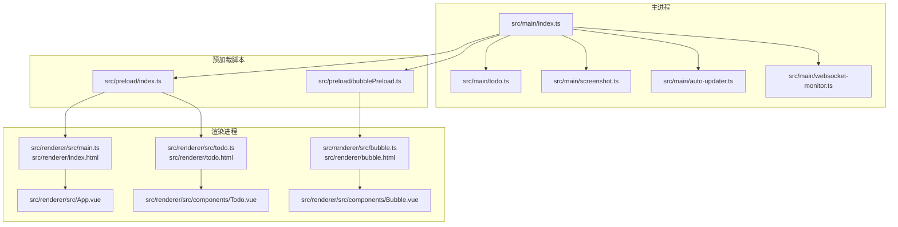
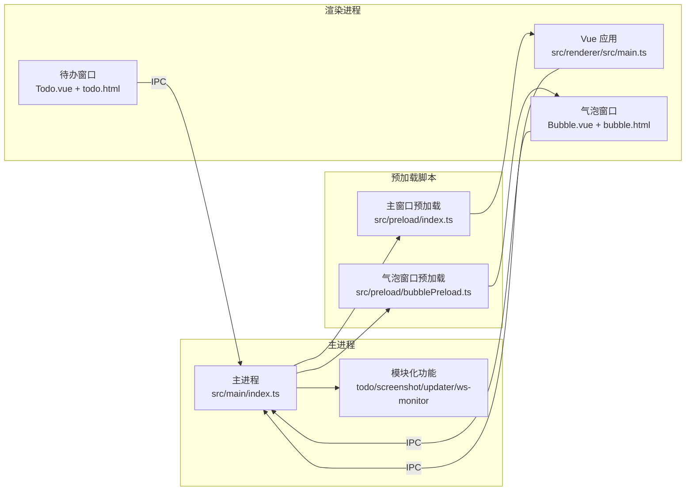
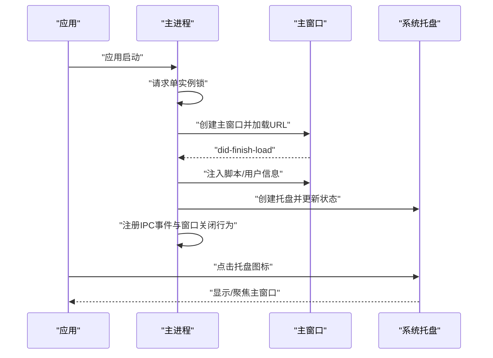
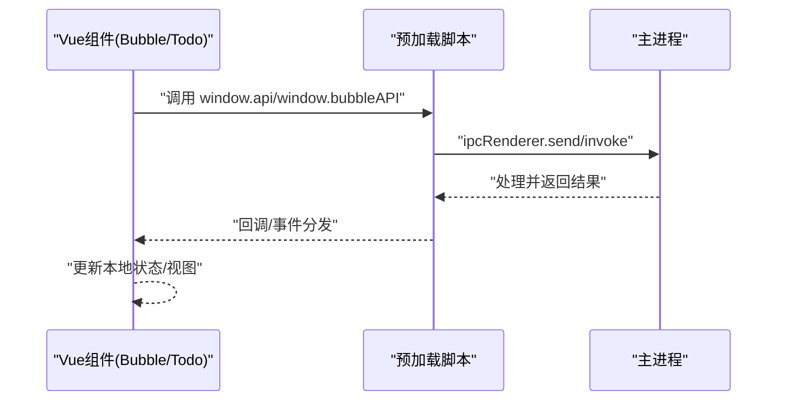
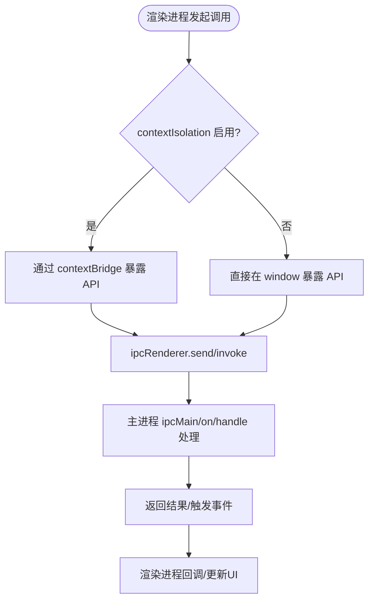
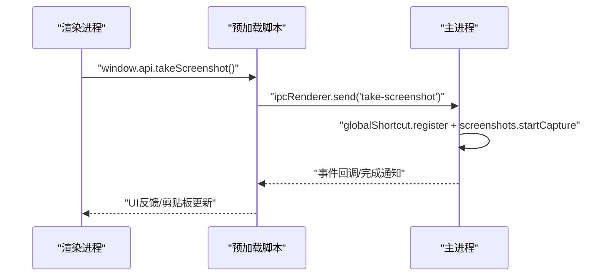
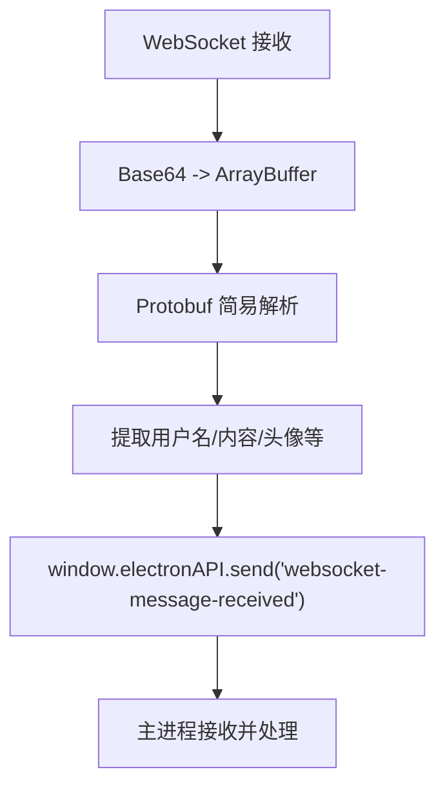
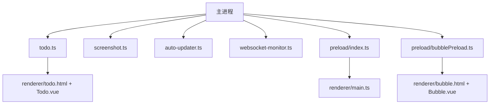

# 多进程架构

<cite>
**本文引用的文件**
- [src/main/index.ts](file://src/main/index.ts)
- [src/preload/index.ts](file://src/preload/index.ts)
- [src/preload/bubblePreload.ts](file://src/preload/bubblePreload.ts)
- [src/main/todo.ts](file://src/main/todo.ts)
- [src/main/screenshot.ts](file://src/main/screenshot.ts)
- [src/main/auto-updater.ts](file://src/main/auto-updater.ts)
- [src/main/websocket-monitor.ts](file://src/main/websocket-monitor.ts)
- [src/renderer/src/main.ts](file://src/renderer/src/main.ts)
- [src/renderer/src/App.vue](file://src/renderer/src/App.vue)
- [src/renderer/index.html](file://src/renderer/index.html)
- [src/renderer/bubble.html](file://src/renderer/bubble.html)
- [src/renderer/src/components/Bubble.vue](file://src/renderer/src/components/Bubble.vue)
- [src/renderer/src/components/Todo.vue](file://src/renderer/src/components/Todo.vue)
- [ARCHITECTURE.md](file://ARCHITECTURE.md)
</cite>

## 目录
1. [简介](#简介)
2. [项目结构](#项目结构)
3. [核心组件](#核心组件)
4. [架构总览](#架构总览)
5. [详细组件分析](#详细组件分析)
6. [依赖关系分析](#依赖关系分析)
7. [性能考量](#性能考量)
8. [故障排查指南](#故障排查指南)
9. [结论](#结论)
10. [附录](#附录)

## 简介
本文件系统性梳理 WoaApp 的多进程架构，围绕 Electron 主进程、渲染进程与预加载脚本三者职责与协作展开，重点说明：
- 主进程如何管理应用生命周期、窗口系统、系统托盘与外部服务集成；
- 渲染进程如何承载 Vue.js 应用界面与用户交互；
- 预加载脚本如何作为安全桥梁实现受控的 IPC 通信；
- 结合具体代码路径展示进程间数据流与控制流程；
- 分析该架构的优势、潜在挑战与最佳实践。

## 项目结构
WoaApp 采用典型的 Electron 多进程组织方式：
- 主进程：集中管理窗口、托盘、会话、外部服务与系统能力（如截图、自动更新、WebSocket 监听）。
- 预加载脚本：在受限上下文中向渲染进程暴露受控 API，实现安全的 IPC 桥梁。
- 渲染进程：承载 Vue.js 应用，负责 UI 与用户交互；多窗口（主聊天、气泡、待办）分别对应不同 HTML 与入口。

图表来源
- [src/main/index.ts](file://src/main/index.ts#L92-L236)
- [src/preload/index.ts](file://src/preload/index.ts#L1-L63)
- [src/preload/bubblePreload.ts](file://src/preload/bubblePreload.ts#L1-L70)
- [src/main/todo.ts](file://src/main/todo.ts#L20-L136)
- [src/main/screenshot.ts](file://src/main/screenshot.ts#L16-L96)
- [src/main/auto-updater.ts](file://src/main/auto-updater.ts#L40-L131)
- [src/main/websocket-monitor.ts](file://src/main/websocket-monitor.ts#L4-L200)
- [src/renderer/src/main.ts](file://src/renderer/src/main.ts#L1-L7)
- [src/renderer/index.html](file://src/renderer/index.html#L1-L18)
- [src/renderer/bubble.html](file://src/renderer/bubble.html#L1-L33)
- [src/renderer/src/components/Bubble.vue](file://src/renderer/src/components/Bubble.vue#L165-L228)
- [src/renderer/src/components/Todo.vue](file://src/renderer/src/components/Todo.vue#L87-L150)

章节来源
- [ARCHITECTURE.md](file://ARCHITECTURE.md#L16-L42)
- [src/main/index.ts](file://src/main/index.ts#L92-L236)

## 核心组件
- 主进程入口与窗口管理
  - 应用启动、单实例锁、托盘创建、主窗口与气泡窗口创建、会话配置与持久化、导航与重定向处理、窗口关闭行为、生命周期事件注册。
  - 关键路径参考：[src/main/index.ts](file://src/main/index.ts#L92-L236)、[src/main/index.ts](file://src/main/index.ts#L276-L615)、[src/main/index.ts](file://src/main/index.ts#L618-L764)

- 预加载脚本（主窗口）
  - 通过 contextBridge 暴露受控 API（IPC 封装），包括截图、待办、表情模糊状态、自动更新等调用。
  - 关键路径参考：[src/preload/index.ts](file://src/preload/index.ts#L1-L63)

- 预加载脚本（气泡窗口）
  - 直接在 window 上暴露 bubbleAPI，用于气泡窗口与主进程的双向事件通信。
  - 关键路径参考：[src/preload/bubblePreload.ts](file://src/preload/bubblePreload.ts#L1-L70)

- 待办事项管理
  - TodoManager 负责待办窗口创建、IPC 事件注册、数据持久化与脚本注入。
  - 关键路径参考：[src/main/todo.ts](file://src/main/todo.ts#L20-L136)、[src/main/todo.ts](file://src/main/todo.ts#L156-L266)

- 截图功能
  - 注册全局快捷键、监听截图完成/取消/保存事件、注入页面按钮、清理资源。
  - 关键路径参考：[src/main/screenshot.ts](file://src/main/screenshot.ts#L16-L96)、[src/main/screenshot.ts](file://src/main/screenshot.ts#L102-L140)

- 自动更新
  - 定时检查、版本比较、注入更新图标、下载进度与安装控制。
  - 关键路径参考：[src/main/auto-updater.ts](file://src/main/auto-updater.ts#L40-L131)、[src/main/auto-updater.ts](file://src/main/auto-updater.ts#L298-L353)

- WebSocket 监听
  - 注入脚本解析二进制消息、提取文本内容并转发至主进程。
  - 关键路径参考：[src/main/websocket-monitor.ts](file://src/main/websocket-monitor.ts#L4-L200)

- 渲染进程（Vue.js）
  - 主入口与 HTML 模板、组件（气泡、待办）与交互。
  - 关键路径参考：[src/renderer/src/main.ts](file://src/renderer/src/main.ts#L1-L7)、[src/renderer/index.html](file://src/renderer/index.html#L1-L18)、[src/renderer/bubble.html](file://src/renderer/bubble.html#L1-L33)、[src/renderer/src/components/Bubble.vue](file://src/renderer/src/components/Bubble.vue#L165-L228)、[src/renderer/src/components/Todo.vue](file://src/renderer/src/components/Todo.vue#L87-L150)

章节来源
- [src/main/index.ts](file://src/main/index.ts#L92-L236)
- [src/preload/index.ts](file://src/preload/index.ts#L1-L63)
- [src/preload/bubblePreload.ts](file://src/preload/bubblePreload.ts#L1-L70)
- [src/main/todo.ts](file://src/main/todo.ts#L20-L136)
- [src/main/screenshot.ts](file://src/main/screenshot.ts#L16-L96)
- [src/main/auto-updater.ts](file://src/main/auto-updater.ts#L40-L131)
- [src/main/websocket-monitor.ts](file://src/main/websocket-monitor.ts#L4-L200)
- [src/renderer/src/main.ts](file://src/renderer/src/main.ts#L1-L7)
- [src/renderer/index.html](file://src/renderer/index.html#L1-L18)
- [src/renderer/bubble.html](file://src/renderer/bubble.html#L1-L33)
- [src/renderer/src/components/Bubble.vue](file://src/renderer/src/components/Bubble.vue#L165-L228)
- [src/renderer/src/components/Todo.vue](file://src/renderer/src/components/Todo.vue#L87-L150)

## 架构总览
Electron 多进程模型在 WoaApp 中体现为：
- 主进程集中控制窗口、托盘、会话与外部服务，负责业务编排与系统集成。
- 预加载脚本在渲染进程受限上下文中暴露受控 API，避免直接暴露 Node/Electron 能力。
- 渲染进程承载 Vue.js 应用，通过 IPC 与主进程交互，实现功能解耦与安全隔离。

图表来源
- [src/main/index.ts](file://src/main/index.ts#L92-L236)
- [src/preload/index.ts](file://src/preload/index.ts#L1-L63)
- [src/preload/bubblePreload.ts](file://src/preload/bubblePreload.ts#L1-L70)
- [src/renderer/src/main.ts](file://src/renderer/src/main.ts#L1-L7)
- [src/renderer/src/components/Bubble.vue](file://src/renderer/src/components/Bubble.vue#L165-L228)
- [src/renderer/src/components/Todo.vue](file://src/renderer/src/components/Todo.vue#L87-L150)

章节来源
- [ARCHITECTURE.md](file://ARCHITECTURE.md#L16-L42)

## 详细组件分析

### 主进程：生命周期、窗口系统与系统托盘
- 生命周期与单实例
  - 请求单实例锁，若已有实例则聚焦已有窗口；应用激活时重建主窗口。
  - 关键路径参考：[src/main/index.ts](file://src/main/index.ts#L74-L90)、[src/main/index.ts](file://src/main/index.ts#L230-L235)

- 窗口系统
  - 主窗口：加载目标 URL，持久化会话，注入脚本，处理导航与重定向，窗口关闭隐藏而非退出。
  - 气泡窗口：透明、置顶、可拖拽，支持开发者工具、移动位置持久化。
  - 关键路径参考：[src/main/index.ts](file://src/main/index.ts#L276-L615)、[src/main/index.ts](file://src/main/index.ts#L618-L764)

- 系统托盘
  - 创建托盘图标，根据未读数闪烁，右键菜单与通知模式配置。
  - 关键路径参考：[src/main/index.ts](file://src/main/index.ts#L56-L100)、[src/main/index.ts](file://src/main/index.ts#L130-L139)

- 外部服务集成
  - 会话配置：持久化分区、Cookie 管理、证书验证、网络拦截与权限放行。
  - 关键路径参考：[src/main/index.ts](file://src/main/index.ts#L304-L378)

图表来源
- [src/main/index.ts](file://src/main/index.ts#L92-L236)
- [src/main/index.ts](file://src/main/index.ts#L276-L615)
- [src/main/index.ts](file://src/main/index.ts#L56-L100)

章节来源
- [src/main/index.ts](file://src/main/index.ts#L74-L139)
- [src/main/index.ts](file://src/main/index.ts#L276-L615)
- [src/main/index.ts](file://src/main/index.ts#L618-L764)

### 渲染进程：Vue.js 应用与用户交互
- 主入口与模板
  - Vue 应用挂载到 #app，模板包含基础提示与版本信息组件。
  - 关键路径参考：[src/renderer/src/main.ts](file://src/renderer/src/main.ts#L1-L7)、[src/renderer/index.html](file://src/renderer/index.html#L1-L18)、[src/renderer/src/App.vue](file://src/renderer/src/App.vue#L1-L27)

- 气泡窗口
  - 通过 bubble.html 加载 Vue 组件，组件挂载后等待 bubbleAPI 就绪，建立消息与通知模式监听，并上报“已就绪”。
  - 关键路径参考：[src/renderer/bubble.html](file://src/renderer/bubble.html#L1-L33)、[src/renderer/src/components/Bubble.vue](file://src/renderer/src/components/Bubble.vue#L165-L228)

- 待办窗口
  - Todo.vue 通过 window.api 与主进程交互，实现 CRUD、标签页筛选与模态新增。
  - 关键路径参考：[src/renderer/src/components/Todo.vue](file://src/renderer/src/components/Todo.vue#L87-L150)

图表来源
- [src/preload/index.ts](file://src/preload/index.ts#L1-L63)
- [src/preload/bubblePreload.ts](file://src/preload/bubblePreload.ts#L1-L70)
- [src/renderer/src/components/Bubble.vue](file://src/renderer/src/components/Bubble.vue#L165-L228)
- [src/renderer/src/components/Todo.vue](file://src/renderer/src/components/Todo.vue#L87-L150)

章节来源
- [src/renderer/src/main.ts](file://src/renderer/src/main.ts#L1-L7)
- [src/renderer/index.html](file://src/renderer/index.html#L1-L18)
- [src/renderer/bubble.html](file://src/renderer/bubble.html#L1-L33)
- [src/renderer/src/App.vue](file://src/renderer/src/App.vue#L1-L27)
- [src/renderer/src/components/Bubble.vue](file://src/renderer/src/components/Bubble.vue#L165-L228)
- [src/renderer/src/components/Todo.vue](file://src/renderer/src/components/Todo.vue#L87-L150)

### 预加载脚本：安全桥梁与受控 IPC
- 主窗口预加载
  - 通过 contextBridge 暴露 electron 与 api 对象，封装 IPC 发送/调用、待办 CRUD、截图、表情模糊状态、自动更新等。
  - 关键路径参考：[src/preload/index.ts](file://src/preload/index.ts#L1-L63)

- 气泡窗口预加载
  - 直接在 window 暴露 bubbleAPI，提供消息更新、通知模式、鼠标事件、点击与清除等事件通道。
  - 关键路径参考：[src/preload/bubblePreload.ts](file://src/preload/bubblePreload.ts#L1-L70)

图表来源
- [src/preload/index.ts](file://src/preload/index.ts#L48-L62)
- [src/preload/bubblePreload.ts](file://src/preload/bubblePreload.ts#L3-L64)

章节来源
- [src/preload/index.ts](file://src/preload/index.ts#L1-L63)
- [src/preload/bubblePreload.ts](file://src/preload/bubblePreload.ts#L1-L70)

### IPC 通信：数据流与控制流程
- 主进程 ↔ 渲染进程
  - 主窗口：截图、待办、表情模糊、自动更新等事件由预加载脚本封装并通过 IPC 传递。
  - 气泡窗口：通过 bubbleAPI 与主进程交互，实现消息更新、通知模式、鼠标与点击事件。
  - 关键路径参考：[src/main/index.ts](file://src/main/index.ts#L130-L139)、[src/main/todo.ts](file://src/main/todo.ts#L77-L136)、[src/main/screenshot.ts](file://src/main/screenshot.ts#L156-L158)、[src/preload/bubblePreload.ts](file://src/preload/bubblePreload.ts#L7-L59)

图表来源
- [src/preload/index.ts](file://src/preload/index.ts#L22-L24)
- [src/main/screenshot.ts](file://src/main/screenshot.ts#L16-L96)

章节来源
- [src/main/index.ts](file://src/main/index.ts#L130-L139)
- [src/main/todo.ts](file://src/main/todo.ts#L77-L136)
- [src/main/screenshot.ts](file://src/main/screenshot.ts#L156-L158)
- [src/preload/bubblePreload.ts](file://src/preload/bubblePreload.ts#L7-L59)

### 外部服务集成：WPS 云办公与 WebSocket 监听
- 会话与导航
  - 设置持久化会话、用户代理、权限放行、证书放行、网络拦截与导航处理，确保目标页面加载与登录状态保持。
  - 关键路径参考：[src/main/index.ts](file://src/main/index.ts#L304-L417)

- WebSocket 监听
  - 注入脚本拦截 WebSocket，解析二进制消息（含 Protobuf 简易解析），提取消息内容并转发至主进程。
  - 关键路径参考：[src/main/websocket-monitor.ts](file://src/main/websocket-monitor.ts#L4-L200)

图表来源
- [src/main/websocket-monitor.ts](file://src/main/websocket-monitor.ts#L104-L200)

章节来源
- [src/main/index.ts](file://src/main/index.ts#L304-L417)
- [src/main/websocket-monitor.ts](file://src/main/websocket-monitor.ts#L4-L200)

## 依赖关系分析
- 组件耦合与内聚
  - 主进程通过模块化文件（todo/screenshot/auto-updater/websocket-monitor）实现高内聚低耦合。
  - 预加载脚本与渲染进程通过 IPC 解耦，API 暴露范围明确。
- 外部依赖
  - Electron、Vue.js、electron-store、electron-screenshots、electron-updater 等。
- 潜在循环依赖
  - 代码组织上未见明显循环依赖；TodoManager 与主窗口注入脚本相互配合，属于单向依赖。

图表来源
- [src/main/index.ts](file://src/main/index.ts#L92-L236)
- [src/main/todo.ts](file://src/main/todo.ts#L20-L136)
- [src/main/screenshot.ts](file://src/main/screenshot.ts#L16-L96)
- [src/main/auto-updater.ts](file://src/main/auto-updater.ts#L40-L131)
- [src/main/websocket-monitor.ts](file://src/main/websocket-monitor.ts#L4-L200)
- [src/preload/index.ts](file://src/preload/index.ts#L1-L63)
- [src/preload/bubblePreload.ts](file://src/preload/bubblePreload.ts#L1-L70)

章节来源
- [src/main/index.ts](file://src/main/index.ts#L92-L236)
- [src/main/todo.ts](file://src/main/todo.ts#L20-L136)
- [src/main/screenshot.ts](file://src/main/screenshot.ts#L16-L96)
- [src/main/auto-updater.ts](file://src/main/auto-updater.ts#L40-L131)
- [src/main/websocket-monitor.ts](file://src/main/websocket-monitor.ts#L4-L200)
- [src/preload/index.ts](file://src/preload/index.ts#L1-L63)
- [src/preload/bubblePreload.ts](file://src/preload/bubblePreload.ts#L1-L70)

## 性能考量
- 渲染性能
  - 气泡窗口使用 showInactive 避免抢夺焦点；背景节流禁用以保证悬浮效果流畅。
  - 关键路径参考：[src/main/index.ts](file://src/main/index.ts#L736-L737)、[src/main/index.ts](file://src/main/index.ts#L447-L450)

- 内存与资源
  - 及时清理定时器、事件监听器与截图实例；窗口销毁时释放资源。
  - 关键路径参考：[src/main/screenshot.ts](file://src/main/screenshot.ts#L147-L153)、[src/main/index.ts](file://src/main/index.ts#L79-L81)

- 网络与会话
  - 放行权限与证书，减少网络失败导致的重试与阻塞；必要时对特定请求进行拦截与分析。
  - 关键路径参考：[src/main/index.ts](file://src/main/index.ts#L330-L378)

[本节为通用指导，无需列出具体文件来源]

## 故障排查指南
- 气泡窗口异常
  - 监听 render-process-gone 自动重启；移动时持久化位置。
  - 关键路径参考：[src/main/index.ts](file://src/main/index.ts#L740-L747)、[src/main/index.ts](file://src/main/index.ts#L757-L763)

- 截图功能异常
  - 快捷键冲突、ESC 取消、保存对话框与剪贴板写入；检查 globalShortcut 注册与注销。
  - 关键路径参考：[src/main/screenshot.ts](file://src/main/screenshot.ts#L16-L96)、[src/main/screenshot.ts](file://src/main/screenshot.ts#L147-L153)

- 自动更新问题
  - API 地址与协议判断、latest.yml 下载、进度模拟与错误上报；检查网络与权限。
  - 关键路径参考：[src/main/auto-updater.ts](file://src/main/auto-updater.ts#L224-L252)、[src/main/auto-updater.ts](file://src/main/auto-updater.ts#L476-L515)

- WebSocket 消息解析
  - Base64 解码、Protobuf 简易解析、字段过滤与消息提取；注意长度与可打印性校验。
  - 关键路径参考：[src/main/websocket-monitor.ts](file://src/main/websocket-monitor.ts#L104-L160)

章节来源
- [src/main/index.ts](file://src/main/index.ts#L740-L747)
- [src/main/index.ts](file://src/main/index.ts#L757-L763)
- [src/main/screenshot.ts](file://src/main/screenshot.ts#L16-L96)
- [src/main/screenshot.ts](file://src/main/screenshot.ts#L147-L153)
- [src/main/auto-updater.ts](file://src/main/auto-updater.ts#L224-L252)
- [src/main/auto-updater.ts](file://src/main/auto-updater.ts#L476-L515)
- [src/main/websocket-monitor.ts](file://src/main/websocket-monitor.ts#L104-L160)

## 结论
WoaApp 的多进程架构遵循 Electron 最佳实践：主进程统一编排、预加载脚本提供安全桥接、渲染进程专注 UI 与交互。该设计具备良好的模块化、扩展性与系统集成能力。建议在生产环境中重新评估安全配置（启用 contextIsolation、沙盒与 Web 安全策略），并完善错误处理、测试覆盖与性能监控，以进一步提升稳定性与安全性。

[本节为总结性内容，无需列出具体文件来源]

## 附录
- 安全性设计要点
  - 当前配置为功能便利性降低安全级别（禁用 contextIsolation、Node 集成、Web 安全、沙盒）。建议在生产环境启用适当安全策略并通过预加载脚本安全暴露 API。
  - 关键路径参考：[ARCHITECTURE.md](file://ARCHITECTURE.md#L402-L432)

- 构建与部署
  - Electron-vite 与 electron-builder 配置，脚本命令与产物目录。
  - 关键路径参考：[ARCHITECTURE.md](file://ARCHITECTURE.md#L345-L400)

章节来源
- [ARCHITECTURE.md](file://ARCHITECTURE.md#L402-L432)
- [ARCHITECTURE.md](file://ARCHITECTURE.md#L345-L400)