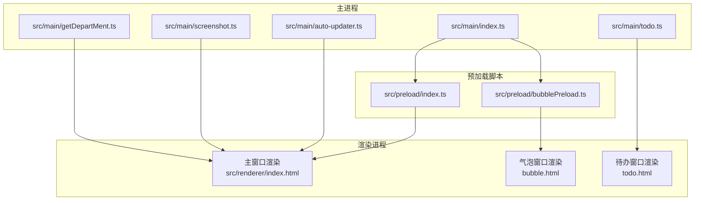
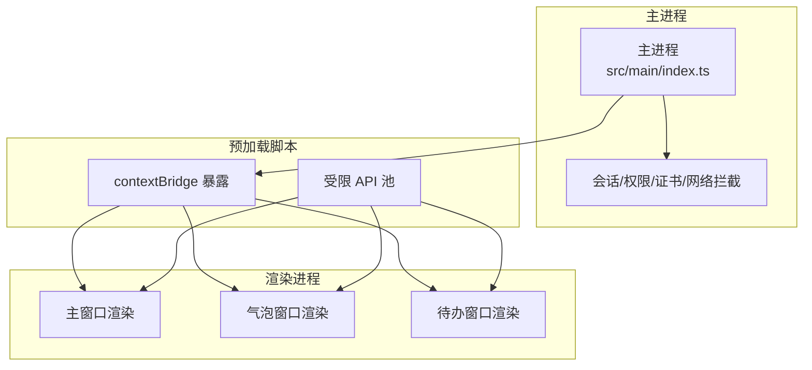
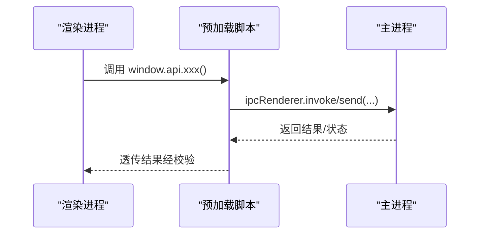
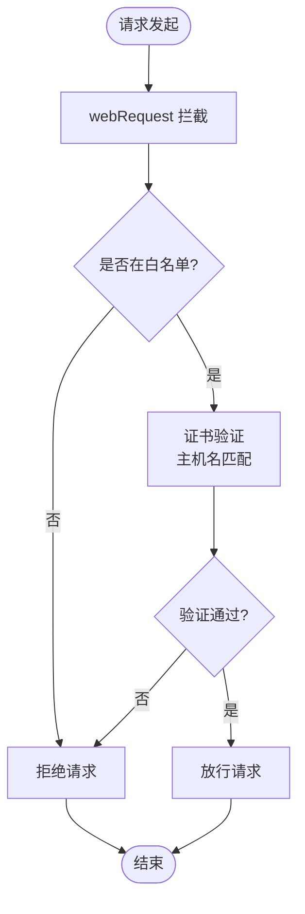
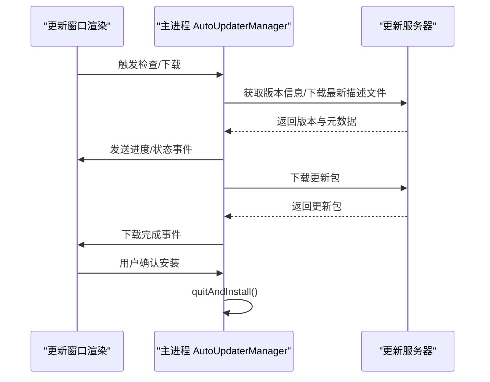
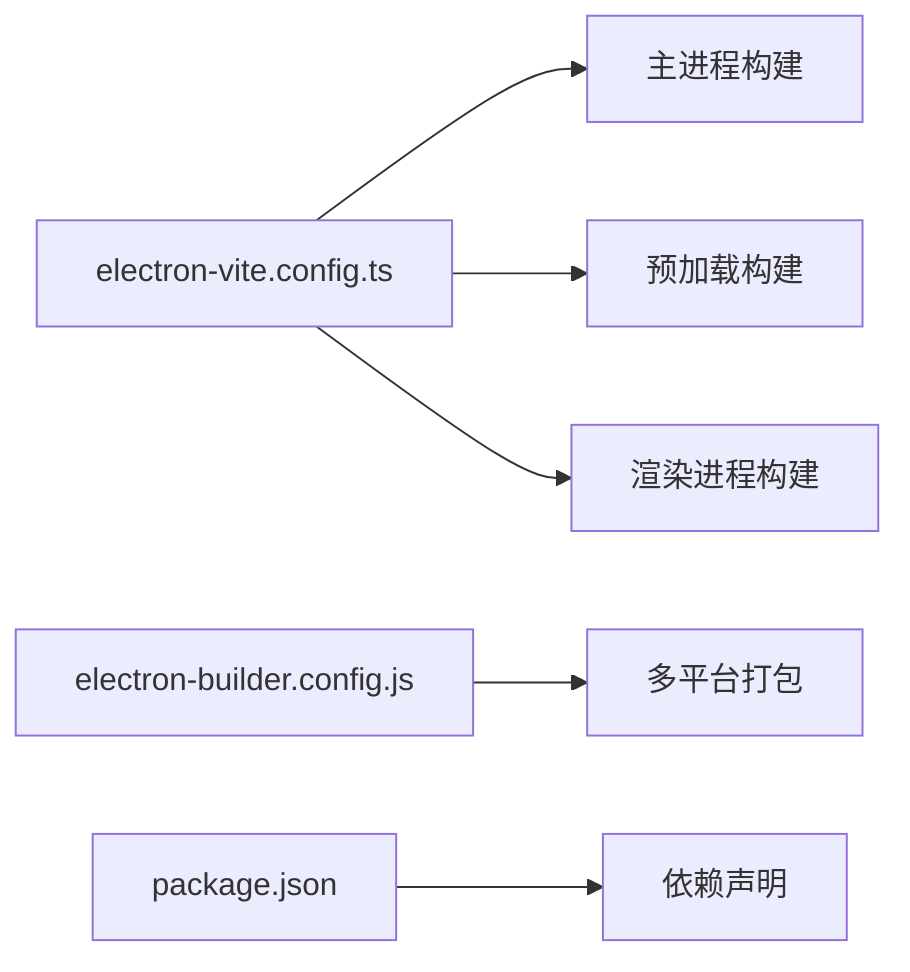

# 安全设计原则

<cite>
**本文引用的文件**
- [package.json](file://package.json)
- [electron.vite.config.ts](file://electron.vite.config.ts)
- [ARCHITECTURE.md](file://ARCHITECTURE.md)
- [src/main/index.ts](file://src/main/index.ts)
- [src/preload/index.ts](file://src/preload/index.ts)
- [src/preload/bubblePreload.ts](file://src/preload/bubblePreload.ts)
- [src/main/auto-updater.ts](file://src/main/auto-updater.ts)
- [src/main/getDepartMent.ts](file://src/main/getDepartMent.ts)
- [src/main/ticket.ts](file://src/main/todo.ts)
- [src/main/screenshot.ts](file://src/main/screenshot.ts)
- [src/renderer/index.html](file://src/renderer/index.html)
- [temp_eSearch/electron-builder.config.js](file://temp_eSearch/electron-builder.config.js)
</cite>

## 目录
1. [引言](#引言)
2. [项目结构](#项目结构)
3. [核心组件](#核心组件)
4. [架构总览](#架构总览)
5. [详细组件分析](#详细组件分析)
6. [依赖关系分析](#依赖关系分析)
7. [性能考量](#性能考量)
8. [故障排查指南](#故障排查指南)
9. [结论](#结论)
10. [附录](#附录)

## 引言
本文件围绕 WoaApp 的安全设计原则展开，聚焦于当前安全配置决策与潜在风险，包括 contextIsolation 禁用、Node 集成启用、webSecurity 关闭、沙盒禁用、证书验证放宽、网络请求全放行等策略对应用安全的影响；同时阐述预加载脚本在安全隔离中的作用与 API 暴露的最小化原则，解释网络请求与证书验证策略，分析会话管理与 Cookie 安全配置，并提供安全加固建议、最佳实践、生产环境调整方案、威胁分析与防护措施、以及安全审计清单与合规性检查要点。

## 项目结构
WoaApp 采用 Electron 多进程架构：主进程负责窗口、会话、系统集成功能；渲染进程承载 UI 与业务逻辑；预加载脚本作为安全桥接，向渲染进程暴露受限 API。构建与打包由 electron-vite 与 electron-builder 协同完成。

图表来源
- [src/main/index.ts](file://src/main/index.ts#L275-L310)
- [src/preload/index.ts](file://src/preload/index.ts#L1-L63)
- [src/preload/bubblePreload.ts](file://src/preload/bubblePreload.ts#L1-L70)
- [src/main/auto-updater.ts](file://src/main/auto-updater.ts#L311-L325)
- [src/main/todo.ts](file://src/main/todo.ts#L44-L56)
- [src/main/screenshot.ts](file://src/main/screenshot.ts#L16-L78)
- [src/main/getDepartMent.ts](file://src/main/getDepartMent.ts#L6-L49)
- [src/renderer/index.html](file://src/renderer/index.html#L1-L17)

章节来源
- [ARCHITECTURE.md](file://ARCHITECTURE.md#L16-L42)
- [electron.vite.config.ts](file://electron.vite.config.ts#L1-L60)

## 核心组件
- 主进程窗口与会话管理：创建主窗口、气泡窗口与待办窗口，配置 webPreferences（contextIsolation、nodeIntegration、webSecurity、sandbox 等），设置持久化会话、Cookie 策略、权限请求与证书验证、网络拦截规则。
- 预加载脚本：通过 contextBridge 暴露受限 API 至渲染进程；在禁用 contextIsolation 时，直接在 window 上暴露 API。
- 自动更新：独立窗口与渲染页，使用 electron-updater，下载与安装流程由主进程协调。
- 待办与截图：通过 IPC 与主进程交互，实现数据持久化与系统级能力调用。
- 渲染端 CSP：在 index.html 中声明基础 CSP，限制默认源与脚本源。

章节来源
- [src/main/index.ts](file://src/main/index.ts#L275-L310)
- [src/preload/index.ts](file://src/preload/index.ts#L1-L63)
- [src/preload/bubblePreload.ts](file://src/preload/bubblePreload.ts#L1-L70)
- [src/main/auto-updater.ts](file://src/main/auto-updater.ts#L311-L325)
- [src/main/todo.ts](file://src/main/todo.ts#L44-L56)
- [src/main/screenshot.ts](file://src/main/screenshot.ts#L16-L78)
- [src/renderer/index.html](file://src/renderer/index.html#L6-L10)

## 架构总览
下图展示了主进程、预加载脚本与渲染进程之间的安全边界与通信路径。当前配置在渲染进程层面显著降低安全边界，需要通过严格的 API 暴露与最小权限原则进行补偿。

图表来源
- [src/main/index.ts](file://src/main/index.ts#L286-L302)
- [src/preload/index.ts](file://src/preload/index.ts#L45-L62)
- [src/preload/bubblePreload.ts](file://src/preload/bubblePreload.ts#L3-L61)

## 详细组件分析

### 预加载脚本与安全隔离
- 设计目标：在 contextIsolation 禁用场景下，通过预加载脚本建立最小可行的 API 暴露面，避免直接暴露 Node/Electron 能力给渲染进程。
- 实施方式：
  - 主预加载脚本：使用 contextBridge.exposeInMainWorld 暴露有限 API（如截图、待办、表情模糊状态、自动更新触发等），并在禁用隔离时回退到 window 对象直接挂载。
  - 气泡预加载脚本：在禁用隔离时直接在 window 上暴露消息监听、通知模式更新、开发者工具等轻量 API。
- 风险与建议：
  - 当前配置禁用了 contextIsolation，渲染进程可直接访问 window.electron/ipcRenderer 等对象，存在 XSS、CSRF、信息泄露等风险。
  - 建议：启用 contextIsolation，严格限定通过 contextBridge 暴露的 API 名称与参数校验，引入白名单与最小权限模型。

图表来源
- [src/preload/index.ts](file://src/preload/index.ts#L16-L43)
- [src/main/index.ts](file://src/main/index.ts#L130-L139)

章节来源
- [src/preload/index.ts](file://src/preload/index.ts#L1-L63)
- [src/preload/bubblePreload.ts](file://src/preload/bubblePreload.ts#L1-L70)
- [ARCHITECTURE.md](file://ARCHITECTURE.md#L402-L421)

### 网络请求与证书验证策略
- 当前策略：
  - 全放行网络请求：webRequest.onBeforeRequest 允许所有请求，onBeforeRedirect 不阻止重定向。
  - 证书验证：setCertificateVerifyProc 接受所有证书（回调返回 0）。
  - 权限请求：setPermissionRequestHandler 允许所有权限。
- 风险与建议：
  - 风险：中间人攻击、恶意域名解析、权限滥用、敏感数据泄露。
  - 建议：生产环境启用严格的证书链验证与主机名匹配；对请求源与目标域进行白名单控制；对权限请求进行细粒度审批与用户确认。

图表来源
- [src/main/index.ts](file://src/main/index.ts#L340-L364)
- [src/main/index.ts](file://src/main/index.ts#L335-L338)

章节来源
- [src/main/index.ts](file://src/main/index.ts#L335-L364)
- [ARCHITECTURE.md](file://ARCHITECTURE.md#L422-L432)

### 会话管理与 Cookie 安全
- 当前策略：
  - 使用持久化会话分区（persist:woachat），保持登录状态。
  - 监听 cookies.changed，记录 wps.cn/kdocs.cn 域名下的登录 Cookie。
  - 不主动清除存储数据，允许持久化。
- 风险与建议：
  - 风险：Cookie 泄露、会话劫持、跨站追踪。
  - 建议：启用 SameSite/Lax/Strict、HttpOnly（在可控范围内）、Secure（仅 HTTPS）、Domain/Path 精确限定；对敏感 Cookie 设置过期时间与刷新策略；在主进程侧限制第三方 Cookie 与跨站请求。

章节来源
- [src/main/index.ts](file://src/main/index.ts#L312-L324)
- [src/main/index.ts](file://src/main/index.ts#L239-L273)

### 自动更新与下载安全
- 当前策略：
  - 使用 electron-updater，独立窗口与渲染页展示更新流程。
  - 开发环境模拟下载进度，生产环境下载 latest.yml 并触发下载。
  - feed URL 指向本地测试地址（开发/生产均指向本地）。
- 风险与建议：
  - 风险：更新包篡改、签名缺失、下载链路 MITM。
  - 建议：启用签名验证与完整性校验；使用 HTTPS 与可信源；对下载文件进行二次校验；在主进程侧限制更新窗口的权限与网络访问。

图表来源
- [src/main/auto-updater.ts](file://src/main/auto-updater.ts#L82-L131)
- [src/main/auto-updater.ts](file://src/main/auto-updater.ts#L188-L221)
- [src/main/auto-updater.ts](file://src/main/auto-updater.ts#L435-L473)

章节来源
- [src/main/auto-updater.ts](file://src/main/auto-updater.ts#L46-L50)
- [src/main/auto-updater.ts](file://src/main/auto-updater.ts#L134-L186)
- [src/main/auto-updater.ts](file://src/main/auto-updater.ts#L517-L543)

### 渲染端 CSP 与安全基线
- 当前策略：
  - 在 index.html 中声明基础 CSP，限制默认源与脚本源，允许内联样式。
- 建议：
  - 生产环境应收紧 CSP，避免 unsafe-inline；对外链资源使用哈希或 Subresource Integrity；启用 block-all-mixed-content 与 upgrade-insecure-requests。

章节来源
- [src/renderer/index.html](file://src/renderer/index.html#L6-L10)

## 依赖关系分析
- 构建与打包：
  - electron-vite 负责主进程、预加载与渲染进程的构建与开发服务器。
  - electron-builder 负责多平台打包与产物精简。
- 依赖与版本：
  - Electron 33.2.0、Vue 3、TypeScript、electron-updater 等。

图表来源
- [electron.vite.config.ts](file://electron.vite.config.ts#L1-L60)
- [temp_eSearch/electron-builder.config.js](file://temp_eSearch/electron-builder.config.js#L133-L268)
- [package.json](file://package.json#L25-L53)

章节来源
- [electron.vite.config.ts](file://electron.vite.config.ts#L1-L60)
- [temp_eSearch/electron-builder.config.js](file://temp_eSearch/electron-builder.config.js#L133-L268)
- [package.json](file://package.json#L1-L55)

## 性能考量
- 背景节流禁用：backgroundThrottling: false，确保渲染与通知体验，但可能增加 CPU 占用。
- 窗口置顶与动画：气泡窗口 alwaysOnTop 与 showInactive，避免抢占焦点。
- 网络拦截与证书验证：全放行策略简化开发，但会带来安全风险与潜在的性能损耗（无缓存与校验）。

章节来源
- [src/main/index.ts](file://src/main/index.ts#L296-L299)
- [src/main/index.ts](file://src/main/index.ts#L635-L644)

## 故障排查指南
- 网络加载失败：
  - 主窗口 did-fail-load 事件中区分主页面与内部登录重定向失败，避免误报。
  - 若登录重定向失败，显示本地提示页引导用户在浏览器中登录。
- 渲染进程崩溃保护：
  - 气泡窗口 render-process-gone 事件中自动 reload 并恢复位置。
- 自动更新异常：
  - 捕获下载进度与错误事件，开发环境模拟进度，生产环境下载 latest.yml 并触发下载。

章节来源
- [src/main/index.ts](file://src/main/index.ts#L434-L450)
- [src/main/index.ts](file://src/main/index.ts#L594-L614)
- [src/main/index.ts](file://src/main/index.ts#L739-L747)
- [src/main/auto-updater.ts](file://src/main/auto-updater.ts#L171-L185)
- [src/main/auto-updater.ts](file://src/main/auto-updater.ts#L449-L473)

## 结论
当前 WoaApp 为换取功能便利，在渲染进程层面显著降低了安全边界（contextIsolation、webSecurity、沙盒等禁用，证书验证与网络拦截全放行）。建议在生产环境中逐步启用安全隔离、最小权限 API 暴露、严格的证书与网络策略、以及更严格的会话与 Cookie 安全配置，并配套自动化安全审计与合规检查。

## 附录

### 安全威胁分析与防护措施
- 威胁类型
  - XSS/CSRF：由于禁用 contextIsolation，渲染进程可直接访问 Node/Electron API，易受恶意脚本与跨站请求影响。
  - 中间人攻击：证书验证全放行导致 MITM 风险。
  - 权限滥用：权限请求全放行，可能导致摄像头/麦克风/文件系统等权限被滥用。
  - 会话劫持：Cookie 未强制 HttpOnly/Secure/SameSite，存在跨站追踪与劫持风险。
- 防护措施
  - 启用 contextIsolation，严格通过 contextBridge 暴露 API。
  - 实施 CSP、HTTPS 强制、混合内容阻断。
  - 证书验证：实现严格主机名匹配与信任链校验。
  - 网络白名单：仅允许必要域名与方法，拦截未知来源。
  - 会话安全：启用 HttpOnly/Secure/SameSite，限制第三方 Cookie，缩短会话有效期。

章节来源
- [src/main/index.ts](file://src/main/index.ts#L286-L302)
- [src/main/index.ts](file://src/main/index.ts#L335-L338)
- [src/main/index.ts](file://src/main/index.ts#L329-L333)
- [src/main/index.ts](file://src/main/index.ts#L319-L324)

### 安全加固实施建议与最佳实践
- 预加载脚本
  - 仅暴露必要 API，参数校验与类型约束，禁止直接暴露 ipcRenderer 或 Node 能力。
  - 在禁用隔离时，仍通过 window 对象暴露最小 API 面，并在渲染端显式检查隔离状态。
- 网络与证书
  - 仅允许白名单域名与特定方法；对证书验证实现严格校验。
  - 对权限请求实现用户确认与最小授权。
- 会话与 Cookie
  - 强制 HttpOnly/Secure/SameSite；限制 Domain/Path；定期刷新敏感 Cookie。
- 自动更新
  - 启用签名与完整性校验；仅允许 HTTPS 与可信源；下载后二次校验。

章节来源
- [src/preload/index.ts](file://src/preload/index.ts#L45-L62)
- [src/main/auto-updater.ts](file://src/main/auto-updater.ts#L517-L543)

### 生产环境安全配置调整方案
- webPreferences
  - 启用 contextIsolation，禁用 nodeIntegration，启用 webSecurity，启用 sandbox。
  - 保留 preload 路径，确保最小 API 暴露。
- 会话与网络
  - setCertificateVerifyProc 实现严格校验；webRequest 白名单放行。
  - setPermissionRequestHandler 实施细粒度审批。
- 渲染端
  - 强化 CSP，禁用 unsafe-inline；启用 upgrade-insecure-requests。
- 自动更新
  - 切换至可信更新源；启用签名与完整性校验；下载后二次校验。

章节来源
- [src/main/index.ts](file://src/main/index.ts#L286-L302)
- [src/main/index.ts](file://src/main/index.ts#L335-L338)
- [src/main/index.ts](file://src/main/index.ts#L340-L364)
- [src/renderer/index.html](file://src/renderer/index.html#L6-L10)
- [src/main/auto-updater.ts](file://src/main/auto-updater.ts#L517-L543)

### 安全审计清单与合规性检查要点
- 配置项核对
  - 是否启用 contextIsolation 与 webSecurity？
  - 是否禁用 nodeIntegration 与沙盒？（如需保留，必须配合严格 API 暴露）
  - 证书验证是否实现严格校验？
  - 网络请求是否仅允许白名单域名与方法？
  - 权限请求是否需要用户确认？
  - Cookie 是否启用 HttpOnly/Secure/SameSite？
  - CSP 是否收紧，避免 unsafe-inline？
- 流程与证据
  - 自动更新是否具备签名与完整性校验？
  - 是否有证书验证失败的告警与阻断记录？
  - 是否对异常网络请求与权限滥用有审计日志？
- 合规性
  - 是否满足企业内控与数据保护要求（如最小权限、数据最小化、可追溯性）？

章节来源
- [src/main/index.ts](file://src/main/index.ts#L286-L302)
- [src/main/index.ts](file://src/main/index.ts#L335-L338)
- [src/main/index.ts](file://src/main/index.ts#L340-L364)
- [src/renderer/index.html](file://src/renderer/index.html#L6-L10)
- [src/main/auto-updater.ts](file://src/main/auto-updater.ts#L517-L543)