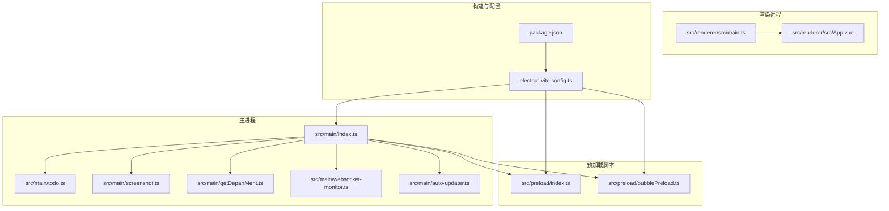
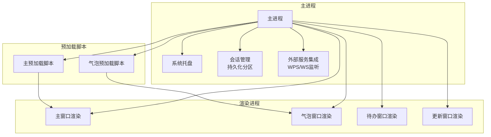
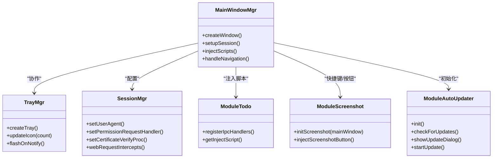
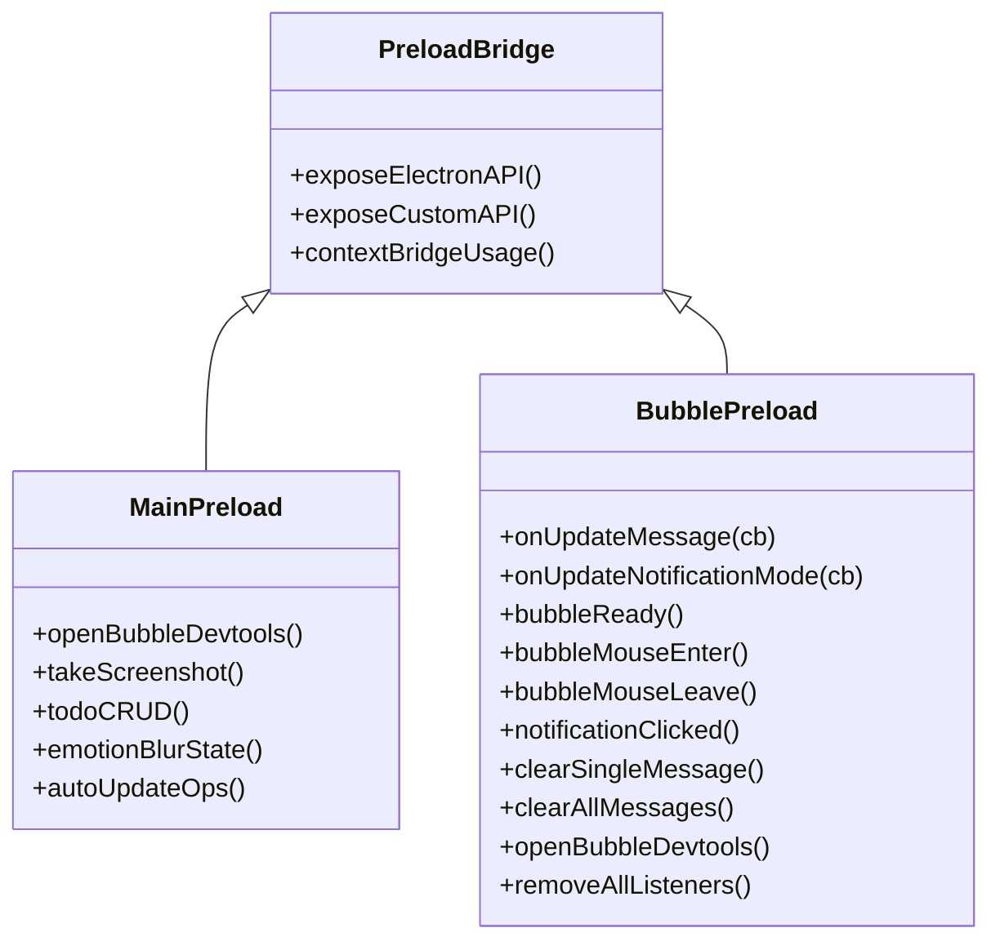
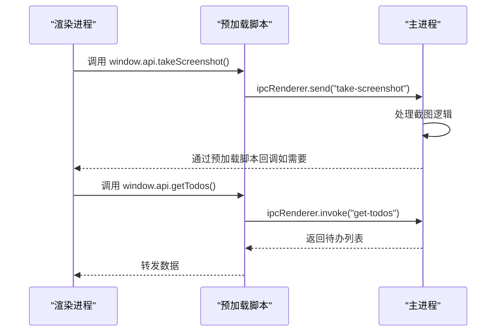
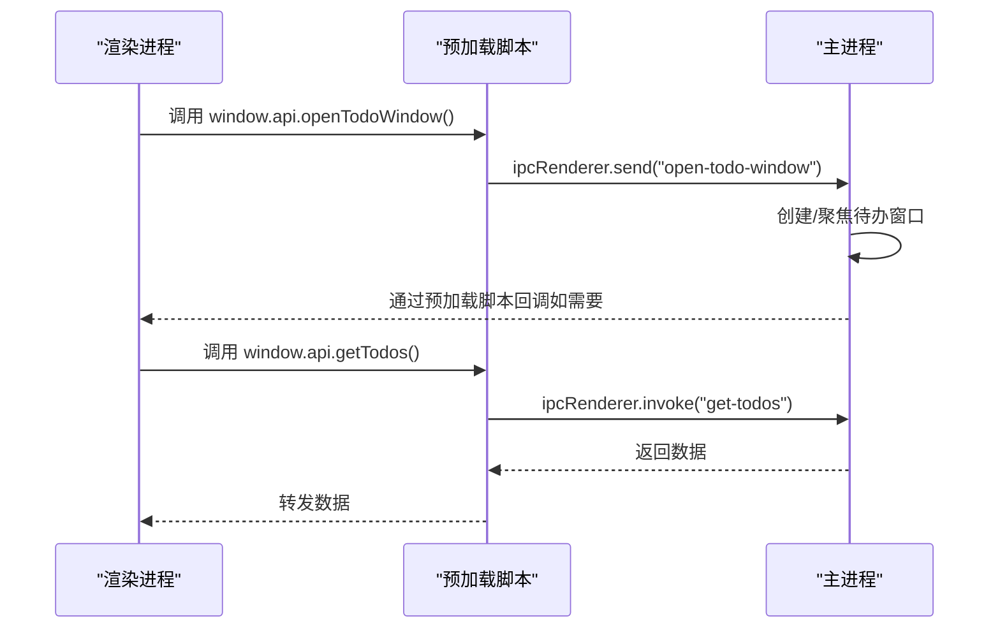
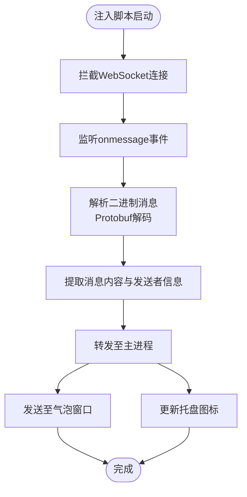
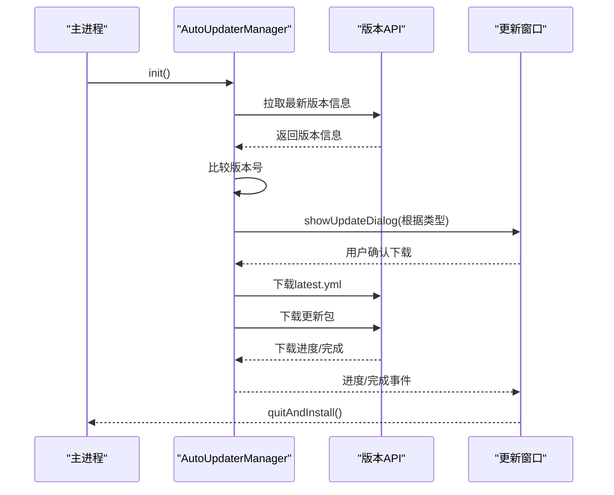
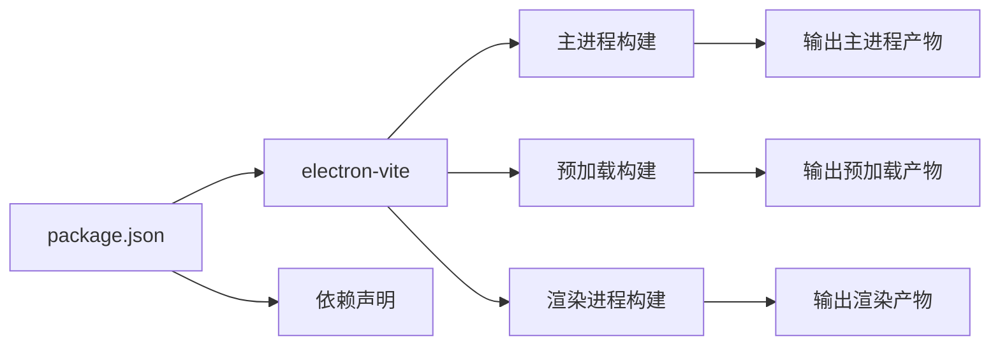

# 架构设计

<cite>
**本文引用的文件**   
- [ARCHITECTURE.md](file://ARCHITECTURE.md)
- [src/main/index.ts](file://src/main/index.ts)
- [src/preload/index.ts](file://src/preload/index.ts)
- [src/preload/bubblePreload.ts](file://src/preload/bubblePreload.ts)
- [src/renderer/src/main.ts](file://src/renderer/src/main.ts)
- [src/renderer/src/App.vue](file://src/renderer/src/App.vue)
- [src/main/todo.ts](file://src/main/todo.ts)
- [src/main/screenshot.ts](file://src/main/screenshot.ts)
- [src/main/getDepartMent.ts](file://src/main/getDepartMent.ts)
- [src/main/websocket-monitor.ts](file://src/main/websocket-monitor.ts)
- [src/main/auto-updater.ts](file://src/main/auto-updater.ts)
- [electron.vite.config.ts](file://electron.vite.config.ts)
- [package.json](file://package.json)
</cite>

## 目录
1. [引言](#引言)
2. [项目结构](#项目结构)
3. [核心组件](#核心组件)
4. [架构总览](#架构总览)
5. [详细组件分析](#详细组件分析)
6. [依赖分析](#依赖分析)
7. [性能考量](#性能考量)
8. [故障排查指南](#故障排查指南)
9. [结论](#结论)
10. [附录](#附录)

## 引言
本文件面向WoaApp项目的架构设计文档，围绕Electron多进程架构展开，系统阐述主进程、渲染进程与预加载脚本的职责边界与协作方式；总结模块化设计原则与组件交互模式；详解IPC通信机制的安全实现与最佳实践；并给出可扩展性设计建议与未来发展方向。文中配有架构图、序列图与流程图，帮助开发者快速理解整体设计思路与技术决策。

## 项目结构
WoaApp采用典型的Electron多进程架构，结合Vue + TypeScript + Electron-vite构建渲染层与主进程模块。项目目录组织清晰，按职责划分为主进程(src/main)、预加载脚本(src/preload)、渲染进程(src/renderer)三大部分，并辅以通用工具与配置文件。

- 主进程：集中管理窗口、系统托盘、会话与外部服务集成，负责业务模块的编排与IPC事件注册。
- 预加载脚本：在受限上下文中向渲染进程暴露受控API，作为安全桥接层。
- 渲染进程：承载Vue应用与多窗口页面，负责用户界面与交互。
- 构建与配置：通过electron.vite.config.ts与package.json中的脚本，分别定义主/预加载/渲染的构建与打包策略。

**图表来源**
- [src/main/index.ts](file://src/main/index.ts#L1-L120)
- [src/preload/index.ts](file://src/preload/index.ts#L1-L63)
- [src/preload/bubblePreload.ts](file://src/preload/bubblePreload.ts#L1-L70)
- [src/renderer/src/main.ts](file://src/renderer/src/main.ts#L1-L7)
- [src/renderer/src/App.vue](file://src/renderer/src/App.vue#L1-L27)
- [electron.vite.config.ts](file://electron.vite.config.ts#L1-L60)
- [package.json](file://package.json#L1-L55)

**章节来源**
- [ARCHITECTURE.md](file://ARCHITECTURE.md#L1-L120)
- [electron.vite.config.ts](file://electron.vite.config.ts#L1-L60)
- [package.json](file://package.json#L1-L55)

## 核心组件
本节聚焦主进程、预加载脚本与渲染进程的关键职责与交互要点：

- 主进程
  - 窗口管理：创建并控制主窗口、气泡窗口、待办窗口、更新窗口等。
  - 系统集成功能：托盘、快捷键、会话持久化、证书与网络策略配置。
  - 外部服务集成：WPS云办公平台接入、WebSocket消息拦截与转发、用户信息缓存。
  - 模块编排：待办管理、截图、自动更新等模块的初始化与事件注册。

- 预加载脚本
  - 安全桥接：通过contextBridge在渲染进程暴露受控API；在禁用上下文隔离场景下直接挂载至window对象。
  - 功能封装：对IPC调用进行封装，提供简洁易用的接口给渲染进程。

- 渲染进程
  - Vue应用：入口文件创建应用实例并挂载根组件。
  - 组件与页面：主窗口页面、气泡窗口页面、待办窗口页面、更新窗口页面等。

**章节来源**
- [src/main/index.ts](file://src/main/index.ts#L1-L120)
- [src/preload/index.ts](file://src/preload/index.ts#L1-L63)
- [src/preload/bubblePreload.ts](file://src/preload/bubblePreload.ts#L1-L70)
- [src/renderer/src/main.ts](file://src/renderer/src/main.ts#L1-L7)
- [src/renderer/src/App.vue](file://src/renderer/src/App.vue#L1-L27)

## 架构总览
WoaApp采用“主进程统一调度 + 渲染进程专注UI + 预加载脚本安全桥接”的经典Electron架构。主进程负责系统级能力与业务模块编排，渲染进程承载UI与交互，预加载脚本在受控上下文中暴露API，确保跨进程通信的安全与可控。

**图表来源**
- [src/main/index.ts](file://src/main/index.ts#L90-L130)
- [src/preload/index.ts](file://src/preload/index.ts#L1-L63)
- [src/preload/bubblePreload.ts](file://src/preload/bubblePreload.ts#L1-L70)

**章节来源**
- [ARCHITECTURE.md](file://ARCHITECTURE.md#L16-L120)

## 详细组件分析

### 主进程组件分析
主进程承担应用的中枢控制，负责窗口生命周期、系统托盘、会话与外部服务集成、以及模块初始化与事件注册。

**图表来源**
- [src/main/index.ts](file://src/main/index.ts#L275-L615)
- [src/main/todo.ts](file://src/main/todo.ts#L20-L136)
- [src/main/screenshot.ts](file://src/main/screenshot.ts#L16-L96)
- [src/main/auto-updater.ts](file://src/main/auto-updater.ts#L40-L131)

**章节来源**
- [src/main/index.ts](file://src/main/index.ts#L90-L235)
- [src/main/todo.ts](file://src/main/todo.ts#L20-L136)
- [src/main/screenshot.ts](file://src/main/screenshot.ts#L16-L96)
- [src/main/auto-updater.ts](file://src/main/auto-updater.ts#L40-L131)

### 预加载脚本组件分析
预加载脚本在受限上下文中向渲染进程暴露受控API，形成安全的IPC桥接层。主预加载脚本与气泡预加载脚本分别服务于不同窗口的通信需求。

**图表来源**
- [src/preload/index.ts](file://src/preload/index.ts#L4-L62)
- [src/preload/bubblePreload.ts](file://src/preload/bubblePreload.ts#L4-L61)

**章节来源**
- [src/preload/index.ts](file://src/preload/index.ts#L1-L63)
- [src/preload/bubblePreload.ts](file://src/preload/bubblePreload.ts#L1-L70)

### 渲染进程组件分析
渲染进程由Vue应用构成，入口文件创建应用实例并挂载根组件；页面通过预加载脚本暴露的API与主进程进行IPC通信。

**图表来源**
- [src/renderer/src/main.ts](file://src/renderer/src/main.ts#L1-L7)
- [src/renderer/src/App.vue](file://src/renderer/src/App.vue#L1-L27)
- [src/preload/index.ts](file://src/preload/index.ts#L17-L43)
- [src/main/todo.ts](file://src/main/todo.ts#L82-L84)

**章节来源**
- [src/renderer/src/main.ts](file://src/renderer/src/main.ts#L1-L7)
- [src/renderer/src/App.vue](file://src/renderer/src/App.vue#L1-L27)
- [src/preload/index.ts](file://src/preload/index.ts#L1-L63)

### IPC通信机制与安全实践
IPC是主进程与渲染进程之间的核心通信通道。WoaApp通过预加载脚本封装IPC调用，实现安全可控的API暴露。同时，主进程对事件进行集中注册与处理，避免渲染进程直接调用系统API。

**图表来源**
- [src/preload/index.ts](file://src/preload/index.ts#L25-L33)
- [src/main/todo.ts](file://src/main/todo.ts#L77-L84)

**章节来源**
- [src/preload/index.ts](file://src/preload/index.ts#L1-L63)
- [src/main/todo.ts](file://src/main/todo.ts#L77-L136)

### WebSocket消息监听与处理
主进程通过注入脚本拦截WebSocket消息，解析Protobuf数据并提取消息内容，随后将消息转发至气泡窗口与托盘状态更新。

**图表来源**
- [src/main/websocket-monitor.ts](file://src/main/websocket-monitor.ts#L163-L210)
- [src/main/index.ts](file://src/main/index.ts#L130-L139)

**章节来源**
- [src/main/websocket-monitor.ts](file://src/main/websocket-monitor.ts#L1-L242)
- [src/main/index.ts](file://src/main/index.ts#L130-L139)

### 自动更新模块分析
自动更新模块负责版本检查、下载进度跟踪与安装流程，支持强制、主动与被动三种更新类型，并在网页中注入更新提示图标。

**图表来源**
- [src/main/auto-updater.ts](file://src/main/auto-updater.ts#L40-L131)
- [src/main/auto-updater.ts](file://src/main/auto-updater.ts#L188-L221)
- [src/main/auto-updater.ts](file://src/main/auto-updater.ts#L297-L353)

**章节来源**
- [src/main/auto-updater.ts](file://src/main/auto-updater.ts#L40-L565)

## 依赖分析
- 构建与打包
  - electron-vite负责主进程、预加载与渲染进程的构建与开发服务器；预加载脚本分别构建主预加载与气泡预加载两套产物。
  - package.json定义了开发与生产脚本，以及Electron相关依赖。

- 外部依赖
  - electron-store用于本地数据持久化；electron-updater用于自动更新；electron-screenshots用于截图功能；iconv-lite用于编码转换。

**图表来源**
- [electron.vite.config.ts](file://electron.vite.config.ts#L5-L59)
- [package.json](file://package.json#L25-L53)

**章节来源**
- [electron.vite.config.ts](file://electron.vite.config.ts#L1-L60)
- [package.json](file://package.json#L1-L55)

## 性能考量
- 内存与事件管理
  - 及时清理定时器、事件监听器与窗口句柄，避免内存泄漏。
  - 控制消息缓存数量与窗口生命周期，减少不必要的资源占用。

- 渲染性能
  - Vue组件按需加载与懒加载策略；气泡窗口使用showInactive避免抢占焦点；禁用后台节流以保证实时提醒。

- 网络与会话
  - 会话持久化与Cookie管理，减少重复登录成本；网络请求放开限制以提升兼容性，但需注意安全风险。

**章节来源**
- [ARCHITECTURE.md](file://ARCHITECTURE.md#L434-L449)
- [src/main/index.ts](file://src/main/index.ts#L286-L301)
- [src/main/index.ts](file://src/main/index.ts#L635-L645)

## 故障排查指南
- 窗口加载失败
  - 主进程在URL加载失败时会尝试备用方案与本地页面回退；检查did-fail-load事件与导航监听逻辑。

- 截图功能异常
  - 检查全局快捷键注册、截图实例状态与ESC取消逻辑；确认剪贴板写入与保存对话框流程。

- IPC调用无响应
  - 确认预加载脚本API暴露与事件注册；检查ipcMain.handle与ipcRenderer.invoke配对情况。

- 自动更新下载卡顿
  - 开发模式下模拟下载进度；生产模式下检查latest.yml下载与下载进度事件分发。

**章节来源**
- [src/main/index.ts](file://src/main/index.ts#L531-L614)
- [src/main/screenshot.ts](file://src/main/screenshot.ts#L16-L96)
- [src/main/auto-updater.ts](file://src/main/auto-updater.ts#L475-L515)

## 结论
WoaApp通过清晰的多进程架构实现了功能模块化与组件解耦，主进程统一调度、预加载脚本安全桥接、渲染进程专注UI，形成了高内聚低耦合的系统设计。尽管当前安全配置为功能便利性而放宽，但整体架构具备良好的扩展性与演进空间。建议在后续版本中逐步收紧安全策略、完善错误处理与测试覆盖，并引入性能监控与文档体系，以支撑更稳健的长期发展。

## 附录
- 构建与脚本
  - 开发：electron-vite dev
  - 预览：electron-vite preview
  - 构建：electron-vite build
  - 打包：electron-builder（多平台）

- 关键配置
  - electron.vite.config.ts：主/预加载/渲染构建配置
  - package.json：脚本与依赖声明

**章节来源**
- [ARCHITECTURE.md](file://ARCHITECTURE.md#L345-L400)
- [electron.vite.config.ts](file://electron.vite.config.ts#L1-L60)
- [package.json](file://package.json#L9-L24)