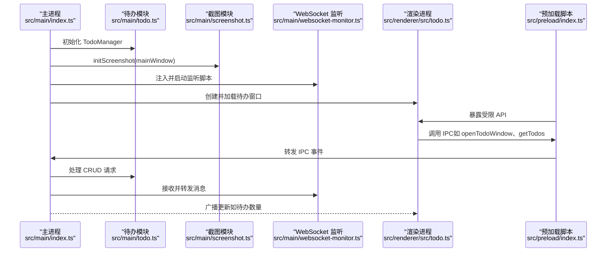
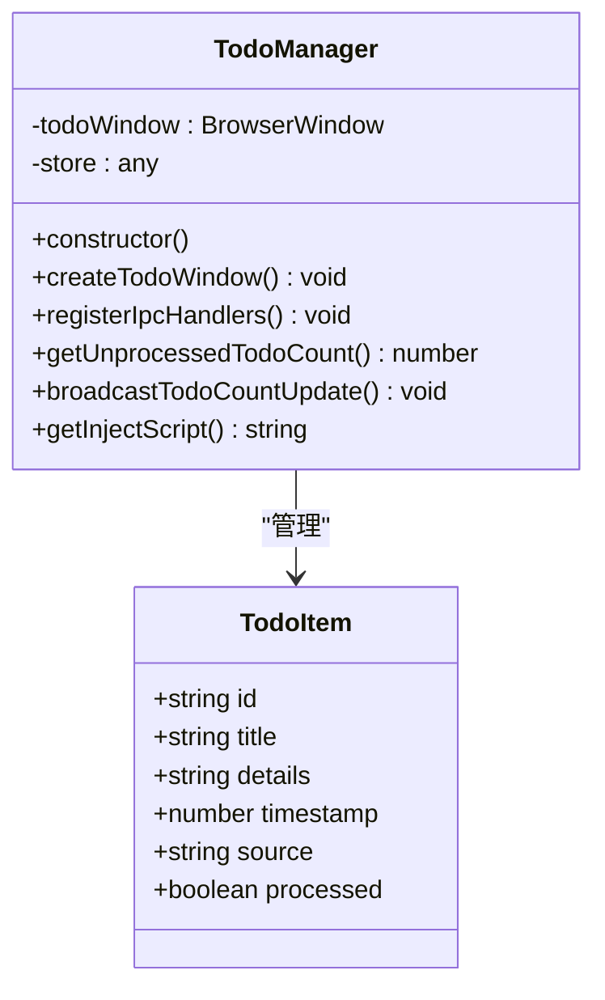
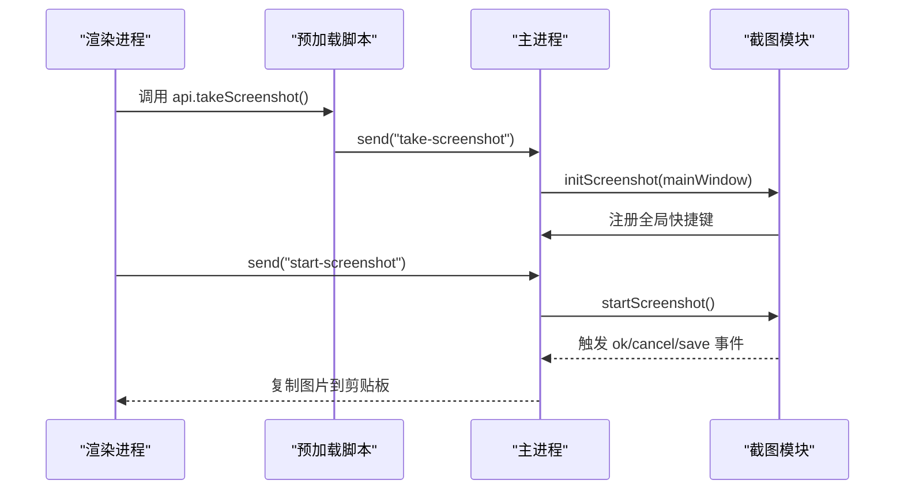
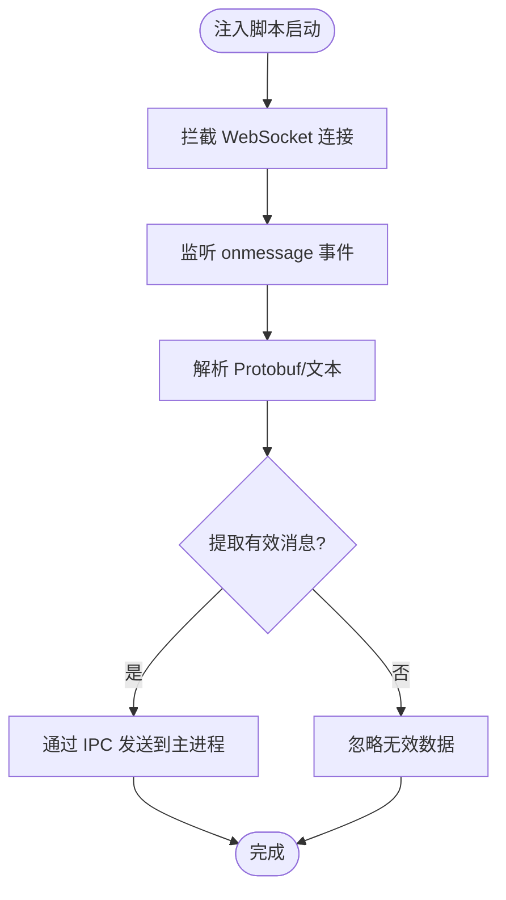
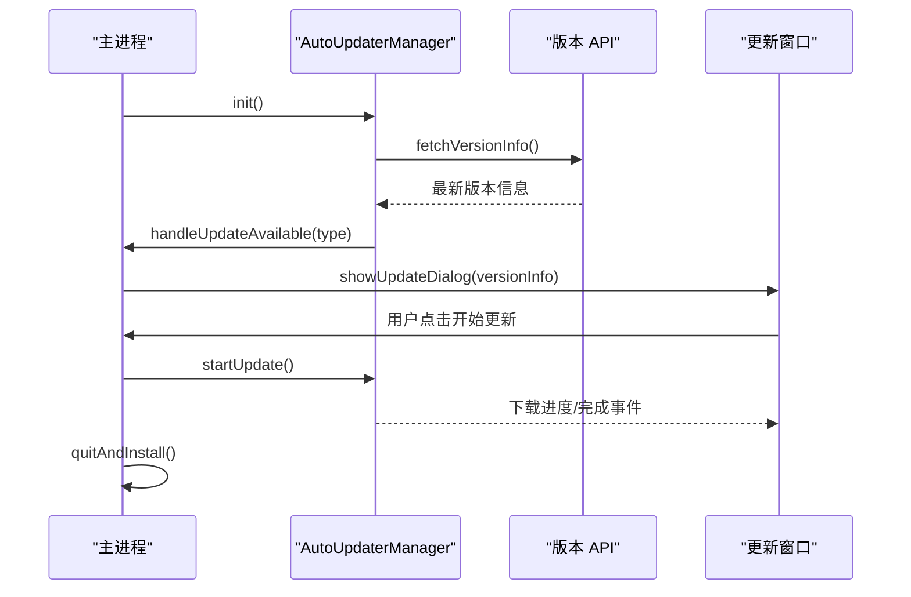
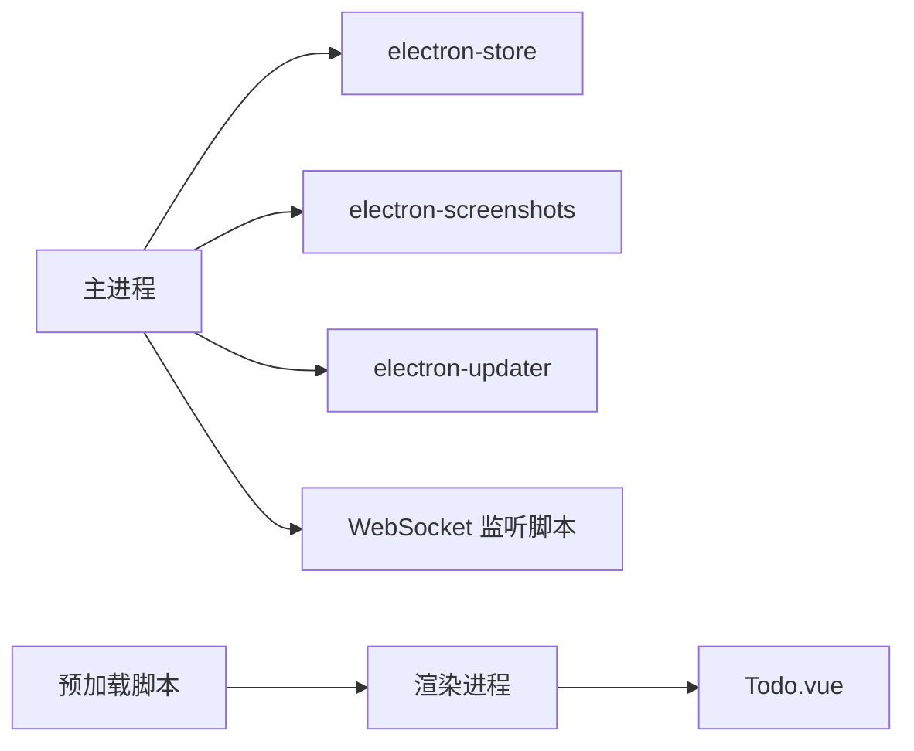

# 模块化设计模式

<cite>
**本文引用的文件**
- [ARCHITECTURE.md](file://ARCHITECTURE.md)
- [index.ts](file://src/main/index.ts)
- [todo.ts](file://src/main/todots)
- [screenshot.ts](file://src/main/screenshot.ts)
- [websocket-monitor.ts](file://src/main/websocket-monitor.ts)
- [getDepartMent.ts](file://src/main/getDepartMent.ts)
- [report.ts](file://src/main/report.ts)
- [emotion-blur-script.ts](file://src/main/emotion-blur-script.ts)
- [auto-updater.ts](file://src/main/auto-updater.ts)
- [index.ts](file://src/preload/index.ts)
- [bubblePreload.ts](file://src/preload/bubblePreload.ts)
- [main.ts](file://src/renderer/src/main.ts)
- [todo.ts](file://src/renderer/src/todo.ts)
- [Todo.vue](file://src/renderer/src/components/Todo.vue)
- [package.json](file://package.json)
</cite>

## 目录
1. [引言](#引言)
2. [项目结构](#项目结构)
3. [核心组件](#核心组件)
4. [架构总览](#架构总览)
5. [详细组件分析](#详细组件分析)
6. [依赖分析](#依赖分析)
7. [性能考量](#性能考量)
8. [故障排查指南](#故障排查指南)
9. [结论](#结论)
10. [附录](#附录)

## 引言
本文件围绕 WoaApp 的模块化设计模式展开，系统阐述项目如何通过模块化架构将功能拆分为独立模块（如待办事项管理、截图功能、WebSocket 监听等），并说明各模块的职责边界、接口设计、依赖关系、解耦策略与通信机制。同时提供模块扩展最佳实践、新功能集成指南、配置驱动的模块加载与运行时功能开关的设计思路，并给出具体代码示例路径以便读者快速定位实现。

## 项目结构
WoaApp 采用 Electron 多进程架构，主进程负责窗口管理、系统托盘、截图、待办管理、WebSocket 监听、自动更新等核心能力；渲染进程承载 Vue 应用与多窗口 UI；预加载脚本提供安全的 IPC 桥接。

```mermaid
graph TB
subgraph "主进程"
M["src/main/index.ts"]
TM["src/main/todo.ts"]
SC["src/main/screenshot.ts"]
WS["src/main/websocket-monitor.ts"]
GD["src/main/getDepartMent.ts"]
RP["src/main/report.ts"]
EB["src/main/emotion-blur-script.ts"]
AU["src/main/auto-updater.ts"]
end
subgraph "预加载脚本"
PI["src/preload/index.ts"]
PB["src/preload/bubblePreload.ts"]
end
subgraph "渲染进程"
RM["src/renderer/src/main.ts"]
RT["src/renderer/src/todo.ts"]
TV["src/renderer/src/components/Todo.vue"]
end
M --> TM
M --> SC
M --> WS
M --> GD
M --> RP
M --> EB
M --> AU
PI <- --> RM
PI <- --> RT
PB <- --> RM
PB <- --> RT
TV --> RT
```

图表来源
- [index.ts](file://src/main/index.ts#L1-L2406)
- [todo.ts](file://src/main/todo.ts#L1-L266)
- [screenshot.ts](file://src/main/screenshot.ts#L1-L158)
- [websocket-monitor.ts](file://src/main/websocket-monitor.ts#L1-L242)
- [getDepartMent.ts](file://src/main/getDepartMent.ts#L1-L50)
- [report.ts](file://src/main/report.ts#L1-L4)
- [emotion-blur-script.ts](file://src/main/emotion-blur-script.ts#L1-L282)
- [auto-updater.ts](file://src/main/auto-updater.ts#L1-L565)
- [index.ts](file://src/preload/index.ts#L1-L63)
- [bubblePreload.ts](file://src/preload/bubblePreload.ts#L1-L70)
- [main.ts](file://src/renderer/src/main.ts#L1-L7)
- [todo.ts](file://src/renderer/src/todo.ts#L1-L9)
- [Todo.vue](file://src/renderer/src/components/Todo.vue#L1-L281)

章节来源
- [ARCHITECTURE.md](file://ARCHITECTURE.md#L1-L492)
- [package.json](file://package.json#L1-L55)

## 核心组件
- 主进程入口与协调器：负责窗口创建、会话配置、功能模块初始化与 IPC 事件分发。
- 待办事项模块：提供窗口、数据持久化与 IPC 接口，支持从聊天内容提取待办。
- 截图模块：全局快捷键触发、剪贴板复制、保存对话框与脚本注入。
- WebSocket 监听模块：注入脚本拦截 WebSocket，解析 Protobuf，提取消息并回传主进程。
- 用户信息模块：从页面提取并缓存用户信息。
- 自动更新模块：版本检查、下载、安装与 UI 提醒。
- 预加载脚本：在禁用上下文隔离场景下，向渲染进程暴露受限 API。
- 渲染进程与 Vue 组件：待办窗口的 UI 与交互逻辑。

章节来源
- [index.ts](file://src/main/index.ts#L1-L2406)
- [todo.ts](file://src/main/todo.ts#L1-L266)
- [screenshot.ts](file://src/main/screenshot.ts#L1-L158)
- [websocket-monitor.ts](file://src/main/websocket-monitor.ts#L1-L242)
- [getDepartMent.ts](file://src/main/getDepartMent.ts#L1-L50)
- [auto-updater.ts](file://src/main/auto-updater.ts#L1-L565)
- [index.ts](file://src/preload/index.ts#L1-L63)
- [bubblePreload.ts](file://src/preload/bubblePreload.ts#L1-L70)
- [Todo.vue](file://src/renderer/src/components/Todo.vue#L1-L281)

## 架构总览
WoaApp 的模块化架构遵循“主进程统一协调、渲染进程专注 UI、预加载脚本安全桥接”的原则。模块之间通过 IPC 事件解耦，配置驱动实现功能开关与运行时加载。



图表来源
- [index.ts](file://src/main/index.ts#L1-L2406)
- [todo.ts](file://src/main/todo.ts#L1-L266)
- [screenshot.ts](file://src/main/screenshot.ts#L1-L158)
- [websocket-monitor.ts](file://src/main/websocket-monitor.ts#L1-L242)
- [index.ts](file://src/preload/index.ts#L1-L63)
- [todo.ts](file://src/renderer/src/todo.ts#L1-L9)

## 详细组件分析

### 待办事项管理模块
- 职责边界
  - 管理待办窗口生命周期与 UI。
  - 提供待办数据的增删改查与未处理计数统计。
  - 注入脚本到主聊天窗口，提供“从聊天添加到待办”能力与角标更新。
- 接口设计
  - IPC 事件：open-todo-window、get-todos、add-todo、update-todo、delete-todo、get-unprocessed-todo-count、add-todo-from-chat。
  - 注入脚本暴露 window.api 与 window.electron.ipcRenderer 供页面调用。
- 依赖关系
  - 依赖 electron-store 进行本地持久化。
  - 依赖主进程 TodoManager 的 IPC 处理与广播。
- 解耦策略
  - 通过注入脚本与预加载 API 松耦合通信。
  - 通过广播事件向所有窗口同步状态。
- 扩展建议
  - 新增过滤/排序/标签字段时，优先扩展 TodoItem 结构与注入脚本 UI。
  - 通过配置项控制是否启用“从聊天提取”。



图表来源
- [todo.ts](file://src/main/todo.ts#L1-L266)

章节来源
- [todo.ts](file://src/main/todo.ts#L1-L266)
- [Todo.vue](file://src/renderer/src/components/Todo.vue#L1-L281)
- [index.ts](file://src/preload/index.ts#L1-L63)

### 截图功能模块
- 职责边界
  - 全局快捷键触发截图流程。
  - 截图完成后复制到剪贴板，支持保存对话框。
  - 注入页面按钮，便于一键截图。
- 接口设计
  - IPC 事件：start-screenshot。
  - 预加载 API：takeScreenshot。
- 依赖关系
  - 依赖 electron-screenshots 库。
  - 依赖主进程 BrowserWindow 与 clipboard。
- 解耦策略
  - 通过预加载脚本与主进程 IPC 解耦。
  - 通过注入脚本在页面侧触发，避免直接依赖主进程 UI。
- 扩展建议
  - 支持多种格式导出、历史记录、区域选择优化。



图表来源
- [screenshot.ts](file://src/main/screenshot.ts#L1-L158)
- [index.ts](file://src/preload/index.ts#L1-L63)

章节来源
- [screenshot.ts](file://src/main/screenshot.ts#L1-L158)
- [index.ts](file://src/preload/index.ts#L1-L63)

### WebSocket 监听模块
- 职责边界
  - 注入脚本拦截 WebSocket，解析 Protobuf，提取消息并回传主进程。
- 接口设计
  - 注入脚本通过 window.electronAPI.send('websocket-message-received', data) 回传消息。
- 依赖关系
  - 依赖主进程注入时机与页面 DOM 结构。
- 解耦策略
  - 通过注入脚本与主进程 IPC 解耦，避免直接修改页面逻辑。
- 扩展建议
  - 增加消息类型识别、去重与缓存策略。



图表来源
- [websocket-monitor.ts](file://src/main/websocket-monitor.ts#L1-L242)

章节来源
- [websocket-monitor.ts](file://src/main/websocket-monitor.ts#L1-L242)

### 用户信息与行为上报模块
- 用户信息模块：从页面提取用户姓名与头像并缓存至 electron-store。
- 行为上报模块：占位实现，可在 focus 等事件触发上报。

章节来源
- [getDepartMent.ts](file://src/main/getDepartMent.ts#L1-L50)
- [report.ts](file://src/main/report.ts#L1-L4)
- [index.ts](file://src/main/index.ts#L1-L2406)

### 自动更新模块
- 职责边界
  - 检查版本、下载更新、安装更新、在网页注入更新提示、托盘菜单更新。
- 接口设计
  - IPC 事件：check-for-updates、get-current-version、get-latest-version-info、start-update、restart-and-install、show-update-dialog。
  - 注入更新图标到网页侧边栏。
- 依赖关系
  - 依赖 electron-updater 与本地/远程 API。
- 解耦策略
  - 通过独立窗口承载更新 UI，避免与主聊天窗口耦合。
- 扩展建议
  - 支持静默更新、增量更新、断点续传。



图表来源
- [auto-updater.ts](file://src/main/auto-updater.ts#L1-L565)

章节来源
- [auto-updater.ts](file://src/main/auto-updater.ts#L1-L565)

### 预加载脚本与通信机制
- 主预加载脚本：暴露受限 API（如 openTodoWindow、getTodos、takeScreenshot、表情模糊状态管理、自动更新相关）给渲染进程。
- 气泡窗口预加载脚本：暴露气泡窗口专用事件（如 update-message、bubble-ready、clear-* 等）。
- 通信机制：ipcRenderer.send/invoke 与 ipcMain.on/handle，配合 contextBridge 暴露。

章节来源
- [index.ts](file://src/preload/index.ts#L1-L63)
- [bubblePreload.ts](file://src/preload/bubblePreload.ts#L1-L70)
- [index.ts](file://src/main/index.ts#L1-L2406)

### 渲染进程与 Vue 组件
- 待办窗口：Todo.vue 提供 CRUD、标签页切换、模态框等 UI。
- 应用入口：main.ts 与 todo.ts 分别挂载不同入口。

章节来源
- [Todo.vue](file://src/renderer/src/components/Todo.vue#L1-L281)
- [main.ts](file://src/renderer/src/main.ts#L1-L7)
- [todo.ts](file://src/renderer/src/todo.ts#L1-L9)

## 依赖分析
- 模块内聚与耦合
  - TodoManager、Screenshot、AutoUpdater 等均在主进程内高内聚，通过 IPC 与渲染进程松耦合。
  - 预加载脚本仅暴露必要 API，降低渲染进程对主进程的直接依赖。
- 外部依赖
  - electron-store：本地持久化。
  - electron-screenshots：截图能力。
  - electron-updater：自动更新。
- 潜在风险
  - 主进程禁用上下文隔离，存在安全风险，建议在生产环境启用隔离并通过预加载脚本暴露 API。



图表来源
- [package.json](file://package.json#L25-L33)
- [index.ts](file://src/main/index.ts#L1-L2406)
- [todo.ts](file://src/main/todo.ts#L1-L266)
- [screenshot.ts](file://src/main/screenshot.ts#L1-L158)
- [auto-updater.ts](file://src/main/auto-updater.ts#L1-L565)

章节来源
- [package.json](file://package.json#L25-L33)

## 性能考量
- 内存管理：及时清理定时器与事件监听器，控制消息缓存数量。
- 渲染性能：Vue 组件按需加载，气泡窗口使用 showInactive 避免抢焦点，禁用后台节流提升实时性。
- 网络与会话：持久化分区保持登录状态，放宽 webRequest 限制以适配外部服务集成。

章节来源
- [ARCHITECTURE.md](file://ARCHITECTURE.md#L434-L449)
- [index.ts](file://src/main/index.ts#L276-L764)

## 故障排查指南
- 截图功能异常
  - 检查全局快捷键注册与 screenshotsInstance 生命周期。
  - 确认预加载脚本已正确转发 start-screenshot 事件。
- 待办窗口无法打开或数据丢失
  - 检查 TodoManager 的 IPC 注册与 electron-store 默认值。
  - 确认注入脚本已正确插入按钮与监听事件。
- WebSocket 消息未到达
  - 检查注入脚本是否在页面加载后执行。
  - 确认 Protobuf 解析逻辑与字段提取条件。
- 自动更新弹窗不出现
  - 检查 API 返回与版本比较逻辑，确认注入更新图标的 DOM 选择器是否匹配。
- 安全性问题
  - 当前禁用上下文隔离与 Web 安全，建议在生产环境启用隔离并通过预加载脚本暴露 API。

章节来源
- [screenshot.ts](file://src/main/screenshot.ts#L1-L158)
- [todo.ts](file://src/main/todo.ts#L1-L266)
- [websocket-monitor.ts](file://src/main/websocket-monitor.ts#L1-L242)
- [auto-updater.ts](file://src/main/auto-updater.ts#L1-L565)
- [ARCHITECTURE.md](file://ARCHITECTURE.md#L402-L432)

## 结论
WoaApp 的模块化设计通过主进程统一协调、渲染进程专注 UI、预加载脚本安全桥接，实现了清晰的职责划分与良好的解耦。模块间以 IPC 事件通信，结合配置驱动与注入脚本，具备较强的扩展性与可维护性。建议在生产环境强化安全配置，并完善错误处理与测试覆盖，以进一步提升稳定性与安全性。

## 附录

### 模块扩展最佳实践
- 新增模块步骤
  - 在主进程创建模块文件并导出初始化函数。
  - 在主入口中注册模块初始化与 IPC 处理。
  - 如需渲染交互，通过预加载脚本暴露受限 API。
  - 通过配置项控制模块开关与默认行为。
- 示例路径参考
  - 模块初始化与 IPC 注册：[todo.ts](file://src/main/todo.ts#L24-L136)
  - 截图初始化与事件转发：[screenshot.ts](file://src/main/screenshot.ts#L16-L96)
  - 预加载 API 暴露：[index.ts](file://src/preload/index.ts#L17-L43)

### 新功能集成指南
- 待办提取自聊天
  - 在注入脚本中监听右键菜单并调用 window.api.addTodoFromChat。
  - 在 TodoManager 中注册 add-todo-from-chat 事件并触发待办窗口。
  - 参考路径：[todo.ts](file://src/main/todo.ts#L124-L135)
- 表情模糊功能
  - 注入 CSS 类与按钮，通过 window.api 读写状态并持久化。
  - 参考路径：[emotion-blur-script.ts](file://src/main/emotion-blur-script.ts#L6-L281)