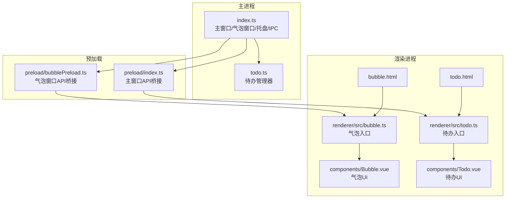
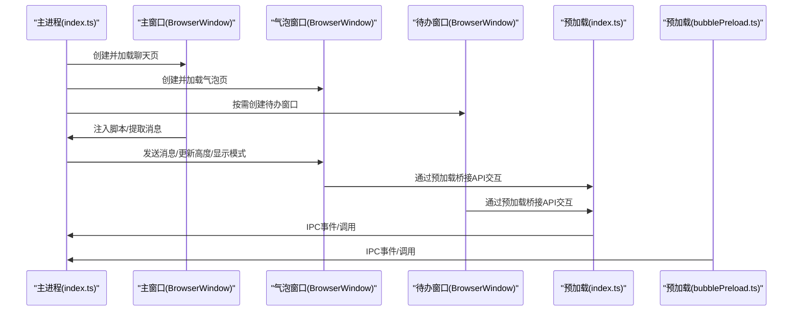
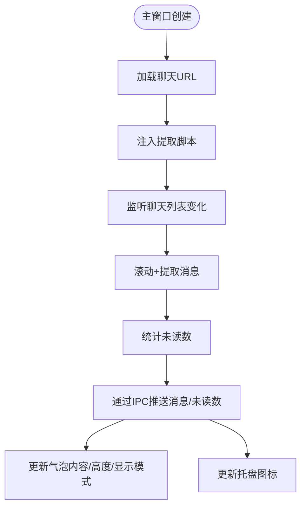
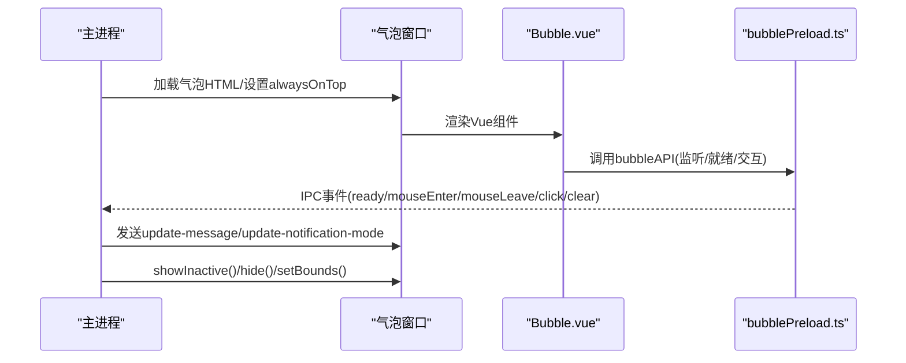
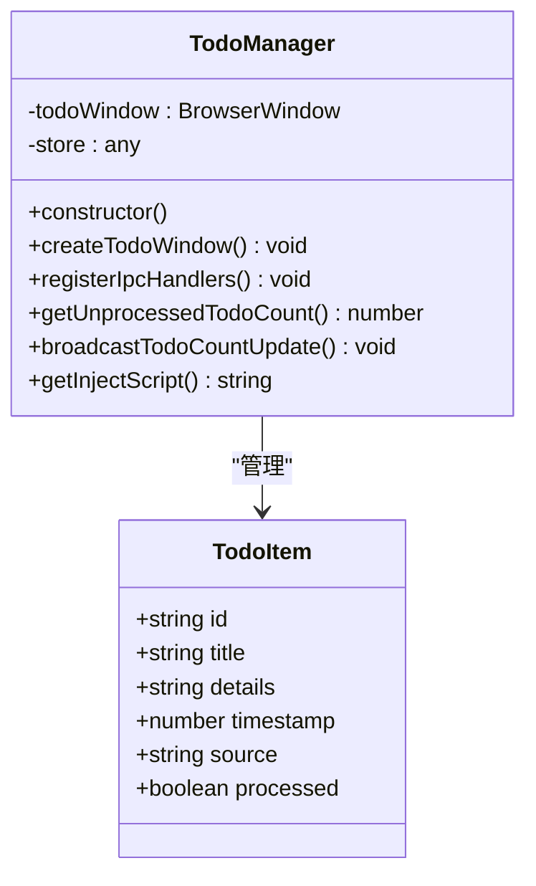
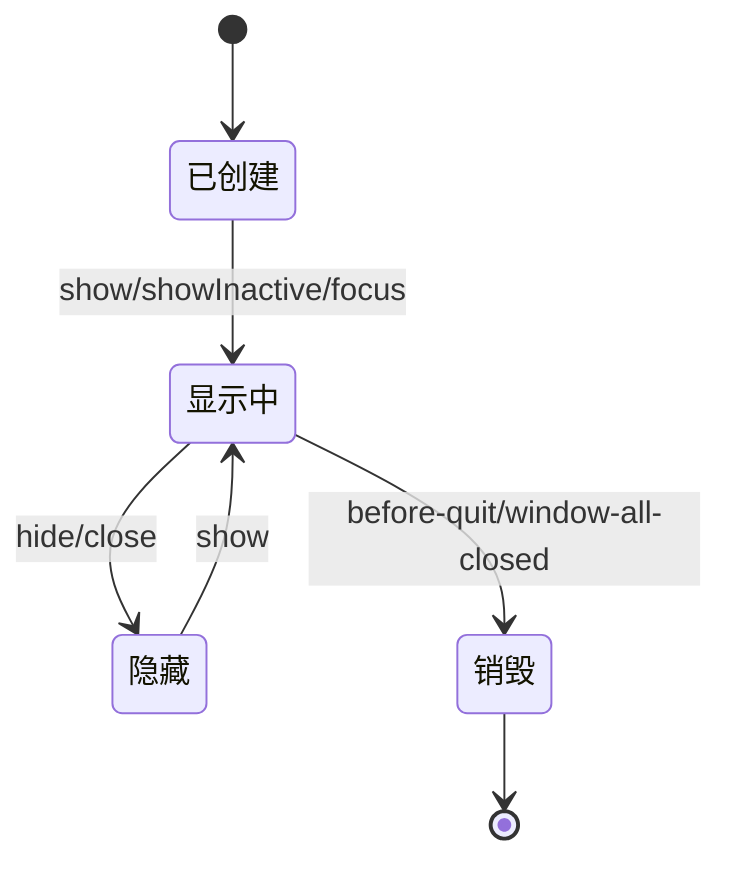
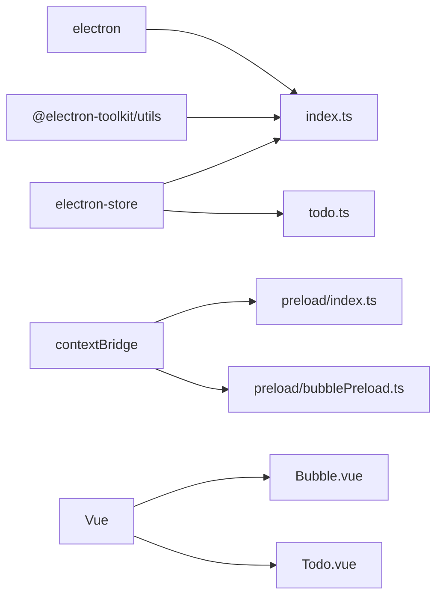

# 窗口管理系统

<cite>
**本文档引用的文件**
- [src/main/index.ts](file://src/main/index.ts)
- [src/main/todo.ts](file://src/main/todo.ts)
- [src/preload/index.ts](file://src/preload/index.ts)
- [src/preload/bubblePreload.ts](file://src/preload/bubblePreload.ts)
- [src/preload/index.d.ts](file://src/preload/index.d.ts)
- [src/renderer/src/bubble.ts](file://src/renderer/src/bubble.ts)
- [src/renderer/src/todo.ts](file://src/renderer/src/todo.ts)
- [src/renderer/src/components/Bubble.vue](file://src/renderer/src/components/Bubble.vue)
- [src/renderer/src/components/Todo.vue](file://src/renderer/src/components/Todo.vue)
- [src/renderer/bubble.html](file://src/renderer/bubble.html)
- [src/renderer/todo.html](file://src/renderer/todo.html)
</cite>

## 目录
1. [简介](#简介)
2. [项目结构](#项目结构)
3. [核心组件](#核心组件)
4. [架构概览](#架构概览)
5. [详细组件分析](#详细组件分析)
6. [依赖关系分析](#依赖关系分析)
7. [性能考虑](#性能考虑)
8. [故障排查指南](#故障排查指南)
9. [结论](#结论)
10. [附录](#附录)

## 简介
本文件系统性梳理 WoaApp 的窗口管理系统，覆盖三大窗口类型及其创建、配置与管理策略：
- 主窗口：承载 WPS 聊天页面，负责消息提取与注入脚本执行
- 气泡窗口：消息提醒悬浮窗，支持多种通知模式与交互
- 待办窗口：任务管理界面，提供 CRUD 与状态同步

文档重点解析窗口尺寸、位置、层级与行为属性；分析窗口间通信机制与状态同步策略；阐述生命周期管理（创建、显示、隐藏、销毁）；给出权限控制与安全配置最佳实践；总结性能优化与内存管理策略，并提供具体配置与使用示例路径。

## 项目结构
围绕窗口管理的关键目录与文件如下：
- 主进程入口与窗口管理：src/main/index.ts
- 待办事项管理器：src/main/todo.ts
- 预加载脚本（主/气泡）：src/preload/index.ts、src/preload/bubblePreload.ts
- 类型声明：src/preload/index.d.ts
- 渲染端入口与组件：
  - 气泡：src/renderer/src/bubble.ts、src/renderer/src/components/Bubble.vue、src/renderer/bubble.html
  - 待办：src/renderer/src/todo.ts、src/renderer/src/components/Todo.vue、src/renderer/todo.html

图表来源
- [src/main/index.ts](file://src/main/index.ts#L276-L615)
- [src/main/todo.ts](file://src/main/todo.ts#L20-L136)
- [src/preload/index.ts](file://src/preload/index.ts#L1-L63)
- [src/preload/bubblePreload.ts](file://src/preload/bubblePreload.ts#L1-L70)
- [src/renderer/src/bubble.ts](file://src/renderer/src/bubble.ts#L1-L8)
- [src/renderer/src/todo.ts](file://src/renderer/src/todo.ts#L1-L9)
- [src/renderer/bubble.html](file://src/renderer/bubble.html#L1-L33)
- [src/renderer/todo.html](file://src/renderer/todo.html#L1-L12)

章节来源
- [src/main/index.ts](file://src/main/index.ts#L276-L615)
- [src/main/todo.ts](file://src/main/todo.ts#L20-L136)
- [src/preload/index.ts](file://src/preload/index.ts#L1-L63)
- [src/preload/bubblePreload.ts](file://src/preload/bubblePreload.ts#L1-L70)
- [src/renderer/src/bubble.ts](file://src/renderer/src/bubble.ts#L1-L8)
- [src/renderer/src/todo.ts](file://src/renderer/src/todo.ts#L1-L9)
- [src/renderer/bubble.html](file://src/renderer/bubble.html#L1-L33)
- [src/renderer/todo.html](file://src/renderer/todo.html#L1-L12)

## 核心组件
- 主窗口（BrowserWindow）
  - 尺寸：1024x780
  - 属性：禁用菜单栏自动隐藏、自定义图标、预加载主窗口 API、禁用上下文隔离与安全策略、启用 Node 集成、后台不节流、持久化会话分区
  - 行为：加载聊天页面，注入脚本，监听未读数与消息提取，处理导航与窗口打开策略
- 气泡窗口（BrowserWindow）
  - 尺寸：260x180（可随消息数量动态调整高度）
  - 属性：无边框、透明、总在最前、不可调整、跳过任务栏、可移动、预加载气泡 API、禁用上下文隔离、禁用安全策略、后台不节流
  - 行为：根据通知模式显示/隐藏，支持鼠标悬停、点击跳转主窗口、清除单条/全部消息
- 待办窗口（BrowserWindow）
  - 尺寸：800x600
  - 属性：预加载主窗口 API、禁用上下文隔离、启用 Node 集成
  - 行为：按需创建/显示，持久化存储，广播未处理数量，注入聊天上下文菜单“添加到待办”

章节来源
- [src/main/index.ts](file://src/main/index.ts#L276-L615)
- [src/main/index.ts](file://src/main/index.ts#L618-L764)
- [src/main/todo.ts](file://src/main/todo.ts#L38-L72)

## 架构概览
窗口管理采用“主进程统一调度 + 预加载桥接 + 渲染组件”的分层设计。主进程负责窗口生命周期、会话与权限策略、消息提取与通知模式控制；预加载脚本在渲染进程暴露受限 API；渲染组件通过 Vue 实现 UI 与交互。

图表来源
- [src/main/index.ts](file://src/main/index.ts#L92-L110)
- [src/main/index.ts](file://src/main/index.ts#L1897-L1931)
- [src/preload/index.ts](file://src/preload/index.ts#L1-L63)
- [src/preload/bubblePreload.ts](file://src/preload/bubblePreload.ts#L1-L70)

## 详细组件分析

### 主窗口：聊天页面承载与消息提取
- 创建与配置
  - 窗口尺寸与图标、预加载、会话分区、Node 集成、禁用安全策略与上下文隔离
  - 设置用户代理、持久化存储、权限与证书处理、网络拦截策略
- 生命周期
  - 加载 URL、导航监听、新窗口打开策略、did-fail-load 错误处理、focus 上报
- 消息提取与注入
  - 页面加载完成后注入脚本，滚动到顶部、提取消息、计算未读数、监听 DOM 变化
  - 通过 IPC 将消息与未读数推送到主进程，驱动气泡窗口更新与托盘闪烁

图表来源
- [src/main/index.ts](file://src/main/index.ts#L276-L615)
- [src/main/index.ts](file://src/main/index.ts#L1419-L1721)
- [src/main/index.ts](file://src/main/index.ts#L1897-L1931)

章节来源
- [src/main/index.ts](file://src/main/index.ts#L276-L615)
- [src/main/index.ts](file://src/main/index.ts#L1419-L1721)
- [src/main/index.ts](file://src/main/index.ts#L1897-L1931)

### 气泡窗口：消息提醒与交互
- 创建与布局
  - 固定宽高，右下角定位，alwaysOnTop，禁用菜单，预加载气泡 API
- 通知模式
  - 常驻显示、显示4s后消失、鼠标悬停显示；模式变更通过 IPC 下发
- 交互与状态
  - 鼠标进入/离开、点击通知跳转主窗口、清除单条/全部消息；位置与高度持久化
- 渲染端实现
  - Vue 组件负责消息列表、头像占位、时间格式化、调试按钮；通过 window.bubbleAPI 与主进程通信

图表来源
- [src/main/index.ts](file://src/main/index.ts#L618-L764)
- [src/main/index.ts](file://src/main/index.ts#L1731-L1750)
- [src/main/index.ts](file://src/main/index.ts#L1897-L1931)
- [src/preload/bubblePreload.ts](file://src/preload/bubblePreload.ts#L1-L70)
- [src/renderer/src/components/Bubble.vue](file://src/renderer/src/components/Bubble.vue#L79-L236)

章节来源
- [src/main/index.ts](file://src/main/index.ts#L618-L764)
- [src/main/index.ts](file://src/main/index.ts#L1731-L1750)
- [src/main/index.ts](file://src/main/index.ts#L1897-L1931)
- [src/preload/bubblePreload.ts](file://src/preload/bubblePreload.ts#L1-L70)
- [src/renderer/src/components/Bubble.vue](file://src/renderer/src/components/Bubble.vue#L79-L236)

### 待办窗口：任务管理与状态同步
- 创建与显示
  - 按需创建，ready-to-show 时显示；开发/生产环境加载不同 HTML
- 数据与 IPC
  - electron-store 持久化；注册 get/add/update/delete/get-unprocessed-todo-count
  - 从聊天添加待办：主窗口注入脚本插入上下文菜单，触发 IPC 打开待办窗口并显示模态
- 广播与角标
  - 更新后广播未处理数量到所有窗口，主窗口侧边栏角标实时更新

图表来源
- [src/main/todo.ts](file://src/main/todo.ts#L20-L136)

章节来源
- [src/main/todo.ts](file://src/main/todo.ts#L20-L136)
- [src/main/todo.ts](file://src/main/todo.ts#L156-L264)
- [src/renderer/src/components/Todo.vue](file://src/renderer/src/components/Todo.vue#L56-L150)

### 窗口间通信与状态同步
- 主窗口 ↔ 气泡窗口
  - IPC 事件：update-messages、update-unread-count、update-notification-mode、bubble-ready、notification-clicked、clear-single-message、clear-all-messages
  - 主进程根据通知模式与消息数量控制气泡显示/隐藏与高度
- 主窗口 ↔ 待办窗口
  - IPC 事件：open-todo-window、show-add-todo-modal、update-todo-count
  - 主进程注入脚本在聊天侧边栏插入“待办”图标与上下文菜单
- 预加载桥接
  - 主窗口：暴露 api（截图、待办、表情模糊、自动更新等）
  - 气泡窗口：暴露 bubbleAPI（消息监听、就绪、交互、开发者工具）

章节来源
- [src/main/index.ts](file://src/main/index.ts#L130-L139)
- [src/main/index.ts](file://src/main/index.ts#L1897-L1931)
- [src/main/index.ts](file://src/main/index.ts#L1731-L1750)
- [src/main/todo.ts](file://src/main/todo.ts#L77-L136)
- [src/preload/index.ts](file://src/preload/index.ts#L1-L63)
- [src/preload/bubblePreload.ts](file://src/preload/bubblePreload.ts#L1-L70)

### 生命周期管理
- 创建
  - 主进程在 app ready 后创建主窗口、托盘、气泡窗口；待办管理器延迟初始化
- 显示/隐藏
  - 主窗口与气泡窗口均拦截 close 事件改为 hide；托盘菜单与快捷键控制显示/隐藏
- 销毁
  - before-quit 与 window-all-closed 触发清理：清除定时器、移除 IPC 监听、销毁托盘、关闭窗口、退出应用

图表来源
- [src/main/index.ts](file://src/main/index.ts#L189-L195)
- [src/main/index.ts](file://src/main/index.ts#L1244-L1247)
- [src/main/index.ts](file://src/main/index.ts#L2076-L2080)

章节来源
- [src/main/index.ts](file://src/main/index.ts#L189-L195)
- [src/main/index.ts](file://src/main/index.ts#L1244-L1247)
- [src/main/index.ts](file://src/main/index.ts#L2076-L2080)

## 依赖关系分析
- 主进程依赖
  - electron-store：持久化存储（会话、通知模式、待办数据）
  - @electron-toolkit/utils：窗口快捷键监听
  - electron：BrowserWindow、ipcMain、Tray、Menu、screen、session、dialog、clipboard
- 预加载脚本
  - contextBridge：在禁用上下文隔离时直接暴露 API 至 window
- 渲染组件
  - Vue：组件化 UI 与交互
  - 通过 window.api 与 window.bubbleAPI 与主进程通信

图表来源
- [src/main/index.ts](file://src/main/index.ts#L1-L38)
- [src/main/todo.ts](file://src/main/todo.ts#L1-L5)
- [src/preload/index.ts](file://src/preload/index.ts#L1-L63)
- [src/preload/bubblePreload.ts](file://src/preload/bubblePreload.ts#L1-L70)
- [src/renderer/src/components/Bubble.vue](file://src/renderer/src/components/Bubble.vue#L1-L468)
- [src/renderer/src/components/Todo.vue](file://src/renderer/src/components/Todo.vue#L1-L281)

章节来源
- [src/main/index.ts](file://src/main/index.ts#L1-L38)
- [src/main/todo.ts](file://src/main/todo.ts#L1-L5)
- [src/preload/index.ts](file://src/preload/index.ts#L1-L63)
- [src/preload/bubblePreload.ts](file://src/preload/bubblePreload.ts#L1-L70)

## 性能考虑
- 窗口性能
  - 禁用后台节流（webPreferences.backgroundThrottling=false），保证消息提取与动画流畅
  - 气泡窗口固定尺寸与 alwaysOnTop，减少层级切换开销
- 网络与会话
  - 持久化会话分区与 Cookie，避免频繁登录校验
  - 放宽 webRequest 限制，减少拦截带来的额外开销
- 渲染优化
  - 气泡消息列表使用虚拟滚动容器选择器，避免全量 DOM 监听
  - 未读数计算与消息提取去重，避免重复推送
- 内存管理
  - 窗口销毁时移除所有监听器与定时器，防止内存泄漏
  - 气泡窗口白屏检测与自动重载，避免长期卡死

章节来源
- [src/main/index.ts](file://src/main/index.ts#L286-L301)
- [src/main/index.ts](file://src/main/index.ts#L340-L364)
- [src/main/index.ts](file://src/main/index.ts#L1474-L1535)
- [src/main/index.ts](file://src/main/index.ts#L2091-L2147)

## 故障排查指南
- 气泡窗口白屏或空白
  - 主进程内置白屏检测与自动重载逻辑，必要时可手动触发重载
  - 检查预加载脚本是否正确注入，确认 bubbleReady 事件是否触发
- 消息未显示或重复推送
  - 检查主窗口注入脚本是否成功执行，确认 extractMessages 与 calculateUnreadCount 是否被调用
  - 核对 lastPushedMessages 去重逻辑与 update-messages 推送条件
- 托盘图标不闪烁
  - 确认 update-unread-count 是否正确下发，检查 updateTrayIconByMsgCount 逻辑
- 待办窗口无法打开或数据丢失
  - 检查 open-todo-window 与 getInjectScript 注入链路
  - 确认 electron-store 初始化与数据读写

章节来源
- [src/main/index.ts](file://src/main/index.ts#L1933-L1945)
- [src/main/index.ts](file://src/main/index.ts#L1419-L1721)
- [src/main/index.ts](file://src/main/index.ts#L1897-L1931)
- [src/main/index.ts](file://src/main/index.ts#L1178-L1206)
- [src/main/todo.ts](file://src/main/todo.ts#L24-L33)

## 结论
WoaApp 的窗口管理系统通过清晰的职责划分与严格的生命周期管理，实现了主窗口、气泡窗口与待办窗口的协同工作。主进程集中控制窗口与会话策略，预加载脚本提供受限 API 桥接，渲染组件聚焦 UI 与交互。通过通知模式、消息提取与状态广播，系统在可用性与性能之间取得平衡。建议在生产环境中谨慎评估安全策略放宽带来的风险，并持续监控窗口资源占用与内存回收情况。

## 附录
- 窗口配置与使用示例路径
  - 主窗口创建与会话配置：[src/main/index.ts](file://src/main/index.ts#L276-L615)
  - 气泡窗口创建与通知模式：[src/main/index.ts](file://src/main/index.ts#L618-L764)、[src/main/index.ts](file://src/main/index.ts#L984-L1034)
  - 待办窗口创建与 IPC：[src/main/todo.ts](file://src/main/todo.ts#L38-L72)、[src/main/todo.ts](file://src/main/todo.ts#L77-L136)
  - 预加载桥接（主/气泡）：[src/preload/index.ts](file://src/preload/index.ts#L1-L63)、[src/preload/bubblePreload.ts](file://src/preload/bubblePreload.ts#L1-L70)
  - 渲染入口与组件：[src/renderer/src/bubble.ts](file://src/renderer/src/bubble.ts#L1-L8)、[src/renderer/src/todo.ts](file://src/renderer/src/todo.ts#L1-L9)、[src/renderer/src/components/Bubble.vue](file://src/renderer/src/components/Bubble.vue#L1-L468)、[src/renderer/src/components/Todo.vue](file://src/renderer/src/components/Todo.vue#L1-L281)