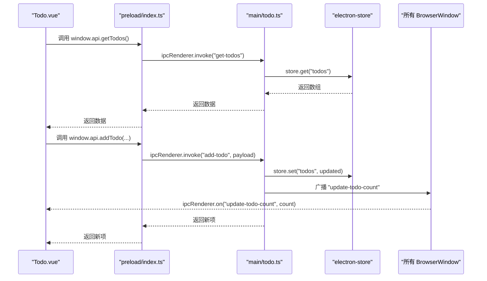
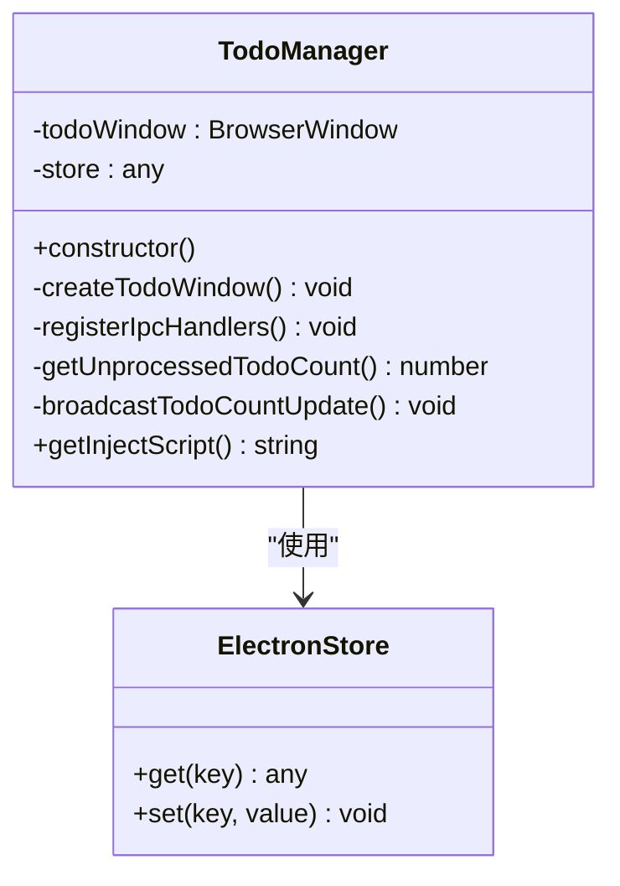
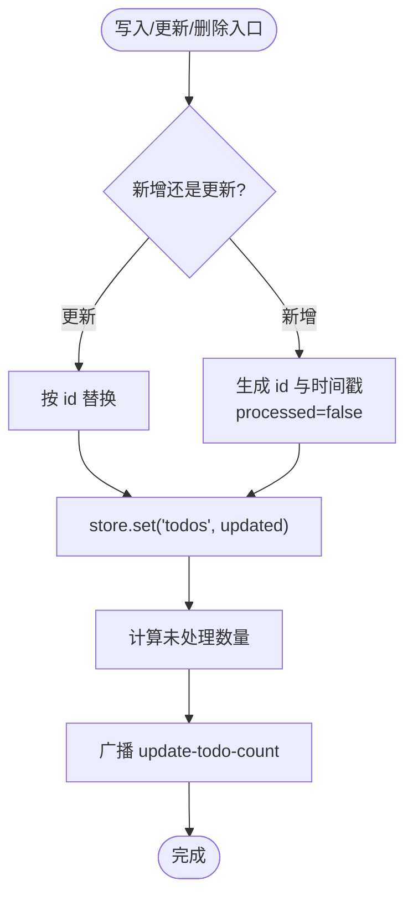
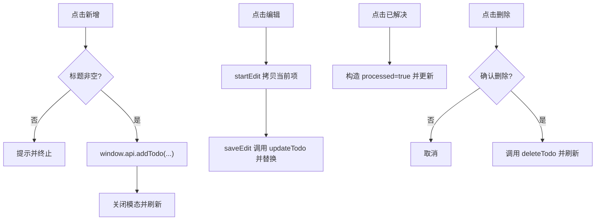
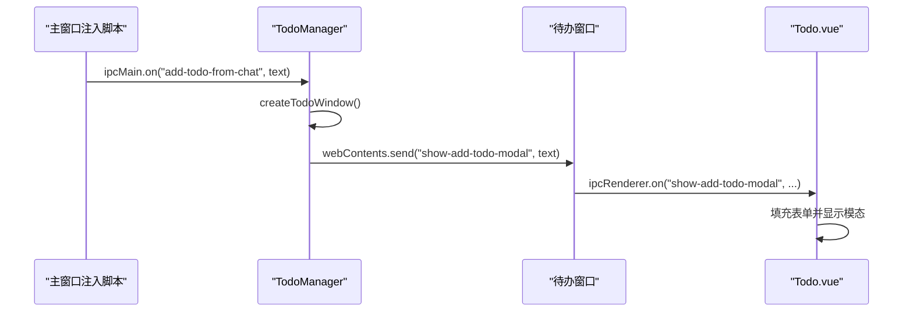
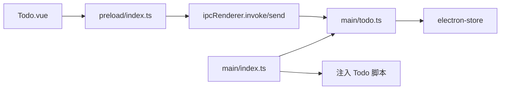

# 待办事项管理

<cite>
**本文引用的文件**
- [src/main/todo.ts](file://src/main/todo.ts)
- [src/main/index.ts](file://src/main/index.ts)
- [src/preload/index.ts](file://src/preload/index.ts)
- [src/preload/index.d.ts](file://src/preload/index.d.ts)
- [src/renderer/src/components/Todo.vue](file://src/renderer/src/components/Todo.vue)
- [src/renderer/src/todo.ts](file://src/renderer/src/todo.ts)
- [src/renderer/tod.html](file://src/renderer/tod.html)
- [ARCHITECTURE.md](file://ARCHITECTURE.md)
</cite>

## 目录
1. [简介](#简介)
2. [项目结构](#项目结构)
3. [核心组件](#核心组件)
4. [架构总览](#架构总览)
5. [详细组件分析](#详细组件分析)
6. [依赖关系分析](#依赖关系分析)
7. [性能考量](#性能考量)
8. [故障排查指南](#故障排查指南)
9. [结论](#结论)
10. [附录](#附录)

## 简介
本文件面向“待办事项管理”功能，系统性阐述 TodoManager 类的设计架构、CRUD 操作实现、本地存储与持久化策略、Vue 组件的状态管理与交互、以及 IPC 通信在待办功能中的作用与数据同步机制。文档同时提供操作流程图与最佳实践建议，帮助开发者快速理解与优化该功能。

## 项目结构
待办事项功能由三部分组成：
- 主进程：TodoManager 负责窗口、数据与 IPC 事件注册；electron-store 负责本地持久化。
- 预加载脚本：在渲染进程暴露受控 API，屏蔽底层 IPC 细节。
- 渲染进程：Vue 组件负责 UI、状态管理、事件绑定与数据绑定。

```mermaid
graph TB
subgraph "主进程"
M_index["src/main/index.ts"]
M_todo["src/main/todo.ts"]
Store["electron-store"]
end
subgraph "预加载脚本"
P_index["src/preload/index.ts"]
end
subgraph "渲染进程"
R_vue["src/renderer/src/components/Todo.vue"]
R_entry["src/renderer/src/todo.ts"]
R_html["src/renderer/todo.html"]
end
M_index --> M_todo
M_todo --> Store
M_todo <- --> P_index
P_index --> R_vue
R_entry --> R_vue
R_html --> R_entry
```

图表来源
- [src/main/index.ts](file://src/main/index.ts#L102-L103)
- [src/main/todo.ts](file://src/main/todo.ts#L24-L33)
- [src/preload/index.ts](file://src/preload/index.ts#L1-L63)
- [src/renderer/src/todo.ts](file://src/renderer/src/todo.ts#L1-L9)
- [src/renderer/tod.html](file://src/renderer/tod.html#L1-L12)

章节来源
- [ARCHITECTURE.md](file://ARCHITECTURE.md#L19-L81)

## 核心组件
- TodoManager：主进程中的待办管理器，负责窗口创建、数据持久化、IPC 事件注册与广播。
- 预加载 API：在渲染进程暴露安全可控的 API，封装 IPC 调用。
- Todo.vue：待办窗口的 Vue 组件，负责 CRUD 界面、状态与数据绑定、事件处理。
- electron-store：轻量级本地存储，持久化 todos 列表。

章节来源
- [src/main/todo.ts](file://src/main/todo.ts#L20-L33)
- [src/preload/index.ts](file://src/preload/index.ts#L17-L43)
- [src/renderer/src/components/Todo.vue](file://src/renderer/src/components/Todo.vue#L56-L150)

## 架构总览
待办功能采用“主进程数据 + 预加载桥 + 渲染进程 UI”的三层架构。渲染进程通过预加载脚本调用主进程提供的 IPC 接口，主进程使用 electron-store 持久化数据，并在数据变更时向所有窗口广播未处理待办数量，实现跨窗口状态同步。



图表来源
- [src/renderer/src/components/Todo.vue](file://src/renderer/src/components/Todo.vue#L87-L89)
- [src/preload/index.ts](file://src/preload/index.ts#L27-L33)
- [src/main/todo.ts](file://src/main/todo.ts#L82-L98)
- [src/main/todo.ts](file://src/main/todo.ts#L149-L154)

章节来源
- [ARCHITECTURE.md](file://ARCHITECTURE.md#L272-L315)

## 详细组件分析

### TodoManager 类设计与职责
- 窗口管理：创建/复用待办窗口，根据环境加载 todo.html。
- 数据持久化：使用 electron-store，键名为 todos，默认为空数组。
- IPC 事件：注册 open-todo-window、get-todos、add-todo、update-todo、delete-todo、get-unprocessed-todo-count、add-todo-from-chat。
- 广播机制：数据变更后计算未处理数量并向所有窗口发送 update-todo-count。



图表来源
- [src/main/todo.ts](file://src/main/todo.ts#L20-L33)
- [src/main/todo.ts](file://src/main/todo.ts#L24-L33)

章节来源
- [src/main/todo.ts](file://src/main/todo.ts#L20-L154)

### 数据模型与持久化策略
- 数据模型：TodoItem 包含 id、title、details、timestamp、source、processed。
- 默认存储：electron-store 初始化时设置 name 为 todo-data，defaults.todos 为空数组。
- 写入策略：新增时生成唯一 id 与时间戳，processed 初始为 false；更新时按 id 替换；删除时过滤 id；读取时返回数组或空数组。



图表来源
- [src/main/todo.ts](file://src/main/todo.ts#L87-L98)
- [src/main/todo.ts](file://src/main/todo.ts#L101-L108)
- [src/main/todo.ts](file://src/main/todo.ts#L110-L117)
- [src/main/todo.ts](file://src/main/todo.ts#L141-L154)

章节来源
- [src/main/todo.ts](file://src/main/todo.ts#L6-L14)
- [src/main/todo.ts](file://src/main/todo.ts#L26-L31)

### Vue 组件状态管理与交互
- 状态：todos、activeTab、editingTodo、showAddModal、newTodoFromChat、newTodo。
- 过滤：computed 根据 activeTab 过滤未处理/已处理。
- 事件：
  - 新增：校验标题非空，调用 window.api.addTodo，关闭模态并刷新列表。
  - 编辑：startEdit 深拷贝当前项，saveEdit 调用 window.api.updateTodo，替换对应项并刷新。
  - 标记完成：markAsProcessed 构造 processed=true 的对象，调用更新并刷新。
  - 删除：deleteTodo 调用 window.api.deleteTodo，确认后刷新。
  - 从聊天添加：onMounted 监听 ipcRenderer.on('show-add-todo-modal')，填充表单并显示模态。



图表来源
- [src/renderer/src/components/Todo.vue](file://src/renderer/src/components/Todo.vue#L130-L138)
- [src/renderer/src/components/Todo.vue](file://src/renderer/src/components/Todo.vue#L91-L105)
- [src/renderer/src/components/Todo.vue](file://src/renderer/src/components/Todo.vue#L111-L115)
- [src/renderer/src/components/Todo.vue](file://src/renderer/src/components/Todo.vue#L117-L122)
- [src/renderer/src/components/Todo.vue](file://src/renderer/src/components/Todo.vue#L140-L150)

章节来源
- [src/renderer/src/components/Todo.vue](file://src/renderer/src/components/Todo.vue#L56-L150)

### IPC 通信与数据同步
- 预加载 API：在渲染进程暴露 openTodoWindow、getTodos、addTodo、updateTodo、deleteTodo、getUnprocessedTodoCount、addTodoFromChat 等方法，统一通过 ipcRenderer.invoke/send。
- 主进程 TodoManager：注册 IPC 事件处理器，实现 CRUD 与广播。
- 跨窗口同步：TodoManager.getUnprocessedTodoCount 计算未处理数，遍历所有窗口 webContents.send('update-todo-count', count)。



图表来源
- [src/main/todo.ts](file://src/main/todo.ts#L124-L135)
- [src/renderer/src/components/Todo.vue](file://src/renderer/src/components/Todo.vue#L144-L149)

章节来源
- [src/preload/index.ts](file://src/preload/index.ts#L17-L43)
- [src/main/todo.ts](file://src/main/todo.ts#L77-L136)

### 聊天到待办的集成
- 主进程在主窗口加载完成后注入脚本，向主窗口注入“待办图标”与右键菜单项“添加到待办”，点击后通过 window.api.addTodoFromChat(text) 触发主进程事件。
- 主进程收到事件后创建待办窗口并向渲染进程发送 show-add-todo-modal 事件，携带文本内容，渲染进程自动填充表单并显示模态。

章节来源
- [src/main/index.ts](file://src/main/index.ts#L156-L162)
- [src/main/todo.ts](file://src/main/todo.ts#L124-L135)
- [src/renderer/src/components/Todo.vue](file://src/renderer/src/components/Todo.vue#L144-L149)

## 依赖关系分析
- TodoManager 依赖 electron-store 进行本地持久化。
- 预加载脚本依赖 Electron 的 ipcRenderer，向上暴露受控 API。
- Todo.vue 依赖 window.api 与 window.electron.ipcRenderer，实现 CRUD 与状态同步。
- 主进程在应用启动时创建 TodoManager，并在主窗口加载完成后注入 TodoManager.getInjectScript()。



图表来源
- [src/renderer/src/components/Todo.vue](file://src/renderer/src/components/Todo.vue#L87-L89)
- [src/preload/index.ts](file://src/preload/index.ts#L27-L33)
- [src/main/todo.ts](file://src/main/todo.ts#L24-L33)
- [src/main/index.ts](file://src/main/index.ts#L156-L162)

章节来源
- [src/main/index.ts](file://src/main/index.ts#L102-L103)
- [src/main/todo.ts](file://src/main/todo.ts#L24-L33)

## 性能考量
- 渲染性能：Todo.vue 使用 computed 过滤，避免不必要的重渲染；列表项使用 v-for + key，减少 DOM 重建成本。
- IPC 调用：批量读取（getTodos）优于多次小请求；更新后一次性广播未处理数量，避免频繁 UI 刷新。
- 存储策略：electron-store 默认序列化存储，写入时整体 set('todos', updated)，避免逐项写入带来的多次 IO。
- 窗口复用：TodoManager 对 todoWindow 进行复用，避免重复创建窗口带来的内存与 CPU 占用。

[本节为通用指导，无需列出具体文件来源]

## 故障排查指南
- 无法打开待办窗口
  - 检查主进程是否正确注册 open-todo-window 事件与 createTodoWindow 流程。
  - 确认开发/生产环境下的 URL 或文件路径加载是否正确。
- 新增/更新/删除无效
  - 检查 window.api 的 IPC 调用是否正确映射到 ipcMain.handle。
  - 确认 electron-store 是否成功 set('todos', updated)。
- 未处理数量不更新
  - 检查 TodoManager.broadcastTodoCountUpdate 是否被调用。
  - 确认渲染进程是否监听到 update-todo-count 并更新状态。
- 从聊天添加待办无反应
  - 检查主进程是否收到 add-todo-from-chat 事件并发送 show-add-todo-modal。
  - 确认 Todo.vue 是否监听到该事件并显示模态。

章节来源
- [src/main/todo.ts](file://src/main/todo.ts#L77-L136)
- [src/preload/index.ts](file://src/preload/index.ts#L27-L33)
- [src/renderer/src/components/Todo.vue](file://src/renderer/src/components/Todo.vue#L140-L150)

## 结论
待办事项管理功能通过 TodoManager 将窗口、数据与 IPC 有机整合，结合 electron-store 实现本地持久化，并通过预加载脚本将 IPC 细节对渲染进程屏蔽，使 Vue 组件能够以声明式方式完成 CRUD 与状态同步。整体架构清晰、职责明确，具备良好的扩展性与可维护性。

[本节为总结性内容，无需列出具体文件来源]

## 附录

### 操作流程速览
- 新增待办：输入标题与详情，点击确认，触发 add-todo，刷新列表。
- 编辑待办：点击编辑，修改标题与详情，点击保存，触发 update-todo，替换对应项。
- 标记完成：点击“已解决”，触发 update-todo，刷新列表。
- 删除待办：点击删除，确认后触发 delete-todo，刷新列表。
- 从聊天添加：右键消息，选择“添加到待办”，自动弹出模态并填充内容。

章节来源
- [src/renderer/src/components/Todo.vue](file://src/renderer/src/components/Todo.vue#L130-L138)
- [src/renderer/src/components/Todo.vue](file://src/renderer/src/components/Todo.vue#L91-L105)
- [src/renderer/src/components/Todo.vue](file://src/renderer/src/components/Todo.vue#L111-L115)
- [src/renderer/src/components/Todo.vue](file://src/renderer/src/components/Todo.vue#L117-L122)
- [src/renderer/src/components/Todo.vue](file://src/renderer/src/components/Todo.vue#L144-L149)