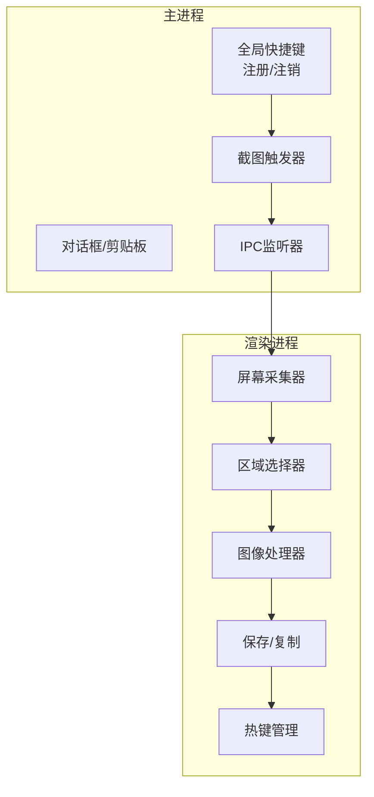
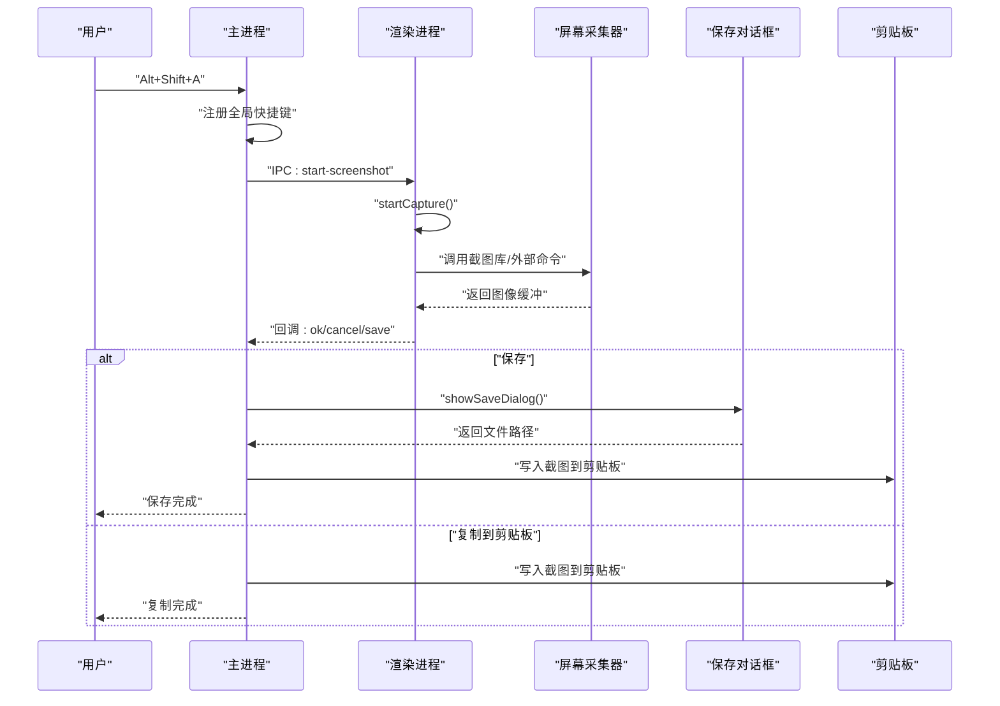
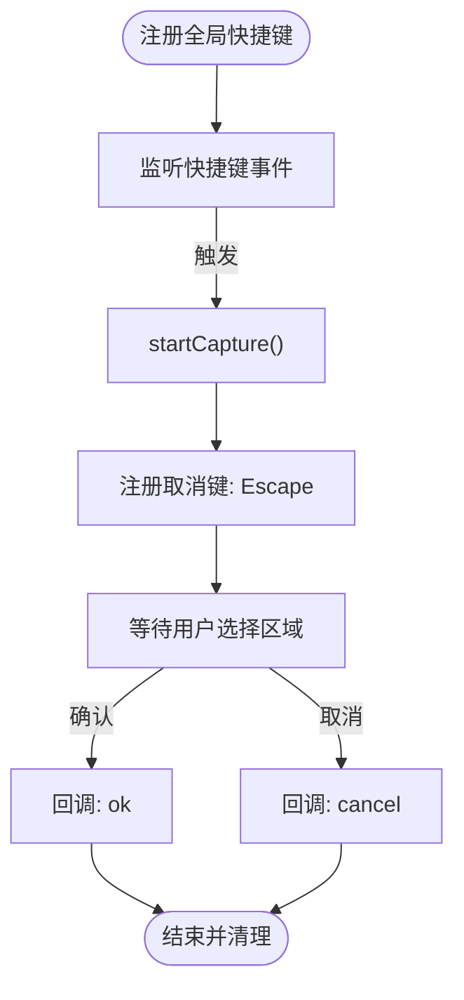
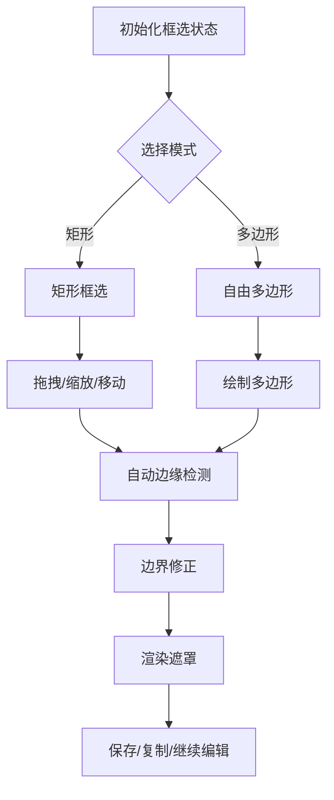
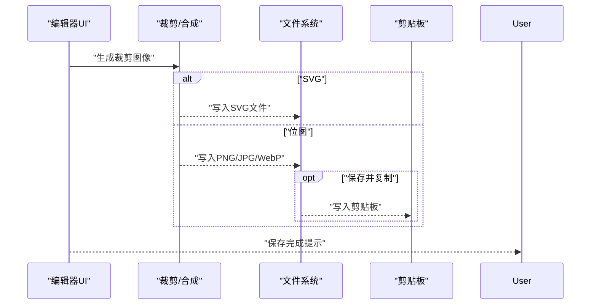
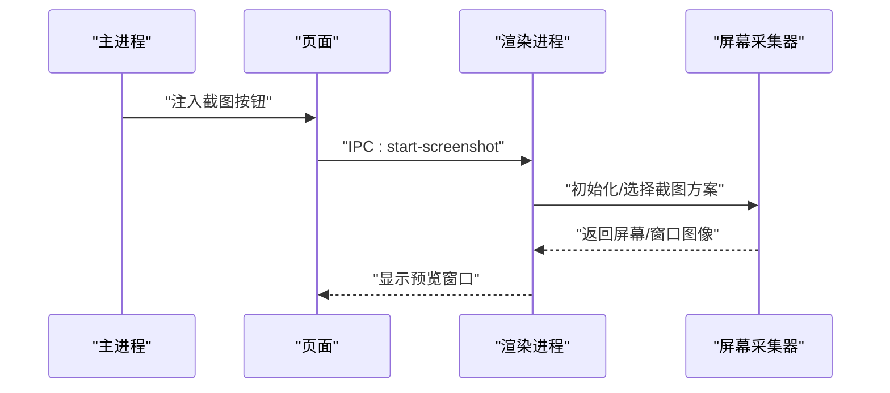
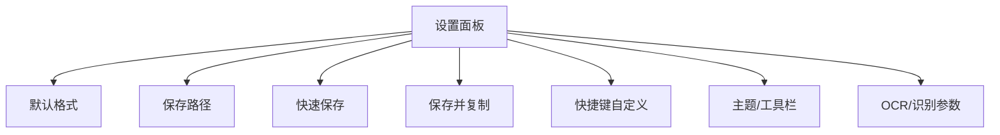
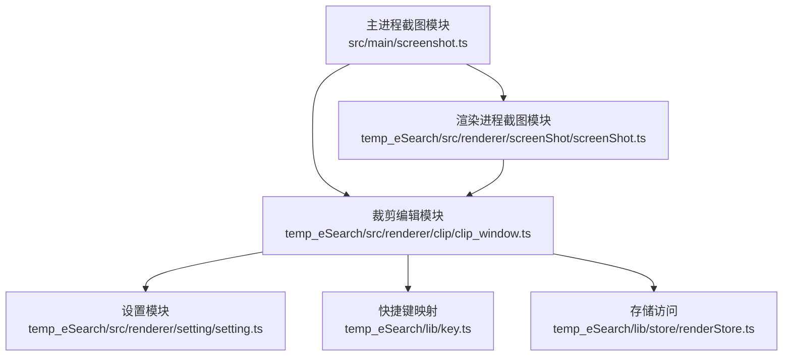

# 截图工具

<cite>
**本文档引用的文件**
- [src/main/screenshot.ts](file://src/main/screenshot.ts)
- [temp_eSearch/src/renderer/screenShot/screenShot.ts](file://temp_eSearch/src/renderer/screenShot/screenShot.ts)
- [temp_eSearch/src/renderer/clip/clip_window.ts](file://temp_eSearch/src/renderer/clip/clip_window.ts)
- [temp_eSearch/src/renderer/setting/setting.ts](file://temp_eSearch/src/renderer/setting/setting.ts)
- [temp_eSearch/lib/key.ts](file://temp_eSearch/lib/key.ts)
- [temp_eSearch/lib/store/renderStore.ts](file://temp_eSearch/lib/store/renderStore.ts)
- [temp_eSearch/src/main/main.ts](file://temp_eSearch/src/main/main.ts)
- [temp_eSearch/src/renderer/root/root.ts](file://temp_eSearch/src/renderer/root/root.ts)
</cite>

## 目录
1. [简介](#简介)
2. [项目结构](#项目结构)
3. [核心组件](#核心组件)
4. [架构总览](#架构总览)
5. [详细组件分析](#详细组件分析)
6. [依赖关系分析](#依赖关系分析)
7. [性能考虑](#性能考虑)
8. [故障排除指南](#故障排除指南)
9. [结论](#结论)
10. [附录](#附录)

## 简介
本文件为截图工具的综合技术文档，涵盖全局快捷键注册与处理机制、截图区域选择算法、图像处理与保存流程、初始化过程、预览窗口实现、文件保存策略与剪贴板操作、配置选项与快捷键自定义、保存路径与格式选择、扩展点、性能优化与错误处理机制，并提供实际使用场景与最佳实践建议。文档面向不同技术背景的读者，既提供高层概览，也包含代码级细节与可视化图表。

## 项目结构
截图工具采用主进程-渲染进程分离架构：
- 主进程负责全局快捷键注册、截图触发、对话框与剪贴板交互、以及与渲染进程的IPC通信。
- 渲染进程负责屏幕采集、区域选择、图像处理、编辑与保存、UI交互与热键管理。

**图表来源**
- [src/main/screenshot.ts](file://src/main/screenshot.ts#L16-L78)
- [temp_eSearch/src/renderer/screenShot/screenShot.ts](file://temp_eSearch/src/renderer/screenShot/screenShot.ts#L34-L39)
- [temp_eSearch/src/renderer/clip/clip_window.ts](file://temp_eSearch/src/renderer/clip/clip_window.ts#L910-L989)

**章节来源**
- [src/main/screenshot.ts](file://src/main/screenshot.ts#L16-L78)
- [temp_eSearch/src/renderer/screenShot/screenShot.ts](file://temp_eSearch/src/renderer/screenShot/screenShot.ts#L34-L39)

## 核心组件
- 全局快捷键与截图触发：主进程注册全局快捷键，触发后启动截图遮罩并等待用户选择区域。
- 屏幕采集器：渲染进程根据平台与配置选择合适的截图方案（内置库或外部命令），并返回图像数据。
- 区域选择与编辑：提供矩形/自由多边形框选、自动边缘检测、参考线、取色器、绘制工具等。
- 图像处理与保存：支持PNG/JPG/WebP/SVG格式，可复制到剪贴板或保存到文件，支持快速保存与批量连拍。
- 配置系统：通过设置面板管理快捷键、保存路径、格式、主题、工具栏等。

**章节来源**
- [src/main/screenshot.ts](file://src/main/screenshot.ts#L16-L96)
- [temp_eSearch/src/renderer/screenShot/screenShot.ts](file://temp_eSearch/src/renderer/screenShot/screenShot.ts#L34-L93)
- [temp_eSearch/src/renderer/clip/clip_window.ts](file://temp_eSearch/src/renderer/clip/clip_window.ts#L910-L989)
- [temp_eSearch/src/renderer/setting/setting.ts](file://temp_eSearch/src/renderer/setting/setting.ts#L832-L852)

## 架构总览
以下序列图展示了从全局快捷键到截图完成的完整流程，包括剪贴板与保存对话框的处理。

**图表来源**
- [src/main/screenshot.ts](file://src/main/screenshot.ts#L20-L74)
- [src/main/screenshot.ts](file://src/main/screenshot.ts#L156-L158)
- [temp_eSearch/src/renderer/screenShot/screenShot.ts](file://temp_eSearch/src/renderer/screenShot/screenShot.ts#L34-L93)

## 详细组件分析

### 全局快捷键注册与处理
- 主进程使用全局快捷键模块注册固定组合键，避免重复注册与冲突。
- 截图开始时动态注册取消键（Escape），结束时注销。
- 渲染进程通过IPC发送截图请求，主进程统一调度。

**图表来源**
- [src/main/screenshot.ts](file://src/main/screenshot.ts#L16-L42)
- [src/main/screenshot.ts](file://src/main/screenshot.ts#L83-L96)

**章节来源**
- [src/main/screenshot.ts](file://src/main/screenshot.ts#L16-L96)

### 截图区域选择算法
- 支持矩形与自由多边形两种模式，提供拖拽调整、八向缩放、移动等功能。
- 自动边缘检测：基于OpenCV识别图像轮廓，辅助自动框选。
- 参考线与坐标显示：支持九宫格、黄金比例等参考线，可显示四角坐标与尺寸。
- 边界修正：处理负数与越界情况，确保最终矩形合法。

**图表来源**
- [temp_eSearch/src/renderer/clip/clip_window.ts](file://temp_eSearch/src/renderer/clip/clip_window.ts#L1139-L1375)
- [temp_eSearch/src/renderer/clip/clip_window.ts](file://temp_eSearch/src/renderer/clip/clip_window.ts#L1777-L1797)

**章节来源**
- [temp_eSearch/src/renderer/clip/clip_window.ts](file://temp_eSearch/src/renderer/clip/clip_window.ts#L1139-L1375)
- [temp_eSearch/src/renderer/clip/clip_window.ts](file://temp_eSearch/src/renderer/clip/clip_window.ts#L1777-L1797)

### 图像处理与保存流程
- 图像格式：PNG/JPG/WebP/SVG，支持快速保存与保存并复制。
- 保存策略：支持默认格式、快速保存、自定义路径；保存后可自动复制到剪贴板。
- 剪贴板操作：将NativeImage写入剪贴板，便于粘贴到其他应用。

**图表来源**
- [temp_eSearch/src/renderer/clip/clip_window.ts](file://temp_eSearch/src/renderer/clip/clip_window.ts#L916-L989)

**章节来源**
- [temp_eSearch/src/renderer/clip/clip_window.ts](file://temp_eSearch/src/renderer/clip/clip_window.ts#L916-L989)

### 初始化过程与预览窗口
- 主进程注入截图按钮到页面，监听点击并通过IPC触发截图。
- 渲染进程初始化屏幕采集器，根据平台与配置选择截图方案。
- 预览窗口在全屏模式下显示，支持工具栏自动跟随、绘制栏与编辑器集成。

**图表来源**
- [src/main/screenshot.ts](file://src/main/screenshot.ts#L102-L140)
- [temp_eSearch/src/renderer/screenShot/screenShot.ts](file://temp_eSearch/src/renderer/screenShot/screenShot.ts#L34-L93)

**章节来源**
- [src/main/screenshot.ts](file://src/main/screenshot.ts#L102-L140)
- [temp_eSearch/src/renderer/screenShot/screenShot.ts](file://temp_eSearch/src/renderer/screenShot/screenShot.ts#L34-L93)

### 配置选项与快捷键自定义
- 截图默认格式、保存路径、快速保存开关、保存并复制等。
- 快捷键支持全局快捷键与工具快捷键，可自定义组合键。
- 主题、工具栏样式、取色器格式、自动框选阈值等。

**图表来源**
- [temp_eSearch/src/renderer/setting/setting.ts](file://temp_eSearch/src/renderer/setting/setting.ts#L832-L852)
- [temp_eSearch/src/renderer/setting/setting.ts](file://temp_eSearch/src/renderer/setting/setting.ts#L1085-L1148)

**章节来源**
- [temp_eSearch/src/renderer/setting/setting.ts](file://temp_eSearch/src/renderer/setting/setting.ts#L832-L852)
- [temp_eSearch/src/renderer/setting/setting.ts](file://temp_eSearch/src/renderer/setting/setting.ts#L1085-L1148)

### 扩展点与平台适配
- Linux ARM64平台支持外部截图命令，通过配置项指定命令与临时文件路径。
- Windows平台在缺少运行库时引导用户下载，失败时提供反馈入口。
- OpenCV用于自动边缘检测，支持阈值调节与窗口识别开关。

**章节来源**
- [temp_eSearch/src/renderer/screenShot/screenShot.ts](file://temp_eSearch/src/renderer/screenShot/screenShot.ts#L39-L91)
- [temp_eSearch/src/renderer/screenShot/screenShot.ts](file://temp_eSearch/src/renderer/screenShot/screenShot.ts#L106-L162)
- [temp_eSearch/src/renderer/clip/clip_window.ts](file://temp_eSearch/src/renderer/clip/clip_window.ts#L375-L407)

## 依赖关系分析

**图表来源**
- [src/main/screenshot.ts](file://src/main/screenshot.ts#L1-L10)
- [temp_eSearch/src/renderer/screenShot/screenShot.ts](file://temp_eSearch/src/renderer/screenShot/screenShot.ts#L1-L10)
- [temp_eSearch/src/renderer/clip/clip_window.ts](file://temp_eSearch/src/renderer/clip/clip_window.ts#L1-L15)
- [temp_eSearch/src/renderer/setting/setting.ts](file://temp_eSearch/src/renderer/setting/setting.ts#L1-L20)
- [temp_eSearch/lib/key.ts](file://temp_eSearch/lib/key.ts#L1-L10)
- [temp_eSearch/lib/store/renderStore.ts](file://temp_eSearch/lib/store/renderStore.ts#L1-L10)

**章节来源**
- [src/main/screenshot.ts](file://src/main/screenshot.ts#L1-L10)
- [temp_eSearch/src/renderer/screenShot/screenShot.ts](file://temp_eSearch/src/renderer/screenShot/screenShot.ts#L1-L10)
- [temp_eSearch/src/renderer/clip/clip_window.ts](file://temp_eSearch/src/renderer/clip/clip_window.ts#L1-L15)
- [temp_eSearch/src/renderer/setting/setting.ts](file://temp_eSearch/src/renderer/setting/setting.ts#L1-L20)
- [temp_eSearch/lib/key.ts](file://temp_eSearch/lib/key.ts#L1-L10)
- [temp_eSearch/lib/store/renderStore.ts](file://temp_eSearch/lib/store/renderStore.ts#L1-L10)

## 性能考虑
- 图像缓存：屏幕截图结果缓存在渲染进程，避免重复采集。
- 低延迟交互：裁剪与遮罩绘制在Canvas上实时完成，减少重绘开销。
- 自动边缘检测：仅在启用时使用OpenCV，避免不必要的CPU消耗。
- 快速保存：支持快速保存与批量连拍，减少用户等待时间。
- 剪贴板写入：异步写入，避免阻塞主线程。

[本节为通用性能建议，不直接分析具体文件]

## 故障排除指南
- 快捷键不响应：检查全局快捷键是否注册成功，确认无其他应用占用；重启应用重新注册。
- 页面按钮不显示：等待页面完全加载，检查目标容器是否存在，查看控制台错误。
- 截图失败：检查主窗口有效性与IPC通信；查看错误通知与日志。
- Linux ARM64截图异常：检查外部截图命令配置与临时文件路径；必要时安装系统依赖。
- Windows运行库缺失：根据提示下载并安装所需运行库。

**章节来源**
- [src/main/screenshot.ts](file://src/main/screenshot.ts#L147-L153)
- [temp_eSearch/src/renderer/screenShot/screenShot.ts](file://temp_eSearch/src/renderer/screenShot/screenShot.ts#L39-L91)

## 结论
本截图工具通过清晰的主/渲染进程分工、灵活的截图方案与强大的编辑能力，提供了高效、易用的截图体验。其配置系统与扩展点使得用户可根据自身需求定制快捷键、保存策略与外观风格。通过合理的性能优化与错误处理机制，工具在多平台环境下具备良好的稳定性与可用性。

## 附录
- 实际使用场景与最佳实践
  - 快速截图：使用全局快捷键或页面按钮触发，选择区域后直接复制到剪贴板。
  - 批量截图：启用连拍功能，设置间隔与数量，自动保存到指定路径。
  - 广截屏：结合自动/定时模式，配合滚动匹配算法实现长图拼接。
  - 自动框选：开启自动边缘检测与窗口识别，提高框选准确性。
  - 快速保存：启用快速保存并设置默认格式，一键保存到上次路径。

[本节为概念性总结，不直接分析具体文件]