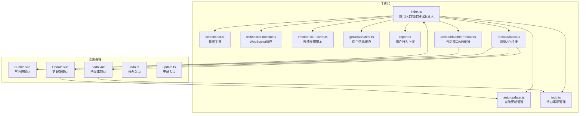
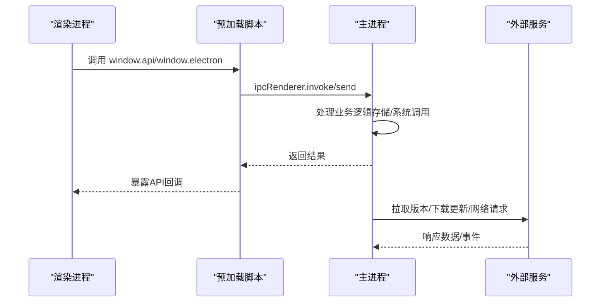
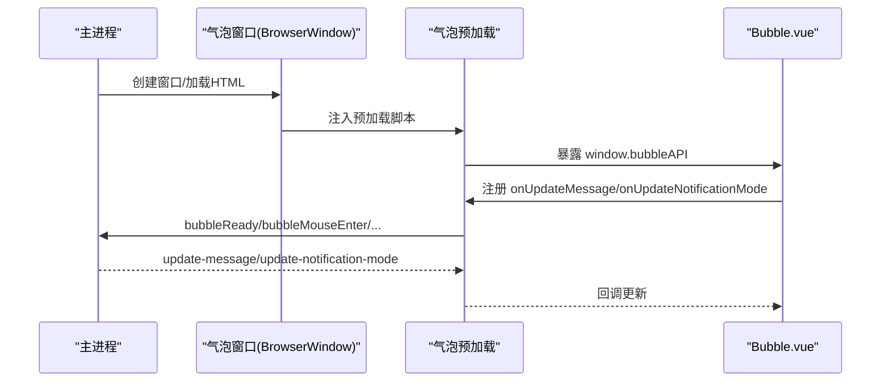
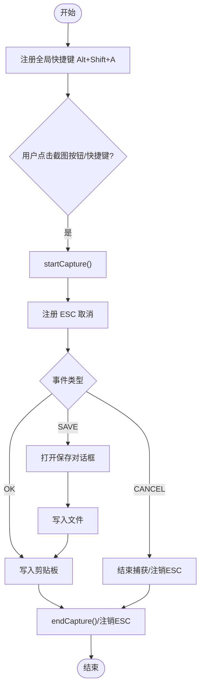
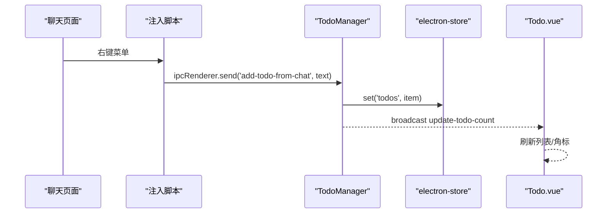
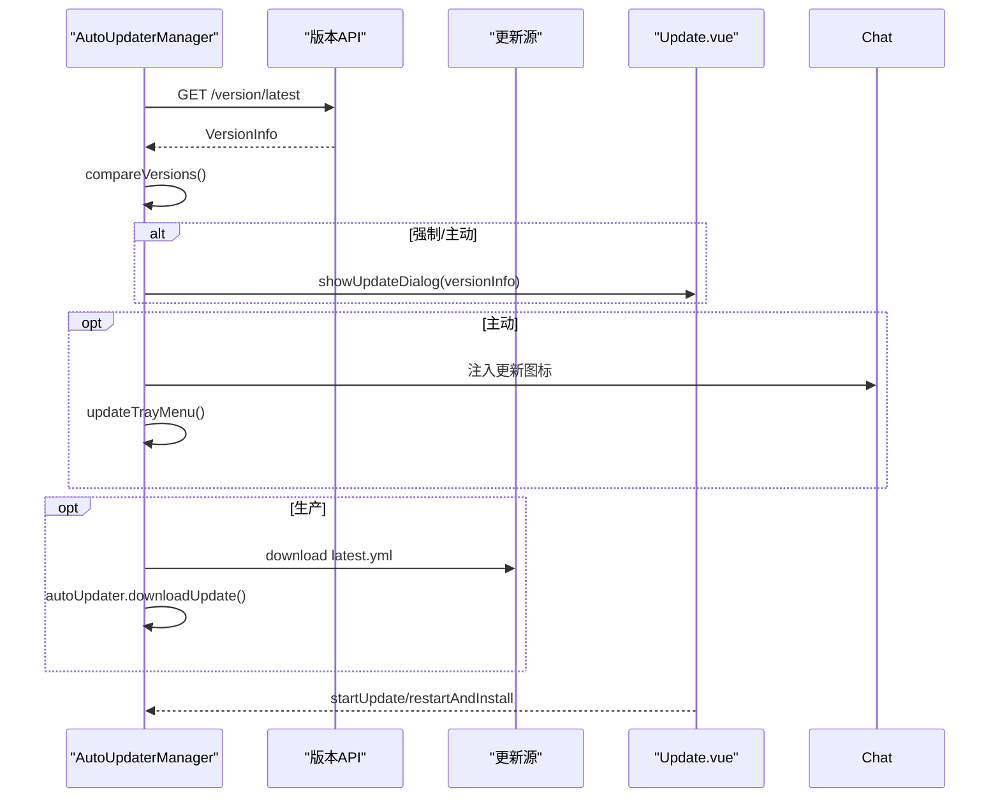
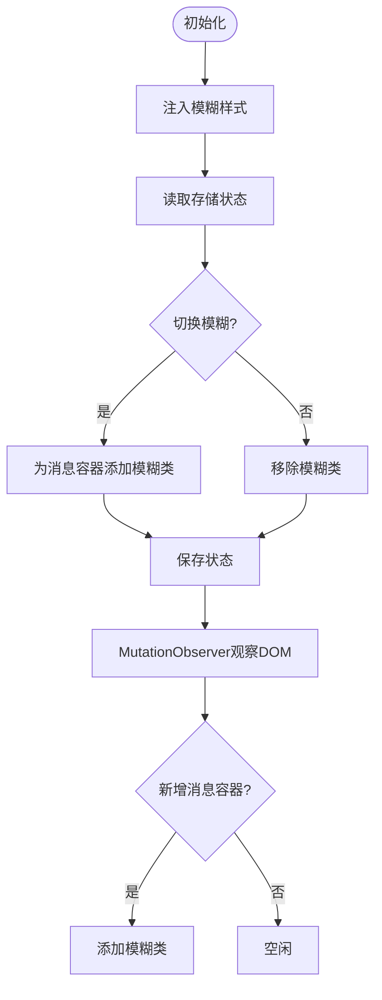
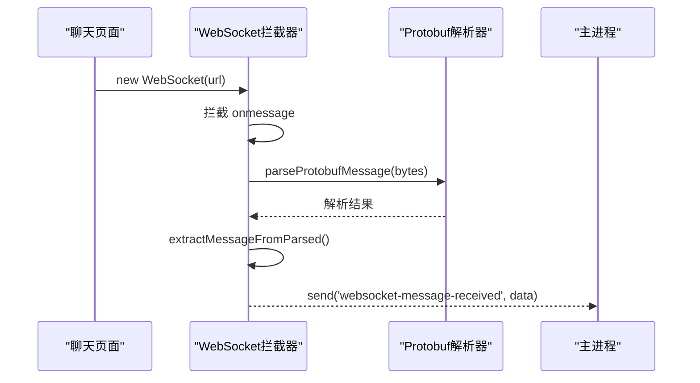
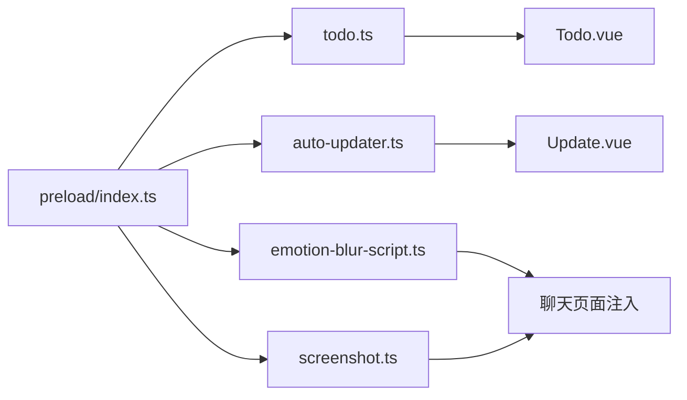

# 核心功能模块

<cite>
**本文档引用的文件**
- [src\main\index.ts](file://src\main\index.ts)
- [src\main\auto-updater.ts](file://src\main\auto-updater.ts)
- [src\main\screenshot.ts](file://src\main\screenshot.ts)
- [src\main\todo.ts](file://src\main\todo.ts)
- [src\main\websocket-monitor.ts](file://src\main\websocket-monitor.ts)
- [src\main\emotion-blur-script.ts](file://src\main\emotion-blur-script.ts)
- [src\main\getDepartMent.ts](file://src\main\getDepartMent.ts)
- [src\main\report.ts](file://src\main\report.ts)
- [src\preload\index.ts](file://src\preload\index.ts)
- [src\preload\bubblePreload.ts](file://src\preload\bubblePreload.ts)
- [src\renderer\src\components\Bubble.vue](file://src\renderer\src\components\Bubble.vue)
- [src\renderer\src\components\Todo.vue](file://src\renderer\src\components\Todo.vue)
- [src\renderer\src\components\Update.vue](file://src\renderer\src\components\Update.vue)
- [src\renderer\src\todo.ts](file://src\renderer\src\todo.ts)
- [src\renderer\src\update.ts](file://src\renderer\src\update.ts)
</cite>

## 目录
1. [简介](#简介)
2. [项目结构](#项目结构)
3. [核心组件](#核心组件)
4. [架构总览](#架构总览)
5. [详细组件分析](#详细组件分析)
6. [依赖关系分析](#依赖关系分析)
7. [性能考虑](#性能考虑)
8. [故障排除指南](#故障排除指南)
9. [结论](#结论)
10. [附录](#附录)

## 简介
本文件面向WoaApp核心功能模块的综合说明，覆盖消息通知系统、截图工具、待办事项管理、自动更新系统、隐私保护（表情模糊）等功能模块。文档解释各模块的设计目标、实现原理、数据流转与协作关系，并提供配置选项、API接口与使用示例，帮助开发者快速理解与扩展系统。

## 项目结构
WoaApp采用Electron + Vue的混合架构：
- 主进程负责窗口管理、系统集成、自动更新、截图、待办事项、隐私保护脚本注入等
- 预加载脚本提供受限的渲染进程API桥接
- 渲染进程由Vue驱动，包含气泡通知、待办事项、更新弹窗等UI组件

图表来源
- [src\main\index.ts](file://src\main\index.ts#L1-L2406)
- [src\main\auto-updater.ts](file://src\main\auto-updater.ts#L1-L565)
- [src\main\screenshot.ts](file://src\main\screenshot.ts#L1-L158)
- [src\main\todo.ts](file://src\main\todo.ts#L1-L266)
- [src\main\websocket-monitor.ts](file://src\main\websocket-monitor.ts#L1-L242)
- [src\main\emotion-blur-script.ts](file://src\main\emotion-blur-script.ts#L1-L282)
- [src\main\getDepartMent.ts](file://src\main\getDepartMent.ts#L1-L50)
- [src\main\report.ts](file://src\main\report.ts#L1-L4)
- [src\preload\index.ts](file://src\preload\index.ts#L1-L63)
- [src\preload\bubblePreload.ts](file://src\preload\bubblePreload.ts#L1-L70)
- [src\renderer\src\components\Bubble.vue](file://src\renderer\src\components\Bubble.vue#L1-L468)
- [src\renderer\src\components\Todo.vue](file://src\renderer\src\components\Todo.vue#L1-L281)
- [src\renderer\src\components\Update.vue](file://src\renderer\src\components\Update.vue#L1-L616)
- [src\renderer\src\todo.ts](file://src\renderer\src\todo.ts#L1-L9)
- [src\renderer\src\update.ts](file://src\renderer\src\update.ts#L1-L8)

章节来源
- [src\main\index.ts](file://src\main\index.ts#L1-L2406)

## 核心组件
- 应用入口与窗口管理：负责主窗口、气泡窗口、托盘创建与生命周期控制；注入脚本、用户信息缓存、登录态维持
- 自动更新系统：基于electron-updater，支持三种更新类型（强制/主动/被动），提供弹窗、进度、倒计时安装
- 截图工具：全局快捷键触发，支持复制到剪贴板与保存对话框
- 待办事项管理：窗口化UI，IPC持久化存储，右键菜单集成“添加到待办”
- 隐私保护（表情模糊）：动态注入CSS类与按钮，支持状态持久化与实时DOM观察
- WebSocket监控：拦截并解析聊天消息，提取关键字段，转发至主进程

章节来源
- [src\main\index.ts](file://src\main\index.ts#L1-L2406)
- [src\main\auto-updater.ts](file://src\main\auto-updater.ts#L1-L565)
- [src\main\screenshot.ts](file://src\main\screenshot.ts#L1-L158)
- [src\main\todo.ts](file://src\main\todo.ts#L1-L266)
- [src\main\websocket-monitor.ts](file://src\main\websocket-monitor.ts#L1-L242)
- [src\main\emotion-blur-script.ts](file://src\main\emotion-blur-script.ts#L1-L282)

## 架构总览
主进程作为中枢协调各模块，通过IPC与预加载脚本与渲染进程交互；渲染进程通过暴露的API调用主进程能力，形成清晰的职责边界。

图表来源
- [src\preload\index.ts](file://src\preload\index.ts#L1-L63)
- [src\main\auto-updater.ts](file://src\main\auto-updater.ts#L82-L131)
- [src\main\index.ts](file://src\main\index.ts#L120-L140)

## 详细组件分析

### 消息通知系统（气泡窗口）
- 设计目标：在桌面右下角悬浮展示新消息，支持清除单条/全部、点击跳转、未读角标
- 实现要点：
  - 气泡窗口独立生命周期，alwaysOnTop，禁用右键菜单，支持拖拽区域
  - 预加载脚本暴露事件监听与控制方法，渲染组件等待API可用后注册监听
  - 主进程通过IPC推送消息列表与通知模式，渲染组件按需更新UI
- 数据流：主进程收集消息 → IPC推送 → 渲染组件更新 → 用户交互（清除/点击）

图表来源
- [src\main\index.ts](file://src\main\index.ts#L617-L764)
- [src\preload\bubblePreload.ts](file://src\preload\bubblePreload.ts#L1-L70)
- [src\renderer\src\components\Bubble.vue](file://src\renderer\src\components\Bubble.vue#L164-L235)

章节来源
- [src\main\index.ts](file://src\main\index.ts#L617-L764)
- [src\preload\bubblePreload.ts](file://src\preload\bubblePreload.ts#L1-L70)
- [src\renderer\src\components\Bubble.vue](file://src\renderer\src\components\Bubble.vue#L1-L468)

### 截图工具
- 设计目标：提供便捷截图能力，支持快捷键触发与保存对话框
- 实现要点：
  - 注册全局快捷键，拦截OK/CANCEL/SAVE事件，将图片写入剪贴板
  - 注入页面按钮，通过IPC触发截图流程
  - 支持ESC取消，避免重复触发
- 数据流：用户触发 → 注册快捷键 → 截图库捕获 → 剪贴板/保存对话框 → 清理状态

图表来源
- [src\main\screenshot.ts](file://src\main\screenshot.ts#L16-L96)

章节来源
- [src\main\screenshot.ts](file://src\main\screenshot.ts#L1-L158)

### 待办事项管理
- 设计目标：在聊天界面右键菜单快速创建待办，统一管理未处理/已处理任务
- 实现要点：
  - 主进程TodoManager管理窗口、存储与IPC接口
  - 注入侧边栏按钮与右键菜单项，支持从消息内容提取标题/详情
  - 未处理数量广播到所有窗口，更新角标
- 数据流：右键菜单 → IPC → TodoManager → 存储 → UI刷新

图表来源
- [src\main\todo.ts](file://src\main\todo.ts#L124-L135)
- [src\main\todo.ts](file://src\main\todo.ts#L159-L264)
- [src\renderer\src\components\Todo.vue](file://src\renderer\src\components\Todo.vue#L140-L150)

章节来源
- [src\main\todo.ts](file://src\main\todo.ts#L1-L266)
- [src\renderer\src\components\Todo.vue](file://src\renderer\src\components\Todo.vue#L1-L281)

### 自动更新系统
- 设计目标：在应用启动后定时检查更新，按更新类型触发不同交互策略
- 实现要点：
  - 三种更新类型：强制（立即弹窗）、主动（弹窗+网页动画+托盘提示）、被动（仅托盘提示）
  - 支持下载进度、下载完成、倒计时自动安装
  - 开发模式模拟下载，生产模式真实下载latest.yml并触发electron-updater
- 数据流：定时检查 → API拉取 → 比较版本 → 注入网页图标/托盘菜单 → 下载/安装

图表来源
- [src\main\auto-updater.ts](file://src\main\auto-updater.ts#L188-L221)
- [src\main\auto-updater.ts](file://src\main\auto-updater.ts#L297-L353)
- [src\main\auto-updater.ts](file://src\main\auto-updater.ts#L435-L473)
- [src\renderer\src\components\Update.vue](file://src\renderer\src\components\Update.vue#L140-L173)

章节来源
- [src\main\auto-updater.ts](file://src\main\auto-updater.ts#L1-L565)
- [src\renderer\src\components\Update.vue](file://src\renderer\src\components\Update.vue#L1-L616)

### 隐私保护（表情模糊）
- 设计目标：对聊天消息进行模糊处理，保护敏感内容
- 实现要点：
  - 注入CSS类与按钮，支持切换模糊状态
  - 观察DOM变化，自动为新增消息容器添加模糊类
  - 状态持久化到存储，初始化时恢复上次状态
- 数据流：注入样式/按钮 → 切换状态 → 应用/移除CSS类 → 持久化状态

图表来源
- [src\main\emotion-blur-script.ts](file://src\main\emotion-blur-script.ts#L55-L91)
- [src\main\emotion-blur-script.ts](file://src\main\emotion-blur-script.ts#L121-L164)
- [src\main\emotion-blur-script.ts](file://src\main\emotion-blur-script.ts#L166-L210)

章节来源
- [src\main\emotion-blur-script.ts](file://src\main\emotion-blur-script.ts#L1-L282)

### WebSocket监控
- 设计目标：拦截聊天WebSocket消息，解析关键字段，提取消息内容与发送者信息
- 实现要点：
  - 替换原生WebSocket构造函数，拦截onmessage事件
  - Protobuf解析器提取字符串字段，筛选合适的消息内容
  - 将解析结果通过window.electronAPI.send回传主进程
- 数据流：拦截连接 → onmessage → Base64解码 → Protobuf解析 → 提取字段 → IPC发送

图表来源
- [src\main\websocket-monitor.ts](file://src\main\websocket-monitor.ts#L162-L210)
- [src\main\websocket-monitor.ts](file://src\main\websocket-monitor.ts#L104-L160)

章节来源
- [src\main\websocket-monitor.ts](file://src\main\websocket-monitor.ts#L1-L242)

## 依赖关系分析
- 主进程模块耦合度低，通过IPC解耦渲染进程
- 预加载脚本提供最小API集合，避免直接暴露Electron全量API
- 渲染进程通过Vue组件封装UI逻辑，与主进程通过window.api/window.electron通信

图表来源
- [src\preload\index.ts](file://src\preload\index.ts#L1-L63)
- [src\main\todo.ts](file://src\main\todo.ts#L1-L266)
- [src\main\auto-updater.ts](file://src\main\auto-updater.ts#L1-L565)
- [src\main\screenshot.ts](file://src\main\screenshot.ts#L1-L158)
- [src\main\emotion-blur-script.ts](file://src\main\emotion-blur-script.ts#L1-L282)
- [src\renderer\src\components\Todo.vue](file://src\renderer\src\components\Todo.vue#L1-L281)
- [src\renderer\src\components\Update.vue](file://src\renderer\src\components\Update.vue#L1-L616)

章节来源
- [src\preload\index.ts](file://src\preload\index.ts#L1-L63)

## 性能考虑
- 窗口与会话配置
  - 主窗口禁用后台节流，保持活跃状态；持久化会话与Cookie，减少重复登录成本
  - 气泡窗口alwaysOnTop，避免频繁重建
- IPC与存储
  - 待办事项使用electron-store本地持久化，避免频繁IO
  - 未处理数量广播到所有窗口，减少重复查询
- 资源与网络
  - 自动更新在生产模式下载latest.yml，避免重复解析
  - 截图工具仅在需要时注册快捷键，完成后清理状态

[本节为通用指导，无需特定文件引用]

## 故障排除指南
- 气泡窗口无法接收消息
  - 检查预加载脚本是否正确注入，渲染组件是否等待window.bubbleAPI可用
  - 确认主进程已发送update-message事件
- 截图无响应
  - 确认全局快捷键已注册，ESC取消逻辑正常
  - 检查截图库事件回调是否触发
- 待办事项不显示
  - 确认TodoManager已注入侧边栏按钮与右键菜单项
  - 检查electron-store数据是否存在
- 自动更新不弹窗
  - 检查版本比较逻辑与更新类型分支
  - 开发模式下确认模拟下载流程
- 表情模糊无效
  - 确认CSS类注入与MutationObserver是否生效
  - 检查消息容器选择器是否匹配

章节来源
- [src\preload\bubblePreload.ts](file://src\preload\bubblePreload.ts#L1-L70)
- [src\renderer\src\components\Bubble.vue](file://src\renderer\src\components\Bubble.vue#L164-L235)
- [src\main\screenshot.ts](file://src\main\screenshot.ts#L16-L96)
- [src\main\todo.ts](file://src\main\todo.ts#L124-L135)
- [src\main\auto-updater.ts](file://src\main\auto-updater.ts#L272-L295)
- [src\main\emotion-blur-script.ts](file://src\main\emotion-blur-script.ts#L166-L210)

## 结论
WoaApp通过模块化设计实现了消息通知、截图、待办、自动更新与隐私保护等核心能力。主进程集中控制，预加载脚本提供安全的API桥接，渲染进程以Vue组件实现高可用UI。整体架构清晰、扩展性强，便于后续功能迭代与定制。

[本节为总结，无需特定文件引用]

## 附录

### 配置选项与API参考

- 自动更新（主进程 → 渲染）
  - IPC处理器
    - check-for-updates → Promise<boolean>
    - get-current-version → string
    - get-latest-version-info → VersionInfo
    - start-update → Promise<void>
    - show-update-dialog → Promise<void>
    - restart-and-install → Promise<void>
  - 渲染API（window.api）
    - showUpdateDialog()
    - startUpdate()
    - restartAndInstall()

章节来源
- [src\main\auto-updater.ts](file://src\main\auto-updater.ts#L82-L131)
- [src\preload\index.ts](file://src\preload\index.ts#L39-L42)
- [src\renderer\src\components\Update.vue](file://src\renderer\src\components\Update.vue#L140-L173)

- 截图工具（主进程 → 渲染）
  - 注册快捷键：Alt+Shift+A
  - IPC事件
    - start-screenshot → 触发截图
  - 渲染API（window.api）
    - takeScreenshot()

章节来源
- [src\main\screenshot.ts](file://src\main\screenshot.ts#L16-L96)
- [src\preload\index.ts](file://src\preload\index.ts#L22-L23)

- 待办事项（主进程 ↔ 渲染）
  - IPC处理器
    - open-todo-window → 打开窗口
    - get-todos → Promise<TodoItem[]>
    - add-todo → Promise<TodoItem>
    - update-todo → Promise<TodoItem>
    - delete-todo → Promise<boolean>
    - get-unprocessed-todo-count → Promise<number>
    - add-todo-from-chat(text) → 显示新增模态
  - 渲染API（window.api）
    - openTodoWindow()
    - getTodos()
    - addTodo()
    - updateTodo()
    - deleteTodo()
    - getUnprocessedTodoCount()
    - addTodoFromChat(text)

章节来源
- [src\main\todo.ts](file://src\main\todo.ts#L77-L136)
- [src\preload\index.ts](file://src\preload\index.ts#L25-L33)
- [src\renderer\src\components\Todo.vue](file://src\renderer\src\components\Todo.vue#L87-L150)

- 表情模糊（主进程 → 渲染）
  - 渲染API（window.api）
    - getEmotionBlurState() → Promise<boolean>
    - setEmotionBlurState(state: boolean) → Promise<void>

章节来源
- [src\main\emotion-blur-script.ts](file://src\main\emotion-blur-script.ts#L14-L30)
- [src\preload\index.ts](file://src\preload\index.ts#L35-L37)

- 气泡窗口（主进程 ↔ 渲染）
  - 预加载API（window.bubbleAPI）
    - onUpdateMessage(cb)
    - onUpdateNotificationMode(cb)
    - bubbleReady()
    - bubbleMouseEnter()
    - bubbleMouseLeave()
    - notificationClicked()
    - clearSingleMessage(message)
    - clearAllMessages()
    - openBubbleDevtools()
    - removeAllListeners()

章节来源
- [src\preload\bubblePreload.ts](file://src\preload\bubblePreload.ts#L4-L60)
- [src\renderer\src\components\Bubble.vue](file://src\renderer\src\components\Bubble.vue#L164-L235)

- 用户信息缓存（主进程）
  - fetchAndCacheUserInfo(mainWindow) → 缓存用户姓名与头像

章节来源
- [src\main\getDepartMent.ts](file://src\main\getDepartMent.ts#L6-L49)

- 用户行为上报（主进程）
  - reportUserBehavior() → 占位实现

章节来源
- [src\main\report.ts](file://src\main\report.ts#L1-L4)

- 应用入口（主进程）
  - 创建主窗口、气泡窗口、托盘
  - 注入脚本：表情模糊、待办、WebSocket监控
  - 监听未读数更新，更新托盘图标

章节来源
- [src\main\index.ts](file://src\main\index.ts#L92-L187)