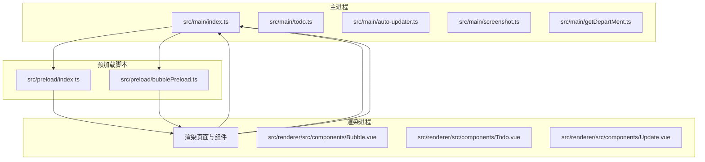
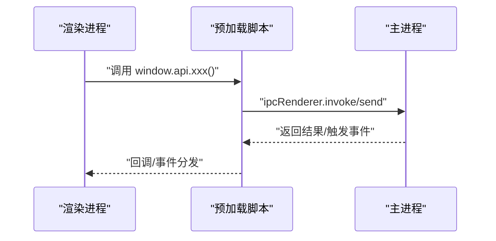
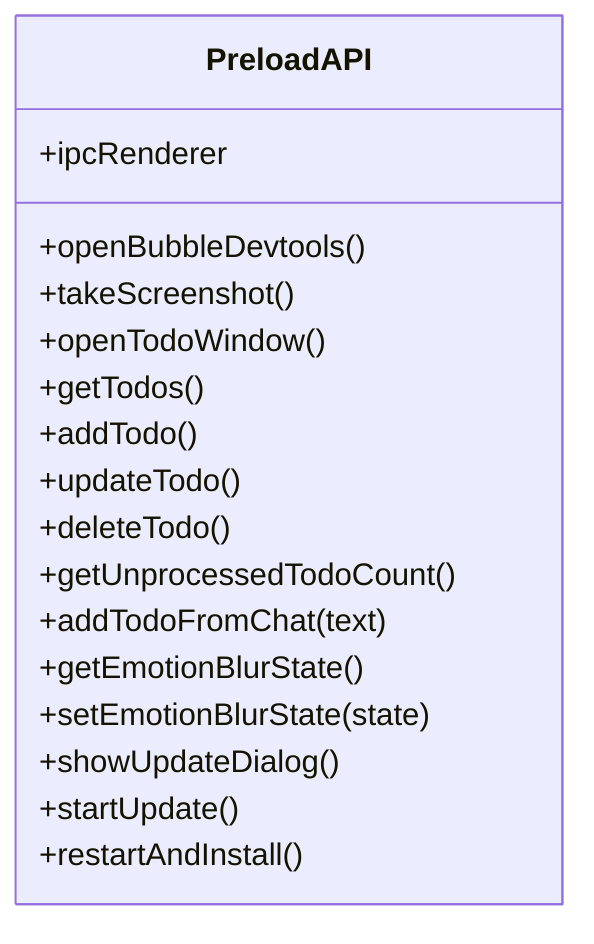
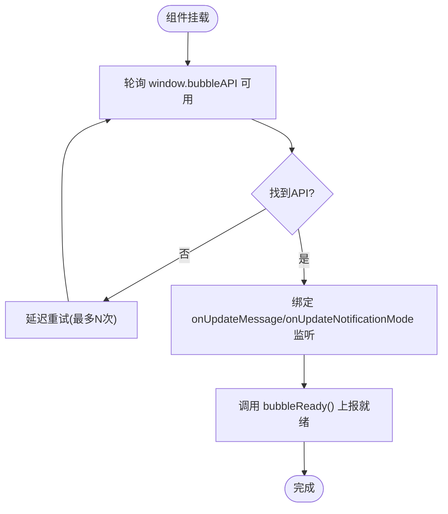
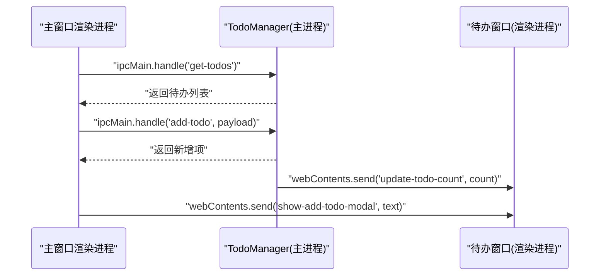
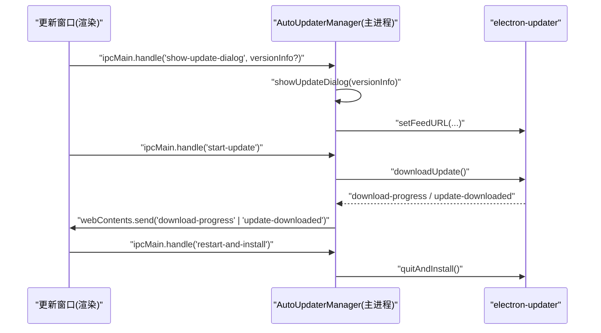
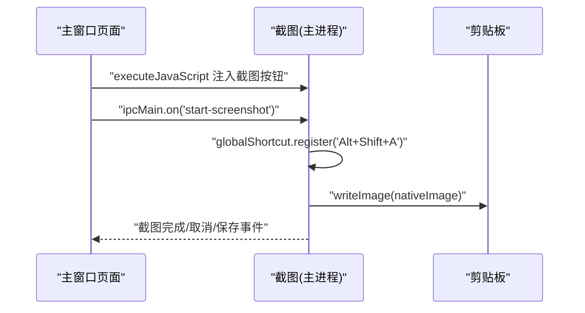
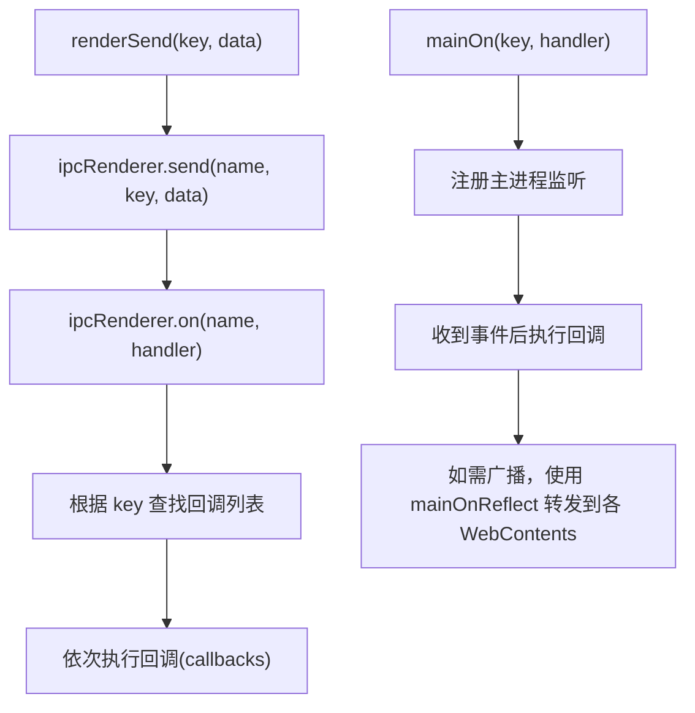
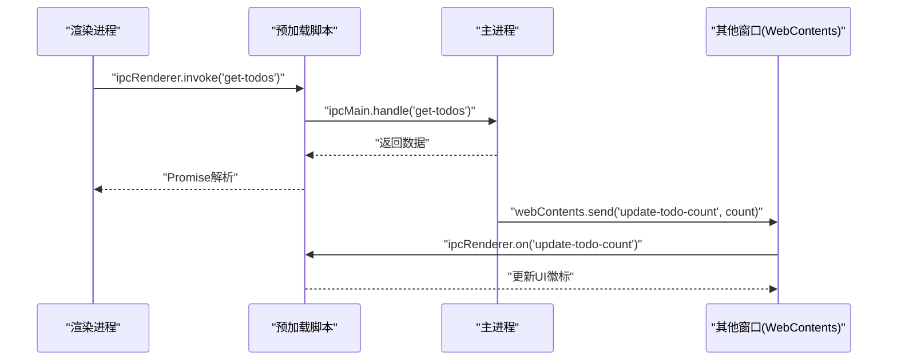
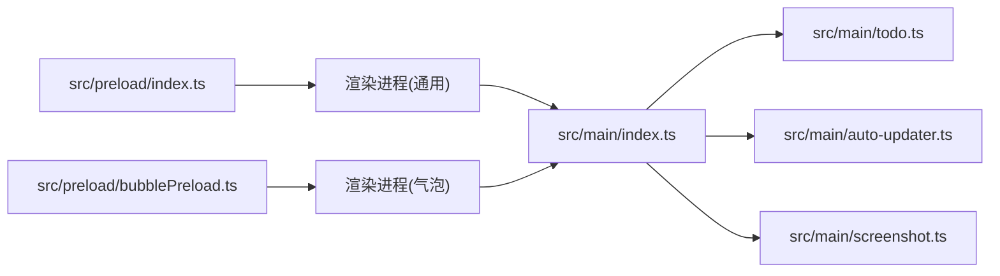

# IPC通信机制

<cite>
**本文引用的文件**
- [src/main/index.ts](file://src/main/index.ts)
- [src/preload/index.ts](file://src/preload/index.ts)
- [src/preload/bubblePreload.ts](file://src/preload/bubblePreload.ts)
- [src/preload/index.d.ts](file://src/preload/index.d.ts)
- [src/main/todo.ts](file://src/main/todo.ts)
- [src/main/auto-updater.ts](file://src/main/auto-updater.ts)
- [src/main/screenshot.ts](file://src/main/screenshot.ts)
- [src/main/getDepartMent.ts](file://src/main/getDepartMent.ts)
- [temp_eSearch/lib/ipc.ts](file://temp_eSearch/lib/ipc.ts)
- [src/renderer/src/components/Bubble.vue](file://src/renderer/src/components/Bubble.vue)
- [src/renderer/src/components/Todo.vue](file://src/renderer/src/components/Todo.vue)
- [src/renderer/src/components/Update.vue](file://src/renderer/src/components/Update.vue)
</cite>

## 目录
1. [引言](#引言)
2. [项目结构](#项目结构)
3. [核心组件](#核心组件)
4. [架构总览](#架构总览)
5. [详细组件分析](#详细组件分析)
6. [依赖关系分析](#依赖关系分析)
7. [性能考量](#性能考量)
8. [故障排查指南](#故障排查指南)
9. [结论](#结论)

## 引言
本文件系统性梳理该Electron应用的IPC通信机制，覆盖主进程与渲染进程之间的消息传递、事件注册与监听、数据序列化与传输、预加载脚本的安全与API暴露策略，并结合实际代码路径给出流程图与时序图，帮助开发者快速理解并优化IPC通信。

## 项目结构
该应用采用典型的Electron三层结构：主进程负责窗口生命周期、系统集成与业务逻辑；预加载脚本负责在渲染进程沙箱边界外安全地暴露有限API；渲染进程承载UI与用户交互。

图表来源
- [src/main/index.ts](file://src/main/index.ts#L276-L430)
- [src/preload/index.ts](file://src/preload/index.ts#L1-L63)
- [src/preload/bubblePreload.ts](file://src/preload/bubblePreload.ts#L1-L70)
- [src/renderer/src/components/Bubble.vue](file://src/renderer/src/components/Bubble.vue#L164-L228)

章节来源
- [src/main/index.ts](file://src/main/index.ts#L276-L430)
- [src/preload/index.ts](file://src/preload/index.ts#L1-L63)
- [src/preload/bubblePreload.ts](file://src/preload/bubblePreload.ts#L1-L70)

## 核心组件
- 主进程入口与窗口管理：负责创建主窗口、悬浮气泡窗口、托盘、自动更新、截图等功能，并注册大量IPC事件监听器。
- 预加载脚本：
  - 通用预加载：通过contextBridge在隔离上下文中向渲染进程暴露受限API集合。
  - 气泡预加载：在禁用上下文隔离场景下直接挂载API至window对象，供气泡窗口组件使用。
- 渲染进程组件：通过window.api与window.electron调用主进程能力，实现待办、更新、截图、表情模糊等功能。

章节来源
- [src/main/index.ts](file://src/main/index.ts#L120-L139)
- [src/preload/index.ts](file://src/preload/index.ts#L4-L62)
- [src/preload/bubblePreload.ts](file://src/preload/bubblePreload.ts#L3-L61)

## 架构总览
主进程通过BrowserWindow的webPreferences配置决定渲染进程的上下文隔离与Node集成策略；预加载脚本在安全边界内暴露必要API；渲染进程通过ipcRenderer与主进程通信，形成“渲染进程发起请求/事件—主进程处理—回调/广播”的闭环。

图表来源
- [src/preload/index.ts](file://src/preload/index.ts#L16-L43)
- [src/main/todo.ts](file://src/main/todo.ts#L77-L136)
- [src/main/auto-updater.ts](file://src/main/auto-updater.ts#L82-L131)

## 详细组件分析

### 通用预加载脚本（contextBridge）
- 作用：在启用上下文隔离时，通过contextBridge.exposeInMainWorld安全地向渲染进程暴露window.electron与window.api。
- 关键点：
  - window.electron.ipcRenderer封装常用方法（send、invoke、on、off、once、removeAllListeners）。
  - window.api封装业务API（截图、待办、表情模糊、自动更新等），统一命名空间避免污染全局。
  - 当上下文隔离关闭时，直接将对象挂载到window，便于兼容旧版或特定场景。

图表来源
- [src/preload/index.ts](file://src/preload/index.ts#L4-L62)

章节来源
- [src/preload/index.ts](file://src/preload/index.ts#L4-L62)
- [src/preload/index.d.ts](file://src/preload/index.d.ts#L4-L22)

### 气泡预加载脚本（禁用上下文隔离）
- 作用：在禁用上下文隔离的场景下，直接在window上挂载bubbleAPI，供气泡组件使用。
- 关键点：
  - 暴露事件监听与通知方法（onUpdateMessage、onUpdateNotificationMode、bubbleReady、bubbleMouseEnter/Leave、notificationClicked、clearSingleMessage、clearAllMessages、openBubbleDevtools、removeAllListeners）。
  - 组件挂载后轮询等待bubbleAPI可用，建立消息与通知模式监听，并上报“已就绪”。

图表来源
- [src/renderer/src/components/Bubble.vue](file://src/renderer/src/components/Bubble.vue#L164-L228)
- [src/preload/bubblePreload.ts](file://src/preload/bubblePreload.ts#L5-L61)

章节来源
- [src/preload/bubblePreload.ts](file://src/preload/bubblePreload.ts#L3-L61)
- [src/renderer/src/components/Bubble.vue](file://src/renderer/src/components/Bubble.vue#L164-L228)

### 待办事项（Todo）模块
- 主进程职责：
  - 注册IPC事件：打开窗口、增删改查、统计未处理数量、从聊天内容创建待办。
  - 广播未处理数量到所有窗口。
  - 注入脚本到主窗口，提供右键菜单“添加到待办”能力。
- 渲染进程职责：
  - 通过window.api调用主进程能力，展示与编辑待办列表。
  - 监听主进程广播的未处理数量，更新UI徽标。

图表来源
- [src/main/todo.ts](file://src/main/todo.ts#L77-L136)
- [src/main/todo.ts](file://src/main/todo.ts#L149-L154)
- [src/renderer/src/components/Todo.vue](file://src/renderer/src/components/Todo.vue#L140-L150)

章节来源
- [src/main/todo.ts](file://src/main/todo.ts#L77-L136)
- [src/main/todo.ts](file://src/main/todo.ts#L149-L154)
- [src/renderer/src/components/Todo.vue](file://src/renderer/src/components/Todo.vue#L140-L150)

### 自动更新（AutoUpdater）模块
- 主进程职责：
  - 注册IPC处理器：检查更新、获取当前版本、获取最新版本信息、开始更新、重启安装。
  - 集成electron-updater，监听下载进度、下载完成、错误等事件，并通过WebContents向更新窗口推送状态。
- 渲染进程职责：
  - 通过window.api触发更新流程，监听下载进度与完成事件，提供倒计时自动安装。

图表来源
- [src/main/auto-updater.ts](file://src/main/auto-updater.ts#L82-L131)
- [src/main/auto-updater.ts](file://src/main/auto-updater.ts#L435-L473)
- [src/renderer/src/components/Update.vue](file://src/renderer/src/components/Update.vue#L140-L173)

章节来源
- [src/main/auto-updater.ts](file://src/main/auto-updater.ts#L82-L131)
- [src/main/auto-updater.ts](file://src/main/auto-updater.ts#L435-L473)
- [src/renderer/src/components/Update.vue](file://src/renderer/src/components/Update.vue#L140-L173)

### 截图（Screenshot）模块
- 主进程职责：
  - 注册全局快捷键，调用截图库捕获屏幕区域，支持复制到剪贴板与保存对话框。
  - 注入截图按钮到主窗口页面，通过executeJavaScript动态插入。
  - 监听渲染进程的截图请求事件，启动截图流程。
- 渲染进程职责：
  - 通过window.ipcRenderer.send('start-screenshot')触发截图。

图表来源
- [src/main/screenshot.ts](file://src/main/screenshot.ts#L16-L78)
- [src/main/screenshot.ts](file://src/main/screenshot.ts#L102-L140)
- [src/main/screenshot.ts](file://src/main/screenshot.ts#L155-L158)

章节来源
- [src/main/screenshot.ts](file://src/main/screenshot.ts#L16-L78)
- [src/main/screenshot.ts](file://src/main/screenshot.ts#L102-L140)
- [src/main/screenshot.ts](file://src/main/screenshot.ts#L155-L158)

### 通用IPC桥接（temp_eSearch/lib/ipc.ts）
- 设计目的：为多渲染进程间通信提供统一的事件名与类型安全的封装，主进程作为中转站转发事件。
- 关键点：
  - 定义Message类型映射，涵盖截图、编辑、录制、通知、主题、热键等高频事件。
  - 提供renderSend/renderOn/renderSendSync与mainOn/mainOnReflect，分别用于渲染进程发送/监听与主进程注册/反射转发。
  - 通过Map维护每类事件的回调列表，支持多监听者。

图表来源
- [temp_eSearch/lib/ipc.ts](file://temp_eSearch/lib/ipc.ts#L176-L272)

章节来源
- [temp_eSearch/lib/ipc.ts](file://temp_eSearch/lib/ipc.ts#L1-L273)

### 主进程与渲染进程通信流程（综合）
- 事件注册：主进程通过ipcMain.on/handle注册事件；预加载脚本通过ipcRenderer.on监听主进程广播。
- 事件发送：渲染进程通过ipcRenderer.send/invoke触发；主进程通过webContents.send广播到其他窗口。
- 数据序列化：Electron IPC基于结构化克隆算法，复杂对象需可序列化；建议避免循环引用与不可序列化字段。
- 安全策略：当前项目在主进程与气泡窗口中禁用了上下文隔离与安全策略，便于直接访问DOM与Node能力，但带来安全风险，建议逐步启用上下文隔离并最小化API暴露面。

图表来源
- [src/preload/index.ts](file://src/preload/index.ts#L16-L43)
- [src/main/todo.ts](file://src/main/todo.ts#L77-L136)
- [src/main/todo.ts](file://src/main/todo.ts#L149-L154)

章节来源
- [src/preload/index.ts](file://src/preload/index.ts#L16-L43)
- [src/main/todo.ts](file://src/main/todo.ts#L77-L136)
- [src/main/todo.ts](file://src/main/todo.ts#L149-L154)

## 依赖关系分析
- 主进程对预加载脚本的依赖：主窗口与气泡窗口均通过preload选项加载对应脚本，从而获得API访问能力。
- 预加载脚本对渲染进程的依赖：通过window对象暴露API，渲染进程以window.api/window.electron调用。
- 渲染进程对主进程的依赖：通过ipcRenderer与ipcMain双向通信，主进程负责业务处理与系统集成。

图表来源
- [src/main/index.ts](file://src/main/index.ts#L276-L302)
- [src/preload/index.ts](file://src/preload/index.ts#L1-L63)
- [src/preload/bubblePreload.ts](file://src/preload/bubblePreload.ts#L1-L70)

章节来源
- [src/main/index.ts](file://src/main/index.ts#L276-L302)
- [src/preload/index.ts](file://src/preload/index.ts#L1-L63)
- [src/preload/bubblePreload.ts](file://src/preload/bubblePreload.ts#L1-L70)

## 性能考量
- 事件频率控制：高频事件（如滚动、窗口移动、下载进度）建议节流/去抖，避免主线程阻塞。
- 数据体积优化：尽量传递必要字段，避免大对象频繁序列化；必要时采用分页或增量更新。
- 广播范围：仅向需要的窗口广播事件，减少不必要的渲染进程唤醒。
- 预加载脚本复用：将通用API集中管理，避免重复注入与监听器泄漏。
- 网络与IO：主进程的外部请求（如更新、用户信息拉取）应设置超时与重试策略，避免阻塞UI线程。

## 故障排查指南
- 事件未触发
  - 检查主进程是否正确注册ipcMain.on/handle；渲染进程是否使用正确的通道名与参数。
  - 确认预加载脚本已正确暴露window.api与window.electron。
- 回调未执行
  - 检查ipcRenderer.on是否在组件挂载后注册，且未被提前移除。
  - 对于invoke，确认主进程返回值类型与渲染端await解析一致。
- 气泡窗口API不可用
  - 确认禁用上下文隔离场景下bubblePreload已加载，且window.bubbleAPI在组件挂载后可用。
  - 检查预加载脚本是否在DOMContentLoaded后初始化。
- 安全相关问题
  - 当前项目禁用了上下文隔离与webSecurity，存在XSS与代码注入风险；建议逐步启用上下文隔离，并通过contextBridge精确暴露API。
- 调试技巧
  - 开启渲染进程开发者工具定位事件监听与调用栈。
  - 在主进程打印事件通道名与数据，核对序列化前后一致性。
  - 使用最小化示例复现问题，排除第三方库干扰。

章节来源
- [src/renderer/src/components/Bubble.vue](file://src/renderer/src/components/Bubble.vue#L164-L228)
- [src/preload/bubblePreload.ts](file://src/preload/bubblePreload.ts#L66-L70)
- [src/main/index.ts](file://src/main/index.ts#L286-L301)

## 结论
该应用的IPC体系以预加载脚本为核心桥梁，将主进程能力安全地暴露给渲染进程，同时通过统一的事件模型支撑多模块协作。当前配置在便利性与安全性之间做了权衡，建议后续逐步收紧安全策略，提升系统的健壮性与可维护性。