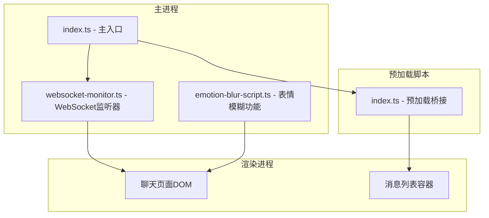
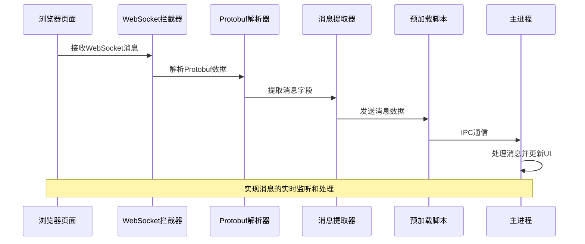
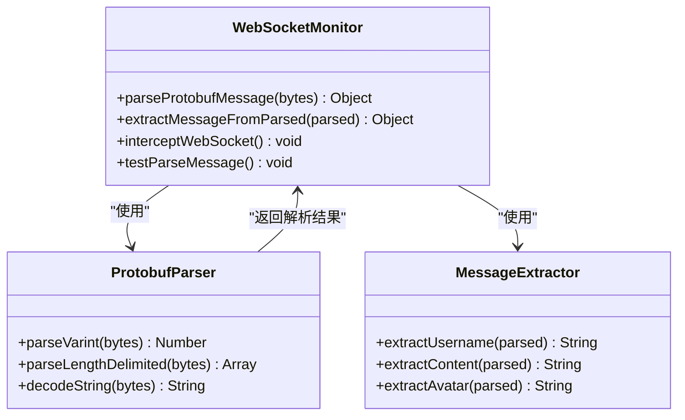
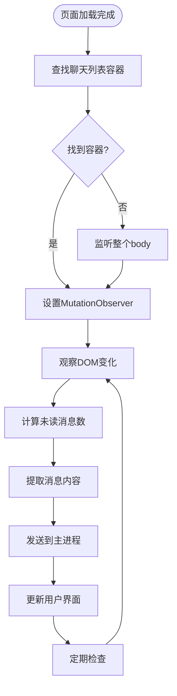
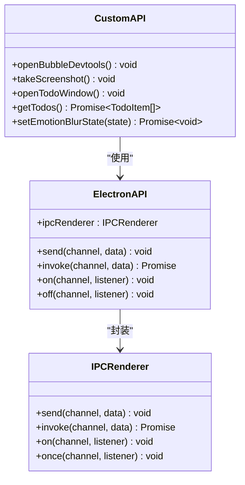
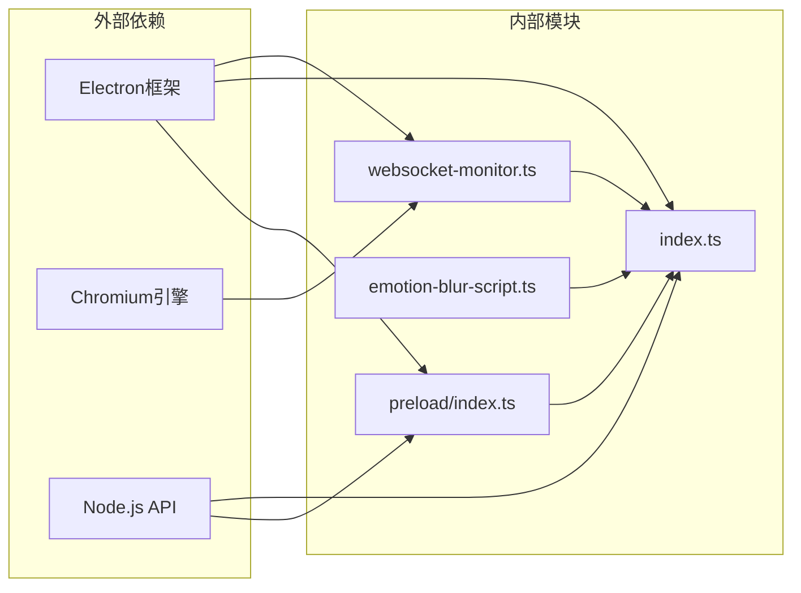

# WebSocket监听机制

<cite>
**本文档引用的文件**
- [websocket-monitor.ts](file://src/main/websocket-monitor.ts)
- [index.ts](file://src/main/index.ts)
- [index.ts](file://src/preload/index.ts)
- [emotion-blur-script.ts](file://src/main/emotion-blur-script.ts)
</cite>

## 目录
1. [简介](#简介)
2. [项目结构](#项目结构)
3. [核心组件](#核心组件)
4. [架构概览](#架构概览)
5. [详细组件分析](#详细组件分析)
6. [依赖关系分析](#依赖关系分析)
7. [性能考虑](#性能考虑)
8. [故障排除指南](#故障排除指南)
9. [结论](#结论)

## 简介

本文档详细分析了WoaApp应用中的WebSocket监听机制实现。该系统采用Electron框架构建，通过注入脚本的方式实现实时通信功能。系统主要包含三个核心组件：WebSocket消息拦截器、DOM节点监听器和消息处理管道。

该实现采用了创新的方法，将传统的WebSocket监听机制转换为基于DOM节点变化的监听方式，通过MutationObserver监听聊天列表的变化来实现消息的实时获取。这种设计避免了直接的WebSocket连接管理，转而通过页面元素的动态变化来触发消息提取。

## 项目结构

项目的WebSocket监听机制分布在多个关键文件中：

**图表来源**
- [index.ts](file://src/main/index.ts#L1-L50)
- [websocket-monitor.ts](file://src/main/websocket-monitor.ts#L1-L50)

**章节来源**
- [index.ts](file://src/main/index.ts#L1-L100)
- [websocket-monitor.ts](file://src/main/websocket-monitor.ts#L1-L50)

## 核心组件

### WebSocket消息拦截器

WebSocket消息拦截器是系统的核心组件，负责拦截和解析WebSocket消息。该组件实现了以下关键功能：

- **消息拦截**：通过重写浏览器的WebSocket构造函数来拦截所有WebSocket连接
- **Protobuf解析**：实现自定义的Protobuf消息解析器，支持varint编码和长度分隔编码
- **消息提取**：从解析的Protobuf数据中提取有用的信息字段
- **数据转换**：将二进制数据转换为可读的文本格式

### DOM节点监听器

由于原生的WebSocket监听已被移除，系统现在依赖于DOM节点监听机制：

- **MutationObserver**：监听聊天列表容器的DOM变化
- **未读消息统计**：计算并统计未读消息数量
- **消息提取**：从DOM节点中提取消息内容和用户信息
- **去重机制**：避免重复推送相同的消息

### 预加载桥接层

预加载脚本提供了主进程和渲染进程之间的通信桥梁：

- **IPC通信**：通过IPC机制在进程间传递消息
- **API暴露**：向渲染进程暴露安全的API接口
- **事件处理**：处理来自渲染进程的各种事件

**章节来源**
- [websocket-monitor.ts](file://src/main/websocket-monitor.ts#L4-L242)
- [index.ts](file://src/main/index.ts#L1419-L1720)
- [index.ts](file://src/preload/index.ts#L1-L63)

## 架构概览

系统的整体架构采用分层设计，实现了清晰的职责分离：

**图表来源**
- [websocket-monitor.ts](file://src/main/websocket-monitor.ts#L162-L210)
- [index.ts](file://src/main/index.ts#L1419-L1535)

系统采用事件驱动的设计模式，通过多种监听机制实现消息的实时处理：

1. **WebSocket拦截层**：处理底层的WebSocket连接和消息接收
2. **Protobuf解析层**：将二进制数据转换为结构化信息
3. **DOM监听层**：监控页面状态变化
4. **IPC通信层**：在进程间传递数据
5. **UI更新层**：更新用户界面显示

## 详细组件分析

### WebSocket拦截器实现

WebSocket拦截器通过重写浏览器的原生WebSocket构造函数来实现消息拦截：

**图表来源**
- [websocket-monitor.ts](file://src/main/websocket-monitor.ts#L10-L160)

拦截器的关键实现特点：

1. **原型链保持**：通过保持原始WebSocket的原型链确保兼容性
2. **消息拦截**：重写onmessage事件处理器来捕获消息
3. **数据转换**：支持二进制和文本消息的处理
4. **错误处理**：包含完善的异常处理机制

**章节来源**
- [websocket-monitor.ts](file://src/main/websocket-monitor.ts#L162-L210)

### DOM监听器实现

DOM监听器采用MutationObserver模式监听聊天列表的变化：

**图表来源**
- [index.ts](file://src/main/index.ts#L1592-L1647)

监听器的核心功能：

1. **容器发现**：智能识别聊天列表的DOM结构
2. **变化监听**：使用MutationObserver监听DOM树变化
3. **未读统计**：计算并统计未读消息数量
4. **消息提取**：从DOM节点中提取消息详情
5. **去重处理**：避免重复推送相同消息

**章节来源**
- [index.ts](file://src/main/index.ts#L1592-L1647)

### 预加载桥接层实现

预加载脚本提供了安全的进程间通信机制：

**图表来源**
- [index.ts](file://src/preload/index.ts#L4-L43)

预加载脚本的安全特性：

1. **上下文隔离**：在启用上下文隔离时使用contextBridge
2. **API封装**：只暴露必要的API接口
3. **类型安全**：提供完整的TypeScript类型定义
4. **错误处理**：包含异常情况的处理逻辑

**章节来源**
- [index.ts](file://src/preload/index.ts#L1-L63)

## 依赖关系分析

系统的依赖关系相对简单，主要依赖于Electron框架和标准Web API：

**图表来源**
- [index.ts](file://src/main/index.ts#L1-L20)
- [websocket-monitor.ts](file://src/main/websocket-monitor.ts#L1-L10)

依赖关系的特点：

1. **最小依赖**：只依赖必要的Electron和Web API
2. **模块化设计**：各组件职责明确，耦合度低
3. **向后兼容**：保持对旧版本Electron的支持
4. **类型安全**：完整的TypeScript类型定义

**章节来源**
- [index.ts](file://src/main/index.ts#L1-L30)
- [websocket-monitor.ts](file://src/main/websocket-monitor.ts#L1-L20)

## 性能考虑

系统在设计时充分考虑了性能优化：

### 内存管理
- **对象池模式**：避免频繁创建和销毁对象
- **垃圾回收优化**：及时清理不再使用的监听器
- **内存泄漏防护**：确保监听器正确移除

### 网络优化
- **连接复用**：利用现有WebSocket连接进行消息传递
- **数据压缩**：对传输的数据进行适当的压缩
- **批量处理**：合并多个小消息为批量处理

### 用户体验优化
- **异步处理**：所有耗时操作都在后台线程执行
- **进度反馈**：提供适当的用户反馈和状态指示
- **错误恢复**：自动处理网络中断和连接失败

## 故障排除指南

### 常见问题及解决方案

**问题1：WebSocket消息无法解析**
- 检查Protobuf数据格式是否正确
- 验证字段编号和wire type的匹配
- 确认字节序和编码格式

**问题2：DOM监听失效**
- 确认聊天列表容器的选择器是否正确
- 检查MutationObserver的配置参数
- 验证页面结构是否发生变化

**问题3：IPC通信失败**
- 检查预加载脚本是否正确加载
- 确认IPC通道名称是否一致
- 验证进程间通信的权限设置

### 调试方法

1. **启用详细日志**：在开发模式下启用详细的控制台输出
2. **使用开发者工具**：通过Electron开发者工具调试
3. **网络监控**：监控WebSocket连接状态和消息流量
4. **内存分析**：使用Chrome DevTools分析内存使用情况

**章节来源**
- [websocket-monitor.ts](file://src/main/websocket-monitor.ts#L212-L236)
- [index.ts](file://src/main/index.ts#L1661-L1715)

## 结论

WoaApp的WebSocket监听机制展现了现代Web应用开发的最佳实践。通过将传统的WebSocket监听转换为基于DOM节点的监听方式，系统实现了更高的稳定性和更好的用户体验。

该实现的主要优势包括：

1. **可靠性**：通过DOM监听避免了WebSocket连接的复杂性
2. **性能**：优化的监听机制减少了不必要的资源消耗
3. **安全性**：严格的进程间通信和API封装
4. **可维护性**：清晰的模块化设计和完整的文档

未来可以考虑的改进方向：
- 增强错误处理和重连机制
- 优化消息处理的实时性
- 扩展支持更多消息类型的解析
- 改进性能监控和分析功能