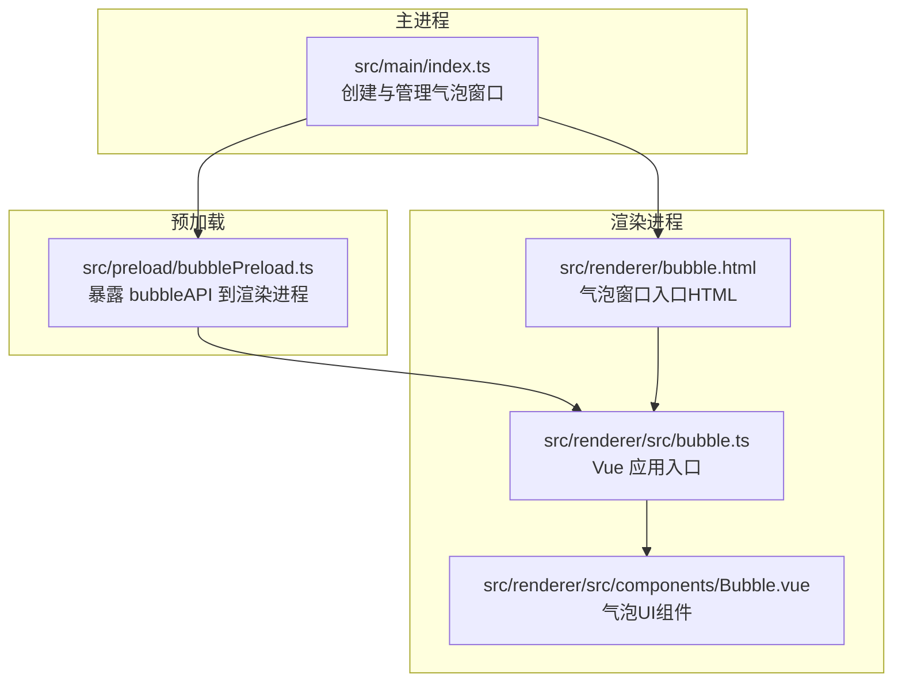
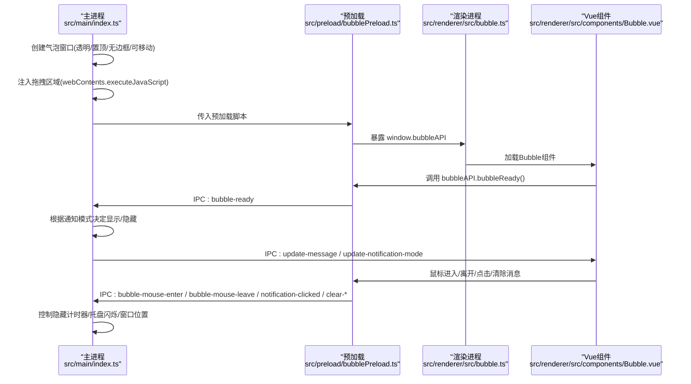
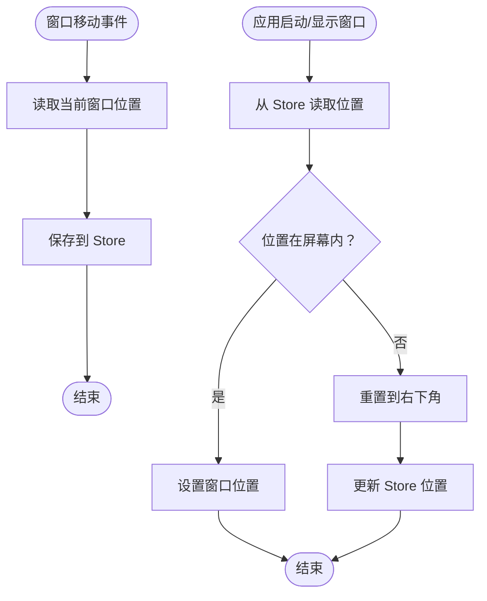
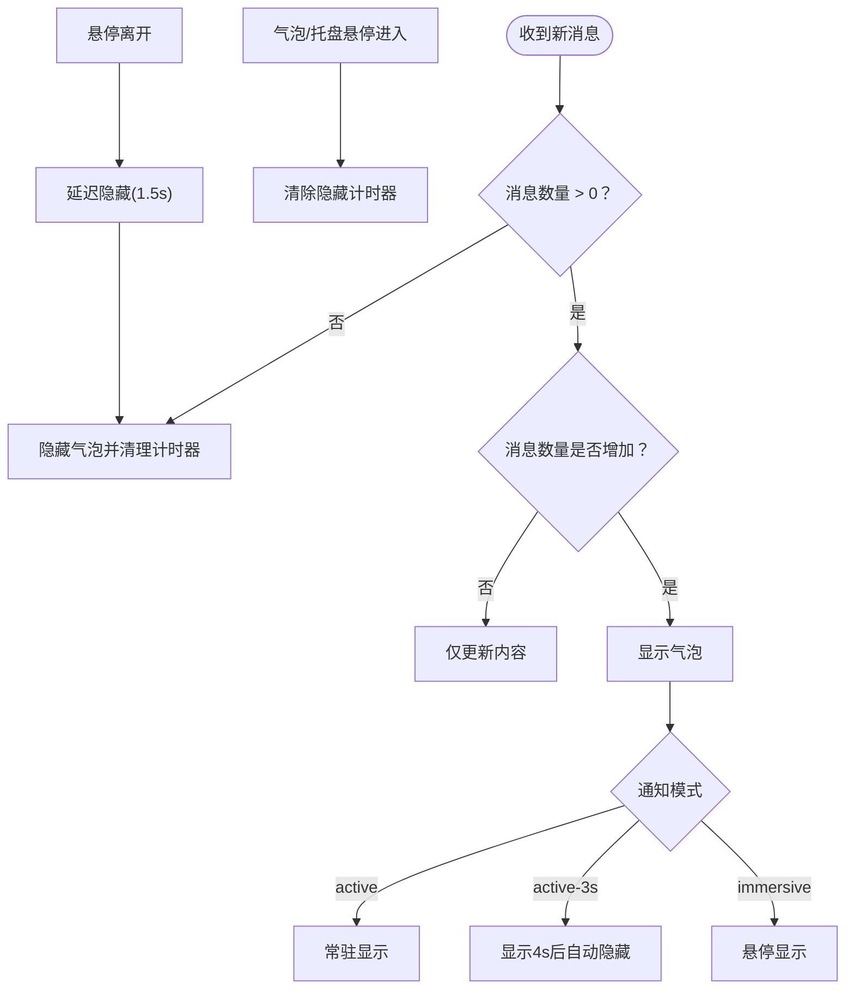
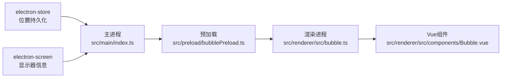

# 气泡窗口管理

<cite>
**本文档引用的文件**
- [src/renderer/src/components/Bubble.vue](file://src/renderer/src/components/Bubble.vue)
- [src/renderer/src/bubble.ts](file://src/renderer/src/bubble.ts)
- [src/renderer/bubble.html](file://src/renderer/bubble.html)
- [src/preload/bubblePreload.ts](file://src/preload/bubblePreload.ts)
- [src/main/index.ts](file://src/main/index.ts)
- [src/renderer/src/types/global.d.ts](file://src/renderer/src/types/global.d.ts)
</cite>

## 目录
1. [简介](#简介)
2. [项目结构](#项目结构)
3. [核心组件](#核心组件)
4. [架构概览](#架构概览)
5. [详细组件分析](#详细组件分析)
6. [依赖关系分析](#依赖关系分析)
7. [性能考量](#性能考量)
8. [故障排查指南](#故障排查指南)
9. [结论](#结论)

## 简介
本文件系统性阐述气泡窗口的创建、位置计算、显示与隐藏逻辑，以及窗口属性配置、生命周期管理、拖拽功能、3秒自动隐藏机制、悬停控制逻辑、窗口移动时的位置持久化、尺寸配置、屏幕边界处理与多显示器支持等关键技术细节。同时提供状态管理、内存优化与性能最佳实践，帮助读者全面掌握该模块的设计与实现。

## 项目结构
气泡窗口由主进程创建并维护，渲染进程负责UI展示与交互；预加载脚本桥接渲染进程与主进程之间的IPC通信。

图表来源
- [src/main/index.ts](file://src/main/index.ts#L618-L764)
- [src/preload/bubblePreload.ts](file://src/preload/bubblePreload.ts#L1-L70)
- [src/renderer/bubble.html](file://src/renderer/bubble.html#L1-L33)
- [src/renderer/src/bubble.ts](file://src/renderer/src/bubble.ts#L1-L8)
- [src/renderer/src/components/Bubble.vue](file://src/renderer/src/components/Bubble.vue#L1-L236)

章节来源
- [src/main/index.ts](file://src/main/index.ts#L618-L764)
- [src/preload/bubblePreload.ts](file://src/preload/bubblePreload.ts#L1-L70)
- [src/renderer/bubble.html](file://src/renderer/bubble.html#L1-L33)
- [src/renderer/src/bubble.ts](file://src/renderer/src/bubble.ts#L1-L8)
- [src/renderer/src/components/Bubble.vue](file://src/renderer/src/components/Bubble.vue#L1-L236)

## 核心组件
- 气泡窗口创建与配置：主进程负责创建BrowserWindow，设置透明、置顶、无边框、可移动等属性，并注入拖拽区域。
- 气泡UI组件：渲染进程使用Vue组件展示消息列表、标题栏、操作按钮等。
- 预加载桥接：通过预加载脚本在window对象上暴露bubbleAPI，实现渲染进程与主进程的IPC通信。
- 状态与持久化：使用electron-store保存气泡窗口位置，确保重启后恢复到上次位置。
- 通知模式：支持“常驻显示”、“显示4s后消失”、“鼠标悬停显示”三种模式，配合3秒自动隐藏与悬停控制逻辑。

章节来源
- [src/main/index.ts](file://src/main/index.ts#L618-L764)
- [src/renderer/src/components/Bubble.vue](file://src/renderer/src/components/Bubble.vue#L1-L236)
- [src/preload/bubblePreload.ts](file://src/preload/bubblePreload.ts#L1-L70)
- [src/renderer/src/types/global.d.ts](file://src/renderer/src/types/global.d.ts#L1-L19)

## 架构概览
气泡窗口的交互流程如下：主进程创建窗口并注入拖拽区域；渲染进程加载Vue组件并通过bubbleAPI与主进程通信；主进程根据通知模式与用户交互控制显示/隐藏与自动隐藏；窗口移动时位置持久化到Store。

图表来源
- [src/main/index.ts](file://src/main/index.ts#L618-L764)
- [src/preload/bubblePreload.ts](file://src/preload/bubblePreload.ts#L1-L70)
- [src/renderer/src/bubble.ts](file://src/renderer/src/bubble.ts#L1-L8)
- [src/renderer/src/components/Bubble.vue](file://src/renderer/src/components/Bubble.vue#L164-L236)

## 详细组件分析

### 气泡窗口创建与属性配置
- 窗口尺寸：固定宽度与高度，便于统一布局与高度计算。
- 透明与置顶：透明窗口、总是置顶、跳过任务栏，确保悬浮效果。
- 无边框与可移动：frame为false，movable为true，结合拖拽区域实现自由移动。
- Web偏好：禁用上下文隔离、启用Node集成、禁用安全策略、允许不安全内容等，满足复杂渲染需求。
- 图标与菜单：禁用窗口菜单，设置自定义图标。

章节来源
- [src/main/index.ts](file://src/main/index.ts#L618-L764)

### 位置计算与屏幕边界处理
- 默认位置：右下角对齐，留出边距。
- 位置持久化：窗口移动事件触发时写入Store，重启后恢复。
- 边界校验：启动时检查存储位置是否在屏幕工作区内，否则重置到右下角并更新Store。
- 多显示器支持：基于主显示器工作区尺寸计算，适用于多显示器场景。

图表来源
- [src/main/index.ts](file://src/main/index.ts#L757-L763)
- [src/main/index.ts](file://src/main/index.ts#L1984-L2000)

章节来源
- [src/main/index.ts](file://src/main/index.ts#L757-L763)
- [src/main/index.ts](file://src/main/index.ts#L1984-L2000)

### 显示与隐藏逻辑
- 显示时机：收到新消息且消息数量不减少时触发显示；或托盘悬停触发显示。
- 隐藏时机：托盘或气泡悬停离开后延迟隐藏；3秒自动隐藏（仅在active-3s模式）。
- 模式切换：根据Store中的notificationMode决定行为；切换模式时清理旧计时器并按需显示。

图表来源
- [src/main/index.ts](file://src/main/index.ts#L1897-L1931)
- [src/main/index.ts](file://src/main/index.ts#L1208-L1234)
- [src/main/index.ts](file://src/main/index.ts#L1947-L1969)

章节来源
- [src/main/index.ts](file://src/main/index.ts#L1897-L1931)
- [src/main/index.ts](file://src/main/index.ts#L1208-L1234)
- [src/main/index.ts](file://src/main/index.ts#L1947-L1969)

### 3秒自动隐藏机制与悬停控制
- 计时器管理：active3sTimer用于3秒自动隐藏；clearHideTimer用于悬停进入时清除隐藏计时器。
- 模式差异：active模式常驻不隐藏；active-3s模式显示后启动3秒计时器；immersive模式仅悬停显示。
- 悬停状态：isBubbleHover/isTrayHover记录悬停状态，离开时延迟隐藏。

章节来源
- [src/main/index.ts](file://src/main/index.ts#L46-L53)
- [src/main/index.ts](file://src/main/index.ts#L1208-L1234)
- [src/main/index.ts](file://src/main/index.ts#L1237-L1242)
- [src/main/index.ts](file://src/main/index.ts#L1947-L1969)

### 窗口尺寸配置与高度自适应
- 固定宽度：260px。
- 高度计算：基础高度+每条消息占用高度，保证内容完整显示。
- 位置调整：高度变化时同步调整y坐标，保持右下角对齐。

章节来源
- [src/main/index.ts](file://src/main/index.ts#L1752-L1801)

### 拖拽功能实现
- 拖拽区域：通过执行JavaScript设置body的webkitAppRegion为drag，使窗口可拖拽。
- 右键菜单禁用：避免误触菜单影响拖拽体验。

章节来源
- [src/main/index.ts](file://src/main/index.ts#L720-L731)

### 窗口生命周期管理
- 创建：主进程创建BrowserWindow并加载对应HTML。
- 关闭：拦截close事件，改为hide()，避免进程退出。
- 异常保护：render-process-gone时重载窗口并恢复位置。
- 重新显示：显示前校验位置有效性，必要时重置到右下角。

章节来源
- [src/main/index.ts](file://src/main/index.ts#L197-L203)
- [src/main/index.ts](file://src/main/index.ts#L739-L756)
- [src/main/index.ts](file://src/main/index.ts#L1971-L2010)

### 渲染进程UI与交互
- Vue组件：提供消息列表、标题栏、清除按钮、时间格式化、头像占位等。
- 事件绑定：鼠标进入/离开、消息点击、清除单条/全部消息、打开开发者工具。
- API调用：通过window.bubbleAPI与主进程通信，等待API可用后注册监听器并上报就绪状态。

章节来源
- [src/renderer/src/components/Bubble.vue](file://src/renderer/src/components/Bubble.vue#L1-L236)
- [src/renderer/src/bubble.ts](file://src/renderer/src/bubble.ts#L1-L8)
- [src/renderer/src/types/global.d.ts](file://src/renderer/src/types/global.d.ts#L1-L19)

### 预加载桥接与IPC通信
- 暴露API：在window对象上直接暴露bubbleAPI，包含消息更新、通知模式更新、鼠标事件、点击事件、清除消息、开发者工具等。
- 渲染进程等待：组件挂载后轮询等待bubbleAPI可用，注册监听器并上报就绪。
- 主进程监听：主进程监听bubble-ready、bubble-mouse-enter、bubble-mouse-leave、notification-clicked、clear-*等事件。

章节来源
- [src/preload/bubblePreload.ts](file://src/preload/bubblePreload.ts#L1-L70)
- [src/renderer/src/components/Bubble.vue](file://src/renderer/src/components/Bubble.vue#L164-L236)
- [src/main/index.ts](file://src/main/index.ts#L1731-L1750)
- [src/main/index.ts](file://src/main/index.ts#L1208-L1234)
- [src/main/index.ts](file://src/main/index.ts#L1374-L1386)

## 依赖关系分析
- 主进程依赖electron-store进行位置持久化，依赖electron-screen获取显示器信息。
- 预加载脚本依赖ipcRenderer与contextBridge，向渲染进程暴露window.bubbleAPI。
- 渲染进程依赖Vue生态，通过bubbleAPI与主进程通信。
- 气泡窗口与主窗口相互独立，通过IPC解耦，互不影响。

图表来源
- [src/main/index.ts](file://src/main/index.ts#L37-L38)
- [src/main/index.ts](file://src/main/index.ts#L618-L764)
- [src/preload/bubblePreload.ts](file://src/preload/bubblePreload.ts#L1-L70)
- [src/renderer/src/bubble.ts](file://src/renderer/src/bubble.ts#L1-L8)
- [src/renderer/src/components/Bubble.vue](file://src/renderer/src/components/Bubble.vue#L1-L236)

章节来源
- [src/main/index.ts](file://src/main/index.ts#L37-L38)
- [src/main/index.ts](file://src/main/index.ts#L618-L764)
- [src/preload/bubblePreload.ts](file://src/preload/bubblePreload.ts#L1-L70)
- [src/renderer/src/bubble.ts](file://src/renderer/src/bubble.ts#L1-L8)
- [src/renderer/src/components/Bubble.vue](file://src/renderer/src/components/Bubble.vue#L1-L236)

## 性能考量
- 渲染进程稳定性：render-process-gone时自动重载，降低崩溃风险。
- 事件去抖：悬停离开后延迟隐藏，避免频繁切换导致闪烁。
- 内容更新：仅在窗口可见或强制更新时发送消息，减少IPC压力。
- 资源释放：组件卸载时移除所有监听器，避免内存泄漏。
- 网络与脚本：主进程注入的脚本仅在DOM层面监听，避免高频率轮询。

章节来源
- [src/main/index.ts](file://src/main/index.ts#L739-L756)
- [src/main/index.ts](file://src/main/index.ts#L1156-L1175)
- [src/main/index.ts](file://src/main/index.ts#L1792-L1794)
- [src/renderer/src/components/Bubble.vue](file://src/renderer/src/components/Bubble.vue#L230-L235)

## 故障排查指南
- 气泡窗口无法显示：检查通知模式是否为immersive；确认主进程是否收到新消息；查看托盘悬停逻辑。
- 3秒自动隐藏未生效：确认当前模式为active-3s；检查active3sTimer是否被正确清理与启动。
- 气泡位置异常：检查Store中的位置是否越界；确认屏幕工作区尺寸；重启后是否重置到右下角。
- 拖拽无效：确认是否正确注入webkitAppRegion为drag；检查右键菜单是否被禁用。
- 渲染进程崩溃：观察render-process-gone事件处理；确认重载与位置恢复逻辑。
- 开发者工具：主进程提供打开气泡窗口开发者工具的接口，便于调试。

章节来源
- [src/main/index.ts](file://src/main/index.ts#L1208-L1234)
- [src/main/index.ts](file://src/main/index.ts#L1947-L1969)
- [src/main/index.ts](file://src/main/index.ts#L1984-L2000)
- [src/main/index.ts](file://src/main/index.ts#L720-L731)
- [src/main/index.ts](file://src/main/index.ts#L739-L756)
- [src/main/index.ts](file://src/main/index.ts#L1365-L1372)

## 结论
该气泡窗口管理模块通过清晰的职责划分与完善的生命周期管理，实现了稳定、可配置、可扩展的悬浮通知能力。其核心优势在于：
- 窗口属性与拖拽区域配置明确，适配多显示器与屏幕边界。
- 通知模式灵活可控，支持常驻、定时隐藏与悬停显示。
- 位置持久化与边界校验保障用户体验一致性。
- 渲染进程稳定性与内存优化措施有效降低崩溃与资源占用风险。