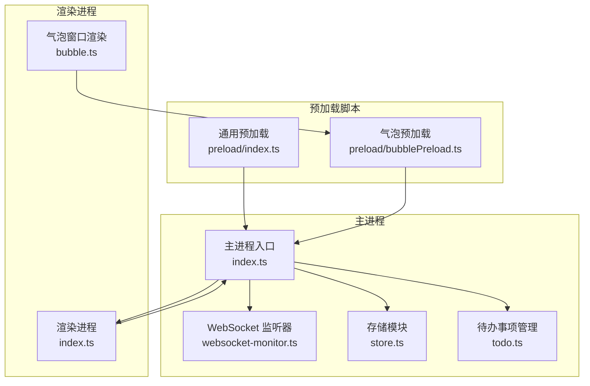
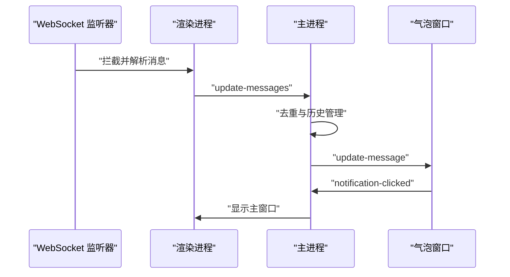
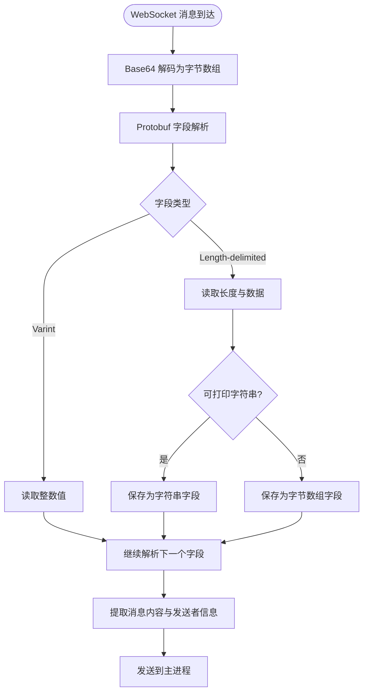
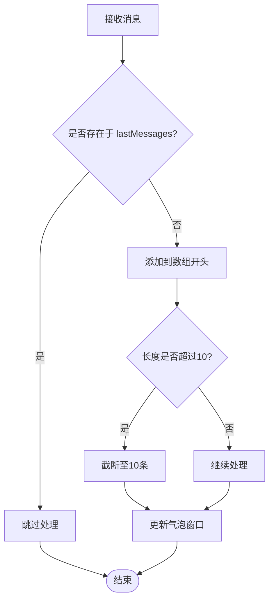
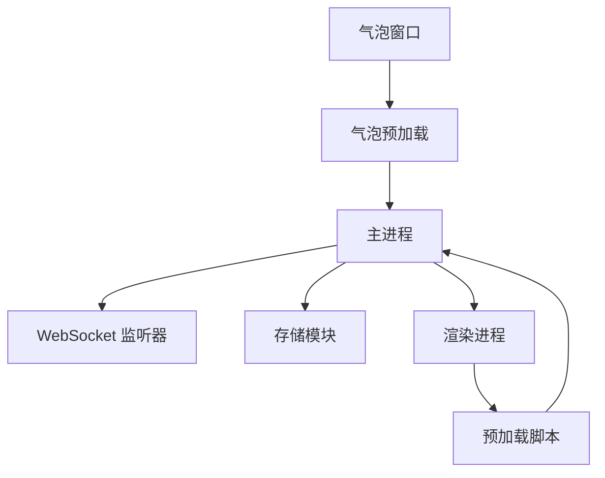

# 消息处理流程

<cite>
**本文档引用的文件**
- [src/main/index.ts](file://src/main/index.ts)
- [src/main/index copy.ts](file://src/main/index copy.ts)
- [src/main/websocket-monitor.ts](file://src/main/websocket-monitor.ts)
- [src/preload/index.ts](file://src/preload/index.ts)
- [src/preload/bubblePreload.ts](file://src/preload/bubblePreload.ts)
- [src/renderer/src/bubble.ts](file://src/renderer/src/bubble.ts)
- [src/main/toto.ts](file://src/main/todo.ts)
- [temp_eSearch/lib/store/store.ts](file://temp_eSearch/lib/store/store.ts)
</cite>

## 目录
1. [简介](#简介)
2. [项目结构](#项目结构)
3. [核心组件](#核心组件)
4. [架构概览](#架构概览)
5. [详细组件分析](#详细组件分析)
6. [依赖关系分析](#依赖关系分析)
7. [性能考虑](#性能考虑)
8. [故障排除指南](#故障排除指南)
9. [结论](#结论)

## 简介
本文件详细阐述了 WoaChat 应用中的消息处理流程，涵盖消息接收、解析、存储、去重、历史管理、优先级处理以及消息展示的完整技术实现。文档基于实际源码进行分析，重点解释了主进程与渲染进程之间的 IPC 通信机制、DOM 监听与 WebSocket 拦截相结合的消息提取策略、消息去重算法、历史消息管理以及气泡窗口的展示逻辑。

## 项目结构
该消息处理系统主要分布在以下模块：
- 主进程：负责窗口管理、消息接收与转发、消息去重与历史管理、通知模式控制
- 渲染进程：负责 DOM 节点监听与消息提取、气泡窗口内容渲染
- 预加载脚本：提供安全的 IPC API 暴露与窗口间通信桥接
- 存储模块：提供配置与数据持久化能力

**图表来源**
- [src/main/index.ts](file://src/main/index.ts#L1419-L1759)
- [src/main/websocket-monitor.ts](file://src/main/websocket-monitor.ts#L4-L242)
- [src/preload/index.ts](file://src/preload/index.ts#L1-L63)
- [src/preload/bubblePreload.ts](file://src/preload/bubblePreload.ts#L1-L70)
- [src/renderer/src/bubble.ts](file://src/renderer/src/bubble.ts#L1-L8)
- [src/main/todo.ts](file://src/main/todo.ts#L1-L266)
- [temp_eSearch/lib/store/store.ts](file://temp_eSearch/lib/store/store.ts#L1-L73)

**章节来源**
- [src/main/index.ts](file://src/main/index.ts#L1419-L1759)
- [src/main/websocket-monitor.ts](file://src/main/websocket-monitor.ts#L4-L242)
- [src/preload/index.ts](file://src/preload/index.ts#L1-L63)
- [src/preload/bubblePreload.ts](file://src/preload/bubblePreload.ts#L1-L70)
- [src/renderer/src/bubble.ts](file://src/renderer/src/bubble.ts#L1-L8)
- [src/main/todo.ts](file://src/main/todo.ts#L1-L266)
- [temp_eSearch/lib/store/store.ts](file://temp_eSearch/lib/store/store.ts#L1-L73)

## 核心组件
- 主进程消息处理：负责监听 WebSocket 消息、解析 Protobuf 数据、提取消息内容、去重与历史管理、通知模式控制、向气泡窗口推送消息
- 渲染进程消息提取：通过 DOM 观察者监听聊天列表变化，提取用户名、消息内容、头像、未读数等字段
- 气泡窗口展示：根据消息列表动态调整窗口大小与位置，支持用户交互（点击、悬停、清除）
- 预加载脚本：提供安全的 IPC API 暴露，连接主进程与渲染进程
- 存储模块：提供配置与数据持久化能力，支持设置读取与写入

**章节来源**
- [src/main/index.ts](file://src/main/index.ts#L1419-L1759)
- [src/main/websocket-monitor.ts](file://src/main/websocket-monitor.ts#L4-L242)
- [src/preload/bubblePreload.ts](file://src/preload/bubblePreload.ts#L1-L70)
- [temp_eSearch/lib/store/store.ts](file://temp_eSearch/lib/store/store.ts#L1-L73)

## 架构概览
消息处理的整体架构采用“主进程 + 渲染进程 + 预加载脚本”的分层设计。主进程负责消息接收与处理，渲染进程负责消息提取与展示，预加载脚本提供安全的 IPC 通道。

**图表来源**
- [src/main/websocket-monitor.ts](file://src/main/websocket-monitor.ts#L162-L210)
- [src/main/index.ts](file://src/main/index.ts#L1523-L1534)
- [src/main/index.ts](file://src/main/index.ts#L1831-L1872)
- [src/preload/bubblePreload.ts](file://src/preload/bubblePreload.ts#L35-L38)

## 详细组件分析

### 消息接收与解析
- WebSocket 拦截：通过重写原生 WebSocket 的 onmessage 回调，拦截二进制消息并进行 Protobuf 解析
- Protobuf 解析：实现 varint 读取与 wire type 分支处理，支持字符串与字节数组解析
- 消息提取：从解析结果中提取用户名、消息内容、头像、时间戳等字段

**图表来源**
- [src/main/websocket-monitor.ts](file://src/main/websocket-monitor.ts#L10-L96)
- [src/main/websocket-monitor.ts](file://src/main/websocket-monitor.ts#L125-L160)

**章节来源**
- [src/main/websocket-monitor.ts](file://src/main/websocket-monitor.ts#L10-L96)
- [src/main/websocket-monitor.ts](file://src/main/websocket-monitor.ts#L125-L160)

### 消息数据结构与字段含义
- 消息对象字段
  - username: 发送者昵称
  - content: 消息内容
  - avatar: 头像 URL 或转换后的 base64
  - unreadCount: 未读数量
  - timestamp: 时间戳
  - senderId: 发送者标识
- 解析规则
  - 优先选择长度适中的字符串作为消息内容
  - 用户名通常为短字符串
  - 时间戳默认使用当前时间，也可从扩展信息中解析

**章节来源**
- [src/main/websocket-monitor.ts](file://src/main/websocket-monitor.ts#L126-L160)
- [src/main/index.ts](file://src/main/index.ts#L1498-L1505)

### 消息去重机制
- 去重策略
  - 以 username + content + timestamp 组合为唯一键
  - 使用 Set 集合进行去重判断
  - 避免重复推送相同消息
- 历史管理
  - 维护 lastMessages 数组，限制最大长度为 10
  - 新消息插入数组开头，超出长度时截断

**图表来源**
- [src/main/index.ts](file://src/main/index.ts#L1831-L1872)

**章节来源**
- [src/main/index.ts](file://src/main/index.ts#L1511-L1518)
- [src/main/index.ts](file://src/main/index.ts#L1831-L1872)

### 历史消息管理
- 存储位置：主进程维护 lastMessages 数组
- 存储策略：限制消息数量，避免内存膨胀
- 展示策略：根据消息数量动态调整气泡窗口高度与位置

**章节来源**
- [src/main/index.ts](file://src/main/index.ts#L1806-L1829)

### 消息优先级处理
- 未读计数：通过观察 .unread-count 节点变化计算总未读数
- 通知模式：支持 active、active-3s、passive 三种模式
- 自动显示：根据通知模式决定是否显示气泡窗口

**章节来源**
- [src/main/index.ts](file://src/main/index.ts#L1537-L1590)
- [src/main/index.ts](file://src/main/index.ts#L1761-L1778)

### 消息模板渲染与动态内容生成
- 气泡窗口内容：根据消息数量动态计算窗口高度
- 头像处理：支持 img 与 canvas 两种头像源，统一转换为 base64
- DOM 观察：通过 MutationObserver 监听聊天列表变化，自动提取新消息

**章节来源**
- [src/main/index.ts](file://src/main/index.ts#L1474-L1535)
- [src/main/index.ts](file://src/main/index.ts#L1806-L1829)

### 用户交互响应
- 气泡点击：触发 notification-clicked 事件，显示主窗口
- 鼠标悬停：支持 bubble-mouse-enter 与 bubble-mouse-leave 事件
- 清除消息：支持 clear-single-message 与 clear-all-messages

**章节来源**
- [src/preload/bubblePreload.ts](file://src/preload/bubblePreload.ts#L35-L48)
- [src/main/index.ts](file://src/main/index.ts#L1898-L1900)

### 消息过滤、排序、搜索
- 过滤：基于 DOM 选择器筛选聊天项，提取未读数量
- 排序：按时间戳排序，新消息在前
- 搜索：通过 DOM 查询选择器定位消息元素

**章节来源**
- [src/main/index.ts](file://src/main/index.ts#L1537-L1590)
- [src/main/index.ts](file://src/main/index.ts#L1474-L1535)

## 依赖关系分析
- 主进程依赖
  - Electron 主进程 API：BrowserWindow、ipcMain、session
  - WebSocket 监听器：独立模块，提供 Protobuf 解析能力
  - 存储模块：提供配置与数据持久化
- 渲染进程依赖
  - DOM 观察者：MutationObserver 监听聊天列表变化
  - 预加载脚本：提供安全的 IPC API
- 气泡窗口依赖
  - 预加载脚本：提供 bubbleAPI
  - 主进程：通过 IPC 推送消息

**图表来源**
- [src/main/index.ts](file://src/main/index.ts#L1419-L1759)
- [src/main/websocket-monitor.ts](file://src/main/websocket-monitor.ts#L4-L242)
- [src/preload/index.ts](file://src/preload/index.ts#L1-L63)
- [src/preload/bubblePreload.ts](file://src/preload/bubblePreload.ts#L1-L70)

**章节来源**
- [src/main/index.ts](file://src/main/index.ts#L1419-L1759)
- [src/main/websocket-monitor.ts](file://src/main/websocket-monitor.ts#L4-L242)
- [src/preload/index.ts](file://src/preload/index.ts#L1-L63)
- [src/preload/bubblePreload.ts](file://src/preload/bubblePreload.ts#L1-L70)

## 性能考虑
- DOM 观察频率：通过定时器控制滚动与提取时机，避免频繁操作
- 消息数量限制：限制消息列表长度，防止内存占用过高
- 去重优化：使用 Set 进行去重判断，提高去重效率
- 通知模式：支持 passive 模式，减少不必要的窗口显示

## 故障排除指南
- WebSocket 解析失败：检查 Protobuf 字段解析逻辑，确认 wire type 支持情况
- DOM 选择器失效：更新选择器以适配页面结构变化
- 气泡窗口不显示：检查通知模式设置与窗口可见性
- IPC 通信异常：确认预加载脚本正确暴露 API，检查事件监听器注册

**章节来源**
- [src/main/websocket-monitor.ts](file://src/main/websocket-monitor.ts#L162-L210)
- [src/main/index.ts](file://src/main/index.ts#L1761-L1778)
- [src/preload/bubblePreload.ts](file://src/preload/bubblePreload.ts#L1-L70)

## 结论
该消息处理系统通过主进程与渲染进程的协同工作，实现了从消息接收、解析、去重、历史管理到展示的完整流程。系统采用多种优化策略，包括消息数量限制、去重算法、通知模式控制等，确保在复杂页面结构下仍能稳定高效地处理消息。预加载脚本提供了安全的 IPC 通道，保证了主进程与渲染进程之间的可靠通信。