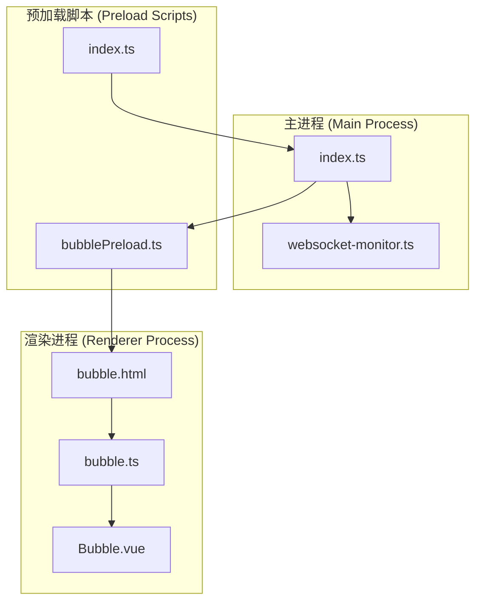
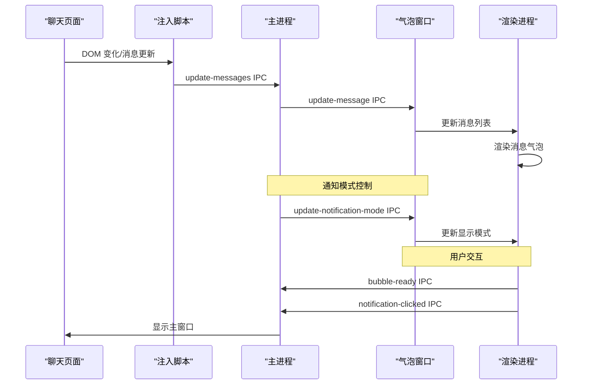
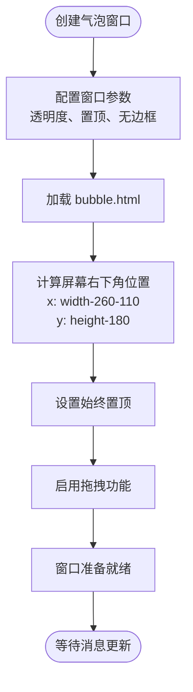
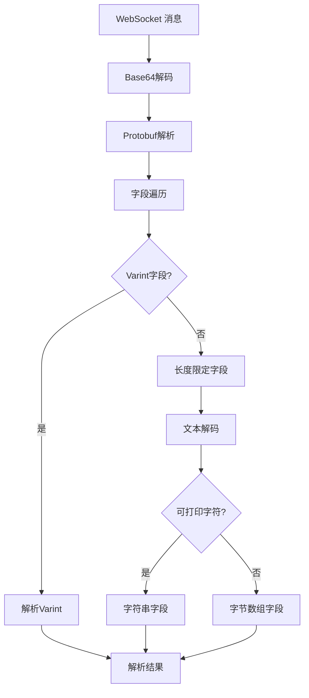
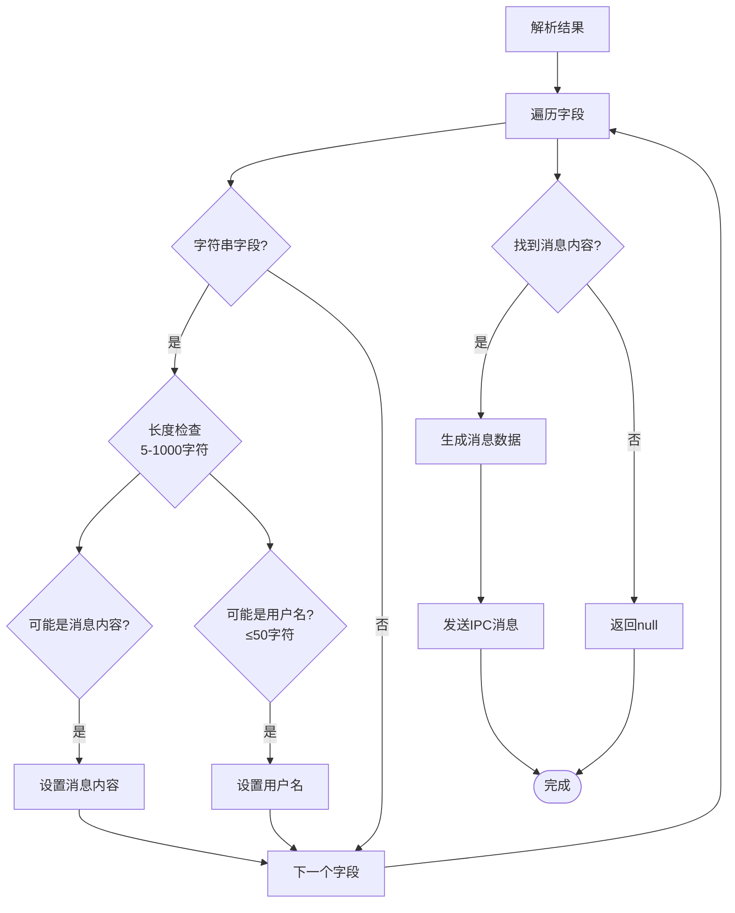
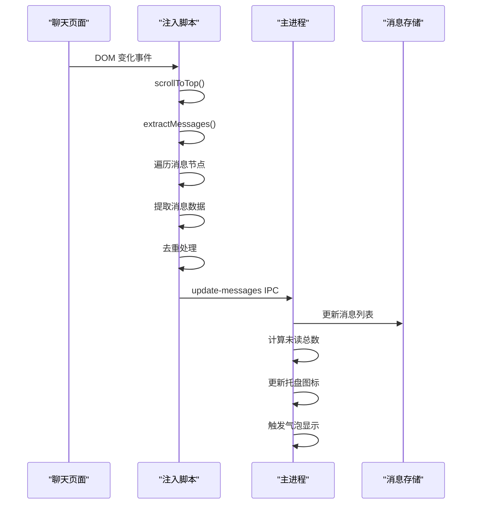
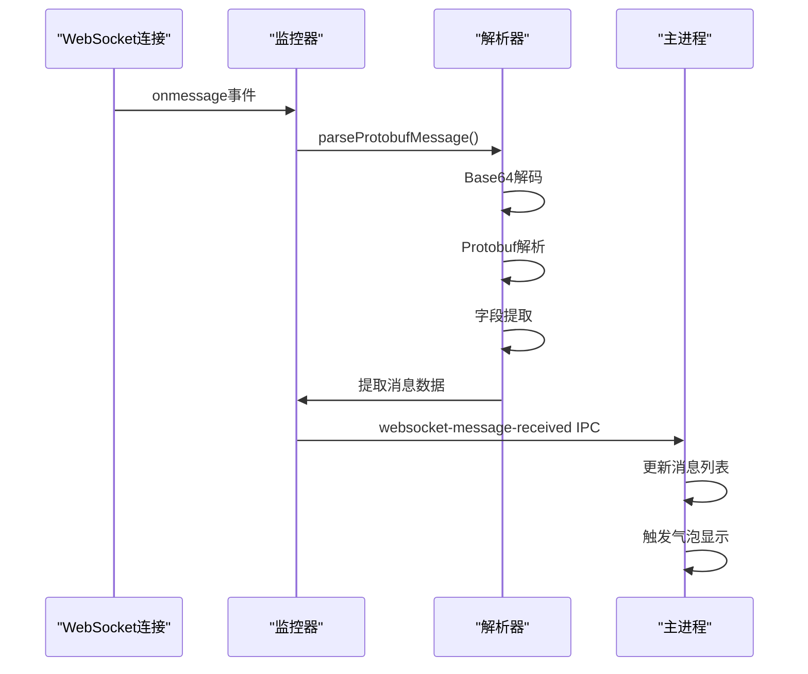
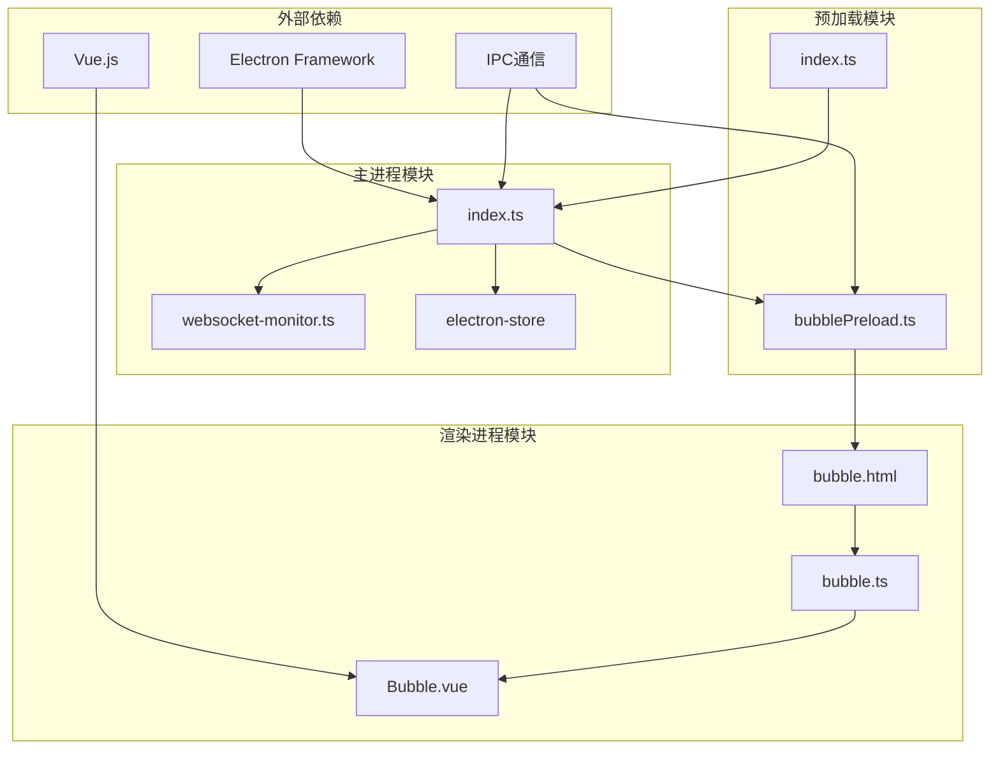

# 消息通知系统

<cite>
**本文档引用的文件**
- [src/main/websocket-monitor.ts](file://src/main/websocket-monitor.ts)
- [src/main/index.ts](file://src/main/index.ts)
- [src/preload/bubblePreload.ts](file://src/preload/bubblePreload.ts)
- [src/preload/index.ts](file://src/preload/index.ts)
- [src/renderer/src/bubble.ts](file://src/renderer/src/bubble.ts)
- [src/renderer/src/components/Bubble.vue](file://src/renderer/src/components/Bubble.vue)
- [src/renderer/bubble.html](file://src/renderer/bubble.html)
</cite>

## 目录
1. [简介](#简介)
2. [项目结构](#项目结构)
3. [核心组件](#核心组件)
4. [架构概览](#架构概览)
5. [详细组件分析](#详细组件分析)
6. [依赖关系分析](#依赖关系分析)
7. [性能考虑](#性能考虑)
8. [故障排除指南](#故障排除指南)
9. [结论](#结论)

## 简介

消息通知系统是一个基于 Electron 构建的桌面应用程序，提供实时消息通知功能。该系统实现了三种通知模式：常驻显示、显示4秒后消失和鼠标悬停显示。系统通过 WebSocket 监听机制捕获聊天消息，经过解析后在气泡窗口中展示，并支持用户交互操作。

## 项目结构

消息通知系统采用典型的 Electron 应用程序结构，主要分为三个部分：



**图表来源**
- [src/main/index.ts](file://src/main/index.ts#L1-L100)
- [src/preload/bubblePreload.ts](file://src/preload/bubblePreload.ts#L1-L70)
- [src/renderer/bubble.html](file://src/renderer/bubble.html#L1-L33)

**章节来源**
- [src/main/index.ts](file://src/main/index.ts#L1-L100)
- [src/preload/bubblePreload.ts](file://src/preload/bubblePreload.ts#L1-L70)
- [src/renderer/bubble.html](file://src/renderer/bubble.html#L1-L33)

## 核心组件

### 气泡窗口系统

气泡窗口是消息通知系统的核心组件，具有以下特性：
- 支持三种通知模式：常驻显示、显示4秒后消失、鼠标悬停显示
- 自动定位到屏幕右下角
- 支持拖拽移动
- 3秒自动隐藏功能
- 悬停控制机制

### WebSocket 监听器

系统提供了两种消息获取方式：
1. **DOM 节点监听**：通过注入脚本监听聊天页面的 DOM 变化
2. **WebSocket 监听**：可选的 WebSocket 消息拦截功能

### IPC 通信机制

主进程与渲染进程之间通过 IPC 进行双向通信，支持消息推送、状态同步和用户交互。

**章节来源**
- [src/main/index.ts](file://src/main/index.ts#L618-L764)
- [src/main/websocket-monitor.ts](file://src/main/websocket-monitor.ts#L4-L242)
- [src/preload/bubblePreload.ts](file://src/preload/bubblePreload.ts#L1-L70)

## 架构概览

消息通知系统采用分层架构设计，实现了清晰的职责分离：



**图表来源**
- [src/main/index.ts](file://src/main/index.ts#L1897-L1931)
- [src/main/index.ts](file://src/main/index.ts#L1731-L1750)
- [src/main/index.ts](file://src/main/index.ts#L1817-L1833)

## 详细组件分析

### 气泡窗口实现

#### 创建与定位逻辑

气泡窗口的创建过程包含以下关键步骤：



**图表来源**
- [src/main/index.ts](file://src/main/index.ts#L618-L764)

#### 显示与隐藏控制

系统实现了智能的显示控制机制：

```mermaid
stateDiagram-v2
[*] --> Hidden
Hidden --> Showing : showBubbleWindow()
Showing --> Visible : showInactive()
Visible --> Hiding : tryHideBubble()
Hiding --> Hidden : hide()
state Showing {
[*] --> UpdatingContent
UpdatingContent --> CalculatingHeight
CalculatingHeight --> ReloadingWindow
ReloadingWindow --> ReadyToShow
ReadyToShow --> [*]
}
state Visible {
Visible --> Hovering : mouseEnter
Hovering --> Visible : mouseLeave
Hovering --> Hiding : timeout
}
```

**图表来源**
- [src/main/index.ts](file://src/main/index.ts#L1971-L2045)
- [src/main/index.ts](file://src/main/index.ts#L1156-L1175)

#### 3秒自动隐藏机制

系统实现了精确的3秒自动隐藏功能：

```mermaid
flowchart TD
Show([显示气泡]) --> CheckMode{检查通知模式}
CheckMode --> |active| ShowPermanently[永久显示]
CheckMode --> |active-3s| StartTimer[启动3秒计时器]
CheckMode --> |immersive| WaitHover[等待悬停]
StartTimer --> TimerRunning[计时器运行中]
TimerRunning --> Timeout[3秒超时]
Timeout --> Hide[隐藏气泡]
ShowPermanently --> [*]
Hide --> [*]
WaitHover --> [*]
```

**图表来源**
- [src/main/index.ts](file://src/main/index.ts#L1947-L1969)

**章节来源**
- [src/main/index.ts](file://src/main/index.ts#L618-L764)
- [src/main/index.ts](file://src/main/index.ts#L1947-L2045)

### WebSocket 监听机制

#### 协议解析器

系统内置了 Protobuf 协议解析器，能够处理二进制 WebSocket 消息：



**图表来源**
- [src/main/websocket-monitor.ts](file://src/main/websocket-monitor.ts#L10-L96)

#### 消息提取逻辑

解析后的消息会经过智能提取过程：



**图表来源**
- [src/main/websocket-monitor.ts](file://src/main/websocket-monitor.ts#L125-L160)

**章节来源**
- [src/main/websocket-monitor.ts](file://src/main/websocket-monitor.ts#L1-L242)

### IPC 通信机制

#### 主进程到渲染进程

主进程通过以下 IPC 通道向气泡窗口发送消息：

| 事件名称 | 数据格式 | 描述 |
|---------|---------|------|
| update-message | any[] | 更新消息列表 |
| update-notification-mode | string | 更新通知模式 |
| clear-single-message | object | 清除单条消息 |
| clear-all-messages | void | 清除所有消息 |
| open-bubble-devtools | void | 打开开发者工具 |

#### 渲染进程到主进程

渲染进程通过以下 IPC 通道向主进程发送用户交互：

| 事件名称 | 数据格式 | 描述 |
|---------|---------|------|
| bubble-ready | void | 气泡窗口准备就绪 |
| bubble-mouse-enter | void | 鼠标进入气泡 |
| bubble-mouse-leave | void | 鼠标离开气泡 |
| notification-clicked | void | 点击通知 |
| clear-single-message | object | 清除单条消息 |
| clear-all-messages | void | 清除所有消息 |
| open-bubble-devtools | void | 打开开发者工具 |

**章节来源**
- [src/preload/bubblePreload.ts](file://src/preload/bubblePreload.ts#L1-L70)
- [src/main/index.ts](file://src/main/index.ts#L1897-L1931)

### 通知模式配置

系统支持三种通知模式，每种模式都有不同的行为特征：

#### 常驻显示模式 (active)
- 气泡窗口永久显示
- 不会自动隐藏
- 适合需要持续关注消息的场景

#### 显示4秒后消失模式 (active-3s)
- 气泡窗口显示4秒后自动隐藏
- 3秒计时器在鼠标悬停时会被清除
- 适合不需要持续关注但希望及时提醒的场景

#### 鼠标悬停显示模式 (immersive)
- 需要鼠标悬停在托盘图标上才显示
- 不会主动弹出
- 最小化对用户注意力的干扰

**章节来源**
- [src/main/index.ts](file://src/main/index.ts#L984-L1034)
- [src/main/index.ts](file://src/main/index.ts#L1947-L1969)

### 消息处理流程

#### DOM 节点监听流程

系统通过注入脚本监听聊天页面的 DOM 变化：



**图表来源**
- [src/main/index.ts](file://src/main/index.ts#L1474-L1535)
- [src/main/index.ts](file://src/main/index.ts#L1537-L1590)

#### WebSocket 监听流程

可选的 WebSocket 监听流程：



**图表来源**
- [src/main/websocket-monitor.ts](file://src/main/websocket-monitor.ts#L162-L210)

**章节来源**
- [src/main/index.ts](file://src/main/index.ts#L1474-L1590)
- [src/main/websocket-monitor.ts](file://src/main/websocket-monitor.ts#L162-L210)

## 依赖关系分析

消息通知系统的主要依赖关系如下：



**图表来源**
- [src/main/index.ts](file://src/main/index.ts#L1-L27)
- [src/preload/bubblePreload.ts](file://src/preload/bubblePreload.ts#L1-L70)
- [src/renderer/bubble.html](file://src/renderer/bubble.html#L1-L33)

**章节来源**
- [src/main/index.ts](file://src/main/index.ts#L1-L27)
- [src/preload/bubblePreload.ts](file://src/preload/bubblePreload.ts#L1-L70)

## 性能考虑

### 内存管理

系统采用了多种内存管理策略：
- **消息列表限制**：最多保留10条消息，避免内存泄漏
- **定时器清理**：退出时清理所有定时器
- **窗口监听器清理**：退出时移除所有事件监听器

### 渲染性能优化

- **虚拟滚动**：使用 Vue Recycle Scroller 实现高效的消息列表渲染
- **条件渲染**：只在有消息时显示气泡窗口
- **延迟加载**：气泡窗口采用延迟显示策略

### 网络性能

- **去重机制**：避免重复推送相同消息
- **增量更新**：只更新变化的消息
- **防抖处理**：DOM 变化监听使用防抖机制

## 故障排除指南

### 常见问题及解决方案

#### 气泡窗口无法显示

**症状**：气泡窗口创建但不显示
**可能原因**：
1. 消息列表为空
2. 通知模式设置为沉浸式
3. 屏幕分辨率变化导致位置异常

**解决方法**：
```javascript
// 检查消息列表
console.log('Last messages:', lastMessages);

// 检查通知模式
console.log('Notification mode:', store.get('notificationMode'));

// 重置窗口位置
resetPositionBubbleWindow();
```

#### WebSocket 消息解析失败

**症状**：WebSocket 消息无法正确解析
**可能原因**：
1. Protobuf 格式变化
2. Base64 编码错误
3. 字符串编码问题

**解决方法**：
```javascript
// 检查解析结果
console.log('Parsed result:', result);

// 验证字段类型
Object.keys(parsed).forEach(key => {
    console.log(`${key}: ${typeof parsed[key]} = ${parsed[key]}`);
});

// 测试解析函数
testParseMessage();
```

#### IPC 通信异常

**症状**：消息无法在窗口间传递
**可能原因**：
1. 预加载脚本未正确注入
2. IPC 事件监听器缺失
3. 窗口生命周期问题

**解决方法**：
```javascript
// 检查预加载脚本
console.log('bubbleAPI available:', window.bubbleAPI);

// 检查 IPC 事件
console.log('Available IPC events:', ipcRenderer.listeners());

// 重新注册监听器
registerIPCListeners();
```

#### 性能问题

**症状**：应用响应缓慢或内存占用过高
**可能原因**：
1. 消息列表增长过快
2. DOM 监听器过多
3. 定时器泄漏

**解决方法**：
```javascript
// 清理消息列表
if (lastMessages.length > 10) {
    lastMessages = lastMessages.slice(0, 10);
}

// 清理定时器
cleanupTimers();

// 优化 DOM 监听
optimizeDOMObserver();
```

**章节来源**
- [src/main/index.ts](file://src/main/index.ts#L2091-L2147)
- [src/main/websocket-monitor.ts](file://src/main/websocket-monitor.ts#L212-L236)

## 结论

消息通知系统是一个功能完整、架构清晰的 Electron 应用程序。系统通过精心设计的组件分离和通信机制，实现了稳定可靠的消息通知功能。主要特点包括：

1. **灵活的通知模式**：支持三种不同的通知显示方式，满足不同用户需求
2. **智能的显示控制**：通过悬停检测和定时器机制实现精确的显示控制
3. **高效的 IPC 通信**：建立了可靠的主进程与渲染进程通信通道
4. **完善的错误处理**：包含全面的错误检测和恢复机制
5. **性能优化**：通过多种策略确保系统的高性能运行

该系统为类似的消息通知应用场景提供了良好的参考实现，其模块化的架构设计和清晰的职责分离使得系统易于维护和扩展。