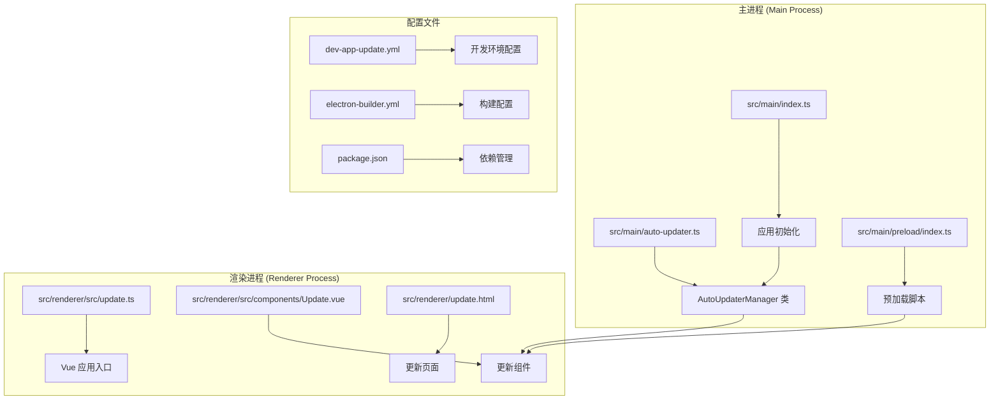
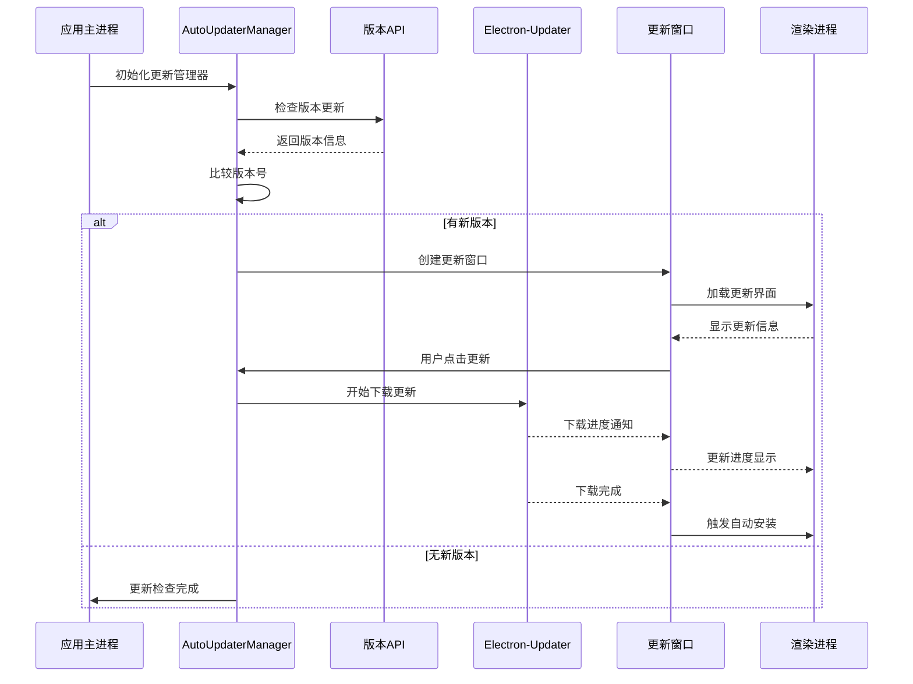
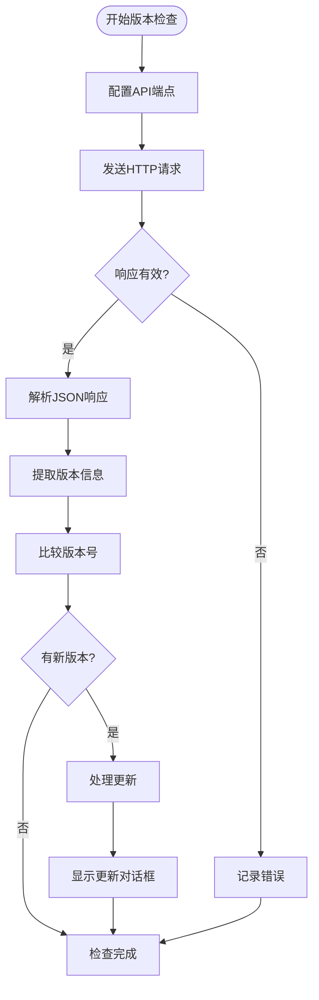
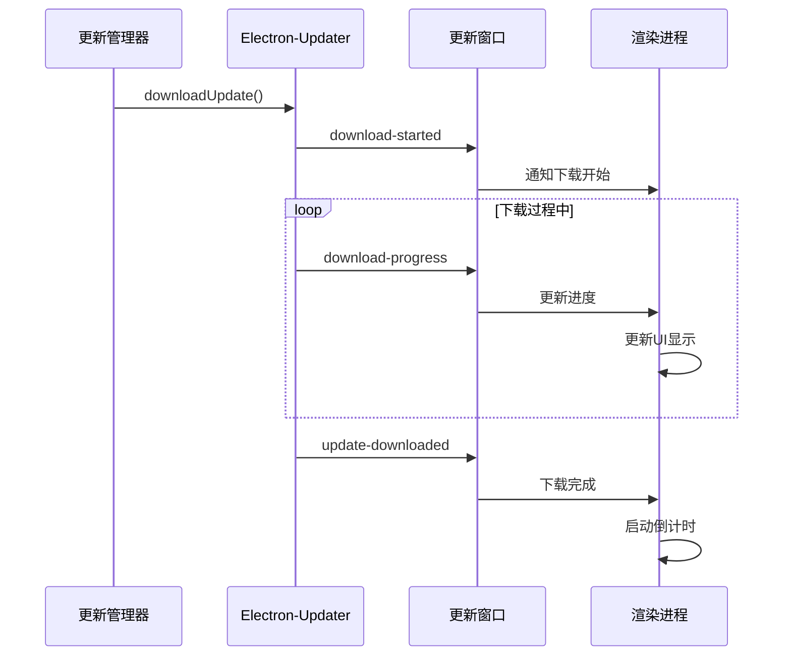
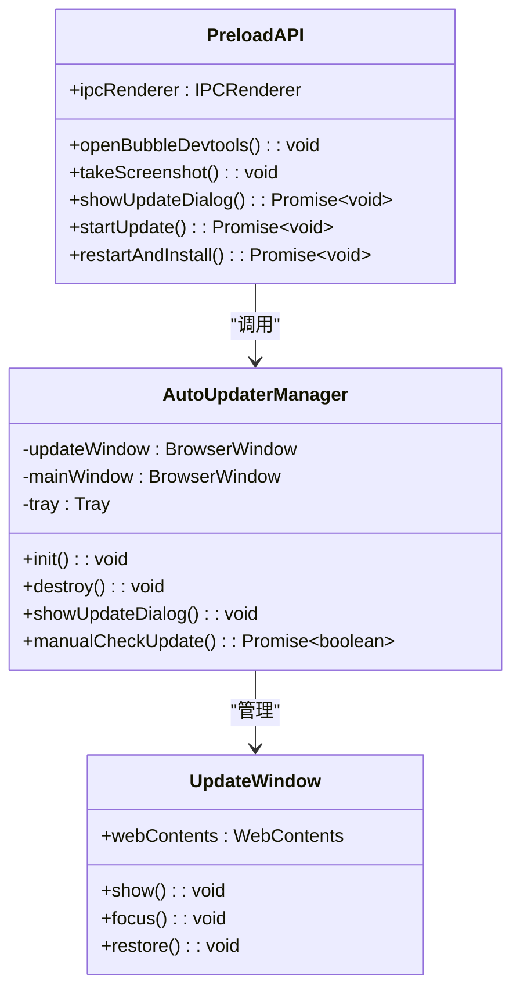
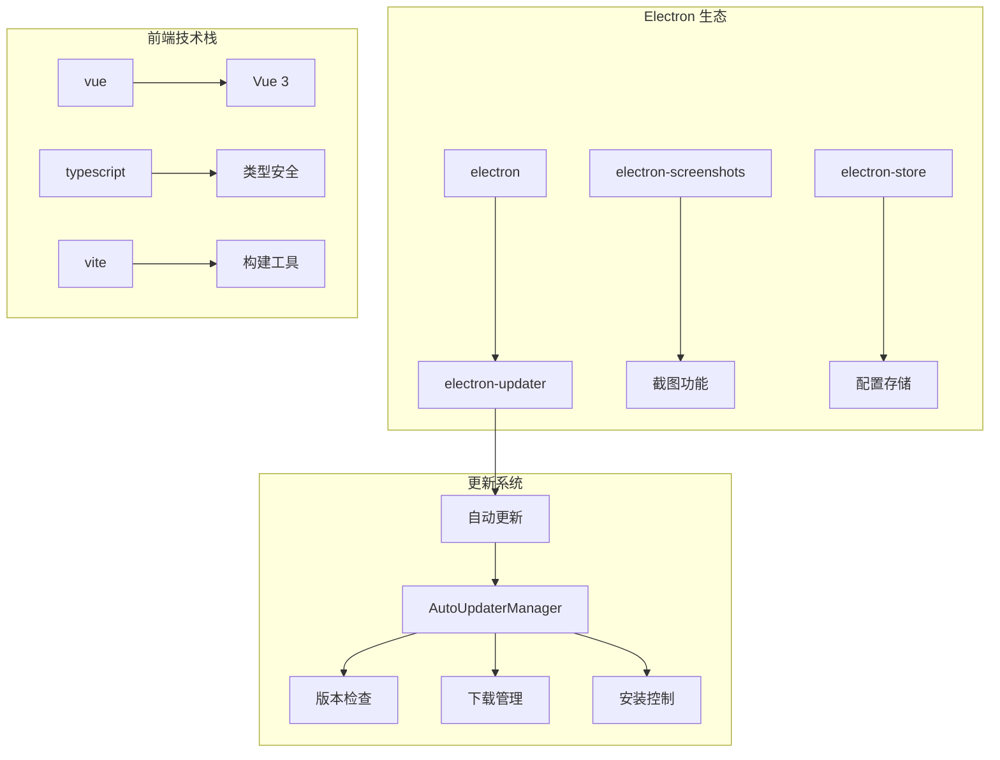

# 自动更新系统

<cite>
**本文档引用的文件**
- [src/main/auto-updater.ts](file://src/main/auto-updater.ts)
- [src/main/index.ts](file://src/main/index.ts)
- [src/preload/index.ts](file://src/preload/index.ts)
- [src/renderer/src/update.ts](file://src/renderer/src/update.ts)
- [src/renderer/src/components/Update.vue](file://src/renderer/src/components/Update.vue)
- [src/renderer/update.html](file://src/renderer/update.html)
- [dev-app-update.yml](file://dev-app-update.yml)
- [electron-builder.yml](file://electron-builder.yml)
- [package.json](file://package.json)
</cite>

## 目录
1. [简介](#简介)
2. [项目结构](#项目结构)
3. [核心组件](#核心组件)
4. [架构概览](#架构概览)
5. [详细组件分析](#详细组件分析)
6. [依赖关系分析](#依赖关系分析)
7. [性能考虑](#性能考虑)
8. [故障排除指南](#故障排除指南)
9. [结论](#结论)

## 简介

WoaApp 自动更新系统是一个基于 Electron 和 Electron-Updater 的现代化更新解决方案。该系统提供了完整的版本检查、更新下载、安装和用户界面管理功能，支持多种更新策略和用户交互模式。

系统采用主进程-渲染进程分离的设计模式，通过 IPC 通信实现安全的数据交换，确保更新过程的可靠性和安全性。更新窗口采用独立的 BrowserWindow 实现，提供丰富的用户界面和交互体验。

## 项目结构

自动更新系统主要分布在以下目录结构中：

**图表来源**
- [src/main/auto-updater.ts](file://src/main/auto-updater.ts#L40-L565)
- [src/main/index.ts](file://src/main/index.ts#L100-L110)
- [src/preload/index.ts](file://src/preload/index.ts#L1-L63)

**章节来源**
- [src/main/auto-updater.ts](file://src/main/auto-updater.ts#L1-L565)
- [src/main/index.ts](file://src/main/index.ts#L100-L110)
- [src/preload/index.ts](file://src/preload/index.ts#L1-L63)

## 核心组件

### AutoUpdaterManager 类

AutoUpdaterManager 是整个更新系统的核心控制器，负责管理所有更新相关的操作。

#### 主要职责
- 版本检查和比较
- 更新下载和安装
- 用户界面管理
- IPC 通信处理
- 错误处理和日志记录

#### 关键特性
- 支持三种更新类型：强制更新、主动提醒、被动提醒
- 自动定时检查更新
- 独立的更新窗口管理
- 安全的文件下载和验证

**章节来源**
- [src/main/auto-updater.ts](file://src/main/auto-updater.ts#L40-L565)

### 更新窗口系统

更新窗口采用独立的 BrowserWindow 实现，具有以下特点：

#### 窗口配置
- 无边框设计，支持拖拽区域
- 固定尺寸：480x500像素
- 总是置顶显示
- 禁用最小化和最大化功能
- 启用上下文隔离和 Node.js 集成

#### 用户界面
- 响应式设计，适配不同屏幕尺寸
- 渐变色彩主题
- 动画效果和过渡效果
- 进度条显示下载状态
- 倒计时自动安装功能

**章节来源**
- [src/main/auto-updater.ts](file://src/main/auto-updater.ts#L298-L353)
- [src/renderer/src/components/Update.vue](file://src/renderer/src/components/Update.vue#L1-L616)

## 架构概览

系统采用分层架构设计，实现了清晰的职责分离：

**图表来源**
- [src/main/auto-updater.ts](file://src/main/auto-updater.ts#L188-L221)
- [src/main/auto-updater.ts](file://src/main/auto-updater.ts#L435-L473)
- [src/renderer/src/components/Update.vue](file://src/renderer/src/components/Update.vue#L140-L173)

## 详细组件分析

### 版本检查机制

#### API 集成
系统通过 HTTP 请求与版本管理 API 交互，支持开发和生产环境的不同配置：

**图表来源**
- [src/main/auto-updater.ts](file://src/main/auto-updater.ts#L224-L252)
- [src/main/auto-updater.ts](file://src/main/auto-updater.ts#L254-L270)

#### 版本比较算法
系统实现了智能的语义化版本比较算法：

**章节来源**
- [src/main/auto-updater.ts](file://src/main/auto-updater.ts#L254-L270)

### 更新下载流程

#### 下载策略
系统采用两阶段下载策略确保更新的完整性和安全性：

1. **首次下载**：下载 `latest.yml` 配置文件
2. **正式下载**：根据配置文件下载实际更新包

#### 进度监控
下载进度通过 IPC 事件实时传输到渲染进程：

**图表来源**
- [src/main/auto-updater.ts](file://src/main/auto-updater.ts#L435-L473)
- [src/main/auto-updater.ts](file://src/main/auto-updater.ts#L171-L185)

**章节来源**
- [src/main/auto-updater.ts](file://src/main/auto-updater.ts#L435-L543)

### 用户界面设计

#### 更新窗口组件
更新窗口采用现代化的 Vue.js 组件设计：

##### 视觉设计
- 渐变色彩主题：蓝色到紫色渐变
- 圆形徽章标识不同更新类型
- 动画效果：脉冲动画、旋转动画
- 响应式布局，适配不同屏幕尺寸

##### 交互功能
- 实时进度显示
- 倒计时自动安装
- 错误状态处理
- 强制更新保护

**章节来源**
- [src/renderer/src/components/Update.vue](file://src/renderer/src/components/Update.vue#L1-L616)

### IPC 通信机制

#### 预加载脚本
预加载脚本通过 `contextBridge` API 暴露安全的 API 给渲染进程：

**图表来源**
- [src/preload/index.ts](file://src/preload/index.ts#L17-L43)
- [src/main/auto-updater.ts](file://src/main/auto-updater.ts#L40-L57)

**章节来源**
- [src/preload/index.ts](file://src/preload/index.ts#L1-L63)

## 依赖关系分析

### 核心依赖

系统依赖以下关键模块：

**图表来源**
- [package.json](file://package.json#L25-L33)
- [src/main/auto-updater.ts](file://src/main/auto-updater.ts#L1-L10)

### 配置文件分析

#### 开发环境配置
开发环境使用本地 API 和更新服务器：

**章节来源**
- [dev-app-update.yml](file://dev-app-update.yml#L1-L4)
- [electron-builder.yml](file://electron-builder.yml#L48-L53)

## 性能考虑

### 网络优化

系统实现了多项网络优化策略：

1. **连接复用**：使用 HTTP/HTTPS 模块复用连接
2. **超时控制**：设置合理的请求超时时间
3. **错误重试**：实现智能的错误重试机制
4. **进度缓存**：避免频繁的 UI 更新

### 内存管理

1. **窗口生命周期管理**：及时销毁不再使用的窗口
2. **事件监听器清理**：组件卸载时移除所有监听器
3. **定时器管理**：停止所有活动的定时器
4. **文件句柄清理**：正确关闭文件流和网络连接

### 用户体验优化

1. **异步操作**：所有网络操作都是异步执行
2. **进度反馈**：实时显示下载进度和状态
3. **错误处理**：友好的错误提示和恢复选项
4. **离线支持**：在网络异常时提供降级方案

## 故障排除指南

### 常见问题及解决方案

#### 版本检查失败
**症状**：无法获取最新的版本信息
**可能原因**：
- API 服务器不可达
- 网络连接问题
- 认证失败

**解决步骤**：
1. 检查网络连接状态
2. 验证 API 端点可达性
3. 查看控制台错误日志
4. 确认应用权限设置

#### 下载中断
**症状**：下载过程中断
**可能原因**：
- 网络不稳定
- 服务器响应超时
- 磁盘空间不足

**解决步骤**：
1. 检查磁盘空间
2. 重新启动下载
3. 检查防火墙设置
4. 尝试不同的网络环境

#### 安装失败
**症状**：更新包无法安装
**可能原因**：
- 权限不足
- 文件损坏
- 系统兼容性问题

**解决步骤**：
1. 以管理员权限运行
2. 手动删除临时文件
3. 重新下载更新包
4. 检查系统兼容性

### 调试技巧

1. **启用详细日志**：在开发模式下查看详细的控制台输出
2. **检查 IPC 通信**：验证主进程和渲染进程之间的通信
3. **监控资源使用**：观察内存和 CPU 使用情况
4. **测试不同场景**：模拟各种网络和系统条件

**章节来源**
- [src/main/auto-updater.ts](file://src/main/auto-updater.ts#L167-L185)
- [src/renderer/src/components/Update.vue](file://src/renderer/src/components/Update.vue#L260-L266)

## 结论

WoaApp 自动更新系统是一个功能完整、设计合理的现代化更新解决方案。系统采用了最佳实践的设计模式，实现了：

1. **模块化设计**：清晰的职责分离和组件化架构
2. **安全性保障**：严格的 IPC 通信和权限控制
3. **用户体验优化**：直观的界面设计和流畅的交互体验
4. **可靠性保证**：完善的错误处理和故障恢复机制
5. **性能优化**：高效的网络通信和资源管理

该系统为 Electron 应用的自动更新需求提供了完整的解决方案，既满足了开发者的功能需求，也为最终用户提供了优质的使用体验。通过持续的维护和优化，该系统能够适应不断变化的技术环境和用户需求。