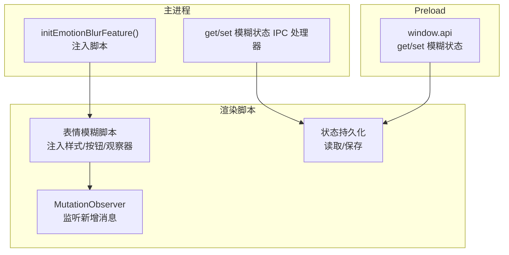
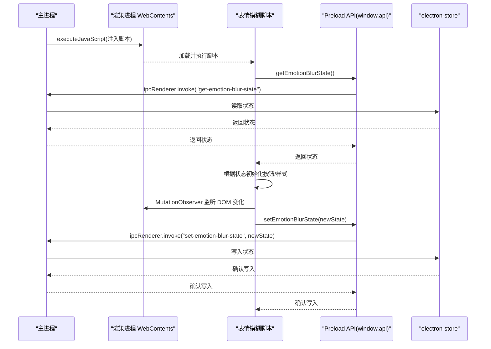
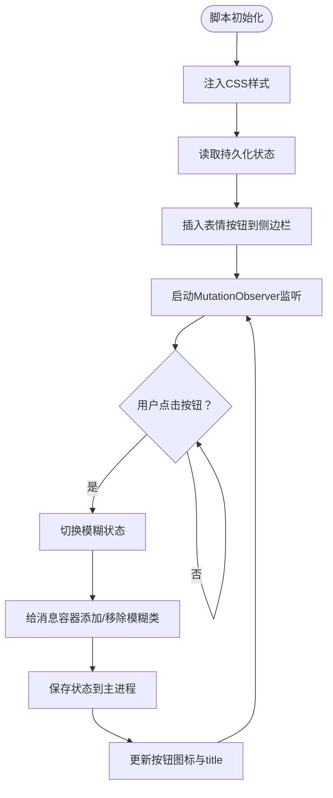
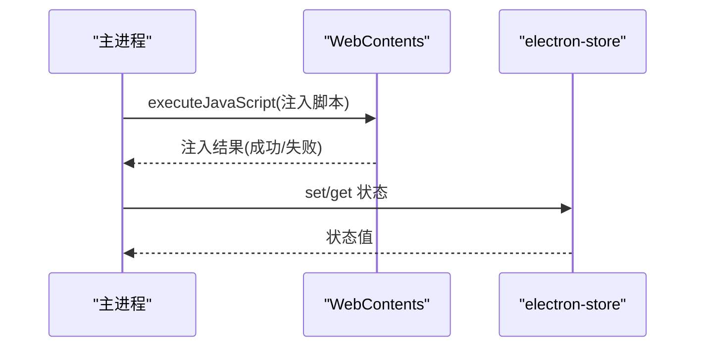
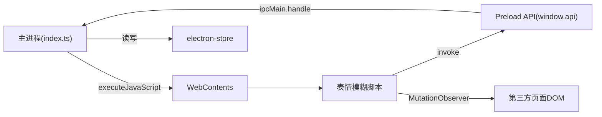

# 隐私保护功能

<cite>
**本文档引用的文件**
- [emotion-blur-script.ts](file://src/main/emotion-blur-script.ts)
- [index.ts（主进程）](file://src/main/index.ts)
- [index.ts（preload）](file://src/preload/index.ts)
- [index.d.ts（preload 类型声明）](file://src/preload/index.d.ts)
- [EMOTION_BLUR_FEATURE.md](file://EMOTION_BLUR_FEATURE.md)
- [EMOTION_BLUR_USAGE.md](file://EMOTION_BLUR_USAGE.md)
</cite>

## 目录
1. [简介](#简介)
2. [项目结构](#项目结构)
3. [核心组件](#核心组件)
4. [架构总览](#架构总览)
5. [详细组件分析](#详细组件分析)
6. [依赖关系分析](#依赖关系分析)
7. [性能考量](#性能考量)
8. [故障排查指南](#故障排查指南)
9. [结论](#结论)
10. [附录](#附录)

## 简介
本功能为第三方网页聊天界面提供“隐私保护”能力：通过在侧边栏插入一个表情按钮，用户可一键切换聊天消息的模糊显示，从而在视觉层面对敏感内容进行遮蔽。该功能具备以下关键特性：
- 动态脚本注入：由主进程在合适的时机向渲染进程注入脚本。
- 状态持久化：通过 IPC 与主进程交互，将模糊状态保存到本地存储并在页面刷新后恢复。
- 实时更新：使用 MutationObserver 监听 DOM 变化，自动对新增消息应用或移除模糊效果。
- 可视化交互：按钮图标随状态变化，提供直观的视觉反馈。

## 项目结构
隐私保护功能涉及三个层次：
- 主进程：负责注入脚本、注册 IPC 处理器、维护状态持久化。
- Preload：向渲染进程暴露受限 API，封装 IPC 调用。
- 渲染脚本：在第三方页面中执行，负责 UI 按钮创建、样式注入、状态切换与 DOM 观察。

图表来源
- [index.ts（主进程）](file://src/main/index.ts#L1398-L1416)
- [emotion-blur-script.ts](file://src/main/emotion-blur-script.ts#L6-L281)
- [index.ts（preload）](file://src/preload/index.ts#L17-L43)

章节来源
- [index.ts（主进程）](file://src/main/index.ts#L150-L173)
- [index.ts（主进程）](file://src/main/index.ts#L1398-L1416)
- [index.ts（preload）](file://src/preload/index.ts#L1-L63)
- [index.d.ts（preload 类型声明）](file://src/preload/index.d.ts#L1-L23)
- [emotion-blur-script.ts](file://src/main/emotion-blur-script.ts#L6-L281)

## 核心组件
- 表情模糊注入脚本：封装了按钮创建、样式注入、状态切换、DOM 观察与调试接口。
- 主进程注入器：在合适时机调用 webContents.executeJavaScript 注入脚本。
- IPC 处理器：提供 get/set 模糊状态接口，配合 electron-store 实现持久化。
- Preload API：在渲染进程中暴露 window.api，统一调用入口。

章节来源
- [emotion-blur-script.ts](file://src/main/emotion-blur-script.ts#L6-L281)
- [index.ts（主进程）](file://src/main/index.ts#L1398-L1416)
- [index.ts（主进程）](file://src/main/index.ts#L1390-L1396)
- [index.ts（preload）](file://src/preload/index.ts#L17-L43)

## 架构总览
整体交互流程如下：

图表来源
- [index.ts（主进程）](file://src/main/index.ts#L1390-L1396)
- [index.ts（主进程）](file://src/main/index.ts#L1398-L1416)
- [emotion-blur-script.ts](file://src/main/emotion-blur-script.ts#L14-L30)
- [index.ts（preload）](file://src/preload/index.ts#L35-L42)

## 详细组件分析

### 组件A：表情模糊注入脚本（渲染进程）
职责与实现要点：
- 状态管理：维护 isBlurred 标志位与按钮元素引用；通过 window.api 读取/保存状态。
- 样式注入：在 document.head 注入 CSS 类，定义模糊效果与按钮样式。
- 按钮创建：生成表情按钮，绑定悬停与点击事件；点击切换模糊状态。
- 目标识别：基于父容器类选择器批量定位消息容器，避免逐条遍历 DOM。
- 实时更新：使用 MutationObserver 监听聊天容器的新增节点，自动应用模糊类。
- 初始化策略：等待页面加载完成或稍作延时，确保目标元素存在；若侧边栏未就绪则定时重试。
- 调试接口：暴露全局函数便于控制台调试。

图表来源
- [emotion-blur-script.ts](file://src/main/emotion-blur-script.ts#L56-L91)
- [emotion-blur-script.ts](file://src/main/emotion-blur-script.ts#L94-L119)
- [emotion-blur-script.ts](file://src/main/emotion-blur-script.ts#L122-L164)
- [emotion-blur-script.ts](file://src/main/emotion-blur-script.ts#L167-L210)
- [emotion-blur-script.ts](file://src/main/emotion-blur-script.ts#L242-L278)

章节来源
- [emotion-blur-script.ts](file://src/main/emotion-blur-script.ts#L6-L281)

### 组件B：主进程注入器与 IPC 处理器
职责与实现要点：
- 注入时机：在页面导航到目标地址后，延时等待页面稳定再注入脚本。
- 注入方式：通过 webContents.executeJavaScript 注入字符串化的脚本。
- IPC 处理器：提供 get/set 模糊状态接口，内部使用 electron-store 读写状态。
- 错误处理：注入失败与状态读写异常均有日志输出，便于排查。

图表来源
- [index.ts（主进程）](file://src/main/index.ts#L1398-L1416)
- [index.ts（主进程）](file://src/main/index.ts#L1390-L1396)

章节来源
- [index.ts（主进程）](file://src/main/index.ts#L150-L173)
- [index.ts（主进程）](file://src/main/index.ts#L1390-L1396)
- [index.ts（主进程）](file://src/main/index.ts#L1398-L1416)

### 组件C：Preload API（渲染进程受限 API）
职责与实现要点：
- 暴露 window.api：包含 get/set 模糊状态等方法，封装 ipcRenderer.invoke。
- 类型声明：index.d.ts 提供 TS 类型定义，保证调用安全。
- 作用域隔离：在启用上下文隔离时通过 contextBridge 暴露，否则直接挂载到 window。

章节来源
- [index.ts（preload）](file://src/preload/index.ts#L17-L43)
- [index.d.ts（preload 类型声明）](file://src/preload/index.d.ts#L1-L23)

### 组件D：状态持久化与恢复
- 持久化机制：每次切换状态时调用 window.api.setEmotionBlurState，主进程写入 electron-store。
- 恢复机制：脚本初始化时调用 window.api.getEmotionBlurState，若返回 true 则延迟触发模糊。
- 容错处理：读取失败默认非模糊状态，避免阻塞初始化。

章节来源
- [emotion-blur-script.ts](file://src/main/emotion-blur-script.ts#L14-L30)
- [index.ts（主进程）](file://src/main/index.ts#L1390-L1396)
- [EMOTION_BLUR_USAGE.md](file://EMOTION_BLUR_USAGE.md#L39-L48)

### 组件E：目标元素识别与样式应用
- 目标元素：通过父容器类选择器批量定位消息容器，避免逐条匹配 DOM。
- 样式策略：使用 CSS 类控制模糊与过渡动画，减少内联样式的频繁变更。
- 动态支持：MutationObserver 自动处理新增消息，继承当前模糊状态。

章节来源
- [emotion-blur-script.ts](file://src/main/emotion-blur-script.ts#L125-L133)
- [emotion-blur-script.ts](file://src/main/emotion-blur-script.ts#L186-L193)
- [emotion-blur-script.ts](file://src/main/emotion-blur-script.ts#L56-L91)

## 依赖关系分析
- 主进程依赖 electron-store 进行状态持久化。
- 渲染脚本依赖 preload 暴露的 window.api 进行 IPC 调用。
- 脚本与页面 DOM 强耦合：依赖第三方页面的特定类名结构。
- 脚本与 MutationObserver：用于监听 DOM 变化，实现动态更新。

图表来源
- [index.ts（主进程）](file://src/main/index.ts#L1398-L1416)
- [emotion-blur-script.ts](file://src/main/emotion-blur-script.ts#L14-L30)
- [index.ts（preload）](file://src/preload/index.ts#L35-L42)

章节来源
- [index.ts（主进程）](file://src/main/index.ts#L1390-L1396)
- [index.ts（preload）](file://src/preload/index.ts#L17-L43)
- [emotion-blur-script.ts](file://src/main/emotion-blur-script.ts#L167-L210)

## 性能考量
- 选择器优化：使用父容器类批量选择消息容器，避免逐条 DOM 操作，降低主线程压力。
- 观察器策略：MutationObserver 在 isBlurred 为真时才处理新增节点，减少不必要的遍历。
- 过渡动画：CSS 过渡时间短，视觉反馈即时且开销低。
- 注入时机：主进程在页面导航后延时注入，避免与页面渲染竞争资源。
- 可能的性能影响：MutationObserver 在高频消息场景下仍有一定开销，可通过节流或减少监听范围进一步优化。

章节来源
- [EMOTION_BLUR_USAGE.md](file://EMOTION_BLUR_USAGE.md#L20-L24)
- [emotion-blur-script.ts](file://src/main/emotion-blur-script.ts#L167-L210)

## 故障排查指南
常见问题与解决思路：
- 按钮未出现
  - 检查控制台日志中是否出现“侧边栏未找到”的提示。
  - 确认第三方页面是否存在侧边栏容器，脚本会在未找到时定时重试。
- 模糊效果无效
  - 检查控制台日志中的消息容器数量，确认选择器是否匹配。
  - 检查是否存在更高优先级的 CSS 规则覆盖。
- 新消息未模糊
  - 确认 MutationObserver 是否启动，检查相关日志。
  - 检查聊天容器选择器是否正确。
- 状态不持久化
  - 检查 window.api.getEmotionBlurState 的调用是否成功。
  - 查看主进程日志确认 electron-store 读写是否正常。
- 调试接口
  - 控制台可使用全局函数查看状态与容器集合，辅助定位问题。

章节来源
- [EMOTION_BLUR_FEATURE.md](file://EMOTION_BLUR_FEATURE.md#L74-L90)
- [EMOTION_BLUR_USAGE.md](file://EMOTION_BLUR_USAGE.md#L163-L200)

## 结论
隐私保护功能通过“脚本注入 + 状态持久化 + 实时更新”的组合，实现了对第三方聊天界面的轻量级隐私保护。其优势在于：
- 低侵入：仅注入必要脚本，不修改页面结构。
- 即时生效：按钮即插即用，切换即时反馈。
- 智能适配：自动监听新增消息，无需手动刷新。
- 可扩展：具备良好的模块化基础，便于后续增强。

## 附录

### 配置选项与开关控制
- 开关控制
  - 通过表情按钮点击切换模糊状态。
  - 状态由 window.api 与主进程 IPC 协同维护，支持持久化。
- 预加载脚本
  - preload 暴露 window.api，统一渲染进程调用入口。
- 脚本注入时机
  - 主进程在页面导航完成后延时注入，确保 DOM 就绪。
- 与主页面交互
  - 仅在第三方页面中插入按钮与样式，不干扰原生页面逻辑。

章节来源
- [index.ts（preload）](file://src/preload/index.ts#L17-L43)
- [index.ts（主进程）](file://src/main/index.ts#L150-L173)
- [emotion-blur-script.ts](file://src/main/emotion-blur-script.ts#L242-L278)

### 性能影响评估
- 选择器与批量处理：显著降低 DOM 操作次数。
- 观察器策略：仅在模糊状态下监听，减少无效扫描。
- 动画与样式：CSS 过渡开销极小，适合高频切换。
- 建议：在极端高并发场景下，可考虑对观察器回调进行节流或按需启用。

章节来源
- [EMOTION_BLUR_USAGE.md](file://EMOTION_BLUR_USAGE.md#L20-L24)
- [emotion-blur-script.ts](file://src/main/emotion-blur-script.ts#L167-L210)

### 兼容性说明
- 浏览器要求：依赖现代浏览器的 CSS filter 与 MutationObserver。
- 页面结构：依赖第三方页面的特定类名结构，若页面结构调整需同步更新选择器。
- 上下文隔离：preload 在启用上下文隔离时通过 contextBridge 暴露 API，确保安全。

章节来源
- [EMOTION_BLUR_FEATURE.md](file://EMOTION_BLUR_FEATURE.md#L103-L108)
- [index.ts（主进程）](file://src/main/index.ts#L286-L301)

### 功能扩展可能性
- 快捷键支持：在脚本中监听键盘事件，提供快捷键切换。
- 自定义模糊强度：通过 CSS 变量或参数化模糊半径，允许用户调节强度。
- 白名单策略：支持对特定联系人/群组的消息不应用模糊。
- 记忆状态：结合用户偏好，自动在进入聊天页时恢复上次状态。
- 多主题图标：根据系统主题或用户偏好切换按钮图标风格。

章节来源
- [EMOTION_BLUR_FEATURE.md](file://EMOTION_BLUR_FEATURE.md#L110-L116)
- [EMOTION_BLUR_USAGE.md](file://EMOTION_BLUR_USAGE.md#L201-L219)