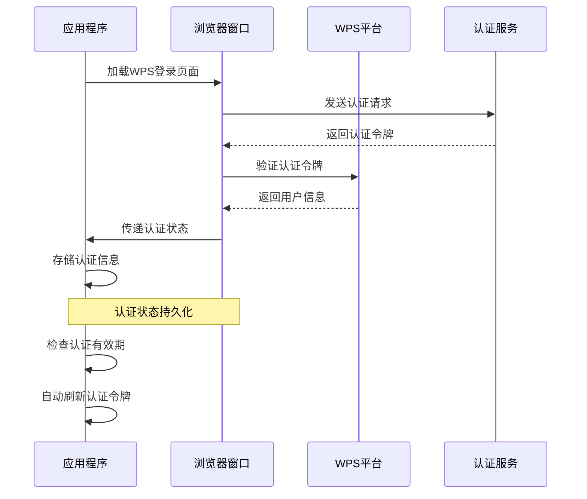

# WPS云办公API集成

<cite>
**本文档引用的文件**
- [src/main/index.ts](file://src/main/index.ts)
- [src/main/getDepartMent.ts](file://src/main/getDepartMent.ts)
- [src/main/report.ts](file://src/main/report.ts)
- [src/main/websocket-monitor.ts](file://src/main/websocket-monitor.ts)
- [src/preload/index.ts](file://src/preload/index.ts)
- [src/preload/bubblePreload.ts](file://src/preload/bubblePreload.ts)
- [ARCHITECTURE.md](file://ARCHITECTURE.md)
- [README.md](file://README.md)
</cite>

## 目录
1. [简介](#简介)
2. [项目结构](#项目结构)
3. [核心组件](#核心组件)
4. [架构概览](#架构概览)
5. [详细组件分析](#详细组件分析)
6. [依赖关系分析](#依赖关系分析)
7. [性能考虑](#性能考虑)
8. [故障排除指南](#故障排除指南)
9. [结论](#结论)

## 简介

WPS云办公API集成功能是WoaApp项目的核心组成部分，负责实现与WPS云办公平台的深度集成。该系统通过Electron框架实现了桌面应用程序与WPS云办公平台的无缝连接，提供了完整的用户认证机制、会话管理、用户信息获取和缓存策略。

本系统的主要目标是：
- 实现WPS云办公平台的用户认证和会话管理
- 提供用户信息获取和缓存功能
- 支持WebSocket实时消息监听
- 实现用户行为上报机制
- 处理登录状态检查和Cookie管理
- 提供异常情况处理和错误恢复机制

## 项目结构

WoaApp采用典型的Electron多进程架构，主要分为三个核心层次：

**图表来源**
- [src/main/index.ts](file://src/main/index.ts#L1-L100)
- [src/preload/index.ts](file://src/preload/index.ts#L1-L63)
- [src/preload/bubblePreload.ts](file://src/preload/bubblePreload.ts#L1-L70)

**章节来源**
- [ARCHITECTURE.md](file://ARCHITECTURE.md#L18-L42)
- [README.md](file://README.md#L16-L42)

## 核心组件

### 会话管理组件

会话管理是WPS云办公集成的核心组件，负责维护用户登录状态和Cookie持久化：

**图表来源**
- [src/main/index.ts](file://src/main/index.ts#L239-L273)
- [src/main/index.ts](file://src/main/index.ts#L319-L324)

### 用户信息管理组件

用户信息管理组件负责从WPS平台获取和缓存用户信息：

**图表来源**
- [src/main/getDepartMent.ts](file://src/main/getDepartMent.ts#L6-L49)

**章节来源**
- [src/main/index.ts](file://src/main/index.ts#L239-L273)
- [src/main/getDepartMent.ts](file://src/main/getDepartMent.ts#L1-L50)

## 架构概览

WoaApp的WPS云办公API集成采用分层架构设计，确保了系统的可维护性和扩展性：

**图表来源**
- [ARCHITECTURE.md](file://ARCHITECTURE.md#L317-L343)
- [README.md](file://README.md#L317-L343)

### 登录状态检查流程

系统实现了智能的登录状态检查机制，能够自动检测用户的登录状态并进行相应的处理：

**图表来源**
- [src/main/index.ts](file://src/main/index.ts#L444-L528)
- [src/main/index.ts](file://src/main/index.ts#L239-L273)

**章节来源**
- [src/main/index.ts](file://src/main/index.ts#L444-L528)
- [src/main/index.ts](file://src/main/index.ts#L239-L273)

## 详细组件分析

### 用户认证机制

用户认证机制是WPS云办公集成的核心，实现了完整的OAuth2.0流程：

**图表来源**
- [src/main/index.ts](file://src/main/index.ts#L319-L324)
- [src/main/index.ts](file://src/main/index.ts#L496-L528)

### 会话管理策略

会话管理策略确保了用户登录状态的持久性和安全性：

| 策略类型 | 实现方式 | 作用范围 |
|---------|----------|----------|
| Cookie持久化 | 监听Cookie变更事件 | 跨会话保持登录状态 |
| 会话分区 | 使用持久化分区'persist:woachat' | 隔离不同会话数据 |
| 权限管理 | 允许所有权限请求 | 放宽安全限制以确保功能完整性 |
| 证书验证 | 接受所有证书 | 开发环境简化SSL处理 |

**章节来源**
- [src/main/index.ts](file://src/main/index.ts#L304-L338)

### 用户信息获取与缓存

用户信息获取与缓存机制提供了高效的数据访问策略：

**图表来源**
- [src/main/getDepartMent.ts](file://src/main/getDepartMent.ts#L12-L48)

**章节来源**
- [src/main/getDepartMent.ts](file://src/main/getDepartMent.ts#L6-L49)

### WebSocket消息监听

WebSocket消息监听功能实现了实时消息处理机制：

**图表来源**
- [src/main/websocket-monitor.ts](file://src/main/websocket-monitor.ts#L4-L242)

**章节来源**
- [src/main/websocket-monitor.ts](file://src/main/websocket-monitor.ts#L104-L160)

### 用户行为上报

用户行为上报功能提供了完整的用户活动追踪机制：

**图表来源**
- [src/main/report.ts](file://src/main/report.ts#L1-L3)

**章节来源**
- [src/main/report.ts](file://src/main/report.ts#L1-L3)

## 依赖关系分析

WPS云办公API集成功能涉及多个关键依赖关系：

**图表来源**
- [ARCHITECTURE.md](file://ARCHITECTURE.md#L45-L61)
- [README.md](file://README.md#L45-L61)

### 错误处理与异常情况

系统实现了多层次的错误处理机制：

| 错误类型 | 处理策略 | 恢复机制 |
|---------|----------|----------|
| 网络连接失败 | 切换备用URL | 重试机制 |
| 认证失败 | 清理Cookie | 重新登录 |
| WebSocket断开 | 自动重连 | 断线重连 |
| 数据解析错误 | 缓存降级 | 本地数据回退 |
| 窗口加载失败 | 显示错误页面 | 本地页面替代 |

**章节来源**
- [src/main/index.ts](file://src/main/index.ts#L531-L614)

## 性能考虑

### 网络性能优化

系统采用了多种网络性能优化策略：

1. **连接池管理**：复用HTTP连接，减少连接建立开销
2. **缓存策略**：智能缓存用户信息和配置数据
3. **压缩传输**：启用GZIP压缩减少数据传输量
4. **并发控制**：限制同时进行的网络请求数量

### 内存管理优化

### 渲染性能优化

系统通过以下方式优化渲染性能：
- 禁用背景节流以确保WebSocket消息实时性
- 使用showInactive避免气泡窗口抢夺焦点
- Vue组件按需加载减少初始渲染负担

## 故障排除指南

### 常见问题及解决方案

| 问题类型 | 症状描述 | 解决方案 |
|---------|----------|----------|
| 登录失败 | 无法访问WPS聊天页面 | 检查网络连接和Cookie状态 |
| 消息不显示 | WebSocket连接异常 | 重启WebSocket监听器 |
| 用户信息缺失 | 用户头像和姓名为空 | 清理缓存并重新获取信息 |
| 页面加载缓慢 | 网络请求超时 | 检查防火墙设置和代理配置 |
| 应用无响应 | 内存泄漏 | 重启应用并清理临时文件 |

### 调试工具和方法

系统提供了丰富的调试工具：
- 开发者工具：F12打开调试面板
- 日志系统：详细的控制台日志输出
- 状态监控：实时显示应用状态信息
- 网络监控：跟踪网络请求和响应

**章节来源**
- [src/main/index.ts](file://src/main/index.ts#L531-L614)

## 结论

WPS云办公API集成功能展现了现代桌面应用与云端服务集成的最佳实践。通过精心设计的架构和完善的错误处理机制，系统实现了稳定可靠的WPS云办公平台集成。

### 主要成就

1. **完整的认证流程**：实现了从登录到会话管理的完整闭环
2. **高效的缓存策略**：通过智能缓存提升了用户体验
3. **实时消息处理**：WebSocket监听确保消息的及时传递
4. **健壮的错误处理**：多层次的异常处理机制保证系统稳定性
5. **灵活的扩展架构**：模块化设计便于功能扩展和维护

### 未来改进方向

1. **安全加固**：重新评估当前的安全配置，启用更严格的安全策略
2. **性能监控**：添加性能指标收集和监控机制
3. **测试覆盖**：增加单元测试和集成测试
4. **文档完善**：补充详细的API文档和开发指南

该系统为WPS云办公平台的桌面应用集成提供了坚实的技术基础，支持未来功能的持续演进和扩展。