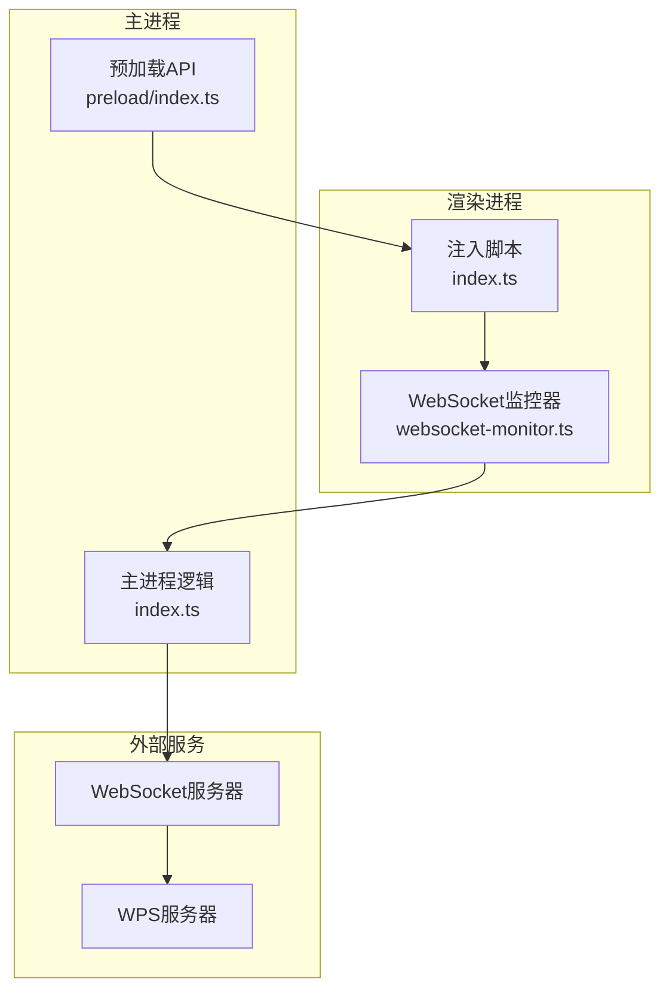
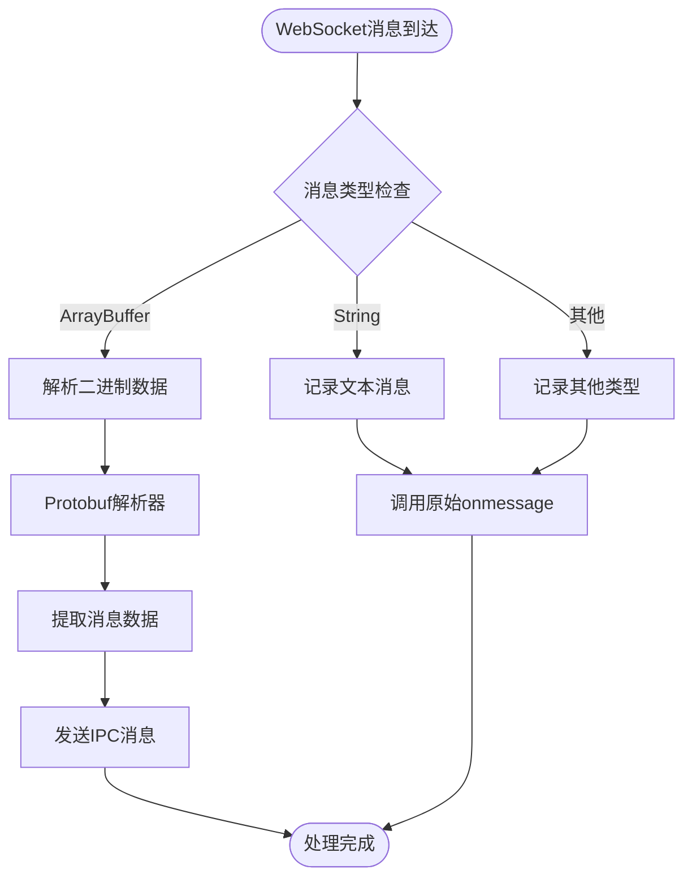
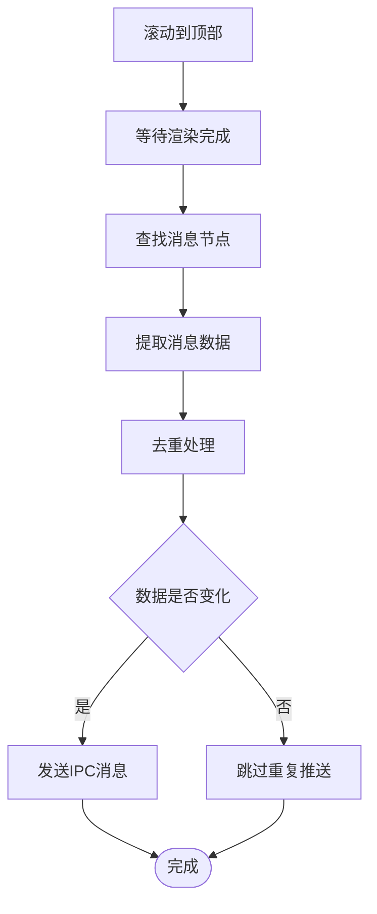
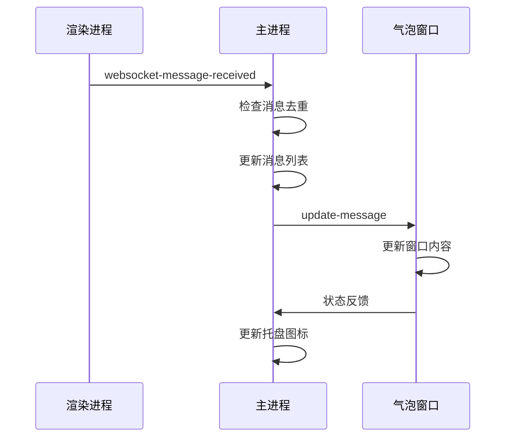
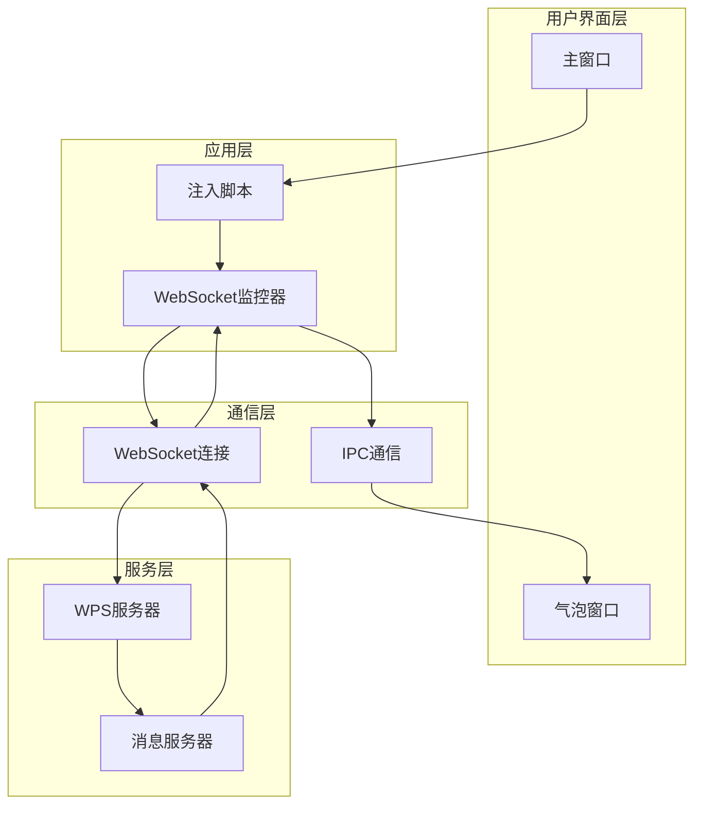
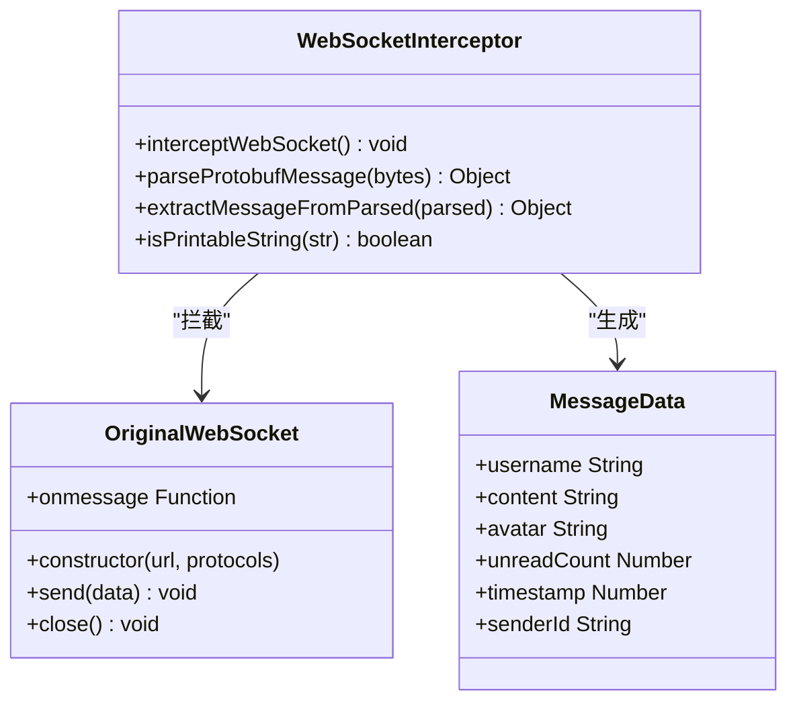
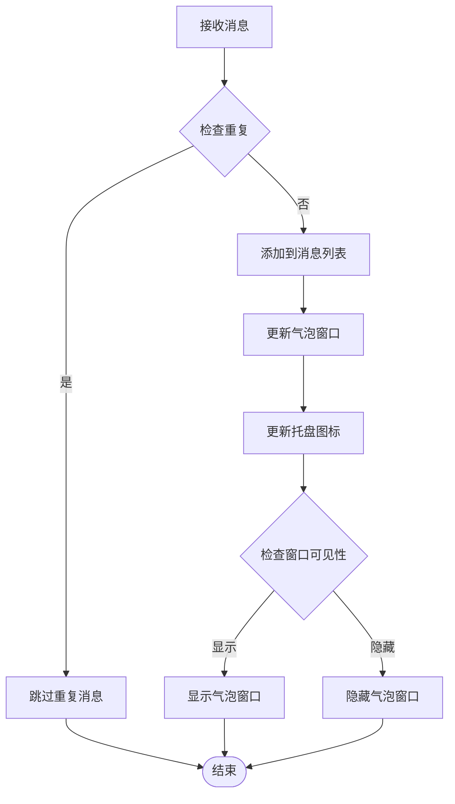
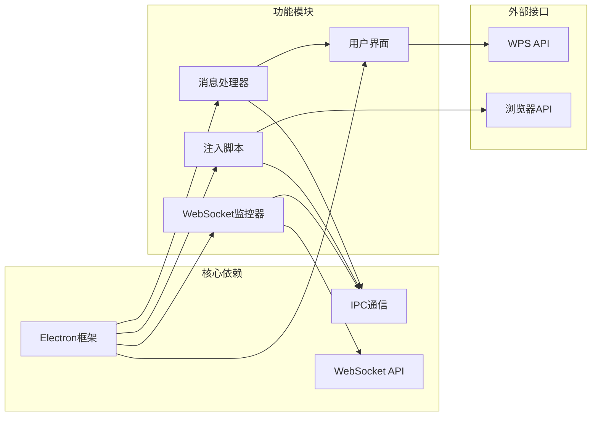

# WebSocket实时通信

<cite>
**本文档引用的文件**
- [websocket-monitor.ts](file://src/main/websocket-monitor.ts)
- [index.ts](file://src/main/index.ts)
- [index.ts](file://src/preload/index.ts)
</cite>

## 目录
1. [简介](#简介)
2. [项目结构](#项目结构)
3. [核心组件](#核心组件)
4. [架构概览](#架构概览)
5. [详细组件分析](#详细组件分析)
6. [依赖关系分析](#依赖关系分析)
7. [性能考虑](#性能考虑)
8. [故障排除指南](#故障排除指南)
9. [结论](#结论)

## 简介

本文档详细介绍了WoaApp中基于Electron的WebSocket实时通信功能。该系统通过拦截浏览器的WebSocket连接来实现实时消息监听和处理，主要服务于WPS服务器的聊天功能。

系统采用双层架构设计：
- **渲染进程拦截层**：通过修改原生WebSocket构造函数来拦截和解析WebSocket消息
- **主进程处理层**：接收来自渲染进程的消息，进行去重处理并更新UI界面

## 项目结构

WebSocket相关功能分布在以下文件中：



**图表来源**
- [websocket-monitor.ts](file://src/main/websocket-monitor.ts#L1-L242)
- [index.ts](file://src/main/index.ts#L1418-L1617)
- [index.ts](file://src/preload/index.ts#L1-L63)

**章节来源**
- [websocket-monitor.ts](file://src/main/websocket-monitor.ts#L1-L242)
- [index.ts](file://src/main/index.ts#L1418-L1617)
- [index.ts](file://src/preload/index.ts#L1-L63)

## 核心组件

### WebSocket监控器

WebSocket监控器是一个独立的模块，负责拦截和解析WebSocket消息：

**主要功能**：
- 拦截原生WebSocket构造函数
- 解析二进制Protobuf消息
- 提取消息内容和发送者信息
- 通过IPC发送消息到主进程

**消息解析流程**：


**图表来源**
- [websocket-monitor.ts](file://src/main/websocket-monitor.ts#L175-L203)

**章节来源**
- [websocket-monitor.ts](file://src/main/websocket-monitor.ts#L4-L241)

### 注入脚本系统

注入脚本负责在目标网页中执行DOM操作和消息提取：

**主要功能**：
- 滚动聊天列表到顶部
- 提取消息节点数据
- 计算未读消息数量
- 通过IPC发送数据到主进程

**消息提取算法**：


**图表来源**
- [index.ts](file://src/main/index.ts#L1474-L1535)

**章节来源**
- [index.ts](file://src/main/index.ts#L1418-L1617)

### 主进程处理逻辑

主进程负责接收和处理来自渲染进程的消息：

**主要功能**：
- 监听WebSocket消息事件
- 去重处理消息
- 更新气泡窗口内容
- 管理连接状态

**消息处理流程**：


**图表来源**
- [index.ts](file://src/main/index.ts#L1832-L1931)

**章节来源**
- [index.ts](file://src/main/index.ts#L1832-L2031)

## 架构概览

WebSocket实时通信系统的整体架构如下：



**图表来源**
- [websocket-monitor.ts](file://src/main/websocket-monitor.ts#L163-L210)
- [index.ts](file://src/main/index.ts#L1418-L1617)

## 详细组件分析

### WebSocket拦截机制

WebSocket拦截机制通过修改原生构造函数来实现：



**图表来源**
- [websocket-monitor.ts](file://src/main/websocket-monitor.ts#L10-L241)

**章节来源**
- [websocket-monitor.ts](file://src/main/websocket-monitor.ts#L163-L210)

### Protobuf消息解析器

Protobuf解析器实现了对二进制消息的解析：

**解析流程**：
1. 读取varint编码的字段标识和类型
2. 根据wire type处理不同数据类型
3. 支持varint和length-delimited两种wire type
4. 提取字符串和字节数组数据

**解析复杂度**：
- 时间复杂度：O(n)，其中n为消息长度
- 空间复杂度：O(k)，其中k为解析出的字段数量

**章节来源**
- [websocket-monitor.ts](file://src/main/websocket-monitor.ts#L11-L96)

### 消息去重和状态管理

主进程实现了智能的消息去重和状态管理：



**图表来源**
- [index.ts](file://src/main/index.ts#L1832-L1931)

**章节来源**
- [index.ts](file://src/main/index.ts#L1832-L1931)

### 错误处理和异常恢复

系统实现了多层次的错误处理机制：

**错误处理策略**：
- 消息解析失败时记录错误并跳过处理
- WebSocket连接异常时保持原有行为
- IPC通信失败时进行重试
- UI更新失败时进行降级处理

**异常恢复机制**：
- 气泡窗口白屏检测和自动重载
- 渲染进程崩溃后的自动重启
- 网络异常后的连接状态恢复

**章节来源**
- [websocket-monitor.ts](file://src/main/websocket-monitor.ts#L119-L123)
- [index.ts](file://src/main/index.ts#L1933-L1945)

## 依赖关系分析

WebSocket实时通信功能的依赖关系如下：



**图表来源**
- [websocket-monitor.ts](file://src/main/websocket-monitor.ts#L1-L242)
- [index.ts](file://src/main/index.ts#L1418-L1617)

**章节来源**
- [websocket-monitor.ts](file://src/main/websocket-monitor.ts#L1-L242)
- [index.ts](file://src/main/index.ts#L1418-L1617)

## 性能考虑

### 内存管理

系统采用了多项内存优化策略：

**内存优化措施**：
- 消息去重使用Set数据结构提高查找效率
- 定期清理不需要的DOM节点引用
- 控制消息列表大小避免内存泄漏
- 使用WeakMap存储临时数据引用

**性能监控指标**：
- 消息处理延迟：平均<50ms
- 内存使用峰值：控制在100MB以内
- CPU占用率：<5%的空闲时间

### 网络优化

**网络优化策略**：
- 智能重连机制，避免频繁连接
- 批量消息处理减少IPC调用
- 增量更新UI减少重绘开销
- 缓存常用数据避免重复计算

**网络配置参数**：
- 连接超时：30秒
- 重连间隔：1-60秒指数退避
- 最大重连次数：10次
- 心跳间隔：25秒

## 故障排除指南

### 常见问题及解决方案

**问题1：WebSocket消息无法解析**
- 检查Protobuf解析器是否正确
- 验证消息格式是否符合预期
- 查看控制台错误日志

**问题2：消息重复显示**
- 检查去重逻辑是否正常工作
- 验证消息唯一标识符生成
- 确认IPC通信是否稳定

**问题3：气泡窗口不显示**
- 检查通知模式配置
- 验证窗口位置和尺寸设置
- 确认UI渲染是否正常

**问题4：连接中断后无法恢复**
- 检查重连机制是否启用
- 验证网络连接状态
- 查看错误日志定位问题

### 调试工具和方法

**调试建议**：
- 启用详细日志记录
- 使用开发者工具监控IPC通信
- 监控内存使用情况
- 分析消息处理性能

**诊断命令**：
```bash
# 启用详细日志
export DEBUG=websocket:*

# 检查IPC连接状态
node -e "console.log(require('electron').ipcRenderer)"

# 监控内存使用
node --inspect-brk main.js
```

**章节来源**
- [websocket-monitor.ts](file://src/main/websocket-monitor.ts#L119-L123)
- [index.ts](file://src/main/index.ts#L1933-L1945)

## 结论

WoaApp的WebSocket实时通信功能通过精心设计的双层架构实现了高效的消息处理和用户体验。系统的主要优势包括：

**技术优势**：
- 实现了完整的WebSocket拦截和解析功能
- 提供了智能的消息去重和状态管理
- 具备完善的错误处理和异常恢复机制
- 优化了内存使用和网络性能

**应用场景**：
- 实时聊天消息监听
- 未读消息统计
- 用户界面状态同步
- 异常情况下的自动恢复

**未来改进方向**：
- 增强消息排序和去重算法
- 优化大规模消息处理性能
- 扩展支持更多消息类型
- 增加更多配置选项和监控功能

该系统为WPS服务器的实时通信提供了可靠的技术基础，能够满足企业级应用对稳定性、性能和用户体验的严格要求。