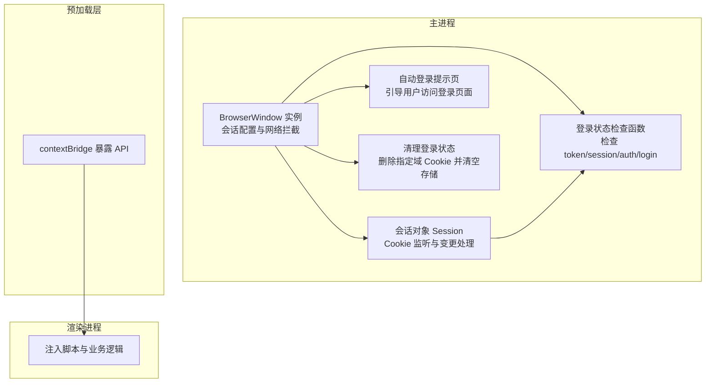
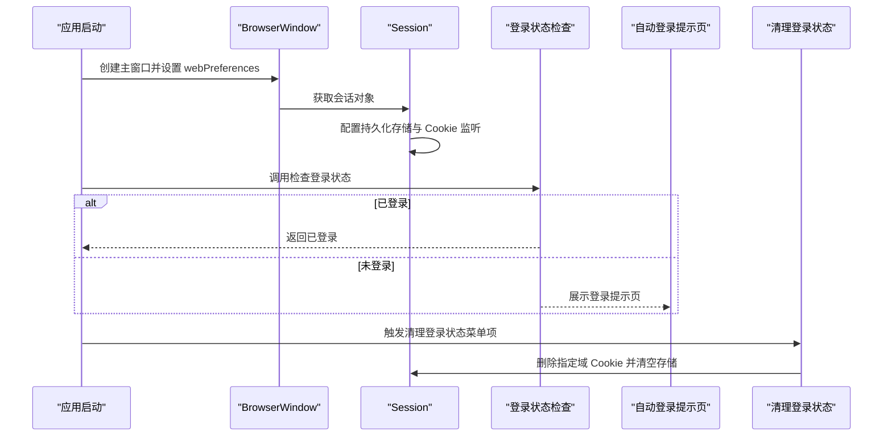
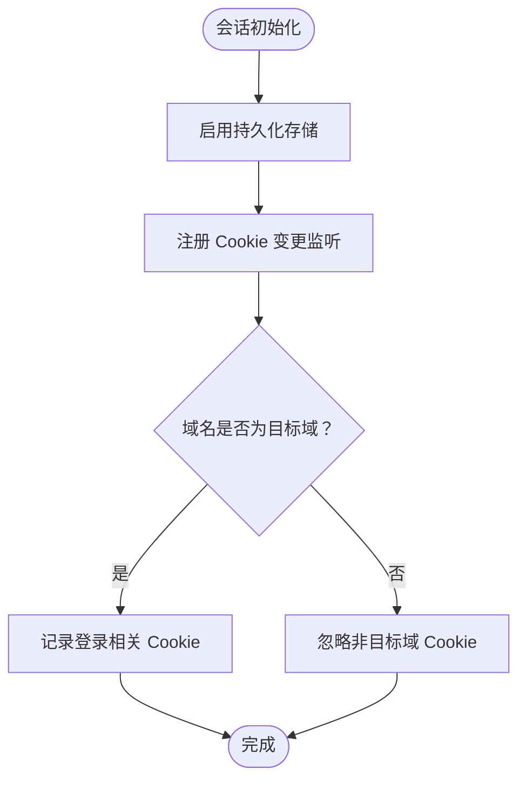
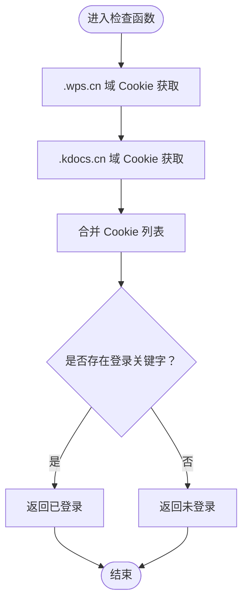
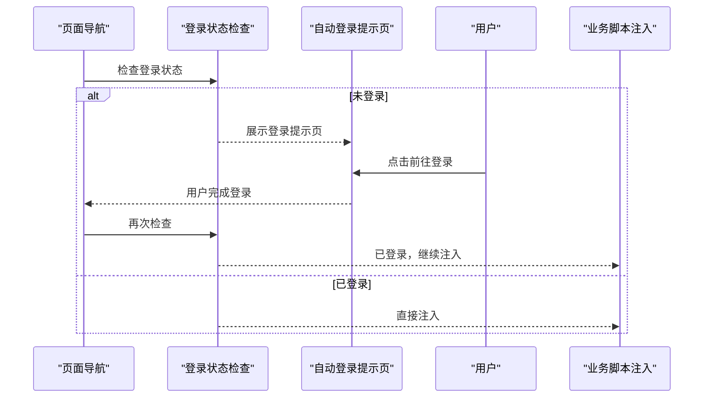
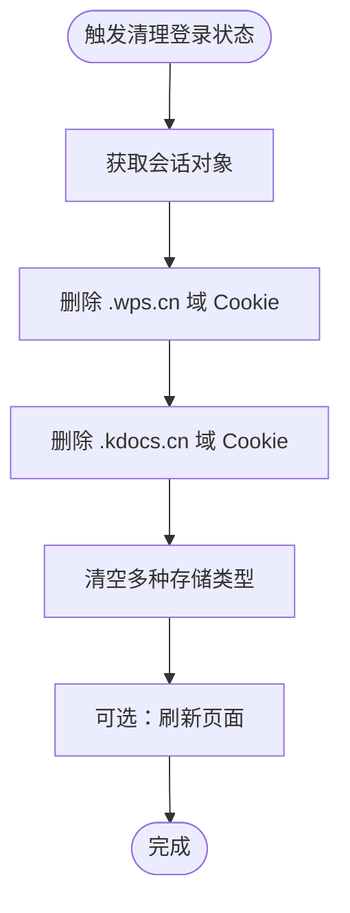
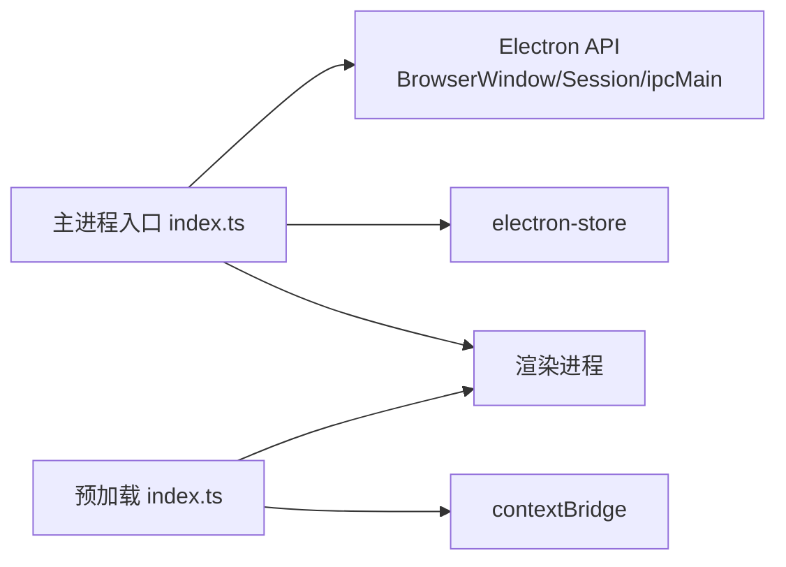

# 用户会话管理

<cite>
**本文引用的文件**
- [src/main/index.ts](file://src/main/index.ts)
- [src/preload/index.ts](file://src/preload/index.ts)
- [src/main/getDepartMent.ts](file://src/main/getDepartMent.ts)
- [package.json](file://package.json)
</cite>

## 目录
1. [简介](#简介)
2. [项目结构](#项目结构)
3. [核心组件](#核心组件)
4. [架构总览](#架构总览)
5. [组件详解](#组件详解)
6. [依赖关系分析](#依赖关系分析)
7. [性能考量](#性能考量)
8. [故障排查指南](#故障排查指南)
9. [结论](#结论)

## 简介
本文件系统性阐述 WoaApp 的用户会话管理能力，重点覆盖登录状态检查、会话持久化、Cookie 处理、自动登录流程、会话过期处理与安全策略，并给出配置项、存储策略、清理机制、多设备登录与会话同步建议以及针对会话劫持与 CSRF 等威胁的安全防护思路。文档基于仓库中的实际实现进行分析，避免臆测。

## 项目结构
围绕会话管理的关键代码集中在主进程入口与预加载层：
- 主进程入口负责创建窗口、配置会话、拦截网络请求、监听 Cookie 变更、检查登录状态、触发自动登录提示以及清理登录状态等。
- 预加载层通过 contextBridge 暴露有限 API 给渲染进程，保证在禁用上下文隔离的前提下仍可安全交互。
- 辅助模块用于从页面提取用户信息并缓存，便于后续业务使用。

图表来源
- [src/main/index.ts](file://src/main/index.ts#L238-L273)
- [src/main/index.ts](file://src/main/index.ts#L312-L338)
- [src/main/index.ts](file://src/main/index.ts#L2274-L2306)
- [src/preload/index.ts](file://src/preload/index.ts#L1-L63)

章节来源
- [src/main/index.ts](file://src/main/index.ts#L238-L273)
- [src/main/index.ts](file://src/main/index.ts#L312-L338)
- [src/main/index.ts](file://src/main/index.ts#L2274-L2306)
- [src/preload/index.ts](file://src/preload/index.ts#L1-L63)

## 核心组件
- 会话持久化与 Cookie 策略
  - 使用持久化会话分区，避免启动时清除存储，从而保持登录状态。
  - 监听 Cookie 变更事件，对目标域的登录相关 Cookie 进行记录与持久化。
- 登录状态检查
  - 通过查询指定域的 Cookie，匹配包含 token/session/auth/login 关键字的名称，判断是否已登录。
- 自动登录流程
  - 当检测到需要登录的页面且未登录时，展示引导页面，提示用户前往官方地址完成登录。
- 会话清理
  - 支持一键清除登录状态，删除指定域的 Cookie 并清空多种存储类型。
- 预加载与安全边界
  - 通过 contextBridge 暴露最小化 API，即便在禁用上下文隔离时也尽量降低风险面。

章节来源
- [src/main/index.ts](file://src/main/index.ts#L312-L338)
- [src/main/index.ts](file://src/main/index.ts#L238-L273)
- [src/main/index.ts](file://src/main/index.ts#L2274-L2306)
- [src/preload/index.ts](file://src/preload/index.ts#L1-L63)

## 架构总览
下图展示了会话管理在主进程中的关键交互：窗口创建、会话配置、Cookie 监听、登录状态检查、自动登录提示以及清理流程。

图表来源
- [src/main/index.ts](file://src/main/index.ts#L276-L338)
- [src/main/index.ts](file://src/main/index.ts#L238-L273)
- [src/main/index.ts](file://src/main/index.ts#L546-L580)
- [src/main/index.ts](file://src/main/index.ts#L2274-L2306)

## 组件详解

### 会话持久化与 Cookie 处理
- 持久化策略
  - 使用持久化会话分区，避免在启动时清除存储，从而保持登录状态。
  - 保留 Cookie 变更监听，对目标域的登录相关 Cookie 进行记录。
- Cookie 目标域
  - 针对 wps.cn 与 kdocs.cn 域名下的 Cookie 进行持久化与监控。
- 权限与证书
  - 允许所有权限请求与证书验证，便于跨域与内网资源访问。

图表来源
- [src/main/index.ts](file://src/main/index.ts#L312-L338)

章节来源
- [src/main/index.ts](file://src/main/index.ts#L312-L338)

### 登录状态检查逻辑
- 检查范围
  - 查询指定域的 Cookie，并合并 wps.cn 与 kdocs.cn 的结果。
- 匹配规则
  - 若 Cookie 名称包含 token/session/auth/login 等关键字，则视为已登录。
- 错误处理
  - 捕获异常并返回未登录状态，避免阻断流程。

图表来源
- [src/main/index.ts](file://src/main/index.ts#L238-L273)

章节来源
- [src/main/index.ts](file://src/main/index.ts#L238-L273)

### 自动登录流程
- 触发条件
  - 当导航至需要登录的页面且检查结果为未登录时，展示自动登录提示页。
- 提示页内容
  - 提示用户前往官方地址完成登录，并提供简洁样式与按钮。
- 后续处理
  - 用户完成登录后，再次检查登录状态，若已登录则继续注入业务脚本与功能。

图表来源
- [src/main/index.ts](file://src/main/index.ts#L546-L580)
- [src/main/index.ts](file://src/main/index.ts#L238-L273)

章节来源
- [src/main/index.ts](file://src/main/index.ts#L546-L580)
- [src/main/index.ts](file://src/main/index.ts#L238-L273)

### 会话过期处理与清理机制
- 清理范围
  - 删除 wps.cn 与 kdocs.cn 域下的所有 Cookie。
  - 清空 cookies、localstorage、indexdb、websql、cachestorage 等多种存储。
- 触发方式
  - 通过托盘菜单项触发，清理完成后可选择刷新页面。
- 适用场景
  - 用户主动登出、切换账号或修复登录异常。

图表来源
- [src/main/index.ts](file://src/main/index.ts#L2274-L2306)

章节来源
- [src/main/index.ts](file://src/main/index.ts#L2274-L2306)

### 多设备登录与会话同步
- 当前实现
  - 使用持久化会话分区，同一设备上登录状态可被保持。
- 同步建议
  - 若需跨设备同步登录状态，可在应用层引入统一的登录票据与会话令牌管理，并结合服务端会话同步接口进行校验与同步。
  - 对于 Cookie 同步，建议采用服务端下发的会话令牌并在各设备上统一刷新，避免直接复制 Cookie 导致的安全问题。

[本节为概念性建议，不直接对应具体源码实现]

### 安全策略与防护
- 当前策略
  - 允许所有权限请求与证书验证，禁用 webSecurity，便于内网与跨域访问。
  - Cookie 监听仅记录登录相关 Cookie，不进行强制拦截。
- 风险与改进建议
  - 会话劫持：建议引入 SameSite Cookie、HttpOnly、Secure 标记（若服务端支持），并定期轮换会话令牌。
  - CSRF：建议在关键请求中加入一次性 Token 或使用同源策略配合 CSP。
  - XSS：即便禁用上下文隔离，也应严格限制渲染进程可访问的 API 数量，避免直接暴露敏感能力。
  - 证书与网络：生产环境建议启用证书验证与安全策略，仅在开发或特殊场景临时禁用。

章节来源
- [src/main/index.ts](file://src/main/index.ts#L329-L338)
- [src/main/index.ts](file://src/main/index.ts#L340-L364)

### 预加载与 API 边界
- 预加载层通过 contextBridge 将有限的 IPC 能力暴露给渲染进程，避免直接暴露 Node.js 能力。
- 在禁用上下文隔离的情况下，应尽量减少暴露的 API，确保最小权限原则。

章节来源
- [src/preload/index.ts](file://src/preload/index.ts#L1-L63)

### 用户信息缓存（辅助功能）
- 从页面提取用户名与头像信息并缓存，便于后续业务使用。
- 该能力与会话管理无直接耦合，但可作为登录状态确认的补充手段。

章节来源
- [src/main/getDepartMent.ts](file://src/main/getDepartMent.ts#L1-L49)

## 依赖关系分析
- 主进程入口依赖 Electron 的 BrowserWindow、Session、ipcMain 等能力，构建会话管理闭环。
- 预加载层依赖 contextBridge，承担主进程与渲染进程之间的安全桥梁。
- 第三方依赖包括 electron-store 用于本地配置存储，iconv-lite 用于日志编码处理。

图表来源
- [src/main/index.ts](file://src/main/index.ts#L1-L40)
- [src/preload/index.ts](file://src/preload/index.ts#L1-L63)
- [package.json](file://package.json#L25-L33)

章节来源
- [src/main/index.ts](file://src/main/index.ts#L1-L40)
- [src/preload/index.ts](file://src/preload/index.ts#L1-L63)
- [package.json](file://package.json#L25-L33)

## 性能考量
- 网络拦截与请求头修改
  - 对所有请求放行并添加通用请求头，可能增加网络开销；建议按需拦截与精简头部。
- Cookie 监听频率
  - Cookie 变更事件频繁时可能带来额外日志与处理成本，建议在生产环境适当降噪。
- 页面加载与注入时机
  - 在 did-finish-load 后注入脚本，避免页面未完全加载导致的执行失败。

章节来源
- [src/main/index.ts](file://src/main/index.ts#L340-L364)
- [src/main/index.ts](file://src/main/index.ts#L140-L180)

## 故障排查指南
- 登录状态检查始终返回未登录
  - 检查目标域 Cookie 是否存在，确认 Cookie 名称是否包含 token/session/auth/login。
  - 查看 Cookie 监听日志，确认是否正确记录登录相关 Cookie。
- 自动登录提示页未出现
  - 确认导航监听与 will-navigate 回调是否生效，检查页面 URL 是否命中需要登录的路径。
- 清理登录状态无效
  - 确认删除的域是否正确，检查是否清空了 cookies、localstorage、indexdb、websql、cachestorage。
  - 如需立即生效，可在清理后刷新页面。

章节来源
- [src/main/index.ts](file://src/main/index.ts#L238-L273)
- [src/main/index.ts](file://src/main/index.ts#L546-L580)
- [src/main/index.ts](file://src/main/index.ts#L2274-L2306)

## 结论
WoaApp 的会话管理以“持久化会话分区 + Cookie 监听 + 登录状态检查”为核心，辅以自动登录提示与一键清理机制，满足桌面端应用的登录体验需求。当前实现侧重易用性与兼容性，在开发与内网环境下具备良好表现。若面向生产环境，建议加强安全策略（如 SameSite/HttpOnly/Secure、CSRF Token、CSP 等），并对网络拦截与 Cookie 监听进行精细化控制，以提升安全性与性能。