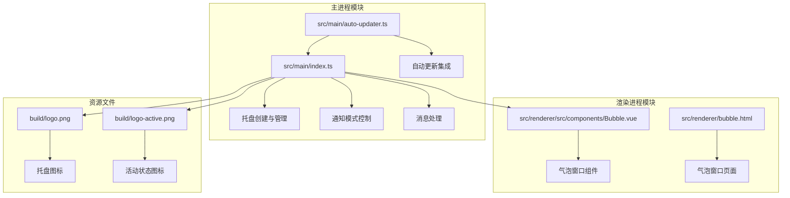
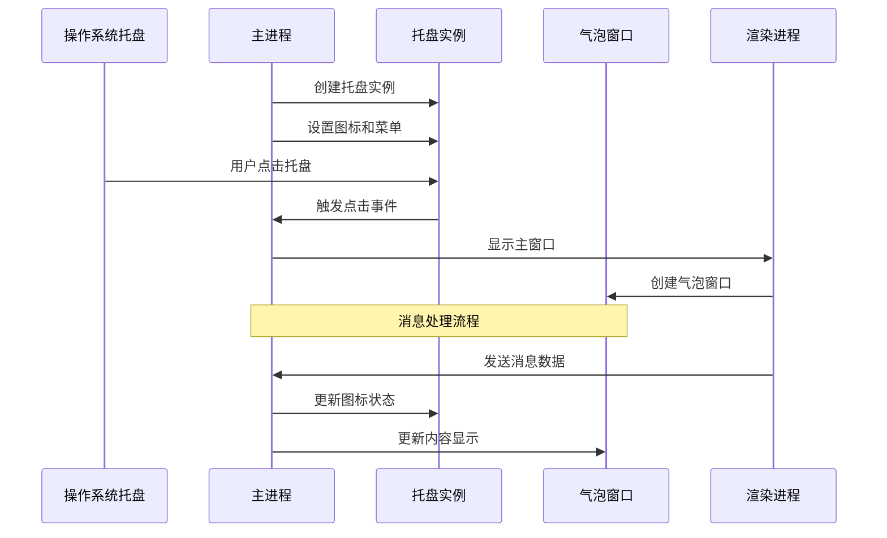
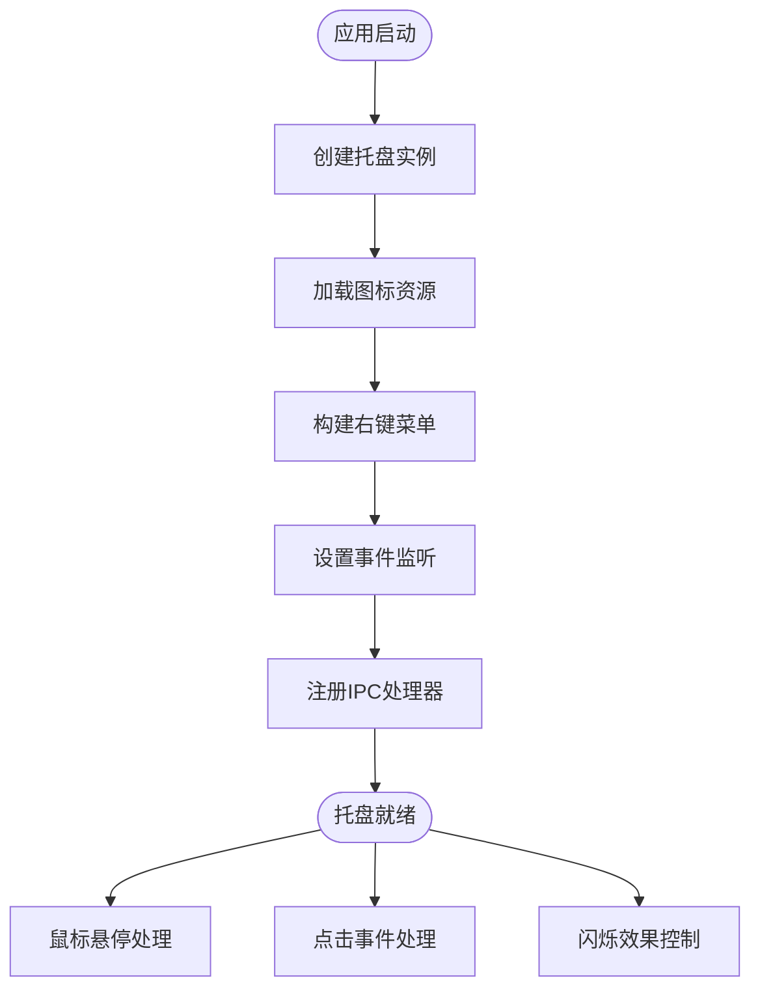
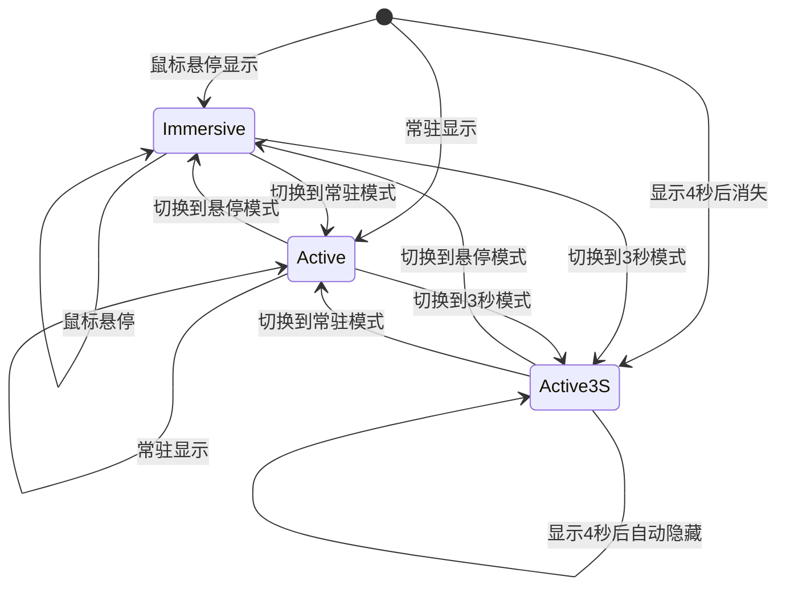
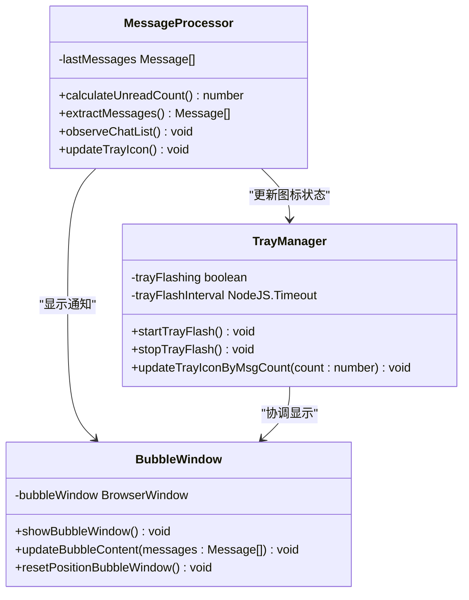
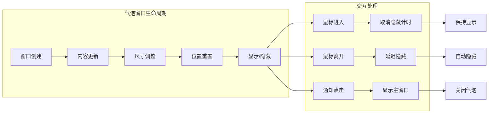
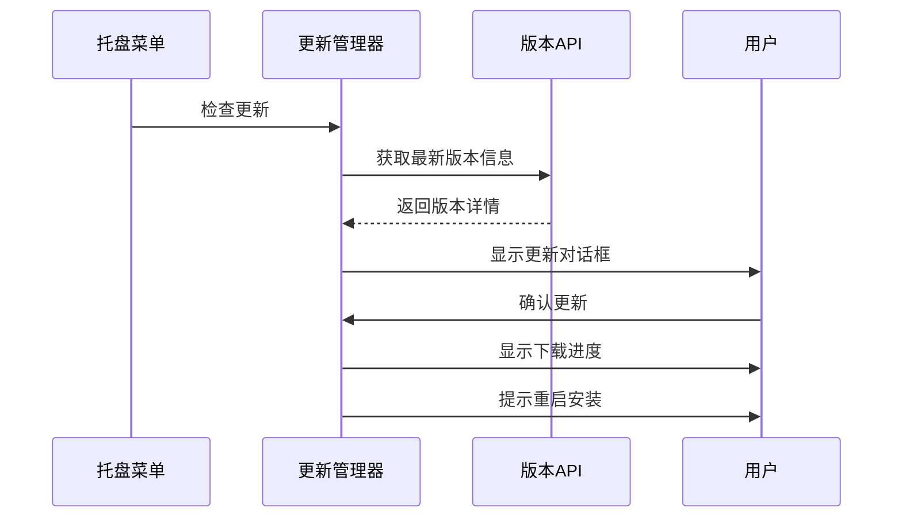
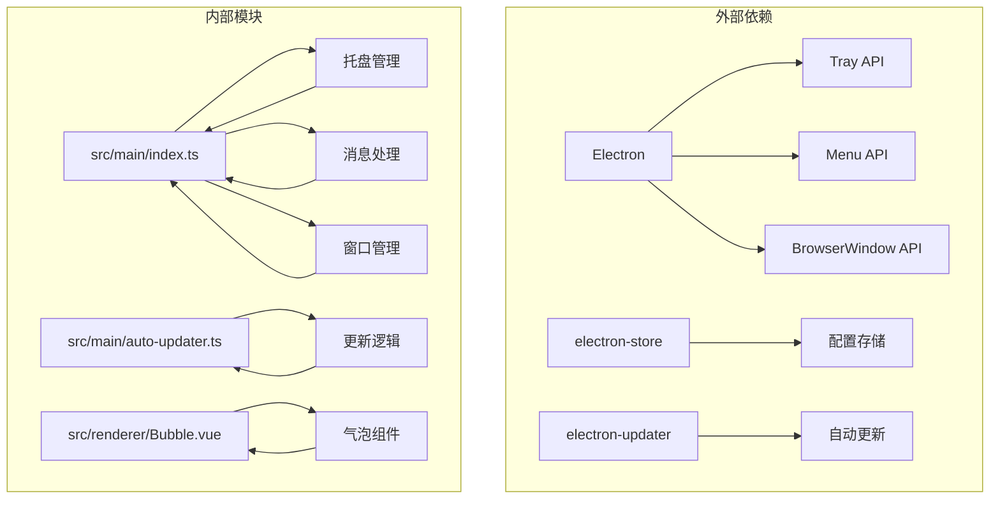

# 系统托盘集成

<cite>
**本文档引用的文件**
- [src/main/index.ts](file://src/main/index.ts)
- [src/main/auto-updater.ts](file://src/main/auto-updater.ts)
- [src/renderer/src/components/Bubble.vue](file://src/renderer/src/components/Bubble.vue)
- [package.json](file://package.json)
- [build/logo.png](file://build/logo.png)
- [build/logo-active.png](file://build/logo-active.png)
</cite>

## 目录
1. [简介](#简介)
2. [项目结构](#项目结构)
3. [核心组件](#核心组件)
4. [架构概览](#架构概览)
5. [详细组件分析](#详细组件分析)
6. [依赖关系分析](#依赖关系分析)
7. [性能考虑](#性能考虑)
8. [故障排除指南](#故障排除指南)
9. [结论](#结论)

## 简介

WoaApp 的系统托盘集成功能是一个完整的桌面通知解决方案，实现了与操作系统托盘的深度集成。该功能提供了三种通知模式（常驻显示、显示4秒后消失、鼠标悬停显示），支持动态闪烁效果，以及丰富的用户交互能力。

系统托盘集成为用户提供了便捷的访问入口，无需打开主应用程序即可进行各种操作。通过智能的通知机制，用户可以及时了解应用程序状态和重要信息，同时保持系统的整洁和高效。

## 项目结构

WoaApp 的系统托盘功能主要分布在以下关键文件中：

**图表来源**
- [src/main/index.ts](file://src/main/index.ts#L840-L1154)
- [src/main/auto-updater.ts](file://src/main/auto-updater.ts#L40-L80)
- [src/renderer/src/components/Bubble.vue](file://src/renderer/src/components/Bubble.vue#L1-L236)

**章节来源**
- [src/main/index.ts](file://src/main/index.ts#L840-L1154)
- [src/main/auto-updater.ts](file://src/main/auto-updater.ts#L40-L80)

## 核心组件

### 托盘图标管理系统

系统托盘集成了两个核心图标状态：
- **静态图标**：`build/logo.png` - 表示应用程序正常状态
- **活动图标**：`build/logo-active.png` - 表示有未读消息时的闪烁状态

图标管理通过 Electron 的 Tray API 实现，支持动态切换和闪烁效果。

### 通知模式控制器

系统提供三种通知模式，通过托盘菜单进行配置：

1. **常驻显示模式** (`active`)：消息到达时立即显示气泡窗口
2. **显示4秒后消失模式** (`active-3s`)：消息到达时显示气泡，4秒后自动隐藏
3. **鼠标悬停显示模式** (`immersive`)：鼠标悬停在托盘图标上时显示气泡

### 消息处理引擎

消息处理通过 DOM 节点监听实现，能够：
- 实时监控聊天列表变化
- 提取消息内容和头像信息
- 计算未读消息总数
- 动态更新托盘图标状态

**章节来源**
- [src/main/index.ts](file://src/main/index.ts#L1177-L1206)
- [src/main/index.ts](file://src/main/index.ts#L983-L1034)

## 架构概览

系统托盘集成功能采用主进程-渲染进程分离的架构设计：

**图表来源**
- [src/main/index.ts](file://src/main/index.ts#L1106-L1153)
- [src/main/index.ts](file://src/main/index.ts#L1897-L1931)

## 详细组件分析

### 托盘创建与初始化

托盘创建过程包含多个关键步骤：

**图表来源**
- [src/main/index.ts](file://src/main/index.ts#L840-L1104)

托盘初始化的核心功能包括：
- 图标资源加载和缓存
- 右键菜单模板构建
- 事件监听器注册
- IPC 通信通道建立

**章节来源**
- [src/main/index.ts](file://src/main/index.ts#L840-L1104)

### 通知模式管理

通知模式通过 Electron Store 进行持久化存储，支持三种模式的动态切换：

**图表来源**
- [src/main/index.ts](file://src/main/index.ts#L983-L1034)

每种模式都有特定的行为特征：
- **Immersive 模式**：仅在鼠标悬停时显示，适合不希望频繁打断用户的场景
- **Active 模式**：消息到达时立即显示，适合需要即时响应的重要通知
- **Active-3S 模式**：平衡了即时性和不打扰，适合日常消息通知

**章节来源**
- [src/main/index.ts](file://src/main/index.ts#L983-L1034)

### 消息处理与状态同步

消息处理采用 DOM 节点监听机制，通过 MutationObserver 实时监控聊天列表变化：

**图表来源**
- [src/main/index.ts](file://src/main/index.ts#L1419-L1721)
- [src/main/index.ts](file://src/main/index.ts#L1177-L1206)
- [src/main/index.ts](file://src/main/index.ts#L1778-L1801)

消息处理流程包括：
1. **DOM 监听**：通过 MutationObserver 监控聊天列表变化
2. **数据提取**：提取用户名、消息内容、头像等信息
3. **状态计算**：计算未读消息总数
4. **状态同步**：通过 IPC 通道同步到渲染进程
5. **UI 更新**：根据通知模式更新气泡窗口显示

**章节来源**
- [src/main/index.ts](file://src/main/index.ts#L1419-L1721)
- [src/main/index.ts](file://src/main/index.ts#L1897-L1931)

### 气泡窗口管理

气泡窗口是系统托盘通知的核心展示组件：

**图表来源**
- [src/main/index.ts](file://src/main/index.ts#L1752-L1801)
- [src/main/index.ts](file://src/main/index.ts#L1208-L1234)

气泡窗口具有以下特性：
- **智能定位**：自动定位到屏幕右下角
- **动态尺寸**：根据消息数量自动调整高度
- **透明背景**：提供美观的视觉效果
- **始终置顶**：确保通知不会被其他窗口遮挡

**章节来源**
- [src/main/index.ts](file://src/main/index.ts#L1752-L1801)
- [src/main/index.ts](file://src/main/index.ts#L1208-L1234)

### 自动更新集成

系统托盘还集成了自动更新功能，通过专用的更新管理器实现：

**图表来源**
- [src/main/auto-updater.ts](file://src/main/auto-updater.ts#L189-L200)
- [src/main/auto-updater.ts](file://src/main/auto-updater.ts#L436-L473)

自动更新功能特点：
- **定时检查**：每5秒检查一次更新
- **智能下载**：支持断点续传和进度跟踪
- **用户友好**：提供清晰的更新状态反馈
- **安全安装**：确保更新包的完整性和安全性

**章节来源**
- [src/main/auto-updater.ts](file://src/main/auto-updater.ts#L40-L80)

## 依赖关系分析

系统托盘功能涉及多个模块间的复杂依赖关系：

**图表来源**
- [package.json](file://package.json#L25-L33)
- [src/main/index.ts](file://src/main/index.ts#L1-L26)

主要依赖关系：
- **Electron 核心 API**：提供托盘、菜单、窗口等基础功能
- **electron-store**：提供配置数据的持久化存储
- **electron-updater**：实现应用程序的自动更新功能
- **Vue 组件**：提供气泡窗口的用户界面

**章节来源**
- [package.json](file://package.json#L25-L33)

## 性能考虑

系统托盘集成功能在设计时充分考虑了性能优化：

### 内存管理
- **图标缓存**：托盘图标在内存中缓存，避免重复加载
- **定时器管理**：及时清理不再使用的定时器，防止内存泄漏
- **事件监听器**：在应用退出时移除所有事件监听器

### 网络优化
- **DOM 监听频率**：通过 5 秒间隔定期检查，平衡实时性和性能
- **消息去重**：避免重复推送相同的消息数据
- **懒加载策略**：气泡窗口按需创建和销毁

### 用户体验优化
- **非抢占式显示**：气泡窗口不强制获取焦点，避免打断用户工作
- **智能闪烁**：仅在有未读消息时启用闪烁效果
- **平滑过渡**：所有动画效果都经过优化，确保流畅体验

## 故障排除指南

### 常见问题及解决方案

**托盘图标不显示**
1. 检查图标文件是否存在且可访问
2. 验证 Electron 版本兼容性
3. 确认应用具有管理员权限

**消息通知不准确**
1. 检查 DOM 选择器是否正确
2. 验证 MutationObserver 配置
3. 确认页面加载完成后再开始监听

**气泡窗口无法显示**
1. 检查窗口权限设置
2. 验证 alwaysOnTop 属性配置
3. 确认屏幕边界检测逻辑

**章节来源**
- [src/main/index.ts](file://src/main/index.ts#L2091-L2129)

### 调试技巧

系统提供了多种调试工具：
- **主进程调试**：通过开发菜单打开主窗口开发者工具
- **消息调试**：专门的消息调试工具用于检查消息提取过程
- **版本更新调试**：模拟更新过程以便测试更新功能

## 结论

WoaApp 的系统托盘集成功能展现了现代桌面应用程序的最佳实践。通过精心设计的架构和完善的用户体验，该功能成功地将复杂的后台通知机制与简洁直观的用户界面相结合。

主要成就包括：
- **多模式通知系统**：满足不同用户需求和使用场景
- **智能资源管理**：优化内存使用和性能表现
- **跨平台兼容性**：支持 Windows、macOS 和 Linux 系统
- **用户友好设计**：提供直观的操作方式和良好的视觉反馈

该系统托盘集成不仅提升了应用程序的功能完整性，也为用户提供了更加便捷和高效的使用体验。通过持续的优化和改进，这一功能将继续为用户创造价值。