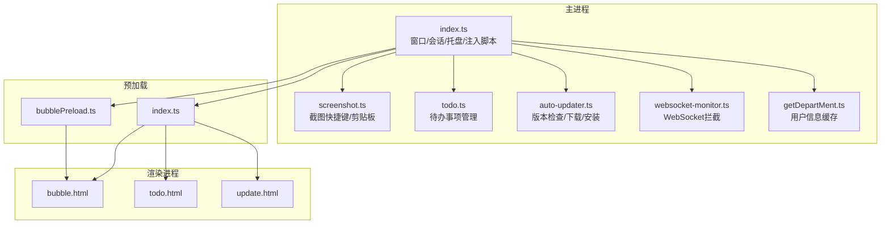
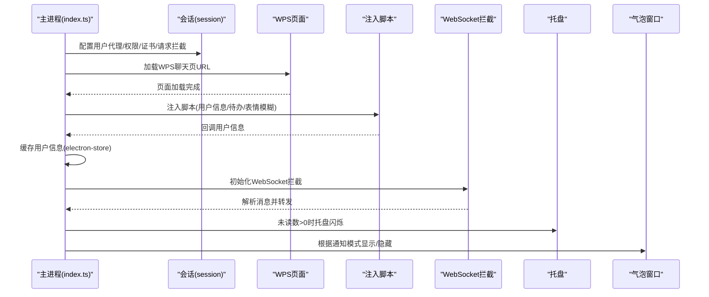
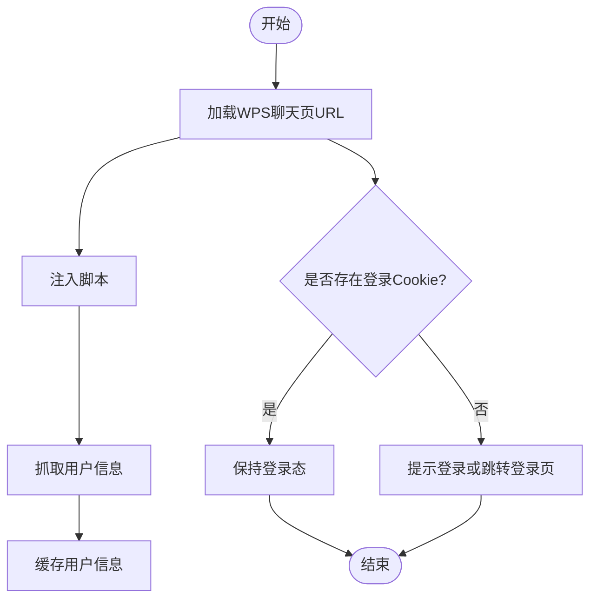
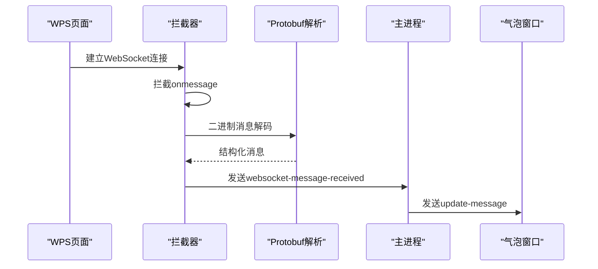
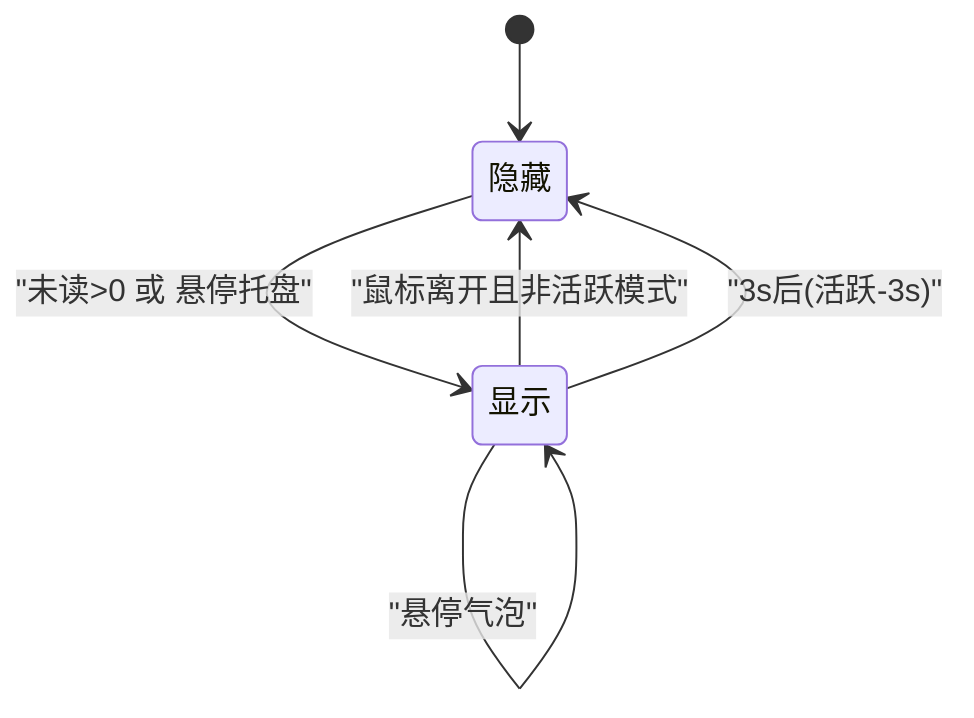
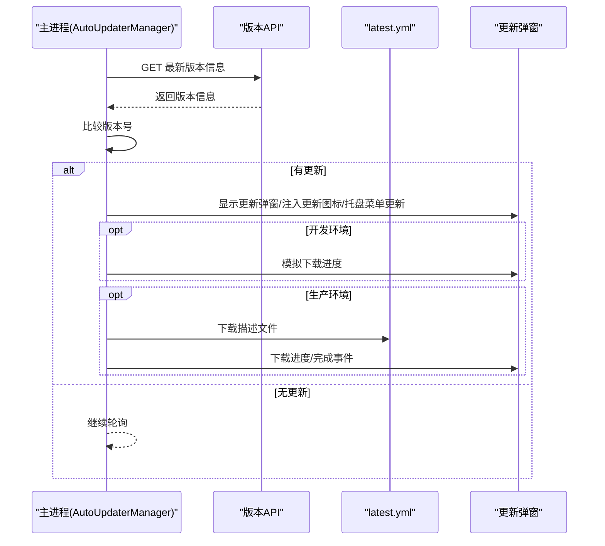
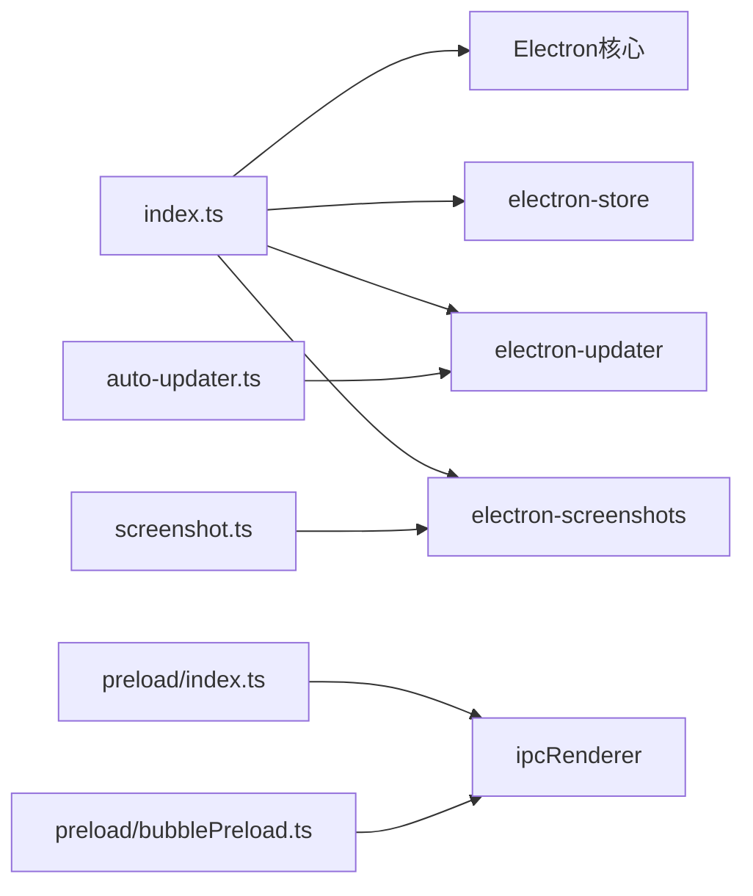

# 系统集成

<cite>
**本文引用的文件**
- [src/main/index.ts](file://src/main/index.ts)
- [src/main/websocket-monitor.ts](file://src/main/websocket-monitor.ts)
- [src/main/getDepartMent.ts](file://src/main/getDepartMent.ts)
- [src/main/screenshot.ts](file://src/main/screenshot.ts)
- [src/main/todo.ts](file://src/main/todo.ts)
- [src/main/auto-updater.ts](file://src/main/auto-updater.ts)
- [src/preload/index.ts](file://src/preload/index.ts)
- [src/preload/bubblePreload.ts](file://src/preload/bubblePreload.ts)
- [src/renderer/bubble.html](file://src/renderer/bubble.html)
- [src/renderer/todo.html](file://src/renderer/todo.html)
- [src/renderer/update.html](file://src/renderer/update.html)
- [package.json](file://package.json)
</cite>

## 目录
1. [简介](#简介)
2. [项目结构](#项目结构)
3. [核心组件](#核心组件)
4. [架构总览](#架构总览)
5. [详细组件分析](#详细组件分析)
6. [依赖关系分析](#依赖关系分析)
7. [性能考量](#性能考量)
8. [故障排查指南](#故障排查指南)
9. [结论](#结论)
10. [附录](#附录)

## 简介
本文件面向系统集成场景，围绕 WoaApp 与外部系统的集成方案展开，重点覆盖：
- WPS 云办公平台的单点登录与会话保持
- WebSocket 实时消息拦截与转发
- 系统托盘与消息气泡通知
- 用户信息缓存与登录状态检查
- 自动更新与版本管理
- 截图能力与待办事项功能
- 网络通信安全与错误处理
- 系统资源管理与优化策略

## 项目结构
WoaApp 采用 Electron + Vue 的架构，主进程负责窗口、会话、托盘、自动更新等系统级能力；渲染进程承载 UI 与业务页面；preload 层桥接主/渲染进程。

**图表来源**
- [src/main/index.ts](file://src/main/index.ts#L276-L615)
- [src/main/websocket-monitor.ts](file://src/main/websocket-monitor.ts#L1-L242)
- [src/main/getDepartMent.ts](file://src/main/getDepartMent.ts#L1-L50)
- [src/main/screenshot.ts](file://src/main/screenshot.ts#L1-L158)
- [src/main/todo.ts](file://src/main/todo.ts#L1-L266)
- [src/main/auto-updater.ts](file://src/main/auto-updater.ts#L1-L565)
- [src/preload/index.ts](file://src/preload/index.ts#L1-L63)
- [src/preload/bubblePreload.ts](file://src/preload/bubblePreload.ts#L1-L70)
- [src/renderer/bubble.html](file://src/renderer/bubble.html#L1-L33)
- [src/renderer/todo.html](file://src/renderer/todo.html#L1-L12)
- [src/renderer/update.html](file://src/renderer/update.html#L1-L12)

**章节来源**
- [src/main/index.ts](file://src/main/index.ts#L1-L200)
- [package.json](file://package.json#L1-L55)

## 核心组件
- 主窗口与会话管理：统一会话分区、持久化 Cookie、用户代理、权限与证书策略、网络请求拦截与重定向处理。
- 托盘与消息气泡：托盘闪烁、气泡窗口显示/隐藏策略、通知模式（沉浸/活跃/活跃-3s）。
- WebSocket 实时通信：拦截 WebSocket 连接与消息，解析 Protobuf，提取消息体并转发至主进程。
- 用户信息与登录状态：注入脚本后抓取用户信息并缓存；检查登录 Cookies 判断是否已登录。
- 自动更新：周期检查版本、下载最新描述文件、按更新类型触发 UI 提示与托盘徽章。
- 截图与待办：全局快捷键触发截图、剪贴板写入；注入待办入口与右键菜单项，IPC 管理待办数据。
- 预加载桥接：暴露安全可控的 API 至渲染进程，支持 IPC 与自定义方法。

**章节来源**
- [src/main/index.ts](file://src/main/index.ts#L238-L418)
- [src/main/websocket-monitor.ts](file://src/main/websocket-monitor.ts#L4-L242)
- [src/main/getDepartMent.ts](file://src/main/getDepartMent.ts#L6-L49)
- [src/main/auto-updater.ts](file://src/main/auto-updater.ts#L40-L131)
- [src/main/screenshot.ts](file://src/main/screenshot.ts#L16-L96)
- [src/main/todo.ts](file://src/main/todo.ts#L20-L136)
- [src/preload/index.ts](file://src/preload/index.ts#L4-L62)
- [src/preload/bubblePreload.ts](file://src/preload/bubblePreload.ts#L3-L61)

## 架构总览
WoaApp 通过主进程统一管理外部系统集成点，渲染进程负责 UI 与业务交互，preload 层作为安全边界桥接两者。关键集成路径如下：
- WPS 云办公：主窗口加载目标 URL，注入脚本，抓取用户信息，保持会话持久化。
- WebSocket：在主进程侧拦截并解析消息，转发给渲染侧气泡窗口。
- 托盘/气泡：根据未读数与通知模式控制托盘图标与气泡显示。
- 自动更新：主进程轮询版本 API，按类型注入更新提示或托盘徽章。
- 截图/待办：通过 IPC 与全局快捷键触发，数据持久化于 Store。

**图表来源**
- [src/main/index.ts](file://src/main/index.ts#L402-L530)
- [src/main/websocket-monitor.ts](file://src/main/websocket-monitor.ts#L162-L210)
- [src/main/getDepartMent.ts](file://src/main/getDepartMent.ts#L12-L48)
- [src/main/index.ts](file://src/main/index.ts#L1177-L1206)

## 详细组件分析

### WPS 云办公平台集成
- 目标页面与会话配置
  - 主窗口加载目标 URL，设置用户代理、权限请求回调、证书校验回调、webRequest 拦截，允许所有导航与请求，避免跨域与重定向阻断。
  - 会话持久化：不清空存储，保留登录态；监听 cookies 变更，确保登录态持久。
- 登录状态检查
  - 通过查询特定域名下的登录相关 Cookie 判断是否已登录。
- 注入脚本与用户信息
  - 页面加载完成后注入脚本，抓取用户姓名与头像并缓存至 Store。

**图表来源**
- [src/main/index.ts](file://src/main/index.ts#L402-L530)
- [src/main/getDepartMent.ts](file://src/main/getDepartMent.ts#L12-L48)
- [src/main/index.ts](file://src/main/index.ts#L238-L273)

**章节来源**
- [src/main/index.ts](file://src/main/index.ts#L276-L418)
- [src/main/getDepartMent.ts](file://src/main/getDepartMent.ts#L6-L49)

### WebSocket 实时通信
- 拦截与解析
  - 通过注入脚本拦截原生 WebSocket，监听 onmessage，对二进制消息进行 Protobuf 解析，提取可打印字符串字段。
- 消息转发
  - 将解析后的消息通过 window.electronAPI 发送给主进程，主进程再转发至气泡窗口。
- 测试与健壮性
  - 提供测试用 Base64 数据解析流程，对异常分支进行日志记录与降级处理。

**图表来源**
- [src/main/websocket-monitor.ts](file://src/main/websocket-monitor.ts#L162-L210)
- [src/main/websocket-monitor.ts](file://src/main/websocket-monitor.ts#L104-L160)

**章节来源**
- [src/main/websocket-monitor.ts](file://src/main/websocket-monitor.ts#L1-L242)

### 系统托盘与消息气泡
- 托盘图标与闪烁
  - 根据未读总数切换图标，超过阈值时以固定频率闪烁。
- 气泡显示策略
  - 支持三种通知模式：沉浸式、活跃、活跃-3s；鼠标悬停托盘/气泡时清除隐藏计时器；非活跃模式下延迟隐藏。
- 气泡窗口生命周期
  - 通过 preload 暴露 API，支持消息更新监听、点击、清除等事件；窗口移动时持久化位置。

**图表来源**
- [src/main/index.ts](file://src/main/index.ts#L1120-L1175)
- [src/main/index.ts](file://src/main/index.ts#L1177-L1206)
- [src/preload/bubblePreload.ts](file://src/preload/bubblePreload.ts#L5-L61)

**章节来源**
- [src/main/index.ts](file://src/main/index.ts#L1119-L1206)
- [src/preload/bubblePreload.ts](file://src/preload/bubblePreload.ts#L1-L70)

### 用户信息管理与登录状态检查
- 用户信息缓存
  - 注入脚本抓取用户姓名与头像，主进程写入 Store，后续用于 UI 与业务展示。
- 登录状态检查
  - 查询 wps.cn/kdocs.cn 域名下的登录相关 Cookie，判断是否已登录。

**章节来源**
- [src/main/getDepartMent.ts](file://src/main/getDepartMent.ts#L6-L49)
- [src/main/index.ts](file://src/main/index.ts#L238-L273)

### 会话管理与网络策略
- 会话分区与持久化
  - 使用持久化会话分区，保留 Cookie、LocalStorage 等，避免频繁登录。
- 权限与证书
  - 统一允许权限请求，接受所有证书，减少企业内网或自签名场景的阻断。
- 请求拦截
  - 允许所有请求与重定向，设置必要请求头，便于跨域与兼容性。

**章节来源**
- [src/main/index.ts](file://src/main/index.ts#L304-L364)

### 自动更新与版本管理
- 版本检查
  - 定时轮询版本 API，比较当前版本与最新版本决定是否更新。
- 更新类型与提示
  - 支持强制更新、主动提醒、被动提醒三类；主动提醒时在网页注入更新图标并在托盘菜单添加更新提示。
- 下载与安装
  - 开发环境模拟下载进度；生产环境下载最新描述文件并触发下载，支持进度事件与错误回退。
- IPC 接口
  - 提供检查更新、获取当前版本、显示/开始更新、重启安装等 IPC 处理器。

**图表来源**
- [src/main/auto-updater.ts](file://src/main/auto-updater.ts#L188-L221)
- [src/main/auto-updater.ts](file://src/main/auto-updater.ts#L297-L353)
- [src/main/auto-updater.ts](file://src/main/auto-updater.ts#L435-L473)

**章节来源**
- [src/main/auto-updater.ts](file://src/main/auto-updater.ts#L40-L131)
- [src/main/auto-updater.ts](file://src/main/auto-updater.ts#L188-L295)

### 截图与待办事项
- 截图
  - 注册全局快捷键，触发截图遮罩，支持复制到剪贴板与保存对话框；注入页面按钮便于操作。
- 待办事项
  - 注入待办入口与右键菜单项，支持从聊天内容创建待办；IPC 管理增删改查与未处理数量广播。

**章节来源**
- [src/main/screenshot.ts](file://src/main/screenshot.ts#L16-L96)
- [src/main/todo.ts](file://src/main/todo.ts#L20-L136)

### 预加载与渲染桥接
- 预加载桥接
  - 在禁用上下文隔离场景下，直接在 window 暴露安全可控的 API；提供 IPC 通道与自定义方法。
- 渲染页面
  - 气泡、待办、更新页面分别对应独立 HTML 与入口脚本，通过 preload 暴露的 API 与主进程通信。

**章节来源**
- [src/preload/index.ts](file://src/preload/index.ts#L4-L62)
- [src/preload/bubblePreload.ts](file://src/preload/bubblePreload.ts#L3-L61)
- [src/renderer/bubble.html](file://src/renderer/bubble.html#L1-L33)
- [src/renderer/todo.html](file://src/renderer/todo.html#L1-L12)
- [src/renderer/update.html](file://src/renderer/update.html#L1-L12)

## 依赖关系分析
- 主进程依赖
  - Electron 核心模块（BrowserWindow、Tray、session、ipcMain 等）
  - 第三方库：electron-store（本地存储）、electron-updater（自动更新）、electron-screenshots（截图）
- 渲染进程依赖
  - Vue 应用与各自页面入口脚本
- 预加载依赖
  - 仅暴露有限 API，避免直接暴露 Node/Electron 能力

**图表来源**
- [src/main/index.ts](file://src/main/index.ts#L1-L26)
- [src/main/auto-updater.ts](file://src/main/auto-updater.ts#L1-L12)
- [src/main/screenshot.ts](file://src/main/screenshot.ts#L1-L5)
- [src/preload/index.ts](file://src/preload/index.ts#L1-L14)
- [src/preload/bubblePreload.ts](file://src/preload/bubblePreload.ts#L1-L6)
- [package.json](file://package.json#L25-L32)

**章节来源**
- [package.json](file://package.json#L25-L32)

## 性能考量
- 禁用后台节流：确保主窗口与气泡窗口在后台仍保持响应。
- 禁用上下文隔离与安全策略：降低注入与通信成本，但需严格控制预加载暴露的 API。
- 会话持久化：避免重复登录带来的网络与时间消耗。
- WebSocket 解析：对二进制消息进行增量解析与字段过滤，减少内存占用。
- 自动更新：开发环境模拟进度，避免真实下载对性能的影响；生产环境分步下载描述文件与安装包。

[本节为通用建议，无需列出具体文件来源]

## 故障排查指南
- 页面加载失败
  - 主进程捕获 did-fail-load，区分主页面与内部登录重定向失败；必要时显示本地登录提示页或备用 URL。
- 登录状态异常
  - 检查会话 Cookie 是否存在；确认权限与证书策略是否正确；必要时清理会话后重试。
- WebSocket 消息未到达
  - 确认拦截器已注入；检查 Protobuf 解析日志；验证主进程是否收到消息并转发。
- 托盘/气泡不显示
  - 检查通知模式配置；确认未读计数与 hover 状态；验证窗口置顶与显示逻辑。
- 自动更新失败
  - 检查版本 API 可达性与返回格式；确认描述文件下载与安装流程；查看错误事件与日志。

**章节来源**
- [src/main/index.ts](file://src/main/index.ts#L433-L450)
- [src/main/index.ts](file://src/main/index.ts#L594-L614)
- [src/main/websocket-monitor.ts](file://src/main/websocket-monitor.ts#L104-L123)
- [src/main/auto-updater.ts](file://src/main/auto-updater.ts#L167-L186)

## 结论
WoaApp 通过主进程集中管理外部系统集成，结合注入脚本与预加载桥接，实现了与 WPS 云办公平台的深度集成、实时消息拦截、托盘与气泡通知、用户信息缓存、自动更新与系统工具能力。在安全性与性能之间取得平衡，同时提供了完善的错误处理与资源管理策略。

[本节为总结性内容，无需列出具体文件来源]

## 附录

### 集成接口与配置要点
- WPS 页面加载与注入
  - 目标 URL：聊天页
  - 注入时机：页面加载完成
  - 关键配置：会话分区、用户代理、权限与证书策略、webRequest 拦截
- WebSocket 拦截
  - 注入点：拦截原生 WebSocket
  - 解析：Protobuf 字段提取
  - 转发：主进程 -> 渲染侧气泡窗口
- 托盘/气泡
  - 未读计数 -> 托盘闪烁
  - 通知模式 -> 显示/隐藏策略
  - 气泡窗口 -> 预加载 API
- 自动更新
  - 版本 API 地址（开发/生产）
  - 下载进度与错误事件
  - 更新类型（强制/主动/被动）
- 截图/待办
  - 全局快捷键
  - IPC 事件与 Store 持久化

**章节来源**
- [src/main/index.ts](file://src/main/index.ts#L402-L530)
- [src/main/websocket-monitor.ts](file://src/main/websocket-monitor.ts#L162-L210)
- [src/main/auto-updater.ts](file://src/main/auto-updater.ts#L46-L48)
- [src/main/screenshot.ts](file://src/main/screenshot.ts#L16-L96)
- [src/main/todo.ts](file://src/main/todo.ts#L20-L136)