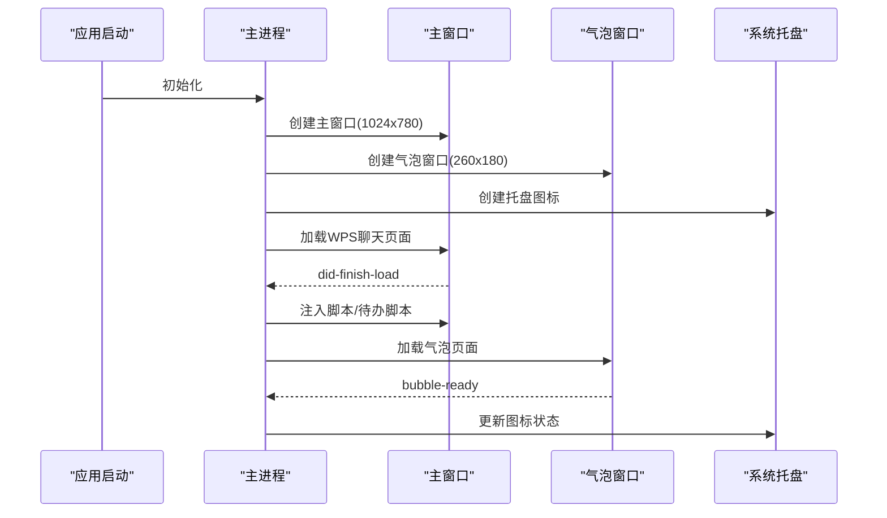
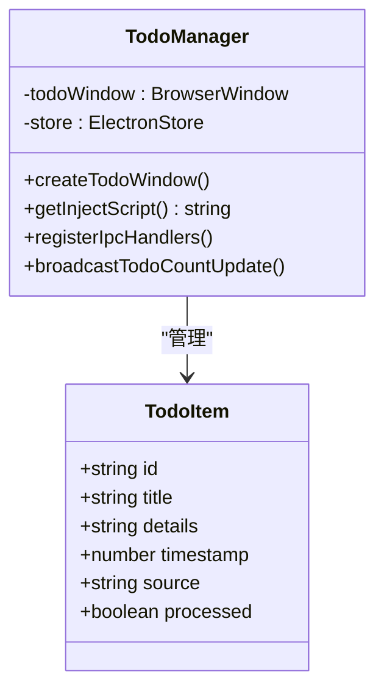
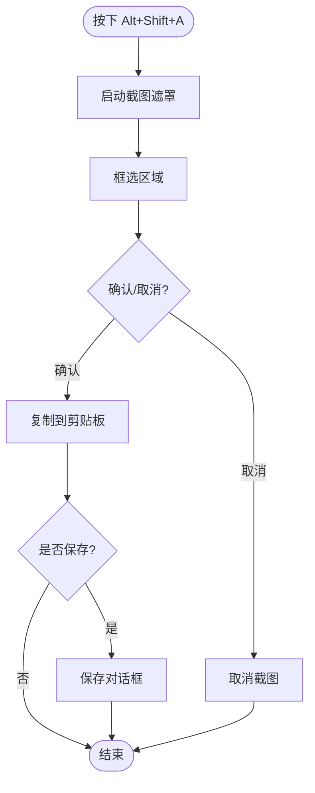
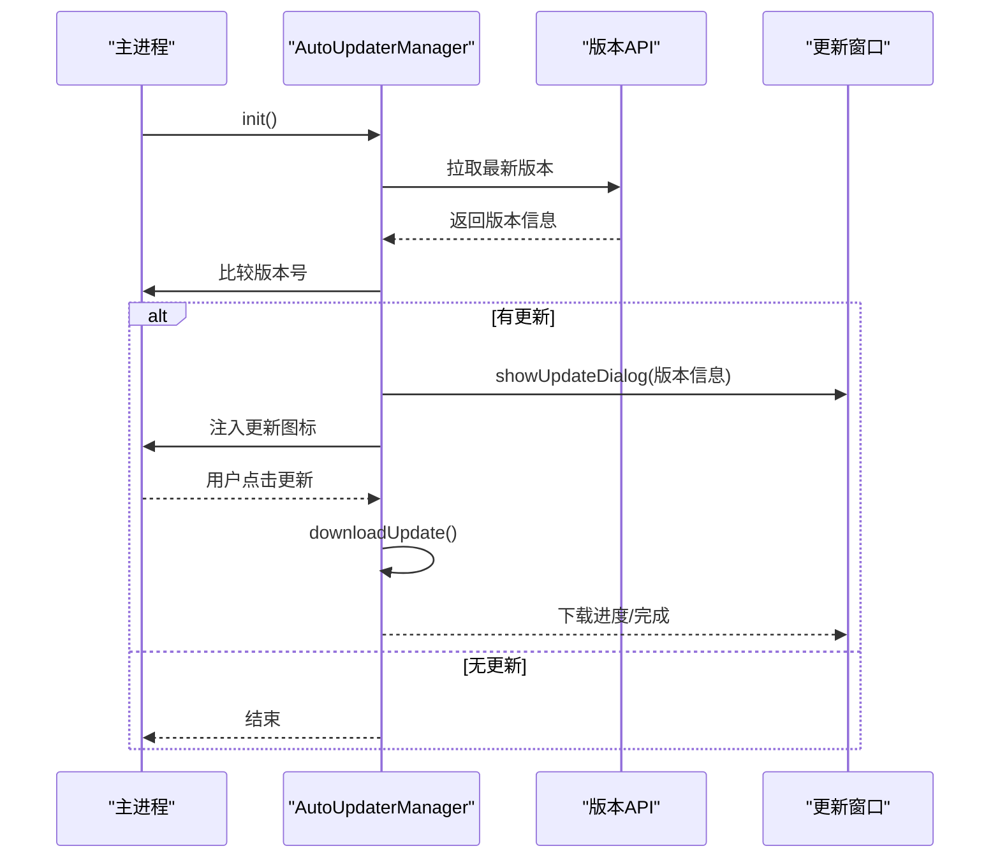
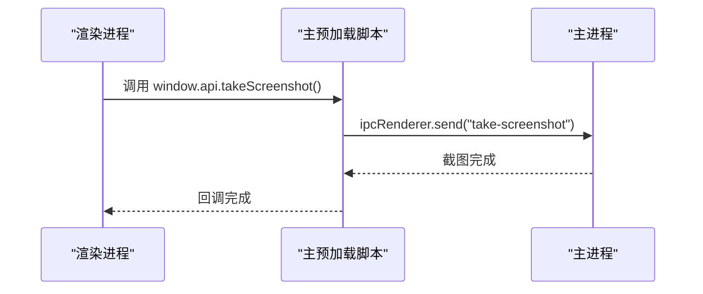
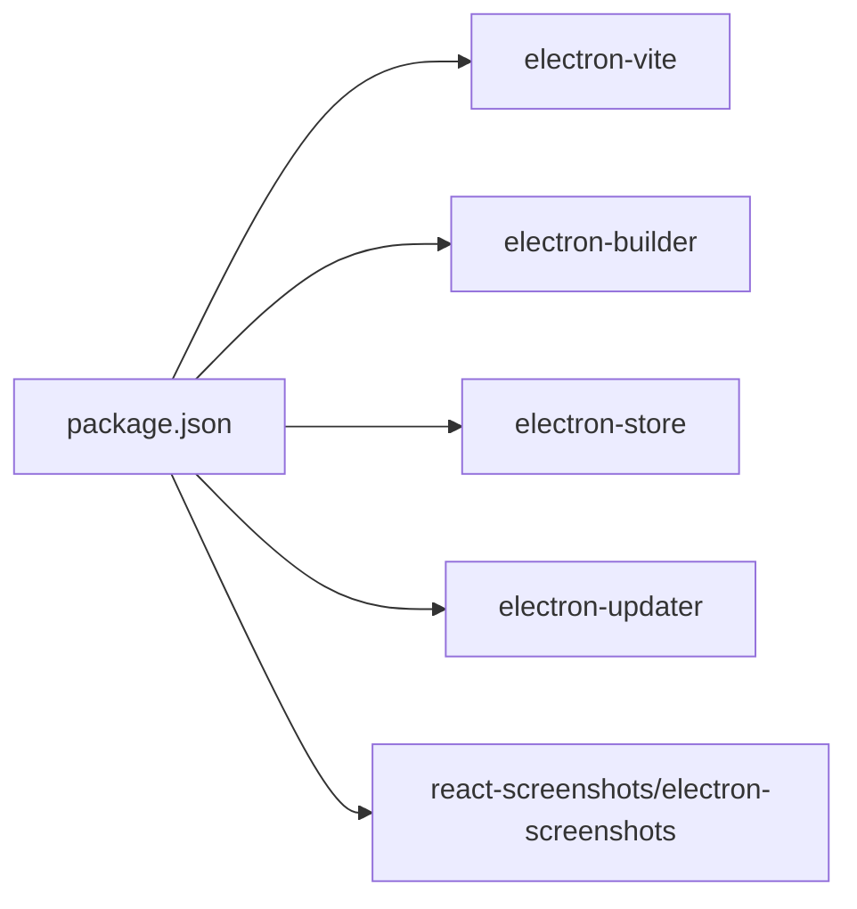

# 项目概述

<cite>
**本文引用的文件**
- [package.json](file://package.json)
- [README.md](file://README.md)
- [ARCHITECTURE.md](file://ARCHITECTURE.md)
- [src/main/index.ts](file://src/main/index.ts)
- [src/main/todo.ts](file://src/main/todo.ts)
- [src/main/screenshot.ts](file://src/main/screenshot.ts)
- [src/main/auto-updater.ts](file://src/main/auto-updater.ts)
- [src/preload/index.ts](file://src/preload/index.ts)
- [src/preload/bubblePreload.ts](file://src/preload/bubblePreload.ts)
- [src/renderer/src/main.ts](file://src/renderer/src/main.ts)
- [src/renderer/src/App.vue](file://src/renderer/src/App.vue)
- [src/renderer/src/bubble.ts](file://src/renderer/src/bubble.ts)
- [src/renderer/src/todo.ts](file://src/renderer/src/todo.ts)
- [electron.vite.config.ts](file://electron.vite.config.ts)
</cite>

## 目录
1. [引言](#引言)
2. [项目结构](#项目结构)
3. [核心组件](#核心组件)
4. [架构总览](#架构总览)
5. [详细组件分析](#详细组件分析)
6. [依赖关系分析](#依赖关系分析)
7. [性能考量](#性能考量)
8. [故障排查指南](#故障排查指南)
9. [结论](#结论)

## 引言
WoaApp 是一个基于 Electron + Vue + TypeScript 的桌面聊天客户端，专为连接金山云办公（WPS）即时通讯服务而设计。它通过多窗口架构与系统深度集成，提供消息气泡提醒、截图工具、待办事项管理、自动更新等核心功能，帮助用户在桌面环境中高效管理沟通与任务。

## 项目结构
项目采用典型的 Electron 多进程架构：
- 主进程负责窗口管理、系统托盘、截图、待办、自动更新、会话与网络策略等系统级能力
- 渲染进程承载多个独立的 UI 窗口（主聊天窗口、气泡提醒窗口、待办窗口、更新窗口）
- 预加载脚本在安全边界内向渲染进程暴露有限 API，实现 IPC 通信桥

```mermaid
graph TB
subgraph "主进程"
M["src/main/index.ts"]
T["src/main/todo.ts"]
S["src/main/screenshot.ts"]
U["src/main/auto-updater.ts"]
end
subgraph "预加载脚本"
P["src/preload/index.ts"]
PB["src/preload/bubblePreload.ts"]
end
subgraph "渲染进程"
R["src/renderer/src/main.ts"]
RB["src/renderer/src/bubble.ts"]
RT["src/renderer/src/todo.ts"]
end
M --> T
M --> S
M --> U
M <- --> P
M <- --> PB
R --> P
RB --> PB
RT --> P
```

图表来源
- [src/main/index.ts](file://src/main/index.ts#L1-L120)
- [src/main/todo.ts](file://src/main/todo.ts#L1-L80)
- [src/main/screenshot.ts](file://src/main/screenshot.ts#L1-L40)
- [src/main/auto-updater.ts](file://src/main/auto-updater.ts#L1-L60)
- [src/preload/index.ts](file://src/preload/index.ts#L1-L40)
- [src/preload/bubblePreload.ts](file://src/preload/bubblePreload.ts#L1-L40)
- [src/renderer/src/main.ts](file://src/renderer/src/main.ts#L1-L7)
- [src/renderer/src/bubble.ts](file://src/renderer/src/bubble.ts#L1-L8)
- [src/renderer/src/todo.ts](file://src/renderer/src/todo.ts#L1-L9)

章节来源
- [README.md](file://README.md#L16-L42)
- [ARCHITECTURE.md](file://ARCHITECTURE.md#L16-L42)

## 核心组件
- 主进程入口与窗口编排：负责创建主窗口、气泡窗口、待办窗口，配置会话与网络策略，注册 IPC 事件，初始化截图与自动更新模块
- 待办事项管理：提供 CRUD 能力、窗口控制、聊天页面脚本注入、未处理数量广播
- 截图功能：全局快捷键触发、框选截图、自动复制到剪贴板、保存对话框
- 自动更新：版本检查、下载进度、更新弹窗、强制/主动/被动更新策略
- 预加载脚本：在安全边界内暴露有限 API，桥接渲染进程与主进程
- 渲染进程：Vue 应用入口与多窗口路由（主窗口、气泡窗口、待办窗口）

章节来源
- [src/main/index.ts](file://src/main/index.ts#L1-L120)
- [src/main/todo.ts](file://src/main/todo.ts#L1-L140)
- [src/main/screenshot.ts](file://src/main/screenshot.ts#L1-L80)
- [src/main/auto-updater.ts](file://src/main/auto-updater.ts#L40-L140)
- [src/preload/index.ts](file://src/preload/index.ts#L1-L63)
- [src/preload/bubblePreload.ts](file://src/preload/bubblePreload.ts#L1-L70)
- [src/renderer/src/main.ts](file://src/renderer/src/main.ts#L1-L7)
- [src/renderer/src/bubble.ts](file://src/renderer/src/bubble.ts#L1-L8)
- [src/renderer/src/todo.ts](file://src/renderer/src/todo.ts#L1-L9)

## 架构总览
WoaApp 采用经典的 Electron 多进程架构，主进程统一管理窗口与系统资源，渲染进程专注 UI，预加载脚本提供安全的 IPC 桥接。整体设计强调模块化与可扩展性，支持多窗口协同与外部服务集成。

```mermaid
graph TB
subgraph "主进程"
MP["主进程"]
WM["窗口管理"]
SYS["系统集成<br/>托盘/快捷键/通知"]
NET["网络与会话<br/>WPS集成/WebSocket监听"]
DATA["数据持久化<br/>electron-store/Session"]
end
subgraph "渲染进程"
RW["主窗口渲染<br/>聊天界面"]
BW["气泡窗口渲染<br/>消息提醒"]
TW["待办窗口渲染<br/>CRUD界面"]
UW["更新窗口渲染<br/>版本弹窗"]
end
subgraph "预加载脚本"
PP["主预加载脚本"]
BP["气泡预加载脚本"]
end
MP --> WM
MP --> SYS
MP --> NET
MP --> DATA
MP <- --> PP
MP <- --> BP
PP --> RW
PP --> BW
PP --> TW
PP --> UW
BP --> BW
```

图表来源
- [README.md](file://README.md#L16-L42)
- [ARCHITECTURE.md](file://ARCHITECTURE.md#L16-L42)
- [src/main/index.ts](file://src/main/index.ts#L270-L360)
- [src/preload/index.ts](file://src/preload/index.ts#L17-L43)
- [src/preload/bubblePreload.ts](file://src/preload/bubblePreload.ts#L3-L40)

## 详细组件分析

### 主进程与窗口编排
- 单实例锁、托盘图标与菜单、窗口生命周期管理
- 会话持久化与网络策略配置（UA、权限、证书、请求拦截）
- 页面加载与脚本注入（聊天页面、待办脚本、表情模糊脚本）
- 气泡窗口位置与置顶策略、移动事件持久化



图表来源
- [src/main/index.ts](file://src/main/index.ts#L92-L120)
- [src/main/index.ts](file://src/main/index.ts#L275-L360)
- [src/main/index.ts](file://src/main/index.ts#L617-L764)

章节来源
- [src/main/index.ts](file://src/main/index.ts#L1-L2406)

### 待办事项管理
- TodoManager 负责窗口、数据与 IPC 事件
- 聊天页面脚本注入：侧边栏插入“待办”图标、右键菜单“添加到待办”
- 未处理数量广播与角标更新
- 本地存储（electron-store）持久化



图表来源
- [src/main/todo.ts](file://src/main/todo.ts#L20-L155)

章节来源
- [src/main/todo.ts](file://src/main/todo.ts#L1-L266)

### 截图功能
- 全局快捷键 Alt+Shift+A 触发框选截图
- 截图完成自动复制到剪贴板，支持保存对话框
- 页面注入截图按钮，便于手动触发
- 清理与资源释放



图表来源
- [src/main/screenshot.ts](file://src/main/screenshot.ts#L16-L96)

章节来源
- [src/main/screenshot.ts](file://src/main/screenshot.ts#L1-L158)

### 自动更新
- 版本检查、下载进度、更新弹窗、重启安装
- 强制/主动/被动三种更新策略
- 注入更新图标到聊天页面，托盘菜单提示
- 开发/生产环境差异化处理



图表来源
- [src/main/auto-updater.ts](file://src/main/auto-updater.ts#L59-L140)
- [src/main/auto-updater.ts](file://src/main/auto-updater.ts#L272-L353)

章节来源
- [src/main/auto-updater.ts](file://src/main/auto-updater.ts#L1-L565)

### 预加载脚本与 IPC 桥
- 主预加载脚本暴露安全 API（截图、待办、表情模糊、自动更新）
- 气泡预加载脚本监听消息与通知模式，处理鼠标事件与开发者工具
- 渲染进程通过 window.api/window.electron 访问主进程能力



图表来源
- [src/preload/index.ts](file://src/preload/index.ts#L17-L43)
- [src/preload/bubblePreload.ts](file://src/preload/bubblePreload.ts#L5-L40)

章节来源
- [src/preload/index.ts](file://src/preload/index.ts#L1-L63)
- [src/preload/bubblePreload.ts](file://src/preload/bubblePreload.ts#L1-L70)

### 渲染进程与 Vue 应用
- 主窗口入口：创建 Vue 应用并挂载
- 气泡窗口入口：独立的 Vue 组件树
- 待办窗口入口：独立的 Vue 组件树
- App.vue 作为通用演示组件

章节来源
- [src/renderer/src/main.ts](file://src/renderer/src/main.ts#L1-L7)
- [src/renderer/src/App.vue](file://src/renderer/src/App.vue#L1-L27)
- [src/renderer/src/bubble.ts](file://src/renderer/src/bubble.ts#L1-L8)
- [src/renderer/src/todo.ts](file://src/renderer/src/todo.ts#L1-L9)

## 依赖关系分析
- 构建与打包：electron-vite 作为开发与构建工具，electron-builder 作为打包工具
- 运行时依赖：electron-store 用于本地存储，electron-updater 用于自动更新，截图相关依赖用于截图功能
- 开发依赖：TypeScript、Vue、ESLint、Prettier 等



图表来源
- [package.json](file://package.json#L25-L53)

章节来源
- [package.json](file://package.json#L1-L55)
- [electron.vite.config.ts](file://electron.vite.config.ts#L1-L60)

## 性能考量
- 内存管理：及时清理定时器与事件监听器，控制消息缓存数量，合理管理窗口生命周期
- 渲染性能：Vue 组件按需加载，气泡窗口使用 showInactive 避免抢焦点，背景节流禁用以保证提醒体验
- 网络性能：会话持久化与权限放宽以提升用户体验，建议在生产环境重新评估安全配置

章节来源
- [README.md](file://README.md#L434-L449)
- [ARCHITECTURE.md](file://ARCHITECTURE.md#L434-L449)

## 故障排查指南
- 页面加载失败：主进程会尝试备用 URL 或显示本地提示页，检查网络与证书策略
- 登录重定向失败：主进程内置检查器定期轮询，确保登录状态正确传递
- 截图功能异常：确认全局快捷键注册、ESC 取消逻辑、保存对话框权限
- 自动更新失败：检查 API 地址、下载进度回调、latest.yml 下载与解析
- 安全配置风险：当前配置为开发便利降低安全级别，建议在生产环境启用 contextIsolation 并严格暴露 API

章节来源
- [src/main/index.ts](file://src/main/index.ts#L520-L615)
- [src/main/screenshot.ts](file://src/main/screenshot.ts#L16-L96)
- [src/main/auto-updater.ts](file://src/main/auto-updater.ts#L224-L252)
- [README.md](file://README.md#L402-L432)
- [ARCHITECTURE.md](file://ARCHITECTURE.md#L402-L432)

## 结论
WoaApp 通过 Electron + Vue + TypeScript 的技术栈，结合多窗口与预加载脚本的架构设计，实现了与 WPS 即时通讯服务的深度集成。其模块化与可扩展性为后续功能迭代提供了良好基础，建议在生产环境中加强安全配置与错误处理，进一步完善测试与文档体系。